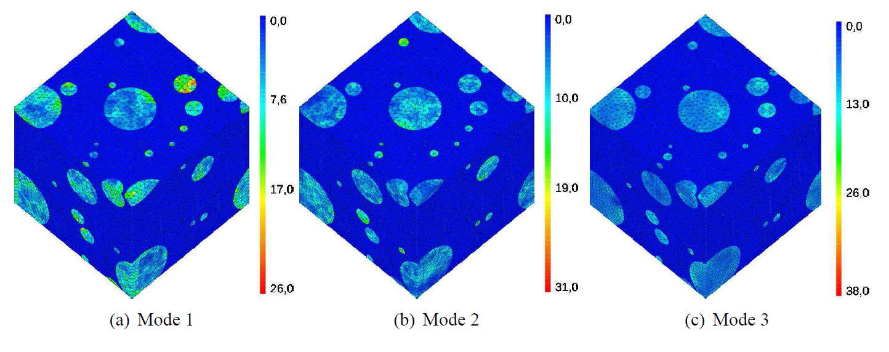
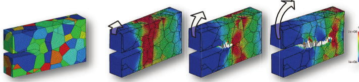
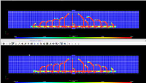
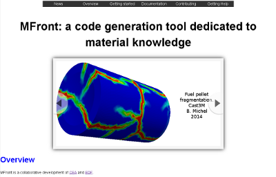

% Présentation de `MFront`: applications aux lois de comportement mecanique et mesure de performance à l'aide de `Code-Aster`
% Thomas Helfer, Jean-Michel Proix, Bruno Michel
% Novembre 2014

# Introduction : un premier exemple

## Implantation d'une loi de plasticité isotrope

~~~~~ {.cpp}
@DSL IsotropicPlasticMisesFlow; //< domain specific language
@Behaviour Plasticity;          //< name of the behaviour
@Parameter  H  = 22e9;          //< hardening slope
@Parameter s0 = 200e6;          //< elasticity limit
@FlowRule{                      //< flow rule
  f       = seq-H*p-s0;
  df_dseq = 1;
  df_dp   = -H;
}
~~~~~~~~~~~~

- formulation *spécifique*, la surface de charge est définie par:
  \[\sigma_{\text{eq}} \leq H\,p+\sigma_{0}\]
- deux «langages» sont dédiés aux schémas d'intégrations explicite
  (Runge-Kutta) et implicite (voir
  [plus loin](#benchmarks-avec-code-aster)):
    - On dispose alors d'un *formalisme tensoriel optimisé*
	- On traite des lois en **petites ou grandes transformations**, des
      **modèles de zones cohésives**
	- On a déjà traité des lois d'endommagement, de plasticité, de
      viscoplasticité, incluant des changements de phases, etc..

## Interfaces

- à partir d'un fichier *unique*, `MFront` va générer des sources
  *spécifiques* aux différents solveurs
- les librairies générées peuvent être appelés depuis:
    - différents codes aux éléments finis
	  (*aujourd'hui* [`Cast3M`](http://www-cast3m.cea.fr),
	   [`Code_Aster`](http://www.code-aster.org),
	   [`ZeBuLoN`](http://www.zset-software.com/products/zebulon))
    - des codes d'homogénéisation par FFT
	- différents languages (`fortran`, `C` ou `C++`)
    - la liste est **extensible** !

# MFront: objectifs et exemples

## Performances et capitalisation

- `MFront` a été développé dans le cadre de la simulation des
  combustibles nucléaires au sein du projet `PLEIADES` dans un cadre
  **assurance qualité** strict.
- **gérer** et **mutualiser** les connaissances matériau : *quel que
soit le langage ou la méthode de résolution* du code cible :
    - les propriétés matériau (module d'`Young` etc...) ;
    - les lois de comportements mécaniques (viscoplasticité,
      plasticité, endommagement) ;
    - les modèles (gonflement, évolution physico-chimique) ;
- **simplifier** le travail des utilisateurs:
    - temps d'implantation réduit
	- minimum de détails informatique ou numérique
- **atteindre** des *performances compatibles avec des besoins
  industriels* ;

## Quelques dates

- 2006 : début du développement de `MFront`
- 2009 : intégration à la plate-forme `PLEIADES`
- 2013 : début du benchmark par l'équipe de `Code-Aster`
- 2014 : mise en open-source de `MFront`

## Homogénéisation des combustibles nucléaires

- Amas plutonifère dans une matrice uraninifère:
    - NTFA (Michel et al., Roussette et al.): , Largenton et al.
    - MOX 2 phases et MOX 3 phases: Ricaud et al.
- Effet de la porosité:
	- viscoplastique compressible (Michel et al.,Monerie et al.):
      Salvo et al.

## Lois cristallines

- *Approche micromécanique du comportement du
  combustible nucléaire*. J. Soulacroix. Soutenance de thèse :
     - voir la présentation *Microfissuration induite par la
       viscoplasticité dans les céramiques nucléaires* par B Michel ;

## Lois cristallines (II)

- *Modélisation de la fissuration inter-granulaire par corrosion sous
  contraintes pour les aciers inoxydables*. T. Couvant, S. Meunier,
  D. Haboussa, J.-M. Proix. Présentation à la journée des Utilisateurs
  de `Salome-Meca` et `Code_Aster 2014` ;

## Lois cristallines (III)

- *Quelques exemples d’utilisation de lois de comportement en grandes
  déformations générées avec l’outil `MFront`*. J. Hure, M. Callahan,
  C. Ling, B. Tanguy, T. Helfer. Club `Cast3M` 2014.

# Mesure de performances

## Exemples

---------------------------------------------------------------------------------------------------------------------------------------------------------------------
          Description                                                      Algorithme                         Temps CPU total                       Illustration
		                                                                                                    (`Aster` vs `MFront`)
-------------------------------------------------------------------  -------------------------         ------------------------------- ------------------------------
Visco-plastic and damaging for steel                                     `Implicit`                       \(17mn 43s\) vs \(7mn 58s\)    
[@mustata_creep_2005;@edf_comportement_2012]

Damaging for concrete                                                    `Default`                        \(45mn\) vs \(63mn\)           
[@mazars_new;@edf_modeendommagement_2013]	                         			                      
												                         			                      
Generic Single crystal viscoplasticity                                   `Implicit`                       \(28mn\) vs \(24mn\)           
[@meric_single_1991;@edf_comportements_2013-1]                      			                      
-----------------------------------------------------------------------------------------------------------------------------------------------------------------------

## Exemples (II)

---------------------------------------------------------------------------------------------------------------------------------------------------------------------
          Description                                                      Algorithme                         Temps CPU                       Illustration
-------------------------------------------------------------------  -------------------------         ------------------------------- ------------------------------
FCC single crystal viscoplasticity                                       `Implicit`                       \(33m54s\) vs \(29m30s\)       
[@monnet_orowan_2011@edf_comportements_2013-1]

FCC homogeneized polycrystals 30 grains                                 `Runge-Kutta 4/5`                  \(9s67\) vs \(8s22\)          
[@berveiller_extension_1978;@edf_comportements_2013-1]

Anisotropic creep with phase transformation                            `Implicit`                         \(180s\) vs \(171s\)           
[@edf_modecomportement_2013]
-----------------------------------------------------------------------------------------------------------------------------------------------------------------------

## Quelques conclusions

Ces différents tests permettent de dresser les tendances suivantes :

- les implantations natives sont plus rapides et plus robustes:
    - pour les lois explicites (Mazars,etc ...)
    - pour celles dont l'intégration se résume à la résolution d'une
      équation scalaire non linéaire (méthode de Brent
      [voir @brent_algorithms_1973]).
- Pour des lois plus complexes:
    - `MFront` est aussi ou plus efficace que des lois natives
	- les algorithmes disponibles permettent une plus grande
      robustesse (`Powell` dogleg, `Levenberg-Marquardt`, etc..).
- Pour une loi donnée, le temps de développement est significativement
plus court avec `MFront`.

# Conclusions

## Perspectives

- coté `MFront`: 
    - toujours plus simple, plus performant, plus robuste etc...
	- toujours plus de tests unitaires (plus de 600 actuellement)
	- support de nouveaux solveurs
- lien avec l'identification de paramètres
	- `MFront` + `MTest` (simulation d'un point matériel) et `Adao`
	- `MTest` et `Matlab`
- coté code appelant, `MFront` permet de simplifier la mise en donnée
    - travaux en cours coté `Code-Aster`, `Cyrano3`, etc..

## Appel à contributions

- `MFront` a été mise en open-source (GPL,CECILL-A) en Octobre 2014:
  <http://tfel.sourceforge.net>
- Nous invitons toutes les personnes intéressées à tester `MFront`,
  contribuer, créer une communauté, etc...
- Merci pour votre attention

## Références

<!-- pandoc -s -f markdown+tex_math_single_backslash --toc --toc-depth=1 --bibliography=bibliography.bib --filter pandoc-citeproc --slide-level 2 --mathjax -t revealjs -V theme:beige -H mysettings.css -A reveal-config.html --default-image-extension=svg --mathjax=MathJax-2.4-latest/MathJax.js?config=TeX-AMS-MML_HTMLorMML mfront.md -o mfront.html -->
<!-- pandoc -s -f markdown+tex_math_single_backslash --toc --toc-depth=1 --bibliography=bibliography.bib --filter pandoc-citeproc --slide-level 2 -i  -t beamer -V theme:cea2012 --default-image-extension=pdf mfront.md -o mfront.pdf -->
