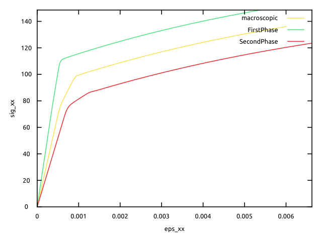

% Implementation of Cailletaud-Pilvin beta rule for homogenization
% Helfer Thomas/Martin Antoine
% February 10, 2025

\newcommand{\D}{\mathrm{d}}
\newcommand{\tenseur}[1]{\underline{#1}}
\newcommand{\tensq}[1]{\underline{\mathbf{#1}}}
\newcommand{\dbldot}{\mathbin{\mathord{:}}}
\newcommand{\reals}{\mathbb R}

\newcommand{\tsigma}{\underline{\sigma}}
\newcommand{\dtsigma}{\Delta{\underline{\sigma}}}
\newcommand{\sigmaeq}{\sigma_{\mathrm{eq}}}
\newcommand{\tSigma}{\underline{\Sigma}}
\newcommand{\dtsigma}{\Delta{\underline{\Sigma}}}

\newcommand{\tepsilonto}{\underline{\epsilon}^{\mathrm{to}}}
\newcommand{\dtepsilonto}{\Delta\underline{\epsilon}^{\mathrm{to}}}
\newcommand{\tepsilon}{\underline{\epsilon}}
\newcommand{\tepsilonel}{\underline{\epsilon}^{\mathrm{el}}}
\newcommand{\dtepsilonel}{\Delta\underline{\epsilon}^{\mathrm{el}}}
\newcommand{\tEel}{\underline{E}^{\mathrm{el}}}
\newcommand{\dtEel}{\Delta\underline{E}^{\mathrm{el}}}

\newcommand{\tepsilonvp}{\underline{\epsilon}^{\mathrm{vp}}}
\newcommand{\dtepsilonvp}{\Delta\underline{\epsilon}^{\mathrm{vp}}}
\newcommand{\tdepsilonvp}{\underline{\dot{\epsilon}}^{\mathrm{vp}}}
\newcommand{\tdbeta}{\underline{\dot{\beta}}}
\newcommand{\tbeta}{\underline{\beta}}
\newcommand{\dtbeta}{\Delta{\underline{\beta}}}

\newcommand{\Frac}[2]{{\displaystyle \frac{\displaystyle #1}{\displaystyle #2}}}
\newcommand{\deriv}[2]{{\displaystyle \frac{\displaystyle \partial #1}{\displaystyle \partial #2}}}

\newcommand{\bts}[1]{\left.#1\right|_{t}}
\newcommand{\mts}[1]{\left.#1\right|_{t+\theta\,\Delta\,t}}
\newcommand{\ets}[1]{\left.#1\right|_{t+\Delta\,t}}

This tutorial explains how to implement Cailletaud-Pilvin $\beta$-rule [@cailletaud_pilvin_1994]
in the context of elasto-viscoplastic composites using an arbitrary local flow function.
In this tutorial, a local behaviour of Meric-Cailletaud type [@meric_single_1991] is proposed.

Here, the implementation of this homogenization scheme requires the local tangent operators,
obtained via the integration of a local `Behaviour`.

We first recall Cailletaud-Pilvin $\beta$-rule and present the non-linear system derived from it.
We then implement it in `MFront` and explain how to use the keyword `@BehaviourVariable`
for the integration of the local behaviours.

# Theoretical background

## Cailletaud-Pilvin beta rule

We consider a composite made of $N$ phases indexed by $i$.
Cailletaud-Pilvin $\beta$-rule was proposed in the context of elasto-viscoplastic composites for which
strain partition is assumed:
\begin{aligned}
  \tepsilonto_i=\tepsilonel_i+\tepsilonvp_i \\
\end{aligned}
where the strain $\tepsilonel_i$ is given by Hooke's law:
\begin{aligned}
  \tepsilonel_i=\tensq S_i\dbldot\tsigma_i \\
\end{aligned}
where $\tensq S_i$ is a fourth-rank compliance tensor
and $\tsigma_i$ is the stress field; and  where the viscoplastic strain
$\tepsilonvp_i$ is given by the following flow rule:
\begin{aligned}
  \tdepsilonvp_i=f_i(\tsigma_i) \\
\end{aligned}
where $f_i$ is a non-linear function.

Assuming that $\phi_i$ is volume fraction of phase $i$,
the macroscopic strain field is defined as
\begin{aligned}
\tenseur E= \sum_i \phi_i \tepsilonto_i \\
\end{aligned}
and is given as a parameter.

In this context, the proposition is to
introduce an internal variable $\tenseur\beta_i$ on each phase,
whose evolution is given by
\begin{aligned}
 \tdbeta_i= \tdepsilonvp_i-D\,||\tdepsilonvp_i||\,\tbeta_i \\
\end{aligned}
where $D\in\reals$ is a parameter and
\begin{aligned}
  ||\tdepsilonvp_i||=\sqrt{\dfrac 23 \tdepsilonvp_i\dbldot\tdepsilonvp_i}. \\
\end{aligned}
The localisation relation is also proposed:
\begin{aligned}
 \tsigma_i= \tSigma + c\,(\tenseur B-\tenseur\beta_i) \\
\end{aligned}
where $c$ is a real parameter, $\tenseur B$ is a macroscopic
variable:
\begin{aligned}
\tenseur B= \sum_i \phi_i\tenseur\beta_i\\
\end{aligned}
and $\tSigma$ is the macroscopic stress, which verifies (by averaging the localisation relation)
\begin{aligned}
\tSigma= \sum_i \phi_i\tsigma_i\\
\end{aligned}

## Resolution of the non-linear system

We discretize the time interval and look for the increment of the variables.
We choose $\dtepsilonto_i$, $\dtbeta_i$ and $\dtsigma$ as unknowns of our non-linear
system:

$\left\{
\begin{aligned}
&\sum_{i=1}^{N}\phi_i\,\dtepsilonto_i - \Delta\tenseur E = 0\\
&\dtsigma_i\left(\tepsilonto_i,\dtepsilonto_i\right)-\dtsigma  - c\,(\Delta\tenseur B-\Delta\tenseur\beta_i) = 0\qquad\forall i\\
&\Delta\tenseur\beta_i - \Delta\tepsilonvp_i\left(\tepsilonto_i,\dtepsilonto_i\right)+ D\,||\Delta\tepsilonvp_i\left(\tepsilonto_i,\dtepsilonto_i\right)||\,(\tenseur\beta_i+\theta\Delta\tenseur\beta_i)=0\qquad\forall i\\
  \end{aligned}\right.$
  
where the following auxiliary variable is introduced:

$\begin{aligned}
&\Delta\tenseur B = \sum_{i=1}^{N}\phi_i\,\Delta\tenseur\beta_i\\
  \end{aligned}$
and where $\dtsigma_i\left(\tepsilonto_i,\dtepsilonto_i\right)$ and $\Delta\tepsilonvp_i\left(\tepsilonto_i,\dtepsilonto_i\right)$
are obtained with the integration of the local behaviours. Indeed,
we have $\dtepsilonvp_i\left(\tepsilonto_i,\dtepsilonto_i\right)=\dtepsilonto_i-\tenseur S_i\dbldot\dtsigma_i\left(\tepsilonto_i,\dtepsilonto_i\right)$.
Note that the local elastic strain can also be computed with
this local integration.

To solve this non-linear problem in `MFront`, we use
the `ImplicitII` `DSL` (because we do not consider $\tepsilonel$ as an integration variable). We only have to precise the residues and the Jacobian matrix.
The residues are:

$\left\{
\begin{aligned}
&f_{\tenseur E}=\sum_{i=1}^{N}\phi_i\,\dtepsilonto_i - \Delta\tenseur E\\
&f_{\tepsilonto_i} =\frac{1}{\sigma_0}\left[\dtsigma_i\left(\tepsilonto_i,\dtepsilonto_i\right)-\dtsigma  - c\,(\Delta\tenseur B-\Delta\tenseur\beta_i)\right] \qquad \forall i\\
&f_{\tbeta_i} =\Delta\tenseur\beta_i - \Delta\tepsilonvp_i\left(\tepsilonto_i,\dtepsilonto_i\right)+D\,||\Delta\tepsilonvp_i\left(\tepsilonto_i,\dtepsilonto_i\right)||\,(\tenseur\beta_i+\theta\Delta\tenseur\beta_i) \qquad \forall i\\
    \end{aligned}\right.$
    
where $\sigma_{0}$ is a parameter that give the same dimension and magnitude to the residues.
The jacobian matrix is given by
  
 $\left\{
\begin{aligned}
&\deriv{f_{\tenseur E}}{\dtsigma} = \tensq 0\\
&\deriv{f_{\tenseur E}}{\Delta\tepsilonto_j} = \phi_j\tensq I\qquad \forall j\\
&\deriv{f_{\tenseur E}}{\dtbeta_j} = \tensq 0\qquad \forall j\\
&\deriv{f_{\tepsilonto_i}}{\dtsigma} = -\frac{1}{\sigma_0}\tensq I\qquad \forall i\\
&\deriv{f_{\tepsilonto_i}}{\dtepsilonto_j} = \frac{\delta_{ij}}{\sigma_0}\,\deriv{\tsigma_j}{\tepsilonto_j}\left(\tepsilonto_j,\dtepsilonto_j\right)\qquad\forall i,j\\
&\deriv{f_{\tepsilonto_i}}{\dtbeta_j} = \frac{c}{\sigma_0}\,(\delta_{ij}-\phi_j)\tensq I\qquad \forall i,j\\
&\deriv{f_{\tbeta_i}}{\dtsigma} = \tensq 0\qquad \forall i\\
&\deriv{f_{\tbeta_i}}{\dtepsilonto_j} = -\delta_{ij}\,\deriv{\tsigma_j}{\tepsilonto_j}\left(\tepsilonto_j,\dtepsilonto_j\right)+D\,(\tenseur\beta_i+\theta\Delta\tenseur\beta_i)\otimes\deriv{||\dtepsilonvp_i||}{\dtepsilonto_j}\qquad \forall i,j\\
&\deriv{f_{\tbeta_i}}{\dtbeta_j} = \left(1+\theta\,D\,||\Delta\tepsilonvp_i||\right)\,\delta_{ij}\,\tensq I \qquad \forall i,j\\
  \end{aligned}\right.$
  
  where $||\dtepsilonvp_i||$ is used for $||\dtepsilonvp_i\left(\tepsilonto_i,\dtepsilonto_i\right)||$. Moreover,
  
  $\left\{
  \begin{aligned}
  \deriv{||\dtepsilonvp_i||}{\dtepsilonto_j}&=\frac 23\delta_{ij}\Frac{\dtepsilonvp_i}{||\dtepsilonvp_i||}\dbldot\deriv{\dtepsilonvp_i}{\dtepsilonto_j}\left(\tepsilonto_i,\dtepsilonto_i\right)\\
  &=\frac 23\delta_{ij}\Frac{\dtepsilonvp_i}{||\dtepsilonvp_i||}\dbldot\left(\deriv{\dtepsilonto_i}{\dtepsilonto_j}-\deriv{\dtepsilonel_i}{\dtepsilonto_j}\right)\\
  &=\frac 23\delta_{ij}\Frac{\dtepsilonvp_i}{||\dtepsilonvp_i||}\dbldot\left(\delta_{ij}\tensq I-\delta_{ij}\tensq S_j\dbldot\deriv{\dtsigma_j}{\dtepsilonto_j}\right)\\
  \end{aligned}\right.$
  
 We can see the term $\deriv{\dtsigma_j}{\dtepsilonto_j}$, that will be provided by the local integration.

## Consistent tangent operator

We can also compute the tangent operator with a method similar as the method explained
in the [Implicit DSL](./implicit-dsl.html) documentation. We define $\Delta Y$ such as
\begin{aligned}
\Delta G_i = (\dtepsilonto_i, \dtbeta_i)\\
\Delta Y = (\dtsigma,\Delta G_1,...,\Delta G_N)\\
\end{aligned}
and $H_i=(f_{\tepsilonto_i},f_{\tbeta_i})$ and $F=(f_{\tenseur E},H_1,...,H_N)$ so that
\begin{aligned}
  F(\Delta\tenseur E,\Delta Y(\Delta\tenseur E))&=0\\
 \end{aligned}
 Hence, the following equality is still verified:
 
 \begin{aligned}
  \deriv{\Delta Y}{\Delta\tenseur E}&=-\mathbf{J}^{-1}\cdot\deriv{F}{\Delta \tenseur E}\\
 \end{aligned}
 
 where $\mathbf{J}=\deriv{F}{\Delta Y}$ is the Jacobian
 of the system.
 
 Given the form of $\deriv{F}{\Delta \tenseur E}$, $\deriv{\dtsigma}{\Delta\tenseur E}$ can be retrieved
 from the $6\times 6$ upper-left submatrix of $\mathbf{J}^{-1}$. 
 
# Implementation in MFront

The implementation requires the integration of the local behaviours.
These are carried out via the `@BehaviourVariable` keyword.
The implementation of the local behaviour is explained [here](./MericCailletaudSingleCrystalPlasticity.html).

All files `MericCailletaudSingleCrystalViscoPlasticity.mfront`, `BetaRule.mfront` and `BetaRule.mtest` are available in the `MFrontGallery` project, [here](https://github.com/thelfer/MFrontGallery/tree/master/generic-behaviours/homogenization/).

For the example, we assume that the composites is made of only 2 phases.
We hence define the integration variables:

~~~~ {#BetaRule .cpp .numberLines}
@StateVariable Stensor Sig;
Sig.setEntryName("MacroscopicStress");
@StateVariable Stensor eto1;
eto1.setEntryName("FirstPhaseTotalStrain");
@StateVariable Stensor eto2;
eto2.setEntryName("SecondPhaseTotalStrain");
@StateVariable Stensor beta1;
beta1.setEntryName("FirstPhaseBetaStrain");
@StateVariable Stensor beta2;
beta2.setEntryName("SecondPhaseBetaStrain");
~~~~

and we define the local behaviours with `@BehaviourVariable`:

~~~~ {#BetaRule .cpp .numberLines}
@BehaviourVariable b1 {
file: "MericCailletaudSingleCrystalViscoPlasticity.mfront",
variables_suffix: "1",
store_gradients: false,
external_names_prefix: "FirstPhase",
shared_external_state_variables: {".+"}
};
~~~~

(the same for phase 2).

We note that the `gradients` are not
stored because the `StateVariable` `eto1` (resp. `eto2`) are
defined. 

The integration of the local behaviour is performed as 
follows:

~~~~ {#BetaRule .cpp .numberLines}
  initialize(b1);
  b1.eto=eto1;
  b1.deto=deto1;
  constexpr auto b1_smflag = TangentOperatorTraits<MechanicalBehaviourBase::STANDARDSTRAINBASEDBEHAVIOUR>::STANDARDTANGENTOPERATOR;
  const auto r1 = b1.integrate(b1_smflag,CONSISTENTTANGENTOPERATOR);
  StiffnessTensor Dt1 = b1.getTangentOperator();
~~~~

and the following variables are stored:

~~~~ {#BetaRule .cpp .numberLines}
  auto dsig1=b1.sig-sig1;
  auto deel1=b1.eel-eel1;
  auto devp1=deto1-deel1;
  auto ndevp_1=sqrt(real(2)/3*devp1|devp1);
  auto beta_mts_1=beta1+theta*dbeta1;
~~~~

The same goes for phase 2.
Here are the residues:

~~~~ {#BetaRule .cpp .numberLines}
  //residues
  auto dB=(1-f)*dbeta1+f*dbeta2;
  fSig = -deto+ (1-f)*deto1+f*deto2;
  feto1 = (dsig1-dSig-c*(dB-dbeta1))/sig_0;
  feto2 = (dsig2-dSig-c*(dB-dbeta2))/sig_0;
  fbeta1 = dbeta1-devp1+DD*ndevp_1*beta_mts_1;
  fbeta2 = dbeta2-devp2+DD*ndevp_2*beta_mts_2;
~~~~

and the terms of the analytical jacobian:

~~~~ {#BetaRule .cpp .numberLines}
  //jacobian matrix
  auto Null = Stensor4{real{}};
  dfSig_ddSig=Null;
  dfSig_ddeto1 = (1-f)*Id;
  dfSig_ddeto2 = f*Id;
  
  dfeto1_ddSig = -Id/sig_0;
  dfeto2_ddSig = -Id/sig_0;
  
  dfeto1_ddeto1 = Dt1/sig_0;
  dfeto2_ddeto2 = Dt2/sig_0;
  
  dfeto1_ddbeta1 = c/sig_0*f*Id;
  dfeto1_ddbeta2 = -c/sig_0*f*Id;
  dfeto2_ddbeta1 = c/sig_0*(f-1)*Id;
  dfeto2_ddbeta2 = c/sig_0*(1-f)*Id;
  
  dfbeta1_ddeto1 = -(Id-S1*Dt1) + 2*DD/3*Stensor4(beta_mts_1^devp1)*Stensor4(Id-S1*Dt1)/max(ndevp_1,eeps);
  dfbeta2_ddeto2 = -(Id-S2*Dt2) + 2*DD/3*Stensor4(beta_mts_2^devp2)*Stensor4(Id-S2*Dt2)/max(ndevp_2,eeps);
  
  dfbeta1_ddbeta1 =Id+ theta*DD*ndevp_1*Id;
  dfbeta2_ddbeta2 =Id+ theta*DD*ndevp_2*Id;
~~~~

Note that `S1` and `S2` are the compliance tensors of each phase and
were defined by the elastic coefficients of each phase.
The computation of the stress and of the tangent operator is straightforward:

~~~~ {#BetaRule .cpp .numberLines}
@ComputeFinalStress{
  sig += dSig;
}

@TangentOperator{
  Stensor4 iJs;
  getPartialJacobianInvert(iJs);
  Dt=iJs;
}
~~~~

Note that `getPartialJacobianInvert(iJs)` permits to obtain the 6x6 left-upper part of the
inverse of the Jacobian. The left-upper part is associated with the first
integration variable declared (here `Sig`).

# Results

We used `MTest` to carry out
simulations of an uniaxial tensile test on a two-grain polycrystal.
The first phase is stiffer than the second, and we also choose for the
example a different Norton exponent between the phases.
The following values are given by the `mtest` file:

~~~~ {#BetaRule .mtest .numberLines}
@ModellingHypothesis 'Tridimensional';
@Behaviour<Generic> 'src/libBehaviour.so' 'BetaRuleBehaviour';
@MaterialProperty<constant> 'FirstPhaseFraction' 0.5;
@MaterialProperty<constant> 'E_1'               208000;
@MaterialProperty<constant> 'nu_1'               0.3;
@MaterialProperty<constant> 'mu_1'               80000;
@MaterialProperty<constant> 'E_2'               104000;
@MaterialProperty<constant> 'nu_2'               0.3;
@MaterialProperty<constant> 'mu_2'               40000;
@MaterialProperty<constant> 'tau01'               36.;
@MaterialProperty<constant> 'tau02'               25.;
@MaterialProperty<constant> 'n1'               10.;
@MaterialProperty<constant> 'n2'               5.;
@ExternalStateVariable 'Temperature' 293.15;
@ImposedStrain 'EXX' {0 : 0, 5 :1e-2};
@Times {0, 3 in 400};
~~~~~~~~~~~~~~

Note that the elastic behaviours are isotropic for the example.
(the file is available in the [archive](downloads/BetaRule.zip)).
We plotted here the macroscopic and local behaviours ($\tsigma_i$ as
a function of $\tepsilon_i$).

# Implementation with static condensation

When a huge number of phases are involved in the microstructure, the non-linear system previously presented becomes huge
and the static condensation permits to handle this high number of unknowns.
Indeed, the linear system resolved at each step of the Newton algorithm is reduced by using only the macroscopic variables
$\Delta\tenseur B$ and $\Delta\tenseur \Sigma$ as unknowns in this system. The increments of the local unknowns are deduced afterwards.

## Non-linear system

We first choose our unknowns to be $\Delta\tenseur B$, $\Delta\tenseur \Sigma$, $\dtepsilonto_i$
and $\Delta\tenseur \beta_i$.
The corresponding residues are
\begin{aligned}
&\tenseur r_{\tenseur B}=\Delta\tenseur B-\sum_i f_i \Delta\tenseur \beta_i\\
&\tenseur r_{\tenseur E}=\sum_i f_i \dtepsilonto_i-\Delta\tenseur E\\
&\tenseur r_{\tepsilon_i}=\frac{1}{\sigma_0}\left[\dtsigma_i\left(\tepsilonto_i,\dtepsilonto_i\right)-\Delta\tenseur\Sigma  - c\,(\Delta\tenseur B-\Delta\tenseur\beta_i)\right]\qquad (\forall \alpha)\\
&\tenseur r_{\tenseur\beta_i}=\Delta\tenseur\beta_i-\dtepsilonvp_i\left(\tepsilonto_i,\dtepsilonto_i\right)+D\,||\dtepsilonvp_i\left(\tepsilonto_i,\dtepsilonto_i\right)||\,\tenseur \beta_i\qquad (\forall \alpha)\\
\end{aligned}

## Static condensation

Here we want to reduce our system and choose
$\Delta\tenseur B$, $\Delta\tenseur \Sigma$ as the main unkonwns.

To that extent, we first express the Newton-Raphson increments
$\delta\dtepsilonto_i$ and $\delta\Delta\tenseur\beta_i$ as functions
of the increments $\delta\Delta\tenseur B$ and $\delta\Delta\tenseur \Sigma$. We have

$-\tenseur r_{\tepsilon_i}=\dfrac{\partial \tenseur r_{\tepsilon_i}}{\partial \Delta\tenseur B}\dbldot\delta\Delta\tenseur B+\dfrac{\partial \tenseur r_{\tepsilon_i}}{\partial \Delta\tenseur \Sigma}\dbldot\delta\Delta\tenseur\Sigma+\dfrac{\partial \tenseur r_{\tepsilon_i}}{\partial \Delta\tenseur \beta_i}\dbldot\delta\Delta\tenseur\beta_i+\dfrac{\partial \tenseur r_{\tepsilon_i}}{\partial \Delta\tepsilon_i}\dbldot\delta\Delta\tepsilonto_i$

with

\begin{aligned}
&\dfrac{\partial \tenseur r_{\tepsilon_i}}{\partial \Delta\tenseur B}=-\frac{c}{\sigma_0}\,\tensq I, \qquad\qquad
\dfrac{\partial \tenseur r_{\tepsilon_i}}{\partial \Delta\tenseur \Sigma}=-\frac{1}{\sigma_0}\,\tensq I \\
&\dfrac{\partial \tenseur r_{\tepsilon_i}}{\partial \Delta\tenseur \beta_i} =\frac{c}{\sigma_0}\,\tensq I,\qquad\qquad
\dfrac{\partial \tenseur r_{\tepsilon_i}}{\partial \dtepsilonto_i} =\frac{1}{\sigma_0}\,\dfrac{\partial\dtsigma_i}{\partial\dtepsilonto_i} \\
\end{aligned}

Let us now do the same with the second residue:

$-\tenseur r_{\tenseur\beta_i}=\dfrac{\partial \tenseur r_{\tenseur \beta_i}}{\partial \Delta\tenseur \beta_i}\dbldot\delta\Delta\tenseur\beta_i+\dfrac{\partial \tenseur r_{\tenseur \beta_i}}{\partial \Delta\tepsilonto_i}\dbldot\delta\Delta\tepsilonto_i$

with
\begin{aligned}
&\dfrac{\partial \tenseur r_{\tenseur \beta_i}}{\partial \Delta\tenseur \beta_i} =\left(1+\theta\,D\,||\Delta\tepsilonvp_i||\right)\tensq I\\
&\dfrac{\partial \tenseur r_{\tenseur \beta_i}}{\partial \Delta\tepsilonto_i} = \left(\frac {2D}3\,{\tenseur \beta_i|}_{t+\theta\Delta t}\otimes\tenseur n_i-\tensq I\right)\dbldot\dfrac{\partial\tepsilonvp_i}{\partial\Delta\tepsilonto_i},\qquad\tenseur n_i&=\dfrac{\Delta\tepsilonvp_i}{||\Delta\tepsilonvp_i||}\\
\end{aligned}
and $\tensq I$ is the fourth-rank identity tensor.

Due to its form, $\dfrac{\partial \tenseur r_{\tenseur \beta_i}}{\partial \Delta\tenseur \beta_i}$ is invertible. Hence,

$\delta\Delta\tenseur\beta_i=-\left(\dfrac{\partial \tenseur r_{\tenseur \beta_i}}{\partial \Delta\tenseur \beta_i}\right)^{-1}\dbldot\left[\tenseur r_{\tenseur\beta_i}+\dfrac{\partial \tenseur r_{\tenseur \beta_i}}{\partial \Delta\tepsilonto_i}\dbldot\delta\Delta\tepsilonto_i\right]$

and this can be put into the residue $r_{\tepsilon_i}$:

$-\tenseur r_{\tepsilon_i}-\dfrac{\partial \tenseur r_{\tepsilon_i}}{\partial \Delta\tenseur B}\dbldot\delta\Delta\tenseur B-\dfrac{\partial \tenseur r_{\tepsilon_i}}{\partial \Delta\tenseur \Sigma}\dbldot\delta\Delta\tenseur\Sigma=\tensq a_i\dbldot\delta\Delta\tenseur \varepsilon_i+\tenseur b_i$

with
$\tensq a_i=-\dfrac{\partial \tenseur r_{\tepsilon_i}}{\partial \Delta\tenseur \beta_i}\dbldot\left(\dfrac{\partial \tenseur r_{\tenseur \beta_i}}{\partial \Delta\tenseur \beta_i}\right)^{-1}\dbldot\dfrac{\partial \tenseur r_{\tenseur \beta_i}}{\partial \Delta\tepsilon_i}+\dfrac{\partial \tenseur r_{\tepsilon_i}}{\partial \Delta\tepsilon_i},\qquad \tenseur b_i = -\dfrac{\partial \tenseur r_{\tepsilon_i}}{\partial \Delta\tenseur \beta_i}\dbldot\left(\dfrac{\partial \tenseur r_{\tenseur \beta_i}}{\partial \Delta\tenseur \beta_i}\right)^{-1}\dbldot\tenseur r_{\tenseur\beta_i}$

Here, if $\tensq a_i$ is not invertible, this means that the Newton-Raphson algorithm will fail to solve the non-linear system, which is independent from the static condensation. Hence, we assume $\tenseur a_i$ is invertible and we write

$\delta\Delta\tepsilonto_i=\tensq a_i^{-1}\dbldot\left[-\tenseur r_{\tepsilon_i}-\dfrac{\partial \tenseur r_{\tepsilon_i}}{\partial \Delta\tenseur B}\dbldot\delta\Delta\tenseur B-\dfrac{\partial \tenseur r_{\tepsilon_i}}{\partial \Delta\tenseur \Sigma}\dbldot\delta\Delta\tenseur\Sigma-\tenseur b_i\right]$

$\delta\Delta\tepsilonto_i,\delta\Delta\tenseur\beta_i$ can then be expressed as functions of $\delta\Delta\tenseur B$, $\delta\Delta\tenseur \Sigma$ via the 'decondensation relations'.

Coming back to the residue $\tenseur r_{\tenseur E}$ and $\tenseur r_{\tenseur B}$:

\begin{aligned}
-\tenseur r_{\tenseur E}&=\sum_i f_i \delta\dtepsilonto_i\\
-\tenseur r_{\tenseur B}&=\delta\Delta\tenseur B-\sum_i f_i \delta\Delta\tenseur \beta_i\\
\end{aligned}

and replacing $\delta\Delta\tepsilonto_i$ and $\delta\Delta\tenseur \beta_i$ by their expressions,

\begin{equation}
\begin{pmatrix}
\tensq P&\tensq Q\\
\tensq R&\tensq S\\
\end{pmatrix}
\cdot
\begin{pmatrix}
\delta\Delta\tenseur \Sigma\\
\delta\Delta\tenseur B
\end{pmatrix}
=
\begin{pmatrix}
-\tenseur r_{\tenseur E}-\tenseur T\\
-\tenseur r_{\tenseur B}-\tenseur U
\end{pmatrix}
\end{equation}
where

\begin{aligned}
\tensq P&=-\sum_i f_i\tensq a_i^{-1}\dbldot\dfrac{\partial \tenseur r_{\tepsilon_i}}{\partial \Delta\tenseur \Sigma},\qquad\tensq Q=-\sum_i f_i\tensq a_i^{-1}\dbldot\dfrac{\partial \tenseur r_{\tepsilon_i}}{\partial \Delta\tenseur B}\\
\tensq R&=-\sum_i f_i \left(\dfrac{\partial \tenseur r_{\tenseur \beta_i}}{\partial \Delta\tenseur \beta_i}\right)^{-1}\dbldot\dfrac{\partial \tenseur r_{\tenseur \beta_i}}{\partial \Delta\tepsilon_i}\dbldot\tensq a_i^{-1}\dbldot\dfrac{\partial \tenseur r_{\tepsilon_i}}{\partial \Delta\tenseur \Sigma}\\
\tensq S&=\tenseur I-\sum_i f_i\left(\dfrac{\partial \tenseur r_{\tenseur \beta_i}}{\partial \Delta\tenseur \beta_i}\right)^{-1}\dbldot\dfrac{\partial \tenseur r_{\tenseur \beta_i}}{\partial \Delta\tepsilon_i}\dbldot\tensq a_i^{-1}\dbldot\dfrac{\partial \tenseur r_{\tepsilon_i}}{\partial \Delta\tenseur B}\\
\tenseur T&=-\sum_i f_i\tensq a_i^{-1}\dbldot\left(\tenseur r_{\tenseur\varepsilon_i}+\tenseur b_i\right),\qquad\tenseur U=\sum_i f_i \left(\dfrac{\partial \tenseur r_{\tenseur \beta_i}}{\partial \Delta\tenseur \beta_i}\right)^{-1}\dbldot\left[\tenseur r_{\tenseur\beta_i}-\dfrac{\partial \tenseur r_{\tenseur \beta_i}}{\partial \Delta\tepsilon_i}\dbldot\tensq a_i^{-1}\dbldot\left(\tenseur r_{\tenseur\varepsilon_i}+\tenseur b_i\right)\right]\\
\end{aligned}

We can see that $\delta\Delta\tenseur \Sigma$ and $\delta\Delta\tenseur B$ are solutions of a $12\times 12$ linear system, whose
matrix is the jacobian matrix, noted $\tenseur J$ in the following.
Here again, the existence of a unique solution to this system is strongly correlated to the convergence of the global Newton-Raphson algorithm, convergence which is independent to the static condensation.

## Computation of the macroscopic tangent operator

The computation of the tangent operator is similar as above.
Indeed, we can define $\Delta \tenseur Y=(\Delta \tenseur \Sigma,\Delta \tenseur B)$, and
$\tenseur R=(\tenseur r_{\tenseur E},\tenseur r_{\tenseur B})$ so that for every $\Delta\tenseur E$,
\begin{equation}
  \tenseur R(\Delta\tenseur E,\Delta \tenseur Y(\Delta\tenseur E))=0,\qquad\text{and then\ \ }
  \dfrac{\partial \Delta \tenseur Y}{\partial \Delta\tenseur E}=-\mathbf{J}^{-1}\cdot\dfrac{\partial \tenseur R}{\partial \Delta \tenseur E}
 \end{equation}
 where $\mathbf{J}=\dfrac{\partial \tenseur R}{\partial \Delta \tenseur Y}$ is the jacobian
 matrix previously defined.
Because $\dfrac{\partial \tenseur R}{\partial \Delta \tenseur E}=(-\tensq I,\tensq 0)$, we can state that $\dfrac{\partial\tenseur\Sigma}{\partial\tenseur E}$ is equal to the $6\times 6$ upper-left submatrix of $\mathbf{J}^{-1}$. 

<!-- Local IspellDict: english -->
