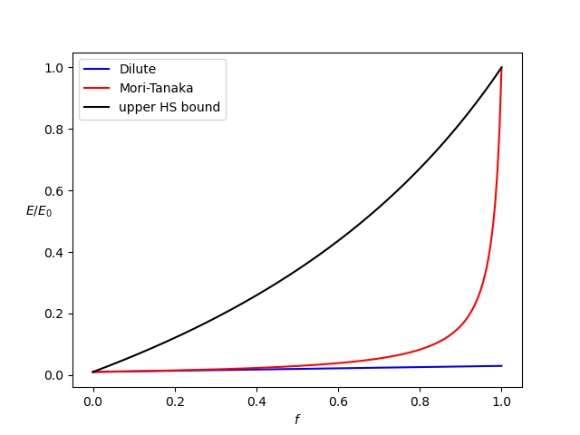
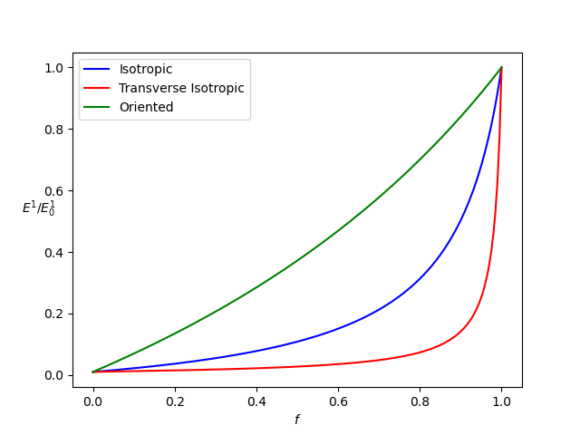

% Implementation of mean-field homogenization schemes for biphasic elastic media
% Martin Antoine
% February 24, 2025

\newcommand{\D}{\mathrm{d}}
\newcommand{\tenseur}[1]{\underline{#1}}
\newcommand{\tenseurq}[1]{\underline{\mathbf{#1}}}
\newcommand{\dbldot}{\mathbin{\mathord{:}}}
\newcommand{\reals}{\mathbb R}

\newcommand{\tsigma}{\underline{\sigma}}

\newcommand{\tepsilonto}{\underline{\epsilon}^{\mathrm{to}}}
\newcommand{\tepsilon}{\underline{\epsilon}}

\newcommand{\Frac}[2]{{\displaystyle \frac{\displaystyle #1}{\displaystyle #2}}}
\newcommand{\deriv}[2]{{\displaystyle \frac{\displaystyle \partial #1}{\displaystyle \partial #2}}}

This tutorial shows how to implement in `MFront` mean-field homogenization schemes
within the framework of 3d linear elasticity, for biphasic media.

These homogenization schemes are part of the `namespace` `tfel::material::homogenization::elasticity`.
They are implemented via the `DSL` `@MaterialLaw`.

# Available schemes

The implemented schemes for biphasic media are:

 - Dilute scheme
 - Mori-Tanaka scheme
 - PCW scheme
 - Voigt and Reuss bounds
 - Isotropic Hashin-Shtrikman bounds

For dilute scheme, Mori-Tanaka scheme and PCW scheme, the following assumptions are made:

 - the microstructure is biphasic
 - the phases are locally isotropic
 - one phase is a matrix, the other is made by inclusions
 - the shape of inclusions can be spherical, spheroidal, ellipsoidal, otherwise the mean strain localisator (for a single inclusion problem) can be provided by the user
 - for non-spherical inclusions, we consider 3 possibilities of orientation distribution: isotropic, transverse isotropic and oriented

For Voigt, Reuss and Hashin-Shtrikman bounds, the following assumptions are made:

 - N phases can be considered
 - the phases can be anisotropic for Voigt and Reuss bounds, but only isotropic for Hashin-Shtrikman bounds

# Example 1: a distribution of spherical inclusions

We begin with a basic example: a particulate composite
with spherical inclusions.

## Implementation in `MFront`

Here is the header of the `mfront` file:

~~~~ {#biphasic .cpp .numberLines}
@DSL MaterialLaw;
@Law Spherical;
@Material biphasic;
@UseQt true;
~~~~

Here we want to let the user choose which scheme he wants to use:
dilute scheme, Mori-Tanaka scheme... Hence, a real parameter
is defined as an input, which can be 0 for dilute scheme, 1 for Mori-Tanaka...
(`f` is the volume fraction of inclusion phase).

~~~~ {#biphasic .cpp .numberLines}
@StateVariable real scheme;
scheme.setEntryName("HomogenizationScheme");
@StateVariable stress E0;
E0.setEntryName("MatrixYoungModulus");
@StateVariable real nu0;
nu0.setEntryName("MatrixPoissonRatio");
@StateVariable stress Ei;
Ei.setEntryName("InclusionYoungModulus");
@StateVariable real nui;
nui.setEntryName("InclusionPoissonRatio");
@StateVariable real f;
f.setEntryName("InclusionVolumeFraction");
~~~~

It is important not to forget the header files that must be included:

~~~~ {#biphasic .cpp .numberLines}
@TFELLibraries {"Material"};

@Includes{
#include "TFEL/Material/IsotropicModuli.hxx"
#include "TFEL/Material/LinearHomogenizationSchemes.hxx"
#include "TFEL/Material/LinearHomogenizationBounds.hxx"
}
~~~~

Note that `@TFELLibraries` lets the user specify a `TFEL` library to link with.
The header `LinearHomogenizationSchemes.hxx` is needed for dilute scheme
and Mori-Tanaka scheme, whereas here `LinearHomogenizationBounds.hxx`
will be used for computing upper Hashin-Shtrikman (HS) bound. It is indeed known that
the lower Hashin-Shtrikman bound is equal to the Mori-Tanaka scheme with spheres.

We choose the Young homogenized modulus `E` to be the output of our
`Function`.

~~~~ {#biphasic .cpp .numberLines}
@Output stress E;
~~~~

Here is the implementation of the different homogenized
schemes:

~~~~ {#biphasic .cpp .numberLines}
@Function{
using namespace tfel::material::homogenization::elasticity;
tfel::material::KGModuli<stress> kg;
if (scheme==real(0)){
kg=computeSphereDiluteScheme<stress>(E0,nu0,f,Ei,nui);
}
if (scheme==real(1)){
kg=computeSphereMoriTanakaScheme<stress>(E0,nu0,f,Ei,nui);
};
if (scheme==real(2)){
std::array<real,2> tab_f={1-f,f};
auto k0=E0/3/(1-2*nu0);
auto ki=Ei/3/(1-2*nui);
std::array<stress,2> tab_k={k0,ki};
auto mu0=E0/2/(1+nu0);
auto mui=Ei/2/(1+nui);
std::array<stress,2> tab_mu={mu0,mui};
auto pa2=computeIsotropicHashinShtrikmanBounds<3u,2u,stress>(tab_f,tab_k,tab_mu);
auto UB=std::get<1>(pa2);
auto kh=UB.kappa;
auto muh=UB.mu;
kg=KGModuli<stress>(kh,muh);
auto Enu=kg.ToYoungNu();
};
E=Enu.young;
}
~~~~

Hence, `Enu` is a `YoungNuModuli` which contains the Young homogenized modulus
and the homogenized Poisson ratio. The computation of dilute scheme
and Mori-Tanaka scheme are straightforward.

The function `computeIsotropicHashinShtrikmanBounds` necessitates
to give the arrays of volume fractions `tab_f`, bulk moduli `tab_k`
and shear moduli `tab_mu`. The function returns a `pair` of `KGModuli`. The first
pair is lower HS bound, the second is upper HS bound (that we want here).
Each bound is `KGModuli` whose `kappa` attribute is the bulk modulus, and whose `mu` attribute
is the shear modulus. The function is also available for plain strain elasticity
(the first template argument is the dimension).

## Results

We choose `interface` `python` to compute the schemes for a volume fraction
of spheres which goes from 0 to 1.

Here is the `python` file :

~~~~ {#biphasic .py .numberLines}
import src.biphasic as bip
from matplotlib import pyplot as plt
import numpy as np

frac=np.linspace(0,1,200)
E_DS=np.array([bip.biphasic_Spherical(0,1e9,0.2,100e9,0.3,f)/1e11 for f in frac])
E_MT=np.array([bip.biphasic_Spherical(1,1e9,0.2,100e9,0.3,f)/1e11 for f in frac])
E_HS=np.array([bip.biphasic_Spherical(2,1e9,0.2,100e9,0.3,f)/1e11 for f in frac])
plt.figure()
g1,=plt.plot(frac,E_DS,color="blue")
g2,=plt.plot(frac,E_MT,color="red")
g3,=plt.plot(frac,E_HS,color="black")
plt.legend([g1,g2,g3],['Dilute','Mori-Tanaka','upper HS bound'])
plt.xlabel(r'$f$')
plt.ylabel(r'$E/E_0$',rotation='horizontal')
plt.show()
plt.close()
~~~~

The results are given by the following figure.

# Example 2: distributions of ellipsoidal inclusions

The example of a composite with ellipsoidal inclusions can be implemented
considering various examples of distributions. We will focus on Mori-Tanaka scheme, but
dilute scheme can also be computed.

## Implementation in `MFront`

The first lines are not so different from example 1, except the fact that we now define
a `real` parameter `distrib` to let the user choose the distribution of ellipsoids: isotropic,
transverse isotropic, or oriented. We also introduce the semi-lengths `a`,`b`,`c` of the ellipsoid.

~~~~ {#biphasic .cpp .numberLines}
@StateVariable real distrib;
distrib.setEntryName("TypeOfDistribution");
@StateVariable stress E0;
E0.setEntryName("MatrixYoungModulus");
@StateVariable real nu0;
nu0.setEntryName("MatrixPoissonRatio");
@StateVariable stress Ei;
Ei.setEntryName("InclusionYoungModulus");
@StateVariable real nui;
nui.setEntryName("InclusionPoissonRatio");
@StateVariable real f;
f.setEntryName("InclusionVolumeFraction");
@StateVariable length a;
a.setEntryName("FirstSemiLength");
@StateVariable length b;
b.setEntryName("SecondSemiLength");
@StateVariable length c;
c.setEntryName("ThirdSemiLength");
~~~~

Note that the orientation for the oriented case will be fixed in the `mfront` file,
and it will be the same for the transverse isotropic case which necessitates to
gives the direction of one of the axes of the ellipsoid. But those orientations
could also be inputs of the law.

Here is the `Function` block:

~~~~ {#biphasic .cpp .numberLines}
@Function{
tfel::math::tvector<3u,real> n_a={1,0,0};
tfel::math::tvector<3u,real> n_b={0,1,0};
using namespace tfel::material::homogenization::elasticity;
if (distrib==real(0)){
auto Enu = computeIsotropicMoriTanakaScheme<stress>(E0,nu0,f,Ei,nui,a,b,c);
E1=Enu.young;
}
if (distrib==real(1)){
auto Chom=computeTransverseIsotropicMoriTanakaScheme<stress>(E0,nu0,f,Ei,nui,n_a,a,b,c);
auto Shom=invert(Chom);
E1=1/Shom(0,0);
}
if (distrib==real(2)){
auto Chom=computeOrientedMoriTanakaScheme<stress>(E0,nu0,f,Ei,nui,n_a,a,n_b,b,c);
auto Shom=invert(Chom);
E1=1/Shom(0,0);
}
}
~~~~

For `computeTransverseIsotropicMoriTanakaScheme`, only one vector `n_a` is used. It specifies
the direction of transverse isotropy. The ellipsoid has one axis aligned
with this vector, and the semi-length of this axis is specified immediately
after `n_a` (here `a`). This is in fact a special case of transverse isotropy
for which the ellipsoid rotates around one of its principal axes.
For `computeOrientedMoriTanakaScheme`, the first vector `n_a` is the direction of one axis, whose
semi-length is precised immediately after (here `a`) and the same goes for the second
vector and second semi-length. If the vectors are not normals, an error is returned.
However, the norms of these vectors can be different from 1.

## Results

We choose `interface` `python` to compute the schemes for a volume fraction
of ellipsoids which goes from 0 to 1.

Here is the `python` file :

~~~~ {#biphasic .py .numberLines}
import src.biphasic as bip
from matplotlib import pyplot as plt
import numpy as np

frac=np.linspace(0,1,200)
E_I=np.array([bip.biphasic_Ellipsoidal(0,1e9,0.2,100e9,0.3,f,30,1,1)/1e11 for f in frac])
E_TI=np.array([bip.biphasic_Ellipsoidal(1,1e9,0.2,100e9,0.3,f,1,30,1)/1e11 for f in frac])
E_O=np.array([bip.biphasic_Ellipsoidal(2,1e9,0.2,100e9,0.3,f,30,1,1)/1e11 for f in frac])
plt.figure()
g1,=plt.plot(frac,E_I,color="blue")
g2,=plt.plot(frac,E_TI,color="red")
g3,=plt.plot(frac,E_O,color="green")
plt.legend([g1,g2,g3],['Isotropic','Transverse Isotropic','Oriented'])
plt.xlabel(r'$f$')
plt.ylabel(r'$E^{1}/E^{1}_0$',rotation='horizontal')
plt.show()
plt.close()
~~~~

We see here that we chose prolate spheroids for the ellipsoids, with aspect ratio of 30.
The first case is the isotropic distribution, the second case is the transverse isotropic distribution where
the biggest axis rotates in the `y-z` plane, and in the last case, the biggest axis is oriented in the `x` direction.
The results are given by the following figure.

<!-- Local IspellDict: english -->
