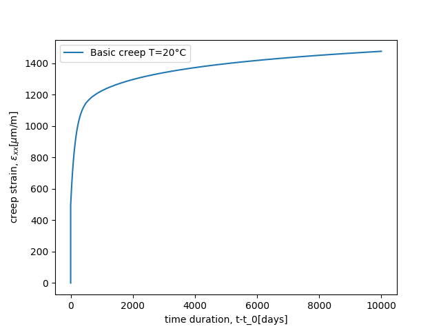
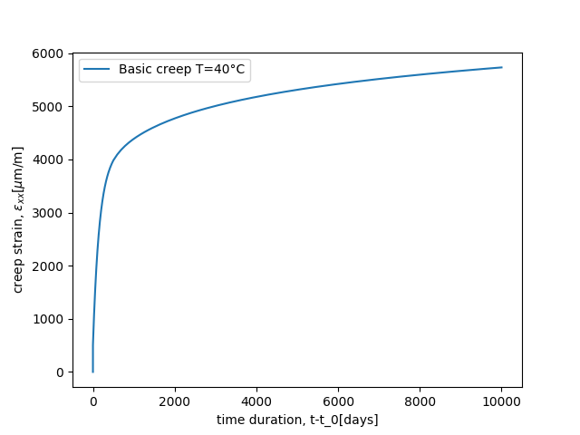
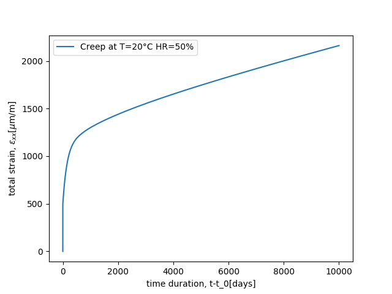
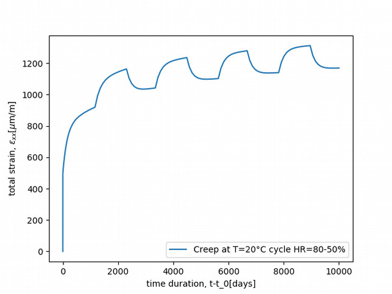
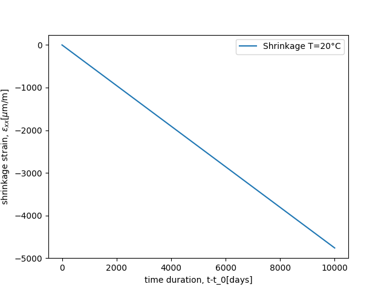
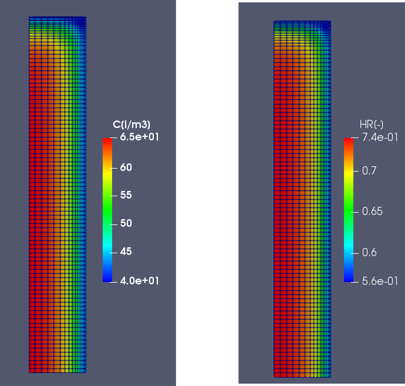
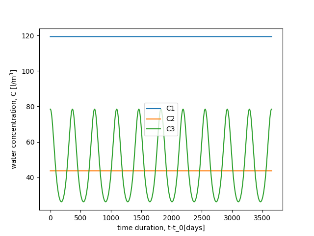

\newcommand{\paren}[1]{{\left(#1\right)}}
\newcommand{\Frac}[2]{{{\displaystyle \frac{\displaystyle #1}{\displaystyle #2}}}}
\newcommand{\tenseur}[1]{\underline{#1}}
\newcommand{\tenseurq}[1]{\underline{\underline{\mathbf{#1}}}}
\newcommand{\tepsilon}{\tenseur{\varepsilon}}
\newcommand{\tepsilonto}{\tenseur{\varepsilon}^{\mathrm{to}}}
\newcommand{\tepsilonel}{\tenseur{\varepsilon}^{\mathrm{el}}}
\newcommand{\tsigma}{\underline{\sigma}}
\newcommand{\bts}[1]{{\left.#1\right|_{t}}}
\newcommand{\mts}[1]{{\left.#1\right|_{t+\theta\,\Delta\,t}}}
\newcommand{\ets}[1]{{\left.#1\right|_{t+\Delta\,t}}}
\newcommand{\deriv}[2]{{\displaystyle \frac{\displaystyle \partial #1}{\displaystyle \partial #2}}}
\newcommand{\eibcm}{\left\|\tepsilon_{m}^{\text{ibc}}\right\|}

# Introduction {.unnumbered}

This document introduces the `Burger_EDF_CIWAP_2021` which aims at
modelling the following phenomena in concrete:

- Elasticity
- Drying shrinkage
- Basic creep
- Drying creep

It is an isotropic constitutive law for all phenomena.

Two variants, described in this document, of the implementation of this
behaviour are available in the [`MFrontGallery`
project](https://github.com/thelfer/MFrontGallery):

- [ConcreteBurger_EDF_CIWAP_2021.mfront](https://github.com/thelfer/MFrontGallery/blob/master/materials/Concrete/behaviours/ConcreteBurger_EDF_CIWAP_2021.mfront)
- [ConcreteBurger_EDF_CIWAP_2021_v2.mfront](https://github.com/thelfer/MFrontGallery/blob/master/materials/Concrete/behaviours/ConcreteBurger_EDF_CIWAP_2021_v2.mfront)

> **The ACES project and the VERCORS benchmark**
>
> The `Burger_EDF_CIWAP_2021` is shared on the MFront gallery in the
> framework of the [European project
> ACES](http://aces-h2020.eu/domains/aces-h2020.eu/) [@aces;@linkedin_aces_2021], in order to give
> acces to the [VERCORS benchmark
> 3rd participants](https://www.rilem.net/news/invitation-to-participate-in-edf-vercors-3rd-benchmark-405)
> [@charpin_ageing_2021].

# Description of the behaviour

The `Burger` mechanical model was originally developed for EDF R&D by
[@benboudjema:tel-00006945;@benboudjema_interaction_2005;@edf_relation_2020].
It was then modified in order to better represent long term basic creep
according to @doi:10.1080/19648189.2009.9693184, and implemented as a
`code_aster` law and then in `MFront`.

The version of the law described in the present document and named
`Burger_EDF_CIWAP_2021` is different from the one implemented in
`code_aster`, which is described in [@edf_relation_2020], on two points:

- It incorporates drying creep.
- It incorporates a modification of the desiccation creep law proposed
  by @bouch2016.

## Strain decomposition

The total strain is the sum of 4 components:

\[
\tepsilonto = \tepsilonel + \tepsilon^{\text{shr}}  + \tepsilon^{\text{bc}} + \tepsilon^{\text{dc}}
\]{#eq:burger_full:split_strain}

where:

- \(\tepsilonto\) is the total strain
- \(\tepsilon^{\text{shr}}\) is the drying shrinkage strain
- \(\tepsilonel\) is the elastic strain
- \(\tepsilon^{\text{bc}}\) is the basic creep strain
- \(\tepsilon^{\text{dc}}\) is the drying creep strain

## Drying shrinkage

The variation of drying shrinkage ${\dot{\tepsilon}}^{\text{shr}}$
is considered proportional to the variation of relative
humidity $\dot{h}$:

\[
\dot{\tepsilon}^{\text{shr}} = \dot{\tepsilon}^{\text{shr}}\,\tenseur{I} = k^{\text{shr}}\dot{h}\,\tenseur{I}
\]{#eq:burger_full:shrinkage}

## Elastic and basic creep strain

The combination of elastic and basic creep strains is known as a Burger
rheological model. Elasticity and basic creep are isotropic and hence,
the Burger model is duplicated in deviatoric and spherical chains ("d"
relates to deviatoric while "s" relates to spherical).

For each chain the strain is composed of elastic strain
($\varepsilon_{s}^{\text{el}}$ and $\tepsilon_{d}^{\text{el}}$),
reversible basic creep modeled by the Kelvin-Voigt element
($\varepsilon_{s}^{\text{rbc}}$ and $\tepsilon_{d}^{\text{rbc}}$) and
irreversible basic creep modeled by the Maxwell element by using a
viscosity which is not constant in time and dependent on the current
state of strain ($\varepsilon_{s}^{\text{ibc}}$ and
$\tepsilon_{d}^{\text{ibc}}$):

\[
\tepsilon^{\text{bc}}=\tepsilon^{\text{rbc}}+\tepsilon^{\text{ibc}}=
\varepsilon_{s}^{\text{rbc}}\,\tenseur{I}+\tepsilon_{d}^{\text{rbc}}+
\varepsilon_{s}^{\text{ibc}}\,\tenseur{I}+\tepsilon_{d}^{\text{ibc}}
\]

The equations related to this Burger model are now recalled for the
spherical chain (the deviatoric can be obtained by replacing "s" by "d"
and using tensors instead of scalars).

The elastic strain is simply proportional to the stress (here written
using the elastic bulk modulus $k^{\text{el}}$ and shear coefficient
$\mu^{\text{el}}$ :

\[
\left\{
\begin{aligned}
\varepsilon_{s}^{\text{el}} &= \frac{1}{3\,k^{\text{el}}}\,p\\
\tepsilon_{d}^{\text{el}} &= \frac{1}{2\,\mu^{\text{el}}}\,\tsigma_{d}
\end{aligned}
\right.
\]{#eq:burger_full:elasticity}

The basic creep strains are assumed proportional to the relative
humidity. The reversible basic creep is governed by the equation:

\[
h\,p = k^{\text{rs}}\,\varepsilon_{s}^{\text{rbc}} + \eta^{\text{rs}}\,{\dot{\varepsilon}}_{s}^{\text{rbc}}
\]{#eq:burger_full:reversible_basic_creep}

while the irreversible basic creep follows the equation:

\[
h\,p = \eta^{\text{is}}{\dot{\varepsilon}}_{s}^{\text{ibc}}
\]{#eq:burger_full:irreversible_basic_creep}

The viscosity of the irreversible contribution is assumed to be
dependent on the current state of irreversible strains following the
equation:

\[\eta^{\text{is}} = \eta_{0}^{\text{is}}\exp\paren{ \frac{\eibcm}{\kappa} }\]

where
\(\eibcm = \max_{\tau\in[0,t]}\sqrt{\tepsilon^{\text{ibc}}\paren{\tau}\,\colon\,\tepsilon^{\text{ibc}}\paren{\tau}}\).

This feature induces non-linearity in the creep model. The treatment of
this non-linearity is one of the most involved aspect of the proposed
implementation and will be detailed in Section
@sec:burger_full:implicit:basic_creep. 

The model is also thermo-activated by adding a temperature dependence to
the parameters of the previous equations. Parameters $k^{\text{rs}}$,
$k^{\text{rd}}$, $\eta^{\text{rs}}$, $\eta^{\text{rd}}$,
$\eta^{\text{is}}$ and $\eta^{\text{id}}$ have the following temperature
dependence exemplified on $k^{\text{rs}}$:

\[
k^{\text{rs}}\paren{ T } = k_{0}^{\text{rs}}\exp\paren{ \frac{Q}{R}\paren{ \frac{1}{T} - \frac{1}{T_{0}} } }
\]{#eq:burger_full:temperature_dependence}

Also,

\[
\kappa = \Frac{\kappa_{0}}{\exp\paren{ \frac{Q}{R}\paren{ \frac{1}{T} - \frac{1}{T_{0}} } }}
\]{#eq:burger_full:temperature_dependence2}

where $Q$ is the activation energy for creep.

## Drying creep strain

Finally, the desiccation creep is computed according to a modified
version of a law called Bažant's law, relating the excess of strain rate
during drying to the rate of change of the water concentration
@Bazant1985. It is supposed in this version of the model that
desiccation creep occurs with a zero Poisson's ratio and that its rate
is proportional to the absolute value of the relative humidity rate.
Also, following a proposition by Boucher
[@bouch2016;@bouhjiti_accounting_2018] taking inspiration in Benboudjema
@benboudjema:tel-00006945 who noted that the behavior is not symmetric
between drying and imbibition. Here the imbibition desiccation strain is
considered negligible. Also, the desiccation creep occurs only during
first drying down to a given relative humidity.

\[
\dot{\tepsilon}^{\text{dc}} = \frac{1}{\eta_{\text{fd}}}\tsigma\left\langle \dot{h} \right\rangle
\]{#eq:burger_full:drying_creep}

where:

\[
\langle\dot{h}\rangle =
\left\{
\begin{aligned}
\dot{h} &\quad\text{if}\quad \dot{h} < 0 \quad\text{and}\quad h\paren{t} < \min_{\tau\in [0,t]} h\paren{\tau}\\
0            &\quad\text{otherwise}
\end{aligned}
\right.
\]

# Description of the implicit algorithm {#sec:burger_full:implicit_algorithm}

To integrate this behaviour, we use an implicit scheme described in
[this page](implicit-dsl.html) [@ceaedf_implicit_2021]. This scheme
turns the constitutive equations, which forms a system of ordinary
differential equations, into a system of non linear equations.

Such scheme is usually more efficient than explicit integration schemes
based on (explicit) Runge-Kutta methods and allows deriving the
consistent tangent operator which can lead to a quadratic convergence of
the equilibrium at the global scale.

A standard Newton-Raphson algorithm will be used to find the solution of
the implici system, which requires to compute the jacobian of the
implicit system.

## Choice of the state variables and auxilary state variables {#sec:burger_full:isvs}

The role of the implicit scheme is to determine the following increments:

\[
\Delta\,\tepsilonel,\,\Delta\,\tepsilon^{\text{shr}},\,
\Delta\,\tepsilon^{\text{bc}},\,\Delta\,\tepsilon^{\text{dc}},\,\Delta\,\eibcm
\]

For convenience, the basic creep contribution \(\tepsilon^{\text{bc}}\)
is explicitly slitted into its reverible \(\tepsilon^{\text{rbc}}\) and
irreversible part \(\tepsilon^{\text{ibc}}\). The set of increments to
be determined is then:

\[
\Delta\,\tepsilonel,\,\Delta\,\tepsilon^{\text{shr}},
\,\Delta\,\tepsilon^{\text{rbc}},
\,\Delta\,\tepsilon^{\text{ibc}},\,\Delta\,\tepsilon^{\text{dc}},\,\Delta\,\eibcm
\]

For one of those increments, one can either, as shown below:

1. Find an implicit equation associated with this increment. In this
  case, the associated variable is said to be a *state variable*.
2. Express this increment as a function of the other increments. In this
  case, the associated variable is said to be an *auxiliary state
  variable*. One obvious auxiliary state variable is the shrinkage
  strain \(\tepsilon^{\text{shr}}\) which only depends on the variation
  of the relative humidity. Note that `MFront` does not automatically
  defines the increment associated with an auxiliary state variable.

From an numerical point of view, using an auxiliary state variable
rather than a state variable is interesting as it reduces the size of
the implicit system to be solved. However, it generally leads to more
complex implementations.

For reasons that will become clearer later when we will examine each
contributions, we choose the following set of state variables:

\[
\tepsilonel, \tepsilon^{\text{ibc}}, \eibcm
\]

and the following set of auxiliary state variables:

\[
\tepsilon^{\text{shr}}, \tepsilon^{\text{rbc}}, \tepsilon^{\text{dc}}
\]

### Split of the strain in spherical and deviatoric parts

In the proposed implementation, each inelastic strain will be split into
its spherical and deviatoric part for the sake of clarity. With this
choice, the final set of state variables is:

\[
\tepsilonel, \varepsilon_{s}^{\text{ibc}},  \tepsilon_{d}^{\text{ibc}}, \eibcm
\]

and the following set of auxiliary state variables:

\[
\tepsilon^{\text{shr}}, \varepsilon_{s}^{\text{rbc}}, \tepsilon_{d}^{\text{rbc}}, \tepsilon^{\text{dc}}
\]

Drawbacks of this choice are an increase the size of the implicit system
and a higher memory consumption (i.e. the number of values saved from
one time step to the other).

This choice can easily be reverted, leading to a more compact and
efficient implementation, while a bit less readable.

### Update of state variables and auxiliary state variables
 
State variables are automatically updated when the solutions (the increment
of the state variables) of the implicit equations are found. Auxiliary state
variables are generally updated in a dedicated code
block called `@UpdateAuxiliaryStateVariables`.

### Reducing the memory consumption

For this behaviour, declaring the auxiliary state variables is
convenient for post-processing, i.e. the behaviour integration only
requires to determine their increments during the time step and does not
require to know their values at the beginning of the time step. If such
post-processing does not matter, a significant amount of memory can be
saved by removing their declaration as auxiliary state variables and
their update in the `@UpdateAuxiliaryStateVariable` code block.

## Computation of the stress

The stress tensor is a function of the increment of the elastic strain
\(\tepsilonel\). Its value at the middle of the time step (at
\(t+\theta\,\Delta\,t\)) is given by:

\[
\left\{
\begin{aligned}
\mts{p} &= \paren{3\,\mts{\lambda^{\text{el}}}+2\,\mts{\mu^{\text{el}}}}\,\mts{\varepsilon^{\text{el}}_{s}} &= 3\,\mts{k^{\text{el}}}\,\mts{\varepsilon^{\text{el}}_{s}} \\
\mts{\tsigma_d} &= 2\,\mts{\mu^{\text{el}}}\,\mts{\tepsilonel_{d}}
\end{aligned}
\right.
\]{#eq:burger_full:stress_mts}

The derivatives of the pressure and the deviatoric stress with regard
to the elastic strain increment are thus:

\[
\deriv{\mts{p}}{\Delta\,\tepsilonel} =  3\,\theta\,\mts{k^{\text{el}}}\,\tenseur{I}
\quad\text{and}\quad
\deriv{\mts{\tsigma_d}}{\Delta\,\tepsilonel} = 2\,\theta\,\mts{\mu^{\text{el}}}\,\tenseurq{K}
\]{#eq:burger_full:stress_derivatives}

## Implicit equation associated with basic creep {#sec:burger_full:implicit:basic_creep}

### Reversible part: discretization of Equation @eq:burger_full:reversible_basic_creep

Equation @eq:burger_full:reversible_basic_creep can be discretized as follows:

\[
\begin{aligned}
&&k^{\text{rs}}\,\mts{\varepsilon_{s}^{\text{rbc}}} + \eta^{\text{rs}}\,\Frac{\Delta\,\varepsilon_{s}^{\text{rbc}}}{\Delta\,t}&=\mts{h}\,\mts{p}\\
&\Rightarrow&\paren{\eta^{\text{rs}}+\theta\,\Delta\,t\,k^{\text{rs}}}\,\Delta\,\varepsilon_{s}^{\text{rbc}}&=\Delta\,t\,\mts{h}\,\mts{p}-\Delta\,t\,k^{\text{rs}}\,\bts{\varepsilon_{s}^{\text{rbc}}}
\end{aligned}
\]

Finally, the expression of the increment of the reversible part of the
basic creep is:

\[
\Delta\,\varepsilon_{s}^{\text{rbc}} = 
\Delta\,t\,\Frac{\mts{h}}{\eta^{\text{rs}}+\theta\,\Delta\,t\,k^{\text{rs}}}\,\mts{p}-
\Delta\,t\,\Frac{k^{\text{rs}}}{\eta^{\text{rs}}+\theta\,\Delta\,t\,k^{\text{rs}}}\,\bts{\varepsilon_{s}^{\text{rbc}}}
\]{#eq:burger_full:delta_e_rbc}

This equation shows that \(\Delta\,\varepsilon_{s}^{\text{rbc}}\) is a
simple linear function of the pressure, i.e. a simple function of the
elastic strain increment.

The derivative of \(\Delta\,\varepsilon_{s}^{\text{rbc}}\) with respect
to the elastic strain increment is simply:

\[
\deriv{\Delta\,\varepsilon_{s}^{\text{rbc}}}{\Delta\,\tepsilonel}=
\Delta\,t\,\Frac{\mts{h}}{\eta^{\text{rs}}+\theta\,\Delta\,t\,k^{\text{rs}}}\,\deriv{\mts{p}}{\Delta\,\tepsilonel}
\]

where the derivative \(\deriv{\mts{p}}{\Delta\,\tepsilonel}\) is given
by Equation @eq:burger_full:stress_derivatives.

### Irreversible part: discretization of Equation @eq:burger_full:irreversible_basic_creep

Equation @eq:burger_full:irreversible_basic_creep can be discretized as
follows:

\[
\Delta\,\varepsilon_{s}^{\text{ibc}} = \Delta\,t\,\Frac{\mts{h}}{\eta^{\text{is}}\paren{\mts{\eibcm}}}\,\mts{p}
\]

The implicit equation \(f_{\Delta\,\varepsilon_{s}^{\text{ibc}}}\)
associated with \(\Delta\,\varepsilon_{s}^{\text{ibc}}\) is thus:

\[
f_{\Delta\,\varepsilon_{s}^{\text{ibc}}} =
\Delta\,\varepsilon_{s}^{\text{ibc}}-
\Delta\,t\,\Frac{\mts{h}}{\eta^{\text{is}}\paren{\mts{\eibcm}}}\,\mts{p}
\]

The following derivatives will be useful:

\[
\left\{
\begin{aligned}
\deriv{f_{\Delta\,\varepsilon_{s}^{\text{ibc}}}}{\Delta\,\varepsilon_{s}^{\text{ibc}}} &= 1 \\
\deriv{f_{\Delta\,\varepsilon_{s}^{\text{ibc}}}}{\Delta\,\tepsilonel} &= 
- \Delta\,t\,\Frac{\mts{h}}{\eta^{\text{is}}\paren{\mts{\eibcm}}}\,\deriv{\mts{p}}{\tepsilonel} \\
\deriv{f_{\Delta\,\varepsilon_{s}^{\text{ibc}}}}{\Delta\,\mts{\eibcm}} &= 
\Delta\,t\,\Frac{\mts{h}}{\paren{\eta^{\text{is}}\paren{\mts{\eibcm}}}^{2}}\,\mts{p}\,
\deriv{\eta^{\text{is}}}{\Delta\,\eibcm} \\
\end{aligned}
\right.
\]

### Implicit equation associated with the maximum value of the norm of the irreversible part of the basic creep

In this document, we choose the following implicit equation to determine \(\Delta\,\eibcm\):

\[
f_{\eibcm}=
\left\{
\begin{aligned}
\bts{\eibcm}+\Delta\,\eibcm - \sqrt{\ets{\tepsilon^{\text{ibc}}}\,\colon\,\ets{\tepsilon^{\text{ibc}}}} &\quad\text{if}\quad \sqrt{\ets{\tepsilon^{\text{ibc}}}\,\colon\,\ets{\tepsilon^{\text{ibc}}}}>\bts{\eibcm}&\\
\Delta\,\eibcm &\quad\text{otherwise}&
\end{aligned}
\right.
\]{#eq:burger_full:feibcm}

The derivatives of this equation are:

\[
\left\{
\begin{aligned}
\deriv{f_{\eibcm}}{\Delta\,\eibcm} &= 1\\
\deriv{f_{\eibcm}}{\Delta\,\tepsilon^{\text{ibc}}} &= 
-\Frac{\Delta\,\tepsilon^{\text{ibc}}}{\sqrt{\ets{\tepsilon^{\text{ibc}}}\,\colon\,\ets{\tepsilon^{\text{ibc}}}}}\quad\text{if}\quad \sqrt{\ets{\tepsilon^{\text{ibc}}}\,\colon\,\ets{\tepsilon^{\text{ibc}}}}>\bts{\eibcm}\\
\end{aligned}
\right.
\]

### An alternative implicit equation to determine the maximum value of the norm of the irreversible part of the basic creep {#sec:burger_full:fisherburmeister}

Using Implicit Equation @eq:burger_full:feibcm may lead to spurious
oscillations of the Newton algorithm, **although this is not observered in
the test cases below**.

This is due to the fact that the derivatives of this equation are not
continuous.

A standard way to overcome this issue is to use a status method which
can be implemented in `MFront`
[@ceaedf_implementation_drucker_prager_cap_2021].

In this paragraph, we introduce an alternative treatment of this
equation based on the regularised Fisher-Burmeister complementary
function \(\Phi_{\varepsilon_{\text{FB}}}\), introduced in
@liao-mcpherson_regularized_2019 and whose application to plasticity is
described on a [dedicated web page](FisherBurmeister.html)
[@ceaedf_fisher-burmeister_2021]:

\[
\Phi_{\varepsilon}\paren{x,y}=x+y-\sqrt{x^{2}+y^{2}+\varepsilon_{\text{FB}}^{2}}
\]

where \(\varepsilon_{\text{FB}}\) denotes a small numerical parameter.

\(\Phi_{\varepsilon}\paren{x,y}\) has the following property:

\[
\Phi_{\varepsilon}\paren{x,y}=0
\quad\Leftrightarrow\quad
\left\{
\begin{aligned}
x&\geq 0\\
y&\geq 0\\
2\,x\,y&=\varepsilon^{2}
\end{aligned}
\right.
\]{#eq:burger_full:FBe}

Based on Property @eq:burger_full:FBe, the Implicit Equation
@eq:burger_full:feibcm can be replaced by the following equation:

\[
f_{\eibcm}=\Phi_{\varepsilon_{\text{FB}}}\paren{\Delta\,\eibcm, \bts{\eibcm}+\Delta\,\eibcm - \sqrt{\ets{\tepsilon^{\text{ibc}}}\,\colon\,\ets{\tepsilon^{\text{ibc}}}}}
\]{#eq:burger_full:feibcm2}

Implicit Equation @eq:burger_full:feibcm2 has continuous derivatives.

\(\Phi_{\varepsilon}\) and its derivatives are implemented in the
`TFEL/Math` library in [Version 3.2]() but their usage requires to include the
[`TFEL/Math/FischerBurmeister.hxx`](https://github.com/thelfer/tfel/blob/master/include/TFEL/Math/FischerBurmeister.hxx)
header:

- The `regularisedFischerBurmeisterFunction` function implements the
  computation of \(\Phi_{\varepsilon}\).
- The `regularisedFischerBurmeisterFunctionFirstDerivatives` function
  implements the computation of the derivatives of
  \(\deriv{\Phi_{\varepsilon}}{x}\) and
  \(\deriv{\Phi_{\varepsilon}}{y}\).

## Implicit equation associated with the evolution of the drying creep strain

Equation @eq:burger_full:drying_creep can be discretized as follows:

\[
\Delta\,\tepsilon^{\text{dc}} = \frac{\Delta\,t}{\eta_{\text{fd}}}\left\langle \dot{h} \right\rangle\,\mts{\tsigma}
\]

\(\Delta\,\tepsilon^{\text{dc}}\) is thus a simple function of the
elastic strain increment \(\Delta\,\tepsilonel\).

Its derivative with respect to the elastic strain increment is:

\[
\deriv{\Delta\,\tepsilon^{\text{dc}}}{\Delta\,\tepsilonel}
=\frac{\Delta\,t}{\eta_{\text{fd}}}\left\langle \dot{h} \right\rangle\,\deriv{\mts{\tsigma}}{\Delta\,\tepsilonel}
=\frac{\Delta\,t}{\eta_{\text{fd}}}\left\langle \dot{h} \right\rangle\,
\paren{\tenseur{I}\,\otimes\,\deriv{\mts{p}}{\Delta\,\tepsilonel}+
       \deriv{\mts{\tsigma_{d}}}{\Delta\,\tepsilonel}}
\]

## Implicit equation associated with the elastic strain

The implicit equation \(f_{\tepsilonel}\) associated with the elastic
strain increment is given by the split of the strain
@eq:burger_full:split_strain written in incremental form:

\[
f_{\tepsilonel}=\Delta\,\tepsilonel-\Delta\,\tepsilonto
+\Delta\,\tepsilon^{\text{shr}}
+\Delta\,\tepsilon^{\text{bc}}
+\Delta\,\tepsilon^{\text{dc}}
\]{#eq:burger_full:feel}

# Description of the `MFront` implementations

<!--
|                      |                      | $\left\              |
|                      |                      | | \tepsilon_{m}^{\   |
|                      |                      | text{ibc}} \right\|$ |
-->

## Choice of the domain specific language and the `StandardElasticity` brick

The domain specific language (DSL) suitable for implementing an implicit
scheme based on standard strain-based beahviour is called
[`Implicit`](implicit-dsl.html) [@ceaedf_implicit_2021]. The `@DSL`
keyword allows specifying the domain specific language to be used:

~~~~{.cxx}
@DSL Implicit;
~~~~

The [standard elasticity
brick](BehaviourBricks.html)
[@ceaedf_behaviour_bricks_2020] is appropriate for this behaviour which
provides additional functionnalities such as:

- Automatic computation of the stress tensor at various stages of the
  behaviour integration.
- Automatic computation of the consistent tangent operator.
- Automatic support for plane stress and generalized plane stress
  modelling hypotheses (The axial strain is defined as an additional
  state variable and the associated equation in the implicit system is
  added to enforce the plane stess condition).
- Automatic addition of the standard terms associated with the elastic
  strain state variable.

The usage of the `StandardElasticity` is introduced as follows:

~~~~{.cxx}
@Brick StandardElasticity;
~~~~

> **Automic declaration of the elastic strain**
>
> The `Implicit` DSL automatically defines the elastic strain as the
> first state variable.

{#fig:burger_full:implicit_dsl width=75%}

The main steps of the behaviour integration used by the `Implicit` DSL
are reported on Figure @fig:burger_full:implicit_dsl:

- the `@InitLocalVariables` code block is called once before the
  beginning of the Newton-Raphson algorithm.
- The Newton-Raphson algorithm is based on three main steps:
  - `@ComputeStress` which is meant to update the estimate of the stress
    at the middle of the time step \(\mts{\tsigma}\). This code block
    is automatically added by the `StandardElasticity` brick.
  - `@Integrator` is meant to built the implicit equations and its
    derivatives.
  - `@AdditionalConvergenceChecks` is meant to add additional
    convergence checks. This code block is not considered in this
    document.
- After the convergence of the Newton-Raphson algorithm, the state
  variables are updated and the following code blocks are called:
  - `ComputeFinalStress` which computes the stress at the end of the
    time step. This code block is automatically added by the
    `StandardElasticity` brick.
  - `@UpdateAuxiliaryStateVariables` which is meant to update the
    auxiliary state variables.
  - `@TangentOperator` which is meant to compute the tangent operators.
    This code block is automatically added by the `StandardElasticity`
    brick.

## Name of the behaviour

The `@Behaviour` keyword is required to name the behaviour, as follows:

~~~~{.cxx}
@Behaviour Burger_EDF_CIWAP_2021;
~~~~

## Material

The `@Material` keyword allows to associate the behaviour to material:

~~~~{.cxx}
@Material Concrete;
~~~~

## Metadata

The `@Author` keyword gives the name of the person who implemented the
behaviour:

~~~~{.cxx}
@Author François Hamon (EDF R&D ERMES - T65),
        Jean - Luc Adia (EDF R&D MMC - T25),
        Thomas Helfer (CEA IRESNE/DES/DEC/SESC);
~~~~

The `@Description` keyword allows to introduce a small description of
the implementation:

~~~~{.cxx}
@Description {
`Burger_EDF_CIWAP_2021` model for concrete creep;
Compater to `code_aster`' `BETON_BURGER` constitutive equations, this behaviour
takes into account two points: 
-adding of shrinkage depending to relative humidity;
-drying creep depending to the positive part of derivative of relative humidity;
}
~~~~

## Choice of the algorithm and numerical parameters

For this implementation, we will use the standard Newton-Raphson:

~~~~{.cxx}
@Algorithm NewtonRaphson;
~~~~

The `@Epsilon` keyword allows to specify the default value of the
stopping criteria:

~~~~{.cxx}
@Epsilon 1e-14;
~~~~

This default value can be changed at runtime using the `epsilon`
parameter.

The `@Theta` keyword allows the specify the default value of the
\(\theta\) parameter of the implicit scheme:

~~~~{.cxx}
@Theta 1;
~~~~

This default value can be changed at runtime using the `theta`
parameter.

## External headers

If we want to use the alternative implicit equation for
\(\Delta\,\eibcm\), discussed in Section
@sec:burger_full:fisherburmeister, we need to include the following
header file using the `@Includes` keyword:

~~~~{.cxx}
@Includes{
#include "TFEL/Math/FischerBurmeister.hxx"
}
~~~~

## Variables declarations

### Material properties

Material properties are a classical way to create behaviours that can be
used to describe a wide range of materials. Material properties are
provided by the calling solver and are generally read in the input file.

| `MFront` variable | Description                                                                 |
|:-----------------:|:----------------------------------------------------------------------------|
| `young`           | Young modulus $E^{\text{el}}$                                               |
| `nu`              | Poisson ratio $\nu^{\text{el}}$                                             |
| `K_SH`            | Shrinkage coefficient $k^{\text{shr}}$                                      |
| `K_RS`            | Spherical reversible basic creep stiffness $k_{0}^{\text{rs}}$              |
| `ETA_RS`          | Spherical reversible basic creep viscosity $\eta_{0}^{\text{rs}}$           |
| `KAPPA`           | Reference strain for evolution of irreversible creep viscosity $\kappa_{0}$ |
| `ETA_IS`          | Spherical irreversible creep viscosity $\eta_{0}^{\text{is}}$               |
| `K_RD`            | Deviatoric reversible basic creep stiffness $k_{0}^{\text{rd}}$             |
| `ETA_RD`          | Deviatoric reversible basic creep viscosity $\eta_{0}^{\text{rd}}$          |
| `ETA_ID`          | Deviatoric irreversible creep viscosity $\eta_{0}^{\text{id}}$              |
| `QSR_K`           | Activation energy $\frac{Q}{R}$                                             |
| `TEMP_0_C`        | Reference temperature $T_{0}$                                               |
| `ETA_FD`          | Drying creep coefficient $\eta_{\text{fd}}$                                 |

: Name of the material properties and descriptions {#tbl:burger_full:mps}

The material properties required by the `Burger_EDF_CIWAP_2021`
behaviour are listed in Table @tbl:burger_full:mps.

Material properties are declared using the `@MaterialProperty` keyword,
as follows:

~~~~{.cxx}
//! Elastic Young Modulus
@MaterialProperty stress young;
young.setGlossaryName("YoungModulus");
//! Elastic Poisson Ratio
@MaterialProperty real nu;
nu.setGlossaryName("PoissonRatio");
//! Shrinkage coefficient
@MaterialProperty real K_SH;
K_SH.setEntryName("ShrinkageFactor");
//! Spherical reversible basic creep stiffness
@MaterialProperty real K_RS;
K_RS.setEntryName("SphericReversibleStiffness");
//! Spherical reversible basic creep viscosity
@MaterialProperty real ETA_RS;
ETA_RS.setEntryName("SphericReversibleViscosity");
//! Reference strain for evolution of irreversible creep viscosity
@MaterialProperty real KAPPA;
KAPPA.setEntryName("IrreversibleCreepViscosityReferenceStrain");
//! Spherical irreversible creep viscosity
@MaterialProperty real ETA_IS;
ETA_IS.setEntryName("SphericIrreversibleCreepViscosity");
//! Deviatoric reversible basic creep stiffness
@MaterialProperty real K_RD;
K_RD.setEntryName("DeviatoricReversibleStiffness");
//! Deviatoric reversible basic creep viscosity
@MaterialProperty real ETA_RD;
ETA_RD.setEntryName("DeviatoricReversibleViscosity");
//! Deviatoric irreversible creep viscosity
@MaterialProperty real ETA_ID;
ETA_ID.setEntryName("DeviatoricIrreversibleViscosity");
//! Activation energy of basic creep parameter
@MaterialProperty real QSR_K;
QSR_K.setEntryName("ActivationEnergy");
//! Reference temperature for temperature activation of basic creep
@MaterialProperty real TEMP_0_C;
TEMP_0_C.setEntryName("ReferenceTemperature");
//! Drying creep viscosity
@MaterialProperty real ETA_FD;
ETA_FD.setEntryName("DryingCreepVicosity");
~~~~

Note that we associated to each material property an external name
(either a glossary name or a so-called entry name) using the
`setGlossaryName` or `setEntryName` methods. The external name is the
name of this variable as seen by the calling solver and its user when
this solver supports deep integration of `MFront` behaviours.

Glossary names are a restricted list of names described on a [dedicated
page](glossary.html) [@ceaedf_glossary_2020]. The `setGlossaryName`
fails if the given name is not in this list, avoiding typing errors.

> **Material properties vs parameters**
>
> In most MFront tutorials, we usually prefer to use parameters, which
> are declared using the `@Parameter` keyword.
>
> Contrary to material properties, parameters have default values.
> Parameters are thus useful to build behaviours specific to one
> particular material. Such behaviours are self-contained, which
> considerably eases building a strict material knowledge management
> policy.
>
> Parameters are also stored in a global structure. This means that
> parameters are uniform. In some codes, material properties may
> be defined on a per integration point basis.

### State variables

| `MFront` variable | Description                                                               |
|:-----------------:|:--------------------------------------------------------------------------|
| `ELIM`            | Limit strain for the irreversible creep model                             |
| `ESPHI`           | Spherical irreversible basic reep strain $\varepsilon_{s}^{\text{ibc}}$   |
| `EDEVI`           | Deviatoric irreversible basic creep strain $\varepsilon_{d}^{\text{ibc}}$ |

: Name of the state variables and descriptions {#tbl:burger_full:isps}

Following Section @sec:burger_full:isvs, the state variables required by
the `Burger_EDF_CIWAP_2021` behaviour are listed in Table
@tbl:burger_full:isps.

The state variables are introduced by the `@StateVariable` as follows:

~~~~{.cxx}
@StateVariable strain ELIM;
ELIM.setEntryName("MaximumValueOfTheIrreversibleStrain");
//! Spherical irreversible basic creep strain
@StateVariable strain ESPHI;
ESPHI.setEntryName("SphericIrreversibleStrain");
//! Deviatoric irreversible basic creep strain
@StateVariable StrainStensor EDEVI;
EDEVI.setEntryName("DeviatoricIrreversibleStrain");
~~~~

### Auxiliary state variables

| `MFront` variable | Description                                                               |
|:-----------------:|:--------------------------------------------------------------------------|
| `ESH`             | Shrinkage strain $\varepsilon^{\text{shr}}$                               |
| `ESPHR`           | Spherical reversible basic creep strain $\varepsilon_{s}^{\text{rbc}}$    |
| `EDEVR`           | Deviatoric reversible basic creep strain $\varepsilon_{d}^{\text{rbc}}$   |
| `Edess`           | Drying creep strain $\varepsilon^{\text{dc}}$                             |
| `rHmin`           | Historical min value of relative humidity                                 |
| `EF`              | Basic creep strain tensor                                                 |

: Name of the auxiliary state variables and descriptions {#tbl:burger_full:aisps}

Following Section @sec:burger_full:isvs, the auxiliary state variables
required by the `Burger_EDF_CIWAP_2021` behaviour are listed in Table
@tbl:burger_full:aisps.

The auxiliary state variables are introduced by the
`@AuxiliaryStateVariable` as follows:

~~~~{.cxx}
//! Spherical Reversible basic creep strain
@AuxiliaryStateVariable strain ESPHR;
ESPHR.setEntryName("SphericReversibleStrain");
//! Deviatoric Reversible basic creep strain
@AuxiliaryStateVariable StrainStensor EDEVR;
EDEVR.setEntryName("DeviatoricReversibleStrain");
//! Shrinkage strain
@AuxiliaryStateVariable strain ESH;
ESH.setEntryName("ShrinkageStrain");
//! Drying creep strain
@AuxiliaryStateVariable StrainStensor Edess;
Edess.setEntryName("DryingCreepStrain");
/*!
 * Shifted value of the historical minimale of relative humidity 
 *
 * This value has been shifted (value + 1) so the implicit initialization
 * to zero of this variable in most finite element solvers is meaningfull.
 * So for initialization at value different to 1, please don't forget to
 * take into account this shift.
 */
@AuxiliaryStateVariable strain rHmin;
rHmin.setEntryName("ShiftedHistoricalMinimumRelativeHumidity");
//! Basic creep strain tensor
@AuxiliaryStateVariable StrainStensor EF;
EF.setEntryName("BasicCreepStrain");
~~~~

### External state variables

| `MFront` variable | Description       |
|:-----------------:|:------------------|
| `T`               | Temperature       |
| `rH`              | Relative humidity |

: Name of the external state variables and descriptions {#tbl:beton_burger:external_state_variables}

The external state variables required by the behaviour are listed on
Table @tbl:beton_burger:external_state_variables.

The temperature is automatically defined by `MFront`, hence only the
relative humidity must be declared:

~~~~{.cxx}
@ExternalStateVariable real rH;
rH.setEntryName("RelativeHumidity");
~~~~

> **Note for `code_aster` users**
>

> Due to the specific way used by `code_aster` to handle external state
> variables, the external name of the relative humidity must be changed
> to `SECH` as follows:
>
> ~~~~{.cxx}
> rH.setEntryName("SECH");
> ~~~~

### Local variables

Local variables are a powerfull feature of `MFront` which allows to
define variables which will be accessible in each code blocks.

In this implementation, we will need local variables for two distinct
purposes:

1. Precompute some quantities before the resolution of the implicit system.
2. Save the increment of auxiliary state variables for their update
  after the resolution of the implicit system.

####  Local variables to optimize computation times

A few variables can be computed before the resolution of the implicit
system in the `@InitLocalVariables` code block. The most important ones
are coefficients of creep mechanisms whose computations involves
exponentials of the temperature following the Arrhenius law (see
Equations @eq:burger_full:temperature_dependence and
@eq:burger_full:temperature_dependence2).

Those local variables are declared as follows:

~~~~{.cxx}
//! first Lamé coeffient
@LocalVariable real lambda;
//! second Lamé coeffient
@LocalVariable real mu;
//! variable to compute effect of relative on drying creep
@LocalVariable real VrH;
//! inverse of drying strain viscosity
@LocalVariable real inv_ETA_FD;
/* variables for impact of temperature on basic creep */
@LocalVariable real KRS_T;
@LocalVariable real KRD_T;
@LocalVariable real NRS_T;
@LocalVariable real NRD_T;
@LocalVariable real NIS_T;
@LocalVariable real NID_T;
@LocalVariable real KAPPA_T;
~~~~

#### Local variables saving the increments of the auxiliary state variables

As discussed in Section @sec:burger_full:implicit_algorithm, the
increment of auxiliary state variables can be expressed as a function of
the increments of the state variables. Those increments must be
evaluated during the evaluation of the implicit system in the
`@Integrator` code block for each new estimates of the increments of the
state variables.

Using local variables allows to save the last estimates of the increment
of the auxiliary state variables to update those variables in the
`@UpdateAuxiliaryStateVariables` code blocks.

Those local variables are declared as follows:

~~~~{.cxx}
//! increment of spherical reversible strain
@LocalVariable strain dESPHR;
//! increment of deviatoric reversible strain
@LocalVariable StrainStensor dEDEVR;
//! increment of shrinkage strain
@LocalVariable strain dESH;
//! increment of drying creep strain
@LocalVariable StrainStensor dEdess;
~~~~

## Initialisation of the local variables

The `@InitLocalVariables` code block is now described.

~~~~{.cxx}
@InitLocalVariables {
~~~~

First we explicitly compute the Lamé coefficients using the built-in
`computeLambda` and `computeMu` functions:

~~~~{.cxx}
  lambda = computeLambda(young, nu);
  mu = computeMu(young, nu);
~~~~

Then, we compute the effective creep properties for the temperature at
the middle of the time step:

~~~~{.cxx}
  const auto Tm = T + dT / 2;
  const auto iT = 1 / (273 + Tm) - 1 / (273 + TEMP_0_C);
  const auto e = exp(QSR_K * iT);
  KRS_T = K_RS * e;
  KRD_T = K_RD * e;
  NRS_T = ETA_RS * e;
  NRD_T = ETA_RD * e;
  NIS_T = ETA_IS * e;
  NID_T = ETA_ID * e;
  KAPPA_T = KAPPA / e;
~~~~

Then we compute the value of the shrinkage strain increment
\(\Delta\,\epsilon^{\text{shr}}\):

~~~~{.cxx}
  dESH = K_SH * drH;
~~~~

Finally, we compute the quantities relative the the drying strain:

~~~~{.cxx}
  if ((drH <= 0) && (rH <= rHmin + 1)) {
    VrH = fabs(drH);
    rHmin = rH - 1;
  } else {
    VrH = 0;
  }
  if (ETA_FD > real(0)) {
    inv_ETA_FD = 1 / ETA_FD;
  } else {
    inv_ETA_FD = real(0);
  }
}
~~~~

Note that this implementation uses a little trick to activate the drying
strain base on the value of \(\eta_{\text{fd}}\). In the latter is
negative or null, drying creep is desactivated.

## Implicit system

The `@Integrator` code block defines the values of residuals and their
derivatives with respect to the state variables.

~~~~{.cxx}
@Integrator {
~~~~

We start this implementation by defining the current estimates of the
pressure and deviatoric stress at the middle of the time steps and their
derivatives with respect to the elastic strain increment:

~~~~{.cxx}
  constexpr auto eeps = strain(1e-14);
  const auto id = Stensor::Id();
  const auto pr = trace(sig) / 3;
  const auto s = deviator(sig);
  const auto dpr_ddeel = (lambda + 2 * mu / 3) * theta * id;
  const auto ds_ddeel = 2 * mu * theta * Stensor4::K();
  const auto dsig_ddeel = ds_ddeel + (dpr_ddeel ^ id);
~~~~

The following line computes the relative humidity at the middle of the
time step:

~~~~{.cxx}
  const auto rH_mts = rH + theta * drH;
~~~~

The computation of the increment of the spherical and deviatoric parts
of the basic creep given by Equation @eq:burger_full:delta_e_rbc is
implemented as follows:

~~~~{.cxx}
  const auto a_rs = theta * KRS_T * dt / NRS_T;
  dESPHR = (rH_mts * pr - KRS_T * ESPHR) * dt / (NRS_T * (1 + a_rs));
  const auto ddESPHR_dpr = rH_mts * dt / (NRS_T * (1 + a_rs));
  const auto a_rd = theta * KRD_T * dt / NRD_T;
  dEDEVR = (rH_mts * s - KRD_T * EDEVR) * dt / (NRD_T * (1 + a_rd));
  const auto ddEDEVR_dds = rH_mts * dt / (NRD_T * (1 + a_rd));
~~~~

The implementation of Implicit Equation @eq:burger_full:feibcm is
straightforward:

~~~~{.cxx}
  const auto e = (ESPHI + dESPHI) * id + EDEVI + dEDEVI;
  const auto ne = sqrt(e | e);
  if (ne > ELIM) {
    fELIM += ELIM - ne;
    const auto ine = 1 / max(ne, strain(1.e-14));
    dfELIM_ddESPHI = -trace(e) * ine;
    dfELIM_ddEDEVI = -e * ine;
  }
~~~~

> **Implementation of Implicit Equation @eq:burger_full:feibcm2**
>
> As discussed in Section @sec:burger_full:fisherburmeister, an alternative
> implementation based on the Fisher-Burmeister complementary function
> may is possible. This implementation is as follows:
> 
> ~~~~{.cxx}
>   const auto e = (ESPHI + dESPHI) * id + EDEVI + dEDEVI;
>   const auto ne = sqrt(e | e);
>   const auto ine = 1 / max(ne, eeps);
>   const auto dne_ddESPHI = trace(e) * ine;
>   const auto dne_ddEDEVI = e * ine;
>   const auto myield_ELIM = ELIM + dELIM - ne;
>   fELIM = regularisedFischerBurmeisterFunction(dELIM, myield_ELIM, eeps);
>   const auto [dfELIM_dx, dfELIM_dy] =
>       regularisedFischerBurmeisterFunctionFirstDerivatives(dELIM, myield_ELIM,
>                                                            eeps);
>   dfELIM_ddELIM = dfELIM_dx + dfELIM_dy;
>   dfELIM_ddESPHI = -dfELIM_dy * dne_ddESPHI;
>   dfELIM_ddEDEVI = -dfELIM_dy * dne_ddEDEVI;
> ~~~~

We know implement the implicit equations associated with the spherical
and deviatoric parts of the irreversible part of the basic creep:

~~~~{.cxx}
  elim = (ELIM + theta * dELIM) / KAPPA_T;
  auto delim_ddELIM = theta / KAPPA_T;
  if (abs(elim) > 200) {
    elim = (elim / abs(elim)) * 200;
    delim_ddELIM = 0;
  }
  const auto eexp = exp(-elim);
  const auto deexp_ddELIM = -eexp * delim_ddELIM;
  fESPHI -= (rH_mts * eexp * dt / NIS_T) * pr;
  dfESPHI_ddeel = -(rH_mts * eexp * dt / NIS_T) * dpr_ddeel;
  dfESPHI_ddELIM = -(rH_mts * deexp_ddELIM * dt / NIS_T) * pr;
  fEDEVI -= (rH_mts * eexp * dt / NID_T) * s;
  dfEDEVI_ddeel = -(rH_mts * eexp * dt / NID_T) * ds_ddeel;
  dfEDEVI_ddELIM = -(rH_mts * deexp_ddELIM * dt / NID_T) * s;
~~~~

The computation of the increment of the drying creep strain and its
derivative with respect to the elastic strain increment is
straightforward:

~~~~{.cxx}
  dEdess = inv_ETA_FD * VrH * sig;
  const auto dEdess_ddeel = inv_ETA_FD * VrH * dsig_ddeel;
~~~~

Finally, the residual \(f_{\tepsilonel}\) associated with the elastic
strain is given by Equation @eq:burger_full:feel which can be
implemented in a straightforward manner:

~~~~{.cxx}
  feel += dEDEVR + dEDEVI + dEdess + (dESPHR + dESPHI + dESH) * id;
  dfeel_ddeel += ddEDEVR_dds * ds_ddeel + dEdess_ddeel +  //
                 (id ^ (ddESPHR_dpr * dpr_ddeel));
  dfeel_ddEDEVI = Stensor4::Id();
  dfeel_ddESPHI = id;
}
~~~~

## Update of the auxiliary state variables

Following Section @sec:burger_full:isvs, the
`@UpdateAuxiliaryStateVariables` code block is used to update the
auxiliary state variables:

~~~~{.cxx}
@UpdateAuxiliaryStateVariables {
  ESH += dESH;
  Edess += dEdess;
  ESPHR += dESPHR;
  EDEVR += dEDEVR;
  //
  const auto id = Stensor::Id();
  EF += dEDEVR + dEDEVI + (dESPHR + dESPHI) * id;
}
~~~~

<!--

## Compatibility with `code_aster`

In this section, we specifically dicu

+---------------------------+--------------+
| Modelling hypotheses      | `3D`         |
|                           | `AXIS`       |
|                           | `D_PLAN`     |
+---------------------------+--------------+
| Déformations              | `PETIT`      |
| (specific for             | `PETIT_REAC` |
|  `code_aster`)            | `GDEF_LOG`   |
+---------------------------+--------------+

-->

# Test cases

## `MTest` non regression test cases

`5` `MTest`' unit tests associated with the `Burger_EDF_CIWAP_2021`
behaviour have been introduced in the `MFrontGallery` project. Thoses
tests are automatically executed when `MFront` evolves as part of the
its continuous integration strategy.

This ensures that the implementations of the `Burger_EDF_CIWAP_2021`
behaviour compiles despite `MFront`' evolutions and that the `MTest`'
tests gives the same results.

It is also worth mentionning that each test is executed \(5\) times
which differents roundings modes (including a so-called random rounding
mode where the rounding mode is changed a various predefined steps by
`MTest`), providing a basic and naive check of the numerical stability
of the results.

In the following test cases, the material properties given in the table
below are used.

  Material Properties                                                           Values                                 Units
  ----------------------------------------------------------------------------- -------------------------------------- -------
  Young Modulus $E^{\text{el}}$                                                 24.2e9                                 Pa
  Poisson ratio $\nu^{\text{el}}$                                               0.2                                    \-
  Shrinkage coefficient $k^{\text{shr}}$                                        0.00951974 (and 0 for cases 4 and 5)   \-
  Spherical reversible basic creep stiffness $k_{0}^{\text{rs}}$                3.9e10                                 Pa
  Spherical reversible basic creep viscosity $\eta_{0}^{\text{rs}}$             4.6e17                                 Pa.s
  Reference strain for evolution of irreversible creep viscosity $\kappa_{0}$   1.20e-4                                \-
  Spherical irreversible creep viscosity $\eta_{0}^{\text{is}}$                 2.6e18                                 Pa.s
  Deviatoric reversible basic creep stiffness $k_{0}^{\text{rd}}$               1.95e10                                Pa
  Deviatoric reversible basic creep viscosity $\eta_{0}^{\text{rd}}$            2.30e17                                Pa.s
  Deviatoric irreversible creep viscosity $\eta_{0}^{\text{id}}$                1.30e18                                Pa.s
  Activation energy $\frac{Q}{R}$                                               7677.42                                K
  Reference temperature $T_{0}$                                                 20                                     °C
  Drying creep coefficient $\eta_{\text{fd}}$                                   6.2e9                                  Pa.s

 : Values of the material properties used for the unit tests.

### Case 1: basic creep at 20°C

This test is available [here](https://github.com/thelfer/MFrontGallery/blob/master/materials/Concrete/behaviours/ConcreteBurger_EDF_CIWAP_2021-test1.mtest).

The T-H-M loading is as follow:

~~~~{.cxx}
@ExternalStateVariable "Temperature" 20.;
@ImposedStress "SXX" {0.0: 12e6, 8.64000000e+08: 12e6};
@ExternalStateVariable "SECH" {0.0: 1.0, 8.64000000e+08: 1.};
~~~~

{width=75%}

### Case 2: basic creep at 40°C

This test is available [here](https://github.com/thelfer/MFrontGallery/blob/master/materials/Concrete/behaviours/ConcreteBurger_EDF_CIWAP_2021-test2.mtest).

The T-H-M loading is as follow:

~~~~{.cxx}
@ExternalStateVariable 'Temperature' {0.0: 40.0, 8.64000000e+08: 40.0};
@ImposedStress "SXX" {0.0: 12e6, 8.64000000e+08: 12e6};
@ExternalStateVariable "SECH" {0.0: 1.0, 8.64000000e+08: 1.};
~~~~

{width=75%}

###  Case 3: drying creep at 20°C and 75%RH

This test is available
[here](https://github.com/thelfer/MFrontGallery/blob/master/materials/Concrete/behaviours/ConcreteBurger_EDF_CIWAP_2021-test3.mtest).

The T-H-M loading is as follow:

~~~~{.cxx}
@ExternalStateVariable "Temperature" 20.;
@ImposedStress "SXX" {0.0: 12e6, 8.64000000e+08: 12e6};
@ExternalStateVariable "SECH" {0.0: 1.0, 8.64000000e+08:0.5};
~~~~

{width=75%}

### Case 4: drying-humidification creep at 20°C and 50%RH

This test is available
[here](https://github.com/thelfer/MFrontGallery/blob/master/materials/Concrete/behaviours/ConcreteBurger_EDF_CIWAP_2021-test4.mtest).

The T-H-M loading is as follow:

~~~~{.cxx}
@ExternalStateVariable "Temperature" 20.;
@ImposedStress "SXX" {0.0: 12e6, 8.64000000e+08: 12e6};
@ExternalStateVariable "SECH" {0.0: 0.5, 8.64000000e+04: 0.5,
9.60000000e+07: 0.5,
9.60864000e+07:0.8, 1.92000000e+08:0.8, 1.92086400e+08:0.5,
2.88000000e+08:0.5, 2.88086400e+08:0.8, 3.84000000e+08:0.8,
3.84086400e+08:0.5, 4.80000000e+08:0.5, 4.80086400e+08:0.8,
5.76000000e+08:0.8, 5.76086400e+08:0.5, 6.72000000e+08:0.5,
6.72086400e+08:0.8, 7.68000000e+08:0.8, 7.68086400e+08:0.5,
~~~~

{width=75%}

### Case 5: Shrinkage at 20°C

This test is available [here](https://github.com/thelfer/MFrontGallery/blob/master/materials/Concrete/behaviours/ConcreteBurger_EDF_CIWAP_2021-test5.mtest).

The T-H-M loading is as follow:

~~~~{.cxx}
@ExternalStateVariable "Temperature" 20.;
@ImposedStress "SXX" {0.0: 0, 8.64000000e+08: 0};
@ExternalStateVariable "SECH" {0.0: 1.0, 8.64000000e+08: 0.5};
~~~~

{width=75%}

## `code_aster` test cases:

The same material properties as previously are used. For test cases with
drying, the `GRANGER` model with the parameters below is use to simulate
drying before mechanical modelling with the `Burger_EDF_CIWAP_2021`
constitutive law.

  GRANGER material Properties   Values    Units
  ----------------------------- --------- --------
  $A$                           4.3e-13   m^2^/s
  $B$                           0.07      \-
  $\frac{Q}{R}$                 4679      K

A desorption isotherm model is use to pass from humidity to water
content and inversely. This desorption isotherm is not described here
but is in the computation files. Firstly, the drying problem is solved
in term of water content. Then, this water content evolution is
converted into a relative humidity field by using desorption isotherm
model.

{width=75%}

The water content of the three test cases below is presented here.

### Case 1: Basic creep at 20°C

This test case concerns the modelling of uniaxial basic creep test on
16X100 cm specimen with 12 MPa of compression as proposed in @bouch2016.
A comparison between `BETON_BURGER` and `Burger_EDF_CIWAP_2021` is shown below.

{width=75%}

### Case 1: Drying creep at 20°C and 60%RH

This test case concerns the modelling of uniaxial drying creep test on
16X100 cm specimen with 12 MPa of compression as proposed in @bouch2016.
A comparison between `BETON_BURGER` and `Burger_EDF_CIWAP_2021` is shown below.

{width=75%}

### Case 1: Drying creep at 20°C in sinusoidal relative humidity condition

This test case concerns the modelling of uniaxial drying creep test on
16X100 cm specimen with 12 MPa of compression as proposed in @bouch2016 in
case of drying-humidification cycle condition. A comparison between
`BETON_BURGER` and `Burger_EDF_CIWAP_2021` is shown below.

{width=75%}

# References

<!--
pandoc -fmarkdown+tex_math_single_backslash -F pandoc-crossref --citeproc --highlight-style=tango BURGER_doc_for_MFront_gallery.md -o BURGER_doc_for_MFront_gallery.pdf

-->