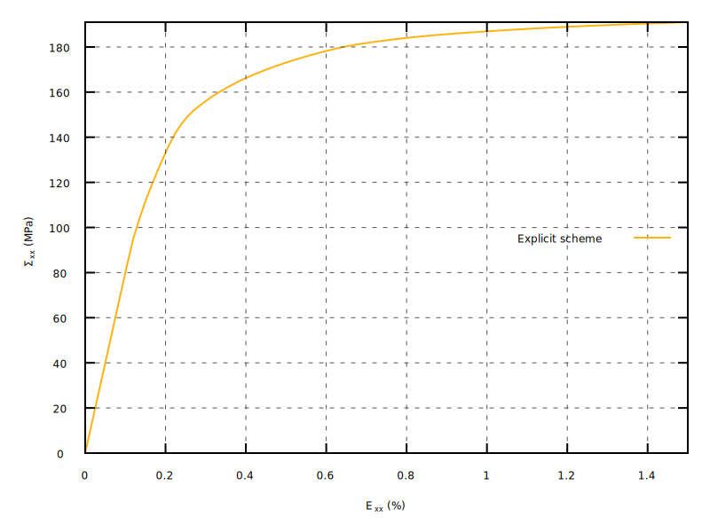

\newcommand{\paren}[1]{{\left(#1\right)}}
\newcommand{\trace}[1]{{\mathrm{tr}\paren{#1}}}
\newcommand{\tenseur}[1]{\underline{#1}}
\newcommand{\tenseurq}[1]{\underline{\underline{\mathbf{#1}}}}
\newcommand{\tSigma}{\tenseur{\Sigma}}
\newcommand{\Sigmaeq}{\Sigma_{\mathrm{eq}}}
\newcommand{\tEpsilonto}{\tenseur{E}^{\mathrm{to}}}
\newcommand{\tEpsilonel}{\tenseur{E}^{\mathrm{el}}}
\newcommand{\tEpsilonvp}{\tenseur{E}^{\mathrm{vp}}}
\newcommand{\tdEpsilonvp}{\tenseur{\dot{E}}^{\mathrm{vp}}}
\newcommand{\tsigma}{\tenseur{\sigma}}
\newcommand{\tepsilonto}{\tenseur{\varepsilon}^{\mathrm{to}}}
\newcommand{\tdepsilonto}{\tenseur{\dot{\varepsilon}}^{\mathrm{to}}}
\newcommand{\tepsilonel}{\tenseur{\varepsilon}^{\mathrm{el}}}
\newcommand{\tdepsilonel}{\tenseur{\dot{\varepsilon}}^{\mathrm{el}}}
\newcommand{\tepsilonvp}{\tenseur{\varepsilon}^{\mathrm{vp}}}
\newcommand{\tdepsilonvp}{\tenseur{\dot{\varepsilon}}^{\mathrm{vp}}}
\newcommand{\tepsilonp}{\tenseur{\varepsilon}^{\mathrm{p}}}
\newcommand{\tdepsilonp}{\tenseur{\dot{\varepsilon}}^{\mathrm{p}}}
\newcommand{\sstar}{\sigma_{\star}}
\newcommand{\pr}{\mathrm{\sigma_{m}}}
\newcommand{\sigmaeq}{\sigma_{\mathrm{eq}}}
\newcommand{\bts}[1]{{\left.#1\right|_{t}}}
\newcommand{\mts}[1]{{\left.#1\right|_{t+\theta\,\Delta\,t}}}
\newcommand{\ets}[1]{{\left.#1\right|_{t+\Delta\,t}}}
\newcommand{\dtot}{\mathrm{d}}
\newcommand{\deriv}[2]{{\displaystyle \frac{\displaystyle \partial #1}{\displaystyle \partial #2}}}
\newcommand{\derivtot}[2]{{\displaystyle \frac{\displaystyle \dtot #1}{\displaystyle \dtot #2}}}

\newcommand{\kphase}[1]{{#1}^{(k)}}
\newcommand{\lphase}[1]{{#1}^{(l)}}
\newcommand{\kislip}[1]{{#1}^{(k,i)}}

<!--
pandoc --pdf-engine=xelatex  -f markdown+tex_math_single_backslash -F pandoc-crossref -F pandoc-citeproc  --highlight-style=tango ExplicitBerveillerZaouiPolyCrystals.md -o ExplicitBerveillerZaouiPolyCrystals.pdf
-->

The aim of this report is to describe briefly the implementation of a
simple self-consistent polycrystalline model based on the use of the
Berveiller-Zaoui concentration rule [@berveiller_extension_1978]. This
model provides an explicit relationship between the local stress, inside
a crystallographic phase, and the macroscopic applied stress. This model
has been developed for microscopically isotropic elastic behaviour and
macroscopically isotropic plastic behaviour.

After a quick recall of the equations involved, an explicit
implementation of a polycrystal behaviours based on this homogeneization
scheme is presented in Sections @sec:mfront:bz:explicit_scheme. This
choice is justified by the huge number of state variables involved which
is *a priori* incompatible with an implicit resolution. The main trouble
with explicit scheme is the lack of consistent tangent operator which
degrades considerably the performance of most mechanical solvers at the
structural scale, the `Cast3M` solver being a noticeable exception du to
its specific resolution scheme
[@verpeaux_algorithmes_2014;@ramiere_iterative_2015].

The implementation described here can be downloaded
[here](downloads/ExplicitBerveillerZaouiPolyCrystals.tar.bz2).

# Constitutive equations

## Notations

- \(\tSigma\): the macroscopic stress.
- \(\Sigmaeq\): the macroscropic von Mises stress.
- \(\tEpsilonto\): the macroscopic strain.
- \(\tEpsilonvp\): the macroscopic viscoplastic strain.
- \(N_{g}\): number of grains/phases.
- \(\kphase{\tsigma}\): the microscopic stress of the
  k\(\mbox{}^{\text{th}}\) phase.
- \(\kphase{\phi}\): the volume fraction of the k\(\mbox{}^{\text{th}}\)
  phase:
  \[
  \kphase{\phi}=\dfrac{\kphase{V}}{\sum_{l=1}^{N_{g}}\lphase{V}}
  \]
- \(M\): the macroscropic shear modulus.
- \(\nu\): the macroscropic Poisson ratio.
- \(P\): the equivalent macroscropic viscoplastic strain.
- \(\kislip{g}\): plastic slip along the i\(\mbox{}^{\text{th}}\) slip
  system of the k\(\mbox{}^{\text{th}}\) phase.
- \(\kislip{\mu}\): orientation tensor of the i\(\mbox{}^{\text{th}}\)
  slip system of the k\(\mbox{}^{\text{th}}\) phase.

## The Berveiller-Zaoui homogeneisation scheme

In the framework of macroscopically isotropic elasto-plastic behaviors,
Berveiller and Zaoui have derived a self-consistent polycrystalline
model using a secant approximation for the linearization of the
non-linear behavior of the material [@berveiller_extension_1978]. The
grains of the polycrystal have equiaxed shape and the texture of the
material is isotropic. The elasticity is assumed homogeneous and
istropic In the case of monotonous radial loadings Berveiller and Zaoui
have shown that the local stress \(\kphase{\tsigma}\) applied in a
crystallographic phase \((i)\) (all the grains with nearly the same
orientation) can be expressed explicitly as a function of the local
plastic strain \(\kphase{\tepsilonvp}\), the macroscopic stress
\(\tSigma\) and the macroscopic plastic strain \(\tEpsilonvp\).

The macrosopic viscoplastic strain is linked to the microscopic local
plastic strain \(\kphase{\tepsilonvp}\) by a simple mixing rule:

\[
\tEpsilonvp=\sum_{k=1}^{N_{g}} \kphase{\phi}\,\kphase{\tepsilonvp}
\]{#eq:mfront:bz:Evp}

where \(\kphase{\phi}\) is the volume fraction of the
k\(\mbox{}^{\text{th}}\) phase.

The local stress \(\kphase{\tsigma}\) is given by the following
relationship[^betafactor]:

\[
\kphase{\tsigma}=\tSigma+2\,M\alpha\paren{\Sigmaeq,P}\,\paren{1-\beta\paren{\nu}}\,\paren{\tEpsilonvp-\kphase{\tepsilonvp}}\quad\text{with}\quad\beta\paren{\nu}=\dfrac{2}{15}\,\dfrac{4-5\,\nu}{1-\nu}
\]{#eq:mfront:bz:sig}

where:

- \(\Sigmaeq\) is the macroscropic von Mises stress.
- \(P\) is the equivalent macroscropic viscoplastic strain defined in an
  incremental way as follows:
  \[
  \dot{P}=\sqrt{\dfrac{2}{3}\,\tdEpsilonvp\,\colon\,\tdEpsilonvp}
  \]

[^betafactor]: The \(\beta\paren{\nu}\) factor is closed to
\(\frac{1}{2}\) for a macroscopic Poisson ratio close to \(0.3\). In
this case, the Localisation Equation @eq:mfront:bz:sig may be simplified
as:
\[
\kphase{\tsigma}=\tSigma+M\alpha\paren{\Sigmaeq,P}\,\paren{\tEpsilonvp-\kphase{\tepsilonvp}}
\]

The function \(\alpha\paren{\Sigmaeq,P}\) is called the accommodation
function. It represents the plastic accommodation between the
Homogeneous Equivalent Medium and the considered crystallographic phase
(r) in inclusion (spherical inclusion). The expression of the
accommodation function is as follows:

\[
\alpha\paren{\Sigmaeq,P}=\dfrac{2\,\Sigmaeq}{2\,\Sigmaeq+3\,M\,P}
\]

Using this explicit concentration rule, it is particularly simple to
compute the overall response of a polycrystalline material, provided the
intra-granular constitutive behaviour is known.

## Intra-granular constitutive behavior

In this report, we assume that the local constitutive equations have the
following form:

\[
\kphase{\tdepsilonvp}=\kphase{v}\paren{\kphase{\tsigma}}
\]{#eq:mfront:bz:flow_rule}

In this report, the microscopic plastic strain may results from the
slips along the slip systems of the crystal following:

\[
\kphase{\tdepsilonvp}=\sum_{i=1}^{N_{s}}\kislip{\dot{g}}\,\kislip{\mu}\quad\text{with}\quad\kislip{\dot{g}}=\left\langle\dfrac{\kphase{\sigma}\,\colon\,\kislip{\mu}-R_{0}}{K}\right\rangle^{n}
\]

This constitutive equation is very simple, but extensions of the
proposed integration scheme to more complex ones , such as i.e. the
Méric-Cailletaud behaviour [@meric_single_1991], is straightforward
using the proposed explicit scheme.

For the example, we will follow the work of Onimus et al. with sightly
modified material coefficients [@onimus_polycrystalline_2009].

# Explicit integration scheme {#sec:mfront:bz:explicit_scheme}

The first explicit implementation of a polycrystal based on the
Berveiller and Zaoui homogeneization scheme and the Méric-Cailletaud
single crystal behaviour at the grain scale [@meric_single_1991] is due
to Jean-Michel Proix (EDF) and is available in the sources of
`MFront`[^BZJMP]. Other implementations based on more complex local
behaviours inspired by results from the Dislocation Dynamics are also
available [@edf_comportements_2013].

This section presents the successive steps to implement the
polycrystalline model in `MFront` using an explicit scheme. 

[^BZJMP]: <https://github.com/thelfer/tfel/blob/master/mfront/tests/behaviours/PolyCrystals.mfront>

## `MFront`' Implementation

### Choice of the domain specific language

Domain specific languages (DSL) are of the main concept of `MFront`. It
specifies a kind of material knowledge and a kind of numerical scheme .
It also introduces a specific syntax for the implementation to be both
efficient and explicit.

For a small strain behaviour integrated using an explicit scheme, the
appropriate domain specific language is called `RungeKutta`. By
convention, the declaration of the domain specific language is placed at
the beginning of the `MFront` file:

~~~~{.cxx}
@DSL RungeKutta;
~~~~

### Name of the behaviour

The `@Behaviour` keyword allows defining the name of the behaviour, as
follows:

~~~~{.cxx}
@Behaviour PolycrystalHCP_BZ;
~~~~

### Metadata

~~~~{.cxx}
@Author F. Onimus, C. Gicquel, T. Helfer;
@Date 05/2020;
@Description{
  Implementation of a polycrystal of behaviour  for
  zirconium alloys using the Berveiller-Zaoui
  homegeneization scheme. The presented behaviour
  is inspired from Onimus 2009 which modified
  material coefficients.

  "Onimus, Fabien and Béchade, Jean-Luc."
  "A polycrystalline modeling of the mechanical behavior of"
  "neutron irradiated zirconium alloys."
  "Journal of Nuclear Materials. 15 February 2009."
  "Vol. 384, no. 2, p. 163-174."
}
~~~~

### Symmetry of the material

The material considered will be isotropic on the macroscopic scale.
However, due to restrictions to the keywords defining slips systems (see
Section @sec:mfront:bz:slips_systems), the behaviour must be declared
orthotropic.

~~~~{.cxx}
@OrthotropicBehaviour;
~~~~

### Supported modelling hypothesis

The class defining the slips systems declares \(3D\) orientation tensors
(see Section @sec:mfront:bz:slips_systems and
@sec:mfront:bz:slips_systems2). To avoid conversions, we restrict the
behaviour to be only valid in `3D`:

~~~~{.cxx}
@ModellingHypothesis Tridimensional;
~~~~

Note that such a restriction, when applicable, notably reduces the
compilation times.

### Choice of the algorithm

Among the different schemes available the choice is made to use the
Runge-Kutta 5/4 algorithm (which is the default):

~~~~{.cxx}
@Algorithm rk54;
~~~~

### Declaration of the slip systems{#sec:mfront:bz:slips_systems}

The considered material as an hexagonal close packed crystallographic
structure and four families of slip systems:

- the first slip system corresponds to         // systèmes prismatiques A
- the second slip system corresponds to         // systèmes prismatiques C+1
- the third slip system corresponds to         // systèmes basaux A
- the fourth slip system corresponds to         // systèmes pyramidaux A

Those slip systems are declared in a straightforward manner using the
functionalities provided by the [`NUMODIS` code](http://www.numodis.fr):

~~~~{.cxx}
@CrystalStructure HCP;
@SlidingSystems{<1, 1, -2, 0>{1, -1, 0, 0},
                <-2, 1, 1, 3>{1, -1, 0, 1},
                <-2, 1, 1, 0>{0, 0, 0, 1},
                <1, 1, -2, 0>{1, -1, 0, 1}};
~~~~

Those keywords are fully described on this page:
<https://thelfer.github.io/tfel/web/singlecrystal.html>.

They generate a class called `PolycrystalHCP_BZSlipSystems` which contains
the orientation tensors of the all the slip systems.

### Handling textures{#sec:mfront:bz:slips_systems2}

Altough, the `PolycrystalHCP_BZSlipSystems` class contains all the
information for a single crystal, a polycrystaline behaviour must handle
the texture of the material, i.e. the orientation and the volume
fraction of each phase. It is not relevant to hard-code such
information, so we rely on an external text file. For efficiency
reasons, the external file must be read and processed only once at the
beginning of the computation.

To do this, we rely on an external class called
`ExtendedPolyCrystalsSlidingSystems` which implements the singleton
pattern [^PolyCrystalsSlidingSystems] [@gamma_design_1994].

This class is declared in an external header file which is included as
follows:

~~~~{.cxx}
@Includes{
#include "TFEL/Material/ExtendedPolyCrystalsSlidingSystems.hxx"
}
~~~~

[^PolyCrystalsSlidingSystems]: This class is an extension of the
`PolyCrystalsSlidingSystems` that is provided by the `TFEL/Material`
library, hence its name.

The description of the implementation of this class is out of the scope
of the present report, so we will only focus on the main points of
interest for the rest of this report.

The `ExtendedPolyCrystalsSlidingSystems` class has tree template
arguments:

- The number of phases.
- The class describing the sliding system of one phase. This class is
  obviously the `PolycrystalHCP_BZSlipSystems` class defined previously.
- The numeric type used.

This class provides the `getPolyCrystalsSlidingSystems` static method as
the unique way to retrieve the unique instance of this class. This
method takes the name of a external text file. Each line of this file
describe a phase by three Euler angles (in degree) and a volume
fraction.

The unique instance of the `ExtendedPolyCrystalsSlidingSystems`
has two data members of interest:

- `mus`: the tensors of directional senses, sorted by phases. Those
  orientation tensors are expressed in the material frame, not in frame
  associated with the given phase.
- `volume_fractions`: the volume fractions per phases.

### Number of phases  {#sec:mfront:bz:nphases}

We then need to indicate the number of phases (i.e. groups of grains
with identical orientation).

~~~~{.cxx}
@IntegerConstant Np  = 240;
~~~~

This number must be consistent with the number of phases read in the
external file given as argument to the `getPolyCrystalsSlidingSystems`
method.

### Elastic properties

The material is assumed to be isotropic. The `@ComputeStiffnessTensor`
is used here to compute the stiffness tensor using the macroscopic Young
modulus and the macroscopic `Poisson` ratio:

~~~~{.cxx}
@ComputeStiffnessTensor {
  80000., 0.4
};
~~~~

This keywords automatically declares and initializes a fourth order
tensor named \(\tenseurq{D}\).

### Material coefficients {#sec:mfront:bz:parameters}

Using the keyword `@Parameters` one can then define some useful
parameters such as the critical resolved shear stresses of the gliding
systems or the other coefficients involved in the intra-granular
constitutive laws:

~~~~{.cxx}
//! Norton exponents per slip system family
@Parameter real m[4] = {10., 10., 10., 10.};
//! Norton stress normalisation factor
@Parameter stress K = 5.0;
//! critical resolved shear stress per slip system family
@Parameter stress τᶜ[4] = {43.0, 135.0, 75.0, 65.0};
~~~~

### Declaration of internal variables

We now need to define the internal variables such as macroscopic and
microscopic plastic strain and its norm. This is done using the keyword
`@StateVariable`. Those quantities are meant to evolve during the
calculation :

~~~~{.cxx}
//! macroscopic plastic strain
@StateVariable StrainStensor    epsp;
//! microscopic plastic strain
@StateVariable StrainStensor    epsg[Np]; 
//! plastic strain’s norm
@StateVariable real    pg;
~~~~

### Computation of the macroscopic stress 

The macroscopic stress is computed from the macroscopic elastic strain
and the macroscopic stiffness tensor as follows:

~~~~{.cxx}
@ComputeStress{
  sig = D * eel;
}
~~~~~

This code is used to compute the stress before each evaluation of the
rate of the internal state variables and and the end of the time step to
compute the final stress.

### Equations of the system

Using the `@Derivative` code block, the evolution of the internal
variables can now be implemented.

~~~~{.cxx}
@Derivative{
~~~~

As described earlier, the orientation tensors of all the phases is
handled by the `ExtendedPolyCrystalsSlidingSystems`. This class being a
template, its use is tedious. For the sake of simplicity, we declare an
alias `PCSlidingSystems` which hides some of the details associated with
the use of the `ExtendedPolyCrystalsSlidingSystems` class:

~~~~{.cxx}
  using PCSlidingSystems = 
    ExtendedPolyCrystalsSlidingSystems<Np, PolycrystalHCP_BZSlipSystems<real>, real>;
~~~~

The following line retrieves the unique instance of the
`ExtendedPolyCrystalsSlidingSystems` class and give the name of the file
containing the description of the phases.

~~~~{.cxx}
  const auto& gs = PCSlidingSystems::getPolyCrystalsSlidingSystems("isotrope_240_normalise.csv");
~~~~

~~~~{.cxx}
  // macroscopic equivalent stress
  const auto σᵉ = sigmaeq(σ);
~~~~

The macroscopic strain rate is then initialised to zero:

~~~~{.cxx}
  // initialisation of the macroscopic strain rate
  ∂ₜεᵛᵖ = Stensor(strainrate(0));
~~~~

Then, the loop over the phases is started, as follows:

~~~~{.cxx}
  // loop over the phases
  for (unsigned short k = 0; k != Np; ++k) {
    // volume fraction of the phase
    const auto φ = gs.volume_fractions[k];
~~~~

The local stress is computed following the Berveiller-Zaoui scheme
(Equation @eq:mfront:bz:sig):

~~~~{.cxx}
    // local stress following the Berveiller-Zaoui scheme
    auto σᵍ = StressStensor(stress(0));
    if (2 ⋅ σᵉ + 3 ⋅ Mu ⋅ p > 0) {
      const auto α = 2 ⋅ σᵉ / (2 ⋅ σᵉ + 3 ⋅ Mu ⋅ p);
      σᵍ = σ + 2 ⋅ (1 - β) ⋅ Mu ⋅ α ⋅ (εᵛᵖ - εᵛᵖᵍ[k]);
    }
~~~~

We then initialise the microscopic strain rate:

~~~~{.cxx}
    // initialisation of the microscopic strain rate
    ∂ₜεᵛᵖᵍ[k] = Stensor(strainrate(0));
~~~~

We now start the loop over the slip system of the considered phase and
evaluate the contribution to the microscopic strain rate:

~~~~{.cxx}
    for (unsigned short i = 0; i != Nss; ++i) {
      const auto idx = [&i] {
        if (i <= 2) {
          return 0;
        } else if (i >= 3 && i <= 14) {
          return 1;
        } else if (i >= 15 && i <= 17) {
          return 2;
        }
        return 3;
      }(); // return the family number 
      // orientation tensors in the material frame
      const auto& μⁱᵏ = gs.mus[k][i];
      // resolved shear stress
      const auto τ = μⁱᵏ | σᵍ;
      const auto rτ = (abs(τ) - τᶜ[idx]) / K;
      if (rτ > 0) {
        const auto sgn = τ > 0 ? 1 : -1;
        const auto ∂ₜg = sgn ⋅ pow(rτ, m[idx]);
        dεᵛᵖᵍ[k] += ∂ₜg ⋅ μⁱᵏ;
      }
    } // end of the loop over the slip systems
~~~~

The macroscopic strain rate is then updated by the contribution of the
considered phase:

~~~~{.cxx}
    ∂ₜεᵛᵖ += ∂ₜεᵛᵖᵍ[k] ⋅ φ;
  } // end of the loop over the phases
~~~~

After the loop over the phases, one can update the rate of the
macroscopic equivalent plastic strain and the macroscopic elastic strain
rate:

~~~~{.cxx}
  // rate of the macroscopic equivalent plastic strain
  ∂ₜp = sqrt((2 ⋅ (∂ₜεᵛᵖ | ∂ₜεᵛᵖ)) / 3);
  // elastic strain rate
  ∂ₜεᵉˡ = ∂ₜεᵗᵒ - ∂ₜεᵛᵖ;
~~~~

The only tangent operator available is the elastic operator. This leads
to this simple implementation of the `@TangentOperator` code block:

~~~~{.cxx}
@TangentOperator {
  Dt = D;
}
~~~~

## Unit testing {#sec:mfront:bz:uniaxialtensiletest}

The following `MTest` file imposes a tensile test with a constant strain
rate of \(2\,10^{-4}\, s^{-1}\) in the tensile direction:

~~~~{.cxx}
@AccelerationAlgorithm 'Cast3M';
@StiffnessMatrixType 'Elastic' ;
@Behaviour 'src/libBehaviour.so' 'PolycrystalHCP_BZ';
@ExternalStateVariable 'Temperature' 293.15;
@Real 'tmax' 75 ;
@ImposedStrain 'EXX' {0.: 0., 75 : 0.015 };
@Times {0.,'tmax' in 1000};
~~~~

Note that since the explicit behaviour does not provide a consistent
tangent operator, we rely on an elastic search operator. The equilibrium
iterations are accelerated using the `Cast3M` acceleration scheme which
mimics the algorithm used by this code
[@verpeaux_algorithmes_2014;@ramiere_iterative_2015].

Specifying the temperature is required, although not used by the
behaviour.

{#fig:mfront:bz:tensile_test width=75%}

The stress-strain curve obtained with the polycrystal behaviour on a
simple tensile test is reported in Figure @fig:mfront:bz:tensile_test.

# Conclusions

Extensions to the proposed implicit scheme to other well-known
homogeneizations schemes are straightforward, including the work of
Taylor-Lin, Kröner, Cailletaud-Pilvin (\(\beta\)-model) and their
extension by Besson et al.

# References