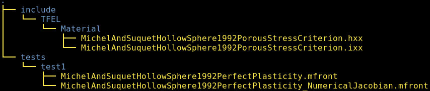
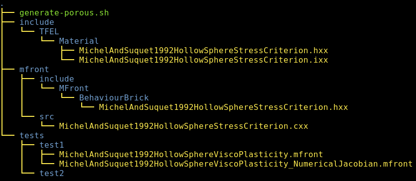

\newcommand{\bts}[1]{{\left.#1\right|_{t}}}
\newcommand{\mts}[1]{{\left.#1\right|_{t+\theta\,\Delta\,t}}}
\newcommand{\ets}[1]{{\left.#1\right|_{t+\Delta\,t}}}
\newcommand{\trace}[1]{{\mathrm{tr}\paren{#1}}}
\newcommand{\tenseur}[1]{\underline{#1}}
\newcommand{\tenseurq}[1]{\underline{\underline{\mathbf{#1}}}}
\newcommand{\tns}[1]{{\underset{\tilde{}}{\mathbf{#1}}}}
\newcommand{\transpose}[1]{{#1^{\mathop{T}}}}

\newcommand{\tepsilonto}{\tenseur{\varepsilon}^{\mathrm{to}}}
\newcommand{\tepsilonel}{\tenseur{\varepsilon}^{\mathrm{el}}}
\newcommand{\tepsilonvp}{\tenseur{\varepsilon}^{\mathrm{vp}}}
\newcommand{\tdepsilonvp}{\tenseur{\dot{\varepsilon}}^{\mathrm{vp}}}
\newcommand{\tsigma}{\underline{\sigma}}
\newcommand{\sigmaeq}{\sigma_{\mathrm{eq}}}
\newcommand{\Frac}[2]{{{\displaystyle \frac{\displaystyle #1}{\displaystyle #2}}}}
\newcommand{\deriv}[2]{{\displaystyle \frac{\displaystyle \partial #1}{\displaystyle \partial #2}}}
\newcommand{\sderiv}[2]{{\displaystyle \frac{\displaystyle \partial^{2} #1}{\displaystyle \partial #2^{2}}}}
\newcommand{\dtot}{{{\mathrm{d}}}}
\newcommand{\paren}[1]{{\left(#1\right)}}

This document gives some insights on how a user may extend the
`StandardElastoViscoPlasticity` brick by adding a new stress criterion
coupled with porosity evolution.

The `StandardElastoViscoPlasticity` brick is fully described
[here](StandardElastoViscoPlasticityBrick.html).

Introducing a new porous stress criterion in the
`StandardElastoViscoPlasticity` brick has two main steps:

- Extending the `TFEL/Material` library.
- Extending the `TFELMFront` library.

> **Note**
>
> This tutorial only covers *isotropic* stress criteria.
> Orthotropic stress criteria requires to take care of
> the orthotropic axes convention.
> 
> See the documentation of the `@OrthotropicBehaviour`
> keyword for details:
>
> ~~~~{.sh}
> mfront --help-keyword=Implicit:@OrthotropicBehaviour
> ~~~~

Those steps are illustrated by the implementation so-called hollow
sphere criterion proposed by Michel and Suquet which describe the
macroscopic viscoplasticty of a porous material by the following law
(see @michel_constitutive_1992):

The viscoplastic strain rate is defined by:

\[
\tdepsilonvp=\dot{\varepsilon}_{0}\,\paren{\Frac{\sigmaeq^{MS}}{\sigma_{0}}}^{E}\,\tenseur{n}^{MS}
\]

where:

- \(\dot{\varepsilon}_{0}\) is a reference strain rate which shall be identified.
- \(\sigma_{0}\) is a reference stress used to normalise the stress.
- \(E\) is the Norton exponent.

The stress criterion \(\sigmaeq^{MS}\) is defined by:

\[
\sigmaeq^{MS}=\sqrt{\Frac{9}{4}\,A\paren{f}\,p^{2}+B\paren{f}\,\sigmaeq^{2}}
\]

where:

- \(p\) is the hydrostatic pressure (\(p=\Frac{1}{3}\trace{\tsigma}\)).
- \(\sigmaeq\) is the von Mises stress.
- \(A\paren{f}=\paren{n\,\paren{f^{-1/n}-1}}^{\frac{-2\,n}{n+1}}\)
- \(B\paren{f}=\paren{1+\Frac{2}{3}\,f}\,\paren{1-f}^{\frac{-2\,n}{n+1}}\)
- \(n\) is the Norton exponent of the matrix

This flow is associated, to the flow direction is given by:

\[
\tenseur{n}^{MS}=\deriv{\sigmaeq^{MS}}{\tsigma}
\]

> **Implicit schemes**
>
> This document assumes that the reader has prior knowledge on how the
> integrate a behaviour using an implicit scheme with `MFront`.
>
> Appropriate introductory materials are given in the
> [gallery](gallery.html).

# Extending the `TFEL/Material` library

## Template files

We recommend that you use the following template files:

- [`PorousStressCriterionTemplate.hxx`](cxx/include/TFEL/Material/PorousStressCriterionTemplate.hxx)
- [`PorousStressCriterionTemplate.ixx`](cxx/include/TFEL/Material/PorousStressCriterionTemplate.ixx)
- [`PorousStressCriterionTest.mfront`](mfront/PorousStressCriterionTest.mfront)
- [`PorousStressCriterionTest_NumericalJacobian.mfront`](mfront/PorousStressCriterionTest_NumericalJacobian.mfront)

The first file declares:

- A set of aliases
- A data structure holding the structure associated with the criterion.
- Three functions which allows the computation of:
  - The value of the stress criterion for the given stress state.
  - The value of the stress criterion and its first derivative for the
    given stress state.
  - The value of the stress criterion and its first and second
    derivatives for the given stress state.

The second file give a skeleton required to implement those three
functions.

Implementing a new stress criterion boils down to the following steps:

1. Rename those file to explicitly indicate the name of the stress
  criterion.
2. Replace the following strings by the appropriate values as described
  below:
  - `__Author__`
  - `__Date__`
  - `__PorousStressCriterionName__`
  - `__STRESS_CRITERION_NAME__`
3. Implement the three previous functions
4. Test your implementation in `MFront` and `MTest` (or your favorite
   solver).

## Creating a proper working directory for the example of the so-called hollow sphere criterion proposed by Michel and Suquet

In this paragraph, we detail Steps 1 and 2. for the case of the
so-called hollow sphere criterion proposed by Michel and Suquet
criterion (see @michel_constitutive_1992) which will be used as an
illustrative example throughout this document. We describe all those
steps in details and finally gives a shell script that automates the
whole process for `LiNuX` users. When providing command line examples,
we assume that the shell is `bash`.

The header files `PorousStressCriterionTemplate.hxx` and
`PorousStressCriterionTemplate.ixx` are placed in a subdirectory called
`include/TFEL/Material` and renamed respectively
`MichelAndSuquet1992HollowSphereTestStressCriterionTest.hxx` and
`MichelAndSuquet1992HollowPorousStressCriterionTest.ixx`.

The `MFront` template files must be copied in the working directory and
renamed appropriatly.

This can be done by taping the following commands in the terminal (under
`LiNuX` or `Mac Os`):

~~~~{.bash}
$ mkdir -p include/TFEL/Material
$ mkdir -p tests/test1
$ mv PorousStressCriterionTemplate.hxx \
     include/TFEL/Material/MichelAndSuquet1992HollowSphereTestStressCriterion.hxx
$ mv PorousStressCriterionTemplate.ixx \
     include/TFEL/Material/MichelAndSuquet1992HollowSphereTestStressCriterion.ixx
$ mv PorousStressCriterionTest.mfront \
     tests/test1/MichelAndSuquet1992HollowSphereTestViscoPlasticity.mfront
$ mv PorousStressCriterionTest_NumericalJacobian.mfront \
     tests/test1/MichelAndSuquet1992HollowSphereTestViscoPlasticity_NumericalJacobian.mfront
~~~~

The working directory is thus organized as follows:

{width=100%}

In all those files, we now replace 

- `__Author__` by `Thomas Helfer, Jérémy Hure, Mohamed Shokeir`
- `__Date__` by `20/07/2020`
- `__StressCriterionName__` by `MichelAndSuquet1992HollowSphereTest`
- `__STRESS_CRITERION_NAME__` by `MICHEL_SUQUET_1992_HOLLOW_SPHERE_TEST`

You may use your favourite text-editor to do this or use the following
command (for `LiNuX` users) :

~~~~{.sh}
for f in $(find . -type f);                                                \
do sed -i                                                                  \
  -e 's|__Author__|Thomas Helfer, Jérémy Hure, Mohamed Shokeir|g;'         \
  -e 's|__Date__|24/03/2020|g;'                                            \
  -e 's|__StressCriterionName__|MichelAndSuquet1992HollowSphereTest|g;'                        \
  -e 's|__STRESS_CRITERION_NAME__|MICHEL_SUQUET_1992_HOLLOW_SPHERE_TEST|g' $f ; \
done
~~~~

All those steps are summarized in the following script, which can be
downloaded [here](scripts/generate-porous.sh).

In conclusion, a recommended for starting the development of the a new
stress criterion is to download the previous script, modify
appropriately the first lines to match your need and run it.

> **Note**
>
> At this stage, you shall already be able to verify that the provided
> `MFront` implementations barely compiles by typing in the
> `tests/test1` directory:
>
> ~~~~{.sh}
> mfront -I $(pwd)/../../include --obuild \
>        --interface=generic        \
>        MichelAndSuquet1992HollowSphereTestPerfectPlasticity.mfront
> ~~~~
>
> Note the `-I $(pwd)/../../include` flags which allows `MFront` to find the
> header files implementing the stress criterion (In `bash`, `$(pwd)`
> return the current directory).

## Implementing the Michel and Suquet' hollow sphere stress criterion

In this paragraph, we detail all the steps required to implement the
Michel and Suquet' hollow sphere stress criterion. In a new directory,
we just follow the steps given by the previous paragraph:

~~~~{.sh}
wget http://tfel.sourceforge.net/scripts/generate-porous.sh
chmod +x generate-porous.sh
./generate-porous.sh
~~~~

### Modifying the `MichelAndSuquet1992HollowSphereTestStressCriterionParameters` data structure

The `MichelAndSuquet1992HollowSphereTestStressCriterionParameters` data structure, declared in
`MichelAndSuquet1992HollowSphereTestStressCriterion.hxx`, must contain the
values of the Norton exponent of the matrix \(n\).

In the implementation, we will also need to define two small values:

- `feps`, which will be used to tell if the porosity is closed to its
  physical bounds, \(0\) and \(1\).
- `feps2`, which will be used to regularise the derivative
  \(\deriv{A}{f}\) as described below.

We modify it as follows:

~~~~{.cxx}
template <typename StressStensor>
struct MichelAndSuquet1992HollowSphereTestStressCriterionParameters {
  //! a simple alias
  using real = MichelAndSuquet1992HollowSphereTestBaseType<StressStensor>;
  //! \brief \f$n\f$ is the Norton exponent of the matrix
  real n;
  //! \brief \f$feps\f$ is a small numerical parameter
  real feps = real(1e-14); 
  //! \brief \f$feps\f$ is a small numerical parameter
  real feps2 = real(1e-5); 
};  // end of struct MichelAndSuquet1992HollowSphereTestStressCriterionParameters
~~~~

This is the only modification of the
`MichelAndSuquet1992HollowSphereTestStressCriterion.hxx` file.

### Include `TFEL/Math/General/IEEE754.hxx` header

The `TFEL/Math/General/IEEE754.hxx` header reimplements a set of
standard functions which does not work as expected under `gcc` when the
`-ffast-math` flag is used.

The header must be included at the top of the
`MichelAndSuquet1992HollowSphereTestStressCriterion.ixx` file as follows:

~~~~{.cxx}
#include "TFEL/Math/General/IEEE754.hxx"
~~~~

### Implementing the output stream operator for the `MichelAndSuquet1992HollowSphereTestStressCriterionParameters` data structure

The output stream operator must now be implemented in the
`MichelAndSuquet1992HollowSphereTestStressCriterion.ixx` file:

~~~~{.cxx}
template <typename StressStensor>
std::ostream &operator<<(std::ostream &os,
                         const MichelAndSuquet1992HollowSphereTestStressCriterionParameters<StressStensor> &p) {
  os << "{n: " << p.n << ", feps: " << p.feps << ", feps2: " << p.feps2 << "}";
  return os;
} // end of operator<<
~~~~

This operator is useful when compiling `MFront` files in `debug` mode.

### Implementing the `computeMichelAndSuquet1992HollowSphereTestStress` function

The `computeMichelAndSuquet1992HollowSphereTestStress` function is implemented in the
`MichelAndSuquet1992HollowSphereTestStressCriterion.ixx` file.

The main difficulty is the computation of \(A\paren{f}\) when the
porosity ends toward \(0\). The limit is well defined, but the
intermediate expression \(f^{-1/n}\) is undefined. To avoid this issue,
we will use the following approximated expression:

\[
A_{\varepsilon}\paren{f}=\paren{n\,\paren{A_{0}\paren{f}-1}}^{\frac{-2\,n}{n+1}}\quad\text{with}\quad
A_{0}\paren{f}=
\left\{
\begin{aligned}
\paren{n\,\paren{\paren{\Frac{f+f_{\varepsilon}}{2}}^{-1/n}-1}}^{\frac{-2\,n}{n+1}}&\quad\text{if}\quad&f\leq f_{\varepsilon}\\
\paren{n\,\paren{f^{-1/n}-1}}^{\frac{-2\,n}{n+1}}&\quad\text{if}\quad&f> f_{\varepsilon}
\end{aligned}
\right.
\]

With this expression, this implementation is straightforward:

~~~~{.cxx}
template <typename StressStensor>
MichelAndSuquet1992HollowSphereTestStressType<StressStensor> computeMichelAndSuquet1992HollowSphereTestStress(
    const StressStensor& sig,
    const MichelAndSuquet1992HollowSphereTestPorosityType<StressStensor> f,
    const MichelAndSuquet1992HollowSphereTestStressCriterionParameters<StressStensor>& p,
    const MichelAndSuquet1992HollowSphereTestStressType<StressStensor> seps) {
  // a simple alias to the underlying numeric type
  using real = MichelAndSuquet1992HollowSphereTestBaseType<StressStensor>;
  constexpr const auto cste_3_2 = real(3) / 2;
  constexpr const auto cste_9_4 = real(9) / 4;
  const auto s = deviator(s);
  const auto s2 = cste_3_2 * (s | s);
  const auto pr = trace(sig) / 3;
  const auto n = p.n;
  const auto is_zero = tfel::math::ieee754::fpclassify(f) == FP_ZERO;
  const auto A0 = f < p.feps ? pow((f + p.feps) / 2, -1 / n) : pow(f, -1 / n);
  const auto A = is_zero ? 0 : pow(n * (A0 - 1), -2 * n / (n + 1));
  const auto B = (1 + (2 * f) / 3) * pow(1 - f, -2 * n / (n + 1));
  return std::sqrt(cste_9_4 * A * pr * pr + B * s2);
}  // end of computeMichelAndSuquet1992HollowSphereTestYieldStress
~~~~

> **Note**
>
> It is worth trying to recompile the `MFront` file at this stage to see
> if one did not introduce any error in the `C++` code.

### Implementing the `computeMichelAndSuquet1992HollowSphereTestStressNormal` function

This function computes the equivalent stress, its normal and its
derivative with respect to the porosity.

The expression of the normal is:

\[
\begin{aligned}
\tenseur{n}^{MS} &= \deriv{\sigmaeq^{MS}}{\tsigma} =
\deriv{\sigmaeq^{MS}}{p}\,\deriv{p}{\tsigma}+
\deriv{\sigmaeq^{MS}}{\sigmaeq}\,\deriv{\sigmaeq}{\tsigma}\\
&=\Frac{3}{2\,\sigmaeq^{MS}}\,\paren{\Frac{1}{2}\,A\,p\,\tenseur{I}+B\,\tenseur{s}}
\end{aligned}
\]

where \(\tenseur{s}\) is the deviatoric part of the stress.

The expression of \(\deriv{\sigmaeq^{MS}}{f}\) is given by:

\[
\deriv{\sigmaeq^{MS}}{f}=\Frac{1}{\sigmaeq^{MS}}\paren{\Frac{9}{8}\,p^{2}\,\deriv{A}{f}+\Frac{1}{2}\,\sigmaeq^{2}\,\deriv{B}{f}}
\]

The expression of \(\deriv{A}{f}\) can be computed straightforwardly:

\[
\deriv{A}{f}=\Frac{2\,A_{0}\paren{f}}{f\,\paren{A_{0}\paren{f}-1}\,\paren{n+1}}\,A\paren{f}
\]

However, this derivative tends to infinity when the porosity tends to
zero. The following approximated expression will be used in practice:

\[
\paren{\deriv{A}{f}}_{\varepsilon}=\Frac{2\,A_{0}\paren{f}}{\paren{f+f_{\varepsilon_{2}}}\,\paren{A_{0}\paren{f}-1}\,\paren{n+1}}\,A\paren{f}
\]

Let us decompose \(B\paren{f}\) as the product of two terms:

\[
B\paren{f}=B_{1}\paren{f}\,B_{2}\paren{f}
\]

with:

f- \(B_{1}\paren{f}=1+\Frac{2}{3}\,f\)
- \(B_{2}\paren{f}=\paren{1-f}^{\frac{-2\,n}{n+1}}\)

The derivative \(\deriv{B}{f}\) is thus:

\[
\deriv{B}{f}=B_{2}\paren{f}\,\deriv{B_{1}}{f}+B_{1}\paren{f}\,\deriv{B_{2}}{f}
\]

with:

- \(\deriv{B_{1}}{f}=\Frac{2}{3}\)
- \(\deriv{B_{2}}{f}=\Frac{2\,n}{\paren{1-f}\,\paren{n+1}}\,B_{2}\paren{f}\)

This expression introduces the inverse of the equivalent stress which
may lead to numerical troubles. To avoid those issues, a numerical
threshold is introduced in the computation of the inverse in our
implementation:

~~~~{.cxx}
template <typename StressStensor>
std::tuple<MichelAndSuquet1992HollowSphereTestStressType<StressStensor>,
           MichelAndSuquet1992HollowSphereTestStressNormalType<StressStensor>,
           MichelAndSuquet1992HollowSphereTestStressDerivativeWithRespectToPorosityType<StressStensor>>
computeMichelAndSuquet1992HollowSphereTestStressNormal(
  using real = MichelAndSuquet1992HollowSphereTestBaseType<StressStensor>;
  constexpr const auto id =
      MichelAndSuquet1992HollowSphereTestStressNormalType<StressStensor>::Id();
  constexpr const auto cste_2_3 = real(2) / 3;
  constexpr const auto cste_3_2 = real(3) / 2;
  constexpr const auto cste_9_4 = real(9) / 4;
  const auto s = deviator(sig);
  const auto s2 = cste_3_2 * (s | s);
  const auto pr = trace(sig) / 3;
  const auto n = p.n;
  const auto d = 1 - f;
  const auto inv_d = 1 / std::max(d, p.feps);
  const auto is_zero = tfel::math::ieee754::fpclassify(f) == FP_ZERO;
  const auto A0 = f < p.feps ? pow((f + p.feps) / 2, -1 / n) : pow(f, -1 / n);
  const auto A = is_zero ? 0 : pow(n * (A0 - 1), -2 * n / (n + 1));
  const auto B1 = 1 + cste_2_3 * f;
  const auto B2 = pow(1 - f, -2 * n / (n + 1));
  const auto B = B1 * B2;
  const auto seq = std::sqrt(cste_9_4 * A * pr * pr + B * s2);
  const auto iseq = 1 / (std::max(seq, seps));
  const auto dseq_dsig = cste_3_2 * iseq * ((A * pr / 2) * id + B * s);
  const auto dA_df = 2 * A * A0 / (std::max(f, p.feps2) * (A0 - 1) * (n + 1));
  const auto dB1_df = cste_2_3;
  const auto dB2_df = 2 * n * B2 * inv_d / (n + 1);
  const auto dB_df = B1 * dB2_df + B2 * dB1_df;
  const auto dseq_df = (cste_9_4 * pr * pr * dA_df + s2 * dB_df) * (iseq / 2);
  return {seq, dseq_dsig, dseq_df};
}  // end of computeMichelAndSuquet1992HollowSphereTestStressNormal
~~~~

> **Note**
>
> At this stage, the `MFront` implementation based on a numerical
> jacobian could be fully functional if one modifies the
> `@InitLocalVarialbes` block to initialize the parameters of
> stress criterion.

### Implementing the `computeMichelAndSuquet1992HollowSphereTestStressSecondDerivative` function

This function computes:

- the equivalent stress \(\sigmaeq^{MS}\),
- the normal \(\tenseur{n}^{MS}=\deriv{\sigmaeq^{MS}}{\tsigma}\)
- the derivative of the equivalent stress with respect to the porosity \(\deriv{\sigmaeq^{MS}}{f}\)
- the derivative of the normal with respect to the stress \(\deriv{\tenseur{n}^{MS}}{\sigma}\).
- the derivative of the normal with respect to the porosity \(\deriv{\tenseur{n}^{MS}}{f}\).

Let us write the normal as:

\[
\tenseur{n}^{MS}=\Frac{1}{\sigmaeq^{MS}}\,\tenseur{C}
\]

with \(\tenseur{C}=\Frac{3}{2}\,\paren{\Frac{1}{2}\,A\,p\,\tenseur{I}+B\,\tenseur{s}}\)

The expression of the derivative of the normal with respect to the
stress is then:

\[
\deriv{\tenseur{n}^{MS}}{\sigma}=
\Frac{1}{\sigmaeq^{MS}}\,\paren{\deriv{\tenseur{C}}{\tsigma}-\tenseur{n}^{MS}\,\otimes\,\tenseur{n}^{MS}}
\]

with \(\deriv{\tenseur{C}}{\tsigma}=\Frac{1}{4}\,A\,\tenseur{I}\,\otimes\,\tenseur{I}+\Frac{3}{2}\,B\,\paren{\tenseurq{I}-\tenseur{I}\,\otimes\,\tenseur{I}}\)

The expression of the derivative of the normal with respect to the
stress can be computed as follows:

\[
\deriv{\tenseur{n}^{MS}}{f}=
\Frac{1}{\sigmaeq^{MS}}\,\paren{\deriv{\tenseur{C}}{f}-\deriv{\sigmaeq^{MS}}{f}\,\tenseur{n}^{MS}}
\]

with \(\deriv{C}{f}=\Frac{3}{2}\,\paren{\Frac{1}{2}\,\deriv{A}{f}\,p\,\tenseur{I}+\deriv{B}{f}\,\tenseur{s}}\)

The implementation of the `computeMichelAndSuquet1992HollowSphereTestStressSecondDerivative`
function is then:

~~~~{.cxx}
template <typename StressStensor>
std::tuple<MichelAndSuquet1992HollowSphereTestStressType<StressStensor>,
           MichelAndSuquet1992HollowSphereTestStressNormalType<StressStensor>,
           MichelAndSuquet1992HollowSphereTestStressDerivativeWithRespectToPorosityType<StressStensor>,
           MichelAndSuquet1992HollowSphereTestStressSecondDerivativeType<StressStensor>,
           MichelAndSuquet1992HollowSphereTestNormalDerivativeWithRespectToPorosityType<StressStensor>>
computeMichelAndSuquet1992HollowSphereTestStressSecondDerivative(
    const StressStensor& sig,
    const MichelAndSuquet1992HollowSphereTestStressCriterionParameters<StressStensor>& p,
    const MichelAndSuquet1992HollowSphereTestStressType<StressStensor> seps) {
  constexpr const auto N = tfel::math::StensorTraits<StressStensor>::dime;
  using real = MichelAndSuquet1992HollowSphereTestBaseType<StressStensor>;
  using normal = MichelAndSuquet1992HollowSphereTestStressNormalType<StressStensor>;
  using Stensor4 = tfel::math::st2tost2<N, real>;
  constexpr const auto id = normal::Id();
  constexpr const auto cste_2_3 = real(2) / 3;
  constexpr const auto cste_3_2 = real(3) / 2;
  constexpr const auto cste_9_4 = real(9) / 4;
  const auto s = deviator(sig);
  const auto s2 = cste_3_2 * (s | s);
  const auto pr = trace(sig) / 3;
  const auto n = p.n;
  const auto d = 1 - f;
  const auto inv_d = 1 / std::max(d, p.feps);
  const auto is_zero = tfel::math::ieee754::fpclassify(f) == FP_ZERO;
  const auto A0 = f < p.feps ? pow((f + p.feps) / 2, -1 / n) : pow(f, -1 / n);
  const auto A = is_zero ? 0 : pow(n * (A0 - 1), -2 * n / (n + 1));
  const auto B1 = 1 + cste_2_3 * f;
  const auto B2 = pow(1 - f, -2 * n / (n + 1));
  const auto B = B1 * B2;
  const auto seq = std::sqrt(cste_9_4 * A * pr * pr + B * s2);
  // derivatives with respect to the stress
  const auto iseq = 1 / (std::max(seq, seps));
  const auto C = cste_3_2 * ((A * pr / 2) * id + B * s);
  const auto dseq_dsig = iseq * C;
  const auto dC_dsig = cste_3_2 * ((A / 6) * (id ^ id) + B * Stensor4::K());
  const auto d2seq_dsigdsig = iseq * (dC_dsig - (dseq_dsig ^ dseq_dsig));
  // derivatives with respect to the porosity
  const auto dA_df = 2 * A * A0 / (std::max(f, p.feps2) * (A0 - 1) * (n + 1));
  const auto dB1_df = cste_2_3;
  const auto dB2_df = 2 * n * inv_d * B2 / (n + 1);
  const auto dB_df = B1 * dB2_df + B2 * dB1_df;
  const auto dseq_df = (cste_9_4 * pr * pr * dA_df + s2 * dB_df) * (iseq / 2);
  // derivative with respect to the porosity and the stress
  const auto dC_df = cste_3_2 * (pr * dA_df / 2 * id + dB_df * s);
  const auto d2seq_dsigdf = iseq * dC_df - iseq * dseq_df * dseq_dsig;
  return {seq, dseq_dsig, dseq_df, d2seq_dsigdsig, d2seq_dsigdf};
}  // end of computeMichelAndSuquet1992HollowSphereTestSecondDerivative
~~~~

## Testing the derivatives (advanced and optional)

At this stage, one may compare the values returned by
`computeMichelAndSuquet1992HollowSphereTestSecondDerivative` to numerical
approximations using a simple `C++` file.

We thus create a file called `test.cxx` the `tests/test1` directory.
Here is its content:

~~~~{.cxx}
#include "TFEL/Math/Stensor/StensorConceptIO.hxx"
#include "TFEL/Math/ST2toST2/ST2toST2ConceptIO.hxx"
#include "TFEL/Material/MichelAndSuquet1992HollowSphereTestStressCriterion.hxx"
#include <cstdlib>
#include <iostream>

int main() {
  using namespace tfel::material;
  using namespace tfel::math;
  using stress = double;
  using StressStensor = stensor<3u, double>;
  const auto seps = 1e-12 * 200e9;
  MichelAndSuquet1992HollowSphereTestStressCriterionParameters<StressStensor> params;
  params.n = 8;

  StressStensor sig = {20e6, 0., 0., 0., 0., 0.};  // value of the stress
  const auto f = 1e-2;                             // value of the porosity

  std::cout << "Testing the derivatives with respect to the stress\n";

  auto seq = stress{};
  auto n = MichelAndSuquet1992HollowSphereTestStressNormalType<StressStensor>{};
  auto dseq_df = stress{};
  auto dn_ds = MichelAndSuquet1992HollowSphereTestStressSecondDerivativeType<StressStensor>{};
  auto dn_df = MichelAndSuquet1992HollowSphereTestStressNormalType<StressStensor>{};
  std::tie(seq, n, dseq_df, dn_ds, dn_df) =
      computeMichelAndSuquet1992HollowSphereTestStressSecondDerivative(sig, f, params, seps);

  auto nn = MichelAndSuquet1992HollowSphereTestStressNormalType<StressStensor>{};
  auto dn = MichelAndSuquet1992HollowSphereTestStressSecondDerivativeType<StressStensor>{};

  for (unsigned short i = 0; i != 6; ++i) {
    auto sig_p = sig;
    sig_p[i] += 1e-8 * 20e6;

    auto seq_p = stress{};
    auto n_p = MichelAndSuquet1992HollowSphereTestStressNormalType<StressStensor>{};
    auto dseq_df_p = stress{};
    auto dn_ds_p = MichelAndSuquet1992HollowSphereTestStressSecondDerivativeType<StressStensor>{};
    auto dn_df_p = MichelAndSuquet1992HollowSphereTestStressNormalType<StressStensor>{};
    std::tie(seq_p, n_p, dseq_df_p, dn_ds_p, dn_df_p) =
        computeMichelAndSuquet1992HollowSphereTestStressSecondDerivative(sig_p, f, params, seps);

    auto sig_m = sig;
    sig_m[i] -= 1e-8 * 20e6;

    auto seq_m = stress{};
    auto n_m = MichelAndSuquet1992HollowSphereTestStressNormalType<StressStensor>{};
    auto dseq_df_m = stress{};
    auto dn_ds_m = MichelAndSuquet1992HollowSphereTestStressSecondDerivativeType<StressStensor>{};
    auto dn_df_m = MichelAndSuquet1992HollowSphereTestStressNormalType<StressStensor>{};
    std::tie(seq_m, n_m, dseq_df_m, dn_ds_m, dn_df_m) =
        computeMichelAndSuquet1992HollowSphereTestStressSecondDerivative(sig_m, f, params, seps);

    nn(i) = (seq_p - seq_m) / (2e-8 * 20e6);

    for (unsigned short j = 0; j != 6; ++j) {
      dn(j, i) = (n_p[j] - n_m[j]) / (2e-8 * 20e6);
    }
  }

  std::cout << "analytical normal: " << n << '\n';
  std::cout << "numerical normal: " << nn << "\n\n";

  std::cout << "Analytical derivative of the normal with respect to stress:\n" << dn_ds << '\n';
  std::cout << "Numerical derivative of the normal with respect to stress:\n" << dn << '\n';
  std::cout << "Difference:\n" << (dn - dn_ds) << "\n\n";

  std::cout << "Testing the derivatives with respect to the porosity\n";

  auto seq_p = stress{};
  auto n_p = MichelAndSuquet1992HollowSphereTestStressNormalType<StressStensor>{};
  auto dseq_df_p = stress{};
  auto dn_ds_p = MichelAndSuquet1992HollowSphereTestStressSecondDerivativeType<StressStensor>{};
  auto dn_df_p = MichelAndSuquet1992HollowSphereTestStressNormalType<StressStensor>{};
  std::tie(seq_p, n_p, dseq_df_p, dn_ds_p, dn_df_p) =
      computeMichelAndSuquet1992HollowSphereTestStressSecondDerivative(sig, f + 1e-8, params, seps);

  auto seq_m = stress{};
  auto n_m = MichelAndSuquet1992HollowSphereTestStressNormalType<StressStensor>{};
  auto dseq_df_m = stress{};
  auto dn_ds_m = MichelAndSuquet1992HollowSphereTestStressSecondDerivativeType<StressStensor>{};
  auto dn_df_m = MichelAndSuquet1992HollowSphereTestStressNormalType<StressStensor>{};
  std::tie(seq_m, n_m, dseq_df_m, dn_ds_m, dn_df_m) =
      computeMichelAndSuquet1992HollowSphereTestStressSecondDerivative(sig, f - 1e-8, params, seps);

  std::cout << "Analitical derivative of the equivalent stress with respect to the porosity: "
            << dseq_df << "\n";
  std::cout << "Numerical derivative of the equivalent stress with respect to the porosity: "
            << (seq_p - seq_m) / (2e-8) << '\n';
  std::cout << "Analytical derivative of the normal with respect to the porosity: " << dn_df << '\n';
  std::cout << "Numerical derivative of the normal with respect to the porosity: " << (n_p - n_m) / 2e-8 << '\n';

  return EXIT_SUCCESS;
}
~~~~

This file can be computed as follows:

~~~~{.bash}
$ g++ -I ../../include/ test.cxx -o test \
  `tfel-config --includes --libs --material --compiler-flags --cppflags --oflags --warning`
~~~~

where the utility `tfel-config` have been used to get the appropriated
compiler flags, paths to the headers and libraries of the `TFEL` project.

~~~~{.cxx}
$ ./test 
Testing the derivatives with respect to the stress
analytical normal: [ 1.0171 -0.494272 -0.494272 0 0 0 ]
numerical normal: [ 1.0171 -0.494272 -0.494272 0 0 0 ]

Analytical derivative of the normal with respect to stress:
[[6.14937e-25,-3.62157e-24,-3.62157e-24,0,0,0]
 [-3.62157e-24,3.88453e-08,-3.67234e-08,0,0,0]
 [-3.62157e-24,-3.67234e-08,3.88453e-08,0,0,0]
 [0,0,0,7.55687e-08,0,0]
 [0,0,0,0,7.55687e-08,0]
 [0,0,0,0,0,7.55687e-08]]
Numerical derivative of the normal with respect to stress:
[[0,0,0,0,0,0]
 [-1.38778e-16,3.88453e-08,-3.67234e-08,0,0,0]
 [-1.38778e-16,-3.67234e-08,3.88453e-08,0,0,0]
 [0,0,0,7.55687e-08,0,0]
 [0,0,0,0,7.55687e-08,0]
 [0,0,0,0,0,7.55687e-08]]
Difference:
[[-6.14937e-25,3.62157e-24,3.62157e-24,0,0,0]
 [-1.38778e-16,-2.87601e-17,-1.66944e-16,0,0,0]
 [-1.38778e-16,-1.66944e-16,-2.87601e-17,0,0,0]
 [0,0,0,1.32349e-23,0,0]
 [0,0,0,0,1.32349e-23,0]
 [0,0,0,0,0,1.32349e-23]]

Testing the derivatives with respect to the porosity
Analitical derivative of the equivalent stress with respect to the porosity: 2.95999e+07
Numerical derivative of the equivalent stress with respect to the porosity: 2.95999e+07
Analytical derivative of the normal with respect to the porosity:[ 1.47999 -0.0357341 -0.0357341 0 0 0 ]
Numerical derivative of the normal with respect to the porosity:[ 1.47999 -0.0357341 -0.0357341 0 0 0 ]
~~~~

## Modifying the `MFront` implementations

At this stage, the provided `MFront` implementations are almost working.

### Parameters

First, we define three parameters:

- `s0`, the reference stress.
- `de0`, the reference strain rate.
- `E`, is the Norton exponent of the matrix.

~~~~{.cxx}
@Parameter stress s0 = 50e6;
s0.setEntryName("NortonReferenceStress");

@Parameter strainrate de0 = 1e-4;
de0.setEntryName("NortonReferenceStrainRate");

@Parameter real E = 8;
E.setEntryName("MatrixNortonExponent");
~~~~

The Norton exponent is then passed to `params` data structure before the
behaviour integration.

~~~~{.cxx}
@InitLocalVariables {
  // initialize the stress criterion parameter
  params.n = E;
~~~~

We could also define a parameter for `feps`, but the default value is
sufficient.

### Definition of the flow rule

The residual associated with the viscoplastic strain is:

\[
\begin{aligned}
f_{\tepsilonvp}
&=\Delta\,\tepsilonvp-\Delta\,t\,\dot{\varepsilon}_{0}\,\paren{\Frac{\mts{\sigmaeq^{MS}}}{\sigma_{0}}}^{E}\,\mts{\tenseur{n}^{MS}}
&=\Delta\,\tepsilonvp-\Delta\,t\,v^{p}\,\mts{\tenseur{n}^{MS}}
\end{aligned}
\]

with \(v^{p}=\dot{\varepsilon}_{0}\,\paren{\Frac{\mts{\sigmaeq^{MS}}}{\sigma_{0}}}^{n}\)

The jacobian blocks associated with this residual are:

\[
\begin{aligned}
\deriv{f_{\tepsilonvp}}{\Delta\,\tepsilonel}&=
-v^{p}\,\Delta\,t\,
\left[
  E\,\Frac{1}{\mts{\sigmaeq^{MS}}}\,\mts{\tenseur{n}^{MS}}\,\otimes\,\mts{\tenseur{n}^{MS}}+
  \deriv{\tenseur{n}^{MS}}{\tsigma}
\right]
\,\colon\,\deriv{\tsigma}{\Delta\,\tepsilonel}\\
&=
-\theta\,v^{p}\,\Delta\,t\,
\left[
  E\,\Frac{1}{\mts{\sigmaeq^{MS}}}\,\mts{\tenseur{n}^{MS}}\,\otimes\,\mts{\tenseur{n}^{MS}}+
  \deriv{\tenseur{n}^{MS}}{\tsigma}
\right]
\,\colon\,\mts{\tenseurq{D}}\\
\deriv{f_{\tepsilonvp}}{\Delta\,p}&=\tenseurq{I}\\
\deriv{f_{\tepsilonvp}}{\Delta\,f}&=
-\theta\,v^{p}\,\Delta\,t\,
\left[
E\,\Frac{1}{\mts{\sigmaeq^{MS}}}\,\deriv{\mts{\sigmaeq^{MS}}}{f}\,\tenseur{n}^{MS}+
\deriv{\mts{\tenseur{n}^{MS}}}{f}
\right]
\end{aligned}
\]

Those implicit equations and derivatives may readily be implemented as follows:

~~~~{.cxx}
  const auto iseq = 1 / max(seq, seps);
  const auto vp = de0 * pow(seq / s0, E);
  fevp -= dt * vp * n;
  dfevp_ddeel = -theta * vp * dt * (E * iseq * (n ^ n) + dn_ds) * D;
  dfevp_ddf = -theta * vp * dt * (E * iseq * dseq_df * n + dn_df);
~~~~

### Testing

At this stage, your implementations are fully functional. Go in the
`tests/test1` subdirectory and compile the examples with:

~~~~{.sh}
$ mfront -I $(pwd)/../../include --obuild --interface=generic \
         MichelAndSuquet1992HollowSphereTestViscoPlasticity.mfront              \
         MichelAndSuquet1992HollowSphereTestViscoPlasticity_NumericalJacobian.mfront
~~~~

One may test it under a simple tensile test:

~~~~{.cxx}
@Author Thomas Helfer;
@Date 28/07/2018;

@PredictionPolicy 'LinearPrediction';
@MaximumNumberOfSubSteps 1;
@Behaviour<generic> 'src/libBehaviour.so' 'MichelAndSuquet1992HollowSphereTestViscoPlasticity';

@Real 'young' 200e9;
@Real 'nu' 0.3;
@Real 'sxx' 50e6;
@ImposedStress 'SXX' 'sxx';
// Initial value of the elastic strain
@Real 'EELXX0' 'sxx/young';
@Real 'EELZZ0' '-nu*EELXX0';
@InternalStateVariable 'ElasticStrain' {'EELXX0','EELZZ0','EELZZ0',0.,0.,0.};
// Initial value of the total strain
@Strain {'EELXX0','EELZZ0','EELZZ0',0.,0.,0.};
// Initial value of the total stresses
@Stress {'sxx',0.,0.,0.,0.,0.};

//@InternalStateVariable 'Porosity' 0.01;

@ExternalStateVariable 'Temperature' 293.15;

@Times {0.,3600 in 20};
~~~~

> **Note**
>
> The numerical jacobian version fails (residual stagnation)
> if the initial porosity is null with this time discretization.
> The main reason is that the centered finite difference used to evaluate
> the jacobian numerically is wrong when bounds are imposed to some
> state variables (i.e. the pertubated porosity can't be negative).
>
> In the numerical jacobian case, one solution is to allow sub-steppings.

This test allows checking that:

- The results are correct.
- The jacobian of the implicit system is properly computed. One may
  check its value against a numerical jacobian as follows:

~~~~{.bash} 
$ mfront -I $(pwd)/../../include --obuild --interface=generic \
         MichelAndSuquet1992HollowSphereTestViscoPlasticity.mfront              \
         --@CompareToNumericalJacobian=true             \
         --@PerturbationValueForNumericalJacobianComputation=1.e-8
~~~~

- The convergence of the implicit algorithm is quadratic (one may
  compile the `MFront` file using the `--debug` flag as follows:

~~~~{.bash} 
$ mfront -I $(pwd)/../../include --obuild --interface=generic \
         MichelAndSuquet1992HollowSphereTestViscoPlasticity.mfront --debug
~~~~

- The convergence of `MTest` is quadratic, i.e. that the consistent
  tangent operator is correct (this is just another way of checking if
  the jacobian of the implicit system is correct):

~~~~{.bash}
$ mtest MichelAndSuquet1992HollowSphereTestViscoPlasticity.mtest                   \
        --@CompareToNumericalTangentOperator=true          \
        --@NumericalTangentOperatorPerturbationValue=1.e-8 \
        --@TangentOperatorComparisonCriterium=1
~~~~

# Extending the `TFELMFront` library

## Updating the working directory

We recommend that you use the following template files:

-
  [`PorousStressCriterionTemplate.hxx`](cxx/mfront/include/MFront/BehaviourBrick/PorousStressCriterionTemplate.hxx).
  Beware that this file is not the same as the one used in the first
  part of this document.
- [`PorousStressCriterionTemplate.cxx`](cxx/mfront/src/PorousStressCriterionTemplate.cxx)

The first file must be copied in a directory called
`mfront/include/MFront/BehaviourBrick` and the second one in a directory
called `mfront/src` subdirectory. Both must be renamed appropriately.

The working directory must now have the following structure:

{width=100%}

As in the first part of this document, `__Author__`, `__Date__`,
`__StressCriterionName__` and `__STRESS_CRITERION_NAME__` must be
replaced by the appropriate values.

## Adding the stress criterion options

In our case, the `getOptions` method must be implemented to declare the
`n` material coefficient:

~~~~{.cxx}
std::vector<OptionDescription> MichelAndSuquet1992HollowSphereTestStressCriterion::getOptions() const {
  auto opts = PorousStressCriterionBase::getOptions();
  opts.emplace_back("n", "Norton exponent of the matrix",
                    OptionDescription::MATERIALPROPERTY);
  return opts;
} // end of MichelAndSuquet1992HollowSphereTestStressCriterion::getOptions()
~~~~

The `getPorosityEffectOnFlowRule` method must be modified. But default,
its returns the `STANDARD_POROSITY_CORRECTION_ON_FLOW_RULE` value which
would define define the increment of the viscoplastic strain as:

\[
\Delta\,\tepsilonvp = \paren{1-f}\,\Delta\,p\,\tenseur{n}
\]

In the case of the stress criterion discussed in this tutorial, this
\(1-f\) correction shall not be taken into account. Hence, the correct
implementation for this method is:

~~~~{.cxx}
StressCriterion::PorosityEffectOnFlowRule
MichelAndSuquet1992HollowSphereTestStressCriterion::getPorosityEffectOnFlowRule() const {
  return StressCriterion::NO_POROSITY_EFFECT_ON_FLOW_RULE;
}  // end of MichelAndSuquet1992HollowSphereTestStressCriterion::getPorosityEffectOnFlowRule()
~~~~

## Compilation of the `MFront` plugin

> **Note**
>
> This paragraph assumes that you are working under a standard `LiNuX`
> environment. In particular, we assume that you use `g++` as your
> `C++` compiler. This can easily be changed to match your needs.

The `MichelAndSuquet1992HollowSphereTestStressCriterion.cxx` can now be
compiled in a plugin as follows. Go in the `mfront/src` directory and
type:

~~~~{.sh}
$ g++ -I ../include/ `tfel-config --includes `            \
      `tfel-config --oflags --cppflags --compiler-flags`  \
      -DMFRONT_ADITIONNAL_LIBRARY                         \
      `tfel-config --libs` -lTFELMFront                   \
      --shared -fPIC MichelAndSuquet1992HollowSphereTestStressCriterion.cxx         \
      -o libAdditionalStressCriteria.so
~~~~

The calls to `tfel-config` allows retrieving the paths to the `TFEL`
headers and libraries. The `MFRONT_ADITIONNAL_LIBRARY` flag activate a
portion of the source file whose only purpose is to register the
`MichelAndSuquet1992HollowSphereTest` stress criterion in an abstract factory.

## Testing the plugin

To test the plugin, go in the `tests/test2` directory.

Create a file `MichelAndSuquet1992HollowSphereTestViscoPlasticity.mfront` with the following
content:

~~~~{.cxx}
@DSL Implicit;

@Behaviour MichelAndSuquet1992HollowSphereTestViscoPlasticity;
@Author Thomas Helfer, Jérémy Hure, Mohamed Shokeir;
@Date 25 / 03 / 2020;
@Description {
}

@Algorithm NewtonRaphson;
@Epsilon 1.e-14;
@Theta 1;

@ModellingHypotheses{".+"};
@Brick StandardElastoViscoPlasticity{
  stress_potential : "Hooke" {
    young_modulus : 200e9,
    poisson_ratio : 0.3},
  inelastic_flow : "Norton" {
    criterion : "MichelAndSuquet1992HollowSphereTest" {
      n : 8},
    n: 8,
    K: 50e6,
    A: 1.e-4
  }
};
~~~~

> **Note**
> 
> Here, we see that the Norton exponent has to be repeated twice:
> 
> - one for the definition of the stress criterion.
> - one for the definition of the Norton flow.
> 
> This is due to the structure, i.e. the abstractions, used by the brick
> which considers that the inelastic flow has now knowledge of the stress
> criterion.

This file can be compiled as follows:

~~~~{.sh}
$ MFRONT_ADDITIONAL_LIBRARIES=../../mfront/src/libAdditionalStressCriteria.so \
  mfront -I $(pwd)/../../include/ --obuild --interface=generic                \
  MichelAndSuquet1992HollowSphereTestViscoPlasticity.mfront
~~~~

This implementation can be checked with the same `MTest` file than in
the first part of this tutorial.

# Applications to uranimum dioxyde viscoplastic behaviours

## Implementation of Salvo' viscoplastic behaviour

This behaviour has been described in [@salvo_experimental_2015-1].

~~~~{.cxx}
@DSL Implicit;

@Behaviour Salvo2015ViscoplasticBehaviour;
@Material UO2;
@Author Thomas Helfer, Jérémy Hure, Mohamed Shokeir;
@Date 25 / 03 / 2020;
@Description {
  "Salvo, Maxime, Jérôme Sercombe, Thomas Helfer, Philippe Sornay, and Thierry Désoyer. "
  "Experimental Characterization and Modeling of UO2 Grain Boundary Cracking at High "
  "Temperatures and High Strain Rates."
  "Journal of Nuclear Materials 460 (May 2015): 184–99."
  "https://doi.org/10.1016/j.jnucmat.2015.02.018."
}

@StrainMeasure Hencky;

@Algorithm NewtonRaphson;
@Epsilon 1.e-14;
@Theta 1;

//! Reference stress
@Parameter stress s0 = 5e6;
//! Activation temperature
// This temperature is equal to the activation energy (482 kJ/mol/K)
// divided by the ideal gas constant.
@Parameter temperature Ta = 57971.27513059395;
//! Reference strain rate
@Parameter strainrate de0 = 29.130;

@ModellingHypotheses{".+"};
@Brick StandardElastoViscoPlasticity{
  stress_potential : "Hooke" {
    young_modulus : "UO2_YoungModulus.mfront",
    poisson_ratio : "UO2_PoissonRatio.mfront"},
  inelastic_flow : "HyperbolicSine" {
    criterion : "MichelAndSuquet1992HollowSphereTest" {
      n : 6},
    K: "s0",
    A: "de0 * exp(-Ta/T)"
  }
};
~~~~

> **Note**
>
> This implementation has been proposed as an example of how the brick can be used
> in practice. This implementation barely compiles at this stage and
> shall be carefully verified before any usage in a fuel performance code.

## Coupling of the Salvo' viscoplastic behaviour with the `DDIF2` damage law

The `DDIF2` damage law is currently the standard damage law used in
`CEA`' fuel performance codes (see
[@michel_3d_2008;@michel_3d_2016;@michel_new_2017] for a complete
description). Coupling of the Salvo' viscoplastic behaviour with the
`DDIF2` damage law boils downs to replacing the `Hooke` stress potential
with the `DDIF2` stress potential, as follows:

~~~~{.cxx}
@DSL Implicit;

@Behaviour DDIF2Salvo2015ViscoplasticBehaviour;
@Material UO2;
@Author Thomas Helfer, Jérémy Hure, Mohamed Shokeir;
@Date 25 / 03 / 2020;
@Description {
  "Salvo, Maxime, Jérôme Sercombe, Thomas Helfer, Philippe Sornay, and Thierry Désoyer. "
  "Experimental Characterization and Modeling of UO2 Grain Boundary Cracking at High "
  "Temperatures and High Strain Rates."
  "Journal of Nuclear Materials 460 (May 2015): 184–99."
  "https://doi.org/10.1016/j.jnucmat.2015.02.018."
}

@StrainMeasure Hencky;

@Algorithm NewtonRaphson;
@Epsilon 1.e-14;
@Theta 1;

//! Reference stress
@Parameter stress s0 = 5e6;
//! Activation temperature
// This temperature is equal to the activation energy (482 kJ/mol/K)
// divided by the ideal gas constant.
@Parameter temperature Ta = 57971.27513059395;
//! Reference strain rate
@Parameter strainrate de0 = 29.130;

@ModellingHypotheses{".+"};
@Brick StandardElastoViscoPlasticity{
  stress_potential : "DDIF2" {
    young_modulus : "UO2_YoungModulus.mfront",
    poisson_ratio : "UO2_PoissonRatio.mfront",
    fracture_stress : "UO2_ElasticLimit.mfront",
    fracture_energy : "UO2_FractureEnergy.mfront"
  },
  inelastic_flow : "HyperbolicSine" {
    criterion : "MichelAndSuquet1992HollowSphereTest" {
      n : 6},
    K: "s0",
    A: "de0 * exp(-Ta/T)"
  }
};
~~~~

# References
