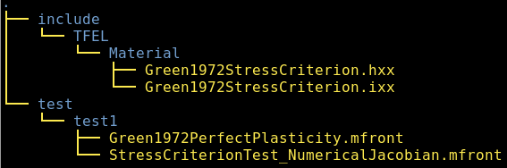
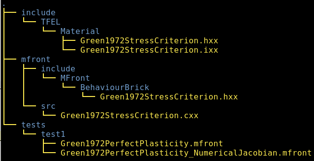

% Extending the `StandardElastoViscoPlasticity` brick with a new stress criterion
% Thomas Helfer, Jérémy Hure, Mohamed Shokeir
% April 2020

\newcommand{\bts}[1]{{\left.#1\right|_{t}}}
\newcommand{\mts}[1]{{\left.#1\right|_{t+\theta\,\Delta\,t}}}
\newcommand{\ets}[1]{{\left.#1\right|_{t+\Delta\,t}}}
\newcommand{\trace}[1]{{\mathrm{tr}\paren{#1}}}
\newcommand{\tenseur}[1]{\underline{#1}}
\newcommand{\tenseurq}[1]{\underline{\underline{\mathbf{#1}}}}
\newcommand{\tns}[1]{{\underset{\tilde{}}{\mathbf{#1}}}}
\newcommand{\transpose}[1]{{#1^{\mathop{T}}}}

\newcommand{\tepsilonto}{\tenseur{\varepsilon}^{\mathrm{to}}}
\newcommand{\tepsilonel}{\tenseur{\varepsilon}^{\mathrm{el}}}
\newcommand{\tepsilonp}{\tenseur{\varepsilon}^{\mathrm{p}}}
\newcommand{\tdepsilonp}{\tenseur{\dot{\varepsilon}}^{\mathrm{p}}}
\newcommand{\tsigma}{\underline{\sigma}}
\newcommand{\sigmaeq}{\sigma_{\mathrm{eq}}}
\newcommand{\Frac}[2]{{{\displaystyle \frac{\displaystyle #1}{\displaystyle #2}}}}
\newcommand{\deriv}[2]{{\displaystyle \frac{\displaystyle \partial #1}{\displaystyle \partial #2}}}
\newcommand{\sderiv}[2]{{\displaystyle \frac{\displaystyle \partial^{2} #1}{\displaystyle \partial #2^{2}}}}
\newcommand{\dtot}{{{\mathrm{d}}}}
\newcommand{\paren}[1]{{\left(#1\right)}}

This document gives some insights of how a user may extend the
`StandardElastoViscoPlasticity` brick by adding a new stress criterion.

The `StandardElastoViscoPlasticity` brick is fully described
[here](StandardElastoViscoPlasticityBrick.html).

Introducing a new stress criterion in the
`StandardElastoViscoPlasticity` brick has two main steps:

- Extending the `TFEL/Material` library.
- Extending the `TFELMFront` library.

> **Note**
>
> This tutorial only covers *isotropic* stress criteria.
> Orthotropic stress criteria requires to take care of
> the orthotropic axes convention.
> 
> See the documentation of the `@OrthotropicBehaviour`
> keyword for details:
>
> ~~~~{.sh}
> mfront --help-keyword=Implicit:@OrthotropicBehaviour
> ~~~~

# Extending the `TFEL/Material` library

## Template files

We recommend that you use the following template files:

- [`StressCriterionTemplate.hxx`](cxx/include/TFEL/Material/StressCriterionTemplate.hxx)
- [`StressCriterionTemplate.ixx`](cxx/include/TFEL/Material/StressCriterionTemplate.ixx)
- [`StressCriterionTest.mfront`](mfront/StressCriterionTest.mfront)
- [`StressCriterionTest_NumericalJacobian.mfront`](mfront/StressCriterionTest_NumericalJacobian.mfront)

The first file declares:

- A set of aliases
- A data structure holding the structure associated with the criterion.
- Three functions which allows the computation of:
  - The value of the stress criterion for the given stress state.
  - The value of the stress criterion and its first derivative for the
    given stress state.
  - The value of the stress criterion and its first and second
    derivatives for the given stress state.

The second file give a skeleton required to implement those three
functions.

Implementing a new stress criterion boils down to the following steps:

1. Rename those file to explicitly indicate the name of the stress
  criterion.
2. Replace the following strings by the appropriate values as described
  below:
  - `__Author__`
  - `__Date__`
  - `__StressCriterionName__`
  - `__STRESS_CRITERION_NAME__`
3. Implement the three previous functions
4. Test your implementation in `MFront` and `MTest` (or your favorite
   solver).

## Creating a proper working directory for the example of the Green criterion

In this paragraph, we detail Steps 1 and 2. for the case of the Green
criterion (see @green_plasticity_1972) which will be used as an
illustrative example throughout this document. We describe all those
steps in details and finally gives a shell script that automates the
whole process for `LiNuX` users. When providing command line examples,
we assume that the shell is `bash`.

The header files `StressCriterionTemplate.hxx` and
`StressCriterionTemplate.ixx` are placed in a subdirectory called
`include/TFEL/Material` and renamed respectively
`Green1972StressCriterion.hxx` and `Green1972StressCriterion.ixx`.

The `MFront` template files must be copied in the working directory and
renamed appropriatly.

This can be done by taping the following commands in the terminal (under
`LiNuX` or `Mac Os`):

~~~~{.bash}
$ mkdir -p include/TFEL/Material
$ mkdir -p tests/test1
$ mv StressCriterionTemplate.hxx \
     include/TFEL/Material/Green1972StressCriterion.hxx
$ mv StressCriterionTemplate.ixx \
     include/TFEL/Material/Green1972StressCriterion.ixx
$ mv StressCriterionTest.mfront \
     tests/test1/Green1972PerfectPlasticity.mfront
$ mv StressCriterionTest_NumericalJacobian.mfront \
     tests/test2/Green1972PerfectPlasticity_NumericalJacobian.mfront
~~~~

The working directory is thus organized as follows:

In all those files, we now replace 

- `__Author__` by `Thomas Helfer, Jérémy Hure, Mohamed Shokeir`
- `__Date__` by `24/03/2019`
- `__StressCriterionName__` by `Green1972`
- `__STRESS_CRITERION_NAME__` by `GREEN_1972`

You may use your favourite text-editor to do this or use the following
command (for `LiNuX` users) :

~~~~{.sh}
for f in $(find . -type f);                                        \
do sed -i                                                          \
  -e 's|__Author__|Thomas Helfer, Jérémy Hure, Mohamed Shokeir|g;' \
  -e 's|__Date__|24/03/2020|g;'                                    \
  -e 's|__StressCriterionName__|Green1972|g;'                      \
  -e 's|__STRESS_CRITERION_NAME__|GREEN_1972|g' $f ;               \
done
~~~~

All those steps are summarized in the following script, which can be
downloaded [here](scripts/generate.sh).

In conclusion, a recommended for starting the development of the a new
stress criterion is to download the previous script, modify
appropriately the first lines to match your need and run it.

> **Note**
>
> At this stage, you shall already be able to verify that the provided
> `MFront` implementations barely compiles by typing in the
> `tests/test1` directory:
>
> ~~~~{.sh}
> mfront -I $(pwd)/../../include --obuild \
>        --interface=generic        \
>        Green1972PerfectPlasticity.mfront
> ~~~~
>
> Note the `-I $(pwd)/../../include` flags which allows `MFront` to find the
> header files implementing the stress criterion (In `bash`, `$(pwd)`
> return the current directory).

## Implementing the Green 1972 stress criterion

In this paragraph, we detail all the steps required to implement the
Green 1972 stress criterion (see @green_plasticity_1972 for the original
paper, @fritzen_computational_2013 for the paper that we follow for this
work).

The green stress criterion is defined by:

\[
\sigmaeq=\sqrt{\Frac{3}{2}\,C\,\tenseur{s}\,\colon\,\tenseur{s}+F\,\trace{\tsigma}^{2}}
\]

where \(C\) and \(F\) are two material properties.

The implementation of a perfect plasticity in pure `MFront` is detailed
in an entry of the `MFront` gallery:

<http://tfel.sourceforge.net/greenplasticity.html>

In a new directory, we just follow the steps given by the previous paragraph:

~~~~{.sh}
wget http://tfel.sourceforge.net/scripts/generate.sh
chmod +x generate.sh
./generate.sh
~~~~

### Modifying the `Green1972StressCriterionParameters` data structure

The `Green1972StressCriterionParameters` data structure, declared in
`Green1972StressCriterion.hxx`, must contain the
values of the \(F\) and \(G\) material parameters.

We modify it as follows:

~~~~{.cxx}
template <typename StressStensor>
struct Green1972StressCriterionParameters {
  //! a simple alias
  using real = Green1972BaseType<StressStensor>;
  //! \brief \f$F\f$ material property
  real F;
  //! \brief \f$C\f$ material property
  real C;
};  // end of struct Green1972StressCriterionParameters
~~~~

The output stream operator must now be implemented in the
`Green1972StressCriterion.ixx` file:

~~~~{.cxx}
template <typename StressStensor>
std::ostream &operator<<(std::ostream &os,
                         const Green1972StressCriterionParameters<StressStensor> &p) {
  os << "{F: " << p.F << ", C: " << p.C << "}";
  return os;
} // end of operator<<
~~~~

This operator is useful when compiling `MFront` files in `debug` mode.

### Implementing the `computeGreen1972Stress` function

The `computeGreen1972Stress` function is implemented in the
`Green1972StressCriterion.ixx` file.

Following the definition of the equivalent stress, this implementation
is straightforward:

~~~~{.cxx}
template <typename StressStensor>
Green1972StressType<StressStensor> computeGreen1972Stress(
    const StressStensor& sig,
    const Green1972StressCriterionParameters<StressStensor>& p,
    const Green1972StressType<StressStensor> seps) {
  const auto s  = deviator(sig);
  const auto tr = trace(sig);
  return std::sqrt(3 * (p.C) * (s | s) / 2 + //
                   (p.F) * tr * tr);
}  // end of computeGreen1972YieldStress
~~~~

> **Note**
>
> It is worth trying to recompile the `MFront` file at this stage to see
> if one did not introduce any error in the `C++` code.

### Implementing the `computeGreen1972StressNormal` function

This function computes the equivalent stress and its normal. The
expression of the normal is:

\[
\tenseur{n} = \deriv{f}{\tsigma} = \Frac{1}{\sigmaeq}\,\paren{\Frac{3}{2}\,C\,\tenseur{s}+F\,\trace{\tsigma}\,\tenseur{I}}
\]

This expression introduces the inverse of the equivalent stress which
may lead to numerical troubles. To avoid those issues, a numerical
threshold is introduced in the computation of the inverse in our
implementation:

~~~~{.cxx}
template <typename StressStensor>
std::tuple<Green1972StressType<StressStensor>,
           Green1972StressNormalType<StressStensor>>
computeGreen1972StressNormal(
    const StressStensor& sig,
    const Green1972StressCriterionParameters<StressStensor>& p,
    const Green1972StressType<StressStensor> seps) {
  constexpr const auto id = Green1972StressNormalType<StressStensor>::Id();
  const auto s = deviator(sig);
  const auto tr = trace(sig);
  const auto seq = std::sqrt(3 * (p.C) * (s | s) / 2 + //
                             (p.F) * tr * tr);
  const auto iseq = 1 / (std::max(seq, seps));
  const auto n = eval(iseq * ((3 * (p.C)) / 2 * s + //
                              (p.F) * tr * id));
  return {seq, n};
}  // end of computeGreen1972StressNormal
~~~~

> **Note**
>
> At this stage, the `MFront` implementation based on a numerical
> jacobian could be fully functional if one modifies the
> `@InitLocalVarialbes` block to initialize the parameters of
> stress criterion.

### Implementing the `computeGreen1972StressSecondDerivative` function

This function computes the equivalent stress, its normal and the
derivative of the normal (i.e. the second derivative of the equivalent
stress).

The expression of the derivative of the normal is:

\[
\deriv{\tenseur{n}}{\sigma}=\Frac{1}{\sigmaeq}\,\paren{\Frac{3}{2}\,C\,\,\tenseurq{I}+\paren{F-\paren{\Frac{C}{2}}}\,\tenseur{I}\,\otimes\,\tenseur{I}-\tenseur{n}\,\otimes\,\tenseur{n}}
\]

The implementation of the `computeGreen1972StressSecondDerivative`
function is then:

~~~~{.cxx}
template <typename StressStensor>
std::tuple<Green1972StressType<StressStensor>,
           Green1972StressNormalType<StressStensor>,
           Green1972StressSecondDerivativeType<StressStensor>>
computeGreen1972StressSecondDerivative(
    const StressStensor& sig,
    const Green1972StressCriterionParameters<StressStensor>& p,
    const Green1972StressType<StressStensor> seps) {
  // a simple alias to the underlying numeric type
  using real = Green1972BaseType<StressStensor>;
  // space dimension deduced from the type of the stress tensor
  constexpr const auto N = tfel::math::StensorTraits<StressStensor>::dime;                           
  constexpr const auto id = Green1972StressNormalType<StressStensor>::Id();
  constexpr const auto id4 = tfel::math::st2tost2<N,real>::Id();
  const auto s = deviator(sig);
  const auto tr = trace(sig);
  const auto seq = std::sqrt(3 * (p.C) * (s | s) / 2 + //
                             (p.F) * tr * tr);
  const auto iseq = 1 / (std::max(seq, seps));
  const auto n = iseq * (3 * (p.C) * s / 2 + //
                         (p.F) * tr * id);
  const auto dn =
      ((3 * p.C / 2) * id4 + (p.F - p.C / 2) * (id ^ id) - (n ^ n)) *
      iseq;
  return {seq, n, dn};
}  // end of computeGreen1972SecondDerivative
~~~~

### Modifying the `MFront` implementations

At this stage, the provided `MFront` implementations are almost working.
Only the initializations of the parameters of the yield criterion is
missing.

First, we define two parameters called `F` and `C`:

~~~~{.cxx}
@Parameter C = 0.8;
C.setEntryName("GreenYieldCriterion_C");
@Parameter F = 0.2;
F.setEntryName("GreenYieldCriterion_F");
~~~~

And then we use two parameters to initialize the parameters of the yield
criterion in the `@InitLocalVariables` block:

~~~~{.cxx}
@InitLocalVariables {
  // initialize the parameters from the material properties
  params.F = F;
  params.C = C;
  ...
~~~~

### Testing

At this stage, your implementations are fully functional. Go in the
`tests/test1` subdirectory and compile the examples with:

~~~~{.sh}
$ mfront -I $(pwd)/../../include --obuild --interface=generic \
         Green1972PerfectPlasticity.mfront              \
         Green1972PerfectPlasticity_NumericalJacobian.mfront
~~~~

One may test it under a simple tensile test:

~~~~{.cxx}
@Author Thomas Helfer, Jérémy Hure, Mohamed Shokeir;
@Date   25/03/2020;
@Description{
  A simple tensile test to check the implementation
  of a perfect plastic behaviour based of the Green
  criterion.
};

@MaximumNumberOfSubSteps 1;
@Behaviour<generic> 'src/libBehaviour.so' 'Green1972PerfectPlasticity';

// external state variables
@ExternalStateVariable 'Temperature' 293.15;

@ImposedStrain 'EXX' {
  0 : 0, 1 : 1.e-2
};

@Times{0, 1 in 10};
~~~~

> **Note**
>
> The numerical jacobian version fails with this time discretization
> at the first time step because the jacobian is singular when the
> stress tensor is null in perfect plasticity, which happens in the
> first time step.
>
> The implementation of the behaviour with analytic jacobian has a little trick
> in the definition of the `df_ddp` block to avoid this discrepancy.
>
> In the numerical jacobian case, one solution is to add a small time step at
> the beginning, while still is the elastic domain.

This test allows checking that:

- The results are correct.
- The jacobian of the implicit system is properly computed. One may
  check its value against a numerical jacobian as follows:

~~~~{.bash} 
$ mfront -I $(pwd)/../../include --obuild --interface=generic \
         Green1972PerfectPlasticity.mfront              \
         --@CompareToNumericalJacobian=true             \
         --@PerturbationValueForNumericalJacobianComputation=1.e-8
~~~~

- The convergence of the implicit algorithm is quadratic (one may
  compile the `MFront` file using the `--debug` flag as follows:

~~~~{.bash} 
$ mfront -I $(pwd)/../../include --obuild --interface=generic \
         Green1972PerfectPlasticity.mfront --debug
~~~~

- The convergence of `MTest` is quadratic, i.e. that the consistent
  tangent operator is correct (this is just another way of checking if
  the jacobian of the implicit system is correct):

~~~~{.bash}
$ mtest Green1972PerfectPlasticity.mtest                   \
        --@CompareToNumericalTangentOperator=true          \
        --@NumericalTangentOperatorPerturbationValue=1.e-8 \
        --@TangentOperatorComparisonCriterium=1
~~~~

# Extending the `TFELMFront` library

## Updating the working directory

We recommend that you use the following template files:

-
  [`StressCriterionTemplate.hxx`](cxx/mfront/include/MFront/BehaviourBrick/StressCriterionTemplate.hxx).
  Beware that this file is not the same as the one used in the first
  part of this document.
- [`StressCriterionTemplate.cxx`](cxx/mfront/src/StressCriterionTemplate.cxx)

The first file must be copied in a directory called
`mfront/include/MFront/BehaviourBrick` and the second one in a directory
called `mfront/src` subdirectory. Both must be renamed appropriately.

The working directory must now have the following structure:

As in the first part of this document, `__Author__`, `__Date__`,
`__StressCriterionName__` and `__STRESS_CRITERION_NAME__` must be
replaced by the appropriate values.

## Adding the stress criterion options

In our case, one shall only implement the `getOptions` methods to
declare the `F` and `C` coefficients.

~~~~{.cxx}
std::vector<OptionDescription> Green1972StressCriterion::getOptions() const {
  auto opts = StressCriterionBase::getOptions();
  opts.emplace_back("F", "First stress criterion coefficient",
                    OptionDescription::MATERIALPROPERTY);
  opts.emplace_back("C", "Second stress criterion coefficient",
                    OptionDescription::MATERIALPROPERTY);
  return opts;
} // end of Green1972StressCriterion::getOptions()
~~~~

> **Note**
>
> The default implementation of the `isNormalDeviatoric` method
> declares that the normal is not deviatoric, which correct in the case of
> the Green criterion.
>
> If this is not the case, the implementation of this method must be
> changed appropriately.

## Compilation of the `MFront` plugin

> **Note**
>
> This paragraph assumes that you are working under a standard `LiNuX`
> environment. In particular, we assume that you use `g++` as your
> `C++` compiler. This can easily be changed to match your needs.

The `Green1972StressCriterion.cxx` can now be compiled in a plugin as
follows. Go in the `mfront/src` directory and type:

~~~~{.sh}
$ g++ -I ../include/ `tfel-config --includes `            \
      `tfel-config --oflags --cppflags --compiler-flags`  \
      -DMFRONT_ADITIONNAL_LIBRARY                         \
      `tfel-config --libs` -lTFELMFront                   \
      --shared -fPIC Green1972StressCriterion.cxx         \
      -o libAdditionalStressCriteria.so
~~~~

The calls to `tfel-config` allows retrieving the paths to the `TFEL`
headers and libraries. The `MFRONT_ADITIONNAL_LIBRARY` flag activate a
portion of the source file whose only purpose is to register the
`Green1972` stress criterion in an abstract factory.

#r# Testing the plugin

To test the plugin, go in the `tests/test2` directory.

Create a file `Green1972PerfectPlasticity.mfront` with the following
content:

~~~~{.cxx}
@DSL Implicit;

@Behaviour Green1972PerfectPlasticity;
@Author Thomas Helfer, Jérémy Hure, Mohamed Shokeir;
@Date 25 / 03 / 2020;
@Description {
}

@Algorithm NewtonRaphson;
@Epsilon 1.e-14;
@Theta 1;

@ModellingHypotheses{".+"};
@Brick StandardElastoViscoPlasticity{
  stress_potential : "Hooke" {
    young_modulus : 200e9,
    poisson_ratio : 0.3},
  inelastic_flow : "Plastic" {
    criterion : "Green1972" {
      C : 0.8,
      F : 0.2},
    isotropic_hardening : "Linear" {
      R0 : 150e6}
  }
};
~~~~

This file can be compiled as follows:

~~~~{.sh}
$ MFRONT_ADDITIONAL_LIBRARIES=../../mfront/src/libAdditionalStressCriteria.so \
  mfront -I $(pwd)/../../include/ --obuild --interface=generic                \
  Green1972PerfectPlasticity.mfront
~~~~

This implementation can be checked with the same `MTest` file than in
the first part of the document.

# References
