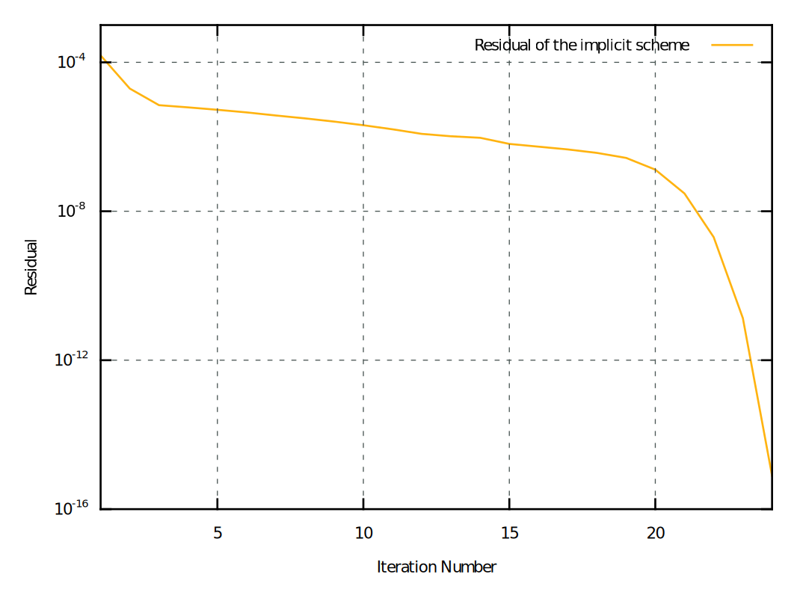

\newcommand{\Nu}{N_{\nu}}
\newcommand{\paren}[1]{{\left(#1\right)}}
\newcommand{\trace}[1]{{\mathrm{tr}\paren{#1}}}
\newcommand{\tenseur}[1]{\underline{#1}}
\newcommand{\tenseurq}[1]{\underline{\underline{\mathbf{#1}}}}
\newcommand{\tSigma}{\tenseur{\Sigma}}
\newcommand{\Sigmaeq}{\Sigma_{\mathrm{eq}}}
\newcommand{\tEpsilonto}{\tenseur{E}^{\mathrm{to}}}
\newcommand{\tEpsilonel}{\tenseur{E}^{\mathrm{el}}}
\newcommand{\tEpsilonvp}{\tenseur{E}^{\mathrm{vp}}}
\newcommand{\tdEpsilonvp}{\tenseur{\dot{E}}^{\mathrm{vp}}}
\newcommand{\tsigma}{\tenseur{\sigma}}
\newcommand{\tepsilonto}{\tenseur{\varepsilon}^{\mathrm{to}}}
\newcommand{\tdepsilonto}{\tenseur{\dot{\varepsilon}}^{\mathrm{to}}}
\newcommand{\tepsilonel}{\tenseur{\varepsilon}^{\mathrm{el}}}
\newcommand{\tdepsilonel}{\tenseur{\dot{\varepsilon}}^{\mathrm{el}}}
\newcommand{\tepsilonvp}{\tenseur{\varepsilon}^{\mathrm{vp}}}
\newcommand{\tdepsilonvp}{\tenseur{\dot{\varepsilon}}^{\mathrm{vp}}}
\newcommand{\tepsilonp}{\tenseur{\varepsilon}^{\mathrm{p}}}
\newcommand{\tdepsilonp}{\tenseur{\dot{\varepsilon}}^{\mathrm{p}}}
\newcommand{\sstar}{\sigma_{\star}}
\newcommand{\pr}{\mathrm{\sigma_{m}}}
\newcommand{\sigmaeq}{\sigma_{\mathrm{eq}}}
\newcommand{\bts}[1]{{\left.#1\right|_{t}}}
\newcommand{\mts}[1]{{\left.#1\right|_{t+\theta\,\Delta\,t}}}
\newcommand{\ets}[1]{{\left.#1\right|_{t+\Delta\,t}}}
\newcommand{\dtot}{\mathrm{d}}
\newcommand{\deriv}[2]{{\displaystyle \frac{\displaystyle \partial #1}{\displaystyle \partial #2}}}
\newcommand{\derivtot}[2]{{\displaystyle \frac{\displaystyle \dtot #1}{\displaystyle \dtot #2}}}

\newcommand{\kphase}[1]{{#1}^{(k)}}
\newcommand{\lphase}[1]{{#1}^{(l)}}
\newcommand{\kislip}[1]{{#1}^{(k,i)}}

# Introduction

The aim of this tutorial is to describe briefly the implementation of a
simple self-consistent polycrystalline model based on the use of the
Berveiller-Zaoui concentration rule [@berveiller_extension_1978] using
an implicit scheme. This concentration rule provides an explicit
relationship between the average stress, inside a crystallographic
phase, and the macroscopic applied stress. This model assumes both an
isotropic elastic behaviour and isotropic plastic behaviour at the
macroscopic scale. In this work, a phase is defined as a set of grains
having the same crystallographic orientation.

Implicit schemes for the integration of polycrystal behaviours obtained
by homogeneization have been studied in previous works, see
[@hutchinson_bounds_1976;@bornert_second-order_2001] for example.
However, those methods do not guarantee a quadratic convergence locally
(at the integration point scale) nor provide an exact consistent tangent
operator which guarantee a quadratic convergence of the equilibrium at
the structural scale. The proposed integration scheme is, to the best of
our knowledge, original. This scheme is based on a special choice of the
integration variables and a static condensation technique to eliminate
the internal state variables of the crystallographic phases. It is shown
that this implementation is locally quadratically convergent and, since
it provides an exact tangent operator, quadratically convergent at the
structural scale. The latter point may allow the widespread use of such
models in large scale structural computations. Moreover, this scheme is
easily adaptable for complex local behaviours of the phases and/or other
homogeneization schemes.

This tutorial follows [another tutorial](ExplicitBerveillerZaoui.html)
which presented an explicit scheme for the same behaviour. Reading this
tutorial before is highly recommended.

## Notations

- \(\tSigma\): the macroscopic stress.
- \(\Sigmaeq\): the macroscropic von Mises stress.
- \(\tEpsilonto\): the macroscopic strain.
- \(\tEpsilonvp\): the macroscopic viscoplastic strain.
- \(N_{g}\): number of grains/phases.
- \(\kphase{\tsigma}\): the average stress of the
  k\(\mbox{}^{\text{th}}\) phase.
- \(\kphase{\phi}\): the volume fraction of the k\(\mbox{}^{\text{th}}\)
  phase:
  \[
  \kphase{\phi}=\dfrac{\kphase{V}}{\sum_{l=1}^{N_{g}}\lphase{V}}
  \]
- \(M\): the macroscropic shear modulus.
- \(\Nu\): the macroscropic Poisson ratio.
- \(P\): the equivalent macroscopic viscoplastic strain.
- \(\kislip{g}\): average plastic slip along the
  i\(\mbox{}^{\text{th}}\) slip system of the k\(\mbox{}^{\text{th}}\)
  phase.
- \(\kislip{\mu}\): orientation tensor of the i\(\mbox{}^{\text{th}}\)
  slip system of the k\(\mbox{}^{\text{th}}\) phase.

# Constitutive equations

## The Berveiller-Zaoui homogeneization scheme

In the framework of macroscopically isotropic elasto-plastic behaviors,
Berveiller and Zaoui have derived a self-consistent polycrystalline
model using a secant approximation for the linearization of the
non-linear behavior of materials [@berveiller_extension_1978]. The
grains of the polycrystal have equiaxed shape and the texture of the
material is isotropic. The local elasticity is assumed homogeneous and
isotropic. In the case of monotonous radial loadings Berveiller and
Zaoui have shown that the average stress \(\kphase{\tsigma}\) applied in
a crystallographic phase \((k)\) can be expressed explicitly as a
function of the local plastic strain \(\kphase{\tepsilonvp}\), the
macroscopic stress \(\tSigma\) and the macroscopic viscoplastic strain
\(\tEpsilonvp\).

The macroscopic strain \(\tEpsilonto\) is split additively in a
macroscopic elastic part \(\tEpsilonel\) and a macroscopic viscoplastic
strain \(\tEpsilonvp\):

\[
  \tEpsilonto=\tEpsilonel+\tEpsilonvp
\]{#eq:mfront:bz:strainsplit}

The macroscopic stress \(\tSigma\) is related to the macroscopic elastic
strain \(\tEpsilonel\) by the Hooke law:

\[
  \tSigma=\tenseur{D}\,\colon\,\tEpsilonel
\]{#eq:mfront:bz:Hooke}

where \(\tenseur{D}\) is an elastic isotropic macroscopic stiffness that
can be expressed using the macroscopic Young modulus and the macroscopic
Poisson ratio \(\Nu\).

The macrosopic viscoplastic strain is linked to the average plastic
strain \(\kphase{\tepsilonvp}\) by a simple mixing rule:

\[
\tEpsilonvp=\sum_{k=1}^{N_{g}} \kphase{\phi}\,\kphase{\tepsilonvp}
\]{#eq:mfront:bz:Evp}

where \(\kphase{\phi}\) is the volume fraction of the
k\(\mbox{}^{\text{th}}\) phase.

The local stress \(\kphase{\tsigma}\) is given by the following
relationship:

\[
\kphase{\tsigma}=\tSigma+2\,M\alpha\paren{\Sigmaeq,P}\,\paren{1-\beta\paren{\Nu}}\,\paren{\tEpsilonvp-\kphase{\tepsilonvp}}\quad\text{with}\quad\beta\paren{\Nu}=\dfrac{2}{15}\,\dfrac{4-5\,\Nu}{1-\Nu}
\]{#eq:mfront:bz:sig}

where:

- \(\Sigmaeq\) is the macroscropic von Mises stress.
- \(P\) is the equivalent macroscropic viscoplastic strain defined in an
  incremental way as follows:
  \[
  \dot{P}=\sqrt{\dfrac{2}{3}\,\tdEpsilonvp\,\colon\,\tdEpsilonvp}
  \]
  with \(0\) as the initial value.

> The \(\beta\paren{\Nu}\) factor is closed to
> \(\frac{1}{2}\) for a macroscopic Poisson ratio close to \(0.3\). In
> this case, the Localisation Equation @eq:mfront:bz:sig may be simplified
> as:
> \[
> \kphase{\tsigma}=\tSigma+M\alpha\paren{\Sigmaeq,P}\,\paren{\tEpsilonvp-\kphase{\tepsilonvp}}
> \]

The function \(\alpha\paren{\Sigmaeq,P}\) is called the accommodation
function. It represents the plastic accommodation between the
Homogeneous Equivalent Medium and the considered crystallographic phase
(r) in inclusion (spherical inclusion). The expression of the
accommodation function is as follows:

\[
\alpha\paren{\Sigmaeq,P}=\dfrac{2\,\Sigmaeq}{2\,\Sigmaeq+3\,M\,P}
\]

Equations @eq:mfront:bz:Evp and @eq:mfront:bz:sig are important as they
resume the Berveiller-Zaoui homogeneization scheme, i.e. how the
macroscopic and microscopic aspects are coupled. Equation
@eq:mfront:bz:sig will be the basis of the static condensation method
used to build the implicit scheme presented in Section
@sec:mfront:bz:implicit_scheme because it shows that the average stress
\(\kphase{\tsigma}\) only depends on the macroscopic variables
\(\tSigma\) and \(\tEpsilonvp\) and the viscoplastic strain
\(\kphase{\tepsilonvp}\) of the considered phase.

Using this explicit concentration rule, it is particularly simple to
compute the overall response of a polycrystalline material, provided the
intra-granular constitutive behaviour is known.

## Intra-granular constitutive behavior

In this tutorial, we assume that the local constitutive equations have the
following form:

\[
\kphase{\tdepsilonvp}=\kphase{v}\paren{\kphase{\tsigma}}
\]{#eq:mfront:bz:flow_rule}

where the microscopic plastic strain may results from the slips along
the slip systems of the crystal following:

\[
\kphase{\tdepsilonvp}=\sum_{i=1}^{N_{s}}\kislip{\dot{g}}\,\kislip{\mu}\quad\text{with}\quad\kislip{\dot{g}}=\left\langle\dfrac{\kphase{\sigma}\,\colon\,\kislip{\mu}-R_{0}}{K}\right\rangle^{n}
\]

This constitutive equation is very simple, but extensions of the
proposed integration scheme to more complex ones , such as i.e. the
Méric-Cailletaud behaviour [@meric_single_1991], is straightforward
using an explicit scheme and feasible for the implicit scheme although
more involved.

For the example, we will follow the work of Onimus et al. with sightly
modified material coefficients [@onimus_polycrystalline_2009].

# Implicit integration scheme {#sec:mfront:bz:implicit_scheme}

## Former implicit integration schemes

Following the implicit integration scheme proposed in the past (see
[@hutchinson_bounds_1976]), the set of integration variables are the
averages per phase of the stress field, namely the $N_g$ symmetric
second-order tensors $\tsigma^{(k)}$. These $N_g$ unknowns are
the solutions of the $N_g$ system of equation @eq:mfront:bz:sig, where
$\underline{E}^{vp}$ and $\underline{\epsilon}^{vp(k)}$ can be expressed
as a function of these unknowns (relations @eq:mfront:bz:Evp and
@eq:mfront:bz:flow_rule, respectively) while $\tSigma$ is obtained from:

\[
 \tSigma = \sum_{k=1}^{N_g} \phi^{(k)}\,\tsigma^{(k)}
\]{#eq:mfront:bz:SIGMA}

The size of the resulting system of nonlinear equations equals $6\,N_g
\times 6\,N_g$ which makes difficult its resolution with the
Newton-Raphson method. As a result, [@hutchinson_bounds_1976] proposed
to solve this nonlinear system of equations with a fixed-point iterative
method : for a given trial set of the unknowns, the macroscopic stress
$\tSigma$ and viscoplastic strain $\tEpsilonvp$ are computed from
Equations @eq:mfront:bz:Evp and @eq:mfront:bz:SIGMA. Next, for each
phase $(k)$, as the average viscoplastic strain in a given phase $(k)$
is a function of the average stress (Equation @eq:mfront:bz:flow_rule)
in the same phase, the $N_g$ relations @eq:mfront:bz:sig are solved
separately by a Newton-Raphson method. A new set of the average stresses
per phases is then obtained. This iterative procedure stops when the new
set of the unknowns is close to the previous one.

This method has proved its efficiency and can be found in other more
recent works (see for example [@bornert_second-order_2001]). However, its
quadratic convergence is far from being verified.

## Choice of the integration variables

The integration variables are:

- the macroscopic elastic strain \(\tEpsilonel\).
- the macroscopic viscoplastic strain \(\tEpsilonvp\).
- the average viscoplastic strains \(\kphase{\tepsilonvp}\) of every
  phases.

The macroscopic equivalent plastic strain \(P\) is described as an
auxiliary state variable, i.e. is computed after the computation of the
integration variables.

Treating the macroscopic viscoplastic strain \(\tEpsilonvp\) as an
integration variable may seem awkward at this stage, as it can obviously
also be treated as an auxiliary state variable. The reason for this
choice will become clearer in Section @sec:mfront:bz:staticcondensation,
where the treatment of the macroscopic viscoplastic strain
\(\tEpsilonvp\) as an integration variable will appear as a key point of
the proposed implicit scheme.

## Derivation of the standard implicit scheme

Let \(\vec{Y}\) be a vector grouping all the variables:

\[
\vec{Y}=
\begin{pmatrix}
\tEpsilonel \\
\tEpsilonvp\\
{\tepsilonvp}^{(0)}\\
\vdots\\
{\tepsilonvp}^{(N_{g})}\\
\end{pmatrix}
\]

Combining Equations @eq:mfront:bz:strainsplit, @eq:mfront:bz:Evp,
@eq:mfront:bz:sig and @eq:mfront:bz:flow_rule, the evolution of
\(\vec{Y}\) can be expressed as an ordinary system of differential
equations:

\[
\dot{\vec{Y}}=G\paren{\vec{Y}}
\]

For a given time step \(\Delta\,t\), an implicit scheme consists in
replacing this ordinary system of differential equations by a system of
non linear equations which unknowns are the increments of the
integration variables, as follows:

\[
\vec{F}\paren{\Delta\, \vec{Y}}=\vec{0}
\]{#eq:mfront:bz:implicit_scheme}

where the residual function \(\vec{F}\) is given by:

\[
\vec{F}\paren{\Delta\, \vec{Y}}=\Delta\,\vec{Y}-G\paren{\mts{\vec{Y}}}
\]

In the previous equation, \(\theta\) is a numerical parameter
(\(\theta\in\left[0,1\right]\)) and the notation \(\mts{\vec{Y}}\)
denotes:

\[
\mts{\vec{Y}}=\bts{\vec{Y}}+\theta\,\Delta\,\vec{Y}
\]

The unknowns of the implicit system are thus the increment of
integration variables:

\[
\Delta\,\tEpsilonel, \Delta\,\tEpsilonvp, \Delta\,\kphase{\tepsilonvp}
\]

In the following, the residual function \(\vec{F}\) is decomposed as
follows:

\[
\vec{F}=
\begin{pmatrix}
f_{\tEpsilonel} \\
f_{\tEpsilonvp}\\
f_{{\tepsilonvp}^{(0)}}\\
\vdots\\
f_{{\tepsilonvp}^{(N_{g})}}\\
\end{pmatrix}
\]

The residuals of the implicit systems are given by:

\[
\left\{
\begin{aligned}
f_{\tEpsilonel}&=\Delta\tEpsilonel+\Delta\tEpsilonvp-\Delta\tEpsilonto\\
f_{\tEpsilonvp}&=\Delta\tEpsilonvp-\sum_{k=1}^{N_{g}}\kphase{\phi}\,\Delta\kphase{\tepsilonvp}\\
f_{\kphase{\tepsilonvp}}&=\Delta\,\kphase{\tepsilonvp}-\Delta\,t\,\kphase{v}\paren{\mts{\kphase{\tsigma}}}
\end{aligned}
\right.
\]

The residual system @eq:mfront:bz:implicit_scheme is generally solved by
a standard Newton-Raphson method which requires the computation of the
jacobian matrix \(J=\deriv{F}{\Delta\,Y}\) which can also be decomposed
by blocks.

Due to the expression of \(\mts{\kphase{\tsigma}}\) given by Equation
@eq:mfront:bz:sig, the only not zero jacobian blocks associated with
\(f_{\kphase{\tepsilonvp}}\) are: \(
\deriv{f_{\kphase{\tepsilonvp}}}{\Delta\,\kphase{\tepsilonvp}} \),
\(\deriv{f_{\kphase{\tepsilonvp}}}{\Delta\,\tEpsilonel}\) and
\(\deriv{f_{\kphase{\tepsilonvp}}}{\Delta\,\tepsilonvp}\). In
particular,
\(\deriv{f_{\kphase{\tepsilonvp}}}{\Delta\,\lphase{\tepsilonvp}}\) is
null if \(l\) is not equal to \(k\).

In the simple case of the simple flow rule described in Equation
@eq:mfront:bz:flow_rule, the expression of those derivatives are:

\[
\left\{
\begin{aligned}
\deriv{f_{\kphase{\tepsilonvp}}}{\Delta\,\kphase{\tepsilonvp}}&=\tenseurq{I}-\Delta\,t\,\deriv{\kphase{v}}{\kphase{\tsigma}}\,\colon\,\deriv{\kphase{\tsigma}}{\Delta\,\kphase{\tepsilonvp}}\\
\deriv{f_{\kphase{\tepsilonvp}}}{\Delta\,\tEpsilonel}&=-\Delta\,t\,\deriv{\kphase{v}}{\kphase{\tsigma}}\,\colon\,\deriv{\kphase{\tsigma}}{\Delta\,\tEpsilonel}\\
\deriv{f_{\kphase{\tepsilonvp}}}{\Delta\,\tEpsilonvp}&=-\Delta\,t\,\deriv{\kphase{v}}{\kphase{\tsigma}}\,\colon\,\deriv{\kphase{\tsigma}}{\Delta\,\,\tEpsilonvp}\\
\end{aligned}
\right.
\]

Those expressions show that the jacobian block
\(\deriv{f_{\kphase{\tepsilonvp}}}{\Delta\,\kphase{\tepsilonvp}}\) is
always invertible for sufficiently small time steps.

It shall be emphasised that even for the simple localisation equation of
the Berveiller-Zaoui homogeneization scheme, the computation of the
derivatives \(\deriv{\kphase{\tsigma}}{\Delta\,\tEpsilonel}\) and
\(\deriv{\kphase{\tsigma}}{\Delta\,\,\tEpsilonvp}\) are quite involved
due to the accomodation function.

> **Derivatives of the accomodation function**
> 
> \[
> \deriv{\alpha}{\Sigmaeq}=\dfrac{6\,M\,P}{\paren{2\,\Sigmaeq+3\,M\,P}^{2}}
> \]
> 
> \[
> \deriv{\alpha}{P}=-\dfrac{6\,M\,\Sigmaeq}{\paren{2\,\Sigmaeq+3\,M\,P}^{2}}
> \]

> **Derivatives of the local stress**
> 
> \[
> \deriv{\kphase{\tsigma}}{\tSigma}=
> \tenseurq{I}+M\,\deriv{\alpha}{\Sigmaeq}\,\paren{\tEpsilonvp-\kphase{\tepsilonvp}}\,\otimes\,\deriv{\Sigmaeq}{\tSigma}
> \]
> 
> with \(\deriv{\Sigmaeq}{\tSigma}=\tenseur{N}=\dfrac{3}{2\,\Sigmaeq}\,\paren{\tSigma-\dfrac{\trace{\tSigma}}{3}\,\tenseur{I}}\)
> 
> \[
> \deriv{\kphase{\tsigma}}{\tEpsilonvp}=
> M\,\alpha\,\tenseurq{I}+
> M\,\deriv{\alpha}{P}\,\paren{\tEpsilonvp-\kphase{\tepsilonvp}}\,\otimes\,\deriv{P}{\tEpsilonvp}
> \]
> with \(\deriv{P}{\tEpsilonvp}=\dfrac{2}{3\,P}\,\tEpsilonvp\)
> 
> \[
> \deriv{\kphase{\tsigma}}{\kphase{\tepsilonvp}}=
> -M\,\alpha\,\tenseurq{I}
> \]

At this stage, it must be emphasised that a direct application of this
standard Newton-Raphson method would lead to a huge jacobian matrix
which would be inefficient in practice, or even untractable for a high
number of grains. Hence, the next paragraph is dedicated to a
modification of this standard Newton-Raphson scheme which overcomes this
issue.

## Static condensation {#sec:mfront:bz:staticcondensation}

The Newton correction \(\delta\,\Delta\,\kphase{\tepsilonvp}\) to the
increment of the current estimate of viscoplastic strain increment
\(\Delta\,\kphase{\tepsilonvp}\) satisfies:

\[
\deriv{f_{\kphase{\tepsilonvp}}}{\Delta\,\kphase{\tepsilonvp}}\,\colon\,\delta\,\Delta\,\kphase{\tepsilonvp}+
\deriv{f_{\kphase{\tepsilonvp}}}{\Delta\,\tEpsilonel}\,\colon\,\delta\,\Delta\,\tEpsilonel+
\deriv{f_{\kphase{\tepsilonvp}}}{\Delta\,\tEpsilonvp}\,\colon\,\delta\,\Delta\,\tEpsilonvp
=-f_{\kphase{\tepsilonvp}}
\]

Hence, the Newton correction \(\delta\,\Delta\,\kphase{\tepsilonvp}\)
can be expressed as:

\[
\delta\,\Delta\,\kphase{\tepsilonvp}=-\paren{\deriv{f_{\kphase{\tepsilonvp}}}{\Delta\,\kphase{\tepsilonvp}}}^{-1}\,\colon\,\paren{
\deriv{f_{\kphase{\tepsilonvp}}}{\Delta\,\tEpsilonel}\,\colon\,\delta\,\Delta\,\tEpsilonel+
\deriv{f_{\kphase{\tepsilonvp}}}{\Delta\,\tEpsilonvp}\,\colon\,\delta\,\Delta\,\tEpsilonvp+
f_{\kphase{\tepsilonvp}}
}
\]{#eq:mfront:bz:static_condensation1}

To simplify the notations, let us introduce the following fourth-order
tensors:

- \(\kphase{\tenseurq{A}}=\paren{\deriv{f_{\kphase{\tepsilonvp}}}{\Delta\,\kphase{\tepsilonvp}}}^{-1}\,\colon\,\deriv{f_{\kphase{\tepsilonvp}}}{\Delta\,\tEpsilonel}\)
- \(\kphase{\tenseurq{B}}=\paren{\deriv{f_{\kphase{\tepsilonvp}}}{\Delta\,\kphase{\tepsilonvp}}}^{-1}\,\colon\,\deriv{f_{\kphase{\tepsilonvp}}}{\Delta\,\tEpsilonvp}\)

and the following second-order tensor:

- \(\kphase{\tenseur{C}}=\paren{\deriv{f_{\kphase{\tepsilonvp}}}{\Delta\,\kphase{\tepsilonvp}}}^{-1}\,\colon\,f_{\kphase{\tepsilonvp}}\)

With those tensors, Equation @eq:mfront:bz:static_condensation1 may be
rewritten as follows:

\[
\delta\,\Delta\,\kphase{\tepsilonvp}=
-\kphase{\tenseurq{A}}\,\colon\,\delta\,\Delta\,\tEpsilonel
-\kphase{\tenseurq{B}}\,\colon\,\delta\,\Delta\,\tEpsilonvp
-\kphase{\tenseur{C}}
\]{#eq:mfront:bz:static_condensation}

Equation @eq:mfront:bz:static_condensation can be injected in the
equation giving the Newton correction of the increment of the
macroscopic viscoplastic strain:

\[
\delta\,\Delta\,\tEpsilonvp-\sum_{k=1}^{N_{g}}\kphase{\phi}\,\delta\,\Delta\,\kphase{\tepsilonvp}=-f_{\tEpsilonvp}
\]

\[
\paren{\tenseur{I}+\sum_{k=1}^{N_{g}}\kphase{\phi}\,\kphase{\tenseurq{B}}}\,\colon\,\delta\,\Delta\,\tEpsilonvp
+\sum_{k=1}^{N_{g}}\kphase{\phi}\,\kphase{\tenseurq{A}}\,\colon\,\delta\,\Delta\,\tEpsilonel=
-f_{\tEpsilonvp}-\sum_{k=1}^{N_{g}}\kphase{\phi}\,\,\kphase{\tenseur{C}}
\]

The correction of the increment of the macroscopic variables
satisfies the following condensed system:

\[
\begin{pmatrix}
\tenseurq{I}          & \tenseurq{I}          \\ 
\tenseurq{J}^{(c)}_{\tEpsilonel} & \tenseurq{J}^{(c)}_{\tEpsilonvp}  
\end{pmatrix}
\,\cdot\,
\begin{pmatrix}
\delta\,\Delta\,\tEpsilonel\\
\delta\,\Delta\,\tEpsilonvp\\
\end{pmatrix}
=
-
\begin{pmatrix}
f_{\kphase{\tEpsilonel}}\\
f_{\kphase{\tEpsilonvp}}^{(c)}
\end{pmatrix}
\]{#eq:mfront:bz:condensed:system}

where the following condensed tensors have been introduced:

- \(\tenseurq{J}^{(c)}_{\tEpsilonel}=\sum_{k=1}^{N_{g}}\kphase{\phi}\,\kphase{\tenseurq{A}}\)
- \(\tenseurq{J}^{(c)}_{\tEpsilonvp}=\tenseur{I}+\sum_{k=1}^{N_{g}}\kphase{\phi}\,\kphase{\tenseurq{B}}\)
- \(f_{\kphase{\tEpsilonvp}}^{(c)}=f_{\kphase{\tEpsilonvp}}+\sum_{k=1}^{N_{g}}\,\kphase{\phi}\,\kphase{\tenseur{C}}\)

Of course, Linear System @eq:mfront:bz:condensed:system may be further
condensed to make only appear the correction to increment the
macroscopic elastic strain.

## Resolution algorithm

1. Given an estimation of the \(\Delta\,\tEpsilonel\), \(\Delta\,\tEpsilonvp\)
2. If the iteration number if greater than 1, loop over the phases
   a. Update \(\Delta\,\kphase{\tepsilonvp}\) using Equation @eq:mfront:bz:static_condensation.
3. Compute  \(f_{\kphase{\tEpsilonel}}\)
4. Loop over the phases
   a. Compute the local stress \(\kphase{\tsigma}\)
   b. Compute \(\kphase{\tenseurq{A}}\), \(\kphase{\tenseurq{B}}\), \(\kphase{\tenseur{C}}\),
   c. Update \(\tenseurq{J}^{(c)}_{\tEpsilonel}\), \(\tenseurq{J}^{(c)}_{\tEpsilonvp}\) and \(f_{\kphase{\tEpsilonvp}}^{(c)}\)
5. Solve Linear System @eq:mfront:bz:condensed:system.
6. Update \(\Delta\,\tEpsilonel\), \(\Delta\,\tEpsilonvp\)

## `MFront`' Implementation

The principle of the implicit scheme is fully described on [this
page](implicit-dsl.html).

### Choice of domain specific language

~~~~{.cxx}
@DSL Implicit;
~~~~

### Name of the behaviour

~~~~{.cxx}
@Behaviour ImplicitPolycrystalHCP_BZ;
~~~~

### Metadata

~~~~{.cxx}
@Author F. Onimus, C. Gicquel, T. Helfer;
@Date 05/2020;
@Description{
  Implementation of a polycrystal of behaviour  for
  zirconium alloys using the Berveiller-Zaoui
  homegeneization scheme. The presented behaviour
  is inspired from Onimus 2009 with modified
  material coefficients.

  "Onimus, Fabien and Béchade, Jean-Luc."
  "A polycrystalline modeling of the mechanical behavior of"
  "neutron irradiated zirconium alloys."
  "Journal of Nuclear Materials. 15 February 2009."
  "Vol. 384, no. 2, p. 163-174."
}
~~~~

### Symmetry of the material and restriction of the modelling hypothesis

~~~~{.cxx}
@ModellingHypothesis Tridimensional;
@OrthotropicBehaviour;
~~~~

### Numerical parameters

~~~~{.cxx}
@Algorithm NewtonRaphson;
@Epsilon 1.e-14;
@Theta 1;
~~~~

### The `StandardElasticity` brick

The behaviour falls into the realm of the [`StandardElasticity`
brick](BehaviourBricks.html).

~~~~{.cxx}
@Brick StandardElasticity{young_modulus : 80000, poisson_ratio : 0.4};
~~~~

Here, the `StandardElasticity` brick allows to:

1. automatically update the macroscopic stress \(\tSigma\) at the middle
  of the time step before the evaluation of the implicit system
  (residual and jacobian matrix) and at the end of the time step.
2. automatically compute the consistent tangent operator from the
  jacobian of the implicit system. This is described in depth here
  [@helfer_assisted_2020].

### Crystal structure of the grains and associated slip systems

The crystal structure of the grains are declared as follows:

~~~~{.cxx}
@CrystalStructure HCP;
@SlidingSystems{<1, 1, -2, 0>{1, -1, 0, 0},  //
                <-2, 1, 1, 3>{1, -1, 0, 1},  //
                <-2, 1, 1, 0>{0, 0, 0, 1},   //
                <1, 1, -2, 0>{1, -1, 0, 1}};
~~~~

### Number of phases

The declaration of the number of phases is as follows:

~~~~{.cxx}
//! Number of phases
@IntegerConstant Np = 240;
~~~~

### Material coefficients

The declaration of the material coefficients is as follows:

~~~~{.cxx}
//! Norton exponents per slip system family
@Parameter real m[4] = {10., 10., 10., 10.};
//! Norton stress normalisation factor
@Parameter stress K = 5.0;
//! critical resolved shear stress per slip system family
@Parameter stress τᶜ[4] = {43.0, 135.0, 75.0, 65.0};
~~~~

### State variables

~~~~{.cxx}
@StateVariable StrainStensor εᵛᵖ;
εᵛᵖ.setGlossaryName("ViscoplasticStrain");
~~~~

### Auxiliary state variables

~~~~{.cxx}
@AuxiliaryStateVariable StrainStensor εᵛᵖᵍ[Np];
εᵛᵖᵍ.setEntryName("PhaseEquivalentViscoplasticStrain");
@AuxiliaryStateVariable strain p;
p.setGlossaryName("EquivalentViscoplasticStrain");
~~~~

### Declaration of the external header

For details about the declaration of the sliding systems, see [this
tutorial](ExplicitBerveillerZaouiPolyCrystals.html).

~~~~{.cxx}
@Includes {
#include "TFEL/Material/ExtendedPolyCrystalsSlidingSystems.hxx"
}
~~~~

### Local Variables

~~~~{.cxx}
//! macroscopic viscoplastic strain increment
@LocalVariable strain Δp;
//! increment of the local viscoplastic strain
@LocalVariable StrainStensor Δεᵛᵖᵍ[Np];
//! tensor used for the static condensation and decondensation
@LocalVariable Stensor4 A[Np];
//! tensor used for the static condensation and decondensation
@LocalVariable Stensor4 B[Np];
//! tensor used for the static condensation and decondensation
@LocalVariable Stensor C[Np];
//! previous estimate of the macroscopic elastic strain
@LocalVariable Stensor Δεᵉˡ_p;
//! previous estimate of the macroscopic viscoplastic strain
@LocalVariable Stensor Δεᵛᵖ_p;
~~~~

### Initialisation of the local variables

~~~~{.cxx}
@InitLocalVariables<Append> {
  // fractions volumiques
  for (unsigned short i = 0; i != Np; ++i) {
    Δεᵛᵖᵍ[i] = StrainStensor(real(0));
  }
  Δεᵉˡ_p = StrainStensor(real(0));
  Δεᵛᵖ_p = StrainStensor(real(0));
}
~~~~

### Computation of the condensed system

~~~~{.cxx}
@Integrator{
~~~~

~~~~{.cxx}
  using PCSlidingSystems =
     ExtendedPolyCrystalsSlidingSystems<Np, ImplicitPolycrystalHCP_BZSlipSystems<real>,
                                        real>;
  constexpr const auto eeps = strain(1.e-12);
  const PCSlidingSystems& gs =
      PCSlidingSystems::getPolyCrystalsSlidingSystems("isotrope_240_normalise.csv");
~~~~

The static decondensation step is implemented as follows:

~~~~{.cxx}
  if (iter > 1) {
    // newton correction of the elastic strain
    const auto δΔεᵉˡ = Δεᵉˡ - Δεᵉˡ_p;
    // newton correction of the viscoplastic strain
    const auto δΔεᵛᵖ = Δεᵛᵖ - Δεᵛᵖ_p;
    // static decondensation
    for (unsigned short k = 0; k != Np; ++k) {
      Δεᵛᵖᵍ[k] -= C[k] + A[k] ⋅ δΔεᵉˡ + B[k] ⋅ δΔεᵛᵖ;
    }
  }
~~~~

The residual associated with the elastic strain is implemented as
follows:

~~~~{.cxx}
  fεᵉˡ += Δεᵛᵖ;
  ∂fεᵉˡ∕∂Δεᵛᵖ = I₄;
~~~~

The following lines of code computes the accomodation factor and the
associated derivatives:

~~~~{.cxx}
  const auto σᵉ = sigmaeq(σ);
  Δp = sqrt((2 ⋅ (Δεᵛᵖ | Δεᵛᵖ)) / 3);
  const auto p_ = p + θ ⋅Δp;
  const auto iΔp = 1 / max(Δp, eeps);
  const auto dΔp∕∂Δεᵛᵖ = 2 ⋅ Δεᵛᵖ ⋅ (iΔp / 3);
  const auto α1 = 2 ⋅ σᵉ + 3 ⋅ mu ⋅ p_;
  const auto α = (α1 > 0) ? 2 ⋅ σᵉ / α1 : real(1);
  const auto iσᵉ = 1 / max(σᵉ, mu ⋅ eeps);
  const auto n = 3 ⋅ deviator(σ) ⋅ (iσᵉ / 2);
  const auto α3 = (α1 > 0) ? 6 ⋅ mu / (α1 ⋅ α1) : real(0);
  const auto ∂α∕∂σᵉ = α3 ⋅ p_;
  const auto ∂α∕∂Δp = -α3 ⋅ θ ⋅ σᵉ;
  const auto ∂α∕∂Δεᵉˡ = 2 ⋅ mu ⋅ θ ⋅ ∂α∕∂σᵉ ⋅ n;
  const auto ∂α∕∂Δεᵛᵖ = ∂α∕∂Δp ⋅ dΔp∕∂Δεᵛᵖ;
~~~~

~~~~{.cxx}
  const auto εᵛᵖ_ = εᵛᵖ + θ ⋅ Δεᵛᵖ;
~~~~

We now can start the loop over the phases:

~~~~{.cxx}
  for (unsigned short k = 0; k != Np; ++k) {
~~~~

~~~~{.cxx}
    // volume fraction of the phase
    const auto φ = gs.volume_fractions[k];
    const auto εᵛᵖᵍ_ = εᵛᵖᵍ[k] + θ ⋅ Δεᵛᵖᵍ[k];
~~~~

The following lines computes the local stress \(\kphase{\tsigma}\):

~~~~{.cxx}
    // localisation BZ
    const auto δεᵛᵖ = (εᵛᵖ_ - εᵛᵖᵍ_);
    const auto σᵍ = eval(σ + mu ⋅ α ⋅ δεᵛᵖ);
    const auto ∂σᵍ∕∂Δεᵉˡ = lambda * (I₂ ⊗ I₂) + 2 * mu * I₄ + mu ⋅ (δεᵛᵖ ⊗ ∂α∕∂Δεᵉˡ);
    const auto ∂σᵍ∕∂Δεᵛᵖ = mu ⋅ (α ⋅ θ ⋅ I₄ + (δεᵛᵖ ⊗ ∂α∕∂Δεᵛᵖ));
    const auto ∂σᵍ∕∂Δεᵛᵖᵍ = -mu ⋅ α ⋅ θ ⋅ I₄;
~~~~

To evaluate the residual associated with the microscopic viscoplastic
strain.

~~~~{.cxx}
    auto ∂fεᵛᵖᵍ∕∂Δεᵛᵖᵍ = I₄;
    auto ∂fεᵛᵖᵍ∕∂Δεᵉˡ = Stensor4(real(0));
    auto ∂fεᵛᵖᵍ∕∂Δεᵛᵖ = Stensor4(real(0));
    auto fεᵛᵖᵍ = Δεᵛᵖᵍ[k];
    for (unsigned short i = 0; i != Nss; ++i) {
      const auto idx = [&i] {
        if (i <= 2) {
          return 0;
        } else if (i >= 3 && i <= 14) {
          return 1;
        } else if (i >= 15 && i <= 17) {
          return 2;
        }
        return 3;
       }(); // return the family number 
      // orientation tensors in the material frame
      const auto& μⁱᵏ = gs.mus[k][i];
      // resolved shear stress
      const auto τ = μⁱᵏ | σᵍ;
      if (abs(τ) > 3 ⋅ τᶜ[idx]) {
        return false;
      }
      const auto rτ = (abs(τ) - τᶜ[idx]) / K;
      if (rτ > 0) {
        const auto sgn = τ > 0 ? 1 : -1;
        const auto irτ = 1 / rτ;
        const auto Δg = sgn ⋅ Δt ⋅ pow(rτ, m[idx]);
        const auto ∂Δg∕∂σᵍ = m[idx] ⋅ Δg ⋅ irτ ⋅ (sgn / K) ⋅ μⁱᵏ;
        fεᵛᵖᵍ -= Δg ⋅ μⁱᵏ;
        ∂fεᵛᵖᵍ∕∂Δεᵛᵖᵍ -= (μⁱᵏ ⊗ (∂Δg∕∂σᵍ)) ⋅ ∂σᵍ∕∂Δεᵛᵖᵍ;
        ∂fεᵛᵖᵍ∕∂Δεᵉˡ -= (μⁱᵏ ⊗ (∂Δg∕∂σᵍ)) ⋅ ∂σᵍ∕∂Δεᵉˡ;
        ∂fεᵛᵖᵍ∕∂Δεᵛᵖ -= (μⁱᵏ ⊗ (∂Δg∕∂σᵍ)) ⋅ ∂σᵍ∕∂Δεᵛᵖ;
      }
~~~~

~~~~{.cxx}
    } // end of the loop over the slip systems
~~~~

The static condensation is done by:

- Computing the tensors \(\tenseurq{A}\), \(\tenseurq{B}\) and
  \(\tenseur{C}\).
- Computing the condensed residual and jacobian terms
  \(\tenseurq{J}^{(c)}_{\tEpsilonel}\),
  \(\tenseurq{J}^{(c)}_{\tEpsilonvp}\) and
  \(f_{\kphase{\tEpsilonvp}}^{(c)}\).

~~~~{.cxx}
    const auto i∂fεᵛᵖᵍ∕∂Δεᵛᵖᵍ = invert(∂fεᵛᵖᵍ∕∂Δεᵛᵖᵍ);
    A[k] = i∂fεᵛᵖᵍ∕∂Δεᵛᵖᵍ ⋅ ∂fεᵛᵖᵍ∕∂Δεᵉˡ;
    B[k] = i∂fεᵛᵖᵍ∕∂Δεᵛᵖᵍ ⋅ ∂fεᵛᵖᵍ∕∂Δεᵛᵖ;
    C[k] = i∂fεᵛᵖᵍ∕∂Δεᵛᵖᵍ ⋅ fεᵛᵖᵍ;
    fεᵛᵖ += C[k] ⋅ φ - Δεᵛᵖᵍ[k] ⋅ φ;
    ∂fεᵛᵖ∕∂Δεᵛᵖ += B[k] ⋅ φ;
    ∂fεᵛᵖ∕∂Δεᵉˡ += A[k] ⋅ φ;
  } // end of the loop over the phases
~~~~

The following lines saves the previous estimates of the increment of the
macroscopic elastic strain and viscoplastic strain:

~~~~{.cxx}
  // saving the previous estimates
  Δεᵉˡ_p = Δεᵉˡ;
  Δεᵛᵖ_p = Δεᵛᵖ;
}
~~~~

Once the Newton algorithm has converged, the auxiliary state variables
must be updated:

~~~~{.cxx}
@UpdateAuxiliaryStateVariables {
  p += Δp;
  for (unsigned short k = 0; k != Np; ++k) {
    εᵛᵖᵍ[k] += Δεᵛᵖᵍ[k];
  }
}
~~~~

## Unit testing

~~~~{.cxx}
@Behaviour 'src/libBehaviour.so' 'ImplicitPolycrystalHCP_BZ';
@ExternalStateVariable 'Temperature' 293.15;
@Real 'tmax' 75 ;
@ImposedStrain 'EXX' {0.: 0., 75 : 0.015 };
@Times {0.,'tmax' in 10};
~~~~

The macroscopic results are compared to the results of the explicit
scheme in Section @sec:mfront:bz:discussion.

In this section, we will focus on checks on the validity of the
computation of the various derivatives required to implement the
implicit scheme.

The first check can be performed by analysing how the implicit scheme
converges. This can be done by adding the `--debug` flag to the `MFront`
call. This flag prints the evolution of the norm of the residual during
the local iterations of the implicit scheme. Here is a typical output
with this option:

~~~~{.bash}
ImplicitPolycrystalHCP_BZ::integrate() : iteration 1 : 0.000153076
ImplicitPolycrystalHCP_BZ::integrate() : iteration 2 : 1.97093e-05
ImplicitPolycrystalHCP_BZ::integrate() : iteration 3 : 7.06628e-06
....
ImplicitPolycrystalHCP_BZ::integrate() : iteration 21 : 3.00128e-08
ImplicitPolycrystalHCP_BZ::integrate() : iteration 22 : 2.01722e-09
ImplicitPolycrystalHCP_BZ::integrate() : iteration 23 : 1.34406e-11
ImplicitPolycrystalHCP_BZ::integrate() : iteration 24 : 7.8715e-16
~~~~

{#fig:mfront:bz:local_residual width=75%}

We took this output and use it to plot the residual as a function of the
iteration number on Figure @fig:mfront:bz:local_residual. This figure is
typical of the Newton algorithm with a quasi-linear decrease of the
residual during the first iterations and a final quadratic convergence
near the solution.

> **Comparison of the analytical jacobian to a numerically approximated jacobian**
> 
> `MFront` also provides an automated way of the validating the analytical
> computations of the jacobian blocks by comparison to a numerical
> evaluation as follows:
> 
> ~~~~{.bash}
> $ mfront --obuild --interface=generic --@CompareToNumericalJacobian=true \
>          --@PerturbationValueForNumericalJacobianComputation=1e-8        \
>          ImplicitPolycrystalHCP_BZ.mfront
> ~~~~
>
> The output of this command is very verbose and not reported here. However,
> it confirms that the analytical jacobian is correct.

Since the consistent tangent operator is deduced from the jacobian of
the implicit system [@helfer_assisted_2020], a final indication of the
validity of the computation of this jacobian is to have a look of how
the equilibrium residual decreases.

~~~~{.bash}
resolution from 67.5 to 75
iteration 1 : 0.0015 1.35033 ...
iteration 2 : 3.88574e-05 14.9107 ...
iteration 3 : 3.02004e-08 0.000348823 ...
iteration 4 : 2.45492e-14 9.93396e-10 ...
convergence, after 4 iterations, order 1.95853
~~~~

At convergence, `MTest` provides an indicator of the order of
convergence which is here very close to \(2\), showing that the global
convergence is also quadratic.

# Comparison of the implicit and explicit schemes. Discussion.{#sec:mfront:bz:discussion}

{#fig:mfront:bz:comparisonexplicitimplicit
width=75%}

Figure @fig:mfront:bz:comparisonexplicitimplicit compares the results of
the implicit and explicit implementations respectively for the unixial
tensile test with 100 time steps. This figure exhibits the very good
agreement between the two integration schemes.

|            | Explicit  | Implicit  |
|:----------:|:---------:|:---------:|
| 10 steps   | 0m16.942s | 0m1.863s  |
| 100 steps  | 0m18.457s | 0m6.206s  |
| 1000 steps | 0m26.481s | 0m38.661s |
| 5000 steps | 0m35.154s | 1m53.873s |

: Comparisons of the execution times of implicit and explicit
implementations respectively for the unixial tensile test as a function
of the number of time steps. {#tbl:mfront:bz:execution_times_comparison}

Table @tbl:mfront:bz:execution_times_comparison compares the execution
times of implicit and explicit implementations respectively for the
unixial tensile test as a function of the number of time steps. This
execution times must be examined carefully before drawing a definitive
conclusion as they result from a mix of several factors.

The number of iterations of the explicit case, which uses the elastic
operator and the `Cast3M` acceleration scheme, is always higher than in
the Implicit case, which is based on the standard Newton method, i.e.
uses the consistent tangent operator. For example, for \(10\) time
steps, the explicit simulation requires \(113\) equilibrium iterations,
where the implicit simulation only requires \(41\) one. Hence, if we
were to compare the bare execution time, we would conclude that the
implicit scheme is \(9\) times faster. But if we were to compare the
execution time per iteration, we would conclude that the implicit scheme
is only \(3.3\) times faster. However, this analyse is only partial as
part of the time is not spent in the behaviour integration. To go
further, `MFront` also has a profiling mode which allows to measure
precisely the time spent in the behaviour integration. This profiling
shows, that each call to the implicit scheme is indeed \(16\) times
faster for this particular case.

It shall also be emphasized that the computation time of the explicit
time is strongly dependent on the convergence criterion used. We used a
stringent value of \(10^{-12}\). With \(10^{-8}\), the total execution
times drops to \(3.952s\) with no visible impact on the stress-strain
curve. With a value of \(10^{-6}\), the computations becomes unstable
and the equilibrium algorithm fails to converge.

The impact of the stopping criterion on the implicit scheme is much more
limited due to quadratic convergence of the local Newton. For this test,
we used a value of \(10^{-14}\). However, using a too loose convergence
criterion value, typically \(10^{-10}\), leads to significant
degradation of the quality of the consistent tangent operator and the
quadratic convergence of the equilibrium algorithm is lost.

The main conclusion of this comparison could be that the choice between
the implicit scheme and the explicit scheme may strongly depend on the solver
used:

- In `Cast3M`, the consistent tangent operator is not required, so the
  explicit scheme may be competitive. This shall be further investigated
  on structural cases.
- In most other solvers, the lack of consistent tangent operator is a
  serious disadvantage for the explicit scheme.

The choice may also depend on the studied case. In the elastic domain,
the implicit scheme is very efficient. So if most of the structure
remains elastic, the implicit scheme may also have a significant
advantage.

# Conclusions

The proposed implicit scheme is, to the best of our knowledge original
and may be of significant importance for the use of such homogeneized
behaviours in structural applications.

This implicit scheme will be extended in a straightforward manner to
more complex behaviours and other well-known homogeneization schemes,
including:

- Taylor-Lin
- Kröner
- the Cailletaud-Pilvin (\(\beta\)-model)
- Besson extensions 

# References
