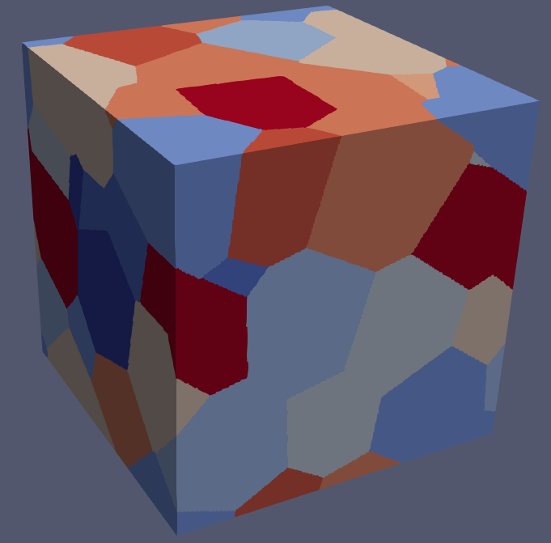
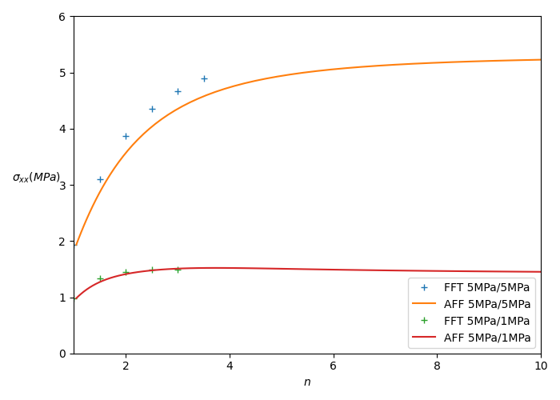

\newcommand{\tenseur}[1]{\underline{#1}}
\newcommand{\tenseurq}[1]{\underline{\mathbf{#1}}}
\newcommand{\tenseurt}[1]{\underline{\underline{\underline{#1}}}}
\newcommand{\tns}[1]{\underset{\tilde{}}{\mathbf{#1}}}
\newcommand{\transpose}[1]{#1^{\mathop{T}}}
\newcommand{\Ka}{\mathcal K}
\newcommand{\Sa}{\mathcal S}
\newcommand{\tsigma}{\tenseur{\sigma}}
\newcommand{\dbldot}{:}
\newcommand{\tepsilon}{\tenseur{\varepsilon}}
\newcommand{\te}{\tenseurq{e}}
\newcommand{\sigmaeq}{\sigma_{\mathrm{eq}}}
\newcommand{\epsiloneq}{\varepsilon_{\mathrm{eq}}}

\newcommand{\tepsilonto}{\underline{\epsilon}^{\mathrm{to}}}
\newcommand{\tepsilonel}{\underline{\epsilon}^{\mathrm{el}}}

\newcommand{\trace}[1]{\mathrm{tr}\paren{#1}}
\newcommand{\Frac}[2]{{\displaystyle \frac{\displaystyle #1}{\displaystyle #2}}}
\newcommand{\deriv}[2]{{\displaystyle \frac{\displaystyle \partial #1}{\displaystyle \partial #2}}}
\newcommand{\derivdeux}[2]{{\displaystyle \frac{\displaystyle \partial^2 #1}{\displaystyle \partial #2^2}}}
\newcommand{\pderiv}[2]{{\dfrac{\partial #1}{\partial #2}}}
\newcommand{\pderivdeux}[2]{{\dfrac{\partial^2 #1}{\partial #2^2}}}
\newcommand{\derivderiv}[3]{{\displaystyle \frac{\displaystyle \partial^2 #1}{\displaystyle \partial #2\,\displaystyle \partial #3}}}
\newcommand{\dtot}{{\mathrm{d}}}
\newcommand{\paren}[1]{\left(#1\right)}
\newcommand{\nom}[1]{\textsc{#1}}
\renewcommand{\div}{\mathrm{div}}

We present here an implementation of the affine formulation for homogenization [@masson_affine_2000]
for the homogenization of a viscoplastic polycrystal, example which is treated in [@bornert_second-order_2001]
but with Ponte-Castaneda second-order estimates.

Here, the idea is to show that many implementations of that procedure are possible in `MFront`.
We show here a first implementation based on the self-consistent scheme, provided by the `namespace`
`tfel::material::homogenization`. A second approach which uses morphological tensors computed by FFT,
on a given geometry of polycrystal, is also detailed. This allows to improve the estimates, but
it necessitates an offline computation.

This tutorial first presents the homogenization problem, recalls the methodology
of the affine formulation, presents different kinds of possible implementations,
and show the details of the `mfront` file.

# The viscoplastic polycrystal

## Behaviour

We consider a polycrystalline material, which means that each phase $r$ is associated to a crystal with
corresponding slip systems $\tenseur \mu_k^r$ ($1\leq k\leq K$). The strain rate in each crystal $r$ is given by
  \begin{aligned}
    \dot{\tepsilon}=\sum_k \dot{\gamma}_k^r\, \tenseur \mu_k^r\qquad\text{with}\quad \tenseur\mu_k^r = \dfrac12\left(\tenseur n_k^r\otimes\tenseur m_k^r + \tenseur m_k^r\otimes\tenseur n_k^r\right)
  \end{aligned}
  where $\dot{\gamma}_k^r$ is the shear strain rate on the $k^{th}$ slip system of crystal $r$, and is given as a
  function of the shear stress $\tau_k^r=\tsigma\dbldot\tenseur \mu_k^r$ by means of a potential $\psi_k^r$:
  \begin{aligned}
  \dot{\gamma}_k^r= \deriv{\psi_k^r}{\tau}\left(\tau_k^r\right)
  \end{aligned}
  The expressions above show that on phase (or crystal) $r$:
  \begin{aligned}
  \dot{\tepsilon}=\deriv{\psi_r}{\tsigma}\left(\tsigma\right)\qquad\text{with}\quad\psi_r \left(\tsigma\right)=\sum_k \psi_k^r\left(\tau_k^r\right)
  \end{aligned}
  
  Now, the behaviour of the polycrystal is governed by a potential $\psi$:
  \begin{aligned}
    \dot{\tepsilon}=\deriv{\psi_r}{\tsigma}\left(\tsigma\right)\qquad\psi(\tsigma)= \sum_{r=1}^{N}\chi_r\,\psi_r (\tsigma)
  \end{aligned}
where $N$ is the number of phases (or crystals) and $\chi_r$ is characteristic function of phase $r$.
 
 In all the sequel, we just note $\tepsilon$ for $\dot{\tepsilon}$.
  
## The non-linear homogenization problem

We impose a strain rate $\overline{\tepsilon}$ to the polycrystal and look for the solution $\tepsilon,\tsigma$ such that:

\begin{aligned}
 &\div\,\tsigma=\tenseur 0\\
 &\tepsilon\in\Ka(\overline{\tepsilon})\\
 &\tepsilon = \deriv{\psi}{\tsigma}\left(\tsigma\right)
\end{aligned}

where we introduced the space of kinematically admissible fields $\mathcal K(\overline{\tepsilon})$, depending on the boundary conditions used (in the implementation, we work with periodic boundary conditions).

# The affine formulation
  
## The affine linearization

The idea is to linearize the behaviour around a reference stress $\tsigma^r$:
 \begin{aligned}
    \tepsilon_r(\tsigma)\approx\tenseurq M_r\left(\tsigma^r\right)\dbldot\tsigma+\tenseur e^r
  \end{aligned}
  where
  \begin{aligned}
   \tenseurq M_r\left(\tsigma^r\right)=\deriv{\tepsilon_r}{\tsigma}\left(\tsigma^r\right)=\derivdeux{\psi_r}{\tsigma}\left(\tsigma^r\right)\qquad\tenseur e^r = \tepsilon_r(\tsigma^r)-\tenseurq M_r\left(\tsigma^r\right)\dbldot\tsigma^r
  \end{aligned}
  This affine behaviour can be viewed as a so-called "thermoelastic comparison composite", and this composite
  can be homogenized. This leads to a linear problem, so that the average on phase $r$ of the solution $\tsigma$ is given by
  \begin{aligned}
  \langle\tsigma\rangle_r = \tenseurq A_r\left(\tsigma^1,...,\tsigma^N\right)\dbldot\overline{\tepsilon} + \sum_s \tenseurq B_{rs}\left(\tsigma^1,...,\tsigma^N\right)\dbldot\tenseur e^s\left(\tsigma^s\right)
  \end{aligned}
  where $\tenseurq A_r\left(\tsigma^1,...,\tsigma^N\right)$ and $\tenseurq B_{rs}\left(\tsigma^1,...,\tsigma^N\right)$ can be obtained by a homogenization procedure (mean-field scheme, FFT...).
  
The last question is the choice of the reference stresses $\tsigma^r$ ($1\leq r\leq N$). A discussion in [@masson_affine_2000] leads to the simple assumption that these reference stresses are the averages of the stress in the thermoelastic composite:
\begin{aligned}
\tsigma^r = \langle\tsigma\rangle_r
\end{aligned}
  where $\tsigma$ here stands for the stress solution of the thermoelastic homogenization problem.
  
## Macroscopic stress and tangent operator

  The macroscopic stress hence can be obtained by the classical relation:
  \begin{aligned}
\overline{\tsigma}=\sum_rc_r\,\langle\tsigma\rangle_r=\tenseurq C^{\mathrm{eff}}\dbldot\overline{\tepsilon}+\tenseur\tau^{\mathrm{eff}}
  \end{aligned}
  
  where
  \begin{aligned}
  \tenseurq C^{\mathrm{eff}}=\sum_rc_r\,\tenseurq A_r\qquad\text{and}\qquad\tenseur\tau^{\mathrm{eff}}=\sum_{r,s}c_r\,\tenseurq B_{rs}\dbldot\tenseur e^s
  \end{aligned}
  
  The tangent operator is obtained by derivation:
  \begin{aligned}
    \dfrac{\mathrm{d}\overline{\tsigma}}{\mathrm{d}\overline{\tepsilon}}=\sum_r c_r\,\deriv{\tsigma^r}{\overline{\tepsilon}}
  \end{aligned}

In the expressions of the tangent operator, we can compute the term $\deriv{\tsigma^r}{\overline{\tepsilon}}$ by means of the jacobian matrix, also done and explained in the documentation of the [Implicit DSL](https://thelfer.github.io/tfel/web/implicit-dsl.html#computation-of-the-consistent-tangent-operator). We explain it below.

# Summary and possible implementations

## Summary

The resolution consists in
\[
 \text{Find}\quad\tsigma^r\quad\text{such that}\quad\tsigma^r=\langle\tsigma\rangle_r
\]
where \(\tsigma\) is the stress field solution of a homogenization problem of the form:
\begin{aligned}
&\div\,\tsigma=\tenseur 0\\
&\left(\tenseur e^r+\tenseurq M_r\dbldot\tsigma\right)\in\Ka\left(\overline{\tepsilon}\right)\\
&\tenseurq M_r=\derivdeux{\psi_r}{\tsigma}\left(\tsigma^r\right)\qquad\text{and}\qquad\tenseur e^r=\deriv{\psi_r}{\tsigma}\left(\tsigma^r\right)-\tenseurq M_r\dbldot\tsigma^r
\end{aligned}

 
## Possible implementations

The iterative resolution of the non-linear system can be summarized as

\[
\underset{\substack{\\ \\ \\ \Downarrow\\ \\ \\\text{analytic / finite difference}\\ \\ \\\text{\texttt{@BehaviourVariable} / directly provided}}}{\tenseurq M_r= \pderivdeux{\psi_r}{\tsigma}\left(\tsigma^r\right),\quad\tenseur e^r=\deriv{\psi_r}{\tsigma}\left(\tsigma^r\right)-\tenseurq M_r\dbldot\tsigma^r}\qquad\rightarrow\qquad \underset{\substack{\\ \\ \\ \Downarrow\\ \\ \\\text{mean-field scheme / morphological tensors}\\ \\ \\\texttt{tfel::material::homogenization}}}{\tsigma^r = \tenseurq A_r\dbldot\overline{\tepsilon} + \sum_s \tenseurq B_{rs}\dbldot\tenseur e^s}
\]

The first step of the resolution consists in computing the moduli $\tenseurq M_r$ and free strains $\tenseur e^r$. It can be done analytically (as below) or via finite difference or automatic differentiation. Moreover, for both strategies, we could use a `BehaviourVariable`, defining the local behaviour in an external file (in our example, the potential is to simple to do that).

The second step is the computation of the tensors $\tenseurq A_r$ and $\tenseurq B_{rs}$. This can be achieved by means of mean-field schemes (the `namespace` `tfel::material::homogenization` provides the good tensors). This can also be done via morphological tensors, computed on a given geometry of polycrystal. We will present below the two possibilities.

We note that the equation relative to the second step is the non-linear equation to solve and will hence correspond to our residue.
The macroscopic stress and the tangent operator must also be computed with the formulas shown above.

## Computation of tensors Ar and Brs

### Computation via morphological tensors

In fact, the thermoelastic problem can be rewritten as a Lippmann-Schwinger equation (see [@willis_bounds_1977;@castaneda_effect_1995] for the primal version). Let us write $\tenseur\tau=\tsigma-\tenseurq L_0\dbldot\tepsilon$ with $\tepsilon=\tenseur e+\tenseurq M\dbldot\tsigma\in\Ka\left(\overline{\tepsilon}\right)$, we have, because, $\div\,\tsigma=0$,
\begin{aligned}
\tepsilon=\overline{\tepsilon}-\tenseurq \Gamma_0\left(\tenseur\tau\right)
\end{aligned}
where $\tenseurq \Gamma_0$ is the Green operator associated to the elasticity $\tenseurq L_0$ (this elasticity must be chosen by the user). It gives
\begin{aligned}
\tsigma=\tenseurq L_0\dbldot\overline{\tepsilon}-\tenseurq L_0\dbldot\tenseurq \Gamma_0\left(\tenseur\tau\right)+\tenseur\tau
\end{aligned}
and hence (due to the expressions of $\tenseur\tau$ and $\tepsilon$)
\begin{aligned}
\tsigma=\tenseurq L_0\dbldot\overline{\tepsilon}-\tenseurq L_0\dbldot\tenseurq \Gamma_0\left(\tsigma-\tenseurq L_0\dbldot\left(\tenseur e^r+\tenseurq M_r\dbldot\tsigma\right)\right)+\tsigma-\tenseurq L_0\dbldot\left(\tenseur e^r+\tenseurq M_r\dbldot\tsigma\right)
\end{aligned}

\begin{aligned}
\tsigma+\tenseurq \Delta_0\left(\tenseurq\delta\tenseurq M_r\dbldot\tsigma\right)=\tenseurq L_0\dbldot\overline{\tepsilon}-\tenseurq \Delta_0\left(\tenseur e^r\right)
\end{aligned}
with $\tenseurq\delta\tenseurq M_r=\tenseurq M_r-\tenseurq M_0$, $\tenseurq M_0=\tenseurq L_0^{-1}$, and $\tenseurq \Delta_0=\tenseurq L_0-\tenseurq L_0\dbldot\tenseurq \Gamma_0\tenseurq L_0$. We will not resolve this equation exactly, but we will consider the average of the fields:
\begin{aligned}
\langle\tsigma\rangle_r + \sum_s\tenseurq \Delta_{rs}\dbldot\tenseurq\delta\tenseurq M_s\dbldot\langle\tsigma\rangle_s= \tenseurq L_0\dbldot\overline{\tepsilon} -\sum_s\tenseurq \Delta_{rs}\dbldot\tenseur e^s
\end{aligned}
where
\begin{aligned}
\tenseurq \Delta_{rs} = \sum_j\langle\,\tenseurq\Delta_0(\chi_s\,\tenseur s_j)\otimes\tenseur s_j\,\rangle_r
\end{aligned}
is what we call a morphological tensor or an interaction tensor, and can be computed by FFT or FEM before the `mfront` integration. This tensor makes intervene the Green operator $\tenseurq \Gamma_0$, relative to the elasticity $\tenseurq L_0$, and a basis of symmetric second-order tensors $(\tenseur s_1,...,\tenseur s_d)$ ($d=6$ in 3D).
Hence, the $\langle\tsigma\rangle_r$ 's are solution of a linear system.
Depending on the number of phases $N$, the computation of the $\tenseurq \Delta_{rs}$ is more or less costly, but it is achieved
at the beginning, once and for all. 

We note that the reference medium can be adjusted with a scalar coefficient. Indeed, if the user wants to choose
a reference medium $r_0=10$ times stiffer, it is possible by dividing $\tenseurq M_0$ by $r_0$. It will be also necessary
to change $\tenseurq \Delta_{rs}$ and to multiply it by $r_0$.

### Computation via a self-consistent scheme

The `tfel::material::homogenization` will carry out the homogenization
with the self consistent scheme. The library provides the homogenized stiffness
$\tenseurq L_{\mathrm{SC}}$ needed for the computation of the macroscopic stress,
but also the effective polarization $\tenseurq \tau_{\mathrm{SC}}$ which permit
to compute the macroscopic stress:

\begin{aligned}
\overline{\tsigma} = \tenseurq L_{\mathrm{SC}}\dbldot\overline{\tepsilon}+\tenseur \tau_{\mathrm{SC}}
\end{aligned}

However, we also need the tensors $\tenseurq A_r$ and $\tenseurq B_{rs}$ for computing the average of
the stress field $\langle\tsigma\rangle_r$ (i.e. the residue). To that extent, we go back to the equation
\begin{aligned}
\tepsilon=\overline{\tepsilon}-\tenseurq \Gamma_0\left(\tenseur\tau\right)
\end{aligned}
and consider averages of the fields:
\begin{aligned}
\langle\tepsilon\rangle_r-\overline{\tepsilon}=-\sum_s\tenseurq \Gamma_{rs}\dbldot\langle\tenseur\tau\rangle_s
\end{aligned}
with $\tenseurq\Gamma_{rs}=\sum_j\langle\,\tenseurq\Gamma_0(\chi_s\,\tenseur s_j)\otimes\tenseur s_j\,\rangle_r$.
A classical approximation (see Eq. (3.17) of [@castaneda_effect_1995]) is to consider that $\tenseurq\Gamma_{rs}=\delta_{rs}\tenseurq P_r-c_s\,\tenseurq P_0$, with $\tenseurq P_r=\tenseurq\Gamma_{rr}$ the Hill tensor associated to $\tenseurq L_0$ and the inclusion shape of phase $r$, and $\tenseurq P_0$ the Hill tensor associated to $\tenseurq L_0$ and a spherical inclusion. This is when considering an isotropic distribution of inclusions (otherwise $\tenseurq P_0$ must be modified). For our polycrystal, we can also consider that $\tenseurq P_r=\tenseurq P_0$ (i.e. the grains have a spherical shape) so that
\begin{aligned}
\langle\tepsilon\rangle_r-\overline{\tepsilon}=-\tenseurq P_0\dbldot\left(\langle\tenseur\tau\rangle_r-\langle\tenseur\tau\rangle\right)
\end{aligned}
and due to the expression of $\tenseur\tau$:
\begin{aligned}
\left[\tenseurq P_0^{-1}-\tenseurq L_0\right]\dbldot\left(\langle\tepsilon\rangle_r-\overline{\tepsilon}\right)=-\left[\langle\tsigma\rangle_r-\overline{\tsigma}\right]
\end{aligned}
We know that the reference medium, in the self-consistent approach, is identified with the homogenized medium. Hence, we note
$\tenseurq P_0=\tenseurq P_{\mathrm{SC}}$, $\tenseurq L_0=\tenseurq L_{\mathrm{SC}}$, and $\tenseurq M_{\mathrm{SC}}^*=\left[\tenseurq P_{\mathrm{SC}}^{-1}-\tenseurq L_{\mathrm{SC}}\right]^{-1}$, so that, with $\langle\tepsilon\rangle_r=\tenseurq M_r\dbldot\tsigma^r+\tenseur e^r$, and $\langle\tsigma\rangle_r=\tsigma^r$
\begin{aligned}
\left(\tenseurq M_r\dbldot\tsigma^r+\tenseur e^r-\overline{\tepsilon}\right)=-\tenseurq M_{\mathrm{SC}}^*\dbldot\left[\tsigma^r-\overline{\tsigma}\right]
\end{aligned}
which gives
\begin{aligned}
\tsigma^r=\left(\tenseurq M_r+\tenseurq M_{\mathrm{SC}}^*\right)^{-1}\dbldot\left[\overline{\tepsilon}-\tenseur e^r+\tenseurq M_{\mathrm{SC}}^*\dbldot\overline{\tsigma}\right]
\end{aligned}
which gives directly the expressions of $\tenseurq A_r$ and $\sum_s\tenseurq B_{rs}\dbldot\tenseur e^s$ (we use $\overline{\tsigma}=\tenseurq L_{\mathrm{SC}}\dbldot\overline{\tepsilon}+\tenseur \tau_{\mathrm{SC}}$):
\begin{aligned}
\tenseurq A_r&=\left(\tenseurq M_r+\tenseurq M_{\mathrm{SC}}^*\right)^{-1}\dbldot\left(\tenseurq I + \tenseurq M_{\mathrm{SC}}^*\dbldot\tenseurq L_{\mathrm{SC}}\right)\\
\sum_s\tenseurq B_{rs}\dbldot\tenseur e^s&=\left(\tenseurq M_r+\tenseurq M_{\mathrm{SC}}^*\right)^{-1}\dbldot\left(\tenseurq M_{\mathrm{SC}}^*\dbldot\tenseur \tau_{\mathrm{SC}}-\tenseur e^r\right)
\end{aligned}
(and this is sufficient to compute the residue). However, we note that the library `tfel::material::homogenization` provides
the tensor $\tenseurq A_{\mathrm{SC}}$ via the variable `mean_strain_localisation_tensors`, which relates
$\langle\tepsilon\rangle_r$ and $\overline{\tepsilon}$. This tensor is also equal to $\tenseurq A_{\mathrm{SC}}=\tenseurq M_r\dbldot\tenseurq A_r$, due to the expression of $\langle\tsigma\rangle_r$.  This will be more simple for the implementation.

# Implementation in MFront

All the files are available in the `MFrontGallery` project, [here](https://github.com/thelfer/MFrontGallery/tree/master/generic-behaviours/homogenization/), under the name `MassonAffineFormulation`.

## Example used for the implementation

   The geometry of our polycrystal is generated with [`merope`](https://github.com/MarcJos/Merope/),
  with a Voronoi tesselation.
  This geometry is saved as an array with an integer representing the number of the phase (or crystal).
  The image below shows an example of such a polycrystal. There are here 10 crystals. The orientations
  and volume fractions are given in the file `polycrystal.csv`. The geometry is used to
  compute the morphological tensors (see the `python` script).
  
  {width=50%}
  
  The potential $\psi_k^r$ will be of the form
  \begin{aligned}
  \psi_k^r \left(\tau\right)= \dfrac{\dot{\gamma}_0\tau_0^{k,r}}{n+1}\left(\dfrac{|\tau|}{\tau_0^{k,r}}\right)^{n+1}
  \end{aligned}
  where the strain rate $\dot{\gamma}_0$ and the creep exponent $n\geq 1$ will be chosen identical for all $k,r$, and the resolved shear stress $\tau_0^{k,r}$ depends on $k,r$.

The derivatives of the potential are
 \begin{aligned}
  &\deriv{\psi_r}{\tsigma}=\sum_k \deriv{\psi_k^r}{\tau}\left(\tau_k^r\right)\,\tenseur\mu_k^r=\sum_k\mathrm{sgn}(\tau)\,\dot{\gamma}_0\left(\dfrac{|\tau|}{\tau_0^{k,r}}\right)^{n}\tenseur\mu_k^r\\
  &\derivdeux{\psi_r}{\tsigma}=\sum_k \derivdeux{\psi_k^r}{\tau}\left(\tau_k^r\right)\,\tenseurq N_k^r=\sum_k \dfrac{n\,\dot{\gamma}_0}{\tau_0^{k,r}}\left(\dfrac{|\tau|}{\tau_0^{k,r}}\right)^{n-1}\tenseurq N_k^r,\qquad\text{with}\quad\tenseurq N_k^r=\tenseur \mu_k^r\otimes\tenseur \mu_k^r
  \end{aligned}
  and then defining $\overline{\tau}_k^r=\tsigma^r\dbldot\tenseur \mu_k^r$ where $\tsigma^r$ is the reference stress, we have
  \begin{aligned}
  &\tenseurq M_r=\sum_k \dfrac{n\,\dot{\gamma}_0}{\tau_0^{k,r}}\left(\dfrac{|\overline{\tau}_k^r|}{\tau_0^{k,r}}\right)^{n-1}\tenseurq N_k^r\\
  &\tenseur e^r=\sum_k\left(\mathrm{sgn}(\overline{\tau}_k^r)-n\right)\,\dot{\gamma}_0\left(\dfrac{|\overline{\tau}_k^r|}{\tau_0^{k,r}}\right)^{n}\tenseur\mu_k^r
  \end{aligned}

## Details of implementation

We will mainly present the approach based on self-consistent
scheme, we invite the reader to see the behaviour for the other approach.

### Headers

For the jacobian, we adopt the `Numerical Jacobian`, so that
the beginning of the `mfront` file reads:

~~~~ {#Begin .cpp .numberLines}
@DSL ImplicitII;
@Behaviour Affine_formulation;
@Author Martin Antoine;
@Date 24 / 01 / 26;
@Description{"Affine formulation for homogenization of a viscoplastic polycrystal, Masson et al. 2001."};
@UseQt false;
@Algorithm NewtonRaphson_NumericalJacobian;
@PerturbationValueForNumericalJacobianComputation 1e-10;
@Epsilon 1e-14;
~~~~~~~~~~~~~~~~~~~~~~~~~~~~~~~~~~~~~~~~~~~~~~~~~

Moreover, we need to include header files, those
for the homogenization of the thermoelastic composite:
 
 - IsotropicEshelbyTensor.hxx
 - MicrostructureDescription.hxx
 - MicrostructureLinearHomogenization.hxx

and the header for handling the rotations of the grains with their
slip systems:
 
 - ExtendedPolyCrystalsSlidingSystems.hxx

~~~~ {#Begin .cpp .numberLines}
@TFELLibraries {"Material"};
@Includes{
#include "TFEL/Material/IsotropicModuli.hxx"
#include "TFEL/Material/IsotropicEshelbyTensor.hxx"
#include "TFEL/Material/MicrostructureDescription.hxx"
#include "TFEL/Material/MicrostructureLinearHomogenization.hxx"
#include "TFEL/Material/ExtendedPolyCrystalsSlidingSystems.hxx"}
~~~~~~~~~~~~~~~~~~~~~~~~~~~~~~~~~~~~~~~~~~~~~~~~~

For the approach based on morphological tensors, we do not need all these headers,
but we need to include a file which contains the morphological tensors.
This file is present in a repository `extra-headers/TFEL/Material/`
located at the same place as the `.mfront` file.

~~~~ {#Begin .cpp .numberLines}
@TFELLibraries {"Material"};
@Includes{
#include "../extra-headers/TFEL/Material/tensors.hxx"
#include "TFEL/Material/ExtendedPolyCrystalsSlidingSystems.hxx"}
~~~~~~~~~~~~~~~~~~~~~~~~~~~~~~~~~~~~~~~~~~~~~~~~~

We will also generate a polycrystal and compute the tensors via FFT (see the `python` script [here](./downloads/Morphological_tensors.zip)).

### Sliding systems

The sliding systems will be generated using these lines (the same
procedure as for the tutorial on the [Berveiller-Zaoui](ExplicitBerveillerZaouiPolyCrystals.html) scheme):

~~~~ {#Begin .cpp .numberLines}
@ModellingHypothesis Tridimensional;
@OrthotropicBehaviour;
@CrystalStructure HCP;
@SlidingSystems{<1, 1, -2, 0>{1, -1, 0, 0},
                <-2, 1, 1, 3>{1, -1, 0, 1},
                <-2, 1, 1, 0>{0, 0, 0, 1},
                <1, 1, -2, 0>{1, -1, 0, 1}};
~~~~~~~~~~~~~~~~~~~~~~~~~~~~~~~~~~~~~~~~~~~~~~~~~

but the rotations of the grains will be performed later, in the `Integrator`
code block:

~~~~ {#Integrator .cpp .numberLines}
using PolyCrystalsSlidingSystems =
	ExtendedPolyCrystalsSlidingSystems<Np, Affine_formulationSlipSystems<real>, real>;
const auto& gs =
	PolyCrystalsSlidingSystems::getPolyCrystalsSlidingSystems("polycrystal.csv");
~~~~~~~~~~~~~~~~~~~~~~~~~~~~~~~~~~~~~~~~~~~~~~~~~

### Poperties and variables

The state variables are the reference stresses $\tsigma^r$ on each phase. 

~~~~ {#Begin .cpp .numberLines}
@StateVariable Stensor sigma[Np];
sigma.setEntryName("PhaseReferenceStress");
~~~~~~~~~~~~~~~~~~~~~~~~~~~~~~~~~~~~~~~~~~~~~~~~~

Note also that `Np` is the number of phases (or crystals). We define it
before like that:

~~~~ {#Begin .cpp .numberLines}
@IntegerConstant Np = 10;
~~~~~~~~~~~~~~~~~~~~~~~~~~~~~~~~~~~~~~~~~~~~~~~~~

Note that among several local variables, one of them, for
morphological tensors, is

~~~~ {#Begin .cpp .numberLines}
@LocalVariable std::array<std::array<tfel::math::st2tost2<3u,real>,Np>,Np> DELTA;
~~~~~~~~~~~~~~~~~~~~~~~~~~~~~~~~~~~~~~~~~~~~~~~~~

This matrix will store the morphological tensors. Indeed, in the
`InitLocalVariables` code block, we can load these coefficients,
which are in fact situated in the header ``

~~~~ {#Begin .cpp .numberLines}
DELTA=Delta<real>::get_tensor();
~~~~~~~~~~~~~~~~~~~~~~~~~~~~~~~~~~~~~~~~~~~~~~~~~

### Affine modulus and free-strain

There is no difficulty in computing the tangent modulus and free-strain,
in the `Integrator` code block:

~~~~ {#Integrator .cpp .numberLines}
using namespace tfel::math;
Stensor4 LSC;
Stensor e[Np];
Stensor dpsi_dsigma[Np];

for (int r=0;r<Np;r++){
  M[r]=Stensor4::zero();
  dpsi_dsigma[r]=Stensor::zero();
  frac[r]=gs.volume_fractions[r];
  for (int k=0;k<Nss;k++){
     const auto Nkr = gs.mus[r][k]^gs.mus[r][k];
     const auto taukr = gs.mus[r][k] | (sigma[r]+dsigma[r]);
     const auto puisn_1 = pow(abs(taukr)/tau0[r], nexp-1);
     const auto fac= nexp*gamma0/tau0[r]*puisn_1;
     M[r]+=fac*Nkr;
     const auto puisn = puisn_1*abs(taukr)/tau0[r];
     const auto sgn= taukr< 0 ? -real(1) : real(1);
     dpsi_dsigma[r]+=sgn*gamma0*puisn*gs.mus[r][k]; 
  } 
  e[r]=dpsi_dsigma[r]-M[r]*(sigma[r]+dsigma[r]);
  M[r]=M[r]+kap*I;
  L[r]=invert(M[r]);
}
~~~~~~~~~~~~~~~~~~~~~~~~~~~~~~~~~~~~~~~~~~~~~~~~~

Note that here, a tensor `kap*I` is added to the compliance line 21. `kap`
is a parameter that the user can change. It is necessary because
the tensors $\tenseurq M_r$ are not invertible (see also [@bornert_second-order_2001],
appendix B.1).

### Self-consistent scheme

The homogenization of the thermoelastic composite
will be carried out with `tfel::material::homogenization::elasticity`.
We first construct our `ParticulateMicrostructure`.
We instantiate it by doing:

~~~~ {#Integrator .cpp .numberLines}
using namespace tfel::material::homogenization::elasticity;
const auto IM0=tfel::material::KGModuli<stress>(k0,mu0);
auto micro=ParticulateMicrostructure<3u,stress>(IM0);
~~~~~~~~~~~~~~~~~~~~~~~~~~~~~~~~~~~~~~~~~~~~~~~~~

Note that here the matrix phase is defined by the elasticity `(k0,mu0)`
but this elasticity will play no role in the sequel.
Then, we will add some `SphereDistribution` objects,
each of them representing a grain with its shape (`Sphere`), volume fraction
and elasticity:

~~~~ {#Integrator .cpp .numberLines}
const auto sphere=Sphere<length>();
std::vector<Stensor> polarisations;
const auto zero = Stensor::zero();
polarisations.resize(Np+1, zero);

for (int r=0 ; r<Np; r++){
  auto distribution = SphereDistribution<stress>(sphere,frac[r],L[r]);
  micro.addInclusionPhase(distribution);
  polarisations[r+1]=-L[r]*e[r];
}
~~~~~~~~~~~~~~~~~~~~~~~~~~~~~~~~~~~~~~~~~~~~~~~~~

Because the sum of the volume fractions are one, it means that the matrix
phase will have a volume fraction equal to zero. This is not a problem,
but do not forget that this phase still exist in the `ParticulateMicrostructure`
object (see below).

The self-consistent scheme is performed afterwards:

~~~~ {#Integrator .cpp .numberLines}
const auto hmSC=computeSelfConsistent<3u,stress>(micro,1e-6,true,0,polarisations);
LSC = hmSC.homogenized_stiffness;
const auto tauSC = hmSC.effective_polarisation;
const auto A_SC=hmSC.mean_strain_localisation_tensors;
~~~~~~~~~~~~~~~~~~~~~~~~~~~~~~~~~~~~~~~~~~~~~~~~~

Note that we want here a tolerance of `1e-6` and we consider an isotropic
homogenized stiffness in the iterative algorithm with `true`.

We will need the following tensors:

~~~~ {#Integrator .cpp .numberLines}
auto KGSC = computeKGModuli(LSC);
const auto PSC = computeSphereHillPolarisationTensor<stress>(KGSC);
const auto MSC_star = invert(invert(PSC)- LSC);
~~~~~~~~~~~~~~~~~~~~~~~~~~~~~~~~~~~~~~~~~~~~~~~~~

Note here that we isotropize the homogenized stiffness with the function
`computeKGModuli`, on line 1. This is more consistent with the fact that we used `true`
in the `computeSelfConsistent` function.

### Residues and jacobian

For the residues, we work on the strains (because `MFront` is more
suited to strain type residues. Hence, we will define the residues as

\begin{aligned}
f_{\sigma^r}=\tenseurq M_r\dbldot\left(\tsigma^r-\tenseurq A_r\dbldot\overline{\tepsilon}-\sum_s\tenseurq B_{rs}\dbldot\tenseur e^s\right)
\end{aligned}

~~~~ {#Integrator .cpp .numberLines}
for (int r=0;r<Np;r++){
  const Stensor4 Ar=A_SC[r+1];
  map_derivative<Stensor,Stensor>(A,6*r,0)=Ar;
  auto KGAr = computeKGModuli(Ar);
  fsigma[r] = M[r]*(sigma[r]+dsigma[r])-Ar*(eto+deto);
  fsigma[r]-= M[r]*(invert(M[r]+MSC_star))*(MSC_star*tauSC - e[r]);
}
~~~~~~~~~~~~~~~~~~~~~~~~~~~~~~~~~~~~~~~~~~~~~~~~~

There is no jacobian because we use the `NumericalJacobian`. Here,
an analytical jacobian would have been tedious, although not impossible.

The computation of the macroscopic stress is simple:

~~~~ {#Integrator .cpp .numberLines}
sig=LSC*(eto+deto)+tauSC;
~~~~~~~~~~~~~~~~~~~~~~~~~~~~~~~~~~~~~~~~~~~~~~~~~

### Tangent operator

The computation of the tangent operator necessitates the computation of $\deriv{\tsigma^r}{\overline{\tepsilon}}$.
To do that, we use a technique widely used in `MFront`.
The idea is to write the non-linear system to solve as:
\begin{aligned}
\tenseurq M_r\dbldot\left[\tsigma^r - \tenseurq A_r\left(\tsigma^1,...,\tsigma^N\right)\dbldot\overline{\tepsilon} - \sum_s \tenseurq B_{rs}\left(\tsigma^1,...,\tsigma^N\right)\dbldot\tenseur e^s\left(\tsigma^s\right)\right]= f_{\sigma^r}(\overline{\tepsilon},\tsigma^1,...,\tsigma^N)=0
\end{aligned}
and by derivation of $f_{\sigma^r}$ w.r.t. $\overline{\tepsilon}$:
\begin{aligned}
-\tenseurq M_r\dbldot\tenseurq A_r\left(\tsigma^1,...,\tsigma^N\right)+\sum_s\tenseurq J_{rs}\dbldot\deriv{\tsigma^s}{\overline{\tepsilon}}=0
\end{aligned}
where $\tenseurq J_{rs}=\deriv{f_{\sigma^r}}{\tsigma^s}$ stands for the sub-block $(r,s)$ of the Jacobian. Hence
\begin{aligned}
\deriv{\tsigma^r}{\overline{\tepsilon}}=\sum_s\mathbf {iJ}_{rs}\dbldot\tenseurq M_s\dbldot\tenseurq A_s\left(\tsigma^1,...,\tsigma^N\right)
\end{aligned}
where $\mathbf {iJ}$ is the inverse of the Jacobian. The implementation is

~~~~ {#tangent .cpp .numberLines}
@TangentOperator{
  tmatrix<6*Np,6*Np,real> iJ = jacobian;
  TinyMatrixInvert<6*Np,real>::exe(iJ);
  dsigma_deto=iJ*A;
  Dt=Stensor4::zero();
  for (int r=0;r<Np;r++){
    const auto dsigmar_deto = map_derivative<Stensor,Stensor>(dsigma_deto,6*r,0);
    Dt+=frac[r]*dsigmar_deto;
  }
}
~~~~~~~~~~~~~~~~~~~~~~~~~~~~~~~~~~~~~~~~~~~~~~~~~

Note the use on line 7 of the function `tfel::math::map_derivative`
which allows to extract (but also to fill) a block from a `tmatrix`.

## Results

For the tests, we use `mtest`. However, note that the strain we impose
is in fact a strain rate. The idea for us is to keep this strain rate
constant and to make vary the parameter $n$ with time.
Besides, we choose two different values for $\tau_0^r$.
5 crystals are such that $\tau_0=10 MPa$, and 5 others
such that $\tau_0=50 MPa$.

The `.mtest` file is the following:

~~~~ {#Affine_formulation .mtest .numberLines}
@ModellingHypothesis 'Tridimensional';
@Behaviour<Generic> 'src/libBehaviour.so' 'Affine_tensors';
@ExternalStateVariable 'Temperature' {0 : 1000,1:1000};

@MaterialProperty<function> 'nexp' "1+0.9*(exp(2.4*t)-1)";
@MaterialProperty<constant> 'tau1' 10.;
@MaterialProperty<constant> 'tau2' 50.;

@MaterialProperty<function> 'kap' "0.001";

@ImposedStrain 'EXX' {0 : 1, 1 : 1};
@ImposedStrain 'EYY' {0 : -1, 1 : -1};
@ImposedStrain 'EZZ' {0 : 0, 1 : 0};
@ImposedStrain 'EXY' {0 : 0, 1 : 0};
@ImposedStrain 'EXZ' {0 : 0, 1 : 0};
@ImposedStrain 'EYZ' {0 : 0, 1 : 0};
@Times {0.,1 in 50};

@OutputFilePrecision 14;
~~~~~~~~~~~~~~

For the morphological tensor approach, we talked above
about the coefficient $r_0$ that allows to adjust the reference medium.
This coefficient can hence be set as a material property, and we will add
this line in the `mtest` file:

~~~~ {#Affine_formulation .mtest .numberLines}
@MaterialProperty<function> 'r0' "1+t";
~~~~~~~~~~~~~~

Here, we choose to make vary the reference medium because when `t`
increases, `n` increases, and hence the homogenized stiffness increases.
The optimal value of `r0` is not immediate, but some numerical tests
can be carried out.

In this figure we plotted the results when all the $\tau_0^r$ are equal to $10 Mpa$
(to show the heterogeneity) ("FFT 0"), the implementation of the affine approach
with self-consistent scheme (AFF_SC), and with morphological tensors (AFF_MT).
FFT results are also plotted (FFT).

<!-- Local IspellDict: english -->
