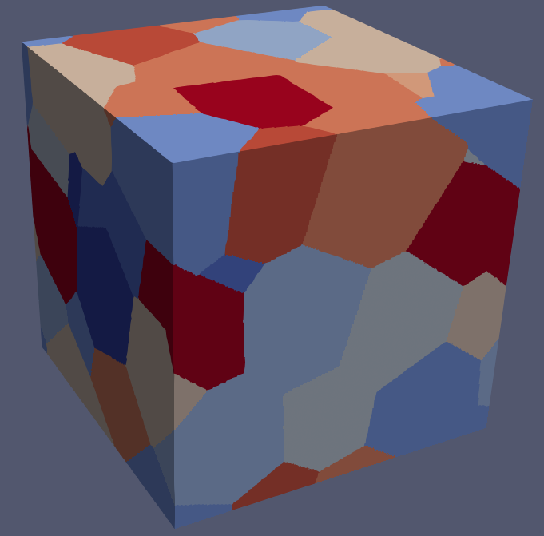
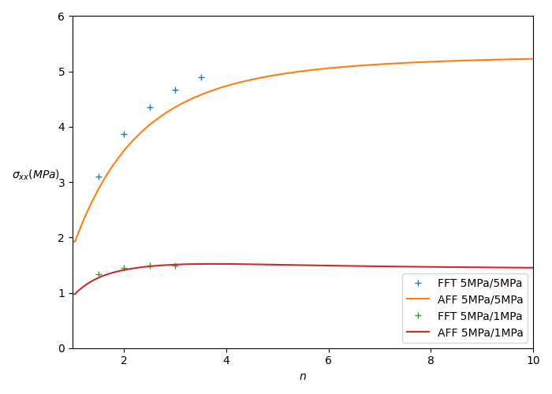

\newcommand{\tenseur}[1]{\underline{#1}}
\newcommand{\tenseurq}[1]{\underline{\mathbf{#1}}}
\newcommand{\tenseurt}[1]{\underline{\underline{\underline{#1}}}}
\newcommand{\tns}[1]{\underset{\tilde{}}{\mathbf{#1}}}
\newcommand{\transpose}[1]{#1^{\mathop{T}}}
\newcommand{\Ka}{\mathcal K}
\newcommand{\Sa}{\mathcal S}
\newcommand{\tsigma}{\tenseur{\sigma}}
\newcommand{\dbldot}{:}
\newcommand{\tepsilon}{\tenseur{\varepsilon}}
\newcommand{\te}{\tenseurq{e}}
\newcommand{\sigmaeq}{\sigma_{\mathrm{eq}}}
\newcommand{\epsiloneq}{\varepsilon_{\mathrm{eq}}}
\newcommand{\tE}{\tenseur E}
\newcommand{\tSigma}{\tenseur \Sigma}
\newcommand{\tepsilonto}{\underline{\epsilon}^{\mathrm{to}}}
\newcommand{\tepsilonel}{\underline{\epsilon}^{\mathrm{el}}}

\newcommand{\trace}[1]{\mathrm{tr}\paren{#1}}
\newcommand{\Frac}[2]{{\displaystyle \frac{\displaystyle #1}{\displaystyle #2}}}
\newcommand{\deriv}[2]{{\displaystyle \frac{\displaystyle \partial #1}{\displaystyle \partial #2}}}
\newcommand{\derivdeux}[2]{{\displaystyle \frac{\displaystyle \partial^2 #1}{\displaystyle \partial #2^2}}}
\newcommand{\pderiv}[2]{{\dfrac{\partial #1}{\partial #2}}}
\newcommand{\pderivdeux}[2]{{\dfrac{\partial^2 #1}{\partial #2^2}}}
\newcommand{\derivderiv}[3]{{\displaystyle \frac{\displaystyle \partial^2 #1}{\displaystyle \partial #2\,\displaystyle \partial #3}}}
\newcommand{\dtot}{{\mathrm{d}}}
\newcommand{\paren}[1]{\left(#1\right)}
\newcommand{\nom}[1]{\textsc{#1}}
\renewcommand{\div}{\mathrm{div}}

We present here an implementation of the affine formulation [@masson_affine_2000]
for the homogenization of a viscoplastic polycrystal, example which is treated in [@bornert_second-order_2001]
but with Ponte-Castaneda second-order estimates.

Here, the idea is to show that an implementation of that procedure based
on morphological tensors computed by FFT,
on a given geometry of polycrystal.

This tutorial first presents the homogenization problem, recalls the methodology
of the affine formulation, presents different the possible implementations,
and show the details of the `mfront` file.

# The viscoplastic polycrystal

## Behaviour

We consider a polycrystalline material, which means that each phase $r$ is associated to a crystal with
corresponding slip systems $\tenseur \mu_k^r$ ($1\leq k\leq K$). The strain rate in each crystal $r$ is given by
\[
  \begin{aligned}
    \dot{\tepsilon}=\sum_k \dot{\gamma}_k^r\, \tenseur \mu_k^r\qquad\text{with}\quad \tenseur\mu_k^r = \dfrac12\left(\tenseur n_k^r\otimes\tenseur m_k^r + \tenseur m_k^r\otimes\tenseur n_k^r\right)
  \end{aligned}
\]
  where $\dot{\gamma}_k^r$ is the shear strain rate on the $k^{th}$ slip system of crystal $r$, and is given as a
  function of the shear stress $\tau_k^r=\tsigma\dbldot\tenseur \mu_k^r$ by means of a potential $\psi_k^r$:
\[
  \begin{aligned}
  \dot{\gamma}_k^r= \deriv{\psi_k^r}{\tau}\left(\tau_k^r\right)
  \end{aligned}
\]
  The expressions above show that on phase (or crystal) $r$:
\[
  \begin{aligned}
  \dot{\tepsilon}=\deriv{\psi_r}{\tsigma}\left(\tsigma\right)\qquad\text{with}\quad\psi_r \left(\tsigma\right)=\sum_k \psi_k^r\left(\tau_k^r\right)
  \end{aligned}
\]  
  Now, the behaviour of the polycrystal is governed by a potential $\psi$:
\[
  \begin{aligned}
    \dot{\tepsilon}=\deriv{\psi_r}{\tsigma}\left(\tsigma\right)\qquad\psi(\tsigma)= \sum_{r=1}^{N}\chi_r\,\psi_r (\tsigma)
  \end{aligned}
\]
where $N$ is the number of phases (or crystals) and $\chi_r$ is characteristic function of phase $r$.
 
 In all the sequel, we just note $\tepsilon$ for $\dot{\tepsilon}$.
  
## The non-linear homogenization problem

We impose a strain rate $\tE$ to the polycrystal and look for the solution $\tepsilon,\tsigma$ such that:
\[
\begin{aligned}
 &\div\,\tsigma=\tenseur 0\\
 &\tepsilon\in\Ka(\tE)\\
 &\tepsilon = \deriv{\psi}{\tsigma}\left(\tsigma\right)
\end{aligned}
\]

where we introduced the space of kinematically admissible fields $\mathcal K(\tE)$, depending on the boundary conditions used (in the implementation, we work with periodic boundary conditions).

# The affine formulation
  
## The affine linearization

The idea is to linearize the behaviour around a reference stress $\tsigma^r$:
\[
    \tepsilon_r(\tsigma)\approx\tenseurq M_r\left(\tsigma^r\right)\dbldot\tsigma+\tenseur e^r
\]
  where
\[
   \tenseurq M_r\left(\tsigma^r\right)=\deriv{\tepsilon_r}{\tsigma}\left(\tsigma^r\right)=\derivdeux{\psi_r}{\tsigma}\left(\tsigma^r\right)\qquad\text{and}\quad\tenseur e^r = \deriv{\psi_r}{\tsigma}(\tsigma^r)-\tenseurq M_r\left(\tsigma^r\right)\dbldot\tsigma^r
\]
  For a given set of reference stresses, this affine behaviour can be viewed as a so-called "thermoelastic comparison composite", and this composite
  can be homogenized. This leads to a linear problem of the form
\[
\begin{aligned}
&\div\, \left(\tenseurq L_r\dbldot\left(\tepsilon-\tenseur e^r\right)\right)=\tenseur 0\\
&\tepsilon\in\Ka\left(\tE\right)\\
&\tenseurq L_r=\left[\derivdeux{\psi_r}{\tsigma}\left(\tsigma^r\right)\right]^{-1}\qquad\text{and}\qquad\tenseur e^r=\deriv{\psi_r}{\tsigma}\left(\tsigma^r\right)-\tenseurq L_r^{-1}\dbldot\tsigma^r
\end{aligned}
\]

 Resolving this problem gives the average on phase $r$ of the strain solution $\tepsilon$ as
\[
  \begin{aligned}
  \langle\tepsilon\rangle_r = \tenseurq A_r\left(\tsigma^1,...,\tsigma^N\right)\dbldot\tE + \sum_s \tenseurq B_{rs}\left(\tsigma^1,...,\tsigma^N\right)\dbldot\tenseur e^s\left(\tsigma^s\right)
  \end{aligned}
\]
  where $\tenseurq A_r\left(\tsigma^1,...,\tsigma^N\right)$ and $\tenseurq B_{rs}\left(\tsigma^1,...,\tsigma^N\right)$ can be obtained by a homogenization procedure (mean-field scheme, FFT...). The stresses are obtained by substracting the strain $\tenseur e^r$ and multiplying by the moduli $\tenseurq L_r=\left(\tenseurq M_r\right)^{-1}$, if it exists:
  \[
  \begin{aligned}
  \langle\tsigma\rangle_r = \tenseurq L_r\left(\tsigma^r\right)\dbldot\tenseurq A_r\left(\tsigma^1,...,\tsigma^N\right)\dbldot\tE + \sum_s \tenseurq L_r\left(\tsigma^r\right)\dbldot\tenseurq B_{rs}\left(\tsigma^1,...,\tsigma^N\right)\dbldot\tenseur e^s\left(\tsigma^s\right) - \tenseurq L_r\left(\tsigma^r\right)\dbldot\tenseur e^r\left(\tsigma^r\right)
  \end{aligned}
\]
  
The last question is the choice of the reference stresses $\tsigma^r$ ($1\leq r\leq N$). A discussion in [@masson_affine_2000] leads to the simple assumption that these reference stresses are the averages per phase of the stress in the thermoelastic composite:
\[
\begin{aligned}
\tsigma^r = \langle\tsigma\rangle_r
\end{aligned}
\]
where $\tsigma$ here stands for the stress solution of the thermoelastic homogenization problem.

  
## Macroscopic stress and tangent operator

  The macroscopic stress hence can be obtained by the classical relation:
\[
  \begin{aligned}
\tSigma=\sum_rc_r\,\tsigma^r=\sum_rc_r\,\langle\tsigma\rangle_r=\tenseurq C^{\mathrm{eff}}\dbldot\tE+\tenseur\tau^{\mathrm{eff}}
  \end{aligned}
  \]
  where
  \[
\begin{aligned}
  \tenseurq C^{\mathrm{eff}}=\sum_rc_r\,\tenseurq L_r\dbldot\tenseurq A_r\qquad\text{and}\qquad\tenseur\tau^{\mathrm{eff}}=\sum_{r,s}c_r\,\tenseurq L_r\dbldot\tenseurq B_{rs}\dbldot\tenseur e^s-\sum_{r}c_r\,\tenseurq L_r\dbldot\tenseur e^r
  \end{aligned}
\]
  
  The tangent operator is obtained by derivation:
\[
  \begin{aligned}
    \dfrac{\mathrm{d}\tSigma}{\mathrm{d}\tE}=\sum_r c_r\,\deriv{\tsigma^r}{\tE}
  \end{aligned}
\]

In the expressions of the tangent operator, we can compute the term $\deriv{\tsigma^r}{\tE}$ by means of the jacobian matrix, also done and explained in the documentation of the [Implicit DSL](https://thelfer.github.io/tfel/web/implicit-dsl.html#computation-of-the-consistent-tangent-operator). We explain it below.

# Summary and possible implementations

## Summary

The resolution consists in
\[
 \text{Find}\quad\tsigma^r\quad\text{such that}\quad\tsigma^r = \langle\tsigma\rangle_r
\]
where \(\tsigma\) is the stress field solution of a homogenization problem of the form:
\[
\begin{aligned}
&\div\, \left(\tenseurq L_r\dbldot\left(\tepsilon-\tenseur e^r\right)\right)=\tenseur 0\\
&\tepsilon\in\Ka\left(\tE\right)\\
&\tenseurq L_r=\left[\derivdeux{\psi_r}{\tsigma}\left(\tsigma^r\right)\right]^{-1}\qquad\text{and}\qquad\tenseur e^r=\deriv{\psi_r}{\tsigma}\left(\tsigma^r\right)-\tenseurq L_r^{-1}\dbldot\tsigma^r
\end{aligned}
\]
 
## Possible implementations

The iterative resolution of the non-linear system can be summarized as

\[
\begin{aligned}
&\underset{\substack{\\ \\ \\ \Downarrow\\ \\ \\\text{analytic / finite difference}\\ \\ \\\text{\texttt{@BehaviourVariable} / directly provided}}}{\tenseurq L_r= \left[\pderivdeux{\psi_r}{\tsigma}\left(\tsigma^r\right)\right]^{-1},\quad\tenseur e^r=\deriv{\psi_r}{\tsigma}\left(\tsigma^r\right)-\tenseurq L_r^{-1}\dbldot\tsigma^r}\qquad\rightarrow\qquad \underset{\substack{\\ \\ \\ \Downarrow\\ \\ \\\text{mean-field scheme / morphological tensors}\\ \\ \\\texttt{tfel::material::homogenization}}}{\langle\tsigma\rangle_r = \tenseurq L_r\dbldot\tenseurq A_r\dbldot\tE + \sum_s \tenseurq L_r\dbldot\tenseurq B_{rs}\dbldot\tenseur e^s - \tenseurq L_r\dbldot\tenseur e^r}\\
&\\
&\qquad\qquad\qquad\qquad\qquad\qquad\qquad\underset{\substack{\\ \\ \\ \Downarrow\\ \\ \\\text{Analytical Jacobian / Numerical Jacobian}\\ \\ \\\texttt{NewtonRaphson NumericalJacobian}}}{f_{\tsigma^r}=\tsigma^r-\langle\tsigma\rangle_r}
\end{aligned}
\]

The first step of the resolution consists in computing the moduli $\tenseurq M_r$ and free strains $\tenseur e^r$. It can be done analytically (as below) or via finite difference or automatic differentiation. Moreover, for both strategies, we could use a `BehaviourVariable`, defining the local behaviour in an external file (in our example, the potential is to simple to do that).

The second step is the computation of the tensors $\tenseurq A_r$ and $\tenseurq B_{rs}$. This can be achieved by means of mean-field schemes (the `namespace` `tfel::material::homogenization` provides the good tensors). This can also be done via morphological tensors, computed on a given geometry of polycrystal. We will present this second possibility below.

We note that the equation relative to the third step will give our residue.

## Computation of tensors Ar and Brs

### The Lippmann-Schwinger equation discretized

In fact, the thermoelastic problem can be rewritten as a Lippmann-Schwinger equation (see [@willis_bounds_1977;@castaneda_effect_1995]). 
Let us write $\tenseur\tau=\tsigma-\tenseurq L_0\dbldot\tepsilon$ with $\tsigma=\tenseurq L\dbldot\left(\tepsilon-\tenseur e\right)$.  We have $\tenseur\tau=\tenseurq\delta\tenseurq L\dbldot\tepsilon-\tenseurq L\dbldot\tenseur e$ with $\tenseurq\delta\tenseurq L=\tenseurq L-\tenseurq L_0$. We have, because, $\div\,\tsigma=0$,
\[
\begin{aligned}
\tepsilon=\tE-\tenseurq \Gamma_0\left(\tenseur\tau\right)
\end{aligned}
\]
where $\tenseurq \Gamma_0$ is the Green operator associated to the elasticity $\tenseurq L_0$ (this elasticity must be chosen by the user). It gives (due to the expression of $\tenseur\tau$)
\[
\begin{aligned}
\tepsilon=\tE-\tenseurq \Gamma_0\left(\tenseurq\delta\tenseurq L\dbldot\tepsilon-\tenseurq L\dbldot\tenseur e\right)
\end{aligned}
\]
We will not resolve this equation exactly, but we will consider the average of the fields:
\[
\begin{aligned}
\langle\tepsilon\rangle_r + \sum_s\tenseurq \Gamma_{rs}\dbldot\tenseurq\delta\tenseurq L_s\dbldot\langle\tepsilon\rangle_s= \tE +\sum_s\tenseurq \Gamma_{rs}\dbldot\tenseurq L_s\dbldot\tenseur e^s
\end{aligned}
\]
where
\[
\begin{aligned}
\tenseurq \Gamma_{rs} = \sum_j\langle\,\tenseurq\Gamma_0(\chi_s\,\tenseur s_j)\otimes\tenseur s_j\,\rangle_r
\end{aligned}
\]
is what we call a morphological tensor or an interaction tensor, and can be computed by FFT or FEM before the `mfront` integration. This tensor depends on the Green operator $\tenseurq \Gamma_0$, relative to the elasticity $\tenseurq L_0$, and a basis of symmetric second-order tensors $(\tenseur s_1,...,\tenseur s_d)$ ($d=6$ in 3D).
Depending on the number of phases $N$, the computation of the $\tenseurq \Gamma_{rs}$ is more or less costly, but it is achieved
at the beginning, once and for all.

After inversion of the linear system below, whose unknowns are the $\langle\tepsilon\rangle_s$, we obtain
\[
\begin{aligned}
\langle\tepsilon\rangle_r= \sum_t\tenseurq T_{rt}\dbldot\left[\tE +\sum_s\tenseurq \Gamma_{ts}\dbldot\tenseurq L_s\dbldot\tenseur e^s\right]
\end{aligned}
\]
where $\tenseurq T_{rt}$ is the linear operator issued from the linear resolution.
and we directly obtain the expressions of $\tenseurq A_r$ and $\tenseurq B_{rs}$:
\[
\begin{aligned}
&\tenseurq A_r= \sum_t\tenseurq T_{rt}\\
&\tenseurq B_{rs}= \sum_t\tenseurq T_{rt}\dbldot\tenseurq \Gamma_{ts}\dbldot\tenseurq L_s
\end{aligned}
\]

### Choice of reference medium

We note that the reference medium can be chosen in this approach. A natural approach is to take a $\tenseurq L_0$ isotropic near $\tenseurq L^{\mathrm{hom}}$. To that extent we will make use of the fact that for an elasticity $\tenseurq C_1=\alpha_1\tenseurq C_0$ the strain Green operator $\tenseurq \Gamma_1$ relative to $\tenseurq C_1$ is given by 
\[
\tenseurq \Gamma_1=\dfrac{1}{\alpha_1}\tenseurq \Gamma_0
\]
Hence, we will compute the morphological tensors $\tenseurq \Gamma_{rs}$ for a given elasticity $\tenseurq C_0$, and we can change the reference medium by multiplication of $\tenseurq C_0$ by $\alpha_1$ and division of $\tenseurq \Gamma_0$ by $\alpha_1$.
Moreover, in our case, it makes sense to take a reference medium $\tenseurq C_0=2\mu_0\tenseurq K$.

# Implementation in MFront

All the files are available in the `MFrontGallery` project, [here](https://github.com/thelfer/MFrontGallery/tree/master/generic-behaviours/homogenization/), under the name `MassonAffineFormulation`.

## Example used for the implementation

   The geometry of our polycrystal is generated with [`merope`](https://github.com/MarcJos/Merope/),
  with a Voronoi tesselation.
  This geometry is saved as an array and will be used only for the approach based on morphological
  tensors. The image below shows an example of such a polycrystal. There are here 10 crystals. The
  volume fractions can also be computed on this microstructure
  
  {width=50%}
  
  The morphological tensors can be computed by following the instruction of the `README.md`
  in this [folder](./downloads/Morphological_tensors.zip).
  
  The orientations of the slip systems will be given by angles, stored in the file `polycrystal.csv`.
  This file also contains, at the end of each line, the volume fraction associated to a crystal.
  They are in our case the same as the one computed on the generated microstructure.
  
  The potential $\psi_k^r$ will be of the form
  \[
\begin{aligned}
  \psi_k^r \left(\tau\right)= \dfrac{\dot{\gamma}_0\tau_0^k}{n+1}\left(\dfrac{|\tau|}{\tau_0^k}\right)^{n+1}
  \end{aligned}
\]
  where the strain rate $\dot{\gamma}_0$ and the creep exponent $n\geq 1$ will be chosen identical for all $k,r$, and the resolved shear stress $\tau_0^k$ depends on $k$.

The derivatives of the potential are
 \[
\begin{aligned}
  &\tepsilon_r(\tsigma)=\deriv{\psi_r}{\tsigma}=\sum_k \deriv{\psi_k^r}{\tau}\left(\tau_k^r\right)\,\tenseur\mu_k^r=\sum_k\mathrm{sgn}(\tau)\,\dot{\gamma}_0\left(\dfrac{|\tau_k^r|}{\tau_0^{k}}\right)^{n}\tenseur\mu_k^r\qquad\text{with}\quad \tau_k^r = \tsigma\dbldot\tenseur \mu_k^r\\
  &\tenseurq M_r(\tsigma)=\derivdeux{\psi_r}{\tsigma}=\sum_k \derivdeux{\psi_k^r}{\tau}\left(\tau_k^r\right)\,\tenseurq N_k^r=\sum_k \dfrac{n\,\dot{\gamma}_0}{\tau_0^{k}}\left(\dfrac{|\tau_k^r|}{\tau_0^{k}}\right)^{n-1}\tenseurq N_k^r,\qquad\text{with}\quad\tenseurq N_k^r=\tenseur \mu_k^r\otimes\tenseur \mu_k^r
  \end{aligned}
\]
  and then defining $\overline{\tau}_k^r=\tsigma^r\dbldot\tenseur \mu_k^r$ where $\tsigma^r$ is the reference stress, we have
  \[
\begin{aligned}
  &\tenseurq M_r(\tsigma^r)=\sum_k \dfrac{n\,\dot{\gamma}_0}{\tau_0^{k}}\left(\dfrac{|\overline{\tau}_k^r|}{\tau_0^{k}}\right)^{n-1}\tenseurq N_k^r\\
  &\tenseur e^r(\tsigma^r)=\sum_k\left(\mathrm{sgn}(\overline{\tau}_k^r)-n\right)\,\dot{\gamma}_0\left(\dfrac{|\overline{\tau}_k^r|}{\tau_0^{k}}\right)^{n}\tenseur\mu_k^r
  \end{aligned}
\]

## Details of implementation

### Headers

The beginning of the `mfront` file reads:

~~~~ {#Begin .cpp .numberLines}
@DSL ImplicitII;
@Behaviour Affine_tensors;
@Author Martin Antoine;
@Date 06 / 03 / 26;
@Description{"Affine formulation for homogenization of a viscoplastic polycrystal, Masson et al. 2001., with morphological tensors"};
@UseQt false;
@Algorithm NewtonRaphson;
@Epsilon 1e-14;
~~~~~~~~~~~~~~~~~~~~~~~~~~~~~~~~~~~~~~~~~~~~~~~~~

Moreover, we need to include a header file for handling the rotations of the grains with their
slip systems:
 
 - PolyCrystalsSlidingSystems.hxx

and a file which contains the morphological tensors.
This file is present in a repository, let's say `extra-headers/TFEL/Material/`
located at the same place as the `.mfront` file.

~~~~ {#Begin .cpp .numberLines}
@TFELLibraries {"Material"};
@Includes{
#include "tensors.hxx"
#include "TFEL/Material/IsotropicModuli.hxx"
#include "TFEL/Material/PolyCrystalsSlidingSystems.hxx"}
~~~~~~~~~~~~~~~~~~~~~~~~~~~~~~~~~~~~~~~~~~~~~~~~~

The compilation hence will be done like that:

~~~~ {#Begin .sh .numberLines}
mfront -I ../extra-headers/TFEL/Material --obuild --interface=generic Affine_tensors.mfront
~~~~~~~~~~~~~~~~~~~~~~~~~~~~~~~~~~~~~~~~~~~~~~~~~

Of cours the tensors are computed before via FFT as explained above
(see the folder mentioned above for the computation).

### Sliding systems

The sliding systems will be generated using these lines (the same
procedure as for the tutorial on the [Berveiller-Zaoui](ExplicitBerveillerZaouiPolyCrystals.html) scheme):

~~~~ {#Begin .cpp .numberLines}
@ModellingHypothesis Tridimensional;
@OrthotropicBehaviour;
@CrystalStructure HCP;
@SlidingSystems{<1, 1, -2, 0>{1, -1, 0, 0},
                <-2, 1, 1, 3>{1, -1, 0, 1},
                <-2, 1, 1, 0>{0, 0, 0, 1},
                <1, 1, -2, 0>{1, -1, 0, 1}};
~~~~~~~~~~~~~~~~~~~~~~~~~~~~~~~~~~~~~~~~~~~~~~~~~

but the rotations of the grains will be performed later, in the `Integrator`
code block:

~~~~ {#Integrator .cpp .numberLines}
using ExtendedPolyCrystalsSlidingSystems =
	ExtendedPolyCrystalsSlidingSystems<Np, Affine_tensorsSlipSystems<real>, real>;
const auto& gs =
	ExtendedPolyCrystalsSlidingSystems::getPolyCrystalsSlidingSystems("polycrystal.csv");
~~~~~~~~~~~~~~~~~~~~~~~~~~~~~~~~~~~~~~~~~~~~~~~~~

### Properties and variables

The state variables are the stresses $\tsigma^r$ on each phase. 

~~~~ {#Begin .cpp .numberLines}
@StateVariable Stensor sigma[Np];
sigma.setEntryName("PhaseReferenceStress");
~~~~~~~~~~~~~~~~~~~~~~~~~~~~~~~~~~~~~~~~~~~~~~~~~

Note also that `Np` is the number of phases (or crystals). We define it
before like that:

~~~~ {#Begin .cpp .numberLines}
@IntegerConstant Np = 10;
~~~~~~~~~~~~~~~~~~~~~~~~~~~~~~~~~~~~~~~~~~~~~~~~~

Note that among several local variables, one of them, for
morphological tensors, is

~~~~ {#Begin .cpp .numberLines}
@LocalVariable std::array<std::array<tfel::math::st2tost2<3u,real>,Np>,Np> GAMMA;
~~~~~~~~~~~~~~~~~~~~~~~~~~~~~~~~~~~~~~~~~~~~~~~~~

This matrix will store the morphological tensors. Indeed, in the
`InitLocalVariables` code block, we can load these coefficients,
which are in fact situated in the header `tensors.hxx`

~~~~ {#Begin .cpp .numberLines}
GAMMA=Gamma<real>::get_tensor();
~~~~~~~~~~~~~~~~~~~~~~~~~~~~~~~~~~~~~~~~~~~~~~~~~

### Affine modulus and free-strain

There is no difficulty in computing the tangent modulus and free-strain,
in the `Integrator` code block:

~~~~ {#Integrator .cpp .numberLines}
using namespace tfel::math;
Stensor4 LSC;
Stensor e[Np];
Stensor dpsi_dsigma[Np];
auto tau0k = tau1;

for (int r=0;r<Np;r++){
  M[r]=Stensor4::zero();
  dpsi_dsigma[r]=Stensor::zero();
  frac[r]=gs.volume_fractions[r];
  for (int k=0;k<Nss;k++){
     if (k>int(Nss/12)){tau0k=tau1;}
     else{tau0k=tau2;}
     const auto Nkr = gs.mus[r][k]^gs.mus[r][k];
     const auto taukr = gs.mus[r][k] | (sigma[r]+dsigma[r]);
     const auto puisn_1 = pow(max(abs(taukr),1e-5)/tau0k, nexp-1);
     const auto fac= nexp*gamma0/tau0k*puisn_1;
     M[r]+=fac*Nkr;
     const auto puisn = puisn_1*abs(taukr)/tau0k;
     const auto sgn= taukr< 0 ? -real(1) : real(1);
     dpsi_dsigma[r]+=sgn*gamma0*puisn*gs.mus[r][k]; 
  } 
  e[r]=dpsi_dsigma[r]-M[r]*(sigma[r]+dsigma[r]);
  M[r]=M[r]+kap*I;
  L[r]=invert(M[r]);
}
~~~~~~~~~~~~~~~~~~~~~~~~~~~~~~~~~~~~~~~~~~~~~~~~~

Here, on line 12, we set $\tau_0^k=\tau_1$ for all gliding systems,
except for $k=0$ and $k=1$, for which we set $\tau_0^k=\tau_2$.

Note that here, a tensor `kap*I` is added to the compliance `M[r]` line 21. `kap`
is a parameter that the user can change. It is necessary because
the tensors $\tenseurq M_r$ are not invertible (see also [@bornert_second-order_2001],
appendix B.1). In our case, we set it as a `MaterialProperty` that can
evolve with time (see `mtest` file below).
We can hence consider $\tenseurq L_r$, the inverse of $\tenseurq M_r+\kappa\tenseurq I$.

### Computation of Ar and Brs

The computation of tensors Ar and Brs is as follows

~~~~ {#Integrator .cpp .numberLines}
tmatrix<6*Np,6*Np,real> MAT;
tmatrix<6*Np,6*Np,real> G;
tmatrix<6*Np,6,real> E;
for (int r=0;r<Np;r++){
  map_derivative<Stensor,Stensor>(E,6*r,0)=I;
  for (int s=0;s<Np;s++){
   const auto dL = L[s]-r0*L0;
    map_derivative<Stensor,Stensor>(MAT,6*r,6*s) =1/r0*GAMMA[r][s]*dL;
    map_derivative<Stensor,Stensor>(G,6*r,6*s) =1/r0*GAMMA[r][s]*L[s];
  }
  map_derivative<Stensor,Stensor>(MAT,6*r,6*r) +=I;
}

TinyMatrixInvert<6*Np,real>::exe(MAT);
A = MAT*E;
tmatrix<6*Np,6*Np,real> B = MAT*G;
~~~~~~~~~~~~~~~~~~~~~~~~~~~~~~~~~~~~~~~~~~~~~~~~~

### Residues, jacobian and macroscopic stress

Here is the computation of the residue, the jacobian and
of macroscopic stress:

~~~~ {#Integrator .cpp .numberLines}
Chom=Stensor4::zero();
for (int r=0;r<Np;r++){
  Ar[r]=map_derivative<Stensor,Stensor>(A,6*r,0);
  Chom+=frac[r]*L[r]*Ar[r];
}

for (int r=0;r<Np;r++){
  tau_eff-=frac[r]*L[r]*e[r];
  fsigma[r] = sigma[r]+dsigma[r]-L[r]*Ar[r]*(eto+deto)+L[r]*e[r];
  for (int s=0;s<Np;s++){
    auto Brs = map_derivative<Stensor,Stensor>(B,6*r,6*s);
    tau_eff+=frac[r]*L[r]*Brs*e[s];
    fsigma[r]-=L[r]*Brs*e[s];
  }
  dfsigma_ddsigma(r,r)=I;
}

sig=Chom*(eto+deto)+tau_eff;
~~~~~~~~~~~~~~~~~~~~~~~~~~~~~~~~~~~~~~~~~~~~~~~~~

The jacobian here is approximative and given on line 15. 

### Tangent operator

The computation of the tangent operator necessitates the computation of $\deriv{\tsigma^r}{\tE}$.
To do that, we use a technique widely used in `MFront`.
The idea is to write the non-linear system to solve as:
\[
\begin{aligned}
\tepsilon_r\left(\tsigma^r\right) - \tenseurq L_r\left(\tsigma^r\right)\dbldot\tenseurq A_r\left(\tsigma^1,...,\tsigma^N\right)\dbldot\tE - \sum_s \tenseurq B_{rs}\left(\tsigma^1,...,\tsigma^N\right)\dbldot\tenseur e^s\left(\tsigma^s\right)+\tenseurq L_r\left(\tsigma^r\right)\dbldot\tenseur e^r\left(\tsigma^r\right)= f_{\sigma^r}(\tE,\tsigma^1,...,\tsigma^N)=0
\end{aligned}
\]
and by derivation of $f_{\sigma^r}$ w.r.t. $\tE$:
\[
\begin{aligned}
-\tenseurq L_r\left(\tsigma^r\right)\dbldot\tenseurq A_r\left(\tsigma^1,...,\tsigma^N\right)+\sum_s\tenseurq J_{rs}\dbldot\deriv{\tsigma^s}{\tE}=0
\end{aligned}
\]
where $\tenseurq J_{rs}=\deriv{f_{\sigma^r}}{\tsigma^s}$ stands for the sub-block $(r,s)$ of the Jacobian. Hence
\[
\begin{aligned}
\deriv{\tsigma^r}{\tE}=\sum_s\mathbf {iJ}_{rs}\dbldot\tenseurq L_s\left(\tsigma^s\right)\dbldot\tenseurq A_s\left(\tsigma^1,...,\tsigma^N\right)
\end{aligned}
\]
where $\mathbf {iJ}$ is the inverse of the Jacobian. The implementation is

~~~~ {#tangent .cpp .numberLines}
@TangentOperator{
  for (int r=0;r<Np;r++){
    map_derivative<Stensor,Stensor>(A,6*r,0)=L[r]*Ar[r];
  }
  tmatrix<6*Np,6*Np,real> iJ = jacobian;
  TinyMatrixInvert<6*Np,real>::exe(iJ);
  dsigma_deto=iJ*A;
  Dt=Stensor4::zero();
  for (int r=0;r<Np;r++){
    const auto dsigmar_deto = map_derivative<Stensor,Stensor>(dsigma_deto,6*r,0);
    Dt+=frac[r]*dsigmar_deto;
  }
}
~~~~~~~~~~~~~~~~~~~~~~~~~~~~~~~~~~~~~~~~~~~~~~~~~

Note the use on line 7 of the function `tfel::math::map_derivative`
which allows to extract (but also to fill) a block from a `tmatrix`.

## Results

For the tests, we use `mtest`. However, note that the strain we impose
is in fact a strain rate. The idea for us is to keep this strain rate
constant and to make vary the parameter $n$ with time.
We hence set it as a function which varies exponentially with time
(this is just a choice).

Besides, we choose $\tau_1=5 MPa$, and for $\tau_2$
we try $\tau_2=5MPa$ and $\tau_2=1MPa$.

The `.mtest` file is the following:

~~~~ {#Affine_formulation .mtest .numberLines}
@ModellingHypothesis 'Tridimensional';
@Behaviour<Generic> 'src/libBehaviour.so' 'Affine_tensors';
@ExternalStateVariable 'Temperature' {0 : 1000,1:1000};

@MaterialProperty<function> 'nexp' "1+0.9*(exp(2.4*t)-1)";
@MaterialProperty<constant> 'tau1' 5.;
@MaterialProperty<constant> 'tau2' 1.;

@MaterialProperty<function> 'kap' "0.05";

@ImposedStrain 'EXX' {0 : 1, 1 : 1};
@ImposedStrain 'EYY' {0 : -1, 1 : -1};
@ImposedStrain 'EZZ' {0 : 0, 1 : 0};
@ImposedStrain 'EXY' {0 : 0, 1 : 0};
@ImposedStrain 'EXZ' {0 : 0, 1 : 0};
@ImposedStrain 'EYZ' {0 : 0, 1 : 0};
@Times {0.,1 in 50};

@OutputFilePrecision 14;
~~~~~~~~~~~~~~

Note that `kap` on line 9 is related to the small compliance
we add to $\tenseurq M_r$ in order to make it invertible.

In this figure we plotted the results when $\tau_2$ is equal to $5 MPa$
and when it is equal to $1MPa$.
We plot the implementation of the affine approach with morphological tensors (AFF).
FFT results are also plotted (FFT).
We see that the
morphological approach gives results in good agreement with FFT computation.

# References

<!-- Local IspellDict: english -->
