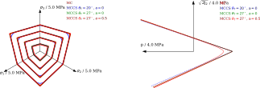

% Invariant-based implementation of the Mohr-Coulomb elasto-plastic model in OpenGeoSys using MFront
% Gentien Marois, Thomas Nagel, Dmitri Naumov, Thomas Helfer
% 1/08/2019

<!--
pandoc --filter pandoc-crossref --filter pandoc-citeproc --bibliography=bibliography.bib -fmarkdown+tex_math_single_backslash MohrCoulomb.md -o MohrCoulomb.pdf --toc --number-sections  -V geometry:margin=1in
-->

\newcommand{\tsigma}{\underline{\sigma}}
\newcommand{\paren}[1]{{\left(#1\right)}}
\newcommand{\trace}[1]{{\mathrm{tr}\paren{#1}}}
\newcommand{\dcdot}{\,:\,}
\newcommand{\tenseur}[1]{\underline{#1}}
\newcommand{\tenseurq}[1]{\underline{\underline{\mathbf{#1}}}}
\newcommand{\tepsilonto}{\tenseur{\varepsilon}^{\mathrm{to}}}
\newcommand{\tepsilonel}{\tenseur{\varepsilon}^{\mathrm{el}}}
\newcommand{\tepsilonvis}{\tenseur{\varepsilon}^{\mathrm{vis}}}
\newcommand{\tdepsilonvis}{\tenseur{\dot{\varepsilon}}^{\mathrm{vis}}}
\newcommand{\tepsilonp}{\tenseur{\varepsilon}^{\mathrm{p}}}
\newcommand{\tdepsilonp}{\tenseur{\dot{\varepsilon}}^{\mathrm{p}}}
\newcommand{\cancelto}[2]{\underbrace{#2}_{#1}}
\newcommand{\nn}{\nonumber}
\newcommand{\sigmaH}{\sigma_{H}}
\newcommand{\Frac}[2]{{{\displaystyle \frac{\displaystyle #1}{\displaystyle #2}}}}
\newcommand{\deriv}[2]{{\displaystyle \frac{\displaystyle \partial #1}{\displaystyle \partial #2}}}
\newcommand{\sderiv}[2]{{\displaystyle \frac{\displaystyle \partial^{2} #1}{\displaystyle \partial #2^{2}}}}
\newcommand{\dtot}{{{\mathrm{d}}}}
\newcommand{\bts}[1]{{\left.#1\right|_{t}}}
\newcommand{\mts}[1]{{\left.#1\right|_{t+\theta\,\Delta\,t}}}
\newcommand{\ets}[1]{{\left.#1\right|_{t+\Delta\,t}}}
\newcommand{\tns}[1]{{\underset{\tilde{}}{\mathbf{#1}}}}
\newcommand{\transpose}[1]{{#1^{\mathop{T}}}}

This page describes how to implement a non-associated plastic behaviour
based on the Mohr-Coulomb criterion. The algorithm mostly follows the
work of @Nagel2016 and relies on an apex smoothing introduced by @Abbo1995.

This implementation has been introduced in
[OpenGeoSys](https://www.opengeosys.org/), as illustrated below:

<iframe width="560" height="315" src="https://www.youtube.com/embed/juWMIkJ64iE" frameborder="0" allow="accelerometer; autoplay; encrypted-media; gyroscope; picture-in-picture" allowfullscreen>
</iframe>

This page shows:

- how to implement a plastic behaviour based on the third invariants of
  the stress tensor.
- how to simply the implementation by moving the evoluation of the
  stress criteria (and its first and second derivatives) in a seperate
  header file.
- how the implementation finally looks like once introduced in the
  [`StandardElastoViscoplasticity`
  brick](https://thelfer.github.io/tfel/web/StandardElastoViscoPlasticityBrick.html)

# Description of the behaviour

The behaviour is described by a standard decomposition of the strain
\(\tepsilonto\) in an elastic and a plastic component, respectively
denoted \(\tepsilonel\) and \(\tepsilonp\):

\[
\tepsilonto=\tepsilonel+\tepsilonp
\]

## Elastic behaviour

The stress \(\tsigma\) is related to the the elastic strain
\(\tepsilonel\) by a the orthotropic elastic stiffness
\(\tenseurq{D}\):

\[
\tsigma = \tenseurq{D}\,\colon\,\tepsilonel
\]

## Yield surface

The plastic part of the behaviour is described by the following yield
surface:
\[ F = 0 \]

F is defined as follow:

\[
	F = \frac{I_1}{3} \sin \phi + \sqrt{J_2 K(\theta)^2 + a^2 \sin^2 \phi} - c \cos \phi
\]{#eq:yield_function}
where 
\[
K(\theta) = \begin{cases}
	\cos \theta - \frac{1}{\sqrt{3}} \sin \phi \sin \theta & |\theta| < \theta_\mathrm{T}
	\\ 
	A + B \sin 3\theta  + C \sin^2 3 \theta &  |\theta| \geq \theta_\mathrm{T}
\end{cases}
\]{#eq:K_abbo}

\[
\begin{aligned}
	A &= - \frac{1}{\sqrt{3}} \sin \phi \mathrm{sign \theta} \sin \theta_\mathrm{T} - B \mathrm{sign \theta} \sin 3\,\theta_\mathrm{T} - C \sin^2 3\theta_\mathrm{T} + \cos \theta_\mathrm{T}\\
	%
	B &= \frac{\mathrm{sign \theta} \sin 6\theta_\mathrm{T} \left( \cos \theta_\mathrm{T} - \frac{1}{\sqrt{3}} \sin \phi \mathrm{sign \theta} \sin \theta_\mathrm{T} \right) - 6 \cos 6\theta_\mathrm{T} \left( \mathrm{sign \theta}  \sin \theta_\mathrm{T} + \frac{1}{\sqrt{3}} \sin \phi \cos \theta_\mathrm{T} \right) }{18 \cos^3 3 \theta_\mathrm{T}}\\
  %
  C &= \frac{-\cos 3 \theta_\mathrm{T} \left( \cos \theta_\mathrm{T} - \frac{1}{\sqrt{3}} \sin \phi \mathrm{sign \theta} \sin \theta_\mathrm{T} \right) - 3 \mathrm{sign \theta} \sin 3 \theta_\mathrm{T} \left( \mathrm{sign \theta}  \sin \theta_\mathrm{T} + \frac{1}{\sqrt{3}} \sin \phi \cos \theta_\mathrm{T} \right) }{18 \cos^3 3 \theta_\mathrm{T}}
\end{aligned}
\]{#eq:Sloan}

and 

\[
	I_1 = \trace{\tsigma} \qquad J_2 = \frac{1}{2} \tsigma^\mathrm{D} \dcdot \tsigma^\mathrm{D} \qquad J_3 = \det \tsigma^\mathrm{D} \qquad \theta = \frac{1}{3} \arcsin \left( -\frac{3\sqrt{3} J_3}{2 \sqrt{J_2^3}} \right)
\]

\(\tsigma^\mathrm{D}\), \(c\) and \(\phi\) are respectively the deviatoric part of the tensor \(\tsigma\), the cohesion and friction angle. 

--- 

The contribution of the smoothing is visualized in Figure @fig:mc_vis.

{#fig:mc_vis width=115%}

---

## Plastic potential

The plastic potential differs from the yield surface in order to more
accurately estimate dilatancy, but has an analogous structure:

\[
	G_\mathrm{F} = \frac{I_1}{3} \sin \psi + \sqrt{J_2 K_G^2 + a_G^2 \sin^2 \psi} - c \cos \psi
\]{#eq:plastic_potential}

where \(\psi\) is the dilatancy angle and

\[
	a_G = \frac{c}{\tan\psi} - \frac{c}{\tan\phi} + a
\]

\(K_G\), \(A_G\) and \(B_G\) follow
from @eq:K_abbo and @eq:Sloan by substituting the friction angle
with the dilatancy angle : 

\[
K_G(\theta) = \begin{cases}
	\cos \theta - \frac{1}{\sqrt{3}} \sin \psi \sin \theta & |\theta| < \theta_\mathrm{T}
	\\ 
	A_G + B_G \sin 3\theta  + C_G \sin^2 3 \theta &  |\theta| \geq \theta_\mathrm{T}
\end{cases}
\]

\[
\begin{aligned}
	A_G &= - \frac{1}{\sqrt{3}} \sin \psi \mathrm{sign \theta} \sin \theta_\mathrm{T} - B \mathrm{sign \theta} \sin 3\theta_\mathrm{T} - C \sin^2 3\theta_\mathrm{T} + \cos \theta_\mathrm{T}\\
	%
	B_G &= \frac{\mathrm{sign \theta} \sin 6\theta_\mathrm{T} \left( \cos \theta_\mathrm{T} - \frac{1}{\sqrt{3}} \sin \psi \mathrm{sign \theta} \sin \theta_\mathrm{T} \right) - 6 \cos 6\theta_\mathrm{T} \left( \mathrm{sign \theta}  \sin \theta_\mathrm{T} + \frac{1}{\sqrt{3}} \sin \psi \cos \theta_\mathrm{T} \right) }{18 \cos^3 3 \theta_\mathrm{T}}\\
  %
  C_G &= \frac{-\cos 3 \theta_\mathrm{T} \left( \cos \theta_\mathrm{T} - \frac{1}{\sqrt{3}} \sin \psi \mathrm{sign \theta} \sin \theta_\mathrm{T} \right) - 3 \mathrm{sign \theta} \sin 3 \theta_\mathrm{T} \left( \mathrm{sign \theta}  \sin \theta_\mathrm{T} + \frac{1}{\sqrt{3}} \sin \psi \cos \theta_\mathrm{T} \right) }{18 \cos^3 3 \theta_\mathrm{T}}
\end{aligned}
\]

This formulation allows the use of the `StandardElastoViscoplasticity` brick (see the last part).

## Plastic flow rule

Plastic flow follows in a general manner for a $I_1,\,J_2,\,\theta$-type yield surface as

\[
	\tenseur{n} = \frac{\partial G_{F}}{\partial I_1} \tenseur{I} + \left( \frac{\partial G_{F}}{\partial J_2} + \frac{\partial G_{F}}{\partial \theta} \frac{\partial \theta}{\partial J_2} \right) \tenseur{\sigma}^{D} +  \frac{\partial G_{F}}{\partial \theta}  \frac{\partial \theta}{\partial J_3} J_3 {(\tenseur{\sigma}^{D})}^{-1} \dcdot \tenseurq{P}^{D}
\]

or by use of the Caley-Hamilton theorem as

\[
	\tenseur{n} = \frac{\partial G_{F}}{\partial I_1} \tenseur{I} + \left( \frac{\partial G_{F}}{\partial J_2} + \frac{\partial G_{F}}{\partial \theta} \frac{\partial \theta}{\partial J_2} \right) \tenseur{\sigma}^{D} +  \frac{\partial G_{F}}{\partial \theta}  \frac{\partial \theta}{\partial J_3} (\tenseur{\sigma}^{D})^{2}\dcdot \tenseurq{P}^{D}
\]

# Integration algorithm

The previous constitutive equations will be integrated using a
standard implicit scheme.

## Plastic loading case

### Implicit system

Assuming a plastic loading, the system of equations to be solved is:
\[
\left\{
\begin{aligned}
	\Delta\,\tepsilonel-\Delta\,\tepsilonto+\Delta\,p\,\mts{\tenseur{n}} &= 0 \\
	 F &= 0 \\
\end{aligned}
\right.
\]

where \(\mts{X}\) is the value of \(X\) at \(t+\theta\,\Delta\,t\),
\(\theta\) being a numerical parameter. 

In the following, the first
(tensorial) equation is noted \(f_{\tepsilonel}\) and the second
(scalar) equation is noted \(f_{p}\).

In practice, it is physically sound to make satisfy exactly the yield
condition at the end of the time step (otherwise, stress extrapolation
can lead to stress state outside the yield surface and spurious
oscillations can also be observed). This leads to the choice
\(\theta=1\).

### Computation of the jacobian

The jacobian \(J\) of the implicit system can be decomposed by blocks:
\[
J=
\begin{pmatrix}
\deriv{f_{\tepsilonel}}{\Delta\,\tepsilonel} & \deriv{f_{\tepsilonel}}{\Delta\,p} & \\\\
\deriv{f_{p}}{\Delta\,\tepsilonel} & \deriv{f_{p}}{\Delta\,p} \\
\end{pmatrix}
\]{#eq:Jacobian}

The expression of the previous terms is given by:

\[
\left\{
\begin{aligned}
\deriv{f_{\tepsilonel}}{\Delta\,\tepsilonel} &= \tenseurq{I} + \Delta \lambda \frac{\partial \tenseur{n}}{\partial \Delta \tenseur{\epsilon}_{el}} \\
\deriv{f_{\tepsilonel}}{\Delta\,p} &= \tenseur{n} \\
\deriv{f_{p}}{\Delta\,\tepsilonel} &=  E^{-1} \tenseur{n}_F \dcdot \tenseurq{C}  \\
\deriv{f_{p}}{\Delta\,p}           &= 0 
\end{aligned}
\right.
\]

## Elastic loading case

Assuming an elastic loading, the system of equations to be solved is
trivially:
\[
\left\{
\begin{aligned}
	\Delta\,\tepsilonel-\Delta\,\tepsilonto &= 0 \\
	\Delta\,p &= 0 \\
\end{aligned}
\right.
\]

The jacobian associated with this system is the identity matrix.

# Implementation

## Choice of domain specific language

While not mandatory (the `@DSL` keyword can be place anywhere in the
file), its is convenient to start the implementation by declaring the
domain specific language to be used. For an integration by a
\(\theta\)-scheme, the `Implicit` domain specific language is choosen:

~~~~{.cxx}
@DSL Implicit;
~~~~

## Name of the behaviour

The `@Behaviour` keyword is used to give the name of the behaviour.

~~~~{.cxx}
@Behaviour MohrCoulombAbboSloan;
~~~~

## Metadata

The following instructions give some information about the author, the
date 

~~~~{.cxx}
@Author Thomas Nagel;
@Date 05/02/2019;
~~~~

## Name of the Algorithm of resolution

The `@Algorithm` keyword is used to give the name of the algorithm.

~~~~{.cxx}
@Algorithm NewtonRaphson;
~~~~

## Usage of the `StandardElasticity` brick

The implicit scheme used satisfies the requirements of the
`StandardElasticity` brick as described [here](BehaviourBricks.html).

The `StandardElasticity` brick which provides:

- Automatic computation of the stress tensor at various stages of the
  behaviour integration.
- Automatic computation of the consistent tangent operator.
- Automatic support for plane stress and generalized plane stress
  modelling hypotheses (The axial strain is defined as an additional
  state variable and the associated equation in the implicit system is
  added to enforce the plane stess condition).
- Automatic addition of the standard terms associated with the elastic
  strain state variable.
The usage of the `StandardElasticity` is introduced as follows:

~~~~{.cpp}
@Brick StandardElasticity;
~~~~

## Numerical parameters

The following instruction changes the default value of the stopping
criterion \(\epsilon\) used by the Newton-Raphson method  and the time integration scheme parameter \(\theta\) :

~~~~{.cxx}
@Theta 1.0;
@Epsilon 1.e-14;
~~~~

## Supported modelling hypothesis

Thanks to the `StandardElasticity` brick, all the modelling hypotheses
can be supported. The following statement, starting with the
`@ModellingHypotheses`, enables all the modelling hypotheses:

~~~~{.cpp}
@ModellingHypotheses {".+"};
~~~~

## RequireStiffnessTensor<Unaltered>

The `@RequireStiffnessTensor` keyword requires the stiffness tensor to
be computed by the calling code. This generally means that some extra
material properties will be introduced and handled by the interface
before the behaviour integration.

~~~~{.cpp}
@RequireStiffnessTensor<UnAltered>;
~~~~

## State variable

The `@StateVariable` keyword introduces the EquivalentPlasticStrain \(\lambda\).

~~~~{.cpp}
@StateVariable real lam;
lam.setGlossaryName("EquivalentPlasticStrain");
~~~~

## Material properties

The `@MaterialProperty` keyword introduces several properties, here:

- The cohesion c
- The friction angle \(\phi\) 
- The dilatancy angle \(\psi\)
- The transition angle \(\theta_T\)
- The tension cut-off control parameter a

~~~~{.cpp}
@MaterialProperty stress c;
c.setEntryName("Cohesion");
@MaterialProperty real phi;
phi.setEntryName("FrictionAngle");
@MaterialProperty real psi;
psi.setEntryName("DilatancyAngle");
@MaterialProperty real lodeT;
lodeT.setEntryName("TransitionAngle");
@MaterialProperty stress a;
a.setEntryName("TensionCutOffParameter");
~~~~

## Local variable

In `MFront`, an integration variable is defined to store a variable and
use it in various code block.

Here several local variables are declared such as the bolean variable F:
if true, plastic loading

~~~~{.cxx}
@LocalVariable Stensor np;
@LocalVariable bool F; // if true, plastic loading
@LocalVariable real sin_psi;
@LocalVariable real sin_phi;
@LocalVariable real cos_phi;
@LocalVariable real cos_lodeT;
@LocalVariable real sin_lodeT;
@LocalVariable real tan_lodeT;
@LocalVariable real cos_3_lodeT;
@LocalVariable real sin_3_lodeT;
@LocalVariable real cos_6_lodeT;
@LocalVariable real sin_6_lodeT;
@LocalVariable real tan_3_lodeT;
@LocalVariable real a_G;
~~~~

## Initialisation a the local variable

The `@InitLocalVariables` code block is called before the behaviour
integration. 

~~~~{.cxx}
@InitLocalVariables 
{
~~~~

First, we define some variables :

~~~~{.cxx}
  constexpr auto sqrt3 = Cste<real>::sqrt3;
  constexpr auto isqrt3 = Cste<real>::isqrt3;
  // conversion to rad
  phi *= pi / 180.;
  psi *= pi / 180.;
  lodeT *= pi / 180.;
  sin_psi = sin(psi);
  cos_phi = cos(phi);
  sin_phi = sin(phi);
  sin_lodeT = sin(lodeT);
  cos_lodeT = cos(lodeT);
  tan_lodeT = tan(lodeT);
  cos_3_lodeT = cos(3. * lodeT);
  sin_3_lodeT = sin(3. * lodeT);
  cos_6_lodeT = cos(6. * lodeT);
  sin_6_lodeT = sin(6. * lodeT);
  tan_3_lodeT = tan(3. * lodeT);
  a_G = (psi != 0. && phi != 0.) ? (c / tan(psi) - c / tan(phi) + a) : a;
~~~~

Then the  `computeElasticPrediction` method (introducted with the 
`StandardElasticity` brick) is used to compute \(\sigma^{el}\)

~~~~{.cxx}
  // elastic prediction
  const auto sig_el = computeElasticPrediction();
~~~~

The three invariant \(I_{1}^{el}\), \(J_{2}^{el}\) and \(J_{3}^{el}\) 
corresponding to the elastic prediction are calculated:

~~~~{.cxx}
  const auto s_el = deviator(sig_el);
  const auto I1_el = trace(sig_el);
  const auto J2_el = max((s_el | s_el) / 2., local_zero_tolerance);
  const auto J3_el = det(s_el);
~~~~

The \(\theta^{el}\) angle is defined:

~~~~{.cxx}
  const auto arg = min(max(-3. * sqrt3 * J3_el / (2. * J2_el * sqrt(J2_el)),
                           -1. + local_zero_tolerance),
                       1. - local_zero_tolerance);
  const auto lode_el = 1. / 3. * asin(arg);
~~~~

K is initiliazed as \(K^{el}\) value:

~~~~{.cxx} 
  auto K = 0.0;
  if (abs(lode_el) < lodeT) {
    K = cos(lode_el) - isqrt3 * sin_phi * sin(lode_el);
  } else {
    const auto sign =
        min(max(lode_el / max(abs(lode_el), local_zero_tolerance), -1.), 1.);
    const auto term1 = cos_lodeT - isqrt3 * sin_phi * sin_lodeT;
    const auto term2 = sign * sin_lodeT + isqrt3 * sin_phi * cos_lodeT;
    const auto term3 = 18. * cos_3_lodeT * cos_3_lodeT * cos_3_lodeT;
        
    const auto B = ( sign * sin_6_lodeT * term1 - 
      6. * cos_6_lodeT * term2 ) / term3; 
    const auto C = (- cos_3_lodeT * term1 - 3. * sign * sin_3_lodeT * term2) / term3; 
    
    const auto A =          
        -isqrt3 * sin_phi * sign * sin_lodeT - B * sign * sin_3_lodeT - 
        C * sin_3_lodeT*sin_3_lodeT + cos_lodeT;
    K = A + B * arg + C * arg*arg;
  }
~~~~

To finish \(F^{el}\) is calculated and the normal `np` is initialized.

~~~~{.cxx}
  const auto sMC =
      I1_el / 3 * sin_phi + sqrt(J2_el * K * K + a * a * sin_phi * sin_phi);
  F = sMC - c * cos_phi > 0.;
  np = Stensor(real(0));
~~~~

## Implicit system implementation

The implementation of the implicit system and its derivative is done in
the `@Integrator` code block:

~~~~{.cxx}
@Integrator{
~~~~

Some expressions are defined

~~~~{.cxx}
  constexpr auto sqrt3 = Cste<real>::sqrt3;
  constexpr auto isqrt3 = Cste<real>::isqrt3;
  constexpr auto id = Stensor::Id();
  constexpr auto id4 = Stensor4::Id();
~~~~

If there is no plasticity (elastic strain) there is no need for additional 
calculation because the various variables have already been initialized 
with elastic hypothesis. If there is plastic strain the rest is necessary.

~~~~{.cxx}
if (F) {
~~~~

\(K\) and \(\dfrac{\partial K}{\partial \theta}\) are computed:

~~~~{.cxx}
    const auto s = deviator(sig);
    const auto I1 = trace(sig);
    const auto J2 = max((s | s) / 2., local_zero_tolerance);
    const auto J3 = real(det(s) < 0. ? min(det(s), -local_zero_tolerance)
                                     : max(det(s), local_zero_tolerance));
    const auto arg = min(max(-3. * sqrt3 * J3 / (2. * J2 * sqrt(J2)),
                             -1. + local_zero_tolerance),
                         1. - local_zero_tolerance);
    const auto lode = 1. / 3. * asin(arg);
    const auto cos_lode = cos(lode);
    const auto sin_lode = sin(lode);
    const auto cos_3_lode = cos(3. * lode);
    const auto sin_6_lode = sin(6. * lode);
    const auto cos_6_lode = cos(6. * lode);
    const auto sin_3_lode = arg;
    const auto tan_3_lode = tan(3. * lode);
    auto K = 0.;
    auto dK_dlode = 1.;
    if (abs(lode) < lodeT) {
      K = cos_lode - isqrt3 * sin_phi * sin_lode;
      dK_dlode = -sin_lode - isqrt3 * sin_phi * cos_lode;
    } else {
      const auto sign =
          min(max(lode / max(abs(lode), local_zero_tolerance), -1.), 1.);
      const auto term1 = cos_lodeT - isqrt3 * sin_phi * sin_lodeT;
      const auto term2 = sign * sin_lodeT + isqrt3 * sin_phi * cos_lodeT;
      const auto term3 = 18. * cos_3_lodeT * cos_3_lodeT * cos_3_lodeT;
          
      const auto B = ( sign * sin_6_lodeT * term1 - 
        6. * cos_6_lodeT * term2 ) / term3; 
      const auto C = (- cos_3_lodeT * term1 - 3. * sign * sin_3_lodeT * term2) / term3; 
      
      const auto A =          
          -isqrt3 * sin_phi * sign * sin_lodeT - B * sign * sin_3_lodeT - 
          C * sin_3_lodeT*sin_3_lodeT + cos_lodeT;
      K = A + B * sin_3_lode + C * sin_3_lode*sin_3_lode;
          dK_dlode = 3. * B * cos_3_lode + 3. * C * sin_6_lode;
    }
~~~~

\(K_G\),  \(\dfrac{\partial K_G}{\partial \theta}\) and
 \(\dfrac{\partial^2 K_G}{\partial^2 \theta}\) are computed :

~~~~{.cxx}
    auto KG = 0.0; // move into a function to avoid code duplication
    auto dKG_dlode = 1.;
    auto dKG_ddlode = 1.;
    if (abs(lode) < lodeT) 
    {
      KG = cos_lode - isqrt3 * sin_psi * sin_lode;
      dKG_dlode = -sin_lode - isqrt3 * sin_psi * cos_lode;
      dKG_ddlode = -cos_lode + isqrt3 * sin_psi * sin_lode;
    } 
    else 
    {
      const auto sign =
          min(max(lode / max(abs(lode), local_zero_tolerance), -1.), 1.);
      const auto term1 = cos_lodeT - isqrt3 * sin_psi * sin_lodeT;
      const auto term2 = sign * sin_lodeT + isqrt3 * sin_psi * cos_lodeT;
      const auto term3 = 18. * cos_3_lodeT * cos_3_lodeT * cos_3_lodeT;
          
      const auto B = ( sign * sin_6_lodeT * term1 - 
        6. * cos_6_lodeT * term2 ) / term3; 
      const auto C = (- cos_3_lodeT * term1 - 3. * sign * sin_3_lodeT * term2) / term3; 
      
      const auto A =          
          -isqrt3 * sin_psi * sign * sin_lodeT - B * sign * sin_3_lodeT - 
          C * sin_3_lodeT*sin_3_lodeT + cos_lodeT;
          KG = A + B * sin_3_lode + C * sin_3_lode * sin_3_lode;
          dKG_dlode = 3. * B * cos_3_lode + 3. * C * sin_6_lode;
          dKG_ddlode = -9. * B * sin_3_lode + 18. * C * cos_6_lode;
    }
~~~~
 
The flow direction is computed :

~~~~{.cxx}
    // flow direction
    const auto dev_s_squared = computeJ3Derivative(
        sig); // replaces dev_s_squared = deviator(square(s));
    const auto dG_dI1 = sin_psi / 3.;
    const auto root = max(sqrt(J2 * KG * KG + a_G * a_G * sin_psi * sin_psi),
                          local_zero_tolerance);
    const auto dG_dJ2 = KG / (2. * root) * (KG - tan_3_lode * dKG_dlode);
    const auto dG_dJ3 = J2 * KG * tan_3_lode / (3. * J3 * root) * dKG_dlode;
    const auto n = eval(dG_dI1 * id + dG_dJ2 * s + dG_dJ3 * dev_s_squared);
~~~~

The yield function `F` is computed:

~~~~{.cxx}
    // yield function
    const auto rootF = max(sqrt(J2 * K * K + a * a * sin_phi * sin_phi), local_zero_tolerance);

    const auto Fy1 = I1 * sin_phi / 3 + rootF;
    const auto Fy =  Fy1 - c * cos_phi;
~~~~
 
Derivatives are calculated before computing the Jacobian matrix:

\(\dfrac{\partial F}{\partial I_1}\), \(\dfrac{\partial F}{\partial J_2}\),
\(\dfrac{\partial F}{\partial J_3}\), \(n_F\),
\(\dfrac{\partial G}{\partial \theta}\), \(\dfrac{\partial^2 G}{\partial^2 \theta}\)
\(\dfrac{\partial^2 G}{\partial \theta \partial J_2}\),
\(\dfrac{\partial^2 G}{\partial^2 J_2}\), \(\dfrac{\partial^2 G}{\partial^2 J_3}\), 
\(\dfrac{\partial ^2G}{\partial J_2 \partial J_3}\)

~~~~{.cxx}
    // yield function derivative for Jacobian
    const auto dF_dI1 = sin_phi / 3.;
    const auto dF_dJ2 = K / (2. * rootF) * (K - tan_3_lode * dK_dlode);
    const auto dF_dJ3 = J2 * K * tan_3_lode / (3. * J3 * rootF) * dK_dlode;
    const auto nF = eval(dF_dI1 * id + dF_dJ2 * s + dF_dJ3 * dev_s_squared);

    // building dfeel_ddeel
    const auto Pdev = id4 - (id ^ id) / 3;

    const auto dG_dlode = KG * J2 / (root)*dKG_dlode;
    const auto dG_ddlode =
        J2 / root * (dKG_dlode * dKG_dlode * (1. - J2 * KG * KG / (root * root)) + KG * dKG_ddlode);
    const auto dG_ddlodeJ2 = KG / root * dKG_dlode * (1. - J2 * KG * KG / (2 * root * root));
    const auto dG_ddJ2 =
        -KG * KG * KG * KG / (4. * root * root * root) + dG_dlode * tan_3_lode / (2 * J2 * J2) -
        tan_3_lode / (2 * J2) * (2 * dG_ddlodeJ2 - tan_3_lode / (2 * J2) * dG_ddlode -
                                 3 / (2 * J2 * cos_3_lode * cos_3_lode) * dG_dlode);
    const auto dG_ddJ3 = -tan_3_lode / (3 * J3 * J3) * dG_dlode +
                         tan_3_lode / (3 * J3) * (dG_ddlode * tan_3_lode / (3 * J3) +
                                                  dG_dlode * 1. / (J3 * cos_3_lode * cos_3_lode));
    const auto dG_ddJ2J3 = dG_ddlodeJ2 * tan_3_lode / (3 * J3) -
                           tan_3_lode / (2 * J2) * (dG_ddlode * tan_3_lode / (3 * J3) +
                                                    dG_dlode * 1. / (J3 * cos_3_lode * cos_3_lode));
~~~~

\(f^{el}\), \(\dfrac{\partial f^{el}}{\partial \Delta\,\tepsilonel}\),
\(\dfrac{\partial f^{el}}{\partial \Delta\,\lambda}\) are computed:

~~~~{.cxx}
    // elasticity
    feel += dlam * n;
    dfeel_ddeel += theta * dlam * (dG_dJ2 * Pdev + dG_dJ3 * computeJ3SecondDerivative(sig) +
                                   dG_ddJ2 * (s ^ s) + dG_ddJ3 * (dev_s_squared ^ dev_s_squared) +
                                   dG_ddJ2J3 * ((dev_s_squared ^ s) + (s ^ dev_s_squared))) *
                   D;
    dfeel_ddlam = n;
~~~~

These equations are equivalent to:

\[
\begin{aligned}
  & f^{el} = \Delta\,\tepsilonel - \Delta\,\tepsilonto\ + \Delta\,\lambda\,\tenseur{n} = 0  \\
  & \dfrac{\partial f^{el}}{\partial \Delta\,\tepsilonel} = 
  1 + \Delta \lambda \frac{\partial \tenseur{n}}{\partial \Delta \tepsilonel} =
  1 + \Delta \lambda \frac{\partial \tenseur{n}}{\partial \tenseur{\sigma}} 
  \frac{\partial \tenseur{\sigma}}{\partial \Delta \tepsilonel} \, \\
  & \dfrac{\partial f^{el}}{\partial \Delta\,\lambda} = \tenseur{n}
\end{aligned}
\]

because this implementation takes into account the fact that the `Implicit` DSL
automatically initializes `feel` to the current estimation of
\(\Delta\,\tepsilonel\) and the Jacobian to identity. 
Moreover, the `StandardElasticity` brick automatically subtracts 
\(\Delta\,\tepsilonto\) to `feel`. 

And to finish \(f^{\lambda}\), \(\dfrac{\partial f^{\lambda}}{\partial \Delta\,\lambda}\),
\(\dfrac{\partial f^{\lambda}}{\partial \Delta\,\tepsilonel}\) are computed:

~~~~{.cxx}
    // plasticity
    flam = Fy / D(0, 0);
    dflam_ddlam = strain(0);
    dflam_ddeel = theta * (nF | D) / D(0, 0);
    np = n;
~~~~

The Jacobian can now be computed (see @Eq:Jacobian) 

# Verification

 when approached on different stress paths (purple)"){#fig:MC_stress_paths width=90%}

The yield function was approached along different stress paths, shown in
Figure @fig:MC_stress_paths within the \(\pi\)-plane. This shows that
a) yield is correctly detected, and b) the stress-state is correctly
pulled back onto the yield surface.

{#fig:MC_vis width=125%}

The second test (included as a benchmark) follows an analytical solution
for a stress-free cavity in an infinite medium under a variable
far-field stress. The solution computes stress- and displacement fields
as well as the location of the plastified zone. It has been used in
@Nagel2016 where the test is described in more detail (with a
partial extension towards non-associated flow).

# Simplification of the MFront file : use of `TFEL/Material/MohrCoulombYieldCriterion.hxx` file

Because F et G have an analogous structure, it's possible to simplify the MFront file
and to do the calculation in the hxx `TFEL/Material/MohrCoulombYieldCriterion.hxx`
instead of the MFront file.

Severals simplifications are done:

- parameters and local variables such as `sin_phi`, `sin_psi`, ... are now defined in the hxx file
- the calculation of \(F^{el}\) is done by `computeMohrCoulombStressCriterion` function
- the calculation of \(F\) and this normal \(\tenseur{n}_{F}\) are done by 
`computeMohrCoulombStressCriterionNormal` function 
- the calculation of  \(G\), \(\tenseur{n}_{G}\) and \( \dfrac{\partial \tenseur{n}_{G}}{\partial \tenseur{\sigma}} \) 
are done by `computeMohrCoulombStressCriterionSecondDerivative` function

Except for some name changes (for example p instead lam for the
EquivalentPlasticStrain) and the functions previously introduced
(`computeMohrCoulombStressCriterion`,`computeMohrCoulombStressCriterionNormal`
and `computeMohrCoulombStressCriterionSecondDerivative`) the rest of the
MFront file is identical to that described above in the section
`Implementation`).

The new MFront file is however much shorter and clearer:

~~~~{.cxx}
@DSL Implicit;
@Behaviour MohrCoulombAbboSloan;
@Author Thomas Nagel;
@Date 05 / 02 / 2019;

@Algorithm NewtonRaphson;

@Brick StandardElasticity;

@Includes{
#include "TFEL/Material/MohrCoulombYieldCriterion.hxx"
}

@Theta 1.0;     // time integration scheme
@Epsilon 1e-14; // tolerance of local stress integration algorithm
@ModellingHypotheses{".+"};

@RequireStiffnessTensor<UnAltered>;
@Parameter pi = 3.14159265359;

@StateVariable real p;
p.setGlossaryName("EquivalentPlasticStrain");

@MaterialProperty stress c;
c.setEntryName("Cohesion");
@MaterialProperty real phi;
phi.setEntryName("FrictionAngle");
@MaterialProperty real psi;
psi.setEntryName("DilatancyAngle");
@MaterialProperty real lodeT;
lodeT.setEntryName("TransitionAngle");
@MaterialProperty stress a;
a.setEntryName("TensionCutOffParameter");

@LocalVariable Stensor ngp;

@LocalVariable bool F; // if true, plastic loading
@LocalVariable MohrCoulombParameters<StressStensor> pf;
@LocalVariable MohrCoulombParameters<StressStensor> pg;
@LocalVariable real a_G;

@InitLocalVariables {
  a_G = (psi != 0. && phi != 0.) ? c / tan((psi*pi)/180) - c / tan((phi*pi)/180) + a : a;
  constexpr const auto u = MohrCoulombParameters<StressStensor>::DEGREE;
  pf = makeMohrCoulombParameters<StressStensor, u>(c, phi, lodeT, a);
  pg = makeMohrCoulombParameters<StressStensor, u>(c, psi, lodeT, a_G);
  const auto sel = computeElasticPrediction();
  const auto smc = computeMohrCoulombStressCriterion(pf, sel);
  F = smc > stress(0);
  ngp = Stensor(real(0));
}

@Integrator {
  if (F) {
    // in C++11:
    auto Fy = stress{};
    auto nf = Stensor{};
    auto Fg = stress{};
    auto ng = Stensor{};
    auto dng = Stensor4{};
    std::tie(Fy, nf) = computeMohrCoulombStressCriterionNormal(pf, sig);
    std::tie(Fg, ng, dng) = computeMohrCoulombStressCriterionSecondDerivative(pg, sig);
    // elasticity
    feel += dp * ng;
    dfeel_ddeel += theta * dp * dng * D;
    dfeel_ddp = ng;
    // plasticity
    fp = Fy / D(0, 0);
    dfp_ddp = strain(0);
    dfp_ddeel = theta * (nf | D) / D(0, 0);
    ngp = ng;
  }
}
~~~~

# Simplification of the MFront file : use of the `StandardElastoViscoPlasticity` brick

The Mohr-Coulomb model has been introduced in the `StandardElastoViscoPlasticity` brick. 

The `MFront` file is then very short: the whole model is contained in
the brick and can be called by the keyword `MohrCoulomb`

The MFront file is now:

~~~~{.cxx}
@DSL Implicit;

@Behaviour MohrCoulomAbboSloan3;
@Author HELFER Thomas 202608;
@Date 10 / 12 / 2019;
@Description {
}

@Algorithm NewtonRaphson;
@Epsilon 1.e-14;
@Theta 1;

@Brick StandardElastoViscoPlasticity{
  stress_potential : "Hooke" {
    young_modulus : 150.e3,
    poisson_ratio : 0.3
  },
  inelastic_flow : "Plastic" {
    criterion : "MohrCoulomb" {
      c : 3.e1,      // cohesion
      phi : 0.523598775598299,    // friction angle or dilatancy angle
      lodeT : 0.506145483078356,  // transition angle as defined by Abbo and Sloan
      a : 1e1       // tension cuff-off parameter
    },
    flow_criterion : "MohrCoulomb" {
      c : 3.e1,      // cohesion
      phi : 0.174532925199433,    // friction angle or dilatancy angle
      lodeT : 0.506145483078356,  // transition angle as defined by Abbo and Sloan
      a : 3e1       // tension cuff-off parameter
    },
    isotropic_hardening : "Linear" {R0 : "0"}
  }
};
~~~~

# References

<!--
# Appendix 1

Alternative formulation using the Caley-Hamilton theorem:
\[
	\tenseur{A}^3 - I_1 \tenseur{A}^2 + I_2 \tenseur{A} - I_3 \tenseur{I} = \tenseur{0}
\]

Taking the trace and subsequently the derivative w.r.t. \(\tenseur{A}\)
yields:
\[
	I_{3,\tenseur{A}} = \tenseur{A}^2 + I_2 \tenseur{I} - I_1 \tenseur{A}
\]

For the deviator we have \(I_2(\tsigma^\mathrm{D}) = -J_2\) and
\(I_1(\tsigma^\mathrm{D})=0\) and thus write:
\[
	\frac{\partial J_3}{\partial \tsigma^\mathrm{D}} = J_3 (\tsigma^\mathrm{D})^{-1} = (\tsigma^\mathrm{D})^{2} - J_2 \tenseur{I}
\]

Furthermore,
\[
\frac{\partial J_3}{\partial \tsigma} = \left[(\tsigma^\mathrm{D})^{2} - J_2 \tenseur{I} \right] \dcdot \tenseurq{P}^\mathrm{D} = (\tsigma^\mathrm{D})^{2} \dcdot \tenseurq{P}^\mathrm{D}
\]

Therefore, 
\[
	\tenseur{n} = \frac{\partial G_\mathrm{F}}{\partial I_1} \tenseur{I} + \left( \frac{\partial G_\mathrm{F}}{\partial J_2} + \frac{\partial G_\mathrm{F}}{\partial \theta} \frac{\partial \theta}{\partial J_2} \right) \tsigma^\mathrm{D} +  \frac{\partial G_\mathrm{F}}{\partial \theta}  \frac{\partial \theta}{\partial J_3} J_3 {(\tsigma^{\mathrm{D}})}^{-1} \dcdot \tenseurq{P}^\mathrm{D}
\]
or
\[
	\tenseur{n} = \frac{\partial G_\mathrm{F}}{\partial I_1} \tenseur{I} + \left( \frac{\partial G_\mathrm{F}}{\partial J_2} + \frac{\partial G_\mathrm{F}}{\partial \theta} \frac{\partial \theta}{\partial J_2} \right) \tsigma^\mathrm{D} +  \frac{\partial G_\mathrm{F}}{\partial \theta}  \frac{\partial \theta}{\partial J_3} (\tsigma^\mathrm{D})^{2}\dcdot \tenseurq{P}^\mathrm{D}
\]

with the material-independent derivatives:

\[
\begin{aligned}
	\left. \frac{\partial \theta}{\partial J_2} \right|_{J_3} &= -\frac{\tan 3\theta}{2J_2}
	\\
	\left. \frac{\partial \theta}{\partial J_3} \right|_{J_2} &= \frac{\tan 3\theta}{3J_3}
\end{aligned}
\]

and the material-dependent derivatives
\[
\begin{aligned}
	\left. \frac{\partial G_\mathrm{F}}{\partial I_1} \right|_{J_2,J_3} &= \frac{1}{3} \sin \psi
	\\
	\left. \frac{\partial G_\mathrm{F}}{\partial J_2} \right|_{I_1,\theta} &= 
	\frac{K'^2}{2\sqrt{J_2 K_G^2 + a_G^2 \sin^2 \psi}}
	\\
	\left. \frac{\partial G_\mathrm{F}}{\partial \theta} \right|_{I_1,J_2} &= 
	\frac{J_2 K_G}{\sqrt{J_2 K_G^2 + a_G^2 \sin^2 \psi}} \frac{\partial K_G}{\partial \theta}
	\\
	\frac{\partial K}{\partial \theta} &= \begin{cases}
	-\sin \theta - \frac{1}{\sqrt{3}}\sin \phi \cos\theta & |\theta| < \theta_\mathrm{T}
	\\ 
	-3B\cos3\theta
\end{cases}
\end{aligned}
\]

The following combined entries are useful:
\[
\begin{aligned}
	\frac{\partial G_\mathrm{F}}{\partial \theta}\frac{\partial \theta}{\partial J_2} &= -\frac{K_G\tan 3\theta}{2\sqrt{J_2 K_G^2 + a_G^2 \sin^2 \psi}} \frac{\partial K_G}{\partial \theta} 
\end{aligned}
\]

Thus,
\[
\begin{aligned}
	\left. \frac{\partial G_\mathrm{F}}{\partial I_1} \right|_{J_2,J_3} &= \frac{1}{3} \sin \psi
	\\
	\left.\frac{\partial G_\mathrm{F}}{\partial J_2}\right|_{I_1,J_3} &= 
	\frac{K_G}{2\sqrt{J_2 K_G^2 + a_G^2 \sin^2 \psi}} \left(K_G - \tan 3\theta \frac{\partial K_G}{\partial \theta} \right)
	\\
	\left.\frac{\partial G_\mathrm{F}}{\partial J_3}\right|_{I_1,J_2} &= \frac{J_2K_G\tan 3\theta}{3J_3\sqrt{J_2 K_G^2 + a_G^2 \sin^2 \psi}} \frac{\partial K_G}{\partial \theta}
\end{aligned}
\]

so that:
\[
	\tenseur{n} = \frac{\partial G_\mathrm{F}}{\partial I_1} \tenseur{I} + \left.\frac{\partial G_\mathrm{F}}{\partial J_2}\right|_{I_1,J_3} \tsigma^\mathrm{D} +  \left.\frac{\partial G_\mathrm{F}}{\partial J_3}\right|_{I_1,J_2} (\tsigma^{\mathrm{D}})^{2} \dcdot \tenseurq{P}^\mathrm{D}
\]

# Linearization of flow rule

\[
\begin{split}
	\frac{\partial \tenseur{n}}{\partial \tsigma} &= \left.\frac{\partial G_\mathrm{F}}{\partial J_2}\right|_{I_1,J_3} \tenseurq{P}^\mathrm{D} + \left.\frac{\partial G_\mathrm{F}}{\partial J_3}\right|_{I_1,J_2} \tenseurq{P}^\mathrm{D} \dcdot \left[ \left( \tenseur{I} \otimes \tsigma^\mathrm{D} \right)^{\overset{23}{\mathrm{T}}} + \left(  \tsigma^\mathrm{D} \otimes \tenseur{I}\right)^{\overset{23}{\mathrm{T}}}\right] \dcdot \tenseurq{P}^\mathrm{D} \\
	&+ \left.\frac{\partial^2 G_\mathrm{F}}{\partial J_2^2} \right|_{J_3} \tsigma^\mathrm{D} \otimes \tsigma^\mathrm{D} + \left. \frac{\partial^2 G_\mathrm{F}}{\partial J_3^2} \right|_{J_2} \left[{(\tsigma^{\mathrm{D}})}^{2} \dcdot \tenseurq{P}^\mathrm{D} \otimes  {(\tsigma^{\mathrm{D}})}^{2} \dcdot \tenseurq{P}^\mathrm{D} \right] \\
	&+ \frac{\partial}{\partial J_2}\left[ \left. \frac{\partial G_\mathrm{F}}{\partial J_3} \right|_{J_2} \right]_{J_3}  \left[ \tsigma^\mathrm{D} \otimes {(\tsigma^{\mathrm{D}})}^{2} \dcdot \tenseurq{P}^\mathrm{D} + {(\tsigma^{\mathrm{D}})}^{2} \dcdot \tenseurq{P}^\mathrm{D} \otimes \tsigma^{\mathrm{D}} \right]
\end{split}
\]

We further require the derivatives:
\[
\begin{aligned}
	\left.\frac{\partial^2 G_\mathrm{F}}{\partial J_2^2} \right|_{J_3} &= \left. \frac{\partial}{\partial J_2}\right|_\theta \left.\frac{\partial G_\mathrm{F}}{\partial J_2}\right|_{I_1,J_3} + \left. \frac{\partial}{\partial \theta} \right|_{J_2} \left.\frac{\partial G_\mathrm{F}}{\partial J_2}\right|_{I_1,J_3} \frac{\partial \theta}{\partial J_2}
	\\
	&= \frac{\partial^2 G_\mathrm{F}}{\partial^2 J_2^2} + \frac{\partial^2 G_\mathrm{F}}{\partial J_2 \partial \theta} \frac{\partial \theta}{\partial J_2} + \frac{\partial G_\mathrm{F}}{\partial \theta} \frac{\partial^2 \theta}{\partial J_2^2} \\
	&+\frac{\partial \theta}{\partial J_2} \left(\frac{\partial^2 G_\mathrm{F}}{\partial J_2 \partial \theta} + \frac{\partial^2 G_\mathrm{F}}{\partial \theta^2} \frac{\partial \theta}{\partial J_2} + \frac{\partial G_\mathrm{F}}{\partial \theta} \frac{\partial^2 \theta}{\partial J_2 \partial \theta}\right)
	\\
	&= \frac{\partial^2 G_\mathrm{F}}{\partial^2 J_2^2} +  \frac{\partial G_\mathrm{F}}{\partial \theta} \frac{\partial^2 \theta}{\partial J_2^2}
	\\
	&+\frac{\partial \theta}{\partial J_2} \left(2\frac{\partial^2 G_\mathrm{F}}{\partial J_2 \partial \theta} + \frac{\partial^2 G_\mathrm{F}}{\partial \theta^2} \frac{\partial \theta}{\partial J_2} + \frac{\partial G_\mathrm{F}}{\partial \theta} \frac{\partial^2 \theta}{\partial J_2 \partial \theta}\right)
	\\
	\\
	\left. \frac{\partial^2 G_\mathrm{F}}{\partial J_3^2} \right|_{J_2} &= \left. \frac{\partial}{\partial J_3} \right|_\theta \left.\frac{\partial G_\mathrm{F}}{\partial J_3}\right|_{I_1,J_2} + \left. \frac{\partial}{\partial \theta} \right|_{J_3} \left.\frac{\partial G_\mathrm{F}}{\partial J_3}\right|_{I_1,J_2} \frac{\partial \theta}{\partial J_3}
	\\
	&= \cancelto{0}{\frac{\partial^2 G_\mathrm{F}}{\partial \theta \partial J_3}}\frac{\partial \theta}{\partial J_3} + \frac{\partial G_\mathrm{F}}{\partial \theta} \frac{\partial^2 \theta}{\partial J_3^2} 
	\\
	&+\frac{\partial \theta}{\partial J_3} \left(\frac{\partial^2 G_\mathrm{F}}{\partial \theta^2}\frac{\partial \theta}{\partial J_3} + \frac{\partial G_\mathrm{F}}{\partial \theta}\frac{\partial^2 \theta}{\partial J_3 \partial \theta} \right)
	\\
	&= \frac{\partial G_\mathrm{F}}{\partial \theta} \frac{\partial^2 \theta}{\partial J_3^2} +\frac{\partial \theta}{\partial J_3} \left(\frac{\partial^2 G_\mathrm{F}}{\partial \theta^2}\frac{\partial \theta}{\partial J_3} + \frac{\partial G_\mathrm{F}}{\partial \theta}\frac{\partial^2 \theta}{\partial J_3 \partial \theta} \right)
	\\
	\\
	\frac{\partial}{\partial J_2}\left[ \left. \frac{\partial G_\mathrm{F}}{\partial J_3} \right|_{J_2} \right]_{J_3}  &= \left. \frac{\partial}{\partial J_2} \right|_\theta \left.\frac{\partial G_\mathrm{F}}{\partial J_3}\right|_{I_1,J_2} + \left. \frac{\partial}{\partial \theta} \right|_{J_2} \left.\frac{\partial G_\mathrm{F}}{\partial J_3}\right|_{I_1,J_2} \frac{\partial \theta}{\partial J_2}
	\\
	&= \frac{\partial^2 G_\mathrm{F}}{\partial J_2 \partial \theta}\frac{\partial \theta}{\partial J_3} + \frac{\partial G_\mathrm{F}}{\partial \theta}\cancelto{0}{\frac{\partial^2 \theta}{\partial J_3 \partial J_2}} 
	\\
	&+ \frac{\partial \theta}{\partial J_2} \left( \frac{\partial^2 G_\mathrm{F}}{\partial \theta^2} \frac{\partial \theta}{\partial J_3} + \frac{\partial G_\mathrm{F}}{\partial \theta} \frac{\partial^2 \theta}{\partial J_3 \partial \theta} \right)
	\\
	&=\frac{\partial^2 G_\mathrm{F}}{\partial J_2 \partial \theta}\frac{\partial \theta}{\partial J_3} + \frac{\partial \theta}{\partial J_2} \left( \frac{\partial^2 G_\mathrm{F}}{\partial \theta^2} \frac{\partial \theta}{\partial J_3} + \frac{\partial G_\mathrm{F}}{\partial \theta} \frac{\partial^2 \theta}{\partial J_3 \partial \theta} \right)
\end{aligned}
\]

Material-independent derivatives:
\[
\begin{aligned}
	\left. \frac{\partial^2 \theta}{\partial J_2^2} \right|_\theta &= \frac{\tan 3\theta}{2J_2^2}
	\\
	\left. \frac{\partial^2 \theta}{\partial J_3^2} \right|_\theta &= -\frac{\tan 3\theta}{3J_3^2}
	\\
	\frac{\partial^2 \theta}{\partial J_2 \partial \theta} &= - \frac{3}{2J_2 \cos^2 3\theta}
	\\
	\frac{\partial^2 \theta}{\partial J_3 \partial \theta} &= \frac{1}{J_3 \cos^2 3\theta}
\end{aligned}
\]

Material-dependent derivatives:
\[
\begin{aligned}
	\frac{\partial^2 G_\mathrm{F}}{\partial J_2^2} &= 
	-\frac{K_G^4}{4\sqrt{(J_2 K_G^2 + a_G^2 \sin^2 \psi)^3}}
	\\
	\frac{\partial^2 G_\mathrm{F}}{\partial \theta^2} &= 
	\left( \frac{J_2}{\sqrt{J_2 K_G^2 + a_G^2 \sin^2 \psi}} - \frac{J_2^2 K_G^2}{\sqrt{(J_2 K_G^2 + a_G^2 \sin^2 \psi)^3}} \right)\left(\frac{\partial K_G}{\partial \theta}\right)^2 \\
	&+  \frac{J_2K_G}{\sqrt{J_2 K_G^2 + a_G^2 \sin^2 \psi}} \frac{\partial^2 K_G}{\partial \theta^2}  
\\
	&=  \frac{J_2}{\sqrt{J_2 K_G^2 + a_G^2 \sin^2 \psi}} \left[\left(\frac{\partial K_G}{\partial \theta}\right)^2 \left(1 - \frac{J_2K_G^2}{J_2 K_G^2 + a_G^2 \sin^2 \psi} \right) + K_G \frac{\partial^2 K_G}{\partial \theta^2}  \right]
	\\
	\frac{\partial^2 G_\mathrm{F}}{\partial J_2 \partial \theta} &= 
	\left( \frac{K_G}{\sqrt{J_2 K_G^2 + a_G^2 \sin^2 \psi}} - \frac{J_2 K_G^3}{2\sqrt{(J_2 K_G^2 + a_G^2 \sin^2 \psi)^3}} \right)\frac{\partial K_G}{\partial \theta}
	\\
	&=\frac{K_G}{\sqrt{J_2 K_G^2 + a_G^2 \sin^2 \psi}}\frac{\partial K_G}{\partial \theta}\left( 1 - \frac{J_2 K_G^2}{2(J_2 K_G^2 + a_G^2 \sin^2 \psi)} \right)
	\\
	\frac{\partial^2 K}{\partial \theta^2} &= \begin{cases}
	-\cos \theta + \frac{1}{\sqrt{3}}\sin \phi \sin\theta & |\theta| < \theta_\mathrm{T}
	\\ 
	9B\sin3\theta
\end{cases}
\end{aligned}
\]

Jacobian is here (non-associated!)
\[
\tenseur{J} = 
\begin{pmatrix}
    \tenseurq{I} + \Delta \lambda \dfrac{\partial \tenseur{n}}{\partial \Delta \tepsilonel} & \tenseur{n} \\
    E^{-1}\tenseur{n}_F \dcdot \tenseurq{C} & 0
\end{pmatrix}
\]{#eq:Jacobian}
-->
