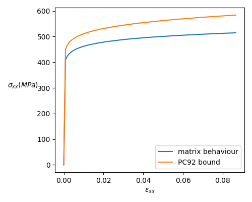

\newcommand{\tenseur}[1]{\underline{#1}}
\newcommand{\tenseurq}[1]{\underline{\mathbf{#1}}}
\newcommand{\tns}[1]{\underset{\tilde{}}{\mathbf{#1}}}
\newcommand{\transpose}[1]{#1^{\mathop{T}}}

\newcommand{\tsigma}{\tenseur{\sigma}}
\newcommand{\dbldot}{:}
\newcommand{\tepsilon}{\tenseur{\varepsilon}}
\newcommand{\te}{\tenseurq{e}}
\newcommand{\sigmaeq}{\sigma_{\mathrm{eq}}}
\newcommand{\epsiloneq}{\varepsilon_{\mathrm{eq}}}

\newcommand{\tepsilonto}{\underline{\epsilon}^{\mathrm{to}}}
\newcommand{\tepsilonel}{\underline{\epsilon}^{\mathrm{el}}}

\newcommand{\trace}[1]{\mathrm{tr}\paren{#1}}
\newcommand{\Frac}[2]{{\displaystyle \frac{\displaystyle #1}{\displaystyle #2}}}
\newcommand{\deriv}[2]{{\displaystyle \frac{\displaystyle \partial #1}{\displaystyle \partial #2}}}
\newcommand{\derivdeux}[2]{{\displaystyle \frac{\displaystyle \partial^2 #1}{\displaystyle \partial #2^2}}}
\newcommand{\dtot}{{\mathrm{d}}}
\newcommand{\paren}[1]{\left(#1\right)}
\newcommand{\nom}[1]{\textsc{#1}}

We present here an implementation of Ponte-Castaneda variational bound in non-linear elasticity [@castaneda_new_1992].
It deals with the homogenization of a composite made of a matrix and spherical inclusions. The two phases have
a non-linear elastic behaviour.
The variational bound from Ponte-Castaneda is based on the computation of
the strain second-moments.

This tutorial first recalls the scheme, and presents the implementation.

# Ponte-Castaneda variational bound

## The non-linear homogenization problem

The variational approach used by Ponte-Castaneda is based on the elastic potential $w$ which is of the form:
\begin{aligned}
    w(\tepsilon)= \sum_{r=1}^{N}\chi_r\,w_r (\tepsilon)
  \end{aligned}
where $N$ is the number of phases and $\chi_r$ is characteristic function of phase $r$.

The local potential $w_r$ is a non-linear function of the strain $\tepsilon$, but here we focus on potentials of the form
 \begin{aligned}
  w_r(\tepsilon)=\Frac92 k_r\, \varepsilon_m^2+f_r (\epsiloneq^2)
  \end{aligned}
  where
\begin{aligned}
    \epsiloneq= \sqrt{\Frac23\tepsilon^d\dbldot\tepsilon^d}\qquad\text{where}\quad \tepsilon^d = \tepsilon - \Frac13 \trace{\tepsilon}\tenseur{1} \qquad\text{and}\quad \varepsilon_m=\Frac13 \trace{\tepsilon}
  \end{aligned}
 
In the variational approach, the homogenization problem is equivalent to a minimization problem:
\begin{aligned}
    \tepsilon=\underset{\tepsilon\in\mathcal K(\overline{\tepsilon})}{\textrm{argmin}} \langle w(\tepsilon)\rangle
  \end{aligned}
  where the space of kinematically admissible fields $\mathcal K(\overline{\tepsilon})$ is introduced depending on the boundary conditions used, and it makes intervene the loading $\overline{\tepsilon}$ (which will be our total strain $\texttt{eto}$). The $\langle.\rangle$ denotes the average on the representative volume element.
  
## The variational bound

Ponte-Castaneda's idea is to use the dual function $f_r^*$ of $f_r$, under an hypothesis of concavity of $f_r$. Note that $w_r$ is convex relatively to $\tepsilon$, but the hypothesis is: $f_r$ concave relatively to $\epsiloneq^2$, which adds a supplementary restriction to the behaviour.
\begin{aligned}
    w_r(\tepsilon)=\underset{\mu_0^r(\tenseur x)}{\min} \left\{\Frac92 k_r\, \varepsilon_m^2+\Frac32 \mu_0^r(\tenseur x)\, \epsiloneq^2-f_r^*(\mu_0^r(\tenseur x))\right\}
  \end{aligned}
  where the dual function $f_r^*$ is defined as
  \begin{aligned}
    f_r^*(\mu_0)=\underset{e}{\min} \left\{\mu_0 e-f_r(e)\right\}
  \end{aligned}
  
Considering uniform per phase shear moduli $\mu_0^r$ (also called the 'secant moduli'), and after a few manipulations, Ponte-Castaneda arrives at the following bound on the effective energy $W^{\mathrm{eff}}(\overline{\tepsilon})$:
\begin{aligned}
    W^{\mathrm{eff}}(\overline{\tepsilon})=\underset{\tepsilon\in\mathcal K(\overline{\tepsilon})}{\textrm{min}} \langle w(\tepsilon)\rangle \leq \overline{w}(\overline{\tepsilon})=\underset{\mu_0^r}{\min} \left\{W_0^{\mathrm{eff}}(\overline{\tepsilon})-\sum_r c_r\, f_r^*(\mu_0^r)\right\}
  \end{aligned}
 where $c_r$ is the volume fraction of phase $r$ and $W_0^{\mathrm{eff}}(\overline{\tepsilon})$ is the effective energy relative to a 'linear comparison composite' which is heterogeneous, and whose elastic moduli are the $k_r$ and the $\mu_0^r$.  

  The stationarity conditions associated to the minimization on $\mu_0^r$ are:
  \begin{aligned}
    \deriv{W_0^{\mathrm{eff}}}{\mu_0^r} = c_r\,\deriv{f_r^*}{\mu_0^r}
  \end{aligned}

which can be shown to be equivalent to
\begin{aligned}
    \mu_0^r= \Frac23 \deriv{f_r}{e}\left(\langle \epsiloneq^2\rangle_r\right)
  \end{aligned}
  where $\epsiloneq$ is relative to $\tepsilon$ solution of the homogenization problem:
\begin{aligned}
    \mathrm{div}\left(3k_r\,\varepsilon_m\,\tenseur 1+2\mu_0^r\,\tepsilon^d\right)=0,\qquad\tepsilon\in\mathcal K(\overline{\tepsilon})
  \end{aligned}
  
  Besides, noting that
  \begin{aligned}
    W_0^{\mathrm{eff}}(\overline{\tepsilon})=\sum_r c_r\,\left(\Frac92 k_r\,\langle\varepsilon_m^2\rangle_r+\Frac32 \mu_0^r\langle \epsiloneq^2\rangle_r\right)
  \end{aligned}
  it follows that
\begin{aligned}
    \langle \epsiloneq^2\rangle_r= \Frac{2}{3c_r}\deriv{W_0^{\mathrm{eff}}}{\mu_0^r}
  \end{aligned}
  
## Macroscopic stress and tangent operator

The macroscopic stress $\overline{\tsigma}$ is also shown to be (see [@ponte_castaneda_nonlinear_1998], eq. (4.41)):
  \begin{aligned}
    \overline{\tsigma}=\deriv{\overline{w}}{\overline{\tepsilon}}=\deriv{W_0^{\mathrm{eff}}}{\overline{\tepsilon}}=\tenseurq C_0^{\mathrm{eff}}\dbldot\overline{\tepsilon}
  \end{aligned}
where $\tenseurq C_0^{\mathrm{eff}}$ is the effective elasticity of the linear comparison composite. In our case, we use Hashin-Shtrikman bounds.

The tangent operator is given by
\begin{aligned}
    \dfrac{\mathrm{d}\overline{\tsigma}}{\mathrm{d}\overline{\tepsilon}}=\tenseurq C_0^{\mathrm{eff}}+\dfrac{\mathrm{d}\tenseurq C_0^{\mathrm{eff}}}{\mathrm{d}\overline{\tepsilon}}
  \end{aligned}
  Here, the derivative of $\tenseurq C_0^{\mathrm{eff}}$ w.r.t. $\overline{\tepsilon}$ can be computed by derivating the Hashin-Shtrikman
  moduli w.r.t. the secant moduli $\mu_0^r$ and the derivatives of these moduli w.r.t. $\overline{\tepsilon}$. However, it is tedious and in the implementation, we see that the convergence of the Newton Raphson algorithm is good if we only retain the first term \(\tenseurq C_0^{\mathrm{eff}}\) in the tangent operator.
  
  
## Summary and possible implementations

The resolution hence consists in 
\[
 \text{Find}\,e^r=\langle \epsiloneq^2\rangle_r\,\text{such that}\quad\langle \epsiloneq^2\rangle_r= \Frac{2}{3c_r}\deriv{W_0^{\mathrm{eff}}}{\mu_0^r}
\]
where \(W_0^{\mathrm{eff}}\) is the effective energy of a linear comparison composite whose elastic moduli are \(k_r\) annd \(\mu_0^r\) such that:
\[
\mu_0^r= \Frac23\deriv{f_r}{e}\left(\langle \epsiloneq^2\rangle_r\right).
\]

### Possible implementations

The iterative resolution of the non-linear equation can be summarized as
\[
\underset{\substack{\\ \\ \\ \Downarrow\\ \\ \\\text{analytic / finite difference}\\ \\ \\\text{\texttt{@BehaviourVariable} / directly provided}}}{\mu_0^r= \Frac23\deriv{f_r}{e}\left(\langle \epsiloneq^2\rangle_r\right)}\quad\rightarrow\quad \underset{\substack{\\ \\ \\ \Downarrow\\ \\ \\\text{mean-field scheme / morphological tensors}\\ \\ \\\texttt{tfel::material::homogenization}}}{W_0^{\mathrm{eff}}\left(\mu_0^r\right)= \dfrac12\overline{\tepsilon}\dbldot\tenseurq C_0^{\mathrm{eff}}\dbldot\overline{\tepsilon}}\quad\rightarrow\quad\underset{\substack{\\ \\ \\ \Downarrow\\ \\ \\\text{analytic / finite difference}\\ \\ \\\texttt{tfel::material::homogenization}}}{\langle \epsiloneq^2\rangle_r= \Frac{2}{3c_r}\deriv{W_0^{\mathrm{eff}}}{\mu_0^r}}
\]

And the macroscopic stress must also be computed:
\[
\overline{\tsigma}=\tenseurq C_0^{\mathrm{eff}}\dbldot\overline{\tepsilon}
\]

The first step of the resolution consists in computing the secant modulus $\mu_0^r$ and it can be done analytically (as below) or via finite difference or automatic differentiation. Moreover, for both strategies, we could use a `BehaviourVariable`, defining the function $f_r$ in an external file (in our example, the function is to simple to do that).

The second step consists in computing the effective energy $W_0^{\mathrm{eff}}$. This will be done via `tfel::material::homogenization`. This `namespace` provides classical mean-field schemes (we use a Hashin-Shtrikman bound in our example below). In another [tutorial](./PonteCastaneda1996.html) we show that we can take into account more specifically the morphology of the composite by providing interaction tensors.

The third step consists in the computation of the second-moments. This is also done via `tfel::material::homogenization`. Here again, there are two strategies: analytical computation when possible, and finite difference or automatic differentiation when the analytical derivation is too tedious or even impossible. In our example below, the computation is analytic.

# Implementation in MFront

## Example used for the implementation

In the application of the implementation, we take the example of the following behaviour:
  \begin{aligned}
    w_r(\tepsilon)=\dfrac{9}{2}k_r\,\varepsilon_{m}^2+\dfrac{\sigma_r^0}{n+1}\,\varepsilon_{eq}^{n+1}
  \end{aligned}
  where $n$ is between $0$ and $1$, which means that $f_r(e)=\dfrac{\sigma_r^0}{n+1}\,e^{\frac{n+1}2}$ (note that the function
  $f_r$ is effectively concave relatively to $e$, because $0\lt n\leq 1$).
  
  Moreover, we make the choice of purely elastic inclusions. Hence, only the matrix is non-linear and has a
  secant modulus.
  
The unknowns of our non-linear problem are the $e^r$. The secant moduli $\mu_0^r$ can be computed by derivation of the function $f_r$ which is given by the behaviour. In the precise case detailed above, we have
\begin{aligned}
\deriv{f_r}{e}(e)=\dfrac{\sigma_r^0}{2}\,e^{\frac{n-1}2}\qquad\text{and}\quad\mu_0^r=\dfrac{\sigma_r^0}{3}\,\left(e^r\right)^{\frac{n-1}2}
\end{aligned}
Then, the effective energy of the linear comparison composite can be computed via a mean-field scheme. In our implementation, we proposed to use the Hashin-Shtrikman bound. The $e^r$ must then cancel the following residue:
\begin{aligned}
r_{e^r}=e^r - \Frac2{3\,c_r}\deriv{W_0^{\mathrm{eff}}}{\mu_0^r}
\end{aligned}
which means that we only need the derivative of the Hashin-Shtrikman bound. This will be given by the `tfel::material::homogenization` functionalities.

## Details of implementation

All the files are available [here](./downloads/PonteCastaneda1992.zip)

For the jacobian, we adopt the `Numerical Jacobian`, which
means that the beginning of the `mfront` file reads:

~~~~ {#Begin .cpp .numberLines}
@DSL ImplicitII;
@Behaviour PC_VB_92;
@Author Martin Antoine;
@Date 12 / 12 / 25;
@Description{"Ponte Castaneda variational bounds for homogenization of non-linear elasticity (one potential), based on second-moments computation"};
@UseQt true;
@Algorithm NewtonRaphson_NumericalJacobian;
@PerturbationValueForNumericalJacobianComputation 1e-10;
@Epsilon 1e-12;
~~~~~~~~~~~~~~~~~~~~~~~~~~~~~~~~~~~~~~~~~~~~~~~~~

Moreover, the following libraries will be needed for computation
of the stress and secant modulus:

~~~~ {#Begin .cpp .numberLines}
@TFELLibraries {"Material"};
@Includes{
#include "TFEL/Material/IsotropicModuli.hxx"
#include "TFEL/Material/HomogenizationSecondMoments.hxx"
#include "TFEL/Material/LinearHomogenizationBounds.hxx"
}
~~~~~~~~~~~~~~~~~~~~~~~~~~~~~~~~~~~~~~~~~~~~~~~~~

We define two state variables which are the averages (on each phase) of the squares
of the equivalent strains, and correspond to the $e^r$:

~~~~ {#Begin .cpp .numberLines}
@StateVariable real e_0;
e_0.setEntryName("MatrixSquaredEquivalentStrain");
@StateVariable real e_r;
e_r.setEntryName("InclusionSquaredEquivalentStrain");
~~~~~~~~~~~~~~~~~~~~~~~~~~~~~~~~~~~~~~~~~~~~~~~~~

The secant moduli are computed by derivation of function $f_r$, which is detailed above. Hence

~~~~ {#Integrator .cpp .numberLines}
@Integrator {
//secant modulus/////////////////////////////////
const auto po = std::pow(max(e_0+de_0,real(1e-10)),0.5*(n_-1));
const auto mu0 = sig0/3.*po;
~~~~~~~~~~~~~~~~~~~~~~~~~~~~~~~~~~~~~~~~~~~~~~~~~

The second moment is given by the function `computeMeanSquaredEquivalentStrain`
(see [documentation](tfel-material.html#second-moments-of-the-strains)):

~~~~ {#Integrator .cpp .numberLines}
//second moments/////////////////////////////////
const auto em2 = tfel::math::trace(eto+deto)/3.;
const auto ed = tfel::math::deviator(eto+deto);
const auto eeq2 = 2./3.*(ed|ed);
using namespace tfel::material;
const auto kg0 = KGModuli<stress>(k_m,mu0);
const auto kgr = KGModuli<stress>(kar,mur);
using namespace tfel::material::homogenization::elasticity;
const auto eeq2_ = computeMeanSquaredEquivalentStrain(kg0,fr,kgr,em2,eeq2);
const auto eeq20=std::get<0>(eeq2_);
const auto eeq2r=std::get<1>(eeq2_);
~~~~~~~~~~~~~~~~~~~~~~~~~~~~~~~~~~~~~~~~~~~~~~~~~

Now we can write the residues:

~~~~ {#Integrator .cpp .numberLines}
//residues/////////////////////////////////////
fe_0 = e_0+de_0 - eeq20;
fe_r = e_r+de_r - eeq2r;
~~~~~~~~~~~~~~~~~~~~~~~~~~~~~~~~~~~~~~~~~~~~~~~~~

There is no jacobian because we use the `NumericalJacobian`. The macroscopic stress
is given by the Hashin-Shtrikman lower bound (indeed, the lower bound is better suited
for soft matrix and rigid inclusions):

~~~~ {#Integrator .cpp .numberLines}
//sigma//////////////////////////////////////
vector<real> tab_f={1-fr,fr};
vector<stress> tab_k = {k_m,kar};
vector<stress> tab_mu = {mu0,mur};
const auto HSB=computeIsotropicHashinShtrikmanBounds<3,stress>(tab_f,tab_k,tab_mu);
const auto LB=std::get<0>(HSB);
const auto kHS=std::get<0>(LB);
const auto muHS=std::get<1>(LB);
Chom=3*kHS*J+2*muHS*K;
sig = Chom*(eto+deto);
}
~~~~~~~~~~~~~~~~~~~~~~~~~~~~~~~~~~~~~~~~~~~~~~~~~

(Note that `Chom` is the effective elastic tensor, defined here as
a local variable).
Afterwards, we can give the tangent operator:

~~~~ {#tangent .cpp .numberLines}
@TangentOperator{
Dt=Chom;
}
~~~~~~~~~~~~~~~~~~~~~~~~~~~~~~~~~~~~~~~~~~~~~~~~~

# Results

We then use `MTest` to simulate a strain-imposed test.

MTest file is the following:

~~~~ {#PC_VB_92 .mtest .numberLines}
@ModellingHypothesis 'Tridimensional';
@Behaviour<Generic> 'src/libBehaviour.so' 'PC_VB_92';
@ExternalStateVariable 'Temperature' {0 : 1000,1:1000};

@MaterialProperty<constant> 'sig0'             1.e9;
@MaterialProperty<constant> 'n_'               0.05;
@MaterialProperty<constant> 'k_m'               1.e9;
@MaterialProperty<constant> 'kar'               1.e15;
@MaterialProperty<constant> 'mur'               1.e15;
@MaterialProperty<constant> 'fr'               0.25;

@ImposedStrain 'EXX' {0 : 0, 100 : 0.8660254};
@ImposedStrain 'EYY' {0 : 0, 100 : -0.8660254};
@ImposedStrain 'EZZ' {0 : 0, 100 : 0};
@ImposedStrain 'EXY' {0 : 0, 100 : 0};
@ImposedStrain 'EXZ' {0 : 0, 100 : 0};
@ImposedStrain 'EYZ' {0 : 0, 100 : 0};
@Times {0.,10 in 100};
~~~~~~~~~~~~~~

The macroscopic stress $\sigma_{xx}$ is represented below as a function
of the macroscopic strain $\varepsilon_{xx}$: 

We also plotted the behaviour of the matrix when there is no inclusions (it gives
an idea of the reinforcement given by the inclusions).

<!-- Local IspellDict: english -->
