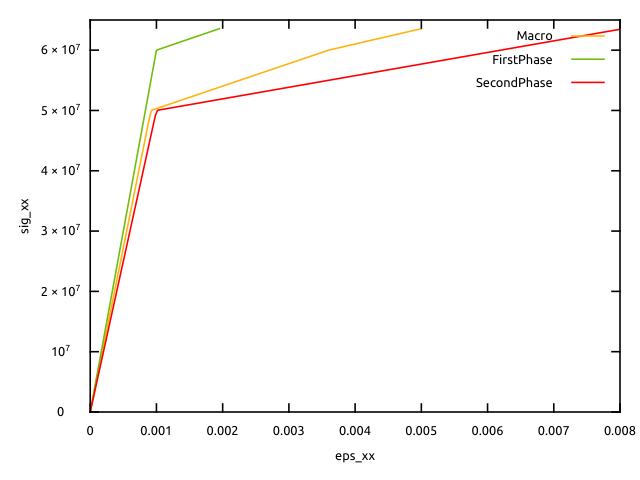

% Implementation of Sachs/Reuss homogenization scheme with a BehaviourVariable
% Helfer Thomas/Martin Antoine
% February 6, 2025

\newcommand{\D}{\mathrm{d}}
\newcommand{\tenseur}[1]{\underline{#1}}
\newcommand{\tenseurq}[1]{\underline{\mathbf{#1}}}
\newcommand{\tns}[1]{\underset{\tilde{}}{\mathbf{#1}}}
\newcommand{\transpose}[1]{#1^{\mathop{T}}}

\newcommand{\tepsilon}{\tenseur{\varepsilon}}
\newcommand{\tsigma}{\underline{\sigma}}
\newcommand{\sigmaeq}{\sigma_{\mathrm{eq}}}

\newcommand{\tepsilonto}{\underline{\epsilon}^{\mathrm{to}}}
\newcommand{\tepsilonel}{\underline{\epsilon}^{\mathrm{el}}}

\newcommand{\tepsilonp}{\underline{\epsilon}^{\mathrm{p}}}
\newcommand{\tdepsilonp}{\underline{\dot{\epsilon}}^{\mathrm{p}}}

\newcommand{\tDq}{\underline{\mathbf{D}}}
\newcommand{\trace}[1]{\mathrm{tr}\paren{#1}}
\newcommand{\Frac}[2]{{\displaystyle \frac{\displaystyle #1}{\displaystyle #2}}}
\newcommand{\deriv}[2]{{\displaystyle \frac{\displaystyle \partial #1}{\displaystyle \partial #2}}}
\newcommand{\dtot}{{\mathrm{d}}}
\newcommand{\paren}[1]{\left(#1\right)}
\newcommand{\nom}[1]{\textsc{#1}}
\newcommand{\bts}[1]{\left.#1\right|_{t}}
\newcommand{\ets}[1]{\left.#1\right|_{t+\Delta\,t}}

We present here an implementation of Sachs homogenization scheme [@sachs_1928] using `BehaviourVariable` keyword.
This implementation allows using arbitrary local behaviours on each phase, providing that
the local tangent operators are always invertible.

This tutorial first recalls the presentation of `Sachs` scheme, which introduces the unknown
stress, uniform in the composite material. This unknown leads to an unusual stress-driven problem,
and here the residues of the non-linear system are scaled with a reference stress, in order that
the Jacobian matrix remains well-conditioned.
This matrix remains theoretically invertible for some conditions on local behaviours (positive work
hardening, no damage...).

# Sachs homogenization scheme

Sachs/Reuss scheme makes the hypothesis of a uniform stress $\tenseur \Sigma$ in the heterogeneous material:
  \begin{aligned}
    \tsigma^i &= \tenseur \Sigma \\
  \end{aligned}
where $\tsigma^i$ stress field in phase $i$.
The macroscopic strain $\tenseur E$ is defined as the average of strain field:
dans le volume élémentaire représentatif (VER) :
  \begin{aligned}
    \tenseur E &= \sum_{i=1}^{N}f_i\,\tenseur \varepsilon^i \\
  \end{aligned}
where $N$ is the number of phases, $f_i$ is the volume fraction of phase $i$ and $\tenseur \varepsilon^i$ is the strain field in phase $i$ (given by the behaviour law).
We can show that the macroscopic tangent operator is given by
  \begin{aligned}
    \dfrac{\D \tenseur \Sigma}{\D \tenseur E}   &= \left(\deriv{\tenseur E}{\tenseur \Sigma}\right)^{-1}=\left(\sum_{i=1}^{N}f_i\,\deriv{\tepsilon^i}{\tenseur \Sigma}\right)^{-1}=\left(\sum_{i=1}^{N}f_i\,\left(\deriv{\tsigma^i}{\tepsilon^i}\right)^{-1}\right)^{-1}\\
  \end{aligned}
  
# Resolution of the non-linear system

The time interval is discretized and the unknowns are the increments of the variables.
The problem to solve is the following:

$\left\{
\begin{aligned}
&\Delta\tenseur \Sigma - \Delta\tsigma^i\left(\tepsilon^i,\Delta\tepsilon^i\right)= 0 \qquad \forall i\\
&\Delta\tenseur E-\sum_{i=1}^{N}f_i\,\Delta\tepsilon^i = 0\\
  \end{aligned}\right.$

whose unknowns are $\Delta\tepsilon^i$ and $\Delta \tenseur \Sigma$.
We will use a Newton-Raphson algorithm to solve this system.

In `MFront`, we will do that with the `Implicit` `DSL`. We only have to precise the residues
and the jacobian matrix.
The residues are given by

$\left\{
\begin{aligned}
&f_{\tepsilon^i} =\left(\Delta\tenseur \Sigma - \Delta\tsigma^i\left(\tepsilon^i,\Delta\tepsilon^i\right)\right)/\sigma_{0} \qquad \forall i\\
&f_{\tenseur E} = \Delta\tenseur E-\sum_{i=1}^{N}f_i\,\Delta\tepsilon^i
  \end{aligned}\right.$
  
where $\sigma_{0}$ is a parameter that give the same dimension and magnitude to the residues.
The jacobian matrix is:
  
 $\left\{
\begin{aligned}
&\deriv{f_{\tepsilon^i}}{\Delta\tepsilon^j} =- \delta_{ij}\frac{1}{\sigma_0}\deriv{\tsigma^j}{\tepsilon^j}\left(\tepsilon^i,\Delta\tepsilon^i\right) \qquad \forall i,j\\
&\deriv{f_{\tepsilon^i}}{\Delta\tenseur \Sigma} = \tenseurq{I}/\sigma_{0} \qquad \forall i\\
&\deriv{f_{\tenseur E}}{\Delta\tepsilon^i} = -f_i\,\tenseurq{I} \qquad \forall i\\
&\deriv{f_{\tenseur E}}{\Delta\tenseur \Sigma} = \tenseurq{0}
  \end{aligned}\right.$

# Implementation in MFront

The files `Plasticity.mfront` and `Sachs.mfront` are available in the `MFrontGallery` project, [here](https://github.com/thelfer/MFrontGallery/tree/master/generic-behaviours/homogenization/).

As for Taylor's scheme, we will use `BehaviourVariable`
for the integration of local behaviours.
The integration of global behavior, which requires solving a non-linear equation,
will be done with the `Implicit` `DSL`.

The step of creating a `BehaviourVariable` which allows the behaviour to be integrated on each phase
is done in the same way as what was described for [Taylor scheme](Taylor.html).
The corresponding local behaviours must be implemented before in `.mfront`
auxiliary files.

For the example, and for simplicity, we will assume that we have 2 phases whose behaviour
is elastoplastic with a Von Mises criterion with linear isotropic hardening. Material parameters
are different between phases and the behaviour is implemented in a file
`Plasticity.mfront`.

In `Sachs.mfront`,
we use an `Implicit` `DSL`, with a Newton-Raphson algorithm:

~~~~ {#Sachs .cpp .numberLines}
@DSL Implicit;
@Behaviour Sachs;

@Algorithm NewtonRaphson;
@Epsilon 1.e-14;
~~~~~~~~~~~~~~~~~~~~~~~~~~~~~~~~~~~~~~~~~~~~~~~~~

Here is the creation of a `BehaviourVariable` :

~~~~ {#Sachs .cpp .numberLines}
@BehaviourVariable b1 {
file: "Plasticity.mfront",
variables_suffix: "1",
store_gradients: false,
store_thermodynamic_forces: false,
external_names_prefix: "FirstPhase",
shared_external_state_variables: {".+"}
};
~~~~~~~~~~~~~~~~~~~~~~~~~~~~~~~~~~~~~~~~~~~~~~~~~

Note here, we add the line `store_gradients: false,` because we want 
define the variable `eto1` as `StateVariable`. In the case of Taylor scheme,
the `store_gradients` option was equal to `true`, which had the same
effect than writing `@AuxiliaryStateVariable StrainStensor eto1;`
which we don't want here. The same goes for phase 2.
We also write `store_thermodynamic_forces: false,` because
here the macroscopic stress is equal to the local
stress.

Local strain increments are defined as `StateVariable`, and
macroscopic stress is defined as `IntegrationVariable`. Indeed,
this latter stress does not necessitate to be saved from a time step
to the other, because there is also a variable `sig` defined.

~~~~ {#State .cpp .numberLines}
@StateVariable StrainStensor eto2;
eto2.setEntryName("SecondPhaseTotalStrain");
@StateVariable StrainStensor eto1;
eto1.setEntryName("FirstPhaseTotalStrain");

@IntegrationVariable StressStensor Sig;
Sig.setEntryName("MacroscopicStress");
~~~~~~~~~~~~~~~~~~~~~~~~~~~~~~~~~~~~~~~~~~~~~~~~~

Given that the tangent operators of each phase
are needed for the computation of the macroscopic tangent operator,
we define local variables:

~~~~ {#Local .cpp .numberLines}
@LocalVariable StiffnessTensor Dt1;
@LocalVariable StiffnessTensor Dt2;
~~~~~~~~~~~~~~~~~~~~~~~~~~~~~~~~~~~~~~~~~~~~~~~~~

Implementation of the `@Integrator` block is the following: 

~~~~ {#Integrator .cpp .numberLines}
@Integrator{
  initialize(b1);
  b1.deto=deto1;
  constexpr auto b1_smflag = TangentOperatorTraits<MechanicalBehaviourBase::STANDARDSTRAINBASEDBEHAVIOUR>::STANDARDTANGENTOPERATOR;
  const auto r1 = b1.integrate(b1_smflag,CONSISTENTTANGENTOPERATOR);
  Dt1 = b1.getTangentOperator();
  
  initialize(b2);
  b2.deto=deto2;
  constexpr auto b2_smflag = TangentOperatorTraits<MechanicalBehaviourBase::STANDARDSTRAINBASEDBEHAVIOUR>::STANDARDTANGENTOPERATOR;
  const auto r2 = b2.integrate(b2_smflag,CONSISTENTTANGENTOPERATOR);
  Dt2 = b2.getTangentOperator();
  
  auto dsig1 =b1.sig-sig;
  auto dsig2 =b2.sig-sig;
  
  feto1=(dSig-dsig1)/sig_0;
  feto2=(dSig-dsig2)/sig_0;
  fSig=deto-(1-f)*deto1-f*deto2;
  auto Id=st2tost2<3u,real>::Id();
  auto Null= Stensor4{real{}};
  dfeto1_ddeto1 = -Dt1/sig_0;
  dfeto1_ddSig = Id/sig_0;
  dfeto2_ddeto2 = -Dt2/sig_0;
  dfeto2_ddSig = Id/sig_0;
  dfSig_ddeto1 = -(1-f)*Id;
  dfSig_ddeto2 = -f*Id;
  dfSig_ddSig = Null;
}
~~~~~~~~~~~~~~~~~~~~~~~~~~~~~~~~~~~~~~~~~~~~~~~~~

We can see that we start with the integration of the local behaviours.

However, compared to Taylor's scheme,
we add `initialize(b1)` (resp. `initialize(b2)`) before the integration.
In fact, it is equivalent to:

~~~~ {#init .cpp .numberLines}
b1.eel=eel1;
b1.p=p1;
~~~~~~~~~~~~~~~~~~~~~~~~~~~~~~~~~~~~~~~~~~~~~~~~~

(and it also ensures `b1.eto=eto1`).
It was done automatically
in the case of Taylor scheme, but here, as the `store_gradients` option
is `false` for both phases, it is no more automatic.
Furthermore, the gradient `b1.deto` (resp. `b2.deto`) is initialized to `deto1` (resp. `deto2`), which is the increment
of the `StateVariable` `eto1` (resp. `eto2`) (which will be updated at each iteration of the Newton-Raphson).

We also recover the tangent operator on each phase.

Then, we indicate the residues and the Jacobian.
To define the residues `feto1` (resp. `feto2`), we need the
stress increments `dsig1` (resp. `dsig2`), which we obtain
as a difference between the stress `b1.sig` (resp. `b2.sig`) obtained at the end
of the local integration, and the stress `sig` (resp. `sig`).

Warning: if the instruction `updateAuxiliaryStateVariables(b1);`
is given in the `@Integrator` block, then the update of
`eel1` to `b1.eel` and `p1` to `b1.p` will take place at the end of each iteration of the Newton-Raphson (which
will be incorrect),
and not at the end of the time step (which is correct).
 
Note that the following parameters had been defined before
the integrator block:

~~~~ {#fraction .cpp .numberLines}
@Parameter stress sig_0=1e11;

@MaterialProperty real f;
f.setEntryName("FirstPhaseFraction");
~~~~~~~~~~~~~~~~~~~~~~~~~~~~~~~~~~~~~~~~~~~~~~~~~

Finally, macroscopic stress is given by

~~~~ {#FinalStress .cpp .numberLines}
@ComputeFinalStress{
sig += dSig;
}
~~~~~~~~~~~~~~~~~~~~~~~~~~~~~~~~~~~~~~~~~~~~~~~~~

Note that `Sig` is not saved from a time step to the other,
so that its value shall not be used to compute `sig`, but we use
its increment `dSig` instead.

Finally, macroscopic tangent operator is given by

~~~~ {#TangentOperator .cpp .numberLines}
@TangentOperator{
  auto iDt1= invert(Dt1);
  auto iDt2= invert(Dt2);
  Dt = invert(f*iDt1+(1-f)*iDt2);
}
~~~~~~~~~~~~~~~~~~~~~~~~~~~~~~~~~~~~~~~~~~~~~~~~~

# Results

We here use MTest to simulate a uniaxial tensile test.

MTest file (`Sachs.mtest`) is the following:

~~~~ {#Sachs_mtest .mtest .numberLines}
@ModellingHypothesis 'Tridimensional';
@Behaviour<Generic> 'src/libBehaviour.so' 'Sachs';
@MaterialProperty<constant> 'FirstPhaseYoungModulus'     60.e9;
@MaterialProperty<constant> 'FirstPhasePoissonRatio'       0.3;
@MaterialProperty<constant> 'H1'                4.e9;
@MaterialProperty<constant> 's01'               60.e6;
@MaterialProperty<constant> 'SecondPhaseYoungModulus'     50.e9;
@MaterialProperty<constant> 'SecondPhasePoissonRatio'       0.3;
@MaterialProperty<constant> 'H2'                2.e9;
@MaterialProperty<constant> 's02'               50.e6;
@MaterialProperty<constant> 'PhaseFraction' 0.5;
@ExternalStateVariable 'Temperature' 293.15;
@ImposedStrain 'EXX' {0 : 0, 1 : 5e-3};
@Times {0.,1 in 50};
~~~~~~~~~~~~~~

The axial stress (uniform in the VER) is shown below
as a function of the macroscopic axial strain, as a function
of the axial strain of phase 1, and as a function of axial strain of phase
2.

We can see, as expected, that at a given stress value, the macroscopic strain is an average
of local strains.
When the macroscopic stress
reaches the yield stress of one of the phases, the evolution of this phase
becomes plastic,
and this has repercussions on the macroscopic strain and on the other phase.
The second phase becomes plastic later.

<!-- Local IspellDict: english -->
