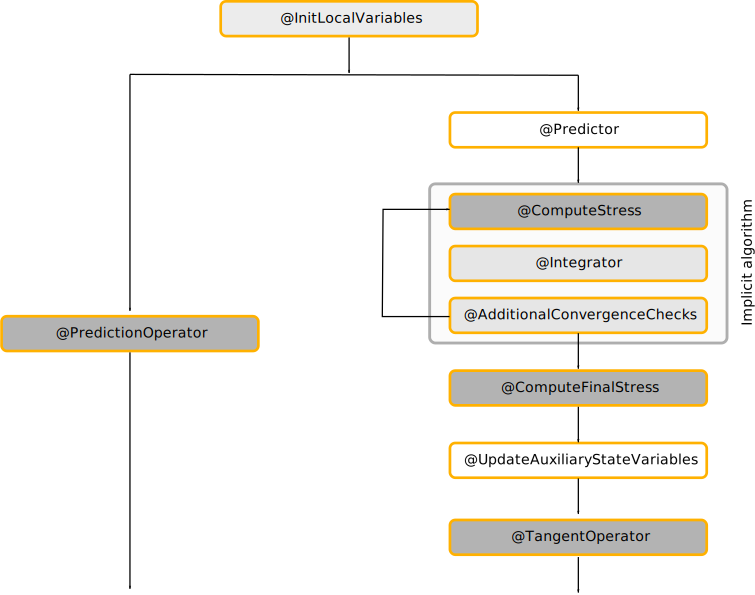
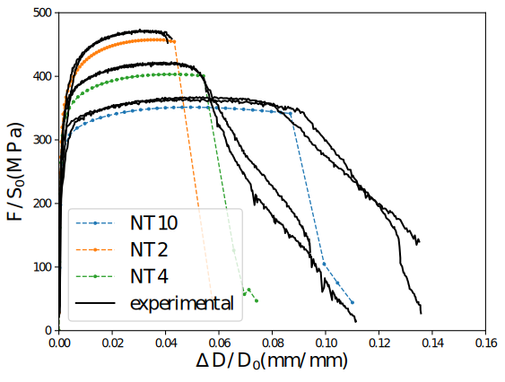
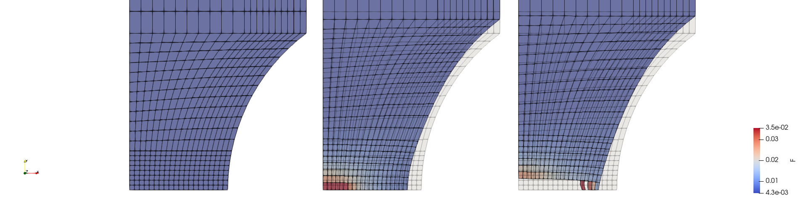
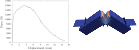

\newcommand{\tsigma}{\underline{\sigma}}
\newcommand{\paren}[1]{{\left(#1\right)}}
\newcommand{\trace}[1]{{\mathrm{tr}\paren{#1}}}
\newcommand{\tenseur}[1]{\underline{#1}}
\newcommand{\tenseurq}[1]{\underline{\underline{\mathbf{#1}}}}
\newcommand{\tepsilonto}{\tenseur{\varepsilon}^{\mathrm{to}}}
\newcommand{\tdepsilonto}{\tenseur{\dot{\varepsilon}}^{\mathrm{to}}}
\newcommand{\tepsilonel}{\tenseur{\varepsilon}^{\mathrm{el}}}
\newcommand{\tdepsilonel}{\tenseur{\dot{\varepsilon}}^{\mathrm{el}}}
\newcommand{\tepsilonvp}{\tenseur{\varepsilon}^{\mathrm{vp}}}
\newcommand{\tdepsilonvp}{\tenseur{\dot{\varepsilon}}^{\mathrm{vp}}}
\newcommand{\tepsilonp}{\tenseur{\varepsilon}^{\mathrm{p}}}
\newcommand{\tdepsilonp}{\tenseur{\dot{\varepsilon}}^{\mathrm{p}}}
\newcommand{\sstar}{\sigma_{\star}}
\newcommand{\pr}{\mathrm{\sigma_{m}}}
\newcommand{\sigmaeq}{\sigma_{\mathrm{eq}}}
\newcommand{\bts}[1]{{\left.#1\right|_{t}}}
\newcommand{\mts}[1]{{\left.#1\right|_{t+\theta\,\Delta\,t}}}
\newcommand{\ets}[1]{{\left.#1\right|_{t+\Delta\,t}}}
\newcommand{\dtot}{\mathrm{d}}
\newcommand{\Frac}[2]{{{\displaystyle \frac{\displaystyle #1}{\displaystyle #2}}}}
\newcommand{\deriv}[2]{{\displaystyle \frac{\displaystyle \partial #1}{\displaystyle \partial #2}}}
\newcommand{\derivtot}[2]{{\displaystyle \frac{\displaystyle \dtot #1}{\displaystyle \dtot #2}}}

\def\doubleunderline#1{\underline{\underline{#1}}}

<!--
pandoc -f markdown+tex_math_single_backslash -F pandoc-crossref --citeproc --highlight-style=tango PorousPlasticity.md -o PorousPlasticity.pdf
pandoc -f markdown+tex_math_single_backslash --template=/home/th202608/texmf/tex/NT/note_technique_2018.template -F pandoc-crossref --citeproc --highlight-style=tango PorousPlasticity.md -o PorousPlasticity.pdf
-->

# Introduction

Constitutive equations for porous (visco-)plasticity are used to perform
ductile fracture simulations, adding the porosity as an internal state
variable. Porosity evolution is driven by nucleation laws
and growth due to plastic flow.

While some implementations of these models based on implicit schemes are
already available in `MFront` (Gurson [@gurson1977],
Gurson-Tvergaard-Needleman [@tvergaardneedleman1984], ...), their
numerical treatment have specific issues:

- Phenomenological laws describing porosity nucleation may have threshold to
  be activated or inhibited.
- Material failure usually happens when the porosity reaches a critical
  value corresponding to the collapse of the yield surface. Detection of
  material failure is awkward when the equations governing the porosity
  evolution are included in the implicit system to be solved. For
  example, the estimates of the solution may exceed the critical value
  during the iterations while the solution of the implicit scheme may be
  below this critical value.

Those issues were previously overcome by considering an explicit
treatment of the porosity evolution, which requires small time steps.

The purpose of this work is twofold:

- Propose a robust fully implicit algorithm which can handle thresholds
  of nucleation laws and material failure.
- Extend the [`StandardElastoViscoPlasticity`
  brick](https://thelfer.github.io/tfel/web/StandardElastoViscoPlasticityBrick.html)
  to this class of behaviours, allowing a declarative syntax similar as:

~~~~{.cxx}
@Brick "StandardElastoViscoPlasticity" {
   stress_potential : "Hooke" {
      young_modulus : 200e9,
      poisson_ratio : 0.3
   },
   inelastic_flow : "Plastic" {
      criterion : "GursonTvergaardNeedleman" {
         q1 : 1.5,
         q2 : 1.0,
         q3 : 2.2,
         fc : 0.01,
         fr : 0.1
      },
      isotropic_hardening : "Linear" {
         R0 : 150e6
      }
   },
   porosity_evolution : {
      nucleation_model : "Chu_Needleman" {
         An : 0.01,
         pn : 0.1,
         sn : 0.1
      },
      growth_model : "StandardPlasticModel"
};
~~~~

> **Note**
> For backward compatibility, effect of the porosity on plastic
> flows will not be taken into account if no `porosity_evolution`
> section is declared.

This document is meant to be part of the MFront documentation. It will
be available on the MFront website and on the ResearchGate page of the
project. The authors have carefully checked that no unpublished material
data has been used in the examples.

## Outline

Section @sec:mfront:porous_plasticity:overview provides a description of
several stress criteria of interest for porous (visco-)plasticity and
some common nucleation laws.

Section @sec:mfront:porous_plasticity:implicit_scheme describes two
implicit schemes suitable for the integration of the previous
constitutive laws:

- The first one is the standard implicit scheme where the implicit
  equations associated with all the state variables are solved all at
  once using a Newton-like algorithm.
- The second one is built on a staggered approach in which the porosity
  evolution and the evolution of the other state variables are solved
  independently. Both evolutions are repeated until the implicit
  equations associated with all the state variables are all satisfied.
  We show that, if required, an exact consistent tangent operator can be
  derived.

Section @sec:mfront:porous_plasticity:standardelastoviscoplasticitybrick
discusses the design choices made for the extension of `MFront`'
[`StandardElastoViscoPlasticity`
brick](https://thelfer.github.io/tfel/web/StandardElastoViscoPlasticityBrick.html).

Section @sec:mfront:porous_plasticity:verifications is devoted to unit
tests and verifications.

Section @sec:mfront:porous_plasticity:applications describes early
results that proves the robustness of the proposed schemes.

Appendix @sec:mfront:porous_plasticity:stress_criterion is dedicated to
the computation of the stress criterion which may
require solving a non linear equation by Newton algorithm.

Appendix @sec:mfront:porous_plasticity:nucleation_law_derivatives gives
the derivatives of some common nucleation laws.

Appendix @sec:mfront:porous_plasticity:stress_criterion_derivatives
gives the derivatives of some common porous stress criteria.

Appendix @sec:mfront:porous_plasticity:regul describes a regularization of the effective porosity in the Gurson-Tvergaard-Needleman stress criterion.

Appendix @sec:mfront:porous_plasticity:castem details some numerical tricks to improve the robustness of finite element simulations performed with `Cast3M` using the constitutive laws from the extended [`StandardElastoViscoPlasticity`
brick](https://thelfer.github.io/tfel/web/StandardElastoViscoPlasticityBrick.html).

Appendix @sec:porosity_evolution_options is dedicated to the description
of the various options that can be declared in the `porosity_evolution`
section inside the declaration of the `StandardElastoViscoPlasticity`
brick.

# General framework {#sec:mfront:porous_plasticity:overview}

In the framework adopted in this report, a porous plastic model is defined by a stress criterion \(\sstar\) which depends
explicitly on the stress tensor \(\tsigma\) and the porosity \(f\):

\[
\sstar = \phi(\tsigma,f)
\]

This stress criterion is used to define the yield surface or the intensity of the viscoplastic flow.

Concerning the flow rule, two main classes of models are classically
found in the literature. In the first class of model, the porosity does not change the expression of the flow rule:

\[
\tdepsilonp = \dot{\lambda}\, \deriv{\sstar}{\tsigma} = \dot{p}\, \deriv{\sstar}{\tsigma}
\]

i.e. the equivalent (visco-)plastic strain \(p\) is defined as the
macroscopic equivalent (visco-)plastic strain and can still be
identified as the plastic multiplier \(\lambda\).

This class of models encompasses:

- the work of Ponte-Castaneda (see @castaneda_effective_1991), which is
  the theorical basis of several viscoplastic behaviours used in uranium
  dioxyde fuels [@monerie_overall_2006;@salvo_experimental_2015];
- the work of Rousselier [@rousselier_1981].

In the second class, the flow rule is affected by a correction factor
\(1-f\) (see @mealor_2004):

\[
\tdepsilonp = \dot{\lambda}\, \deriv{\sstar}{\tsigma} = (1 - f)\, \dot{p}\, \deriv{\sstar}{\tsigma}
\]

where $f$ is the porosity. Here, $p$ can be identified to the equivalent
(visco-)plastic strain in the matrix and it is no more equal to the
plastic multiplier \(\lambda\).

> **Note**
>
> The term $(1-f)$ comes from the definition of $p$ as the equivalent plastic strain 
> in the matrix through the modelling of hardening:
>
> \[
> \displaystyle{\tsigma:\tdepsilonp =
> \dot{\lambda} \tsigma\, \colon\,\deriv{\sstar}{\tsigma}} =
> \dot{\lambda} \sstar = (1 - f)R(p) \dot{p} \Rightarrow \dot{\lambda} =
> (1 - f) \dot{p}
> \]
>
> where \(R\paren{p}\) is the radius of the yield surface.

The evolution of porosity is composed of two terms: one due to plastic
flow and another one due to nucleation $A_n^i dp$:

\[\dot{f} = (1 - f)\trace{\tdepsilonp} + \sum_j A_n^j \dot{p}\]

The first term describes the incompressibility of the matrix under the
assumption that the change of volume associated with the elastic part of
the strain is negligible. This assumption is common, although adding the
elastic contribution is fairly easy, see Section
@sec:mfront:porous_plasticity:elastic_contribution_to_porosity_growth.

## Stress criteria {#Stress_criteria}

Different stress criteria implemented in the brick are described below.

<!--
- **Green** [@fritzen_computational_2013]

\[\sstar = \sqrt{\sigma_{vM}^{2} + 9 f  \sigma_m^2} \]

where $\displaystyle{\sigma_{vM} = \sqrt{\dfrac{3}{2} \tenseur{s} :
\tenseur{s}}}$ is the von Mises equivalent stress, and
$\displaystyle{\sigma_m = \dfrac{1}{3}\trace{\tsigma}}$ the mean stress.

> **Note** This model is a particular case of
> [@fritzen_computational_2013] and is implemented mainly as a simple
> working example of a porous stress criterion.
-->

- **Gurson-Tvergaard-Needleman** [@tvergaardneedleman1984]

\[
 S = \paren{\dfrac{\sigma_{vM}}{\sstar} }^2 + 2 q_1 f_{\star} \cosh{\paren{\dfrac{3}{2} q_2 \dfrac{\sigma_m}{\sstar}    }} - 1 - q_3 f_{\star}^2  = 0
\] {#eq:mfront:porous_plasticity:GTN:S}
which defines implicitly $\sigma_{\star}$, where $\sigma_{vM}$ is the
von Mises equivalent stress, and $\sigma_m$ the mean stress. $f_{\star}$
is defined such that:

\[
f_{\star} = \left\{
\begin{array}{ll}
\delta f & \mbox{if } f < f_c \\
f_c + \delta (f - f_c)  & \mbox{otherwise}
\end{array}
\right.
\]
and:
\[
\delta = \left\{
\begin{array}{ll}
1 & \mbox{if } f < f_c \\
\dfrac{f_u- f_c }{f_r - f_c}   & \mbox{otherwise}
\end{array}
\right.
\]
where \(f_{u}\) is the root of \(2\,q_1\,f-1-q_3\,f^{2}\).

The parameters of the model are:

\[\left\{q_1,q_2,q_3,f_c,f_r \right\} \]

For $\left\{q_1,q_2,q_3,f_c,f_r \right\} =
\left\{1,1,1,+\infty,-\right\}$, Gurson-Tvergaard-Needleman model
reduces to the Gurson model [@gurson1977] which has no free parameter.

Note that the physical meaning of \(q_3\) different from \(q_1^2\) is
doubtful. Moreover, the current implementation is incorrect for \(q_3
> q_1^2\).

- **Rousselier-Tanguy-Besson** [@tanguybesson2002]

\[
S = \dfrac{\sigma_{vM}}{(1- f )\sstar} + \dfrac{2}{3} f D_R \exp{\paren{\dfrac{3}{2} q_R \dfrac{\sigma_m}{(1 - f )\sstar}    }} - 1  = 0
\] {#eq:mfront:porous_plasticity:RTB:S}

The effective stress $\sstar$ which is solution of this equation is:

\[\sstar = \dfrac{q_R \sigma_{vM}}{(1 - f) \paren{q_R - \dfrac{2}{3T}L\paren{q_R D_R f T \exp{\paren{\dfrac{3}{2} q_R T}}}}} \] 

where $L$ is the Lambert function, and $T = \sigma_m / \sigma_{vM}$ the stress triaxiality. The parameters of the model are:

\[\left\{q_R,D_R \right\} \]

<!--
- **UserDefinedGenericGrowth**

\[  S = A\dfrac{\sigma_1}{\sstar} + B \cosh{\paren{ \dfrac{C \sigma_2}{\sigma^{\star}}    }} + D = 0\] 

which defines implicitly $\sstar$. The parameters $\{A,B,C,D\}$
are user-defined functions of the porosity. The parameters $\{\sigma_1,\sigma_2\}$ are user-defined functions of the stress tensor.

The parameters of the model are thus:

\[\left\{ \sigma_1, \sigma_2, A,B,C,B,\dfrac{\partial A}{\partial f},\dfrac{\partial B}{\partial f},\dfrac{\partial C}{\partial f},\dfrac{\partial D}{\partial f}, \dfrac{\partial \sigma_1}{\partial \tsigma},\dfrac{\partial \sigma_2}{\partial \tsigma},\dfrac{\partial^2 \sigma_1}{\partial \tsigma^2},\dfrac{\partial^2 \sigma_2}{\partial \tsigma^2} \right\} \]

As $\sstar$ is defined implicitly through $S(\tsigma,\sstar,f) =0$, the first and second order derivatives of the function S are required to compute the first and second order derivatives of $\sstar$:

\[
\begin{aligned}
\deriv{S}{\sstar} =& -2A \dfrac{\sigma_1^2}{\sstar^3} - \dfrac{BC\sigma_2}{\sstar^2}\sinh{\paren{C \dfrac{\sigma_2}{\sstar}}} \\
\dfrac{\partial S}{\partial B} =& \cosh{\paren{C \dfrac{\sigma_2}{\sstar}}} \\
\dfrac{\partial S}{\partial \sigma_{1}} =& 2A \dfrac{\sigma_1}{\sstar^2}\\
\dfrac{\partial S}{\partial C} =& \dfrac{B\sigma_{2}}{\sstar}\sinh{\paren{C \dfrac{\sigma_2}{\sstar}}}\\
\dfrac{\partial S}{\partial \sigma_{2}} =& \dfrac{BC}{\sstar}\sinh{\paren{C \dfrac{\sigma_2}{\sstar}}}\\
 \dfrac{\partial S}{\partial D} =& 1\\
 \dfrac{\partial S}{\partial A} =& \dfrac{\sigma_1^2}{\sstar^2}\\
 \end{aligned}
 \]

\[
\begin{aligned}
\dfrac{\partial^2 S}{\partial \sigma_{1}^2} &=  \dfrac{2A}{\sstar^2} \\
\dfrac{\partial^2 S}{\partial \sstar \partial A} &= -2\dfrac{\sigma_1^2}{\sstar^3}\\
\dfrac{\partial^2 S}{\partial \sigma_{2}^2} &= B\paren{\dfrac{C}{\sstar} }^2\cosh{\paren{C \dfrac{\sigma_2}{\sstar}}}\\
\dfrac{\partial^2 S}{\partial \sstar \partial B} &= - \dfrac{C\sigma_2}{\sstar^2}\sinh{\paren{C \dfrac{\sigma_2}{\sstar}}}\\
\dfrac{\partial^2 S}{\partial \sigma_{1} \partial A} &= 2 \dfrac{\sigma_1}{\sstar^2}\\
\dfrac{\partial^2 S}{\partial \sstar \partial C} &= - \dfrac{B\sigma_2}{\sstar^2}\sinh{\paren{C \dfrac{\sigma_2}{\sstar}}} - \dfrac{BC\sigma_2^2}{\sstar^3}\cosh{\paren{C \dfrac{\sigma_2}{\sstar}}}   \\
\dfrac{\partial^2 S}{\partial \sigma_{1} \partial B} &= 0\\
\dfrac{\partial^2 S}{\partial \sstar \partial D} &= 0  \\
\dfrac{\partial^2 S}{\partial \sigma_{1} \partial C} &= 0 \\
\dfrac{\partial^2 S}{\partial \sstar \partial \sigma_1} &= -\dfrac{4A\sigma_1}{\sstar^3}  \\
\dfrac{\partial^2 S}{\partial \sigma_{1} \partial D} &= 0\\
\dfrac{\partial^2 S}{\partial \sstar \partial \sigma_2} &=  -\dfrac{BC}{\sstar^2}\sinh{\paren{C \dfrac{\sigma_2}{\sstar}}} -\dfrac{BC^2 \sigma_2}{\sstar^3}\cosh{\paren{C \dfrac{\sigma_2}{\sstar}}} \\
\dfrac{\partial^2 S}{\partial \sigma_{2} \partial A} &= 0\\
\dfrac{\partial^2 S}{\partial \sigma_{2} \partial B} &= \dfrac{C}{\sstar}\sinh{\paren{C \dfrac{\sigma_2}{\sstar}}}\\
\dfrac{\partial^2 S}{\partial \sigma_{2} \partial C} &= \dfrac{B}{\sstar}\sinh{\paren{C \dfrac{\sigma_2}{\sstar}}} + B \sigma_2  \dfrac{C}{\sstar^2}\cosh{\paren{C \dfrac{\sigma_2}{\sstar}}}\\
\dfrac{\partial^2 S}{\partial \sigma_{2} \partial D} &= 0\\
\end{aligned}
\]

The first and second order derivatives of $\sstar$ are:

\[
  \begin{aligned}
      \deriv{\sstar}{\tsigma}  =& -\paren{\deriv{S}{\sstar} }^{-1} \deriv{S}{\tsigma}  =& -\paren{\deriv{S}{\sstar} }^{-1}\left[ \dfrac{\partial S}{\partial \sigma_1} \dfrac{\partial \sigma_1}{\partial \tsigma} + \dfrac{\partial S}{\partial \sigma_2} \dfrac{\partial \sigma_2}{\partial \tsigma} \right] \\
    \deriv{\sstar}{f} =& -\paren{\deriv{S}{\sstar} }^{-1} \deriv{S}{f}  =& -\paren{\deriv{S}{\sstar} }^{-1}\left[ \dfrac{\partial S}{\partial A} \dfrac{\partial A}{\partial f} + \dfrac{\partial S}{\partial B} \dfrac{\partial B}{\partial f} +  \dfrac{\partial S}{\partial C} \dfrac{\partial C}{\partial f} + \dfrac{\partial S}{\partial D} \dfrac{\partial D}{\partial f}\right] \\
  \end{aligned}
\]

\[
  \begin{aligned}
    \dfrac{\partial^2 S}{\partial \sigma_1 \partial f } =& \dfrac{\partial}{\partial \sigma_1}\paren{\dfrac{\partial S}{\partial A}\dfrac{\partial A}{\partial f} + \dfrac{\partial S}{\partial B}\dfrac{\partial B}{\partial f} + \dfrac{\partial S}{\partial C}\dfrac{\partial C}{\partial f} + \dfrac{\partial S}{\partial D}\dfrac{\partial D}{\partial f}    } \\
   =&  \dfrac{\partial^2 S}{\partial A \partial \sigma_1}\dfrac{\partial A}{\partial f} + \dfrac{\partial^2 S}{\partial B \partial \sigma_1}\dfrac{\partial B}{\partial f} + \dfrac{\partial^2 S}{\partial C \partial \sigma_1}\dfrac{\partial C}{\partial f} + \dfrac{\partial^2 S}{\partial D \partial \sigma_1}\dfrac{\partial D}{\partial f} \\ 
    \dfrac{\partial^2 S}{\partial \sigma_2 \partial f } =& \dfrac{\partial}{\partial \sigma_2}\paren{\dfrac{\partial S}{\partial A}\dfrac{\partial A}{\partial f} + \dfrac{\partial S}{\partial B}\dfrac{\partial B}{\partial f} + \dfrac{\partial S}{\partial C}\dfrac{\partial C}{\partial f} + \dfrac{\partial S}{\partial D}\dfrac{\partial D}{\partial f}    } \\
   =&  \dfrac{\partial^2 S}{\partial A \partial \sigma_2}\dfrac{\partial A}{\partial f} + \dfrac{\partial^2 S}{\partial B \partial \sigma_2}\dfrac{\partial B}{\partial f} + \dfrac{\partial^2 S}{\partial C \partial \sigma_2}\dfrac{\partial C}{\partial f} + \dfrac{\partial^2 S}{\partial D \partial \sigma_2}\dfrac{\partial D}{\partial f} \\    
    \dfrac{\partial^2 S}{\partial \sstar \partial f } =& \dfrac{\partial}{\partial \sigma_\star}\paren{\dfrac{\partial S}{\partial A}\dfrac{\partial A}{\partial f} + \dfrac{\partial S}{\partial B}\dfrac{\partial B}{\partial f} + \dfrac{\partial S}{\partial C}\dfrac{\partial C}{\partial f} + \dfrac{\partial S}{\partial D}\dfrac{\partial D}{\partial f}    } \\
   =&  \dfrac{\partial^2 S}{\partial A \partial \sstar}\dfrac{\partial A}{\partial f} + \dfrac{\partial^2 S}{\partial B \partial \sstar}\dfrac{\partial B}{\partial f} + \dfrac{\partial^2 S}{\partial C \partial \sstar}\dfrac{\partial C}{\partial f} + \dfrac{\partial^2 S}{\partial D \partial \sstar}\dfrac{\partial D}{\partial f} \\
%   \dfrac{\partial^2 S}{\partial \tsigma \partial f } =& \dfrac{\partial}{\partial f}\paren{\dfrac{\partial S}{\partial \sigma_1}\dfrac{\partial \sigma_1}{\partial \tsigma} +\dfrac{\partial S}{\partial \sigma_2}\dfrac{\partial \sigma_2}{\partial \tsigma}     } = \dfrac{\partial^2 S}{\partial \sigma_1 \partial f}\dfrac{\partial \sigma_1}{\partial \tsigma} +\dfrac{\partial^2 S}{\partial \sigma_2 \partial f}\dfrac{\partial \sigma_2}{\partial \tsigma} \\
%   =& \dfrac{\partial \sigma_1}{\partial \tsigma}\paren{\dfrac{\partial^2 S}{\partial A \partial \sigma_{1}}\dfrac{\partial A}{\partial f} + \dfrac{\partial^2 S}{\partial B \partial \sigma_{1}}\dfrac{\partial B}{\partial f} + \dfrac{\partial^2 S}{\partial C \partial \sigma_{1}}\dfrac{\partial C}{\partial f} + \dfrac{\partial^2 S}{\partial D \partial \sigma_{1}}\dfrac{\partial D}{\partial f}   } \\
%    +& \dfrac{\partial \sigma_2}{\partial \tsigma}\paren{\dfrac{\partial^2 S}{\partial A \partial \sigma_{2}}\dfrac{\partial A}{\partial f} + \dfrac{\partial^2 S}{\partial B \partial \sigma_{2}}\dfrac{\partial B}{\partial f} + \dfrac{\partial^2 S}{\partial C \partial \sigma_{2}}\dfrac{\partial C}{\partial f} + \dfrac{\partial^2 S}{\partial D \partial \sigma_{2}}\dfrac{\partial D}{\partial f}   }\\
        \dfrac{\partial^2 S}{\partial \tsigma \partial \sstar } =& \dfrac{\partial}{\partial \sstar}\paren{\dfrac{\partial S}{\partial \sigma_1}\dfrac{\partial \sigma_1}{\partial \tsigma} +\dfrac{\partial S}{\partial \sigma_2}\dfrac{\partial \sigma_2}{\partial \tsigma}     }  \\
     =& \dfrac{\partial^2 S}{\partial \sigma_1 \partial \sstar}\dfrac{\partial \sigma_1}{\partial \tsigma} +\dfrac{\partial^2 S}{\partial \sigma_2 \partial \sstar}\dfrac{\partial \sigma_2}{\partial \tsigma}   \\   
   \end{aligned}
\]   

\[
  \begin{aligned}
    \dfrac{\partial^2 \sstar}{\partial \tsigma \partial f} =& -\paren{\deriv{S}{\sstar} }^{-1}\left[ \dfrac{\partial^2 S}{\partial \sigma_1 \partial f} \dfrac{\partial \sigma_1}{\partial \tsigma} + \dfrac{\partial^2 S}{\partial \sigma_2 \partial f} \dfrac{\partial \sigma_2}{\partial \tsigma} \right] \\
    +& \dfrac{\partial^2 S}{\partial \sstar \partial f}\paren{\deriv{S}{\sstar} }^{-2}\left[ \dfrac{\partial S}{\partial \sigma_1} \dfrac{\partial \sigma_1}{\partial \tsigma} + \dfrac{\partial S}{\partial \sigma_2} \dfrac{\partial \sigma_2}{\partial \tsigma} \right] \\
    \dfrac{\partial^2 \sstar}{\partial \tsigma^2} =& -\paren{\deriv{S}{\sstar} }^{-1}\left[ \dfrac{\partial S}{\partial \sigma_1 } \dfrac{\partial^2 \sigma_1}{\partial \tsigma^2} + \dfrac{\partial S}{\partial \sigma_2} \dfrac{\partial^2 \sigma_2}{\partial \tsigma^2} +  \dfrac{\partial^2 S}{\partial \sigma_{1}^2} \paren{\dfrac{\partial \sigma_1}{\partial \tsigma}  }^2 +  \dfrac{\partial^2 S}{\partial \sigma_{2}^2} \paren{\dfrac{\partial \sigma_2}{\partial \tsigma}  }^2       \right] \\
   +&  \paren{\dfrac{\partial^2 S}{\partial \sstar \partial \sigma_1} \dfrac{\partial \sigma_1}{\partial \tsigma} + \dfrac{\partial^2 S}{\partial \sstar \partial \sigma_2} \dfrac{\partial \sigma_2}{\partial \tsigma}    }\paren{\deriv{S}{\sstar} }^{-2} \left[ \dfrac{\partial S}{\partial \sigma_1 } \dfrac{\partial \sigma_1}{\partial \tsigma} + \dfrac{\partial S}{\partial \sigma_2} \dfrac{\partial \sigma_2}{\partial \tsigma} \right]
    \end{aligned}
\]

> **Note** Many models developped for porous materials and accounting for anisotropy and void shape effects can be recasted into such generic form of the stress criterion, such as [@benzergabesson2001], [@madou2012a], [@morin2015], [@paux2018]

-->
<!--
- **Thomason**

\[ \sstar = A \sigma_I\]

where $\sigma_I$ is the maximal principal stress. The parameter A is a material parameter that can be linked to the porosity through an auxiliary state variable.

The Thomason model corresponds to:

\[A^{-1} = (1 - \chi^2)\left[0.1\left(\dfrac{\chi^{-1}-1}{W}\right)^2 + 1.2\sqrt{\chi^{-1}}    \right]\ \ \ \ \ \mathrm{with}\ \ \ \ \ \chi = \left(\dfrac{6 f \lambda}{\pi W}\right)^{1/3} \]

The evolutions of the void aspect ratio $W$ and cell aspect ratio $\lambda$ are define by:

\[\dot{W} = \dfrac{9 \lambda}{4 W} \left(1 - \dfrac{2}{\pi \chi^2}   \right) \dot{\varepsilon}^p_{eq} \]

\[\dot{\lambda} = \lambda \dot{\varepsilon}_{I} \]
-->

## Nucleation terms

Different nucleation terms are available and are described below. Multiple nucleation terms can be used simultaneously.

- **Chu-Needleman strain based** [@chuneedleman1980]

\[
A_n = \dfrac{f_N}{s_N \sqrt{2\pi}} \exp{\paren{-\dfrac{1}{2} \paren{\dfrac{p - \epsilon_N}{s_N} }^2  }     }
\]{#eq:mfront:porous_plasticity:nucleationmodel:chuneedlemanstrainbase}

where $\{f_N,s_N,\epsilon_N\}$ are material parameters, and $p$ is the matrix equivalent plastic strain.

- **Chu-Needleman stress based** [@chuneedleman1980]

\[
A_n = \dfrac{f_N}{s_N \sqrt{2\pi}} \exp{\paren{-\dfrac{1}{2} \paren{\dfrac{\sigma_I - \sigma_N}{s_N} }^2  }     }
\]

where $\{f_N,s_N,\sigma_N\}$ are material parameters, and $\sigma_I$ is the maximal positive principal stress.

- **Power-Law strain based**

\[
A_n = f_N \left<\dfrac{p}{\epsilon_N} - 1 \right>^m \quad \mathrm{if}\quad \int A_n dp \leq f_{\mathrm{nuc}}^{max} 
\]{#eq:mfront:porous_plasticity:nucleationmodel:powerlawstrainbase}

where $\{f_N,m,\epsilon_N,f_{\mathrm{nuc}}^{max} \}$ are
material parameters, $p$ is the matrix equivalent plastic strain. In the
previous expression, \(\left<.\right>\) denotes the Macaulay bracket,
i.e. positive part of a number:

\[
\left<x\right> = \max\paren{x,0}
\]

- **Power-Law stress based**

\[
 A_n = f_N \left<\dfrac{\sigma_I}{\sigma_N} - 1 \right>^m  \quad \mathrm{if}\quad \int A_n dp \leq f_{\mathrm{nuc}}^{max} 
\]

where $\{f_N,m,\sigma_N,f_{\mathrm{nuc}}^{max}\}$ are material parameters, and $\sigma_I$ is the maximal positive principal stress.

# Implicit schemes {#sec:mfront:porous_plasticity:implicit_scheme}

This section is devoted to the presentation of two implicit schemes that
may be used to integrate the constitutive equations presented in Section
@sec:mfront:porous_plasticity:overview.

## Standard implicit scheme

Assuming a single porous stress criterion whose flow is modified by the
porosity evolution, the constitutive equations lead to the following
system to be solved for an elastoplastic evolution:

\[
\begin{aligned} 
\tdepsilonel + \tdepsilonp - \tdepsilonto &= 0 \\
\sstar - R(p) &= 0 \\ 
\dot{f} - (1 - f)\trace{\tdepsilonp} - \sum_j A_n^j \dot{p}  &=0
\end{aligned}
\]{#eq:mfront:porous_plasticity:ode}

This system must be closed by adding the relation between the stress
\(\tsigma\) and the elastic strain \(\tepsilonel\). In the report, we
assume that the standard Hooke law holds:

\[
\tsigma = \tenseurq{D}\,\tepsilonel
\]

where \(\tenseurq{D}\) is the elastic stiffness tensor.

A semi-implicit method is used to solve these equations according to the
variables \(\{\Delta\,\tepsilonel, \Delta\,p, \Delta\,f \}\)

\[
\mathcal{R}\paren{\Delta\,\tepsilonel, \Delta\,p, \Delta\,f}=0
\]{#eq:mfront:porous_plasticity:implicit_scheme0}

The residual \(\mathcal{R}\) can be decomposed by blocks as follows:

\[
\begin{aligned}
\mathcal{R}_{\Delta\,\tepsilonel} = \Delta\,\tepsilonel + (1 - \mts{f}) \Delta\,p \, \mts{\deriv{\sstar}{\tsigma}} - \Delta\,\tenseur{\epsilon}_{to} &= 0 \\ 
\mathcal{R}_{\Delta\,p} = \sstar - R(\mts{p}) &= 0 \\
\mathcal{R}_{\Delta\,f} =  \Delta\,f - (1 - \mts{f})^2 \Delta\,p \, \trace{\mts{\deriv{\sstar}{\tsigma}}} - \sum_j  \mts{A_n^j}\,\Delta\,p  &=0
\end{aligned}
\]{#eq:mfront:porous_plasticity:implicit_scheme}

In the previous equation, \(\theta\) is a numerical parameter (\(\theta\in[0:1]\)).

Solving this system using a Newton-Raphson algorithm requires computing the Jacobian matrix:

\[
J=
\begin{pmatrix}
\begin{array}{lll}
 \deriv{\mathcal{R}_{\Delta\,\tepsilonel}}{\Delta\,\tepsilonel}   &   \deriv{\mathcal{R}_{\Delta\,\tepsilonel}}{\Delta\,p}   &   \deriv{\mathcal{R}_{\Delta\,\tepsilonel}}{\Delta\,f}    \\
 \deriv{\mathcal{R}_{\Delta\,p}}{\Delta\,\tepsilonel}  &   \deriv{\mathcal{R}_{\Delta\,p}}{\Delta\,p}  &   \deriv{\mathcal{R}_{\Delta\,p}}{\Delta\,f}      \\
 \deriv{\mathcal{R}_{\Delta\,f}}{\Delta\,\tepsilonel}   &   \deriv{\mathcal{R}_{\Delta\,f}}{\Delta\,p}  &   \deriv{\mathcal{R}_{\Delta\,f}}{\Delta\,f}     \\
\end{array}
\end{pmatrix}
\]{#eq:mfront:porous_plasticity:jacobian_matrix}

where the different terms can be written as [@mealor_2004]:

\[
\begin{aligned}
\deriv{\mathcal{R}_{\Delta\,\tepsilonel}}{\Delta\,\tepsilonel} &=  \tenseurq{I} + \theta \Delta\,p \; \bigg(1 - \mts{f}\bigg) \mts{\dfrac{\partial^2 \sstar}{\partial \tsigma^2}}\,\colon\,\mts{{\tenseurq{D}}} \\
\deriv{\mathcal{R}_{\Delta\,\tepsilonel}}{\Delta\,p} &= \bigg(1 - \mts{f}\bigg) \mts{\deriv{\sstar}{\tsigma}} \\
\deriv{\mathcal{R}_{\Delta\,\tepsilonel}}{\Delta\,f} &= \theta \Delta\,p \; \bigg( \bigg(1 - \mts{f}\bigg)\, \mts{\dfrac{\partial^2 \sstar}{\partial \tsigma \partial f}} - \mts{\deriv{\sstar}{\tsigma}} \bigg) \\
\deriv{\mathcal{R}_{\Delta\,p}}{\Delta\,\tepsilonel} &= \theta \; \mts{\deriv{\sstar}{\tsigma}}\,\colon\,\mts{{\tenseurq{D}}} \\
\deriv{\mathcal{R}_{\Delta\,p}}{\Delta\,p} &= - \theta \; \dfrac{d R(p)}{d p} \\ 
\deriv{\mathcal{R}_{\Delta\,p}}{\Delta\,f} &= \theta \; \deriv{\sstar}{f} |_{t+\theta \Delta\,t} \\
\deriv{\mathcal{R}_{\Delta\,f}}{\Delta\,\tepsilonel} &= - \theta \; \Delta\,p \; \bigg(1 - \mts{f}\bigg)^2 \; \bigg(\mts{\dfrac{\partial^2 \sstar}{\partial \tsigma^2}}\,\colon\,\mts{{\tenseurq{D}}}\bigg)\,\colon\,\tenseur{I} - \theta \Delta\,p \sum_j \mts{\deriv{A_n^j}{\tsigma}}\,\colon\,\mts{{\tenseurq{D}}} \\
\deriv{\mathcal{R}_{\Delta\,f}}{\Delta\,p} &= - \bigg(1 - \mts{f}\bigg)^2 \; \mts{\deriv{\sstar}{\tsigma}}\,\colon\,\tenseur{I} - \theta \Delta\,p \sum_j \mts{\deriv{A_n^j}{p}} - \sum_j \mts{A_n^j} \\
\deriv{\mathcal{R}_{\Delta\,f}}{\Delta\,f} &= 1 - \theta \; \Delta\,p \; \bigg(1 - \mts{f}\bigg) \bigg(-2 \; \deriv{\sstar}{\tsigma} +  \bigg(1 - \mts{f}\bigg) \; \dfrac{\partial^2 \sstar}{\partial \tsigma \partial f}   \bigg) \tenseur{I} - \theta \Delta\,p \sum_j \mts{\deriv{A_n^j}{f}} \\
\end{aligned}
\]

Therefore, the definition of a porous model requires to give the
following expressions for the stress criterion \(\sstar\):

\[\left\{\sstar, \deriv{\sstar}{\tsigma}, \dfrac{\partial \sstar}{\partial  f}, \dfrac{\partial^2 \sstar}{\partial \tsigma^2}, \dfrac{\partial^2 \sstar}{\partial \tsigma \partial f}     \right\} \]

as well as the following expressions for each nucleation mechanism:

\[
\left\{A_n^i, \deriv{A_n^i}{\tsigma}, \deriv{A_n^i}{p} , \deriv{A_n^i}{f}
\right\}
\] 

These expressions are detailed for the stress criteria and nucleation
formulas currently implemented into the brick in Appendixes
@sec:mfront:porous_plasticity:nucleation_law_derivatives and
@sec:mfront:porous_plasticity:stress_criterion_derivatives.

### Taking the elastic contribution to the porosity growth into account {#sec:mfront:porous_plasticity:elastic_contribution_to_porosity_growth}

Adding the elastic contribution to the porosity growth is trivially
performed by substracting the following term to the implicit equation
associated with the porosity evolution:

\[
\mathcal{R}_{\Delta\,f} \mathrel{-}= \paren{1 - \mts{f}}\,\trace{\Delta\tepsilonel}
\]

The following term must be added to the block
\(\deriv{\mathcal{R}_{\Delta\,f}}{\Delta\,f}\):

\[
\deriv{\mathcal{R}_{\Delta\,f}}{\Delta\,f} \mathrel{+}= \theta\,\trace{\Delta\tepsilonel}
\]

And the following term must be added to the block
\(\deriv{\mathcal{R}_{\Delta\,f}}{\Delta\,\tepsilonel}\):

\[
\deriv{\mathcal{R}_{\Delta\,f}}{\Delta\,\tepsilonel} \mathrel{+}= -\paren{1 - \mts{f}}\,\tenseur{I}
\]

### Special cases for the treatment of the porosity

In the absence of nucleation models and without elastic contribution,
the evolution of the porosity is given by the following equation:

\[
\dot{f}=\paren{1-f}^{n_{f}}\,\dot{p}\,\trace{\tenseur{n}}
\]{#eq:mfront:porous_plasticity:porosity_growth}

where \(n_{f}\) is equal to:

- \(2\) if the porosity evolution affects the (visco-)plastic flow
- \(1\) if this is not the case.

#### First case (\(n_{f}=1\))

Assuming \(n_{f}=1\), Equation
@eq:mfront:porous_plasticity:porosity_growth can be integrated by parts:

\[
\int_{\bts{f}}^{\ets{f}}\dfrac{\dtot\,u}{1-u}=\log\paren{\dfrac{1-\bts{f}}{1-\ets{f}}}=\int_{t}^{t+\Delta\,t}\dot{p}\,\trace{\tenseur{n}}\,\dtot\,t\approx\Delta\,p\,\trace{\mts{\tenseur{n}}}
\]

which leads to the following expression of the increment of the porosity:

\[
\Delta\,f=\paren{1-\bts{f}}\,\paren{1-\exp\paren{-\Delta\,p\,\trace{\mts{\tenseur{n}}}}}
\]

> **Taking into account the elastic prediction**
>
> When taking into account the elastic prediction, the increment of the
> porosity can be known prior any integration:
>
> \[
> \Delta\,f=\paren{1-\bts{f}}\,\paren{1-\exp\paren{\trace{-\Delta\,\tepsilonto}}}
> \]{#eq:mfront:porous_plasticity:porosity_growth:special_case}
>
> When applicable, Equation
> @eq:mfront:porous_plasticity:porosity_growth:special_case, could be
> very interesting because one can predict the material failure before
> the material integration. Moreover, removing the evolution of the porosity
> equation greatly simplifies the resolution of the implicit system.
>
> However, one drawback of this relation is that it introduces the porosity as
> an implicit function of the increment of the total strain which:
>
> - is incompatible with the assumptions of the
>   `StandardElastoViscoPlasticity` brick. It thus won't be treated
>   further in this report;
> - complexifies the computation of the consistent tangent operator. In
>   particular, Equation
>   @eq:mfront:porous_plasticity:consistent_tangent_operator2, detailed
>   below, is no more valid. However, recent developments of `MFront` could
>   simplify the computation of the tangent operator in this case, see
>   [@helfer_assisted_2020] for details.
>
> Another drawback is that the user would not be able to add its own
> contribution to the porosity evolution as described in Section
> @sec:mfront:porous_plasticity:porosity_as_state_variable.

#### Second case (\(n_{f}=2\))

Assuming \(n_{f}=2\), Equation
@eq:mfront:porous_plasticity:porosity_growth can be integrated by parts:

\[
\int_{\bts{f}}^{\ets{f}}\dfrac{\dtot\,u}{\paren{1-u}^{2}}=\dfrac{1}{1-\bts{f}}-\dfrac{1}{1-\ets{f}}=\int_{t}^{t+\Delta\,t}\dot{p}\,\trace{\tenseur{n}}\,\dtot\,t\approx\Delta\,p\,\trace{\mts{\tenseur{n}}}
\]

which leads to the following expression of the increment of the porosity:

\[
\Delta\,f=\paren{1-\bts{f}}^{2}\,\dfrac{ \Delta\,p\,\trace{\mts{\tenseur{n}}} }{
1+\paren{1-\bts{f}}\,\Delta\,p\,\trace{\mts{\tenseur{n}}}
}
\]

### Treatment of bounds on nucleated porosity

Most nucleation models require to set an upper bound \(f_{\mathrm{nuc}}^{j,\max}\)
on the maximum nucleated porosity predicted by those models. In this case,
the effective nucleated porosity increment is defined as:

\[
\Delta\,f_{n}^{j} = \min\paren{\mts{A_n^j} \Delta\,p,\,f_{\mathrm{nuc}}^{j,\max}-\bts{f_{n}^{j}}}
\]

This treatment requires that the value of the nucleated porosity at the
beginning of the time step is known. Hence it is automatically stored in an
auxiliary state variable whatever the value of the `save_porosity_increase`
option passed to the nucleation model. 

### Specific treatment of strain-based nucleation models

A strain-based nucleation model only depends on the equivalent plastic
strain as follows:

\[
\derivtot{f_{n}^{j}}{t}=A^{j}_{n}\paren{p}\,\derivtot{p}{t}
\]{#eq:mfront:porous_plasticiy:strain_base_nucleation_model}

See the strain version of the Chu-Needleman nucleation model (Equation
@eq:mfront:porous_plasticity:nucleationmodel:chuneedlemanstrainbase) and
the strain version of the power-law nucleation model (Equation
@eq:mfront:porous_plasticity:nucleationmodel:powerlawstrainbase).

In Equation @eq:mfront:porous_plasticity:implicit_scheme, the
contribution of this nucleation model to the implicit equation 
was set equal to:

\[
\Delta\,f_{n}^{j}\approx A^{j}_{n}\paren{\mts{p}}\,\Delta\,p
\]

However, this is only an approximation.

A more precise estimation can be obtained by integrating Equation
@eq:mfront:porous_plasticiy:strain_base_nucleation_model by parts, which
leads to the following expression of the porosity increment:

\[
\Delta\,f_{n}^{j} = F^{j}_{n}\paren{\ets{p}}-F^{j}_{n}\paren{\bts{p}}
\]{#eq:mfront:porous_plasticiy:strain_base_nucleation_model:integral}

where \(F^{j}_{n}\) is one primitive of \(A\), i.e.
\(F^{j}_{n}\paren{p}=\displaystyle \int A^{j}_{n}\paren{u}\,\dtot\,u\).
Such a treatment of the nucleated porosity was only considered in
[@zhang_modelisation_2016].

When the function \(A\) also depends on some external state variables,
(temperature, fluence), we use the value of those external state
variables at the middle of the time step to evaluate the increment of
the porosity using Equation
@eq:mfront:porous_plasticiy:strain_base_nucleation_model:integral.

### Shortcomings of this implicit scheme

The Newton-Raphson algorithm may fail at finding the solution of the
non-linear system of equations, especially when the time step leads to
strong increase of the porosity.

Moreover, the porosity evolution leads to specific issues:

- Phenomenological laws describing porosity nucleation may have thresholds to
  be activated or inhibited.
- Material failure usually happens when the porosity reaches a critical
  value corresponding to the collapse of the yield surface. Detection of
  material failure is awkward when the equations governing the porosity
  evolution are included in the implicit system to be solved. For
  example, the estimates of the solution may exceed the critical value
  during the iterations while the solution of the implicit scheme may be
  below this critical value.

## A staggered approach{#sec:mfront:porous_plasticity:staggered_approach}

As the main convergence issues of the standard implicit scheme are
associated with the porosity evolution, we propose in this section a
staggered approach where the porosity evolution and the evolution of the
other state variables (i.e. the elastic strain \(\tepsilonel\) and the
equivalent plastic strain \(p\)) are decoupled. A fixed point algorithm
is used to ensure that the increments \(\left\{\Delta\,\tepsilonel,
\Delta\,p, \Delta\,f\right\}\) satisfies the Implicit System
@eq:mfront:porous_plasticity:implicit_scheme.

### Reduced implicit system

Let \(i\) be the current step of the fixed point algorithm. The
estimates of the increments of the elastic strain and the equivalent
plastic strain at the next iterations, denoted respectively \(\Delta
\tepsilonel_{(i+1)}\) and \(\Delta\,p_{(i+1)}\) satisfies a reduced
implicit system:

\[
\begin{aligned}
\mathcal{R}_{\Delta\,\tepsilonel} = \Delta\,\tepsilonel_{(i+1)} + \paren{1 - f_{(i)}}\,\Delta\,p_{(i+1)}\,\deriv{\sstar}{\tsigma}\paren{\tepsilonel_{(i+1)},f_{(i)}} - \Delta\,\tenseur{\epsilon}^{to} &= 0 \\ 
\mathcal{R}_{\Delta\,p} = \sstar\paren{\tepsilonel_{(i+1)},f_{(i)}} - R(p_{(i+1)}) &= 0 \\
\end{aligned}
\]{#eq:mfront:porous_plasticity:reduced_implicit_scheme}

where:

- \(\tepsilonel_{(i+1)}=\bts{\tepsilonel}+\theta\,\Delta\,\tepsilonel_{(i+1)}\)
- \(p_{(i+1)}=\bts{p}+\theta\,\Delta\,p_{(i+1)}\)
- \(f_{(i)}=\bts{f}+\theta\,\Delta\,f_{(i)}\)

The Implicit System @eq:mfront:porous_plasticity:reduced_implicit_scheme is
solved by a standard Newton-Raphson method with the reduced jacobian
matrix:

\[
\left[
\begin{array}{lll}
 \deriv{\mathcal{R}_{\Delta\,\tepsilonel}}{\Delta\,\tepsilonel}   &   \deriv{\mathcal{R}_{\Delta\,\tepsilonel}}{\Delta\,p} \\
 \deriv{\mathcal{R}_{\Delta\,p}}{\Delta\,\tepsilonel}  &   \deriv{\mathcal{R}_{\Delta\,p}}{\Delta\,p} \\
\end{array}
\right]
\]{#eq:mfront:porous_plasticity:reduced_implicit_system_jacobian}

> **Note**
>
> In practice, for reasons detailed in Section
> @sec:mfront:porous_plasticity:implementation_details, we still solve the
> full Implicit System @eq:mfront:porous_plasticity:implicit_scheme, but the
> implicit equation is modified as follows:
> 
> \[
> \mathcal{R}_{\Delta\,f} =  \Delta\,f - \Delta\,f_{(i)}
> \]

### Iterative determination of the porosity increment

Letting the constraints on the porosity evolution aside, the porosity is
determined iteratively as follows:

\[
\Delta\,f_{(i+1)}^{(uc)} = \paren{1 - f_{(i)}}^2 \Delta\,p_{(i+1)} \, \trace{\deriv{\sstar}{\tsigma}\paren{\tepsilonel_{(i+1)},f_{(i)}}} + \sum_{j}  A_n^{j}\paren{\tepsilonel_{(i+1)}, p_{(i+1)}, f_{(i)}} \Delta\,p_{(i+1)} 
\]{#eq:mfront:porous_plasticity:implicit_scheme2}

Here the \(\mbox{}^{(uc)}\) superscript means "uncorrected". Corrections
to \(\Delta\,f_{(i+1)}^{(uc)}\) will be introduced in the next
paragraphs to deal with thresholds in nucleation laws and detection of
material failure.

### Treatments of thresholds in nucleation laws

Let:

- \(\Delta \left.f_{n}^{j, (uc)}\right|_{(i+1)}=A_n^{j}\paren{\tepsilonel_{(i+1)},
  p_{(i+1)}, f_{(i)}} \Delta\,p_{(i+1)}\) be the uncorrected
  contribution of the \(j^{\mathrm{th}}\) nucleation law to the
  porosition evolution.
- \(\bts{f_{n}^{j}}\) be the value of the nucleated porosity due to this
  nucleation law at the beginning of the time step.
- \(f_{n}^{j, \max{}}\) be the threshold of this nucleation law, i.e.
  the maximal value of the nucleated porosity due to this law.

\(f_{n}^{j, \max{}}-\bts{f_{n}^{j}}\) is the maximum allowed increment
of the porosity for this nucleation law.

We then define the corrected contribution \(\Delta \left.f_{n}^{j}\right|_{(i+1)}\) as follows:

\[
\Delta \left.f_{n}^{j}\right|_{(i+1)} = \min\paren{\Delta \left.f_{n}^{j, (uc)}\right|_{(i+1)}, f_{n}^{j,\max{}}-\bts{f_{n}^{j}}}
\]

### Treatment of material failure

> **Note**
>
> To avoid the introduction of another notation, we still used 
> \(\Delta\,f_{(i+1)}^{(uc)}\) even though corrections related to
> thresholds in nucleations laws may have been taken into account
> at this stage.

If \(\bts{f}+\Delta\,f_{(i+1)}^{(uc)}\) is greater than the critical
porosity denoted \(\alpha_{1}\,f_{r}\), a dichotomic approach is used:

\[
\Delta\,f_{(i+1)} = \dfrac{1}{2}\paren{f+\Delta\,f_{(i)} + \alpha_{1}\, f_r} - \bts{f};
\]

This approach allows the porosity to approach the critical porosity
smoothly.

The \(\alpha_{1}\) factor is a user defined parameter, chosen equal by
default to \(98.5\,\%\). The reason for not allowing the porosity be
closer to \(f_{r}\) is than the Implicit System
@eq:mfront:porous_plasticity:reduced_implicit_scheme becomes very difficult to
solve as the yield surfaces collapses.

### Stopping criteria

The iterations are stopped when the porosity becomes stationnary, i.e. when:

\[
\left|\Delta\,f_{(i+1)}^{(uc)}-\Delta\,f_{(i)}\right|<\varepsilon_{f}
\]{#eq:mfront:porous_plasticity:stopping_criterion}

where the value of \(\varepsilon_{f}\) is a user defined (by default, a
stringent value of \(10^{-10}\) is used).

### Acceleration algorithm

#### Aitken acceleration (default)

The Iterative Process @eq:mfront:porous_plasticity:implicit_scheme2 can
be accelerated using the well known Aitken transformation.

The usage of the Aitken acceleration is enabled by default.

#### Relaxation

To avoid spurious oscillations, a relaxation procedure is used:

\[
\Delta\,f_{(i+1)}=\omega\,\Delta\,f_{(i)}+(1 - \omega)\,\Delta\,f_{(i+1)}^{(uc)}
\]

where the relaxation coefficient is chosen equal to \(0.5\).

### Detection of the material failure (post-processing)

Once the Stopping Condition
@eq:mfront:porous_plasticity:stopping_criterion is satisfied, material
failure is detected when the final porosity is above a given threshold
\(\alpha_{2}\,f_{r}\), where \(\alpha_{2}\) is a user defined constant
chosen equal to \(98\,\%\) by default.

When the material failure is detected, the value of the auxiliary state
variable `broken` is set to one.

### Discussion on the performance of the staggered approach

From a performance point of view, this staggered approach seems *a
priori* less efficient than the standard implicit scheme because the
reduced integration scheme will be solved once per iteration of the
fixed point algorithm.

The staggered approach is however thought to be more robust, although we
do not have performed an in-depth comparison of both monolithic and
staggered approaches yet.

<!--
In `Cast3M`, integration failures are not handled, so the `MFront`'
`castem` interface allows to perform local sub-stepping which may be
costly. In `code_aster`, integration failures are handled at the
structural scale by a reduction of the time step, which is also
significantly costly.
-->

It shall also be noted that the number of iterations of the reduced
integration implicit system is not proportional to the number of
iterations of the fixed point algorithm. Indeed, the solution of the
reduced implicit system obtained at the previous iteration of the fixed
point algorithm can be used as the starting point of the current
resolution of the reduced implicit system. Numerical experiments shows
that this strategy is very effective and that close to convergence of
the fixed point algorithm the number of iterations required to solve the
reduced implicit system is low, i.e. only 2 or 3 iterations are
required.

### Access to the number of the iterations of the staggered scheme

The variable `staggered_scheme_iteration_counter` holds the number of
iterations of the staggered scheme. One can save this variable in a
auxiliary state variable as follows:

~~~~{.cxx}
//! number of iterations of the staggered scheme at convergence
@AuxiliaryStateVariable real niter;
niter.setEntryName("StaggeredSchemeIterationCounter");

....

@UpdateAuxiliaryStateVariables{
  niter = staggered_scheme_iteration_counter;
}
~~~~

The total number of evaluations of the implicit scheme is a bit trickier
to save. It can be done as follows:

~~~~{.cxx}
//! number of iterations of the implicit scheme
@AuxiliaryStateVariable real neval;
neval.setEntryName("NumberOfEvaluationOfTheImplicitScheme");

...

@InitLocalVariables{
  ...
  neval = 0;
}

...

@Integrator{
 ++neval;
}
~~~~

> **Note**
>
> If local sub-stepping is allowed, those two numbers will only
> reflect the number of iterations and number of evaluations of
> the last step.

### Implementation details and computation of the exact consistent tangent operator  {#sec:mfront:porous_plasticity:implementation_details}

{#fig:mfront:porous_plasticity:implicit_scheme width=75%}

#### Implementation, the `@AdditionalConvergenceChecks` code block

As depicted on Figure @fig:mfront:porous_plasticity:implicit_scheme, each
iteration of the implicit algorithm are decomposed in three steps:

- Updating the stress in the `@ComputeStress` code block. This code
  block is automatically handled by the brick.
- Building the residual \(\mathcal{R}\) and the jacobian matrix \(J\) in
  the `@Integrator` code block.
- Additional convergence checks in the `@AdditionalConvergenceChecks`
  code block. Additional here means that `MFront` has already checked
  the convergence of the resolution of implicit scheme using a built-in
  criterion. This code block may be used to implement a status algorithm
  which allows activating and/or desactivating some (visco-)plastic
  flows (see [@helfer_implementation_2017]). Here, it is used to
  implement the staggered approach described in this section.

#### Computation of the exact consistent tangent operator

As described in @helfer_assisted_2020, the consistent tangent operator
may be deduced for the jacobian of Implicit System
@eq:mfront:porous_plasticity:implicit_scheme as follows:

\[
\derivtot{\tsigma}{\Delta\,\tepsilonto}=
\ets{\tenseurq{D}}\,\cdot\,\deriv{\tepsilonel}{\Delta\,\tepsilonto}
\]{#eq:mfront:porous_plasticity:consistent_tangent_operator}

where \(\deriv{\tepsilonel}{\Delta\,\tepsilonto}\) can be determined by
solving the following systems of linear equations:

\[
J\,\cdot\,\deriv{\tepsilonel}{\Delta\,\tepsilonto}=-\deriv{\mathcal{R}}{\Delta\,\tepsilonto}
\]

where \(\deriv{\mathcal{R}}{\Delta\,\tepsilonto}\) have this simple
matrix form (in \(3D\)):

\[
  \deriv{\mathcal{R}}{\Delta\,\tepsilonto}=-
  \begin{pmatrix}
    1& 0 & 0 & 0& 0 &0 \\
    0& 1& 0 & 0& 0 &0 \\
    0& 0 & 1 & 0& 0 &0 \\
    0& 0 & 0 & 1& 0 &0 \\
    0& 0 & 0 & 0& 1 &0 \\
    0& 0 & 0 & 0& 0 &1\\
    0& 0 & 0 & 0& 0 &0 \\
    \vdots & \vdots & \vdots & \vdots & \vdots & \vdots\\
    0& 0 & 0 & 0& 0 &0 \\
  \end{pmatrix}
\]{#eq:mfront:porous_plasticity:consistent_tangent_operator2}

It would cumbersome to compute the jacobian of the Reduced System
@eq:mfront:porous_plasticity:reduced_implicit_scheme during the resolution and
then to compute the jacobian of the Full System
@eq:mfront:porous_plasticity:implicit_scheme after convergence for the
computation of the consistent tangent operator:

- it would require a significant amount of boiler plate code to define
  the jacobian matrix for the full implicit system and appropriate views
  of its blocks (see Equation
  @eq:mfront:porous_plasticity:jacobian_matrix);
- it would require a partial duplication of the code computing the
  blocks of the jacobian of the reduced implicit system (See Equations
  @eq:mfront:porous_plasticity:jacobian_matrix and
  @eq:mfront:porous_plasticity:reduced_implicit_system_jacobian).

We thus rely on a simple trick. We define a flag which is set to true
during the iterations of the fixed point algorithm. If this flag is
true, the implicit equation of the  Full Implicit System
@eq:mfront:porous_plasticity:implicit_scheme is replaced by:

\[
\mathcal{R}_{\Delta\,f} =  \Delta\,f - \Delta\,f_{(i)}
\]

where \(\Delta\,f_{(i)}\) is the current estimation given by the fixed
point algorithm.

This new equation is trivially solved so that the solutions of this
modified system do verify the Reduced Implicit System
@eq:mfront:porous_plasticity:reduced_implicit_scheme. Once the fixed
point algorithm has converged, one may simply set the flag to false and
build the jacobian matrix @eq:mfront:porous_plasticity:jacobian_matrix
of the Full Implicit System @eq:mfront:porous_plasticity:implicit_scheme
by calling the assembly of the implicit scheme once and finally apply
Equation @eq:mfront:porous_plasticity:consistent_tangent_operator.

A few things may be noted:

- the overhead implied by this trick seems *a priori* limited;
- one can easily recover the standard implicit scheme;
- one can easily choose to treat the porosity explicitly.

# Design choices {#sec:mfront:porous_plasticity:standardelastoviscoplasticitybrick}

## Enrichment of the `StressCriterion` and `InelasticFlow` interfaces

The `InelasticFlow` interface is used by the
`StandardElastoViscoPlasticity` brick to handle inelastic flows. It uses
the `StressCriterion` interface to describe it stress criterion and, for
non-associated flows, its flow criterion.

For the brick to properly treat inelastic flows coupled with porosity, a
new method called `isCoupledWithPorosity-` `Evolution` has been added to
those interface. This method returns a boolean value and does not take
any argument.

For inelastic flows, the default implementation of the
`isCoupledWithPorosityEvolution`, declared in the `In-`
`elasticFlowBase` class, returns `true` if its stress criterion or if
its flow criterion (if any) declares to be coupled with the porosity
evolution.

The `isCoupledWithPorosityEvolution` of a stress criterion must return
`true` if and only if the expression of the stress criterion explicitly
depends on the porosity.

> **Note**
>
> Implicitly, the brick expects that a stress criterion coupled with
> porosity is **not** deviatoric, i.e., that this stress criterion
> contributes to the porosity growth. The `isNormalDeviatoric`
> method of such a stress criterion must return `true`. This is checked
> in the `InelasticFlowBase` class.

As discussed in the introduction, a stress criterion can lead to a
correction of the flow rule by a factor \(1-f\). The class
`StressCriterion` now has a method called `getPorosityEffectOnEquivalentPlasticStrain`
which return one of the two following values:

- `NO_POROSITY_EFFECT_ON_EQUIVALENT_PLASTIC_STRAIN`
- `STANDARD_POROSITY_CORRECTION_ON_EQUIVALENT_PLASTIC_STRAIN`

## Conditions for the brick to contribute to the porosity evolution

The evolution of the porosity is taken into account:

- if a nucleation model is declared;
- if one stress inelastic flow declares being coupled with the porosity
  evolution, i.e. that its stress criterion or its flow criterion is
  coupled with the porosity evolution;
- if the `porosity_evolution` section is explicitly declared, even if
  empty.

For example, this declaration will automatically lead to a porosity
growth:

~~~~{.cxx}
@Brick StandardElastoViscoPlasticity{
  stress_potential : "Hooke" {
    young_modulus : 150.e3,
    poisson_ratio : 0.3
  },
  inelastic_flow : "Plastic" {
    criterion : "Gurson1975" {},
    isotropic_hardening : "Linear" {R0 : "0"}
  }
};
~~~~~~~~

> **Note**
> 
> It is important to note that, by default (if none of the three above
> conditions are met), no contribution to the porosity growth will be
> taken into account, even if the flow direction has an hydrostatic
> component. For example, the following declaration will not lead to any
> porosity growth:
> 
> ~~~~{.cxx}
> @Brick StandardElastoViscoPlasticity{
>   stress_potential : "Hooke" {
>     young_modulus : 150.e3,
>     poisson_ratio : 0.3
>   },
>   inelastic_flow : "Plastic" {
>     criterion : "MohrCoulomb" {
>       c : 3.e1,      // cohesion
>       phi : 0.523598775598299,    // friction angle
>       lodeT : 0.506145483078356,  // transition angle (Abbo and Sloan)
>       a : 1e1       // tension cuff-off parameter
>     },
>     isotropic_hardening : "Linear" {R0 : "0"}
>   }
> };
> ~~~~~~~~
> 
> However, this declaration will lead to a porosity growth:
> 
> ~~~~{.cxx}
> @Brick StandardElastoViscoPlasticity{
>   stress_potential : "Hooke" {
>     young_modulus : 150.e3,
>     poisson_ratio : 0.3
>   },
>   inelastic_flow : "Plastic" {
>     criterion : "MohrCoulomb" {
>       c : 3.e1,      // cohesion
>       phi : 0.523598775598299,    // dilatancy angle
>       lodeT : 0.506145483078356,  // transition angle (Abbo and Sloan)
>       a : 1e1       // tension cuff-off parameter
>     },
>     isotropic_hardening : "Linear" {R0 : "0"}
>   }
>   porosity_evolution: {}
> };
> ~~~~~~~~

The `porosity_evolution` section has a significant importance in this
document. The various options that can be declared in this section are
described in Appendix @sec:porosity_evolution_options.

#### Declaration of the porosity as a state variable (if required) {#sec:mfront:porous_plasticity:porosity_as_state_variable}

If the evolution of the porosity is taken into account, a state variable
called `f` with the glossary name `Porosity` is automatically declared
if no state variable with this glossary name has been declared. In the
latter case, this variable is used (and updated) by the brick.

This choice allows the user to easily add new nucleation model or to add
a new inelastic flow coupled with porosity by adding the appropriate
state variables and adding the associated implicit equations in the
`@Integrator` code block.

For example, assuming that the staggered approach described in Section
@sec:mfront:porous_plasticity:staggered_approach is used, one may add
the contribution of the solid swelling as follows:

~~~~{.cxx}
@ExternalStateVariable real ss;
ss.setGlossaryName("SolidSwelling");

@Brick StandardElastoViscoPlasticity{
  stress_potential : "Hooke" {
    young_modulus : 150.e3,
    poisson_ratio : 0.3
  },
  inelastic_flow : "Plastic" {
    criterion : "Gurson1975" {},
    isotropic_hardening : "Linear" {R0 : "0"}
  }
};

@Integrator{
  // adding the contribution of the solid swelling
  // the porosity increase in the implicit equation describing
  // the porosity.
  // This shall only been done after the convergence of the
  // staggered scheme has converged.
  if(compute_standard_system_of_implicit_equations){
    ff -= ;
  }
}

@AdditionalConvergenceChecks {
  // adding the contribution of the solid swelling
  // the porosity increase to the next extimate of the porosity by
  // the staggered scheme.
  // This shall only been done after the convergence of the
  // staggered scheme has converged.
  if (converged && (!compute_standard_system_of_implicit_equations)) {
    next_estimate_of_the_porosity_increment += ...
  }
}
~~~~~~~~

The previous code uses variables that are automatically defined by the
`StandardElastoViscoPlasticity` brick when the staggered approach is
used:

- `compute_standard_system_of_implicit_equations` is a boolean value
  which is false until the staggered scheme converges;
- `next_estimate_of_the_porosity_increment` is a variable only
  accessible in the `@AdditionalCon-` `vergenceChecks` block which must
  hold the next estimate of the porosity increment. This variable is
  automatically initialized to zero.

Other variables automatically defined by the
`StandardElastoViscoPlasticity` brick may be helpful to couple
constitutive equations with user defined ones:

- in the `@InitLocalVariables` code block, the
  `upper_bound_of_the_porosity` variable may be updated by the user to
  change the value of the upper bound of the porosity as follows:

  ~~~~{.cxx}
    upper_bound_of_the_porosity = min(upper_bound_of_the_porosity, 
                                      .... // user_defined_bound
                                      );
  ~~~~
- in the `@AdditionalConvergenceChecks` code block, the
  `fixed_point_converged` boolean variable might be used add other
  convergence criteria to the staggered algorithm, as follows:

  ~~~~{.cxx}
    if (converged && (!compute_standard_system_of_implicit_equations)) {
      fixed_point_converged = ....
    }
  ~~~~

## Effect of the porosity on the equivalent strain definition

By default, the value returned by the
`getPorosityEffectOnEquivalentPlasticStrain` method of the stress
criterion is used to decipher if the porosity affects definition of the
equivalent plastic strain and the flow rule.

However, this may be changed by specifying the
`porosity_effect_on_equivalent_plastic_strain` option in the definition
of the inelastic flow. Valid strings are `StandardPorosityEffect` (or
equivalently " `standard_-` `porosity_effect`) or `None` (or
equivalently `none` or `false`).

## Saving individual contributions to the porosity evolutions in dedicated auxiliary state variables

The porosity evolves either due to nucleation or growth. For
post-processing reasons, it may be worth to distinguish those
contributions in dedicated auxiliary state variables. However, for
performance reasons (mostly because additional auxiliary state variables
implied a memory overhead), this shall not be the default choice.

The brick allows the user to specify if those additional variables shall
be defined for all mechanisms in the `porosity-` `_evolution` section
as follows:

~~~~{.cxx}
  porosity_evolution: {
    save_individual_porosity_increase: true
  }
~~~~

However, this behaviour can be overloaded in every inelastic flow
section and every nucleation model by setting the
`save_porosity_increase` boolean variable.

For example, one may use the following declaration:

~~~~{.cxx}
  inelastic_flow : "Plasticity" {
    criterion : "Gurson1975",
    isotropic_hardening : "Voce" {R0 : 200, Rinf : 100, b : 20},
    save_porosity_increase : true
  }
~~~~

> **Note**
>
> Inelastic flows which declare that the flow is deviatoric
> discard those options and never declare an auxiliary state variable
> associated with the porosity growth.

## Taking into account the elastic contribution in the porosity growth

By default, the elastic contribution in the porosity growth is not taken
into account.

This could be changed by setting the `elastic_contribution` options to
true as follows:

~~~~{.cxx}
   porosity_evolution: {
    elastic_contribution: true
  }
~~~~

# Verifications {#sec:mfront:porous_plasticity:verifications}

The stress criteria implemented are verified by comparing the results obtained through `MTest` simulations to reference solutions. Axisymmetric loading conditions are considered under small strains settings:

\[ \underline{\sigma} = \sigma \begin{pmatrix}
 1 & 0 & 0 \\
 0 & A & 0\\
 0 & 0 & A
\end{pmatrix}
\]

A typical `MTest` file used for these simulations is shown below:

~~~~{.cxx}
@ModellingHypothesis 'Tridimensional';
@Behaviour<Generic> 'src/libBehaviour.so' 'GTN';
@InternalStateVariable 'Porosity' 1e-3;
@ExternalStateVariable 'Temperature' 293.15 ;

@Real 'A' '0.4';
@NonLinearConstraint<Stress> 'SYY - A*SXX';
@NonLinearConstraint<Stress> 'SZZ - A*SXX';

@ImposedStrain 'EXX' {0 : 0, 1 : 0.5};
@Times{0, 1. in 1000};
~~~~

Without hardening, the differential equations governing the evolutions of internal state variables are, for the GTN model:
\[
\begin{aligned}
 \frac{d \varepsilon_{yy}^p}{d \varepsilon_{xx}^p} &= \frac{q_1 q_2 f_{\star}\sinh{\paren{\dfrac{1}{2} q_2 (1+2\alpha) \dfrac{\sigma}{\sigma_0}}} + \dfrac{\sigma}{\sigma_0}(\alpha - 1)}{q_1 q_2 f_{\star}\sinh{\paren{\dfrac{1}{2} q_2 (1+2\alpha) \dfrac{\sigma}{\sigma_0}}} + 2\dfrac{\sigma}{\sigma_0}(1 - \alpha )} \ \ \ \ \ \mathrm{with} \ \ \ \ \ S(\sigma,f) = 0\\
 \frac{df}{d \varepsilon_{xx}^p} &= (1 - f)\left(1+ 2 \frac{d \varepsilon_{yy}^p}{d \varepsilon_{xx}^p}   \right)
\end{aligned}
\]
The same equations also hold for the Gurson model with $(q_1,q_2,f_{\star}) = (1,1,f)$. For the Rousselier model, the equations are:
\[
\begin{aligned}
 \frac{d \varepsilon_{yy}^p}{d \varepsilon_{xx}^p} &= \frac{D_R q_R  f\exp{\paren{\dfrac{1}{2} \dfrac{q_R}{1-f} (1+2\alpha) \dfrac{\sigma}{\sigma_0}}} - 1.5}{D_R q_R  f\exp{\paren{\dfrac{1}{2} \dfrac{q_R}{1-f} (1+2\alpha) \dfrac{\sigma}{\sigma_0}}} + 3} \ \ \ \ \ \mathrm{with} \ \ \ \ \ S(\sigma,f) = 0\\
 \frac{df}{d \varepsilon_{xx}^p} &= (1 - f)\left(1+ 2 \frac{d \varepsilon_{yy}^p}{d \varepsilon_{xx}^p}   \right)
\end{aligned}
\]
These differential equations are solved with respect to
$\varepsilon_{xx}^p$ using the `ode45` function of the `Matlab`
software, and the stress magnitude $\sigma$ is computed by solving the
stress criteria. Elastic strains are finally added to the plastic
strains using Hooke's law to obtain total strains. These solutions, that
can be obtained for arbitrary precision, are the reference solutions to
which the results from `MTest` simulations are compared.

{#fig:mfront:porous_plasticity:verifications width=95%}

A perfect agreement is obtained between the reference solutions and the
`MTest` results, as depicted on Figure
@fig:mfront:porous_plasticity:verifications, validating the
implementation of the equations of these models. Finally, the jacobians
of all models have been verified with respect to the numerical jacobian.

# Applications and Finite Element simulations {#sec:mfront:porous_plasticity:applications}

## Axisymmetric tensile tests simulations

In this scope, the [`StandardElastoViscoPlasticity`
brick](https://thelfer.github.io/tfel/web/StandardElastoViscoPlasticityBrick.html)
is tested using the finite elements software
[`Cast3M`](http://www-cast3m.cea.fr/). The Gurson-Tvergaard-Needleman
stress criterion is used to model the ductile failure of Notched Tensile
(NT) Samples and Simple Tensile (ST) ones. The \(2D\) meshes are shown on
Figure @fig:porous_plasticity:mesh_ST_NT .

{#fig:porous_plasticity:mesh_ST_NT
width=95%}
 
The material's behavior is adapted to aluminum alloys from which the
vessel of Fast Neutron Research Reactors are fabricated. The element
size is chosen to be \(100\,\mu m\) based on metallurgical studies that
take into account the importance of the nucleation phase during damage.
The nucleation is modeled by a Stress-based law that is implemented as
follows [@PetitBessonRitterColasHelfenMorgeneyer19] :

\[
A_n = f_N \left<\frac{\sigma_I}{\sigma_N} - 1 \right>^m   \ \ \ \ \ \mathrm{if}\ \ p \geq p_N, \ \ \mathrm{and}\ \ \int A_n dp \leq f_{\mathrm{nuc}}^{max}
\]
	
where $\{f_N, p_N, m,\sigma_N,f_{\mathrm{nuc}}^{max}\}$ are material
parameters, and $\sigma_I$ is the maximum positive principal stress.

> **Material's Behavior**
>
> ~~~~{.cxx}
> @Brick StandardElastoViscoPlasticity{
>  stress_potential : "Hooke" {young_modulus : 70e3, poisson_ratio : 0.3},
>  inelastic_flow : "Plastic" {
>    criterion : "GursonTvergaardNeedleman1982" {
>      f_c : 0.04,
>      f_r : 0.056,
>      q_1 : 2.,
>      q_2 : 1.,
>      q_3 : 4.
>    },
>    isotropic_hardening : "Linear" {R0 : 274},
>    isotropic_hardening : "Voce" {R0 : 0, Rinf : 85, b : 17},
>    isotropic_hardening : "Voce" {R0 : 0, Rinf : 17, b : 262},
>    nucleation_model : "Power-based" {
>      An0 : 2.92,
>      s1_n : 500,
>      p_n : 0.0321,
>      s1_max : 700,
>      fg_max : 0.0215,
>      ng : 2
>    }
>  }
> ~~~~

The numerical response of NT specimens (notch radii are noted as : NT10,
NT4, and NT2) is shown on Figure @fig:porous_plasticity:NT_FS0_DD0 and
compared to the experimental results.

{#fig:porous_plasticity:NT_FS0_DD0 width=95%} 

One can see that the numerical convergence is rather good at the crack
initiation phase where the reaction force decreases suddenly. Some
aspects could be improved regarding the plastic flow and the damage
parameters to smoothly follow the crack propagation modelled by the
sudden force drop. Such improvements depends on the finite element
solver used and must not be confused with the robustness of the
[`StandardElastoViscoPlasticity`
brick](https://thelfer.github.io/tfel/web/StandardElastoViscoPlasticityBrick.html).

Moreover, the evolution of the porosity was monitored during the
simulation to observe the failure of elements that reached the critical
porosity value. This could be seen on Figure
@fig:porous_plasticity:NT10_porosity where the notch is pictured before
the testing (left image), during the testing (middle image), and at
failure (right image).

{#fig:porous_plasticity:NT10_porosity width=95%}

## Charpy test simulations

The GTN model is used to perform a simulation of a Charpy test. The
parameters of the model are taken from [@tanguy_charpy_2001] and
correspond to the mechanical behavior of a Reactor Pressure Vessel steel
at $300^{\circ}$C. The corresponding `MFront` implementation of the constitutive
equations is:

> **Material's Behavior**
>
> ~~~~{.cxx}
>@DSL Implicit;
>@Behaviour GTN;
>@UMATUseTimeSubStepping true;
>@UMATMaximumSubStepping 100;
>@ModellingHypotheses{".+"};
>@StrainMeasure Hencky;
>@Algorithm NewtonRaphson;
>@Epsilon 1.e-12;
>@Theta 1;
>@Brick StandardElastoViscoPlasticity{
>  stress_potential : "Hooke" {young_modulus : 210e3, poisson_ratio : 0.3},
>  inelastic_flow : "Norton" {
>    criterion : "GursonTvergaardNeedleman1982" {
>      f_c : 0.001,
>      f_r : 0.33,
>      q_1 : 1.5,
>      q_2 : 1,
>      q_3 : 2.25
>    },
>    n : 1.15,
>    K : 0.185,
>    A : 1,
>    isotropic_hardening : "Linear" {R0 : 421.5},
>    isotropic_hardening : "Voce" {R0 : 0, Rinf : 125, b : 59.6},
>    isotropic_hardening : "Voce" {R0 : 0, Rinf : 472, b : 1.72}
>  },
>  porosity_evolution : {
>    nucleation_model : "PowerLaw (strain)" {
>       fn : 0.038, en : 0.5, m : 0., fmax : 0.023}
>  }
>}
> ~~~~

Simulations are performed with `Cast3M` finite element code, using
second-order reduced-integration elements (user-modified `CU20` elements). Contact is modelled
between the specimen and the striker and anvils accounting for friction
($\mu = 0.1$). Only one fourth of the system is modelled due to
symmetries. The initial porosity is equal to 0.0175\%. The displacement
of the striker is imposed with a velocity of $5\mathrm{m.s^{-1}}$. The
time-step is adjusted with a target on the maximal increase of local
porosity of 0.1\% (see Appendix F). Element deletion is activated when
at least half of the Gauss points are broken. In addition, Gauss points
where the cumulated plastic strain is higher than \(200\%\) are
considered as broken.

{#fig:mfront:porous_plasticity:gra3 width=95%}

The evolution of the force as a function of the imposed displacement of
the stricker is shown in Figure @fig:mfront:porous_plasticity:gra3
where the decrease is related to the propagation of the crack. Figure
@fig:mfront:porous_plasticity:gra3 shows also the cumulated plastic strain field on the deformed configuration.

# Conclusions

This report has described the extension of the
`StandardElastoViscoPlasticity` brick to porous plasticity. Various new
stress criteria and nucleation models have been implemented and can be
used "out of the box". A particular attention has been paid to ease the
addition of new porous stress criteria and nucleation models.

An original staggered algorithm has been proposed and tested on
ductile fracture simulations of notched specimens and Charpy tests.
Note that the standard implicit scheme can still be chosen.

<!--
The brick is currently being coupled with coalescence laws.
-->

# Appendix

## Determination of the stress criterion through a local scalar Newton algorithm {#sec:mfront:porous_plasticity:stress_criterion}

In many cases, the stress criterion \(\sstar\) is an implicit function
of the stress state of the form:

\[
S\paren{\sstar, \tsigma, f}=0
\]{#eq:mfront:porous_plasticity:stress_criterion:S}

See Equations @eq:mfront:porous_plasticity:GTN:S and
@eq:mfront:porous_plasticity:RTB:S for the case of the
Gurson-Tvergaard-Needleman stress criterion and the
Rousselier-Tanguy-Besson stress criterion respectively.

For a given stress state and porosity, Equation
@eq:mfront:porous_plasticity:stress_criterion:S may be solved by a
scalar Newton algorithm.

The Newton algorithm is coupled with bisection whenever root-bracketting
is possible, which considerably increase its robustness.

More precisely, if not given by the user, the algorithm tries to
determines a interval \(\left[\sstar^{\min{}};\sstar^{\max{}}\right]\)
such that:

\[
 S\paren{\sstar^{\min{}}}\,S\paren{\sstar^{\max{}}}<0
\]

i.e. \(S\paren{\sstar^{\min{}}}\) and \(S\paren{\sstar^{\max{}}}\) have
opposite signs. If such a pair is found, a simple bissection algorithm,
whose convergence is guaranteed, may be used.

In practice, one checks if the new estimate given by the Newton
algorithm lies in \(\left[\sstar^{\min{}};\sstar^{\max{}}\right]\). If
this is the case, this new estimate is used to update the bounds of the
interval.

This implementation handles properly `IEEE754` exceptional cases
(infinite numbers, `NaN` values), even if advanced compilers options are
used (such as `-ffast-math` under `gcc`).

## Derivatives of common nucleation law {#sec:mfront:porous_plasticity:nucleation_law_derivatives}

- **Chu-Needleman strain based** [@chuneedleman1980]

\[
\begin{aligned}
\dfrac{\partial A_n}{\partial \tsigma} &= \tenseur{0} \\
\dfrac{\partial A_n}{\partial p} &=  -\dfrac{f_N}{s_N^2 \sqrt{2\pi}} \paren{\dfrac{p - \epsilon_N}{s_N} } \exp{\paren{-\dfrac{1}{2} \paren{\dfrac{p - \epsilon_N}{s_N} }^2  }     }  \\
\dfrac{\partial A_n}{\partial f} &= 0 \\
\end{aligned}
\]

- **Chu-Needleman stress based** [@chuneedleman1980]

\[\dfrac{\partial A_n}{\partial \tsigma} = -\dfrac{f_N}{s_N^2 \sqrt{2\pi}} \paren{\dfrac{\sigma_I - \sigma_N}{s_N} } \exp{\paren{-\dfrac{1}{2} \paren{\dfrac{\sigma_I - \sigma_N}{s_N} }^2  }     } e_I \otimes e_I \]

\[\dfrac{\partial A_n}{\partial p} = 0  \]

\[\dfrac{\partial A_n}{\partial f} = 0 \]

- **Power-Law strain based**

\[
\begin{aligned}
\dfrac{\partial A_n}{\partial \tsigma} &= \tenseur{0} \\
\dfrac{\partial A_n}{\partial p} &= \dfrac{m f_N}{\epsilon_N} \left<\dfrac{p}{\epsilon_N} - 1 \right>^{m-1} \\
\dfrac{\partial A_n}{\partial f} &= 0 \\
\end{aligned}
\]

- **Power-Law stress based**

\[\dfrac{\partial A_n}{\partial \tsigma} = \dfrac{m f_N}{\sigma_N} \left<\dfrac{\sigma_I}{\sigma_N} - 1 \right>^{m-1} e_I \otimes e_I \]

\[\dfrac{\partial A_n}{\partial p} = 0 \]

\[\dfrac{\partial A_n}{\partial f} = 0 \]

## Derivatives of standard stress criteria {#sec:mfront:porous_plasticity:stress_criterion_derivatives}

<!--
### Green stress criterion

\[
\begin{aligned}
\deriv{\sstar}{\tsigma} &= \dfrac{3 \tenseur{s} + 6 f \sigma_m \tenseur{I}}{2\sigma^{\star}} \\
\deriv{\sstar}{f} &= \dfrac{9 \sigma_m^2}{2\sigma^{\star}} \\
\dfrac{\partial^2 \sstar}{\partial \tsigma^2} &= \dfrac{1}{\sstar} \; \bigg(\tenseur{M} + f \; \tenseur{I} \otimes \tenseur{I}) - \deriv{\sstar}{\tsigma} \otimes \deriv{\sstar}{\tsigma} \bigg)\\
\dfrac{\partial^2 \sstar}{\partial \tsigma \partial f}    &= \dfrac{1}{\sstar} \;  \; \bigg( 3 \sigma_m \tenseur{I} - \deriv{\sstar}{\tsigma} \deriv{\sstar}{f}\bigg)\\
\end{aligned}
\]
-->

### Derivatives of the Gurson-Tvergaard-Needleman stress criterion {#sec:mfront:porous_plasticity:stress_criterion_derivatives:GTN}

As $\sstar$ is defined implicitly through $S(\tsigma,\sstar,f) =0$, the first and second order derivatives of the function S are required to compute the first and second order derivatives of $\sstar$:

\[
\begin{aligned}
\deriv{S}{\sstar} &= -2 \dfrac{\sigma_{vM}^2}{\sstar^3} - \dfrac{3 q_1 q_2 f_{\star} \sigma_m}{\sstar^2}\sinh{\paren{\dfrac{3}{2} q_2 \dfrac{\sigma_m}{\sstar}}} \\
\dfrac{\partial S}{\partial {\tsigma}} &= 3 \dfrac{\tenseur{s}}{\sstar^2} + \dfrac{q_1 q_2 f_{\star}}{\sstar}\sinh{\paren{\dfrac{3}{2} q_2 \dfrac{\sigma_m}{\sstar}}} \tenseur{I} \\ 
\deriv{S}{f} &= 2 q_1 \delta \cosh{\paren{\dfrac{3}{2} q_2 \dfrac{\sigma_m}{\sstar}}} - 2 q_3 \delta f_{\star}\\
\dfrac{\partial^2 S}{\partial \tsigma^2} &= \dfrac{2}{\sstar^2} \: {\tenseurq{M}} + \dfrac{ q_1 \: q_2^2 \: f_{\star}}{2 \sstar^2} \cosh{\paren{\dfrac{3}{2} q_2 \dfrac{\sigma_m}{\sstar}}} \tenseur{I} \otimes \tenseur{I}\\
\dfrac{\partial^2 S}{\partial \tsigma \partial \sstar} &= - \dfrac{6 \tenseur{s}}{\sstar^3} - \dfrac{ q_1 \: q_2 \: f_{\star}}{\sstar^2} \sinh{\paren{\dfrac{3}{2} q_2 \dfrac{\sigma_m}{\sstar}}} \tenseur{I}   -  \dfrac{3 \: q_1 \: q_2^2 \: f_{\star} \: \sigma_m}{2 \: \sstar^3} \cosh{\paren{\dfrac{3}{2} q_2 \dfrac{\sigma_m}{\sstar}}} \tenseur{I}\\
\dfrac{\partial^2 S}{\partial \tsigma \partial f} &= \dfrac{q_1 \: q_2 \: \delta}{\sstar} \sinh{\paren{\dfrac{3}{2} q_2 \dfrac{\sigma_m}{\sstar}}}  \tenseur{I} \\
\dfrac{\partial^2 S}{\partial \sstar \partial f} &= - \dfrac{3 \: q_1 \: q_2 \: \delta \: \sigma_m}{\sstar^2} \sinh{\paren{\dfrac{3}{2} q_2 \dfrac{\sigma_m}{\sstar}}} \\
\dfrac{\partial^2 S}{\partial \sstar^2} &= 6 \dfrac{\sigma_{vM}^2}{\sstar^4} + \dfrac{6 q_1 q_2 f_{\star} \sigma_m}{\sstar^3}\sinh{\paren{\dfrac{3}{2} q_2 \dfrac{\sigma_m}{\sstar}}} + \dfrac{9 q_1 q_2^2 f_{\star} \sigma_m^2}{2\sstar^4}\cosh{\paren{\dfrac{3}{2} q_2 \dfrac{\sigma_m}{\sstar}}}
\end{aligned}
\]

The first and second order derivatives of $\sstar$ are:

\[\deriv{\sstar}{\tsigma} = -\paren{\deriv{S}{\sstar} }^{-1} \dfrac{\partial S}{\partial {\tsigma}}\]

\[\deriv{\sstar}{f} = -\paren{\deriv{S}{\sstar} }^{-1} \dfrac{\partial S}{\partial {f}}\]

\[
\dfrac{\partial^2 \sstar}{\partial \tsigma^2} = - \bigg(\deriv{S}{\sstar} \bigg)^{-1} \bigg(\dfrac{\partial^2 S}{\partial \tsigma^2} + \dfrac{\partial^2 S}{\partial \tsigma \partial \sstar} \otimes  \deriv{\sstar}{\tsigma} \bigg) 
 + \bigg(\deriv{S}{\sstar} \bigg)^{-2} \bigg(\deriv{S}{\tsigma} \bigg) \otimes \bigg(\dfrac{\partial^2 S}{\partial \tsigma \partial \sstar} + \dfrac{\partial^2 S}{ \partial \sstar^2}  \deriv{\sstar}{\tsigma}  \bigg) 
\]

\[\dfrac{\partial^2 \sstar}{\partial \tsigma \partial f} = - \bigg(\dfrac{\partial S}{\partial  \sstar} \bigg)^{-1} \bigg(\dfrac{\partial^2 S}{\partial \tsigma \partial f} + \dfrac{\partial^2 S}{\partial f \partial \sstar}  \deriv{\sstar}{\tsigma} \bigg) + \bigg(\dfrac{\partial S}{\partial  \sstar} \bigg)^{-2} \bigg(\dfrac{\partial^2 S}{\partial \tsigma \partial \sstar} +  \dfrac{\partial^2 S}{ \partial \sstar^2}  \deriv{\sstar}{\tsigma} \bigg) \bigg(\deriv{S}{f} \bigg) \]

### Derivatives of Rousselier-Tanguy-Besson stress criterion

The first and second order derivatives of $\sstar$ are computed using $S(\tsigma,\sstar,f) =0$, which requires the first and second order derivatives of the function S:

\[
\begin{aligned}
\deriv{S}{\sstar} &= -\dfrac{\sigma_{vM}}{(1- f )\sstar^2} - f D_R q_R \dfrac{\sigma_{m}}{(1- f )\sstar^2} \exp{\paren{\dfrac{3}{2} q_R \dfrac{\sigma_m}{(1 - f )\sstar}    }}\\
\dfrac{\partial S}{\partial {\tsigma}} &= \dfrac{3}{2}\dfrac{\tenseur{s}}{(1- f ) \sigma_{vM} \sstar} + \dfrac{f D_R q_R}{3} \dfrac{\tenseur{I}}{(1- f )\sstar} \exp{\paren{\dfrac{3}{2} q_R \dfrac{\sigma_m}{(1 - f )\sstar}    }} \\ 
\deriv{S}{f} &= \dfrac{\sigma_{vM}}{\sstar (1-f)^2} + \dfrac{2}{3} D_R \exp{\paren{\dfrac{3}{2} q_R \dfrac{\sigma_m}{(1 - f )\sstar}    }} \paren{1 + \dfrac{3 f q_R \sigma_m}{2 \sstar (1-f)^2}    } \\
\dfrac{\partial^2 S}{\partial \tsigma^2} &= \dfrac{3}{2(1-f)\sstar \sigma_{vM} }    \paren{ \dfrac{2}{3} {\tenseurq{M}} - \dfrac{3}{2} \dfrac{\tenseur{s}}{\sigma_{vM}}  \otimes \dfrac{\tenseur{s}}{\sigma_{vM}} } + \dfrac{f D_R q_R^2 }{6 (1-f)^2 \sstar^2} \tenseur{I} \otimes \tenseur{I}   \exp{\paren{\dfrac{3}{2} q_R \dfrac{\sigma_m}{(1 - f )\sstar}    }}\\
\dfrac{\partial^2 S}{\partial \tsigma \partial \sstar } &=  - \dfrac{3 \tenseur{s}}{2 (1-f) \sigma_{vM} \sstar^2 }  - \paren{1 + \dfrac{3 q_R \sigma_m}{2 (1- f) \sstar}} \dfrac{f D_R q_R}{3 (1-f) \sstar^2} \exp{\paren{\dfrac{3}{2} q_R \dfrac{\sigma_m}{(1 - f )\sstar}    }} \tenseur{I}\\
\dfrac{\partial^2 S}{\partial \tsigma \partial f} &= \dfrac{3 \tenseur{s}}{2 (1-f)^2 \sigma_{vM} \sstar }  + \paren{1 + \dfrac{3 q_R \sigma_m}{2 (1 - f) \sstar} + \dfrac{1-f}{f}} \dfrac{f D_R q_R}{3 (1-f)^2 \sstar} \exp{\paren{\dfrac{3}{2} q_R \dfrac{\sigma_m}{(1 - f )\sstar}    }} \tenseur{I} \\
\dfrac{\partial^2 S}{\partial \sstar \partial f} &= -\dfrac{\sigma_{vM}   }{(1-f)^2 \sstar^2 }  - \paren{1 + \dfrac{3 q_R \sigma_m}{2 (1 - f) \sstar} + \dfrac{1-f}{f}} \dfrac{f D_R q_R \sigma_m}{ (1-f)^2 \sstar^2} \exp{\paren{\dfrac{3}{2} q_R \dfrac{\sigma_m}{(1 - f )\sstar}    }}  \\
\dfrac{\partial^2 S}{\partial \sstar^2} &= \dfrac{2\sigma_{vM}}{(1-f)\sstar^3} + \paren{1 + \dfrac{3 q_R \sigma_m}{4 (1-f) \sstar}} \dfrac{2fD_Rq_R \sigma_m}{(1-f)\sstar^3} \exp{\paren{\dfrac{3}{2} q_R \dfrac{\sigma_m}{(1 - f )\sstar}    }}
\end{aligned}
\]

The first and second order derivatives of $\sstar$ are:

\[\deriv{\sstar}{\tsigma} = -\paren{\deriv{S}{\sstar} }^{-1} \dfrac{\partial S}{\partial {\tsigma}}\]

\[\deriv{\sstar}{f} = -\paren{\deriv{S}{\sstar} }^{-1} \dfrac{\partial S}{\partial {f}}\]

\[
\dfrac{\partial^2 \sstar}{\partial \tsigma^2} = - \bigg(\deriv{S}{\sstar} \bigg)^{-1} \bigg(\dfrac{\partial^2 S}{\partial \tsigma^2} + \dfrac{\partial^2 S}{\partial \tsigma \partial \sstar} \otimes  \deriv{\sstar}{\tsigma} \bigg) 
 + \bigg(\deriv{S}{\sstar} \bigg)^{-2} \bigg(\deriv{S}{\tsigma} \bigg) \otimes \bigg(\dfrac{\partial^2 S}{\partial \tsigma \partial \sstar} + \dfrac{\partial^2 S}{ \partial \sstar^2}  \deriv{\sstar}{\tsigma}  \bigg) 
\]

\[\dfrac{\partial^2 \sstar}{\partial \tsigma \partial f} = - \bigg(\dfrac{\partial S}{\partial  \sstar} \bigg)^{-1} \bigg(\dfrac{\partial^2 S}{\partial \tsigma \partial f} + \dfrac{\partial^2 S}{\partial f \partial \sstar}  \deriv{\sstar}{\tsigma} \bigg) + \bigg(\dfrac{\partial S}{\partial  \sstar} \bigg)^{-2} \bigg(\dfrac{\partial^2 S}{\partial \tsigma \partial \sstar} +  \dfrac{\partial^2 S}{ \partial \sstar^2}  \deriv{\sstar}{\tsigma} \bigg) \bigg(\deriv{S}{f} \bigg) \]

<!--
### Derivatives of the generic Thomason stress criterion

The first and second order derivatives of $\sstar$ are [@bertram2012]:

\[
\begin{aligned}
\deriv{\sstar}{\tsigma} &= A e_I \otimes e_I\\
\deriv{\sstar}{f} &= 0\\
\dfrac{\partial^2 \sstar}{\partial \tsigma^2} &= A \paren{ \paren{ \sigma_{I} - \sigma_{II}}^{-1}  e_I \otimes e_{II} \otimes e_I \otimes e_{II} +  e_{II} \otimes e_{I} \otimes e_{II} \otimes e_{I}}  \\
    &+ A \paren{ \paren{ \sigma_{I} - \sigma_{III}}^{-1}  e_I \otimes e_{III} \otimes e_I \otimes e_{III} +  e_{III} \otimes e_{I} \otimes e_{III} \otimes e_{I}}\\
\dfrac{\partial^2 \sstar}{\partial \tsigma \partial f} &= \tenseur{0} \\
\end{aligned}
\]

where $\{e_I, e_{II}, e_{III} \}$ is the eigenvectors associated with the eigenvalues of the stress tensor $\{ \sigma_I, \sigma_{II}, \sigma_{III}  \}$.
-->

## Regularization of the effective porosity {#sec:mfront:porous_plasticity:regul}

The Gurson-Tvergaard-Needleman stress criterion models the void coalescence by the effective porosity calculated as shown [`above`]{#Stress_criteria}. The transition from the pre-coalescence to the coalescence phase might cause numerical problems if the $\delta$ parameter is high enough. This is due to the inflection point in the bilinear function describing $f_{\star}$ as a function of $f$. Therefore, the first derivative of the effective porosity with respect to the porosity ($\dfrac{\partial f_{\star}}{\partial f}$) undergoes a sudden jump that disturbs the Newton-Raphson algorithm. 

A solution is proposed to avoid that derivative jump at the inflection point : to replace the bilinear function of $f_{\star}$ by a polynominal function of 5th degree. Therefore, $f_{\star}$ is defined such that :

\[
f_{\star} = \left\{
\begin{array}{ll}
\delta f & \mbox{if } f < (f_c - \epsilon) \\
\delta (a^5 f + b^4 f + c^3 f + d^2 f + e f + g) & \mbox{if } (f_c - \epsilon) \leq f \leq (f_c + \epsilon) \\ 
f_c + \delta (f - f_c)  & \mbox{otherwise}
\end{array}
\right. \]

and :

\[
\delta = \left\{
\begin{array}{ll}
1 & \mbox{if } f \leq (f_c + \epsilon) \\
\dfrac{\dfrac{1}{q_1} - f_c }{f_r - f_c}   & \mbox{otherwise}
\end{array}
\right. \]

where $\epsilon$ is the linearization coefficient that allows to have a smooth transition on the $\partial f_{\star}$ as function of $f$. A big $\epsilon$ value will allow a higher contribution of the polynominal function and thus, smoother numerical convergence. 

For numerical efficiency reasons, the polynominal function was implemented using the Horner method to be :

$$ f (f ( f (f (a f + b) + c) + d) + e) + g$$

## On the use of porous constitutive equations with `Cast3M` {#sec:mfront:porous_plasticity:castem}

The staggered approach improves robustness of the numerical integration of the porous constitutive equations, especially if sub-stepping is allowed. However, integration may still fail due to too severe input parameters. As integration failure is not handled in the finite element code `Cast3M`, additional stategies are required at the structural scale to avoid such problems. An efficient stategy is to adjust the time-step based on the maximal increase of porosity such as:
\[
\Delta t_{i+1} = \min{\left(   \frac{\Delta f_{max}}{\Delta f_{i}} \Delta t_i , \Delta t_{ref} \right)}
\]
This equation is implemented in two steps. First, the following code is added to the `PERSO1` user procedure to compute the maximal increase of porosity at the last time-step on unbroken Gauss points.

~~~~{.f}
'SI'( ('DIME' TAB1.DEPLACEMENTS) > 1);

TMP =  TAB1.'F_PREC';
TMP2 = 'EXCO' TAB1.ESTIMATION.VARIABLES_INTERNES 'F' 'SCAL';
TMP3 = 'EXCO' TAB1.ESTIMATION.VARIABLES_INTERNES 'BROK' 'SCAL';

TMPA = TMP*(1 '-' TMP3);
TMP2A = TMP2*(1 '-' TMP3);

DF = 'ABS' (('MAXIMUM' TMPA) '-' ('MAXIMUM' TMP2A));

TAB1.'F_PREC' = TMP2;

'SINON';

DF = 0;

'FINSI';

TAB1.WTABLE.'DF' = DF;
TAB1.WTABLE.'DFMAX' = TAB1.'DFMAX';
~~~~

Then, the `PASAPAS` procedure is modified according to:

~~~~{.f}
'SI' WTAB.'PAS_AJUSTE';
   DTV = DT_AVANT;
   DF = WTAB.'DF';
   DFMAX = WTAB.'DFMAX';
   DDF = DF '/' DFMAX;
   'SI' ('EXISTE' WTAB ISOUSPAS);
      ISP = WTAB.ISOUSPAS;
   'SINON';
      ISP = 0;
   'FINSI';
   'SI' WTAB.'CONV';
      'SI' ((DDF > 1));
         DTV = DTV '/' DDF;
      'FINSI';
      'SI' ((DDF < 1) 'ET' (ISP 'EGA' 0));
         'SI' IREREDU;
            'SI' (DDF > 0.5);
               DTV = DTV '/' DDF;
            'SINON';
               DTV = DTV '/' 0.5;
            'FINSI';   
         'FINSI';
      'FINSI';
      DT_AVANT = DTV;
      IREREDU = VRAI;
      'SINON';
         DTV=0.0000000001D0* DT_AVANT;
         DT_AVANT= DT_AVANT /2.;
         IREREDU=FAUX;
      'FINSI';
      TTI = DTV* 1.0000000001 + TEMP0;
      'SI' ( TTI '<EG' TIV );
         TI=TTI;
         PASFINAL=0;
      'FINSI';
   'FINSI';
~~~~
The time-step is adjusted in order to target a maximal local increase of porosity lower or equal to an user-defined value `DFMAX`. In addition, increasing the time-step is allowed only if the convergence of the last time-step was achieved without sub-stepping (through `CONVERGENCE_FORCEE`).

In addition, global convergence may be difficult to achieve in cases where heavily-distorted elements are present. Element-deletion is detailed below, but a slight modification of the `UNPAS` procedure can be made to lower the precision of the computation when sub-steps are done, allowing to avoid premature end of the calculation:

~~~~{.f}
*Nombre maximum de sous-pas atteint? si oui, arret de pasapas
WTAB.'ISOUSPAS' = WTAB.'ISOUSPAS' + 1;
ZPREC = ZPREC * 2;
ZPRECM = ZPRECM * 2;
~~~~

Finally, an example of element deletion that can be added to the `PERSO1` procedure can be added, based on the number of broken Gauss points and cumulated plastic strain:

~~~~{.f}
MO1 = TAB1.WTABLE.'MO_TOT';
MA1 = TAB1.WTABLE.'MA_TOT';
MAIL1 = 'EXTRAIRE' MO1 'MAIL';
TMP1 = 'EXCO' (TAB1.ESTIMATION.VARIABLES_INTERNES) 'BROK' 'SCAL';
TMP2 = 'EXCO' (TAB1.ESTIMATION.VARIABLES_INTERNES) 'P' 'SCAL'; 
TMP2 = TMP2 'MASQ' SUPE (TAB1.'BROKEN_STRAIN');

TMP1 = (TMP1 + TMP2) MASQ SUPE 0.;
TMP1 = 'CHANGER' GRAVITE MO1 TMP1 'STRESSES';
TMP1 = TMP1 'MASQUE' 'EGSU' 0.5;

MEBR = TMP1 'ELEM' SUPE 0.;
MESO = 'DIFF' MAIL1 MEBR;
NBRO = 'NBEL' MEBR;

TAB1.'DBRO' = TAB1.'DBRO' '+' NBRO;
TAB1.'NBRO' = TAB1.'NBRO' '+' NBRO;

'SI' ('>' NBRO 0);

MO2 = 'REDU' MO1 MESO;
TAB1.WTABLE.'MO_TOT' = MO2;
TAB1.WTABLE.'MO_TOTAL' = MO2;
TAB1.WTABLE.'MOD_MEC' = MO2;

'FINSI';
~~~~

## Options of the `porosity_evolution` section {#sec:porosity_evolution_options}

This appendix is dedicated to the description of the various options
that can be declared in the `porosity_evolution` section inside the
declaration of the `StandardElastoViscoPlasticity` brick:

- `save_individual_porosity_increase`: a boolean value stating if the
  each contribution to the porosity increase must be stored in a
  dedicated state variable or auxiliary state variable. By default, this
  option is set to `false`.
- `elastic_contribution`: a boolean value stating if the elastic
  contribution to the porosity growth must be taken into account. By
  default, this option is set to `false`.
- `nucleation_model`: this option introduces a new nucleation model.
- `algorithm`: a string value which allow the selection of the
  resolution algorithm. Valid values are:
  - `standard implicit scheme`
  - `standard_implicit_scheme`
  - `StandardImplicitScheme`
  - `staggered scheme`
  - `staggered_scheme`
  - `StaggeredScheme`
  The `algorithm`  may have suboptions, as described in Section
- `safety_factor_for_the_upper_bound_of_the_porosity`: this option
  allows setting floatting-point value, denoted \(\alpha\), which is
  used to determine the maximum value of the porosity at the middle of the
  time step as \(\alpha\,f_{r}\), where \(f_{r}\) is the upper bound
  of the porosity. The upper bound of the porosity is equal the minimum
  of the coalescence porosity of all selected stress criteria or is
  equal to \(1\) if no stress criterion declares a coalescence porosity.
  By default, the value of this option is \(0.985\).
-
  `safety_factor_for_the_upper_bound_of_the_porosity_for_fracture_detection`:
  this option allows setting floatting-point value, denoted \(\alpha\),
  which is used by the staggered algorithm to detect the failure of the
  material. The failure is detected when the porosity converges to a
  value greater than \(\alpha\,f_{r}\) where \(f_{r}\) is the upper
  bound of the porosity. By default, the value of this option is
  \(0.984\).

### Suboptions of the `algorithm` option

When a staggered scheme is used, two numerical parameters can be
specified:

- `convergence_criterion`: the value of the convergence criterion of the
  staggered algorithm. The staggered scheme stops when the difference
  between two estimates of the porosity is lower than this value. The
  default value is \(1.e-10\).
- `maximum_number_of_iterations`: the maximum number of iterations
  allows for the staggered scheme. The default value is \(100\).

Here is a simple example on how to specify those numerical parameters:

~~~~{.cxx}
  porosity_evolution: {
    algorithm : "staggered_scheme" {
      convergence_criterion: 1.e-9,
      maximum_number_of_iterations: 200
    }
  }
~~~~

# References {.unnumbered}
