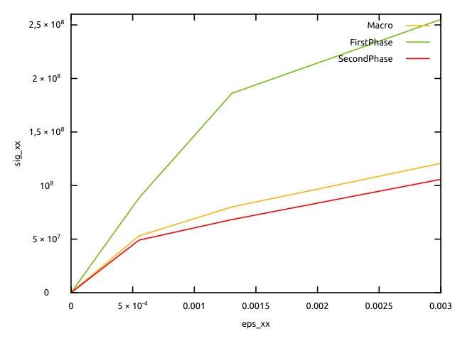

% Implementation of Taylor/Voigt homogenization scheme with a BehaviourVariable
% Helfer Thomas/Martin Antoine
% February 6, 2025

\newcommand{\D}{\mathrm{d}}
\newcommand{\tenseur}[1]{\underline{#1}}
\newcommand{\tenseurq}[1]{\underline{\mathbf{#1}}}
\newcommand{\tns}[1]{\underset{\tilde{}}{\mathbf{#1}}}
\newcommand{\transpose}[1]{#1^{\mathop{T}}}

\newcommand{\tsigma}{\underline{\sigma}}
\newcommand{\sigmaeq}{\sigma_{\mathrm{eq}}}

\newcommand{\tepsilonto}{\underline{\epsilon}^{\mathrm{to}}}
\newcommand{\tepsilonel}{\underline{\epsilon}^{\mathrm{el}}}

\newcommand{\tepsilonp}{\underline{\epsilon}^{\mathrm{p}}}
\newcommand{\tdepsilonp}{\underline{\dot{\epsilon}}^{\mathrm{p}}}

\newcommand{\tDq}{\underline{\mathbf{D}}}
\newcommand{\trace}[1]{\mathrm{tr}\paren{#1}}
\newcommand{\Frac}[2]{{\displaystyle \frac{\displaystyle #1}{\displaystyle #2}}}
\newcommand{\deriv}[2]{{\displaystyle \frac{\displaystyle \partial #1}{\displaystyle \partial #2}}}
\newcommand{\dtot}{{\mathrm{d}}}
\newcommand{\paren}[1]{\left(#1\right)}
\newcommand{\nom}[1]{\textsc{#1}}
\newcommand{\bts}[1]{\left.#1\right|_{t}}
\newcommand{\mts}[1]{\left.#1\right|_{t+\theta\,\Delta\,t}}
\newcommand{\ets}[1]{\left.#1\right|_{t+\Delta\,t}}

We present here an implementation of Taylor homogenization scheme [@taylor_1938] using `BehaviourVariable` keyword.
This implementation allows using arbitrary local behaviours on each phase.

This tutorial first recalls the presentation of `Taylor` scheme, which is the generalization
of Voigt scheme for non-linear behaviours. The derivation is very simple and allows to
compute the tangent operator without resolving any non-linear problem. The local tangent operators
are however needed.

# Taylor homogenization scheme

Taylor/Voigt scheme makes the hypothesis of a uniform strain $\tenseur E$
on all phases. Macroscopic stress $\tenseur \Sigma$, is defined as the average of local stresses:
  \begin{aligned}
    \tenseur \Sigma   (\tenseur E)&= \sum_{i=1}^{N}f_i\,\tsigma^i (\tenseur E) \\
  \end{aligned}
where $N$ is the number of phases, $f_i$ is the volume fraction of phase $i$ and $\tsigma^i$ is the strain field in phase $i$ (given by the behaviour law).
The macroscopic tangent operator is given by
  \begin{aligned}
    \dfrac{\D \tenseur \Sigma}{\D \tenseur E}   (\tenseur E)&= \sum_{i=1}^{N}f_i\,\dfrac{\D \tsigma^i}{\D \varepsilon^i}(\tenseur E) \\
  \end{aligned}

# Implementation in MFront

The files `Plasticity.mfront` and `Taylor.mfront` are available in the `MFrontGallery` project, [here](https://github.com/thelfer/MFrontGallery/tree/master/generic-behaviours/homogenization/).

It is possible to implement this homogenization scheme through a `Behaviour`.
This `Behaviour` must call the behaviour laws of each phase.
So, an interesting solution is to use a `BehaviourVariable`.

## Creation of the `@BehaviourVariable`

First step consists in creating variables which will allow to compute, on each phase,
the local stress as a function of the local strain, and the local tangent operator as a function
of the local strain. In short, it's about being able to easily call a local `Behaviour` in the macroscopic `Behaviour`.
These local `Behaviour` must be implemented before in `.mfront` files.

For the sake of simplicity, we will assume that we have 2 phases whose behaviour
is elastoplastic with a Von Mises criterion with linear isotropic hardening. Material parameters
are different between the phases. This behaviour is implemented in the file
`Plasticity.mfront`, with the yield stress and hardening modulus as parameters.

~~~~ {#Plasticity .cpp .numberLines}
@DSL IsotropicPlasticMisesFlow;
@Behaviour Plasticity;
@Epsilon 1e-14;
@UseQt true;

@MaterialProperty stress H;
@MaterialProperty stress s0;

@FlowRule {
  f = seq - H * p - s0;
  df_dseq = 1;
  df_dp = -H;
}
~~~~~~~~~~~~~~~~~~~~~~~~~~~~~~~~~~~~~~~~~~~~~~~~~

Then, in `Taylor.mfront`,
we use the `Default` `DSL`:

~~~~ {#Taylor .cpp .numberLines}
@DSL Default;
@Behaviour Taylor;
~~~~~~~~~~~~~~~~~~~~~~~~~~~~~~~~~~~~~~~~~~~~~~~~~

Creation of `BehaviourVariable` is done as follows:

~~~~ {#Taylor .cpp .numberLines}
@BehaviourVariable b1 {
file: "Plasticity.mfront",
variables_suffix: "1",
external_names_prefix: "FirstPhase",
shared_external_state_variables: {".+"}
};
~~~~~~~~~~~~~~~~~~~~~~~~~~~~~~~~~~~~~~~~~~~~~~~~~

- the `@BehaviourVariable` block creates
a variable named `b1`, representing our behaviour law on phase $1$.
- the file implementing the behaviour law of phase $1$ is specified by line $2$.
- the variables of the behaviour law can be used
with the name used by the implemented `Behaviour`, with an added suffix,
here $1$ for phase $1$. For example, we can use
`eto1`, the total strain of phase $1$, or `sig1` for the
stress, and the same is true for other variables, e.g.
`eel1` or `p1` for the cumulative plastic strain.
- the name of the variables outside, that is to say for example in
the finite element code calling `MFront`, will have an added prefix
`FirstPhase`, as specified by line $4$.

For more details on using `@BehaviourVariable`,
the reader can see the [documentation of BehaviourVariable](behaviour-variable.html)

Finally, it will be necessary to create 2 `@BehaviourVariable`
for the 2 phases.

## Implementation of Taylor scheme

After having defined the `BehaviourVariable`, we can
implement the `@Integrator` block. Before this block,
We specify that the tangent operator will be calculated inside the
`@Integrator` block, given its very simple form,
in the case of the Taylor scheme. This is done via `@ProvidesTangentOperator`.

~~~~ {#Integrator .cpp .numberLines}
@ProvidesTangentOperator;

@Integrator{
  b1.deto=deto;
  
  constexpr auto b1_smflag = TangentOperatorTraits<MechanicalBehaviourBase::STANDARDSTRAINBASEDBEHAVIOUR>::STANDARDTANGENTOPERATOR;
  const auto r1 = b1.integrate(b1_smflag,CONSISTENTTANGENTOPERATOR);
  StiffnessTensor Dt1 = b1.getTangentOperator();
 
  b2.deto=deto;
  
  constexpr auto b2_smflag = TangentOperatorTraits<MechanicalBehaviourBase::STANDARDSTRAINBASEDBEHAVIOUR>::STANDARDTANGENTOPERATOR;
  const auto r2 = b2.integrate(b2_smflag,CONSISTENTTANGENTOPERATOR);
  StiffnessTensor Dt2 = b2.getTangentOperator();
  
  updateAuxiliaryStateVariables(b1);
  updateAuxiliaryStateVariables(b2);

  sig = f * sig1 + (1 - f) * sig2;
  if (computeTangentOperator_) {
    Dt = f * Dt1 + (1 - f) * Dt2;
  }
}
~~~~

We can see that we start by integrating the local behaviour.
Let's look on the first phase:

- line $4$ specifies the strain increment on phase $1$,
in this case identical to the macroscopic strain increment `deto`.
Furthermore, `b1.eto` is automatically initialized to `eto1`
before the integration of behaviour `b1`. This is automatic, and corresponds
to call `initialize(b1)` before integration.
- the integration of behaviour `b1` is done via line
$7$ with the `integrate` method which takes two arguments (see the documentation
from `@BehaviourVariable` for more details). `r1` is a boolean which
is $1$ if the integration went well.
- we retrieve the tangent operator via the `getTangentOperator` method.

Once local integrations have been carried out,
it is necessary to update the auxiliary variables
associated with each `@BehaviourVariable`. This is
done on lines $16$ and $17$ with the `updateAuxiliaryStateVariables` function.
This updates `eto1` (resp. `sig1`) to the strain (resp. stress)
obtained at the end of the integration of `b1`, and the same for the other variables
like `eel1` or `p1`. The same goes for `b2`.

Finally, the computation of macroscopic stress is given
by Taylor scheme (average of local stresses)
at line $19$, and the macroscopic tangent operator
is computed in the sequel.

Note that the following property had been defined before
the `@Integrator` block:

~~~~ {#fraction .cpp .numberLines}
@MaterialProperty real f;
f.setEntryName("FirstPhaseFraction");
~~~~~~~~~~~~~~~~~~~~~~~~~~~~~~~~~~~~~~~~~~~~~~~~~

# Results

We then use `MTest` to simulate a uniaxial tensile test.

MTest file (`Taylor.mtest`) is the following:

~~~~ {#Taylor_mtest .mtest .numberLines}
@ModellingHypothesis 'Tridimensional';
@Behaviour<Generic> 'src/libBehaviour.so' 'Taylor';
@MaterialProperty<constant> 'FirstPhaseYoungModulus'     150.e9;
@MaterialProperty<constant> 'FirstPhasePoissonRatio'       0.35;
@MaterialProperty<constant> 'H1'                50.e9;
@MaterialProperty<constant> 's01'               200.e6;
@MaterialProperty<constant> 'SecondPhaseYoungModulus'     90.e9;
@MaterialProperty<constant> 'SecondPhasePoissonRatio'       0.3;
@MaterialProperty<constant> 'H2'                30.e9;
@MaterialProperty<constant> 's02'               50.e6;
@MaterialProperty<constant> 'FirstPhaseFraction' 0.1;
@ExternalStateVariable 'Temperature' 293.15;
@ImposedStrain 'EXX' {0 : 0, 1 : 3e-3};
@Times {0, 1 in 200};
~~~~~~~~~~~~~~

Macroscopic and local stresses are represented
below as functions of the uniform axial strain:

We can see, as expected, that the macroscopic stress
is an average of the local stresses. When the lowest yield
stress is reached, the corresponding phase becomes plastic.
The macroscopic tangent module is then reduced, which has repercussions
on the macroscopic stress.
The other phase becomes plastic later. Even if its evolution remains
elastic, we can see that its axial stress is also
impacted by the plastic transition of the other phase, because of the
non-axial plastic strains appeared in this latter phase.

<!-- Local IspellDict: english -->
