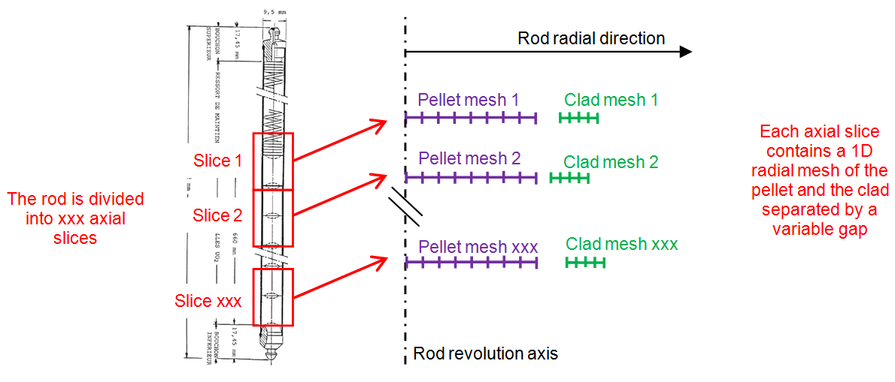

% Description of the `Cyrano3` interface
% Thomas Helfer
% 9/03/2018

\newcommand{\tenseur}[1]{\underline{#1}}
\newcommand{\tenseurq}[1]{\underset{=}{\mathbf{#1}}}
<!-- the previous works better than the standard solution: -->
<!-- \newcommand{\tenseurq}[1]{\underline{\underline{{\mathbf{#1}}}}} -->
\newcommand{\tns}[1]{{\underset{\tilde{}}{\mathbf{#1}}}}
\newcommand{\transpose}[1]{{#1^{\mathop{T}}}}

\newcommand{\paren}[1]{\left(#1\right)}
\newcommand{\trace}[1]{\mathrm{tr}\left(#1\right)}
\newcommand{\tsigma}{\underline{\sigma}}
\newcommand{\epsilonto}{\varepsilon^{\mathrm{to}}}
\newcommand{\tepsilonto}{\underline{\varepsilon}^{\mathrm{to}}}

\newcommand{\Frac}[2]{{{\displaystyle \frac{\displaystyle #1}{\displaystyle #2}}}}
\newcommand{\deriv}[2]{{\displaystyle \frac{\displaystyle \partial #1}{\displaystyle \partial #2}}}
\newcommand{\sderiv}[2]{{\displaystyle \frac{\displaystyle \partial^{2} #1}{\displaystyle \partial #2^{2}}}}
\newcommand{\dtot}{{{\mathrm{d}}}}
\newcommand{\derivtot}[2]{{\displaystyle \frac{\displaystyle \dtot #1}{\displaystyle \dtot #2}}}
\newcommand{\grad}[1]{{\displaystyle \overset{\longrightarrow}{\nabla} #1}}
\newcommand{\Grad}[1]{\mathop{\mathrm{Grad}\,#1}}
\newcommand{\diver}[1]{{\displaystyle \vec{\nabla} . #1}}
\newcommand{\divergence}{\mathop{\mathrm{div}}}
\newcommand{\Divergence}{\mathop{\mathrm{Div}}}

\newcommand{\bts}[1]{\left.#1\right|_{t}}
\newcommand{\mts}[1]{\left.#1\right|_{t+\theta\,\Delta\,t}}
\newcommand{\ets}[1]{\left.#1\right|_{t+\Delta\,t}}

The industrial reference software CYRANO3 has been developed by EDF for
more than 20 years to simulate the PWR fuel thermo-mechanical behaviour
under nominal and incidental conventional operating conditions (See
@thouvenin_edf_2010).

The code integrates extensive knowledge and know-how based on more than
30 years of national and international research and feedback in the
framework of nuclear materials under irradiation. It is part of the
PLEIADES platform jointly developed by EDF and CEA, and validated on an
extensive data base including more than 900 irradiated fuel rods
examination and validation results.

The interface with MFront has been presented during the LWR Fuel
Performance Meeting in 2015 (Zurich, Switzerland), see
@petry_advanced_2015:

- [abstract](https://github.com/thelfer/tfel-doc/blob/master/Papers/TopFuel2015/topfuel2015.pdf)
- [poster](https://github.com/thelfer/tfel-doc/blob/master/Papers/TopFuel2015/topfuel2015-poster.pdf)

# Supported modelling hypotheses

The `Cyrano3` code is based on a 1D description of the fuel rods using a
finite element kernel to solve the thermal and mechanical radial
equilibrium at different axial positions.

{#fig:CyranoPrinciple width=100%}

The principle of the geometrical discretisation of a single rod is
illustrated in Figure @fig:CyranoPrinciple. Due to revolution
axisymmetry, only radial and axial directions are discretised. The fuel
rod is axially divided in slices, leading to the so-called "1,5D"
typical axisymmetric scheme - each slice being represented by a
one-dimensional radial mesh including a pellet and a clad separated by a
variable gap.

To solve the mechanical equilibrium of a slice, two distinct hypotheses
concerning the axial direction are supported:

- generalised plane stress (uniform axial stress)
- generalised plane strain (uniform axial strain)

# Finite strain modelling

`Cyrano3` finite strain modelling is based on the approach described by
T. Helfer (See @helfer_extension_2015) which allows to easily extend
small strain mono-dimensional code to support finite strain modelling.

## Kinematic and mechanical equilibrium

This approach relies on the the fact that the direct link between the
deformation gradient \(\tns{F}\) and the linearized strain
\(\tepsilonto\) in monodimensional modelling:

\[
  \tns{F} = \tns{I} + \tepsilonto
\]

The mechanical equilibrium is expressed in the reference configuration:

\[
  \Divergence \tns{\Pi} = \vec{0}  
\]

where :

- the gradients in the divergence operator \(\Divergence\) are computed
  in the reference configuration.
- \(\tns{\Pi}\) is the first Piola-Kirchoff stress (which is equal to
  the nominal stress in \(1D\), as all tensors are symmetric).

### Boundary conditions

If \(\dtot\,\vec{f}\) is the force applied to an infinitesimal surface
\(\dtot\,\vec{s}\) in the current configuration which maps to the
infinitesimal surface \(\dtot\,\vec{S}_{0}\) in the reference
configuration, the first Piola-Kirchoff stress \(\tns{\Pi}\) has the
following property:

\[
\dtot\,\vec{f}=\tns{\Pi}\,\colon\,\dtot\,\vec{S}_{0}  
\]

For pressure loading, one have:
\[
\dtot\,\vec{f}=-P\,\dtot\,\vec{s}
\]

#### Radial boundary conditions

In 1D, the normal is constant, so the radial component \(\Pi_{rr}\) of
\(\tns{\Pi}\) satisfies:

\[
\Pi_{rr}=-P\,\Frac{S}{S_{0}}
\]

Here, the surface is defined by:
\[
S=2\,\pi\,R\,H
\]
where \(R\) is the actual radius and \(H\) is the actual height. Thus,

\[
\Pi_{rr}=-P\,\Frac{R}{R_{0}}\,\Frac{H}{H_{0}}=-P\,\paren{1+\Frac{u_r\paren{R_{0}}}{R_{0}}}\,\epsilonto_{zz}
\]

where \(u_{r}\) is the radial displacement, \(R_{0}\) is the initial
radius and \(\epsilonto_{zz}\) is the axial strain.

This relations are exactly the same as in small strain analysis, except
for the dependency of \(S\) with the actual radius which adds additional
terms to the stiffness matrix.

In generalised plane stress, the axial strain is not known. As discussed
later, the axial strain is generally computed by the behaviour to ensure
that the axial stress is equal to the prescribed value. This provides a
way to compute the axial strain for the computation of the radial force,
but one can not derive the exact stiffness matrix of the system. Another
simpler solution is to consider the axial strain as constant during the
time step for the computation of the radial forces.

#### Axial boundary conditions

For a closed pipe, the axial force applied to the tube can be computed
as follows:

\[
F = P_{i}\,S^{c}_{i} - P_{e}\,S^{c}_{e}
\]

where:

- \(P_{i}\) is the internal pressure.
- \(P_{e}\) is the external pressure.
- \(S^{c}_{i}\) is the internal surface of the upper cap in the current
  geometry, defined by \(S^{c}_{i}=\pi\,R_{i}^{2}\).
- \(S^{c}_{e}\) is the external surface of the upper cap in the current
  geometry, defined by \(S^{c}_{e}=\pi\,R_{e}^{2}\)..

Here, the pressure is assumed constant over the time step : the
sensibility with the geometrical changes is neglected. Dependency of the
pressure with the volume can also be taken into account, as in `MTest`
if all the slices are homogeneous, which is almost never the case.

##### Generalised plane stress

In generalised plane stress, \(\Pi_{zz}\) is assumed uniform and can
determined by:

\[
F = \Pi_{zz}\,\paren{\paren{S^{c}_{e}}^{0}-\paren{S^{c}_{i}}^{0}} = P_{i}\,S^{c}_{i} - P_{e}\,S^{c}_{e}
\]

This relation is exactly the same as in small strain analysis, except
for the dependency of \(S^{c}_{i}\) and \(S^{c}_{e}\) with the actual inner and
outer radius which adds additional terms to the stiffness matrix.

##### Generalised plane strain

In generalised plane strain, the total force is given by:

\[
F = 2\,\pi\,\int_{R_{i}^{0}}^{R_{e}^{0}}\Pi_{zz}\,R\,dR = P_{i}\,S^{c}_{i} - P_{e}\,S^{c}_{e}
\]

This is exactly the same relation as in same strain analysis, except for
the dependency of \(S^{c}_{i}\) and \(S^{c}_{e}\) with the actual inner
and outer radius which adds additional terms to the stiffness matrix

## Finite strain mechanical behaviours

Currently, the `MFront` interface only supports strain-based behaviour
based on the Hencky strain measure, as described by Miehe et al. (See
@miehe_anisotropic_2002).

### Support of the Hencky strain measure

The Hencky strain measure is defined by:

\[
\tenseur{\varepsilon}_{\log}^{\mathrm{tot}}=\Frac{1}{2}\,\log{\transpose{\tns{F}}\,\cdot\,\tns{F}}
\]

In \(1D\), this relation boils down to (See @helfer_extension_2015):

\[
  \left(\tepsilonto_{\text{log}}\right)_{i}=\log\paren{1+\tepsilonto_{i}}  
\]

Based on energetic consideration, this strain measure also defined its
dual stress denoted \(\tenseur{T}\). The relation between \(\tns{\Pi}\)
and \(\tenseur{T}\) is fairly complex in \(3D\), but quite simple in
\(1D\):

\[
  \Pi_{i} = \Frac{T_{i}}{1+\left(\tepsilonto\right)_{i}}
\]

#### Generalised plane stress

The generalised plane stress hypothesis is treated by introducing, at
each integration point, an additional unknown: the axial logarithmic
strain. Using the previous equations, the implicit equation associated
with this unknown is:

\[
\exp\paren{\left(\tepsilonto_{\text{log}}\right)_{zz}}\,T_{zz}= \Pi_{zz}^{(i)}
\]

where \(\Pi_{zz}^{(i)}\) is the prescribed axial stress.

This equation is automatically added by the Hooke stress potential used
by the `StandardElasticity` and `StandardViscoplasticity` bricks.

# References