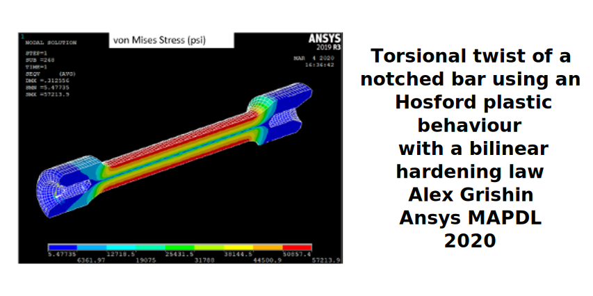
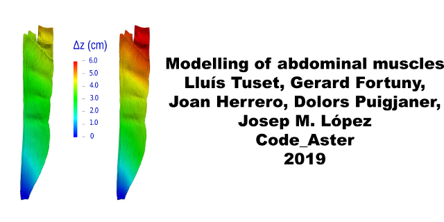
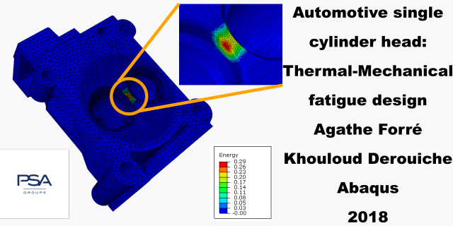
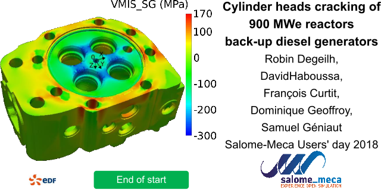
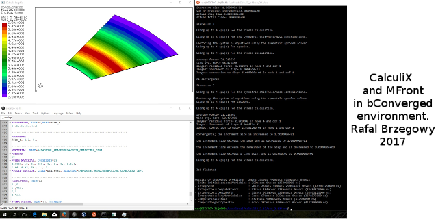
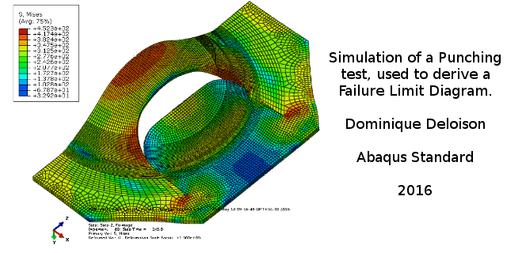
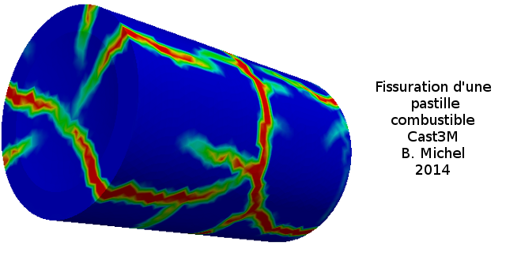
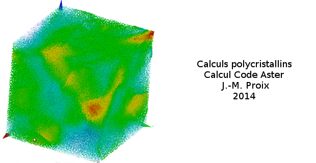
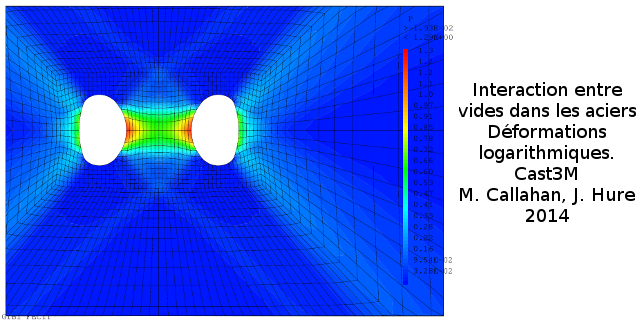

  <ul class="slides">
	<li></li>
	<li></li>
	<li></li>
	<li>
		<video style="display:block; margin: 0 auto;" width="640" height="320" controls>
		<source src="media/DeepDrawing.mp4" type="video/mp4">
		Your browser does not support the video tag.
		</video>
	</li>
	<li></li>
	<li></li>
    <li></li>
	<li></li>
    <li></li>
    <li></li>
    <li></li>
	<li></li>
	<li></li>
	<li></li>
  </ul>
  
  

# Overview

`TFEL` is a collaborative development of
[CEA](http://www.cea.fr/english-portal "Commissariat à l'énergie
atomique") and [EDF](http://www.edf.com/ "Électricité de France").

`MFront` is a code generator which translates a set of closely related
domain specific languages into plain [C++](http://isocpp.org/) on top
of the `TFEL` library. Those languages cover three kinds of material
knowledge:

- [material properties](material-properties.html) (for instance the
  Young's modulus, the thermal conductivity, etc.)
- [mechanical behaviours](behaviours.html). Numerical performance of
  generated mechanical behaviours were given a particular
  attention. [Various benchmarks](benchmarks.html) show that `MFront`
  implementations are competitive with native implementations
  available in the `Cast3M`, `Code-Aster`, `Abaqus Standard` and
  `Cyrano3` solvers.
- [simple point-wise models](models.html), such as material swelling
  used in fuel performance codes.

A set of interfaces are provided for various solvers:

- the [`Cast3M`](http://www-cast3m.cea.fr) finite element solver. This
  interface is described [here](castem.html).
- the [`Code_Aster`](http://www.code-aster.org) finite element
  solver. This interface is described [here](aster.html)
- the
  [`Abaqus Standard`](http://www.3ds.com/products-services/simulia/products/abaqus/abaqusstandard/)
  finite element solver. This interface is described
  [here](abaqus.html).
- the
  [`Abaqus Explicit`](http://www.3ds.com/products-services/simulia/products/abaqus/abaqusexplicit/)
  finite element solver. This interface is described
  [here](abaqus.html).
- the
  [`CalculiX`](http://www.calculix.de/)
  finite element solver. This interface is described
  [here](calculix.html).
- the [`ANSYS Mechanical APDL`](https://www.ansys.com/) finite element
  solver. This interface is described [here](ansys.html).
- the [`ZeBuLoN`](http://www.zset-software.com/products/zebulon)
  finite element solver. This interface is described [here](zmat.html).
- the `TMFFT` and the
  [`AMITEX_FFTP`](https://amitexfftp.github.io/AMITEX/)
  Fast Fourier Transform solvers developed internally at
  [CEA](http://www.cea.fr/english-portal "Commissariat à l'énergie
  atomique"). Note that
  [`AMITEX_FFTP`](http://www.maisondelasimulation.fr/projects/amitex/html/)
  is distributed under a free license for research and education
  purpose. Those solvers reuse the interface developed for the
  [`Cast3M`](http://www-cast3m.cea.fr) finite element solver.

For material properties, various interfaces are also provided and
cover the following languages: `C`, `C++`, `python`, `fortran`, etc.

# History

- Versions prior to 0.1 were developed by T. Helfer as an independent project.
- Starting with version 1.0, TFEL was developed as a sub-project of
  the PLEIADES platform.
- Versions higher than 2.0 are open-source and distributed under the
  [GPL](https://gnu.org/licenses/gpl.html "GNU General Public
  License") license with linking exception.

# Licences

`TFEL` version prior to 0.1 were released under both the LGPL and the
CECILL-B licences. A copy of those licences are included in the
distributions of TFEL.

`TFEL` versions 1.x were developed by CEA within the PLEIADES
project. Since svn revision 584, TFEL was part of the `PLEIADES`
project.

Starting from versions 2.x, TFEL has been publicly released under either
the GPL or the CECILL-A licence. A copy of those licences are delivered
with the sources of TFEL. CEA or EDF may also distribute this project
under specific licensing conditions. Since 2023, the linking exception
clause was added to the GPL licence.

Copyright (C) 2006-2013 CEA/DEN. All rights reserved. 
Copyright (C) 2014-2025 CEA/DEN, EDF R&D. All rights reserved. 

<!-- Local IspellDict: english -->
