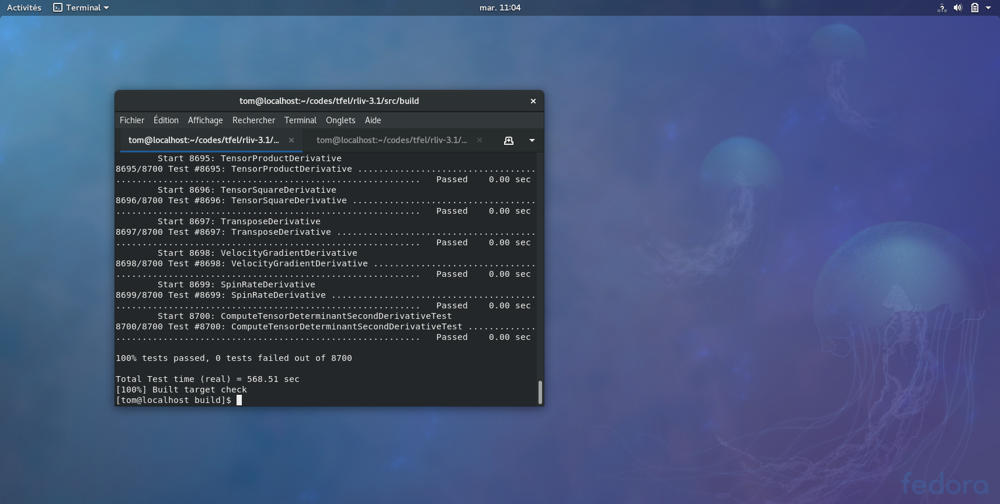
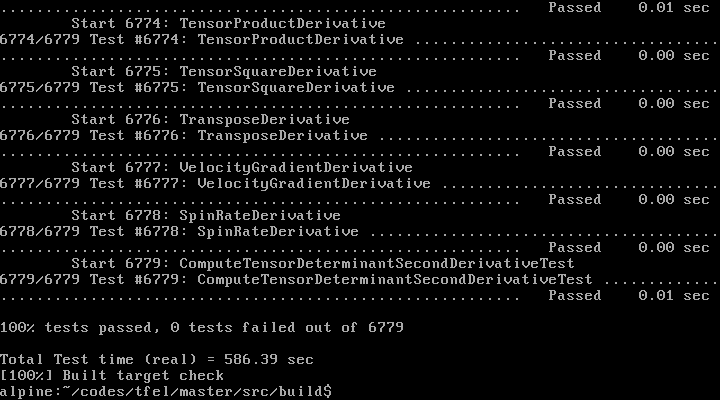
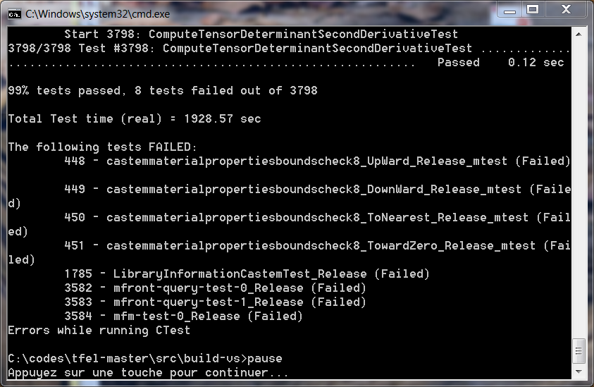
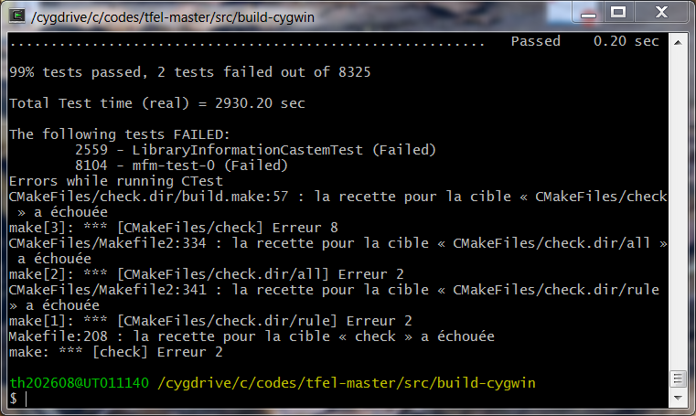
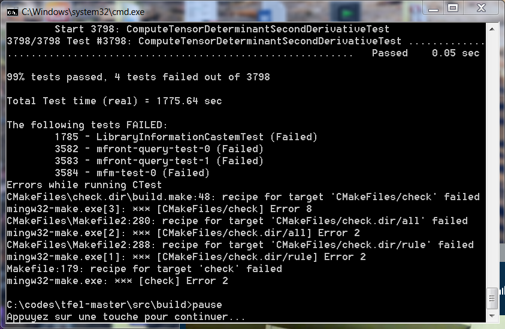
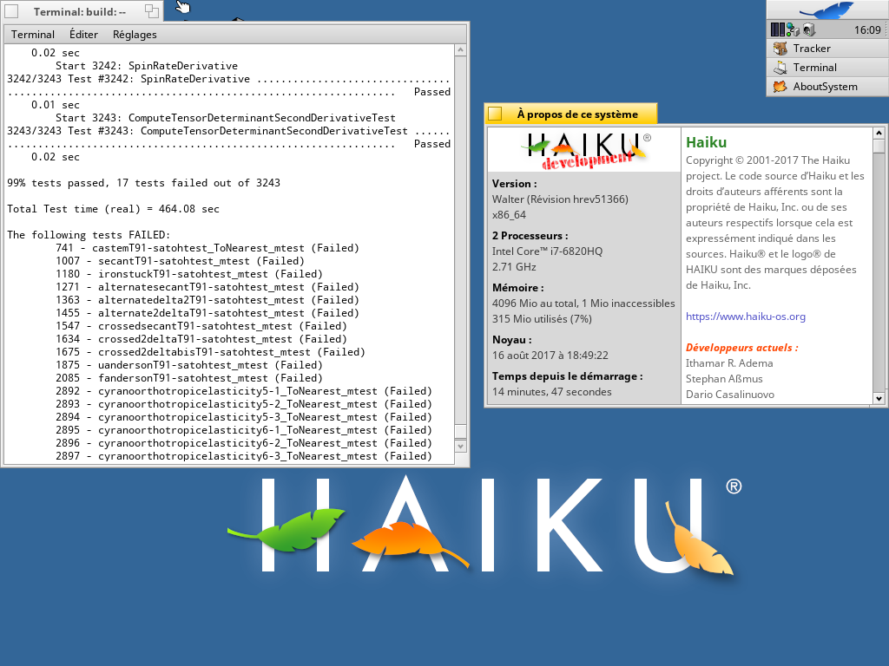

% New functionalities of the 3.1 version of `TFEL`, `MFront` and `MTest`
% Thomas Helfer
% 2017

\newcommand{\absvalue}[1]{{\left|#1\right|}}
\newcommand{\Frac}[2]{\displaystyle\frac{\displaystyle #1}{\displaystyle #2}}
\newcommand{\paren}[1]{\left(#1\right)}
\newcommand{\deriv}[2]{\Frac{\partial #1}{\partial #2}}
\newcommand{\tenseur}[1]{\underline{#1}}
\newcommand{\tenseurq}[1]{\underline{\underline{\mathbf{#1}}}}
\newcommand{\sigmaeq}{\sigma_{\mathrm{eq}}}
\newcommand{\tsigma}{\underline{\sigma}}
\newcommand{\trace}[1]{{\mathrm{tr}\paren{#1}}}
\newcommand{\sigmaH}{\sigma_{H}}

The page declares the new functionalities of the 3.1 version of
the `TFEL` project.

The `TFEL` project is a collaborative development of
[CEA](http://www.cea.fr/english-portal "Commissariat à l'énergie
atomique") and [EDF](http://www.edf.com/ "Électricité de France")
dedicated to material knowledge manangement with special focus on
mechanical behaviours. It provides a set of libraries (including
`TFEL/Math` and `TFEL/Material`) and several executables, in
particular `MFront` and `MTest`.

`TFEL` is available on a wide variety of operating systems and
compilers.

# Highlights

## The gallery and the `MFrontGallery` project

The `MFront` gallery is meant to present well-written implementation
of behaviours that will be updated to follow `MFront` latest
evolutions. In each case, the integration algorithm is fully
described.

<!-- `MFrontGallery` is a `github` repository where the implementation of -->
<!-- the behaviour described in the gallery can be found. The -->

The `MFrontGallery` project is a `cmake` project which builds material
libraries for all the codes and/or languages supported by `MFront`
based on the implementation described in the gallery. The purpose of
this project is twofold:

- it delivers ready-to-use shared libraries for a wide variety of
  phenomena.
- it provides an example of how to build a compilation project for
  `MFront` files, including lots of useful `cmake` macros, recipes to
  build shared libraries and add tests.

The `MFrontGallery` project is available as a `github` repository:
<https://github.com/thelfer/MFrontGallery>

### Hyperelastic behaviours

The implementation of various hyperelastic behaviours can be found
[here](hyperelasticity.html):

- [Signorini](signorini.html)
- [Ogden](ogden.html)

### Hyperviscoelastic behaviours

The following page describes how to implement standard
hyperviscoelastic behaviours based on the development in Prony series:

<http://tfel.sourceforge.net/hyperviscoelasticity.html>

### Plasticity

- [IsotropicLinearHardeningPlasticity](gallery/plasticity/IsotropicLinearHardeningPlasticity.mfront)
- [IsotropicLinearKinematicHardeningPlasticity](gallery/plasticity/IsotropicLinearKinematicHardeningPlasticity.mfront)
- The implementation of an orthotropic plastic behaviour with
  isotropic linear hardening is described
  [here](orthotropiclinearhardeningplasticity.html).
- The implementation of a perfect plastic behaviour based on the
  Hosford equivalent stress is described [here](hosford.html).
- The implementation of a perfect plastic behaviour based on the
  Green yield criterion is described [here](greenplasticity.html).

### Viscoplasticity

This following article shows how to implement an isotropic
viscoplastic behaviour combining isotropic hardening and multiple
kinematic hardenings following an Armstrong-Frederic evolution of the
back stress:

<http://tfel.sourceforge.net/isotropicplasticityamstrongfrederickinematichardening.html>

## Support for additional yield criteria

 and the von Mises
 stress in plane stress"){width=70%}

The `TFEL/Material` provides functions to handle advanced yield
criteria, such as:

- the Hosford yield criterion (see @hosford_generalized_1972). The
  associated functions are described in Paragraph @sec:hosford.
- the Barlat yield criterion (see @barlat_linear_2005). The associated
  functions are described in Paragraph @sec:barlat.

Following Scherzinger (see @scherzinger_return_2017 for details),
special care has been taken to avoid overflow in the evaluation of the
yield stress.

Those two yield criteria are based on the eigenvalues and of the
stress. The computation of the second derivative, required to build
the jacobian of the implicit system, is thus quite involved.

## Enhanced numerical reproducibility and stability

This release has seen lot of work in the overall numerical
reproducibility and stability of `TFEL` algorithms and lead to
duplicate most of tests, who are now run using different rounding
modes.

Tests based on `mtest` are run \(5\) times, one for each of the four
rounding modes defined in the `IEEE754` norm, plus one time using a
specific mode which randomly switches between those modes at various
stages of the computations.

Although very crude with respect to advanced approaches such as the
`CADNA` library (see
[@lamotte_cadna_c:_2010,@universite_pierre_et_marie_curie_cadna:_])
or the `verrou` software, developped by `EDF` on top of `valgrind`
(see @fevotte_verrou:_2016), those checks, combined with demanding
convergence criteria, have proven to be helpful and led to several
developments: see for example the section @sec:eigensolvers which
compares various algorithms to find the eigen vectors of symmetric
tensors.

> **Note**
>
> Old versions of the `libm` library (such as the one package with
> `Debian` `Wheezy` and those found on some exotic systems, such as
> `Haiku`), do not support working in other rounding mode than the
> default one (rounding to the nearest) and can crash (segfaults !).
> 
> Disabling changing the rounding mode on those systems can be
> specified by passing `-DTFEL_BROKEN_LIB_MATH=ON` to `cmake`.

### Enabling the `-ffast-math` with `GCC` an `clang`

One side effect of the work on the enhanced numerical stability is
that the `-ffast-math` flag of `GCC` and `clang` can now be enabled
more safely. This significantly improve the performances of the
generated code by allowing optimizations that do not preserve strict
IEEE compliance. For instance, the overall tests delivered with `TFEL`
runs almost \(10\,\%\) faster with this option enabled.

Most of those optimizations are used by default by the `Intel`
compiler.

There are two potential issues with this flags:

- due to the lack of the strict IEEE compliance, the resulting code
  can be less portable. This can also lead to less accurate and more
  unstable code. In `TFEL/MFront`, it has been seen that the algorithm
  used to compute the eigenvalues and the eigenvectors of symmetric
  tensors can be affected. New algorithms, more stable but less
  efficient, have been introduce, as discussed below.
- under `GCC`, various mathematical functions of the standard library
  behaves in an unexpected manner and can not be trusted. For example,
  the `isnan` function returns `true`, even if its argument is `NaN`.
  This issue has been overcome by implementing proper versions of the
  `fpclassify`, `isnan`, `isfinite` functions, as described below in
  paragraph @sec:isnan.

To build `TFEL` with the `-ffast-math`, just pass the
`-Denable-fast-math=ON` option to `cmake`.

> **Note**
>
> Even if `TFEL` is not built with the `-ffast-math`, this option can
> be used to compile `MFront` files, by specifying the
> `--obuild=level2` option to `MFront`, as follows:
>
> ~~~~{.sh}
> $ mfront --obuild=level2 --interface=....
> ~~~~

## Single crystal behaviours in `MFront`

Support for writting single crystal behaviours have been greatly
improved thanks to the `TFELNUMODIS` library, which borrows code for
the `NUMODIS` project.

The following new keywords are now available in `MFront`:

- `@CrystalStructure`. The following crystal structures are supported:
    - `Cubic`: cubic structure.
    - `BCC`: body centered cubic structure.
    - `FCC`: face centered cubic structure.
    - `HCP`: hexagonal closed-packed structures.
- A single slip systems family can be defined by one of the following
  synonymous keywords: `@SlidingSystem`, `@GlidingSystem` or
  `@SlipSystem`. Several slip systems families ca be defined by
  `@SlidingSystems`, `@GlidingSystems` or `@SlipSystems`.
- Two kinds of interaction matrix are supported:
   - The first interaction is defined through the `@InteractionMatrix`
     keyword and is meant to describe the effect of dislocations on
     hardening.
   - The second interaction is defined through the
     `@DislocationsMeanFreePathInteractionMatrix` keyword and is meant
	 to evaluate the effect of all the dislocations on the mean free
     path of dislocations of a specific system.

Those keywords are fully documented on
[this page](singlecrystal.html). As most of the information relative
to the slip system and the interaction matrix are automatically
generated, the use of the `mfront-query` tool is strongly advised.

## The `DDIF2` brick

`DDIF2` is the name of a description of damage which formulation is
inspired by softening plasticity. This description is the basis of
most mechanical behaviour used in CEA' fuel performance.

The `DDIF2` brick can be used in place of the `StandardElasticity`
brick. Internally, the `DDIF2` brick is derived from the
`StandardElasticity` brick, so the definition of the elastic
properties follows the same rules.

### Local coordinate

This description is currently limited to initially isotropic
behaviours, but the damage is described in three orthogonal
directions. Those directions are currently fixed with respect to the
global system. For \(2D\) and \(3D\) modelling hypotheses, those
directions are determined by a material property, which external name
is `AngularCoordinate`, giving the angular coordinate in a cylindrical
system.

### Material properties associated with damage

The description of damage is based on the following material
properties:

- the fracture stresses in each direction. Two options can be used to
  described them:
    - if the `fracture_stress` option is used, the fracture stresses
	  are equal in each directions.
	- otherwise, the `fracture_stresses` keyword can be used to
      describe the fracture stresses in each of the three directions.
- the softening slopes stresses in each direction. Two options can be
  used to described them:
    - if the `softening_slope` option is used, the softening slopes
	  are equal in each directions.
	- otherwise, the `softening_slopes` keyword can be used to
      describe the softening slopes in each of the three directions.

In each case, a material property must be given as a value or as an
external `MFront` file.

#### Fracture energies

Following Hillerborg approach (see @hillerborg_analysis_1976),
softening slopes can be related to fracture energies by the mesh
size. Thus, rather than the softening slopes, the user can provide the
fracture energies through one the `fracture_energy` or
`fracture_energies` options. In this case, an array of three material
properties, which external name is `ElementSize`, is automatically
declared.

### External pressure effect

The effect of external pressure on the crack surface can be taken into
account using the option `handle_pressure_on_crack_surface`. If this
option is true, an external state variable called `pr`, which external
name is `PressureOnCrackSurface`, is automatically declared.

### Example

Here is an example of a behaviour based on the `DDIF2` brick:

~~~~{.cpp}
@DSL Implicit;
@Author Thomas Helfer;
@Date 25/10/2017;
@Behaviour DDIF2_4;

@Brick DDIF2 {
 fracture_stresses : {150e6,150e6,1e11},
 softening_slope : -75e9,
 handle_pressure_on_crack_surface : true
};
~~~~

Here, the fracture stresses are different in each direction. The
softening slope is the same in each direction. When a crack is open,
the external pressure is applied on the crack surface.

## The `@StrainMeasure` keyword

In previous versions of `TFEL`, the user would write strain based
behaviour. The definition of the strain, and by energetic duality the
definition of the stress, were not part of the behaviour.

This is very important for a generic behaviour, which describe a
physical phenomenon with no reference to a particular material, but it
is not appropriate for a specific behaviour, identified for a specific
material, because the definition of the strain is intrinsically part
of the behaviour.

Three strain measure are currently supported:

- the Hencky strain (see @miehe_anisotropic_2002).
- the Green-Lagrange strain.
- the linearised strain.

The two first strain measures are suitable for use in finite strain
analyses (including finite rotation), whereas the latter is limited to
infinitesimal strain analyses (no rotation, small strain).

For the two first strain measures, the definition of the strain is
done at a pre-processing stage, before calling the behaviour
integration. The interpretation of the dual stress and its conversion
to the stress measure expected by the solver is done after the
behaviour integration, at a post-processing stage. During this
post-processing stage, the consistent tangent operator is also
converted to the one expected by the solver.

Those pre- and post-processing stages can be performed:

- by the calling solver (`Code_Aster`, `ZeBuLoN`). In this case, the
  consistent use of the behaviour was the responsability of the user.
- by the `MFront` interface (`Cast3M`, `Europlexus`, `CalculiX`,
  etc.). In this case, one has to use one following keywords:
    - `@CastemFiniteStrainStrategy` or `@CastemFiniteStrainStrategies` for
      the `Cast3M` interface. For backward compatibility, those keywords
      are synonymous of `@UmatFiniteStrainStrategy` or
      `@UmatFiniteStrainStrategies`.
    - `@EuroplexusFiniteStrainStrategy` (or `@EPXFiniteStrainStrategy`)
      for the `Europlexus` interface.
    - `@AbaqusFiniteStrainStrategy` for the `Abaqus/Standard` and
      `Abaqus/Explicit` interfaces.
      - etc.
  For a given behaviour, one may had to use several of those keywords
  for every interface supported. This was cumbersome.

Each case was quite error-prone and could lead to an improper usage of
the behaviour.

To circumvent this issue, the `@StrainMeasure` keyword was
introduced. This keyword has two distinct effect, depending on the
interface:

- if the pre- and post-processing stages are performed by the solver
  (`Code_Aster`), appropriate symbols are defined in the shared
  library, so that the calling solver can deduce the appropriate
  strain measure to be used.
- otherwise, the the pre- and post-processing stages are handled by
  the interface.

## Improved installation options

### Appending the version number

The `TFEL_APPEND_VERSION` option will append the version number to the
names of:

- The executables.
- The libraries.
- The python modules. Note that, to comply with `python` restriction
  on module' names, the characters `.` and `-` are replace by `_` and
  that only the first level modules are affected.
- The directories in the `share` folder.

This allows multiple executables to be installed in the same
directory. This option is available since `TFEL` version \(3.0.2\)

### Specifying a version flavour

The `TFEL_VERSION_FLAVOUR` let the user define a string that will be
used to modify the names of executables, libraries and so on (see the
previous paragraph for details).

For example, using `-DTFEL_VERSION_FLAVOUR=dbg` at the `cmake`
invocation, will generate an executable called `mfront-dbg`.

This option can be combined with the `TFEL_APPEND_VERSION` option.

## Better support of the `Windows` operating system

There are various ways of getting `TFEL` and `MFront` working on the
the `Windows` operating system:

- One may use the
  [`Visual Studio`](https://www.visualstudio.com/vs/cplusplus) IDE and
  compilers suite. This is the *de facto* standard on the `Windows`
  OS. This is also the compiler used by the
  [`Salome` platform](http://www.salome-platform.org/). An
  installation guide for `Visual Studio` is available
  [here](http://tfel.sourceforge.net/install-windows-VisualStudio.html).
- One may use the [`MINGW`](http://www.mingw.org/), which is a native
  `Windows` port of the `GNU Compiler Collection` (GCC). This port can
  be used in the [`MSYS`](http://www.mingw.org/wiki/MSYS))
  environment. The `Windows` port of the `Cast3M` finite element
  solver is built on the `MINGW`. An installation guide for
  `TFEL/MFront` with `Cast3M 2017` is available
  [here][http://tfel.sourceforge.net/install-windows-Cast3M2017.html).
  In the `MSYS` environment, the compilation and installation steps
  are similar to those in `Linux`. More details can be found
  [here](http://tfel.sourceforge.net/install-windows-msys.html).
- One may compile `TFEL/MFront` under
  [`Cygwin`](https://www.cygwin.com/), which provides a large
  collection of `GNU` and Open Source tools which provide
  functionality similar to a `Linux` distribution on `Windows` and a
  substantial `POSIX` `API` functionality. Various ports of the
  `CalculiX` finite element solver is built upon `Cygwin`
- One may compile `TFEL/MFront` using one of the `Linux` distribution
  available with the
  [`Windows Subsystem for LinuX`](https://msdn.microsoft.com/fr-fr/commandline/wsl/about). This
  is not officially supported yet, but has been successfully tested by
  various contributors.

### `Visual Studio` support

Support of the `Visual Studio` has been greatly improved. `TFEL`
versions `3.0.x` could be compiled and tested with `Visual Studio`
`2015` and later, but the resulting executables were not really usable
by an end user. Indeed, those versions of `mfront` could not generate
a build system compatible with `Visual Studio`.

For this reason, the `cmake` generator, described below in section
@sec:cmake, has been introduced.

## New interfaces

Two new interfaces were introduced in `MFront`:

- a native interface for the `CalculiX` solver. Here native is used to
  distinguish this interface from the `Abaqus/Standard` interface
  which can also be used within `CalculiX`. This interface can be used
  with `CalculiX` 2.13.
- an interface for the `ANSYS` `APDL` solver. The latter is still
  experimental.

## `Travis CI` and `Appveyor` continous integration services

As an open-source project available on
(`github`](https://github.com/thelfer/tfel), one have free access to
the `Travis CI` and `Appveyor` continous integration services:

- `Travis CI` allows us to build `TFEL/MFront` on various combinations
  compilers (`gcc` and `clang`) and operating systems (`Ubuntu` and
  `Mac Os`).
- `Appveyor` allows us to build `TFEL/MFront` with `Visual Studio
  2017`.

Since builds are limited a one hour, one can only test a subset of the
`TFEL/MFront` functionalities. 

# Updates in `TFEL` libraries

The `TFEL` project provides several libraries. This paragraph is about
updates made in those libraries.

## TFEL/Utilities

### String algorithms

#### The `starts_with` string algorithm

The `starts_with` string algorithm is an helper function used to
determine if a given string starts with another.

#### The `ends_with` string algorithm

The `ends_with` string algorithm is an helper function used to
determine if a given string ends with another.

## TFEL/System

#### The `LibraryInformation` class

This release introduces the `LibraryInformation` class that allow
querying a library about exported symbols.

> **Note** This class has been adapted from the `boost/dll` library
> version 1.63 and has been originally written by Antony Polukhin,
> Renato Tegon Forti and Antony Polukhin.

#### Improvements to the `ExternalLibraryManager` class

##### Completion of libraries names

If a library is not found, the `ExternalLibraryManager` class will
try the following combinaisons:

- Append `lib` in front of the library name (except for `Microsoft`
  `Windows` platforms).
- Append `lib` in front of the library name and the standard library
  suffix at the end (except for `Microsoft` `Windows` platforms).
- Append the standard library suffix at the end of the library name.

The standard library suffix is:

- `.dll` for `Microsoft` `Windows` platforms.
- `.dylib` for `Apple` `MacOs` plateforms.
- `.so` on all other supported systems.

##### Retrieving the path of a library

The `getLibraryPath` method returns the path to a shared library:

- The method calls the `GetModuleFileNameA` function on `Windows`
  which is reliable.
- On `Unix`, no portable way exists, so the method simply looks if the
  library can be loaded. If so, the method looks if the file exists
  locally or in a directory listed in the `LD_LIBRARY_PATH` variable. 

##### Better handling of behaviour parameters

The `ExternalLibraryManager` class has several new methods for better
handling of behaviours' parameters:

- The `getUMATParametersNames` returns the list of parameters.
- The `getUMATParametersTypes` returns a list of integers which gives
  the type of the associated paramater: The integer values returned
  have the following meaning:
    - 0: floatting point value
    - 1: integer value
    - 2: unsigned short value
- The `getRealParameterDefaultValue`,
  `getIntegerParameterDefaultValue`, and
  `getUnsignedShortParameterDefaultValue` methods allow retrieving the
  default value of a parameter.

#### Retrieving bounds values

The `ExternalLibraryManager` class has several new methods for better
handling of a behaviour' variable bounds:

- The `hasBounds`,`hasLowerBound` and `hasUpperBound` allow querying
  about the existence of bounds for a given variable.
- The `getLowerBound` method returns the lower bound a variable, if defined.
- The `getUpperBound` method returns the upper bound a variable, if defined.

#### Retrieving physical bounds values

The `ExternalLibraryManager` class has several new methods for better
handling of a behaviour' variable bounds:

- The `hasPhysicalBounds`,`hasLowerPhysicalBound` and
  `hasUpperPhysicalBound` allow querying about the existence of bounds
  for a given variable.
- The `getLowerPhysicalBound` method returns the physical lower bound
  a variable, if defined.
- The `getUpperPhysicalBound` method returns the physical upper bound
  a variable, if defined.

##### Retrieving all mfront generated entry points and associated information

The `getEntryPoints` method returns a list containing all mfront
generated entry points. Those can be functions or classes depending on
the interface's needs.

The `getMaterialKnowledgeType` allows retrieving the material
knowledge type associated with and entry point. The returned value has the following meaning:

- 0: Material property.
- 1: Behaviour.
- 2: Model.

The `getInterface` method allows retrieving the interface of used to
generate an entry point. The value returned is defined by `MFront`
following Table @tbl:MFrontInterfaceName.

| Finite element solver | `MFront` interface name |
|:---------------------:|:-----------------------:|
| `Cast3M`              |  `Castem`               |
| `Code_Aster`          |  `Aster`                |
| `Cyrano`              |  `Cyrano`               |
| `Europlexus`          |  `Europlexus`           |
| `Abaqus/Standard`     |  `Abaqus`               |
| `Abaqus/Explicit`     |  `AbaqusExplicit`       |
| `Ansys APDL`          |  `Ansys`                |
| `CalculiX`            |  `CalculiX`             |

: `MFront` interface name associated to finite element solvers {#tbl:MFrontInterfaceName}

The following code retrieves all the behaviours generated with the
`aster` interface in the `libAsterBehaviour.so` library:

~~~~{.cpp}
auto ab = std::vector<std::string>{};
const auto l = "AsterBehaviour";
auto& elm = ExternalLibraryManager::getExternalLibraryManager();
for(const auto& e : elm.getEntryPoints(l)){
  if((elm.getMaterialKnowledgeType(l,e)==1u)&&(elm.getInterface(l,e)=="Aster")){
	ab.push_back(e);
  }
}
~~~~

Note that we did not mention the prefix and the suffix of the
library. The library path is searched through the `getLibraryPath`
method.

The equivalent `python` code is the following:

~~~~{.python}
ab  = []
l   = 'AsterBehaviour';
elm = ExternalLibraryManager.getExternalLibraryManager();
for e in elm.getEntryPoints(l):
	if ((elm.getMaterialKnowledgeType(l,e)==1) and
		(elm.getInterface(l,e)=='Aster')):
		ab.append(e)
~~~~

The `getMaterial` method allows retrieving the material to which an
entry point is associated. If no material is defined, this method
returns an empty string.

### Improvements the `ThreadPool` class

The `ThreadPool` class is used to handle a pool of threads that are
given tasks. This class now has a `wait` method which blocks the main
thread up to tasks completion.

~~~~{.cpp}
std::atomic<int> res(0);
auto task = [&res](const int i){
  // update the res variable
  return [&res,i]{
    res+=i;
  };
};
// create a pool of two threads
tfel::system::ThreadPool p(2);
// Create two tasks that can be executed
// using one or two threads.
p.addTask(task(-1));
p.addTask(task(2));
// Waiting for the tasks to end
p.wait();
// At this point, res is equal to 1.
// The 2 threads in the pool are *not* joined
// and are waiting for new tasks.
~~~~

## TFEL/Math

### Symmetric tensor eigen values and eigen vectors

The computation of the eigen values and eigen vectors of a symmetric
tensor has been improved in various ways:

- Various overloaded versions of the `computeEigenValues`,
  `computeEigenVectors` and `computeEigenTensors` methods have been
  introduced for more readable usage and compatibility with
  *structured bindings* construct introduced in C++17: the results of
  the computations are returned by value. There is also a new optional
  parameter allowing to sort the eigen values.
- New eigen solvers have been introduced.

#### New overloaded versions of the `computeEigenValues`, `computeEigenVectors` and `computeEigenTensors` methods 

##### Return by value

Various overloaded versions of the `computeEigenValues`,
`computeEigenVectors` and `computeEigenTensors` methods have been
introduced for more readable usage and compatibility with *structured
bindings* construct introduced in C++17: the results of the
computations are returned by value.

For example:

~~~~~{.cpp}
tmatrix<3u,3u,real> m2;
tvector<3u,real>    vp2;
std::tie(vp,m)=s.computeEigenVectors();
~~~~~

Thanks to C++17 *structured bindings* construct, the previous code
will be equivalent to this much shorter and more readable code:

~~~~~{.cpp}
auto [vp,m] = s.computeEigenVectors();
~~~~~

Even better, we could write:

~~~~~{.cpp}
const auto [vp,m] = s.computeEigenVectors();
~~~~~

##### Eigen values sorting

The `computeEigenValues` and `computeEigenVectors` methods now have an
optional argument which specify if we want the eigen values to be
sorted. Three options are available:

- `ASCENDING`: the eigen values are sorted from the lowest to the greatest.
- `DESCENDING`: the eigen values are sorted from the greatest to the lowest.
- `UNSORTED`: the eigen values are not sorted.

Here is how to use it:

~~~~~{.cpp}
tmatrix<3u,3u,real> m2;
tvector<3u,real>    vp2;
std::tie(vp,m)=s.computeEigenVectors(Stensor::ASCENDING);
~~~~~

#### New eigen solvers{#sec:eigensolvers}

The default eigen solver for symmetric tensors used in `TFEL` is based
on analitical computations of the eigen values and eigen vectors. Such
computations are more efficient but less accurate than the iterative
Jacobi algorithm (see [@kopp_efficient_2008;@kopp_numerical_2017]).

With the courtesy of Joachim Kopp, we have created a `C++11` compliant
version of his routines that we gathered in header-only library called
`FSES` (Fast Symmetric Eigen Solver). This library is included with
`TFEL` and provides the following algorithms:

- Jacobi
- QL with implicit shifts
- Cuppen
- Analytical
- Hybrid
- Householder reduction

We have also introduced the Jacobi implementation of the `Geometric`
`Tools` library (see [@eberly_robust_2016;@eberly_geometric_2017]).

Those algorithms are available in 3D. For 2D symmetric tensors, we
fall back to some default algorithm as described below.

| Name                        | Algorithm  in 3D          | Algorithm  in 2D   |
|:---------------------------:|:-------------------------:|:------------------:|
| `TFELEIGENSOLVER`           | Analytical (TFEL)         | Analytical (TFEL)  |
| `FSESJACOBIEIGENSOLVER`     | Jacobi                    | Analytical (FSES)  |
| `FSESQLEIGENSOLVER`         | QL with implicit shifts   | Analytical (FSES)  |
| `FSESCUPPENEIGENSOLVER`     | Cuppen's Divide & Conquer | Analytical (FSES)  |
| `FSESANALYTICALEIGENSOLVER` | Analytical			      | Analytical (FSES)  |
| `FSESHYBRIDEIGENSOLVER`     | Hybrid				      | Analytical (FSES)  |
| `GTESYMMETRICQREIGENSOLVER` | Symmetric QR              | Analytical (TFEL)  |
: List of available eigen solvers. {#tbl:eigensolvers}

The various eigen solvers available are enumerated in Table
@tbl:eigensolvers.

The eigen solver is passed as a template argument of the
`computeEigenValues` or the `computeEigenVectors` methods as
illustrated in the code below:

~~~~~{.cpp}
tmatrix<3u,3u,real> m2;
tvector<3u,real>    vp2;
std::tie(vp,m)=s.computeEigenVectors<stensor::GTESYMMETRICQREIGENSOLVER>();
~~~~~

|  Algorithm                  |  Failure ratio  | \(\Delta_{\infty}\) |   Times (ns)  |  Time ratio |
|:---------------------------:|:---------------:|:-------------------:|:-------------:|:-----------:|
| `TFELEIGENSOLVER`           |   0.000642      | 3.29e-05            |   250174564	  |	1	  	    |
| `GTESYMMETRICQREIGENSOLVER` |   0             | 1.10e-06            |   359854550   |	1.44	    |
| `FSESJACOBIEIGENSOLVER`     |   0             | 5.62e-07            |   473263841   |	1.89	    |
| `FSESQLEIGENSOLVER`         |   0.000397      | 1.69e-06            |   259080052   |	1.04	    |
| `FSESCUPPENEIGENSOLVER`     |   0.019469      | 3.49e-06            |   274547371   | 1.10	    |
| `FSESHYBRIDEIGENSOLVER`     |   0.076451      | 5.56e-03            |   126689850   |	0.51	    |
| `FSESANALYTICALEIGENSOLVER` |   0.108877      | 1.58e-01            |   127236908   |	0.51  	    |
: Test on \(10^{6}\) random symmetric tensors in single precision (`float`). {#tbl:comp_eigensolvers_float}

|  Algorithm                  |  Failure ratio  | \(\Delta_{\infty}\) |   Times (ns)  |  Time ratio |
|:---------------------------:|:---------------:|:-------------------:|:-------------:|:-----------:|
| `TFELEIGENSOLVER`           |   0.000632      | 7.75e-14            |   252663338   |	1		    |
| `GTESYMMETRICQREIGENSOLVER` |   0             | 2.06e-15            |   525845499   |	2.08	    |
| `FSESJACOBIEIGENSOLVER`     |   0             | 1.05e-15            |   489507133   |	1.94	    |
| `FSESQLEIGENSOLVER`         |   0.000422      | 3.30e-15            |   367599140   |	1.45	    |
| `FSESCUPPENEIGENSOLVER`     |   0.020174      | 5.79e-15            |   374190684   |	1.48	    |
| `FSESHYBRIDEIGENSOLVER`     |   0.090065      | 3.53e-10            |   154911762   |	0.61	    |
| `FSESANALYTICALEIGENSOLVER` |   0.110399      | 1.09e-09            |   157613994   |	0.62	    |
: Test on \(10^{6}\) random symmetric tensors in double precision (`double`). {#tbl:comp_eigensolvers_double}

|  Algorithm                  |  Failure ratio  | \(\Delta_{\infty}\) |   Times (ns)  |  Time ratio |
|:---------------------------:|:---------------:|:-------------------:|:-------------:|:-----------:|
| `TFELEIGENSOLVER`           |   0.000575      |  2.06e-17           |   428333721   |	1		    |
| `GTESYMMETRICQREIGENSOLVER` |   0             |  1.00e-18           |   814990447   |	1.90	    |
| `FSESJACOBIEIGENSOLVER`     |   0             |  5.11e-19           |   748476926   |	1.75	    |
| `FSESQLEIGENSOLVER`         |   0.00045       |  1.83e-18           |   548604588   |	1.28	    |
| `FSESCUPPENEIGENSOLVER`     |   0.009134      |  3.23e-18           |   734707748   |	1.71	    |
| `FSESHYBRIDEIGENSOLVER`     |   0.99959       |  4.01e-10           |   272701749   |	0.64	    |
| `FSESANALYTICALEIGENSOLVER` |   0.999669      |  1.36e-11           |   315243286   |	0.74	    |
: Test on \(10^{6}\) random symmetric tensors in extended precision (`long double`). {#tbl:comp_eigensolvers_long_double}

#### Some benchmarks

We have compared the available algorithm on \(10^{6}\) random
symmetric tensors whose components are in \([-1:1]\).

For a given symmetric tensor, we consider that the computation of the
eigenvalues and eigenvectors failed if:
\[
\Delta_{\infty}=\max_{i\in[1,2,3]}\left\|\tenseur{s}\,\cdot\,\vec{v}_{i}-\lambda_{i}\,\vec{v}_{i}\right\|>10\,\varepsilon
\]
where \(\varepsilon\) is the accuracy of the floatting point considered.

The results of those tests are reported on Tables
@tbl:comp_eigensolvers_float, @tbl:comp_eigensolvers_double and
@tbl:comp_eigensolvers_long_double:

- The standard eigen solver available in previous versions of `TFEL`
  offers a very interesting compromise between accuracy and numerical
  efficiency.
- If very accurate results are required, the `FSESJACOBIEIGENSOLVER`
  eigen solver is a good choice.

### Isotropic functions and Isotropic function derivatives of symmetric tensors

Given a scalar valuated function \(f\), one can define an associated
isotropic function for symmetric tensors as:
\[
f\paren{\tenseur{s}}=\sum_{i=1}^{3}f\paren{\lambda_{i}}\tenseur{n}_{i}
\]

where \(\left.\lambda_{i}\right|_{i\in[1,2,3]}\) are the eigen values
of the symmetric tensor \(\tenseur{s}\) and
\(\left.\tenseur{n}_{i}\right|_{i\in[1,2,3]}\) the associated eigen
tensors.

If \(f\) is \(\mathcal{C}^{1}\), then \(f\) is a differentiable
function of \(\tenseur{s}\).

\(f\) can be computed with the `computeIsotropicFunction` method of
the stensor class. \(\deriv{f}{\tenseur{s}}\) can be computed with
`computeIsotropicFunctionDerivative`. One can also compute \(f\) and
\(\deriv{f}{\tenseur{s}}\) all at once by the
`computeIsotropicFunctionAndDerivative` method. All those methods are
templated by the name of the eigen solver (if no template parameter is
given, the `TFELEIGENSOLVER` is used).

Various new overloaded versions of those methods have been introduced
in `TFEL-3.1`. Those overloaded methods are meant to:

- allow the user to explicitly give the values of \(f\) or \(df\),
  rather than the functions to compute them. This allows to reduce the
  computational cost of the evaluation of the isotropic function when
  the values of the derivatives can directly be computed from the
  values of \(f\). See the example \(\exp\) example below.
- return the results by value. This allow a much more readable code if
  the *structured bindings* feature of the `C++17` standard is
  available.

To illustrate this new features, assuming that the *structured
bindings* feature of the `C++17` standard is available, one can now
efficiently evaluate the exponential of a symmetric tensor and its
derivative as follows:

~~~~{.cpp}
const auto [vp,m] = s.computeEigenVectors();
const auto evp    = map({return exp(x)},vp);
const auto [f,df] = Stensor::computeIsotropicFunctionAndDerivative(evp,evp,vp,m,1.e-12);
~~~~

### Portable implementation of the `fpclassify`, `isnan`,  `isfinite` functions{#sec:isnan}

The `C99` standard defines the `fpclassify`, `isnan`, `isfinite`
functions to query some information about double precision
floatting-point numbers (`double`):

- Following the `IEEE754` standard, the `fpclassify` categorizes a
  floating point number into one of the following categories: zero,
  subnormal, normal, infinite, NaN (Not a Number). The return value
  returned for each category is respectively `FP_ZERO`,
  `FP_SUBNORMAL`, `FP_NORMAL`, `FP_INFINITE` and `FP_NaN`.
- The `isnan` function returns a boolean stating if its argument has a
  not-a-number (NaN) value.
- The `isfinite` function returns true if its argument falls into one
  of the following categories: zero, subnormal or normal.

The `C++11` provides a set of overload for single precision (`float`)
and extended precision (`long double`) floatting-point numbers.

Those functions are very handy to check the validity of a
computation. However, those functions are not compatible with the use
of the `-ffast-math` option of the `GNU` compiler which also implies
the `-ffinite-math-only` option. This latter option allows
optimizations for floating-point arithmetic that assume that arguments
and results are finite numbers. As a consequence, when this option is
enabled, the previous functions does not behave as expected. For
example, `isnan` always returns false, whatever the value of its
argument.

To overcome this issue, we have introduced in `TFEL/Math` the
implementation of these functions provided by the `musl` library (see
@musl_libc_2017). Those implementations are compatible with the
`-ffast-math` option of the `GNU` compiler. Those implementations are
defined in the `TFEL/Math/General/IEEE754.hxx` header file in the
`tfel::math::ieee754` namespace.

## `TFEL/Material`

### Hosford equivalent stress{#sec:hosford}

The header `TFEL/Material/Hosford.hxx` introduces three functions
which are meant to compute the Hosford equivalent stress and its first
and second derivatives. *This header is automatically included by
`MFront`*

The Hosford equivalent stress is defined by:
\[
\sigmaeq^{H}=\sqrt[a]{\Frac{1}{2}\paren{\absvalue{\sigma_{1}-\sigma_{2}}^{a}+\absvalue{\sigma_{1}-\sigma_{3}}^{a}+\absvalue{\sigma_{2}-\sigma_{3}}^{a}}}
\]
where \(s_{1}\), \(s_{2}\) and \(s_{3}\) are the eigenvalues of the
stress.

Therefore, when \(a\) goes to infinity, the Hosford stress reduces to
the Tresca stress. When \(n = 2\) the Hosford stress reduces to the
von Mises stress.

The following functions has been implemented:

- `computeHosfordStress`: return the Hosford equivalent stress
- `computeHosfordStressNormal`: return a tuple containing the Hosford
  equivalent stress and its first derivative (the normal)
- `computeHosfordStressSecondDerivative`: return a tuple containing
  the Hosford equivalent stress, its first derivative (the normal) and
  the second derivative.

#### Example

The following example computes the Hosford equivalent stress, its
normal and second derivative:

~~~~{.cpp}
stress seq;
Stensor  n;
Stensor4 dn;
std::tie(seq,n,dn) = computeHosfordStressSecondDerivative(s,a,seps);
~~~~

In this example, `s` is the stress tensor, `a` is the Hosford
exponent, `seps` is a numerical parameter used to detect when two
eigenvalues are equal.

If `C++-17` is available, the previous code can be made much more readable:

~~~~{.cpp}
const auto [seq,n,dn] = computeHosfordStressSecondDerivative(s,a,seps);
~~~~

### Barlat equivalent stress{#sec:barlat}

The header `TFEL/Material/Barlat.hxx` introduces various functions
which are meant to compute the Barlat equivalent stress and its first
and second derivatives. *This header is automatically included by
`MFront`* for orthotropic behaviours.

The Barlat equivalent stress is defined as follows (see
@barlat_linear_2005):
\[
\sigmaeq^{B}=
\sqrt[a]{
  \frac{1}{4}\left(
  \sum_{i=0}^{3}
  \sum_{j=0}^{3}
  \absvalue{s'_{i}-s''_{j}}^{a}
  \right)
}
\]

where \(s'_{i}\) and \(s''_{i}\) are the eigenvalues of two
transformed stresses \(\tenseur{s}'\) and \(\tenseur{s}''\) by two
linear transformation \(\tenseurq{L}'\) and \(\tenseurq{L}''\):
\[
\left\{
\begin{aligned}
\tenseur{s}'  &= \tenseurq{L'} \,\colon\,\tsigma \\
\tenseur{s}'' &= \tenseurq{L''}\,\colon\,\tsigma \\
\end{aligned}
\right.
\]

The linear transformations \(\tenseurq{L}'\) and \(\tenseurq{L}''\)
are defined by \(9\) coefficients (each) which describe the material
orthotropy. There are defined through auxiliary linear transformations
\(\tenseurq{C}'\) and \(\tenseurq{C}''\) as follows:
\[
\begin{aligned}
\tenseurq{L}' &=\tenseurq{C}'\,\colon\,\tenseurq{M} \\
\tenseurq{L}''&=\tenseurq{C}''\,\colon\,\tenseurq{M}
\end{aligned}
\]
where \(\tenseurq{M}\) is the transformation of the stress to its deviator:
\[
\tenseurq{M}=\tenseurq{I}-\Frac{1}{3}\tenseur{I}\,\otimes\,\tenseur{I}
\]

The linear transformations of the deaviator stress \(\tenseurq{C}'\)
and \(\tenseurq{C}''\), are defined as follows:
\[
\tenseurq{C}'=
\Frac{1}{3}\,
\begin{pmatrix}
0 & -c'_{12} & -c'_{13} & 0 & 0 & 0 \\
-c'_{21} & 0 & -c'_{23} & 0 & 0 & 0 \\
-c'_{31} & -c'_{32} & 0 & 0 & 0 & 0 \\
0 & 0 & 0 & c'_{44} & 0 & 0 \\
0 & 0 & 0 & 0 & c'_{55} & 0 \\
0 & 0 & 0 & 0 & 0 & c'_{66} \\
\end{pmatrix}
\quad
\text{and}
\quad
\tenseurq{C}''=
\begin{pmatrix}
0 & -c''_{12} & -c''_{13} & 0 & 0 & 0 \\
-c''_{21} & 0 & -c''_{23} & 0 & 0 & 0 \\
-c''_{31} & -c''_{32} & 0 & 0 & 0 & 0 \\
0 & 0 & 0 & c''_{44} & 0 & 0 \\
0 & 0 & 0 & 0 & c''_{55} & 0 \\
0 & 0 & 0 & 0 & 0 & c''_{66} \\
\end{pmatrix}
\]

The following functions have been implemented:

- `computeBarlatStress`: return the Barlat equivalent stress
- `computeBarlatStressNormal`: return a tuple containing the Barlat
  equivalent stress and its first derivative (the normal)
- `computeBarlatStressSecondDerivative`: return a tuple containing the
  Barlat equivalent stress, its first derivative (the normal) and the
  second derivative.

#### Linear transformations

To define the linear transformations, the
`makeBarlatLinearTransformation` function has been introduced. This
function takes two template parameter:

- the space dimension (\(1\), \(2\), and \(3\))
- the numeric type used (automatically deduced)

This functions takes the \(9\) coefficients as arguments, as follows:

~~~~{.cpp}
const auto l1 = makeBarlatLinearTransformation<3>(c_12,c_21,c_13,c_31,
                                                  c_23,c_32,c_44,c_55,c_66);
~~~~

> **Note** In his paper, Barlat and coworkers uses the following convention for
> storing symmetric tensors:
> 
> \[
> \begin{pmatrix}
> xx & yy & zz & yz & zx & xy
> \end{pmatrix}
> \]
> 
> which is not consistent with the
> `TFEL`/`Cast3M`/`Abaqus`/`Ansys` conventions:
> 
> \[
> \begin{pmatrix}
> xx & yy & zz & xy & xz & yz
> \end{pmatrix}
> \]
> 
> Therefore, if one wants to uses coeficients \(c^{B}\) given
> by Barlat, one shall call this function as follows:
> 
> ~~~~{.cpp}
> const auto l1 = makeBarlatLinearTransformation<3>(cB_12,cB_21,cB_13,cB_31,
>                                                   cB_23,cB_32,cB_66,cBB_55,cBB_44);
> ~~~~

The `TFEL/Material` library also provide an overload of the
`makeBarlatLinearTransformation` which template parameters are the
modelling hypothesis and the orthotropic axis conventions. The purpose
of this overload is to swap appriopriate coefficients to get a
consistent definition of the linear transforamtions for all the
modelling hypotheses.

### The `SlipSystemsDescription` class

# New functionalities of the `MFront` code generator

## `cmake` Generator{#sec:cmake}

For `Visual Studio` users, who do not have access to the `GNU` `make`
utility, a `cmake` generator was introduced.

This generator is the default with `Visual Studio`. In other
development environment, the default generator is the `Makefile`
generator.

One can switch from a generator to another using the `--generator`
(`-G`) option of `mfront`, as follows:

~~~~{.bash}
$ mfront -G cmake --obuild --interface=python YoungModulusTest.mfront
~~~~

In this case, `MFront` will perform the following operations:

- Generate the sources of the python module.
- Generate a `CMakeLists.txt` file in the `src` directory.
- Configure the `src` directory using `cmake`.
- Build the python module using `cmake`.

The output of the previous command is, on `LinuX`:

~~~~{.bash}
Treating target : all
-- The C compiler identification is GNU 4.9.2
-- The CXX compiler identification is GNU 4.9.2
-- Check for working C compiler: /usr/bin/cc
-- Check for working C compiler: /usr/bin/cc -- works
-- Detecting C compiler ABI info
-- Detecting C compiler ABI info - done
-- Check for working CXX compiler: /usr/bin/c++
-- Check for working CXX compiler: /usr/bin/c++ -- works
-- Detecting CXX compiler ABI info
-- Detecting CXX compiler ABI info - done
-- tfel-config         : /home/th202608/codes/tfel/trunk/install/bin/tfel-config
-- tfel oflags         : -fvisibility-inlines-hidden;-fvisibility=hidden;-fno-fast-math;-DNO_RUNTIME_CHECK_BOUNDS;-O2;-DNDEBUG;-ftree-vectorize;-march=native
-- Configuring done
-- Generating done
-- Build files have been written to: /tmp/src
Scanning dependencies of target materiallaw
[ 50%] Building CXX object CMakeFiles/materiallaw.dir/YoungModulusTest-python.o
[100%] Building CXX object CMakeFiles/materiallaw.dir/materiallawwrapper.o
Linking CXX shared library libmateriallaw.so
[100%] Built target materiallaw
The following library has been built :
- materiallaw.so :  YoungModulusTest
~~~~

### Chaning the build system targeted used by `cmake`

By default, `cmake` generates configuration files for a default build
system which is determined as follows:

- if `TFEL` was built using `cmake`, the same build system is used.
- otherwise, the `Unix Makefiles` build system is used.

This can be changed by the user using the `CMAKE_GENERATOR`
environment variable. For example, one my select the `Ninja` build
system as follows:

~~~~{.bash}
$ CMAKE_GENERATOR="Ninja" mfront --obuild --interface=aster -G cmake Norton.mfront 
Treating target : all
-- The C compiler identification is GNU 4.9.2
-- The CXX compiler identification is GNU 4.9.2
-- Check for working C compiler using: Ninja
-- Check for working C compiler using: Ninja -- works
-- Detecting C compiler ABI info
-- Detecting C compiler ABI info - done
-- Check for working CXX compiler using: Ninja
-- Check for working CXX compiler using: Ninja -- works
-- Detecting CXX compiler ABI info
-- Detecting CXX compiler ABI info - done
-- tfel-config         : /home/th202608/codes/tfel/trunk/install-python-3.4/bin/tfel-config
-- tfel oflags         : -fvisibility-inlines-hidden;-fvisibility=hidden;-fno-fast-math;-DNO_RUNTIME_CHECK_BOUNDS;-O2;-DNDEBUG;-ftree-vectorize;-march=native
-- Configuring done
-- Generating done
-- Build files have been written to: /tmp/src
[3/3] Linking CXX shared library libAsterBehaviour.so
The following library has been built :
- libAsterBehaviour.so :  asternorton
~~~~

### Environment variables affecting the build system generated  by `cmake`

The build system generated by `cmake` can be affected by various
environment variables. For example, with the `Ninja` and `Unix
Makefiles` build systems, one can select the `C++` compiler using the
`CXX` environment variable, as follows:

~~~~{.bash}
$ CC=clang CXX=clang++ CMAKE_GENERATOR="Ninja" mfront --obuild --interface=aster -G cmake Norton.mfront 
Treating target : all
-- The C compiler identification is Clang 3.5.0
-- The CXX compiler identification is Clang 3.5.0
-- Check for working C compiler using: Ninja
-- Check for working C compiler using: Ninja -- works
-- Detecting C compiler ABI info
-- Detecting C compiler ABI info - done
-- Check for working CXX compiler using: Ninja
-- Check for working CXX compiler using: Ninja -- works
-- Detecting CXX compiler ABI info
-- Detecting CXX compiler ABI info - done
-- tfel-config         : /home/th202608/codes/tfel/trunk/install-python-3.4/bin/tfel-config
-- tfel oflags         : -fvisibility-inlines-hidden;-fvisibility=hidden;-fno-fast-math;-DNO_RUNTIME_CHECK_BOUNDS;-O2;-DNDEBUG;-ftree-vectorize;-march=native
-- Configuring done
-- Generating done
-- Build files have been written to: /tmp/src
[3/3] Linking CXX shared library libAsterBehaviour.so
The following library has been built :
- libAsterBehaviour.so :  asternorton
~~~~

## `Implicit` DSL

### `@NumericallyComputedJacobianBlocks`

Computing the jacobian of the implicit system is the most difficult
part of implementing a behaviour. Computing the jacobian by finite
difference is interesting but significantly decreases the performances
of the behaviour and can be (very) sensitive to the choice of the
numerical perturbation.

The `@NumericallyComputedJacobianBlocks` keyword is used select a list
of jacobian blocks that have to be computed numerically. This is more
efficient than computing the whole jacobian numerically. Combined with
the ability to compare the jacobian to a numerical approximation, the
user now has the ability to build the jacobian incrementally, block by
block and checks at each steps that their analytical expressions are
correct.

This keyword can optionnaly be followed by a list of modelling
hypotheses. The list of jacobian blocks is given as an array.

#### Notes

- This keyword can be used multiple times. The newly declared jacobian
  blocks are added to the existing ones.

#### Example

~~~~{#NumericallyComputedJacobianBlocks .cpp}
@NumericallyComputedJacobianBlocks {dfp_ddeel,dfeel_ddeel};
~~~~

## Behaviours interfaces

### Native `CalculiX` interface

A native interface for the `CalculiX` solver has been added.

Calling external libraries from `CalculiX` for the native interface
requires a patch in version `2.12` that can be downloaded
[here](downloads/patchs-CalculiX-2.12.tar.bz2). 

### The `Cast3M` interface

#### The `MieheApelLambrechtLogarithmic` finite strain strategy

The pre- and post-computations performed by the
`MieheApelLambrechtLogarithmic` finite strain strategy , which require
the computation of the eigen values and eigen vectors of the right
Cauchy strecth tensor, are now based the Jacobi algorithm from the
`FSES` library for improved accuracy.

### The `Code_Aster` interface

#### Support for the `GROT_GDEP` finite strain formulation

`GROT_GDEP` is the name in `Code_Aster` of a finite strain formulation
based on the principle of virtual work in the reference configuration
expressed in term of the Green-Lagrange strain and the second
Piola-Kirchhoff stress. Such a formulation is also called `Total
Lagrangian` in the litterature (see @belytschko_nonlinear_2000) and in
other finite element solvers.

Prior to this version, `MFront` behaviours were meant to be used with
the `SIMO_MIEHE` finite strain formulation and could not be used with
the `GROT_GDEP` finite strain formulation.

From the behaviour point of view, using `SIMO_MIEHE` or `GROT_GDEP`
differs from the choice of the output stress and the definition of the
consistent tangent operator.

#### The `@AsterFiniteStrainFormulation` keyword

The `@AsterFiniteStrainFormulation` keyword can now be used to choose
one of these finite strain formulation.

This keyword must be followed by one of the following choice:

- `SIMO_MIEHE`
- `GROT_GDEP` or `TotalLagrangian`

The choice `SIMO_MIEHE` remains the default for backward
compatibility.

### The `Europlexus` interface

#### The `MieheApelLambrechtLogarithmic` finite strain strategy

The pre- and post-computations performed by the
`MieheApelLambrechtLogarithmic` finite strain strategy, which require
the computation of the eigen values and eigen vectors of the right
Cauchy strecth tensor, are now based the Jacobi algorithm from the
`FSES` library for improved accuracy.

### The `Abaqus-Explicit` interface

#### The `MieheApelLambrechtLogarithmic` finite strain strategy

The pre- and post-computations performed by the
`MieheApelLambrechtLogarithmic` finite strain strategy, which require
the computation of the eigen values and eigen vectors of the right
Cauchy strecth tensor, are now based the Jacobi algorithm from the
`FSES` library for improved accuracy.

# New functionalities of `MTest` solver

## Choice of the rounding mode from the command line

\(4\) rounding mode are defined in the IEEE754 standard. Changing the
rounding mode is a gross way to check the numerical stability of the
computations performed with `MTest` and `MFront`.

The rounding mode can be set using the `--rounding-direction-mode`
option. Valid values for this option are:

- `DownWard`: Round downward.
- `ToNearest`: Round to nearest (the default).
- `TowardZero`: Round toward zero.
- `UpWard`: Round upward.
- `Random`: rounding mode is changed randomly a various stage of the
  computation to one of the four previous rounding modes.

Most unit-tests based on `MTest` are now executed five times, one for
each available choice of the rounding mode.

## Abritrary non linear constraints

Abritrary non linear constraints on driving variables and
thermodynamic forces can now be added using the `@NonLinearConstraint`
keyword.

> **Note**
>
> This keyword can also be used to define linear constraints, although
> the numerical treatment of such a constraint will be sub-optimal. A
> special treatment of such a constraint is planned.

> **Note**
>
> This development of this functionality highlighted the issue
> reported in Ticket #39.
> For more details, see: <https://sourceforge.net/p/tfel/tickets/39/>

### Normalisation policy

This keyword must be followed by an option giving the normalisation
policy. The normalisation policy can have one of the following values:

- `DrivingVariable`, `Strain`, `DeformationGradient`,
  `OpeningDisplacement` stating that the constraint is of the order of
  magnitude of the driving variable.
- `ThermodynamicForce`, `Stress`, `CohesiveForce` stating that the
  constraint is of the order of magnitude of the thermodynamic force.

### Examples

~~~~~ {.cpp}
// ensure that the loading is isochoric in 1D
@NonLinearConstraint<Strain> 'FRR*FTT*FZZ-1';
~~~~~~~~~~

~~~~~ {.cpp}
// impose the first piola kirchoff stress
// in an uniaxial compression test
@Real 'Pi0' -40e6
@NonLinearConstraint<Stress> 'SXX*FYY*FZZ-Pi0';
~~~~~~~~~~

## The `@Print` and `@Message` keywords

The `@Print` keyword, or its alias named `@Message`, is used to
display some informative message on the standard output.

This keyword is followed by floatting point values and/or
strings.

Strings are first interpreted as formula. If the interpretation is
successfull, the result is printed. Otherwise, the string is display
witout interpretation.

All the following tokens are appended to the message up to a
final semi-colon.

### Example:

~~~~{.cpp}
@Print "Complex computation result: " "12*5";
~~~~~~~~

In this example, the first string can't be interpreted as a formula,
so its contents is printed. The second part can be interpreted, so its
result (\(60\)) is displayed. The message printed is thus:

~~~~
Complex computation result: 60
~~~~~~~~

## The `@Import` keyword

Depending of the option used (given between '<' and '>'), the
`@Import` keyword is meant to have various meanings.

In this version, the only option available is the `castem` option.

### The `castem` option

The `castem` (or `Castem` or `Cast3M`) option let you import a
function generated by `MFront` with the `castem` interface. This
function can be used in every formula.

The keyword is followed by the library an function names.

#### Example

~~~~{.cpp}
@Import<castem> 'CastemW' 'W_ThermalExpansion';
// height at 20°C
@Real 'h0' 16e-3;
// height at 1500°C
@Real 'h' 'h0*(1+W_ThermalExpansion(1723.15)*(1723.25-293.15))';
~~~~~~~~

## `python` bindings

### The `Behaviour` class

The `Behaviour` class has been introduced in the `mtest` modules. This
class can be used to determine at runtime time the material
properties, internal state variables, parameters and external state
variables required by a specific implementation.

Contrary the `tfel.system.ExternalBehaviourDescription` class, the
information given by the `Behaviour` class takes into account the
variables that are implicitly declared by the interface to match its
specific (internal) requirements. For example:

- The `castem` interface usually adds additional material properties
  describing the thermo-elastic properties. Such properties are may be
  unused by the behaviour.
- The `abaqus` interface may declare additional state variables to
  describe the orthotropic axes (this is mandatory for finite strain
  ortotropic behaviours).
- etc...

### The `MTest` class

In the `python` bindings, the `setNonLinearConstraint` method has been
added to the `MTest` class.

This method takes two named arguments:

- `constraint`, the equation to be satified
- `normalisation_policy`. The normalisation policy can have one of the
  following values:
    - `DrivingVariable`, `Strain`, `DeformationGradient`,
	  `OpeningDisplacement` stating that the constraint is of the
	  order of magnitude of the driving variable
	- `ThermodynamicForce`, `Stress`, `CohesiveForce` stating that the
	  constraint is of the order of magnitude of the thermodynamic
	  force

# New functionalities of the `mfront-query` tool

## New behaviours queries

- `--static-variables`: show the list of the behaviour static
  variables.
- `--parameter-default-value`: display a parameter default value.
- `--static-variable-value`: display the value of a static variable.
- `--has-bounds`: return `true` if a variable has bounds, `false`
  otherwise.
- `--bounds-type`: return the bounds type associated to a
  variable. The returned value has the follwing meaning:
    - `None`
    - `Lower`
    - `Upper`
    - `LowerAndUpper`
- `--bounds-value`: show the bounds value associated as a range.
- `--has-physical-bounds`: return `true` if a variable has physical
  bounds, `false` otherwise.
- `--physical-bounds-type`: return the physical bounds type associated
  to a variable. The returned value has the follwing meaning:
    - `None`
    - `Lower`
    - `Upper`
    - `LowerAndUpper`
- `--physical-bounds-value`: show the bounds value associated as a
  range.

### Queries associated with the strain measure

- `--is-strain-measure-defined`: return `true` if a strain measure has
  been defined, `false` otherwise.
- `-strain-measure`: return the strain measure on which the behaviour
  is built. The following values are valid: `Linearised`,
  `GreenLagrange` and `Hencky`.

### Queries associated with the crystal structure

- `--has-crystal-structure`: return `true` if a crystal structure has
  been defined.
- `--crystal-structure`: return the crystal structure.
- `--slip-systems`: list all the slip systems, sorted by family.
- `--slip-systems-by-index`: list all the slip systems, sorted by
  index.
- `--orientation-tensors`: list all the orientation tensors, sorted by
  family".
- `--orientation-tensors-by-index`: list all the orientation tensors.
- `--orientation-tensors-by-slip-system`: list all the orientation
  tensors.
- `--interaction-matrix`: display the interaction matrix where the
  sliding systems' interaction are represented by their ranks.
- `--interaction-matrix-structure`: return the number of independent
  coefficients and the sliding systems sorted by rank.

# New functionalities of the `tfel-config` tool

`tfel-config` provides new options for better integration with build
systems, such as `cmake`:

- `--major-version`: returns the major version of `TFEL`
- `--minor-version`: returns the minor version of `TFEL`
- `--revision-version`: returns the revision version of `TFEL`
- `--ldflags`: returns appropriate flags for the linker to link
  against specified libraries (see `--math`, `--system` the options
  and others). This option is equivalent to the `--libs` options but
  better reflects the intent of the option.
- `--include-path`: returns the path the `TFEL` headers.
- `--library-path`: returns the path the `TFEL` libraries.
- `--library-dependency`: returns the list of dependencies of a `TFEL`
  library. The given library is included in the list.
- `--python-version`: returns the python version used to build the
  python bindings.

~~~~{.bash}
$ tfel-config --library-dependency --material
TFELMaterial TFELMath TFELUtilities TFELException TFELNUMODIS
~~~~

# Introduction of the `mfm` tool

`mfm` is a tool that allow querying a library about the entry points
defined by `MFront`. Depending on the interface, an entry point can be
a class name, a function, a name of an entity that will be registered
in an abstract factory when the library is loaded, etc...

~~~~{.bash}
$ mfront --obuild --interface=aster ImplicitNorton.mfront 
Treating target : all
The following library has been built :
- libAsterBehaviour.so :  asterimplicitnorton
th202608@pleiades098:/tmp$ mfm src/libAsterBehaviour.so 
- asterimplicitnorton
~~~~

The entry points can be filtered. The following filters are available:

- `--filter-by-interface`.
- `--filter-by-material`
- `--filter-by-name`.
- `--filter-by-type`. This option can be followed by
  `material-property`, `behaviour` or `model`

Filters are based on case-insensitive regular expressions. 

Apart from filters, `mfm` also have the following options:

- `--verbose`: set the verbosity level. The following values are
  accepted: `quiet`, `level0`, `level1`, `level2`, `debug`, `full`. If
  no value is given, `level1` is selected.
- `--show-libs`: show library name in front of entry points.

For example:

~~~~{.bash}
$ mfm --filter-by-material='M5' --filter-by-type=material_property --filter-by-name='.*YoungModulus.*' --filter-by-interface=castem --show-libs  $(find . -type f)
- ./lib/libM5MaterialProperties-castem.so: M5_YoungModulus
- ./lib/libM5MaterialProperties-castem.so: M5_YoungModulus_Crocodile2015
- ./lib/libM5MaterialProperties-castem.so: M5_YoungModulus_MATPRO2001
~~~~

# Tickets fixed

This release also takes into account the tickets fixed for
`tfel-3.0.1`, `tfel-3.0.2`, `tfel-3.0.3`. For a detailed list, see:

- [the release notes of `tfel-3.0.1`](release-notes-3.0.1.html)
- [the release notes of `tfel-3.0.2`](release-notes-3.0.2.html)
- [the release notes of `tfel-3.0.3`](release-notes-3.0.3.html)

## Ticket #37: Add the ability to compute part of the jacobian numerically

The `@NumericallyComputedJacobianBlocks` keyword can be used for that
purpose.

For more details, see: <https://sourceforge.net/p/tfel/tickets/37/>

## Ticket #40:  `ImplicitDSL`: Detect non finite values during resolution

During the resolution of the implicit system, invalid results may
occur. In previous versions, no check were made leading to a
propagation of those values and finally the failure of integration.

A test to check that the residual of the implicit system is finite
have been added. If this test is not satisfied after the first
iteration, the last increment of the unknowns is divided by two and
the resolution is restarted with this guess. If this test is not
satisfied at the first iteration, the behaviour integration can not be
performed.

## Ticket #41: `MTest`: check if the residual is finite and not NaN

In previous versions, if the behaviour integration returned a
not-a-number value (`NaN` ), this value propagated throughout the
computation.

This situation can be detected by checking that the convergence
criteria are finite as defined by the `IEEE754` standard.

For more details, see: <https://sourceforge.net/p/tfel/tickets/41/>

## Ticket #42: Check for infinite and `NaN` values in material properties

In the previous versions of `MFront`, generated sources for material
properties checked that the `errno` value to determine is something
had gone wrong, but this check does not appear to portable nor
reliable with the INTEL compiler or when the `-ffast-math` option of
the GNU compiler is activated.

The current version now check that the return value is finite.

For more details, see: <https://sourceforge.net/p/tfel/tickets/42/>

## Ticket #43: Add the list of parameters' names and types to generated library for the `UMAT++` interface

In previous versions of `MFront`, the list of parameters' names and
types were not exported to the generated library for the `UMAT++`
interface, i.e. the additional symbols defined in the generated shared
libraries that can be read through the `ExternalLibraryManager` class.

For more details, see: <https://sourceforge.net/p/tfel/tickets/43/>

## Ticket #45: Support for bounds on parameters

For more details, see: <https://sourceforge.net/p/tfel/tickets/45/>

## Ticket #46: Improvements to the `mfront` `python` module

The following improvements to the `mfront` `python` module have been
made:

- Add missing metods in the `BehaviourDescription` class to retrieve
  information about the material symmetry
- Add missing methods to retrieve information about standard and
  physical variables' bounds.

For more details, see: <https://sourceforge.net/p/tfel/tickets/46/>

## Ticket #47: Add `python` bindings for the `mtest::Behaviour` class

The `mtest` module now contains bindings for the `mtest::Behaviour`
class. This class allow querying information about how to use a
behaviour in a specific context (interface and modelling hypothesis):
for example, if a behaviour has the `requireStiffnessTensor`
attribute, the list of material properties is updated appropriately if
required by the interface for the considered modelling hypothesis. The
`Behaviour` class has the following useful methods:

- `getBehaviourType`: Return the behaviour type.
- `getBehaviourKinematic`: Return the behaviour kinematic.
- `getDrivingVariablesSize`: Return the size of a vector able to
	 contain all the components of the driving variables.
- `getThermodynamicForcesSize`: Return the size of a vector able to
	 contain all the components of the thermodynamic forces.
- `getStensorComponentsSuffixes`: Return the components suffixes of a
  symmetric tensor.
- `getVectorComponentsSuffixes`: Return the components suffixes of a
  vector.
- `getTensorComponentsSuffixes`: Return the components suffixes of a
  tensor.
- `getDrivingVariablesComponents`: Return the components of the
  driving variables.
- `getThermodynamicForcesComponents`: Return the components of the
  thermodynamic forces.
- `getDrivingVariableComponentPosition`: Return the position of the
  component of a driving variable.
- `getThermodynamicForceComponentPosition`: Return the position of the
  component of a thermodynamic force.
- `getSymmetryType`: Return the symmetry of the behaviour:
    -- 0 means that the behaviour is isotropic.
    -- 1 means that the behaviour is orthotropic.
- `getMaterialPropertiesNames`: return the names of the material
  properties.
- `getInternalStateVariablesNames`: Return the names of the internal
  state variables.
- `expandInternalStateVariablesNames`: Return the names of the
  internal state variables, taking into account the suffixes for
  vectors, symmetric tensors and tensors.
- `getInternalStateVariablesSize`: Return the the size of the array of
  internal variables.
- `getInternalStateVariablesDescriptions`: Return the descriptions the
  internal variables.
- `getInternalStateVariableType`: Return the type of an internal
  variable:
    - 0 means that the internal state variable is a scalar.
    - 1 means that the internal state variable is a symmetric tensor.
    - 3 means that the internal state variable is a tensor\n.
- `getInternalStateVariablePosition`: Return the internal state
  variable position.
- `getExternalStateVariablesNames`: Return the names of the external
  state variables.
- `getParametersNames`: Return the names of the floating point
  parameters.
- `getIntegerParametersNames`: Return the names of the integer
  parameters.
- `getUnsignedShortParametersNames`: Return the names of the unsigned
  short parameters.
- The `getRealParameterDefaultValue`,
  `getIntegerParameterDefaultValue` and
  `getUnsignedShortParameterDefaultValue` methods can be used to
  retrieve the default value of a parameter.
- The `hasBounds` method returns true if the given variable has
  bounds.
- The `hasLowerBound` method returns true if the given variable has a
  lower bound.
- The `hasUpperBound` method hasUpperBound returns true if the given
  variable has an upper bound.
- The `getLowerBound` method returns the lower bound of the given
  variable.
- The `getUpperBound` method returns the uppert bound of the given
  variable.
- The `hasPhysicalBounds` methodreturns true if the given variable has
  physical bounds.
- The `hasLowerPhysicalBound` method returns true if the given
  variable has a physical lower bound.
- The `hasUpperPhysicalBound` method returns true if the given
  variable has a physical upper bound.
- The `getLowerPhysicalBound` method returns the lower bound of the
  given variable.
- The `getUpperPhysicalBound` method returns the upper bound of the
  given variable.

For more details, see: <https://sourceforge.net/p/tfel/tickets/47/>

Here is an example of the usage of the `Behaviour` class in `python`:

~~~~{.python}
import mtest
b= mtest.Behaviour('AsterBehaviour','asternorton','Tridimensional');
for p in b.getParametersNames():
    print('- '+p+': '+str(b.getRealParameterDefaultValue(p)))
for p in b.getIntegerParametersNames():
    print('- '+p+': '+str(b.getIntegerParameterDefaultValue(p)))
for p in b.getUnsignedShortParametersNames():
	print('- '+p+': '+str(b.getUnsignedShortParameterDefaultValue(p)))
~~~~

## Ticket #46: Improved `python` bindings for the `mfront::BehaviourDescription` class

The `python` bindings of the `mfront::BehaviourDescription` now gives
access to the parameters default values, and information about a
variable standard or physical bounds (type, range).

Here is an example of its usage:

~~~~{.python}
from tfel.material import ModellingHypothesis
import mfront

def printBounds(n,b):
    print('Bounds of variable \''+n+'\':')
    if((b.boundsType==mfront.VariableBoundsTypes.LOWER) or
       (b.boundsType==mfront.VariableBoundsTypes.LOWERANDUPPER)):
        print('- lower bound: '+str(b.lowerBound))
    if((b.boundsType==mfront.VariableBoundsTypes.UPPER) or
       (b.boundsType==mfront.VariableBoundsTypes.LOWERANDUPPER)):
        print('- upper bound: '+str(b.upperBound))
        print('')

dsl = mfront.getDSL('Norton.mfront')
dsl.analyseFile('Norton.mfront',[])

# behaviour description
bd = dsl.getBehaviourDescription()

if(bd.getSymmetryType()==mfront.BehaviourSymmetryType.ISOTROPIC):
    print 'Isotropic behaviour\n'
else:
    print 'Orthropic behaviour\n'

if(bd.getElasticSymmetryType()==mfront.BehaviourSymmetryType.ISOTROPIC):
    print 'Isotropic elasticity\n'
else:
    print 'Orthropic elasticity\n'

# a deeper look at the 3D case
d = bd.getBehaviourData(ModellingHypothesis.TRIDIMENSIONAL)
for p in d.getParameters():
    if(p.arraySize==1):
        if(p.hasBounds()):
            printBounds(p.name,p.getBounds())
    else:
        for i in range(p.arraySize):
            if(p.hasBounds(i)):
				printBounds(p.name+'['+str(i)+']',p.getBounds(i))
~~~~
				
## Ticket #48: Add the ability to retrieve bounds for material properties and parameters from the `mtest::Behaviour` class

The following methods were added to the `mtest.Behaviour` class:
- The `hasBounds` method returns true if the given variable has
  bounds.
- The `hasLowerBound` method returns true if the given variable has a
  lower bound.
- The `hasUpperBound` method hasUpperBound returns true if the given
  variable has an upper bound.
- The `getLowerBound` method returns the lower bound of the given
  variable.
- The `getUpperBound` method returns the uppert bound of the given
  variable.
- The `hasPhysicalBounds` methodreturns true if the given variable has
  physical bounds.
- The `hasLowerPhysicalBound` method returns true if the given
  variable has a physical lower bound.
- The `hasUpperPhysicalBound` method returns true if the given
  variable has a physical upper bound.
- The `getLowerPhysicalBound` method returns the lower bound of the
  given variable.
- The `getUpperPhysicalBound` method returns the upper bound of the
  given variable.

Here is an example:

~~~~{.python}
from mtest import Behaviour

b = Behaviour('AsterBehaviour','asternorton','Tridimensional')

for p in b.getParametersNames():
    if b.hasLowerBound(p):
        print(p+" lower bound: "+str(b.getLowerBound(p)))
    if b.hasUpperBound(p):
        print(p+" lower bound: "+str(b.getUpperBound(p)))
~~~~
For more details, see: <https://sourceforge.net/p/tfel/tickets/48/>

## Ticket #49: Add the ability to retrieve the symmetry of the behaviour and the symmetry of the elastic behaviour from `mfront-query`

The following queries are now available:

- `--elastic-symmetry`: return the symmetry of the elastic part of the behaviour. If the returned value is 0, this part of the behaviour is isotropic. If the returned value is 1, this part of the behaviour is orthotropic.the behaviour is orthotropic.
- `--symmetry`: return the behaviour symmetry. If the returned value is 0, the behaviour is isotropic. If the returned value is 1, the behaviour is orthotropic.

For more details, see: <https://sourceforge.net/p/tfel/tickets/49/>

## Ticket #50: Add the ability to retrieve bounds values from `mfront-query`

The following queries are now available:

- `--has-bounds`: return `true` if a variable has bounds, `false` otherwise.
- `--bounds-type`: return the bounds type associated to a variable.
- `--bounds-value`: show the bounds value associated as a range.
- `--has-physical-bounds`: return `true` if a variable has physical bounds, `false` otherwise.
- `--physical-bounds-type`: return the physical bounds type associated to a variable.
- `--physical-bounds-value`: show the bounds value associated as a range.

For more details, see: <https://sourceforge.net/p/tfel/tickets/50/>

## Ticket #55: New functionnalities for multi-yield-surfaces plasticity

The `@AdditionalConvergenceChecks` keyword is meant to introduce a
code block returning stating if convergence has been reached. More
precisely, this code block is meant to modify a boolean variable
called `converged`. This boolean is `true` if the standard convergence
criterion has been reached, `false` otherwise.

One possible usage of this code block is multi-surfaces' plasticity
treated by activating or desactivating statuses.

### Example

Consider a two surfaces plastic behaviour. To handle it, we will need
two arrays of boolean:

- the first one tells if the ith surface is activable during the time
  step.
- the second one gives the current status of the ith surface: if the
  corresponding status is set to `true`, this surface is active.

~~~~
@Brick StandardElasticity; // to have computeElasticPrediction

@LocalVariable bool status[2];

@Prediction{
  // initial status based of the elastic prediction
  auto sigel = computeElasticPrediction();
  for(unsigned short i=0;i!=2;++i){
	status[i] = ...
  }
} // end of @Prediction

@Integrator{
  for(unsigned short i=0;i!=2;++i){
    if(status[i]){
      ...
    }
  }
} // end of @Integrator

@AdditionalConvergenceChecks{
  // initial status based of the elastic prediction
  for(unsigned short i=0;i!=2;++i){
    // change the status if needed. If a status a changed,
    //set `converged` to `false`
	...
  }
}
~~~~

## Ticket #60: Compute the consistent tangent operator for the `MieheApelLambrechtLogarithmicStrain` finite strain strategy

The `LogarithmicStrainHandler` class has been introduced to gather the
implementations of `MieheApelLambrechtLogarithmicStrain` finite strain
strategy in all interfaces. The computation of the consistent tangent
operator has been implemented in this class.

This feature is available in the `Cast3M`, `Abaqus/Standard` and
`CalculiX` interfaces.

## Ticket #61: Introduce a general `@FiniteStrainStrategy` keyword. Deprecate definition of the finite strain strategies in the interfaces.

The `StrainMeasure` keyword has been introduced. This keyword is
followed by the name of a strain measure:

- `Linearised` (small strain behaviour)
- `Green-Lagrange`
- `Hencky`

The stress tensor computed by the behaviour is interpreted as the dual
of the strain measure chosen.

The definition of the finite strain strategies in interfaces has not
been deprecated, as this allows to define general purpose behaviours
available in various "flavours".

The `StrainMeasure` keyword has been introduced. This keyword is
followed by the name of a strain measure:

- `Linearised` (small strain behaviour)
- `Green-Lagrange`
- `Hencky`

The stress tensor computed by the behaviour is interpreted as the dual
of the strain measure chosen.

The definition of the finite strain strategies in interfaces has not
been deprecated, as this allows to define general purpose behaviours
available in various "flavours".

For more details, see: <https://sourceforge.net/p/tfel/tickets/61/>

## Ticket #65: `@ElasticMaterialProperties` does not work for DSL describing isotropics behaviours

The `@ElasticMaterialProperties` is now available for domain specific
languages (DSL) describing isotropics behaviours.

~~~~{.cpp}
@DSL IsotropicStrainHardeningMisesCreep;
@Behaviour StrainHardeningCreep2;
@Author    Helfer Thomas;
@Date      23/11/06;

@ElasticMaterialProperties {"Inconel600_YoungModulus.mfront",0.3};

@MaterialProperty real A;
@MaterialProperty real Ns;
@MaterialProperty real Np;

@FlowRule{
  const real p0  = 1.e-6;
  const real tmp = A*pow(seq,Ns-1.)*pow(p+p0,-Np-1);
  f       = tmp*seq*(p+p0);
  df_dseq =  Ns*tmp*(p+p0);
  df_dp   = -Np*tmp*seq;
}
~~~~

For more details, see: <https://sourceforge.net/p/tfel/tickets/65/>

## Ticket 74: `mfront-query`: handle static variables

`mfront-query` now has the following options:

- `--static-variables`: list all the static variables
- `--static-variable-value`: return the value of a given static variable

For more details, see: <https://sourceforge.net/p/tfel/tickets/74/>

## Ticket 76: Add `python` bindings for the `SearchPathsHandler` class in the `mfront` module

The `SearchPathsHandler` class is used in `MFront` to search
additional files. Bindings for this class has been added to the
`mfront` module. The following methods are available:

- `addSearchPaths`: Add new search paths. Multiple paths are separated
  by commas under unices systems and by semicolons under Windows
  systems.
- `search`: search a file and return the path to it if found.
- `getSearchPaths`: return all the registred search paths.

For more details, see: <https://sourceforge.net/p/tfel/tickets/76/>

# Know regressions

## Stricter rules on variable declarations

All variables, to the very exception of local variables, must be
declared before the first user defined code block to allow appropriate
analysis of those code blocks.

Some variables are automatically declared by keywords. For instance,
the `@Epsilon` keyword defines implicitly a parameter named `epsilon`.

In previous versions of `MFront`, those rules were only partially
enforced: it may happen that some keywords or variable declaration
shall now be moved before the first user defined code block.

# Portability

  <ul class="slides">
	<li></li>
	<li></li>
	<li></li>
	<li></li>
	<li></li>
	<li></li>
	<li></li>
	<li></li>
	<li></li>
  </ul>
  
  

Portability is a convincing sign of software quality and
maintainability:

- usage of functionalities specific to operating
  systems are well identified.
- it demonstrates that the code is not dependant of the system
  libraries, such as the `C` or `C++` libraries.

`TFEL` has been tested successfully on a various flavours of `LinuX`
and `BSD` systems (including `FreeBSD` and `OpenBSD`). The first ones
are mostly built on `gcc`, `libstdc++` and the `glibc`. The second
ones are built on `clang` and `libc++`.

`TFEL` can be built on `Windows` in a wide variety of configurations
and compilers:

- native ports can be built using the `Visual Studio` (2015 and 2017)
  or `MingGW` compilers.
- `TFEL` can be built in the `Cygwin` environment.

`TFEL` have reported to build successfully in the `Windows Subsystem
for LinuX` (`WSL`) environment.

Although not officially supported, more exotic systems, such as
`OpenSolaris` and `Haiku`, have also been tested successfully. The
`Minix` operating systems provides a pre-release of `clang` `3.4` that
fails to compile `TFEL`.

## Supported compilers

Version 3.1 has been tested using the following compilers:

- [`gcc`](https://gcc.gnu.org/) on various `POSIX` systems: versions
  4.7, 4.8, 4.9, 5.1, 5.2, 6.1, 6.2, 7.1, 7.2
- [`clang`](http://clang.llvm.org/) on various `POSIX` systems:
  versions 3.5, 3.6, 3.7, 3.8, 3.9, 4.0, 5.0
- [`intel`](https://software.intel.com/en-us/intel-compilers). The
  only tested version is the 2018 version on `LinuX`.
  [Intel compilers 15 and 16](https://software.intel.com/en-us/intel-compilers)
  are known not to work due to a bug in the [EDG](https://www.edg.com)
  front-end that can't parse a syntax mandatory for the expression
  template engine. The same bug affects the
  [Blitz++](http://sourceforge.net/projects/blitz/) library (see
  <http://dsec.pku.edu.cn/~mendl/blitz/manual/blitz11.html>). Version
  2017 shall work but were not tested.
- [`Visual Studio`](https://www.visualstudio.com/) The only supported
  versions are the 2015 and 2017 versions. Previous versions do not
  provide a suitable `C++11` support.
- `PGI` compiler (NVIDIA): version 17.10 on `LinuX`
- `MinGW` has been tested successfully in a wide variety of
  configurations/versions, including the version delivered with
  `Cast3M 2017`.

## Benchmarcks

|  Compiler and options    |  Success ratio    |  Test time  |
|:------------------------:|:-----------------:|:-----------:|
|  `gcc 4.9.2`             | 100% tests passed |  681.19 sec |
|  `gcc 4.9.2+fast-math`   | 100% tests passed |  572.48 sec |
|  `clang 3.5`             | 100% tests passed |  662.50 sec |
|  `clang 3.5+libstcxx`    |  99% tests passed |  572.18 sec |
|  `clang 5.0`             | 100% tests passed |  662.50 sec |
|  `icpc 2018`             | 100% tests passed |  511.08 sec |
|  `PGI 17.10`             |  99% tests passed |  662.61 sec |
: A comparison of various compilers and specific options

Concerning the `PGI` compilers, performances may be affected by the
fact that this compiler generates huge shared libraries (three to ten
times larger than other compilers).

# References

<!-- Local IspellDict: english -->
