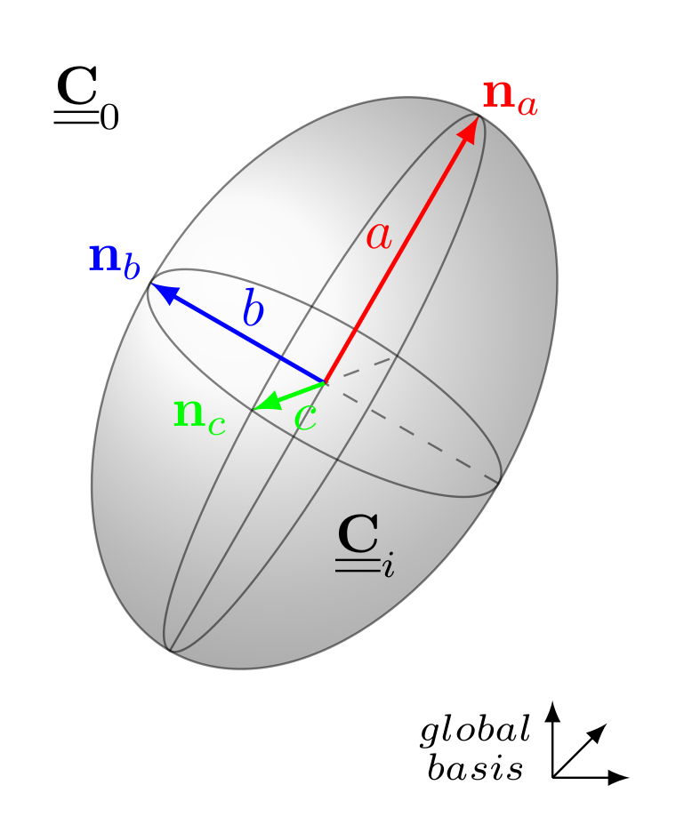
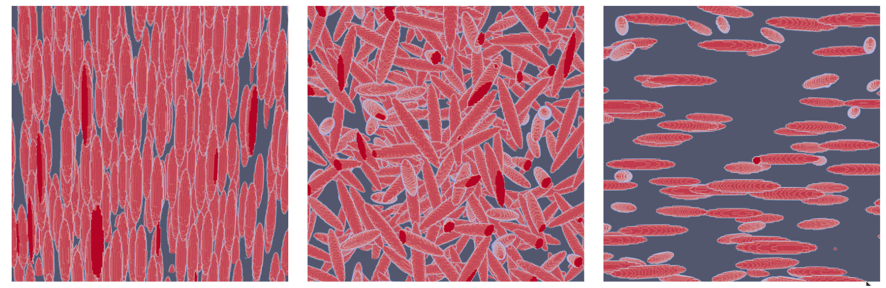
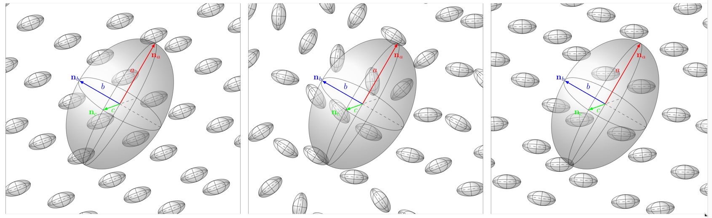

% The TFEL/Material homogenization library
% Antoine MARTIN
% 09/09/2026

\newcommand{\absvalue}[1]{{\left|#1\right|}}
\newcommand{\Frac}[2]{\displaystyle\frac{\displaystyle #1}{\displaystyle #2}}
\newcommand{\paren}[1]{\left(#1\right)}
\newcommand{\deriv}[2]{\Frac{\partial #1}{\partial #2}}
\newcommand{\tenseur}[1]{\underline{#1}}
\newcommand{\tenseurq}[1]{\underline{\underline{\mathbf{#1}}}}
\newcommand{\sigmaeq}{\sigma_{\mathrm{eq}}}
\newcommand{\tsigma}{\underline{\sigma}}
\newcommand{\trace}[1]{{\mathrm{tr}\paren{#1}}}
\newcommand{\sigmaH}{\sigma_{H}}

# Introduction

The homogenization functions are part of the namespace `tfel::material::homogenization`.
A specialization for elasticity is defined: `tfel::material::homogenization::elasticity`.
Note that the functionalities below are also available in
the `Python` module (see the doc [here](tfel-python.html#the-tfel.material.homogenization-module)).

# Eshelby, Hill and localisation tensors

## Theoretical background

### Eshelby and Hill tensors

Let us consider a uniform stress-free strain \(\tenseur \varepsilon^\mathrm{T}\)
applied in an ellipsoidal volume embedded in an infinite homogeneous medium whose
elasticity is \(\tenseurq{C}_0\):

\(\tenseur \sigma = \tenseurq C_0:(\tenseur \varepsilon - \tenseur \varepsilon^\mathrm{T})\quad\Leftrightarrow \quad\tenseur \sigma = \tenseurq C_0:\tenseur \varepsilon +\tenseur \tau, \quad \tenseur \tau= -\tenseurq C_0:\tenseur \varepsilon^\mathrm{T}\)

where \(\tenseur \tau\) is the polarization tensor.
The strain tensor inside the ellipsoid is uniform and given by

\(\tenseur \varepsilon=\tenseurq S_0:\tenseur \varepsilon^\mathrm{T}\)

where \(\tenseurq S_0\) is the Eshelby tensor. The Hill tensor \(\tenseurq P_0\)
gives the strain tensor inside the ellipsoid as a function of \(\tenseur \tau\)
rather than \(\tenseur \varepsilon^\mathrm{T}\):

\(\tenseur \varepsilon=-\tenseurq P_0:\tenseur \tau,\quad\text{with}\quad\tenseurq P_0=\tenseurq S_0:\tenseurq C_0^{-1}\).

{width=35%}

### Localisation tensor

Now we consider the same ellipsoid embedded in the medium \(\tenseurq C_0\),
but the ellipsoid has now an elasticity \(\tenseurq C_i\):

\(\tenseur \sigma = \tenseurq C_i:\tenseur \varepsilon\)

An external uniform strain \(\tenseur E\) is applied at infinity.
We can show that the strain field within the ellipsoid is again uniform
and given by

\(\tenseur \varepsilon = \tenseurq A_i:\tenseur E,\qquad\text{where}\quad
 \tenseurq A_i = \left[\tenseurq I + \tenseurq P_0:\left(\tenseurq C_i -\tenseurq C_0\right)\right]^
{-1}\)

and \(\tenseurq A_i \) is called the strain localisation (or concentration) tensor.

### Expression of Eshelby tensor for a spheroidal inclusion in an isotropic matrix

For a spheroidal inclusion embedded in an isotropic matrix, the Eshelby tensor can be found
in [@torquato_2002], Sec. 17.2.2 (see also the Hill tensor in [@parnell_2016], Sec. 5.1.3).
We first introduce a parameter \(q\) which depends on the spheroid aspect ratio \(e=b/a\),
where \(b\) is the length of the axisymmetric axis and \(a\) the length of the two
equal axes:

\(q(e)= \left\{\substack{\dfrac{e}{(e^2 - 1)^{3/2}}\left(e \sqrt{e^2 - 1} - \mathrm{Acosh}(e)\right)\quad\text{for prolate spheroids}\,(e>1)\\
\dfrac{e}{(1 - e^2)^{3/2}}\left(\mathrm{cos}^{-1}(e) - e \sqrt{1 - e^2}\right)\quad\text{for oblate spheroids}\,(e<1)}\right.\)

and assuming the axis \(b\) aligned with the direction \(3\), we have

\(S_{1111} = S_{2222} = \dfrac{3}{8 (1 - \nu)}\dfrac{e^2}{e^2-1} + \dfrac{q(e)}{4(1 - \nu)}\left(1-2\nu - \dfrac{9}{4(e^2-1)}\right)\)

\(S_{1122} = S_{2211} = \dfrac{1}{4(1 - \nu)}\left(\dfrac{e^2}{2(e^2-1)} - q(e)\left(1-2\nu + \dfrac{3}{4(e^2-1)}\right)\right)\)

\(S_{1133} = S_{2233} = \dfrac{1}{2(1 - \nu)}\left(-\dfrac{e^2}{e^2-1} + \dfrac{q(e)}{2}\left(\dfrac{3e^2}{e^2-1}- 1 + 2\nu\right)\right)\)

\(S_{3311} = S_{3322} = \dfrac{1}{2(1 - \nu)}\left(2\nu-1 - \dfrac{1}{e^2-1} + q(e)\left(1-2\nu + \dfrac{3}{2(e^2-1)}\right)\right)\)

\(S_{3333} = \dfrac{1}{2(1 - \nu)}\left(1-2\nu + \dfrac{3 e^2 - 1}{e^2-1} - q(e)\left(1-2\nu + \dfrac{3 e^2}{e^2-1}\right)\right)\)

\(S_{1212} = \dfrac{1}{4(1 - \nu)}\left(\dfrac{e^2}{2(e^2-1)} + q(e)\left(1-2\nu - \dfrac{3}{4(e^2-1)}\right)\right)\)

\(S_{1313} = S_{2323} = \dfrac{1}{4(1 - \nu)}\left(1-2\nu - \dfrac{e^2 + 1}{e^2-1} - \dfrac{q(e)}{2}\left(1-2\nu - \dfrac{3(e^2 + 1)}{e^2-1}\right)\right)\)

where \(\nu\) is the Poisson ratio related to \(\tenseurq C_0\), and the other components are null. 

### Expression of Eshelby tensor for an ellipsoidal inclusion in an isotropic matrix

For a general ellipsoid with three different semi-axes, the formula can be found
in [@eshelby_1957]. We assume that \(a > b > c\) are the semi-lengths of the axes respectively aligned with
the directions \(1,2,3\). We introduce

\(Q = \dfrac{3}{8\pi(1 - \nu)}\qquad\qquad R = \dfrac{1-2\nu}{8\pi(1 - \nu)}\qquad\qquad \theta = \mathrm{sin}^{-1}\left(\sqrt{1 - c^2 / a^2}\right)\qquad\qquad k=\sqrt{(a^2 - b^2) / (a^2 - c^2)}\)

and we use the incomplete elliptic integrals of the first and second kind:

\(F = F(\theta,k)\qquad E = E(\theta, k)\qquad\) (that can be computed via `std::ellint_1` and `std::ellint_2` in `C++`).

We also define

\(I_a=\dfrac{4\,\pi\,a\,b\,c}{(a^2 - b^2)\,\sqrt{a^2 - c^2}}(F - E)\qquad\qquad I_c=\dfrac{4\,\pi\, a \, b \, c}{(b^2 - c^2)\,\sqrt{a^2 - c^2}}\left(b\,\dfrac{\sqrt{a^2 - c^2}}{a\,c} - E\right)\)

and \(\quad I_b=4 \pi - I_a - I_c,\qquad\) and 

\(I_{ab}=\dfrac{I_b - I_a}{3(a^2 - b^2)}\qquad\qquad I_{ac}=\dfrac{4\pi/3 - I_a - I_{ab}(a^2 - b^2)}{a^2 - c^2}\qquad\qquad I_{aa}=\dfrac{4\pi}{3a^2} - I_{ab} - I_{ac}\)

\(I_{bc}=\dfrac{4\pi/3 - I_c - I_{ac}(c^2 - a^2)}{c^2 - b^2}\qquad\qquad I_{bb}=\dfrac{4\pi}{3b^2} - I_{ab} - I_{bc}\qquad\qquad I_{cc}=\dfrac{4\pi}{3c^2} - I_{bc} - I_{ac}\)

The components of the Eshelby tensor are then given by

\(S_{1111} = Q\,a^2\,I_{aa} + R\,I_a\qquad\qquad S_{1122} = Q\,b^2\,I_{ab} - R\,I_a\qquad\qquad S_{1133} = Q\,c^2\,I_{ac} - R\,I_a\)

\(S_{2211} = Q\,a^2\,I_{ab} - R\,I_b\qquad\qquad S_{2222} = Q\,b^2\,I_{bb} + R\,I_b\qquad\qquad S_{2233} = Q\,c^2\,I_{bc} - R\,I_b\)

\(S_{3311} = Q\,a^2\,I_{ac} - R\,I_c\qquad\qquad S_{3322} = Q\,b^2\,I_{bc} - R\,I_c\qquad\qquad S_{3333} = Q\,c^2\,I_{cc} + R\,I_c\)

\(S_{1212} = \dfrac12\left(Q\,I_{ab}\,(a^2 + b^2) + R\,(I_a + I_b)\right)\)

\(S_{1313} = \dfrac12\left(Q\,I_{ac}\,(a^2 + c^2) + R\,(I_a + I_c)\right)\)

\(S_{2323} = \dfrac12\left(Q\,I_{bc}\,(b^2 + c^2) + R\,(I_b + I_c)\right)\)

and the other components are null.

### General expression of Hill tensor for an ellipsoidal inclusion in an anisotropic matrix

For a general ellipsoid embedded in an anisotropic matrix, we can refer to [@masson_2007].
We give first the expression of Hill tensor, and Eshelby tensor is obtain by a left multiplication
by the elastic stiffness tensor of the matrix. We assume that \(a,b,c\) are the semi-lengths of
the axes respectively aligned with the directions \(1,2,3\). The components of Hill tensor
are

\(P_{ijkl}=\dfrac1{4\pi}\int_{\phi=0}^{2\pi}\int_{\theta=0}^{\pi} M_{ijkl}(\theta,\phi)\,\mathrm{sin}(\theta)\,\mathrm{d}\theta\,\mathrm{d}\phi\)

where 

\(M_{ijkl}(\theta,\phi)=\dfrac1{4}\left(A_{jk}^{-1}x_i\,x_l+A_{ik}^{-1}x_j\,x_l+A_{jl}^{-1}x_i\,x_k+A_{il}^{-1}x_j\,x_k\right) \)

and \(A_{ij}^{-1}\) is the component \(i,j\) of the inverse of the \(3\times 3\) acoustic matrix \(\tenseur A=\vec x.\tenseurq C_0.\vec x\), and

\(x_1=\dfrac{\sin\theta\cos\phi}a\qquad x_2=\dfrac{\sin\theta\sin\phi}b\qquad x_3=\dfrac{\cos\theta}c\)

## Computation in isotropic reference medium

### Eshelby and Hill tensors

The header `IsotropicEshelbyTensor.hxx` introduces
the computation of the Eshelby tensors and Hill tensors
of general ellipsoids embedded in an isotropic medium.

We can compute the Hill tensors as follows:

~~~~{.cpp}
using namespace tfel::material::homogenization::elasticity;
const auto P0 = computeSphereHillPolarisationTensor<stress>(E0,nu0);
const auto P0_axi = computeAxisymmetricalHillPolarisationTensor<stress>(E0,nu0,n_a,e);
const auto P0_ellipsoid = computeHillPolarisationTensor<stress>(E0,nu0,n_a,a,n_b,b,c);
~~~~

Here, the first line computes the Hill tensor for a sphere.
The second one computes the Hill tensor for an axisymmetrical ellipsoid (or spheroidal inclusion).
The user must provide the normal vector `n_a` for the axis, and `e` for the aspect ratio.
The third line computes the Hill tensor of a more general ellipsoid whose semi-axis lengths
are `a`,`b`,`c`. The axis `a` is related to direction given by `n_a` and `b` is related to the
direction given by `n_b`, which must be normal to `n_a` (see the figure above).

An `IsotropicModuli` can also be passed for the elasticity, as follows:

~~~~{.cpp}
const auto IM0=YoungNuModuli<stress>(E0,nu0);
const auto P0 = computeSphereHillPolarisationTensor<stress>(IM0);
const auto P0_axi = computeAxisymmetricalHillPolarisationTensor<stress>(IM0,n_a,e);
const auto P0_ellipsoid = computeHillPolarisationTensor<stress>(IM0,n_a,a,n_b,b,c);
~~~~

The Eshelby tensors can be computed as follows:

~~~~{.cpp}
const auto S0 = computeSphereEshelbyTensor<stress>(nu0);
const auto S0_axi = computeAxisymmetricalEshelbyTensor<stress>(nu0,e);
const auto S0_ellipsoid = computeEshelbyTensor<stress>(nu0,a,b,c);
~~~~

Note that the Eshelby tensors are not related to a basis, so that
it is recommended to use the Hill tensors instead.
In 2 dimensional framework, Eshelby tensors and Hill tensors are computed as follows:

~~~~{.cpp}
const auto S0_D = computeDiskPlaneStrainEshelbyTensor<stress>(nu0);
const auto S0_C = computePlaneStrainEshelbyTensor<stress>(nu0,e);

const auto IM0=YoungNuModuli<stress>(E0,nu0);
const auto P0_D = computeDiskPlaneStrainHillTensor<stress>(IM0);
const auto P0_C = computePlaneStrainHillTensor<stress>(IM0,n_a,a,b);
~~~~

The `computeDiskPlaneStrain` refers to a disk in plane strain framework,
whereas the `computePlaneStrain` refers to an ellipse oriented by `n_a`, in a
plane strain framework.

### Localisation (or concentration) tensors

The header `LocalisationTensor.hxx` also introduces
the computation of the strain localisation tensors of an ellipsoid.
These localisation tensors can be computed as follows:

~~~~{.cpp}
const auto A = computeSphereLocalisationTensor<stress>(E0,nu0,Ei,nui);
const auto A_axi = computeAxisymmetricalLocalisationTensor<stress>(E0,nu0,Ei,nui,n_a,e);
const auto A_ellipsoid = computeLocalisationTensor<stress>(E0,nu0,Ei,nui,n_a,a,n_b,b,c);
~~~~

Here, the subscript `i` refers to the inclusion.
Here again, an `IsotropicModuli` can be passed for the elasticity, as follows:

~~~~{.cpp}
const auto IM0=YoungNuModuli<stress>(E0,nu0);
const auto IMi=YoungNuModuli<stress>(Ei,nui);
const auto A = computeSphereLocalisationTensor<stress>(IM0,IMi);
const auto A_axi = computeAxisymmetricalLocalisationTensor<stress>(IM0,IMi,n_a,e);
const auto A_ellipsoid = computeLocalisationTensor<stress>(IM0,IMi,n_a,a,n_b,b,c);
~~~~

Note that if the elasticity of the inclusion
is not isotropic, an anisotropic elasticity `C_i` can be provided, assuming that this elasticity
is expressed in the same basis as the one defined by `n_a,n_b` (the local basis of the inclusion):

~~~~{.cpp}
const auto A_aniso = computeLocalisationTensor<stress>(IM0,C_i,n_a,a,n_b,b,c);
~~~~

In 2 dimensional framework, localisation tensors are computed as follows:

~~~~{.cpp}
const auto A_D = computeDiskPlaneStrainLocalisationTensor<stress>(IM0,C_i);
const auto A_C = computePlaneStrainLocalisationTensor<stress>(IM0,C_i,n_a,a,b);
~~~~

## Computation in anisotropic reference medium

The header `AnisotropicEshelbyTensor.hxx` introduces
the computation of the Eshelby tensors and Hill tensors
of general ellipsoids embedded in an anisotropic medium.
The anisotropic elasticity \(\tenseurq C_0\) must be
expressed in the global basis.

These tensors can be computed as follows:

~~~~{.cpp}
const auto P0 = computeAnisotropicHillTensor<stress>(C0,n_a,a,n_b,b,c);
const auto P0_2d = computePlaneStrainAnisotropicHillTensor<stress>(C0,n_a,a,b);

const auto S0 = computeAnisotropicEshelbyTensor<stress>(C0,n_a,a,n_b,b,c);
const auto S0_2d = computePlaneStrainAnisotropicEshelbyTensor<stress>(C0,n_a,a,b);
~~~~

The tensors are computed via an integration on a bi-dimensional domain.
The integration is iterative, and the user can provide the number of iterations
(basically, it corresponds to the number of subdivisions in each domain direction).
Hence, more iterations lead to more accurate results, but take longer to compute.
The default number of iterations is `12`, but it is recommended to increase it
for sharp ellipsoids:

~~~~{.cpp}
const std::size_t it = 10; 
const auto P0 = computeAnisotropicHillTensor<stress>(C0,n_a,a,n_b,b,c,10);
~~~~

The localisation tensors are introduced in the same header
`AnisotropicEshelbyTensor.hxx`. We can do as follows:

~~~~{.cpp}
const auto A = computeAnisotropicLocalisationTensor<stress>(C0_glob,Ci_loc,n_a,a,n_b,b,c);
const auto A_2d = computePlaneStrainAnisotropicLocalisationTensor<stress>(C0_glob,Ci_loc,n_a,a,b);
~~~~

The user must provide the elasticity of the inclusion as a `st2tost2` `Ci_loc`, and if it is
not isotropic, it must be provided in the local basis defined by `n_a,n_b`.

# Two-phase composites

Note that the functionalities below are also available in
the `Python` module (see the doc [here](tfel-python.html#homogenization-schemes-in-biphasic-media)).
See also [here](BiphasicLinearHomogenization.html) a tutorial on the computation of homogenized schemes for two-phase particulate microstructures.

Different classical mean-field homogenization tools are implemented
for two-phase composites. They only deal with isotropic matrices and
locally isotropic inclusions (for more complex composites, see the section
"Polyphasic microstructures").

## Homogenization schemes

The homogenization schemes for two-phase composites are introduced by
the header `LinearHomogenizationSchemes.hxx`.
The available schemes are:

 - Mori-Tanaka scheme
 - dilute scheme
 - Ponte Castaneda and Willis scheme

Each scheme is based on the average of the localisation tensor \(\tenseurq A_i \)
defined above. This average is computed assuming different distributions
of ellipsoids. Hence, different cases are considered:

 - spheres (no orientations)
 - oriented ellipsoids (two vectors \(\tenseur n_a,\tenseur n_b\) define the orientation)
 - uniform isotropic distribution of orientations (the ellipsoids have no preferential orientation)
 - transverse isotropic distribution of orientations (one axis \(\tenseur n_a\)
 of the ellipsoid is fixed, the others are uniformly distributed in the transverse plane)

{width=100%}

Hence we can compute the homogenized stiffness returned
by the available schemes. For example, for the distribution of spheres:

~~~~{.cpp}
const auto IM0=YoungNuModuli<stress>(E0,nu0);
const auto IMi=YoungNuModuli<stress>(Ei,nui);
const auto KG_DS = computeSphereDiluteScheme<stress>(IM0,f,IMi);
const auto KG_MT = computeSphereMoriTanakaScheme<stress>(IM0,f,IMi);
~~~~

Note that the two above schemes return a `KGModuli` object (see [here](tfel-material.html#isotropic-elastic-moduli)).
Also, `f` is the volume fraction, and the subscript `0` refers to the matrix, and
the subscript `i` refers to the inclusion.

For the oriented inclusions, we can do:

~~~~{.cpp}
const auto C_DS = computeOrientedDiluteScheme<stress>(IM0,f,IMi,n_a,a,n_b,b,c);
const auto C_MT = computeOrientedMoriTanakaScheme<stress>(IM0,f,IMi,n_a,a,n_b,b,c);
const auto C_PCW = computeOrientedPCWScheme<stress>(IM0,f,IMi,n_a,a,n_b,b,c,D);
~~~~

Here, the three above schemes return `st2tost2` objects.
Note that `PCW` refers to the Ponte-Castaneda and Willis scheme.
For this scheme, a `Distribution` object must
be created by the user. It is defined by two vectors \(\tenseur n_a,\tenseur n_b\) and three lengths
\(a,b,c\) that define the ellipsoid which defines the distribution:

~~~~{.cpp}
Distribution<stress> D = {.n_a = n_a, .a = a, .n_b = n_b, .b = b, .c = c};
~~~~

{width=100%}

Indeed, in the Ponte-Castaneda and Willis scheme, there is a difference between
the ellipsoid which defines the distribution of the inclusions, and the
ellipsoid which defines the shape of the inclusions (in the image above, we represent
the distribution `D` of inclusions by a big ellipsoid, with colored axes).
A bigger axis for `D` means that along this axis, the distribution of inclusions
is more diluted. A short axis means that, on the contrary, the distribution is denser
along this axis.

For the isotropic distribution of ellipsoids, we can do:

~~~~{.cpp}
const auto KG_DS = computeIsotropicDiluteScheme<stress>(IM0,f,IMi,a,b,c);
const auto KG_MT = computeIsotropicMoriTanakaScheme<stress>(IM0,f,IMi,a,b,c);
const auto C_PCW = computeIsotropicPCWScheme<stress>(IM0,f,IMi,a,b,c,D);
~~~~

Here, the two first schemes return `KGModuli` objects, whereas
`computeIsotropicPCWScheme` returns a `st2tost2` object. For this
latter case, the ellipsoids have indeed a uniform isotropic
distribution of orientations, but the user might use a non-isotropic
`Distribution D` (it corresponds to the configuration at the center on the image).
And finally, we can consider a transverse isotropic distribution
of inclusions:

~~~~{.cpp}
const auto C_DS = computeTransverseIsotropicDiluteScheme<stress>(IM0,f,IMi,n_a,a,b,c);
const auto C_MT = computeTransverseIsotropicMoriTanakaScheme<stress>(IM0,f,IMi,n_a,a,b,c);
const auto C_PCW = computeTransverseIsotropicPCWScheme<stress>(IM0,f,IMi,n_a,a,b,c,D);
~~~~
 
Here, the three above schemes return `st2tost2` objects.
Because the functions are based on the average of the localisation tensor \(\tenseurq A_i \)
associated with each distribution, a `Base` function is also defined for each scheme,
that only takes in argument the average of the localisation tensor `A_av`. We then
can compute a homogenized stiffness with a very general averaged localisator:

~~~~{.cpp}
const auto C_DS = computeDiluteScheme<stress>(E0,nu0,f,Ei,nui,A_av);
const auto C_MT = computeMoriTanakaScheme<stress>(E0,nu0,f,Ei,nui,A_av);
const auto C_PCW = computePCWScheme<stress>(E0,nu0,f,Ei,nui,A_av,D);
~~~~

Here, the three above schemes return `st2tost2` objects.

## Second-moments of the strains (Hashin-Shtrikman two-phase microstructure)

Some functions (defined in the header HomogenizationSecondMoments.hxx)
allow to compute the second moments of the strains
when considering a Hashin-Shtrikman type microstructure. More precisely,
we consider isotropic spherical inclusions embedded in an isotropic
matrix, and we compute the following moments:

\(\langle\varepsilon_{eq}^2\rangle_r\qquad\text{and}\qquad\langle\varepsilon_{m}^2\rangle_r\)

on each phase $r$, \(\varepsilon_{eq}\) being the equivalent strain and \(\varepsilon_{m}\)
being the third of the trace of the strain. We hence write

~~~~{.cpp}
const auto kg0 = KGModuli<stress>(K0,G0);
const auto kgr = KGModuli<stress>(K1,G1);
using namespace tfel::material::homogenization::elasticity;
const auto em2r = computeMeanSquaredHydrostaticStrain(kg0,fr,kgr,em2,eeq2);
const auto em20=std::get<0>(em2);
const auto em2i=std::get<1>(em2);
const auto eeq2r = computeMeanSquaredEquivalentStrain(kg0,fr,kgr,em2,eeq2);
const auto eeq20=std::get<0>(eeq2);
const auto eeq2i=std::get<1>(eeq2);
~~~~

Here the functions appearing at lines 4 and 7 need 5 arguments: isotropic modulus
of the matrix `kg0`, volume fraction of spheres, isotropic modulus of the inclusions `kgr`,
but also the second moments of the total strain: `em2` for the hydrostatic part
and `eeq2` for the deviatoric part. The functions return `std::pair`, each element
of the `pair` corresponds to a phase (matrix or spheres).

# Homogenization bounds

Different homogenization bounds are implemented
for N-phase composites and are introduced by the header
`LinearHomogenizationBounds.hxx`.
The available bounds are:

 - Voigt bound (general elasticity on each phase)
 - Reuss bound (general elasticity on each phase)
 - Hashin-Shtrikman bounds (locally isotropic phases)
 
Here are some examples of computation:

~~~~{.cpp}
//Voigt and Reuss bounds
std::vector<real> tab_f={real(0.2),real(0.8)};
const auto C0 = stress(1e9)*Stensor4<3u,real>::Id();
const auto C1 = stress(1e7)*Stensor4<3u,real>::Id();
std::vector<Stensor4<3u,stress>> tab_C={C0,C1};

const Stensor4<3u,real> CV = computeVoigtStiffness<3u, stress>(tab_f, tab_C);
const Stensor4<3u,real> CR = computeReussStiffness<3u, stress>(tab_f, tab_C);

//Hashin-Shtrikman bounds
const auto K0=stress(1/3);
const auto G0=stress(1/2);
const auto K1=stress(2/3);
const auto G1=stress(1);
const auto K2=stress(5/3);
const auto G2=stress(5/2);
std::vector<real> tab_f={real(0.1),real(0.8),real(0.1)};
std::vector<stress> tab_K={K0,K1,K2};
std::vector<stress> tab_mu={G0,G1,G2};

const auto pair = computeIsotropicHashinShtrikmanBounds<3u, stress>(tab_f, tab_K, tab_mu);

const auto LB = std::get<0>(pair);
const auto K_L = std::get<0>(LB);
const auto mu_L = std::get<1>(LB);

const auto UB = std::get<1>(pair);
const auto K_U = std::get<0>(UB);
const auto mu_U = std::get<1>(UB);
~~~~

Note that Voigt and Reuss bounds work on `st2tost2` (or `Stensor4`) objects, whereas
Hashin-Shtrikman bounds work on bulk and shear moduli.
The number of phases is arbitrary, and the dimension is 2 or 3.
 
# Polyphasic microstructures

In TFEL, 2 types of microstructures are defined:

 - `ParticulateMicrostructure`
 - `Polycrystal`

A `ParticulateMicrostructure` object represents
a very general matrix-inclusion microstructure.
A `Polycrystal` is a microstructure composed of
grains, in which there is no matrix phase.

Note that the functionalities below are also available in
the `Python` module (see the doc [here](tfel-python.html#polyphasic-microstructures)).

## Description of the components of a microstructure

We here describe the main components of a microstructure: `Phase`, `Inclusion`, `Grain`, 
and `InclusionDistribution` objects.

### The `Phase` class

The `Phase class` has three attributes:

 - `fraction` (`real` type)
 - `isotropic` (`bool` type, private attribute)
 - `stiffness` (`st2tost2` type, private attribute)

and three methods: 

 - `isIsotropic`
 - `changeElasticityOfPhase`
 - `getElasticityOfPhase`
 
`isIsotropic()` returns a `bool` stating if the phase is
considered isotropic or not. Again, the value of this `bool` depends on the
way the `Phase` was constructed. By doing

~~~~{.cpp}
const auto C0=tfel::math::st2tost2<stress>::Id();
Phase<stress> ph(f,C0);
bool b = ph.isIsotropic();
~~~~

`b` will have the value `false`, whereas by doing

~~~~{.cpp}
const auto KG=tfel::material::KGModuli<stress>(k,g);
Phase<stress> ph(f,KG);
bool b = ph.isIsotropic();
~~~~

`b` will have the value `true`. Hence,
when a `ParticulateMicrostructure` is instantiated,
it automatically instantiates a `Phase` object corresponding to 
the attribute `matrix_phase`. However, we note that the user can
construct a microstructure without using `Phase` instantiation
directly.

### The `Inclusion class`

Before describing the `InclusionDistribution class`, we must describe
the `Inclusion class`. This latter is characterized by
its unique attribute: `semiLengths`. It is a `std::array` of `N`
lengths, which are the semi-lengths of the ellipsoid/ellipse,
where `N` is the dimension considered (2 or 3).
Hence, `Inclusion` has two template parameters: `Inclusion<N,LengthType>`.
Some particular `Inclusion` objects are also defined:
 
 - `Ellipsoid` (child of `Inclusion` in 3d)
 - `Spheroid` (child of `Ellipsoid` with the last two semi-lengths identical)
 - `Sphere` (child of `Spheroid` with 3 semi-lengths equal to unity)

Let us try:

~~~~{.cpp}
Ellipsoid<length> ellipsoid1(a,b,c);
Spheroid<length> spheroid1(a,b);
Sphere<length> sphere1();
~~~~

### The `Grain class`

The `Grain class` is a child of the `Phase class` and hence 
has a volume fraction and a stiffness. It has also an attribute
`inclusion` which is an `Inclusion` object. Also, this inclusion
is oriented by two vectors `n_a` and `n_b`. This means that the
first semi-axis of the inclusion is aligned with `n_a` whereas 
the second is aligned with `n_b`. This two vectors are attributes
of the `Grain`. We can instantiate a `Grain` as follows:

~~~~{.cpp}
const auto KGi=tfel::material::KGModuli<stress>(Ki,Gi);
Ellipsoid<length> ellipsoid1(a, b, c);
tfel::math::tvector<3u, real> n_a = {1., 0., 0.};
tfel::math::tvector<3u, real> n_b = {0., 1., 0.};
const auto frac = real(0.2);
Grain<stress> grain1(ellipsoid1, frac, KGi,n_a,n_b);
~~~~

The `Grain` has also methods:

 - `computeMeanLocalisator`
 - `computeDerivativesOfMeanLocalisator`

The `computeMeanLocalisator` method takes a reference stiffness as an argument
and compute the localisation tensor of the `Grain` assuming
that it is embedded in a reference medium with this stiffness:

~~~~{.cpp}
const auto KG0=tfel::material::KGModuli<stress>(K0,G0);
const auto A_grain = grain1.computeMeanLocalisator(KG0);
~~~~

The `computeDerivativesOfMeanLocalisator` method takes a reference stiffness as
an argument and a `std::array` of 4 reals. This array contains the
derivatives of the material parameters `K0,G0,Ki,Gi` w.r.t. a parameter \(lambda\).
The `computeDerivativesOfMeanLocalisator` method hence returns the derivative of
the localisation tensor of the grain w.r.t. \(\lambda\). Hence,
we can compute the derivatives of this localisation tensor as follows:

~~~~{.cpp}
const auto dA_dk0 = grain1.computeDerivativesOfMeanLocalisator(KG0,{1.,0.,0.,0.});
const auto dA_dmu0 = grain1.computeDerivativesOfMeanLocalisator(KG0,{0.,1.,0.,0.});
const auto dA_dki = grain1.computeDerivativesOfMeanLocalisator(KG0,{0.,0.,1.,0.});
const auto dA_dmui = grain1.computeDerivativesOfMeanLocalisator(KG0,{0.,0.,0.,1.});
~~~~

### The `InclusionDistribution class`

The `InclusionDistribution class` is an abstract class which represents a distribution
of inclusions. It is a child of the `Phase class`, and it is used
to represent the distribution of inclusions in a `ParticulateMicrostructure`.

Each `InclusionDistribution` object has four attributes:
 
 - `inclusion` (which is of type `Inclusion`, see above),
 - `fraction` (attribute as a `Phase` object)
 - `stiffness` (private attribute as a `Phase` object)
 - `isotropic` (private attribute as a `Phase` object).

It has also two methods:

 - `computeMeanLocalisator`
 - `computeDerivativesOfMeanLocalisator`
 
(and also the attributes of a `Phase` object).
The `computeMeanLocalisator` method computes
the mean strain localisation (or concentration) tensor in the inclusions
when they are embedded in a matrix. 
The `computeDerivativesOfMeanLocalisator` method computes the derivative of
the average localisation tensor of the inclusion distribution w.r.t. \(\lambda\).
These methods are presented in the sequel for the 5 types of inclusion distributions.

There are 5 child `class` of the `InclusionDistribution class`:
 
 - `SphereDistribution` (distribution of spheres)
 - `IsotropicDistribution` (isotropic distribution of ellipsoids)
 - `TransverseDistribution` (transverse isotropic distribution of ellipsoids)
 - `OrientedDistribution` (aligned distribution of ellipsoids)
 - `UserDefinedDistributionOfSpheroids` (distribution of spheroids defined with orientation tensors)

Here are some examples of instantiation:

~~~~{.cpp}
const auto KGi=tfel::material::KGModuli<stress>(Ki,Gi);
SphereDistribution<stress> distrib_sph(sphere1,f,KGi);
IsotropicDistribution<stress> distrib_ell(ellipsoid1,f,KGi);

tfel::math::tvector<3u, real> n_a = {1., 0., 0.};
tfel::math::tvector<3u, real> n_b = {0., 1., 0.};
OrientedDistribution<stress> distrib_O(ellipsoid1,f,KGi,n_a,n_b);
~~~~

The `TransverseDistribution` is a special case
which requires specifying which axis of the ellipsoid (or spheroid)
will remain fixed when the two other axes rotate:

~~~{.cpp}
unsigned short int index = 0;
TransverseIsotropicDistribution<stress> distrib_TI(ellipsoid1,f,KGi,n_a,index);
~~~~

The index can be 0,1 or 2. For a spheroid, giving `2` for the `index`
is the same as giving `1`, because these 2 axes have the same length.

Note that the `OrientedDistribution` can be instantiated with a `Stensor4` object
as elasticity.
It is also possible for a `SphereDistribution`. It can be
useful for considering anisotropic inclusions. However, the basis in which
the `Stensor4` elasticity is defined is the local basis for the `OrientedDistribution`,
that is, the basis defined by `n_a` and `n_b` passed as arguments. For a `SphereDistribution`,
it is the global basis.

The `computeMeanLocalisator` method can be used as follows:

~~~~{.cpp}
Ai=ell_dist.computeMeanLocalisator(IM0);
~~~~

Note that in the latter case, passing `C0`, a `Stensor4` object
as an argument of the method will return an error, because
it will be considered that the matrix is not isotropic,
so that computing an average localisator of a distribution
of ellipsoids in an anisotropic matrix is impossible (too complicated).
However, it can be done for other kinds of distributions, like
sphere distributions or distributions of oriented inclusions:

~~~~{.cpp}
A1=distrib_sph.computeMeanLocalisator(C0,10);
A2=distrib_O.computeMeanLocalisator(C0,10);
~~~~

Here, the integer `10` is the number of subdivisions in the integration
process in the computation of the Hill tensor relative to the inclusions.
It is `12` by default.

The `UserDefinedDistributionOfSpheroids` is a distribution of `Spheroid` (3d-objects,
with two equal axes, see above). It is defined with two tensors: a second-order
tensor \(\tenseur A_2\) and a fourth-order tensor \(\tenseur A_4\):

\[
\tenseur A_2=\langle\vec n\otimes\vec n\rangle\qquad\tenseur A_4=\langle\vec n\otimes\vec n\otimes\vec n\otimes\vec n\rangle
\]

This distribution can be instantiated as follows, with the help of the Walpole Basis (see [here](tfel-math.html#higher-order-objects-defined-as-derivatives) the documentation).

~~~~{.cpp}
using namespace tfel::math;
tvector<3u, real> n_a = {1., 0., 0.};
tvector<3u, real> n_b = {0., 1., 0.};
const stensor<3u,real> A2 = 1./2*TransverseIsotropicWalpoleBasis<real>::q(n_b);

const auto E2d=TransverseIsotropicWalpoleBasis<real>::E2(n_b);
const auto Fd=TransverseIsotropicWalpoleBasis<real>::F(n_b);
const st2tost2<3u,real> A4 = 1./2*E2d+1./4*Fd;

UserDefinedDistributionOfSpheroids<stress> distribution(spheroid1, f, KGi, A2, A4);
~~~~

Note that the 5 `InclusionDistribution` classes are currently available in 3d only.

## Construction of a microstructure

### The `ParticulateMicrostructure`

The `ParticulateMicrostructure class` is available in 3d an 2d
via 2 template parameters: `ParticulateMicrostructure<N,stress>`
with `N` the dimension. For the details, see the file 'MicrostructureDescription.hxx'
which introduces the `class`.

{width=50%}

A `ParticulateMicrostructure` consists of a matrix, in which are embedded
several distributions of inclusions. The class has three (private) attributes:

 - `number_of_phases`
 - `matrix_phase`
 - `inclusion_phases`

The `matrix_phase` is of type `Phase`, described below.
 
The `inclusion_phases` is a `std::vector` of pointers on
`InclusionDistribution` objects (which represent the distributions of inclusions). This
class is also described below. 

We can instantiate a `ParticulateMicrostructure` as follows,
passing the matrix elasticity as an argument:

~~~~{.cpp}
using namespace tfel::material::homogenization::elasticity;
const auto IM0=tfel::material::KGModuli<stress>(1e7,1e7);
micro_1=ParticulateMicrostructure(IM0);

const auto C0 = stress(1e9)*Stensor4<3u,real>::Id();
micro_2=ParticulateMicrostructure(C0);
~~~~

The `ParticulateMicrostructure` has also some methods (see 'MicrostructureDescription.hxx'
for details). The following ones allow to get some attributes of the class:

 - `getNumberOfPhases`
 - `getMatrixFraction` (attribute `fraction` of `matrix_phase`)
 - `getMatrixElasticity` (attribute `stiffness` of `matrix_phase`)
 - `isIsotropicMatrix` (private attribute `isotropic` of `matrix_phase`)
 
The last method returns a boolean which states if the matrix is considered isotropic
or not. In fact, depending on how the `ParticulateMicrostructure` was instantiated,
the matrix is considered isotropic or not. For example, by doing

~~~~{.cpp}
bool val_1=micro_1.isIsotropicMatrix();
bool val_2=micro_2.isIsotropicMatrix();
~~~~

`val_1` will be `True` because `micro_1` was instantiated above with a `KGModuli`,
whereas `val_2` will be `False`. Note that `False` does not mean
that the matrix elasticity is not isotropic, but that it is CONSIDERED
as not isotropic.

Other methods allow to add/remove `InclusionDistribution` objects
to the attribute `inclusion_phases`, and also to modify the properties of
the phases:

 - `getInclusionPhase`
 - `addInclusionPhase`
 - `removeInclusionPhase`
 - `changeElasticityOfMatrixPhase`
 - `changeElasticityOfInclusionPhase`
 - `changeFractionOfInclusionPhase`

We can construct our `ParticulateMicrostructure` by adding some
`InclusionDistribution` objects:

~~~~{.cpp}
micro_1.addInclusionPhase(distrib_sph);
std::cout<< micro_1.getNumberOfPhases()<< std::endl;
std::cout<< micro_1.getMatrixFraction()<< std::endl;

micro_1.addInclusionPhase(distrib_ell);
std::cout<< micro_1.getNumberOfPhases()<< std::endl;
std::cout<< micro_1.getMatrixFraction()<< std::endl;
~~~~

or remove them:

~~~~{.cpp}
micro_1.removeInclusionPhase(0);
std::cout<< micro_1.getNumberOfPhases()<< std::endl;
std::cout<< micro_1.getMatrixFraction()<< std::endl;
~~~~

At this stage, we have added the distribution of spheres `distrib_sph`,
and added the isotropic distribution of ellipsoids `distrib_ell`.
After that, we have removed the first inclusion distribution (number `0`), which is
the distribution of spheres. Hence, only one `InclusionDistribution` object
remains in the microstructure. We can get this distribution by doing:

~~~~{.cpp}
const auto ell_dist=micro_1.getInclusionPhase(0);
~~~~

A last method of the `ParticulateMicrostructure` object allows to change the
elasticity of the matrix phase:

~~~~{.cpp}
micro_1.changeElasticityOfMatrixPhase(C0);
std::cout<< micro_1.getMatrixElasticity()<< std::endl;
std::cout<< micro_1.isIsotropicMatrix()<< std::endl;
~~~~

Here we see that the matrix is no more isotropic
because it was replaced via a `Stensor4` object `C0`.

### The `Polycrystal`
 
A `Polycrystal` consists of a collection of grains.
The class has three (private) attributes:

 - `number_of_grains`
 - `total_fraction` (may be under 1 but never over 1)
 - `grains`
 
`grains` is a `std::vector` of pointers on
`Grain` objects, a class which is described below. 

We can instantiate a `Polycrystal` as follows:

~~~~{.cpp}
using namespace tfel::material::homogenization::elasticity;
Polycrystal poly;
~~~~

We can add some grains to our polycrystal:

~~~~{.cpp}
poly.addGrain(grain1);
poly.addGrain(grain2);
~~~~

and we can remove grains:

~~~~{.cpp}
poly.removeGrain(0);
~~~~

we can also get a grain, or change its elasticity or
its volume fraction. Note that we cannot add
a grain when its volume fraction is such that
the polycrystal would have a volume fraction superior
to 1. Similarly, we cannot change the fraction of a grain
if the new fraction is such that the polycrystal
would have a fraction superior to 1.

## Computation of homogenization schemes

The file `MicrostructureLinearHomogenization.hxx` introduces 
the homogenization schemes.

The following homogenization schemes are available for
`ParticulateMicrostructure` objects:

 - `computeDilute` (dilute scheme)
 - `computeMoriTanaka` (Mori-Tanaka scheme)
 - `computeAsymmetricSelfConsistent` (Asymmetric Self-Consistent scheme)

These functions take a `ParticulateMicrostructure` as an argument.
For a `Polycrystal`, the available homogenization scheme
is:

 - `computeSelfConsistent` (Self-consistent scheme)

This function takes a `Polycrystal`
as an argument.

All these functions return a `HomogenizationScheme` object.
This object is a structure with the following attributes:

 - `homogenized_stiffness`
 - `effective_polarisation`
 - `mean_strain_localisation_tensors`
 - `derivative_of_homogenized_stiffness_wrt_kr`
 - `derivative_of_homogenized_stiffness_wrt_mur`

### Dilute scheme

We note \(\tenseurq C_0\) the elasticity of the matrix phase
and \(\tenseurq C_i\,(1\leq i\leq N-1)\) the elasticities of the N-1 other phases.
We also note \(f_i\,(0\leq i\leq N-1)\) the volume fractions of all phases.
The homogenized stiffness of the dilute scheme reads

\(\tenseurq C^{\mathrm{DS}}=\tenseurq C_0+\sum_{i=1}^{N-1}f_i\,\left(\tenseurq C_i-\tenseurq C_0\right):\tenseurq A_i^{\mathrm{DS}}\)

where \(\tenseurq A_i^{\mathrm{DS}}\) is the average localisation tensor
on phase \(i\). For a unique ellipsoid this tensor is exactly the localisation
tensor of this ellipsoid embedded in the matrix phase. For a collection of
ellipsoids, this is the average of all individual localisation tensors
relative to each ellipsoid. Note that above formula is equivalent to

\(\tenseurq C^{\mathrm{DS}}=\sum_{i=0}^{N-1}f_i\,\tenseurq C_i:\tenseurq A_i^{\mathrm{DS}}\)

where \(\tenseurq A_0^{\mathrm{DS}}=\tenseurq I\). Let us try:

~~~~{.cpp}
auto hmDS=computeDilute<3u,stress>(micro_1);
std::cout<< "CDS: "<< hmDS.homogenized_stiffness << std::endl;
~~~~

The isotropic character of the matrix when computing the strain localisators
will depend on what `micro_1.isIsotropicMatrix()` returns. Hence, it is important
to initialize the matrix or the microstructure with the appropriate
elastic moduli. If it is not isotropic, a numerical integration is performed,
and an optional integer `max_iter_anisotropic_integration` can be passed to specify the number of
subdivisions in the integration (the default value of this integer is `12`).

~~~~{.cpp}
micro_1.changeElasticityOfMatrixPhase(C0);
micro_1.removeInclusionPhase(0);
OrientedDistribution<stress> distrib_O(ellipsoid1,f,KGi,n_a,n_b);
micro_1.addInclusionPhase(distrib_O);
auto max_iter_anisotropic_integration = 10;
auto hmDS_aniso=computeDilute<3u,stress>(micro_1,max_iter_anisotropic_integration);
~~~~

Note however that the numerical integration can be performed only for
a spherical inclusion, or an oriented ellipsoidal inclusion.

### Mori-Tanaka scheme

The homogenized stiffness of the Mori-Tanaka scheme reads

\(\tenseurq C^{\mathrm{MT}}=\tenseurq C_0+\sum_{i=1}^{N-1}f_i\,\left(\tenseurq C_i-\tenseurq C_0\right):\tenseurq A_i^{\mathrm{MT}}\)

where \(\tenseurq A_i^{\mathrm{MT}}=\tenseurq A_i^{\mathrm{DS}}:\left(\sum_{i=0}^{N-1}f_i\,\tenseurq A_i^{\mathrm{DS}}\right)^{-1}\). Note that we have also:

\(\tenseurq C^{\mathrm{MT}}=\sum_{i=0}^{N-1}f_i\,\tenseurq C_i:\tenseurq A_i^{\mathrm{MT}}\).

Let us try:

~~~~{.cpp}
auto hmMT=computeMoriTanaka<3u,stress>(micro_1);
std::cout<< "CMT: "<< hmMT.homogenized_stiffness << std::endl;
~~~~

As for the dilute scheme, the matrix can be anisotropic in some cases.
The isotropic character of the matrix will depend on what `micro_1.isIsotropicMatrix()`
returns and hence on the initialization of the microstructure.
If it is not isotropic, a numerical integration is performed,
and the optional integer `max_iter_anisotropic_integration` can be specified.

~~~~{.cpp}
auto hmMT_aniso=computeMoriTanaka<3u,stress>(micro_1,max_iter_anisotropic_integration);
~~~~

Here again the numerical integration can be performed only for
a spherical inclusion, or an oriented ellipsoidal inclusion.

### Self-consistent scheme (without matrix phase)

Here we consider a microstructure in which there is no phase
(typically, a polycrystal). There is N phases, labelled
from \(1\) to \(N\). The homogenized stiffness of the Self-consistent
scheme is obtained via an iterative process. Let us fix \(\epsilon\)
a tolerance criterium and \(\tenseurq C_{\mathrm{ini}}\) an initial
elasticity guess. The algorithm is as follows:

1. Set \(\quad\tenseurq C^{\mathrm{SC}}_{0}=\tenseurq C_{\mathrm{ini}},\quad\) \(n=0,\quad\) and \(\quad\xi=\epsilon+1\).

2. While \(\quad\xi > \epsilon\quad\), do: \(\quad\tenseurq C^{\mathrm{SC}}_{n+1}=\sum_{i=1}^{N}f_i\,\tenseurq C_i:\tenseurq A_i^{\mathrm{SC},n},\quad\)  increment \(n\) and compute the relative difference \(\xi=\Frac{||\tenseurq C^{\mathrm{SC}}_{n+1}-\tenseurq C^{\mathrm{SC}}_{n}||}{||\tenseurq C^{\mathrm{SC}}_{n}||}\)

where \(\tenseurq A_i^{\mathrm{SC},n}=\tilde{\tenseurq A}_i^{\mathrm{SC},n}:\left(\sum_{i=0}^{N-1}f_i\,\tilde{\tenseurq A}_i^{\mathrm{SC},n}\right)^{-1}\) and \(\tilde{\tenseurq A}_i^{\mathrm{SC},n}\) is the
average localisation tensor on phase i, assumed this phase is embedded in a matrix whose elasticity
is the homogenized elasticity \(\tenseurq C^{\mathrm{SC}}_{n}\) obtained at previous step \(n\).
To be more precise, for a unique ellipsoid whose orientation is given by \((\vec n_a,\vec n_b)\),
we have

\(\tilde{\tenseurq A}_i^{\mathrm{SC},n}=\tilde{\tenseurq A}_i^{\mathrm{SC},n}(\vec n_a,\vec n_b)=\left[\tenseurq I + \tenseurq P_i^{\mathrm
{SC},n}(\vec n_a,\vec n_b):\left(\tenseurq C_i -\tenseurq C^{\mathrm{SC}}_{n}\right)\right]^{-1}\)

where \(\tenseurq P_i^{\mathrm{SC},n}(\vec n_a,\vec n_b)\) is the Hill tensor
related to the ellipsoid embedded in a homogeneous medium whose elasticity is
\(\tenseurq C^{\mathrm{SC}}_{n}\). And, for a collection of ellipsoids,
we have

\(\tilde{\tenseurq A}_i^{\mathrm{SC},n}=\langle\tilde{\tenseurq A}_i^{\mathrm{SC},n}(\vec n_a,\vec 
n_b)\rangle_{\vec n_a,\vec n_b}\)

where \(\langle.\rangle_{\vec n_a,\vec n_b}\) stands for the average on all orientations. Let us try:

~~~~{.cpp}
auto epsilon = 1e-6;
auto Cini=C0;
auto hmSC=computeSelfConsistent<3u,stress>(poly,epsilon,Cini,true);
std::cout<< "CSC: "<< hmSC.homogenized_stiffness << std::endl;
~~~~

We note that `computeSelfConsistent` takes
a `Polycrystal` as an argument, but also `epsilon` as
the tolerance criterium, and `Cini` as the initial guess (a `st2tost2` object).
Moreover, it must be precised, for the computation of the Hill tensor \(\tenseurq P_i^{\mathrm{SC},n}(\vec n_a,\vec n_b)\), if the reference elasticity \(\tenseurq C^{\mathrm{SC}}_{n}\) is
considered isotropic or not. This is the role of the `bool` parameter (here, `true`).
If it is `true`, an isotropic projection is performed for \(\tenseurq C^{\mathrm{SC}}_{n}\)
at each step of the iterative algorithm.
Otherwise, he can put `false`, so that a numerical integration (resulting
in a slower computation) will be performed to compute the Hill tensors.
Moreover, the optional integer `max_iter_anisotropic_integration` can also be used
as for the other schemes (its default value is here `8`):

~~~~{.cpp}
OrientedDistribution<stress> distrib_O(ellipsoid1,f,KGi,n_a,n_b);
micro_2.addInclusionPhase(distrib_O);
hmSC_iso=computeSelfConsistent<3u,stress>(micro_2,epsilon,Cini,true);
hmSC_aniso=computeSelfConsistent<3u,stress>(micro_2,epsilon,Cini,false,max_iter_anisotropic_integration);
std::cout<< "SC iso: "<< hmSC_iso.homogenized_stiffness<< std::endl;
std::cout<< "SC aniso: "<< hmSC_aniso.homogenized_stiffness<< std::endl;
~~~~

Note again that the numerical integration can be performed only for
a spherical inclusion, or an oriented ellipsoidal inclusion.

### Asymmetric self-consistent scheme (with matrix phase)

We now consider a particulate microstructure in which
the phase 0 plays the role of a matrix: it embeds the inclusions \((1\leq i\leq N-1)\).
This case is different from the traditional self-consistent scheme
and different variants of the self-consistent scheme are available
to account for this difference. We use here the asymmetric self-consistent
scheme proposed in [@saevik_2012]. This turns into a dilute scheme
for which the localisation tensor in the inclusions is computed
by considering the Hill tensor relative to a reference medium
equal to the homogenized medium. We choose a criterium \(\epsilon\)
and the initial elasticity guess can be simply chosen as
the elasticity \(\tenseurq C_0\) of the matrix. We hence have the
following algorithm:

1. Set \(\quad\tenseurq C^{\mathrm{ASC}}_{0}=\tenseurq C_{0},\quad\) \(n=0,\quad\) and \(\quad\xi=\epsilon+1\).

2. While \(\quad\xi > \epsilon\quad\), do: \(\quad\tenseurq C^{\mathrm{ASC}}_{n+1}=\tenseurq C_0+\sum_{i=1}^{N-1}f_i\,\left(\tenseurq C_i-\tenseurq C_0\right):\tenseurq A_i^{\mathrm{ASC},n},\quad\)  increment \(n\) and compute the relative 
difference \(\xi=\Frac{||\tenseurq C^{\mathrm{ASC}}_{n+1}-\tenseurq C^{\mathrm{ASC}}_{n}||}{||\tenseurq 
C^{\mathrm{ASC}}_{n}||}\)

where \(\tenseurq A_i^{\mathrm{ASC},n}\) is the
average localisation tensor on phase i, assumed this phase is embedded in a matrix whose elasticity
is the homogenized elasticity \(\tenseurq C^{\mathrm{ASC}}_{n}\) obtained at previous step \(n\).
To be more precise, for a unique ellipsoid whose orientation is given by \((\vec n_a,\vec n_b)\),
we have

\(\tilde{\tenseurq A}_i^{\mathrm{ASC},n}=\tilde{\tenseurq A}_i^{\mathrm{ASC},n}(\vec n_a,\vec n_b)=\left
[\tenseurq I + \tenseurq P_i^{\mathrm
{ASC},n}(\vec n_a,\vec n_b):\left(\tenseurq C_i -\tenseurq C^{\mathrm{ASC}}_{n}\right)\right]^{-1}\)

where \(\tenseurq P_i^{\mathrm{ASC},n}(\vec n_a,\vec n_b)\) is the Hill tensor
related to the ellipsoid embedded in a homogeneous medium whose elasticity is
\(\tenseurq C^{\mathrm{ASC}}_{n}\). And, for a collection of ellipsoids,
we have

\(\tilde{\tenseurq A}_i^{\mathrm{ASC},n}=\langle\tilde{\tenseurq A}_i^{\mathrm{ASC},n}(\vec n_a,\vec 
n_b)\rangle_{\vec n_a,\vec n_b}\)

where \(\langle.\rangle_{\vec n_a,\vec n_b}\) stands for the average on all orientations. Let us try:

~~~~{.cpp}
auto epsilon = 1e-6;
auto hmASC=computeAsymmetricSelfConsistent<3u,stress>(micro_1,epsilon,true);
std::cout<< "CASC: "<< hmASC.homogenized_stiffness << std::endl;
~~~~

Again, the boolean parameter `true` specifies the isotropic projection
of the homogenized stiffness. The anisotropic case is treated as above for the
traditional self-consistent scheme.

## Strain localisation tensors on each phase

The localisation tensors correspond to the fourth-order
tensors related to each phase. For previous schemes,
these tensors are \(\tenseurq A_i^{\mathrm{DS}},\tenseurq A_i^{\mathrm{MT}},\tenseurq A_i^{\mathrm{SC},n}\). We can recover these tensors as follows:

~~~~{.cpp}
A_i_DS=hmDS.mean_strain_localisation_tensors;
std::cout<<"A_0_DS: "<< A_i_DS[0]<<"A_1_DS: "<< A_i_DS[1]<< std::endl;
~~~~

The attribute `mean_strain_localisation_tensors` is a `std::vector`
which contains `st2tost2` objects, as many as the number of phases.

## Prescribing a polarisation on each phase

We can also add a polarisation \(\tenseur \tau_i\) on each phase \(i\). This leads to the
following effective polarisation (see Eq. (5.14) from [@willis_mechanics_2001]):

\(\tenseur \tau^{\mathrm{eff}}=\sum_{i=1}^{N}f_i\,{\tenseur A_i}^T:\tenseur \tau_i\)

The polarisations are prescribed with a `std::vector`
of `stensor` objects. This vector must have the same number of phases
as the microstructure. Let us try:

~~~~{.cpp}
const auto P0 = Stensor<3u,stress>::zero();
const Stensor<3u,stress> P1 = {stress(6.e8),stress(6.e8),stress(6.e8),stress(0.),stress(0.),stress(0.)};
const auto pola={P0,P1};
auto hmDS_pola=computeDilute<3u,stress>(micro_1,0,pola);
~~~~

Note that here we must also specify the parameter `max_iter_anisotropic_integration`
before the optional argument `pola`.
Here this integer is 0 because it will not be used, given that
the matrix phase is isotropic (see first line).
And we can recover the effective polarisation:

~~~~{.cpp}
auto P_eff_DS=hmDS_pola.effective_polarisation;
~~~~

Note also that if there is no polarisation vector (or if it is
a vector with zero element), the effective
polarisation is null.

## Second-moments of the strains

The second-moments of the strains are classically obtained
with the derivatives of the homogenized stiffness w.r.t. the
elastic moduli. These derivatives are also provided by the
`HomogenizationScheme`, in the case the phases are locally isotropic
(and only in 3D). This can be done as follows:

~~~~{.cpp}
auto compute_derivatives = true;
auto h_DS = computeDilute<3u, stress>(micro_1,0,{},compute_derivatives);
auto dCDS_dkr = h_DS.derivative_of_homogenized_stiffness_wrt_kr;
std::cout << dCDS_dkr[0](0,0) << std::endl;
~~~~

Here, a boolean `compute_derivatives` is passed as the last argument of the function
`computeDilute`. This boolean (whose default value is `false`)
specifies if the derivatives of the homogenized stiffness must
be computed or not. If it is not computed (or if a dimension
different from 3 is used), the attribute
`.derivative_of_homogenized_stiffness_wrt_kr` is an
empty `std::vector`. If it is computed, this attribute is a `std::vector`
which contains as many tensors as the number of phases.
The tensor number `i` is a `st2tost2` object corresponding to the
derivative of the homogenized stiffness w.r.t. the bulk modulus
of phase `i`. This is the same for the attribute `.derivative_of_homogenized_stiffness_wrt_mur`.

<!-- Local IspellDict: english -->
