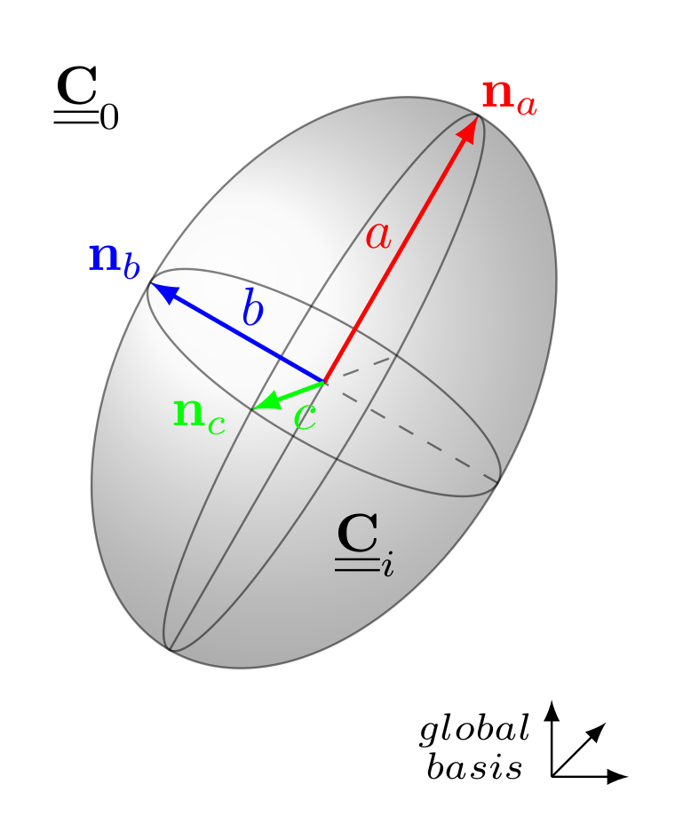
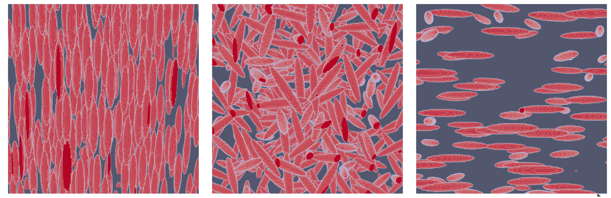
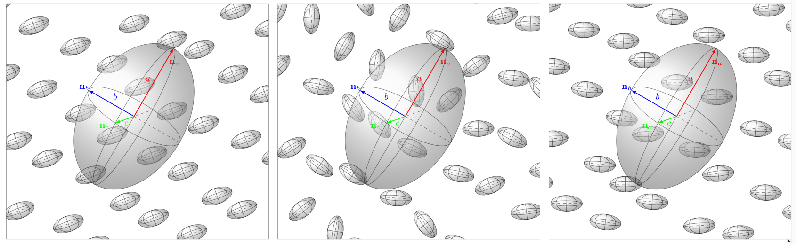

% The TFEL/Material library
% Thomas Helfer
% 19/12/2017

\newcommand{\absvalue}[1]{{\left|#1\right|}}
\newcommand{\Frac}[2]{\displaystyle\frac{\displaystyle #1}{\displaystyle #2}}
\newcommand{\paren}[1]{\left(#1\right)}
\newcommand{\deriv}[2]{\Frac{\partial #1}{\partial #2}}
\newcommand{\tenseur}[1]{\underline{#1}}
\newcommand{\tenseurq}[1]{\underline{\underline{\mathbf{#1}}}}
\newcommand{\sigmaeq}{\sigma_{\mathrm{eq}}}
\newcommand{\tsigma}{\underline{\sigma}}
\newcommand{\trace}[1]{{\mathrm{tr}\paren{#1}}}
\newcommand{\sigmaH}{\sigma_{H}}

# Equivalent stress

## Hosford equivalent stress{#sec:hosford}

The header `TFEL/Material/Hosford1972YieldCriterion.hxx` introduces
three functions which are meant to compute the Hosford equivalent
stress and its first and second derivatives. *This header is
automatically included by `MFront`*

The Hosford equivalent stress is defined by:
\[
\sigmaeq^{H}=\sqrt[a]{\Frac{1}{2}\paren{\absvalue{\sigma_{1}-\sigma_{2}}^{a}+\absvalue{\sigma_{1}-\sigma_{3}}^{a}+\absvalue{\sigma_{2}-\sigma_{3}}^{a}}}
\]
where \(s_{1}\), \(s_{2}\) and \(s_{3}\) are the eigenvalues of the
stress.

Therefore, when \(a\) goes to infinity, the Hosford stress reduces to
the Tresca stress. When \(n = 2\) the Hosford stress reduces to the
von Mises stress.

The following functions has been implemented:

- `computeHosfordStress`: return the Hosford equivalent stress
- `computeHosfordStressNormal`: return a tuple containing the Hosford
  equivalent stress and its first derivative (the normal)
- `computeHosfordStressSecondDerivative`: return a tuple containing
  the Hosford equivalent stress, its first derivative (the normal) and
  the second derivative.

#### Example

The following example computes the Hosford equivalent stress, its
normal and second derivative:

~~~~{.cpp}
stress seq;
Stensor  n;
Stensor4 dn;
std::tie(seq,n,dn) = computeHosfordStressSecondDerivative(s,a,seps);
~~~~

In this example, `s` is the stress tensor, `a` is the Hosford
exponent, `seps` is a numerical parameter used to detect when two
eigenvalues are equal.

If `C++-17` is available, the previous code can be made much more readable:

~~~~{.cpp}
const auto [seq,n,dn] = computeHosfordStressSecondDerivative(s,a,seps);
~~~~

## Barlat equivalent stress{#sec:barlat}

The header `TFEL/Material/Barlat2004YieldCriterion.hxx` introduces
various functions which are meant to compute the Barlat equivalent
stress and its first and second derivatives. *This header is
automatically included by `MFront`* for orthotropic behaviours.

The Barlat equivalent stress is defined as follows (see
@barlat_linear_2005):
\[
\sigmaeq^{B}=
\sqrt[a]{
  \frac{1}{4}\left(
  \sum_{i=0}^{3}
  \sum_{j=0}^{3}
  \absvalue{s'_{i}-s''_{j}}^{a}
  \right)
}
\]

where \(s'_{i}\) and \(s''_{i}\) are the eigenvalues of two
transformed stresses \(\tenseur{s}'\) and \(\tenseur{s}''\) by two
linear transformation \(\tenseurq{L}'\) and \(\tenseurq{L}''\):
\[
\left\{
\begin{aligned}
\tenseur{s}'  &= \tenseurq{L'} \,\colon\,\tsigma \\
\tenseur{s}'' &= \tenseurq{L''}\,\colon\,\tsigma \\
\end{aligned}
\right.
\]

The linear transformations \(\tenseurq{L}'\) and \(\tenseurq{L}''\)
are defined by \(9\) coefficients (each) which describe the material
orthotropy. There are defined through auxiliary linear transformations
\(\tenseurq{C}'\) and \(\tenseurq{C}''\) as follows:
\[
\begin{aligned}
\tenseurq{L}' &=\tenseurq{C}'\,\colon\,\tenseurq{M} \\
\tenseurq{L}''&=\tenseurq{C}''\,\colon\,\tenseurq{M}
\end{aligned}
\]
where \(\tenseurq{M}\) is the transformation of the stress to its deviator:
\[
\tenseurq{M}=\tenseurq{I}-\Frac{1}{3}\tenseur{I}\,\otimes\,\tenseur{I}
\]

The linear transformations \(\tenseurq{C}'\) and \(\tenseurq{C}''\) of
the deviator stress are defined as follows:
\[
\tenseurq{C}'=
\begin{pmatrix}
0 & -c'_{12} & -c'_{13} & 0 & 0 & 0 \\
-c'_{21} & 0 & -c'_{23} & 0 & 0 & 0 \\
-c'_{31} & -c'_{32} & 0 & 0 & 0 & 0 \\
0 & 0 & 0 & c'_{44} & 0 & 0 \\
0 & 0 & 0 & 0 & c'_{55} & 0 \\
0 & 0 & 0 & 0 & 0 & c'_{66} \\
\end{pmatrix}
\quad
\text{and}
\quad
\tenseurq{C}''=
\begin{pmatrix}
0 & -c''_{12} & -c''_{13} & 0 & 0 & 0 \\
-c''_{21} & 0 & -c''_{23} & 0 & 0 & 0 \\
-c''_{31} & -c''_{32} & 0 & 0 & 0 & 0 \\
0 & 0 & 0 & c''_{44} & 0 & 0 \\
0 & 0 & 0 & 0 & c''_{55} & 0 \\
0 & 0 & 0 & 0 & 0 & c''_{66} \\
\end{pmatrix}
\]

The following functions have been implemented:

- `computeBarlatStress`: return the Barlat equivalent stress
- `computeBarlatStressNormal`: return a tuple containing the Barlat
  equivalent stress and its first derivative (the normal)
- `computeBarlatStressSecondDerivative`: return a tuple containing the
  Barlat equivalent stress, its first derivative (the normal) and the
  second derivative.

### Linear transformations

To define the linear transformations, the
`makeBarlatLinearTransformation` function has been introduced. This
function takes two template parameter:

- the space dimension (\(1\), \(2\), and \(3\))
- the numeric type used (automatically deduced)

This functions takes the \(9\) coefficients as arguments, as follows:

~~~~{.cpp}
const auto l1 = makeBarlatLinearTransformation<3>(c_12,c_21,c_13,c_31,
                                                  c_23,c_32,c_44,c_55,c_66);
~~~~

> **Note** In his paper, Barlat and coworkers uses the following convention for
> storing symmetric tensors:
> 
> \[
> \begin{pmatrix}
> xx & yy & zz & yz & zx & xy
> \end{pmatrix}
> \]
> 
> which is not consistent with the
> `TFEL`/`Cast3M`/`Abaqus`/`Ansys` conventions:
> 
> \[
> \begin{pmatrix}
> xx & yy & zz & xy & xz & yz
> \end{pmatrix}
> \]
> 
> Therefore, if one wants to use coefficients \(c^{B}\) given
> by Barlat, one shall call this function as follows:
> 
> ~~~~{.cpp}
> const auto l1 = makeBarlatLinearTransformation<3>(cB_12,cB_21,cB_13,cB_31,
>                                                   cB_23,cB_32,cB_66,cBB_55,cBB_44);
> ~~~~

The `TFEL/Material` library also provide an overload of the
`makeBarlatLinearTransformation` which template parameters are the
modelling hypothesis and the orthotropic axis conventions. The purpose
of this overload is to swap appropriate coefficients to get a
consistent definition of the linear transformations for all the
modelling hypotheses.

# General functionalities

## Computation of the inverse of the Langevin function

The inverse Langevin function is used in many statistically based
network behaviours describing rubber-like materials.

The Langevin function \(\mathcal{L}\) is defined as follows:
\[
\mathcal{L}\paren{x}=\Frac{1}{\coth\paren{x}}-\Frac{1}{x}
\]

The complexity of the inverse Langevin function
\(\mathcal{L}^{-1}\paren{x}\) motivated the development of various
approximations
[@cohen_pade_1991;@bergstrom_constitutive_1998;@jedynak_approximation_2015].

{#fig:tfel_4.1:tfel_material:inverse_langevin_function
width=95%}

Figure @fig:tfel_4.1:tfel_material:inverse_langevin_function compares
those approximations. The approximations of Bergström and Boyce
[@bergstrom_constitutive_1998] and Jedynak [@jedynak_approximation_2015]
are undistinguishable. See Jedynak for a quantitative discussion of the
error generated by those approximations [@jedynak_approximation_2015].
It is worth noting that all those approximations mostly differs near the
pole of inverse Langevin function \(\mathcal{L}^{-1}\paren{x}\).

The `InverseLangevinFunctionApproximations` enumeration lists the
approximations that have been implemented and that can be evaluated in a
`constexpr` context:

- The value `COHEN_1991` is associated with the approximation proposed by Cohen [@cohen_pade_1991]:
  \[
  \mathcal{L}^{-1}\paren{x} \approx
  y\Frac{3-y^{2}}{1-y^{2}}.
  \]
- The value `JEDYNAK_2015` is associated with the approximation proposed
  by Jedynak [@jedynak_approximation_2015]:
  \[
  \mathcal{L}^{-1}\paren{x} \approx
  y \, \Frac{c_{0} + c_{1}\,y + c_{2}\,y^{2}}{1 + d_{1}\,y + d_{2}\,y^{2}}
  \]
- `KUHN_GRUN_1942` or `MORCH_2022` are associated with a taylor expansion of
  \(\mathcal{L}^{-1}\paren{x}\) at \(0\):
  \[
  \mathcal{L}^{-1}\paren{x} \approx
  y\,P\paren{y^{2}} \quad\text{with}\quad P\paren{y^{2}}=\sum_{i=0}^{9}c_{i}\,\paren{y^{2}}^{i}
  \]
  where \(P\) is a \(9\)th order polynomial. Hence, the
  Taylor expression is of order \(19\).

The `computeApproximateInverseLangevinFunction` computes one
approximation of the inverse Langevin function and the
`computeApproximateInverseLangevinFunctionAndDerivative` function
computes an approximation of the inverse Langevin function and its
derivative. These functions have two template parameters: the
approximation selected and the numeric type to be used. By default, the
`JEDYNAK_2015` approximation is used and the numeric type can be deduced
from the type of the argument.

The approximation proposed by Bergström and Boyce
[@bergstrom_constitutive_1998] is given by the following function:
\[
\mathcal{L}^{-1}\paren{x}
\approx
\left\{
\begin{aligned}
c_{1} \tan\paren{c_{2} \, x} + c_{3} \, x &\quad\text{if}\quad \left|x\right| \leq c_{0}\\
\Frac{1}{\mathop{sign}\paren{x}-x}&\quad\text{if}\quad \left|x\right| > c_{0}
\end{aligned}
\right.
\]

The `computeBergstromBoyce1998ApproximateInverseLangevinFunction`
function computes this approximation and the
`computeBergstromBoyce1998ApproximateInverseLangevinFunctionAndDerivative`
function computes this function and its derivative. These functions
can't be declared `constexpr` because of tangent function is not
`constexpr`. These functions have one template parameter, the numeric
type to be used. This template parameter can be automatically deduced
from the type of the argument.

## Example of usage

~~~~{.cxx}
using ApproximationFunctions = InverseLangevinFunctionApproximations;
// compute Cohen's approximation of the inverse Langevin function
const auto v = computeApproximateInverseLangevinFunction<
            ApproximationFunctions::COHEN_1991>(y)
// compute Jedynak's approximation of the inverse Langevin function and its derivative
const auto [f, df] = computeApproximateInverseLangevinFunctionAndDerivative(y)
~~~~

## \(\pi\)-plane

The \(\pi\)-plane is defined in the space defined by the three
eigenvalues \(S_{0}\), \(S_{1}\) and \(S_{2}\) of the stress by the
following equations:
\[
S_{0}+S_{1}+S_{2}=0
\]

This plane contains deviatoric stress states and is perpendicular to
the hydrostatic axis. A basis of this plane is given by the following
vectors:
\[
\vec{n}_{0}=
\frac{1}{\sqrt{2}}\,
\begin{pmatrix}
1  \\
-1 \\
0
\end{pmatrix}
\quad\text{and}\quad
\vec{n}_{1}=
\frac{1}{\sqrt{6}}\,
\begin{pmatrix}
-1 \\
-1 \\
 2
\end{pmatrix}
\]

This plane is used to characterize the iso-values of equivalent
stresses which are not sensitive to the hydrostatic pressure.

Various functions are available:

- `projectOnPiPlane`: this function projects a stress state on the
  \(\pi\)-plane.
- `buildFromPiPlane`: this function builds a stress state, defined by
  its three eigenvalues, from its coordinate in the \(\pi\)-plane.

# Orthotropic axes convention

Most finite element solver can't have a unique definition of the
orthotropic axes valid for all the modelling hypotheses.

For example, one can define a pipe using the following axes
definition:

- \(\left(rr,zz,tt,...\right)\) in \(3D\), \(2D\) axysymmetric, \(1D\)
  axisymmetric generalised plane strain or \(1D\)
  axisymmetric generalised plane stress.
- \(\left(rr,tt,zz,...\right)\) in \(2D\) plane stress, \(2D\) plane
  strain and \(2D\) generalized plane strain.

, \(2D\) axysymmetric, \(1D\)
  axisymmetric generalised plane strain or generalised plane stress
  (left) and \(2D\) plane stress, strain, generalized plane strain
  (right)"){width=50%}

With those conventions, named `Pipe` in `MFront`, the axial direction is
either the second or the third material axis, a fact that must be taken
into account when defining the stiffness tensor, the Hill tensor(s), the
thermal expansion, etc.

This convention is only valid for \(3D\), \(2D\) axysymmetric, \(1D\)
  axisymmetric generalised plane strain or generalised plane stress.
- \(\left(rr,tt,zz,...\right)\) in \(2D\) plane stress, strain,
  generalized plane strain.

{width=50%}

If we were to model plates, an appropriate convention is the following:

- The first material axis is the rolling direction
- The second material axis is the in plane direction perpendicular to
  the rolling direction (transverse direction).
- The third material axis is the normal to the plate.

By definition, this convention, named `Plate` in `MFront` is only valid
for \(3D\), \(2D\) plane stress, \(2D\) plane strain and \(2D\)
generalized plane strain modelling hypotheses.

# Isotropic elastic moduli

Three data structures are defined to represent the isotropic moduli of
an isotropic material:

 - `KGModuli` (attributes: `kappa`,`mu`)
 - `YoungNuModuli` (attributes: `young`,`nu`)
 - `LambdaMuModuli` (attributes: `lambda`,`mu`)

It can be constructed as follows:

~~~~{.cpp}
const auto KG = KGModuli<stress>(ka,mu);
~~~~
 
And its attributes can be recovered as follows:

~~~~{.cpp}
const auto K = KG.kappa;
const auto G = KG.mu;
~~~~

It can  be converted to the other describing isotropic moduli as follows:

~~~~{.cpp}
const auto Enu = KG.ToYoungNu();
const auto LambdaMu = KG.ToLambdaMu();
~~~~

Moreover, some useful functions allow to go from one to another:

~~~~{.cpp}
const auto C = computeIsotropicStiffnessTensor<stress>(Enu);
const auto KG = computeKGModuli<stress>(C);
~~~~

Note that `computeKGModuli` makes a projection on the fourth-order
tensors \(\tenseurq{J}\) and \(\tenseurq{K}\) if \(\tenseurq{C}\)
is not isotropic. It can be check that \(\tenseurq{C}\) is isotropic
by doing

~~~~{.cpp}
const auto eps = 1e-6;
const bool = isIsotropic(C,eps);
~~~~

Here, `isIsotropic` first projects \(\tenseurq{C}\) on
the isotropic basis, and constructs the isotropized of \(\tenseurq{C}\).
Then, it computes the relative difference between \(\tenseurq{C}\)
and its isotropized, by using the \(L2\)-norm. This difference is compared
to the tolerance `eps`.

# Homogenization

The homogenization functions are part of the namespace `tfel::material::homogenization`.
A specialization for elasticity is defined: `tfel::material::homogenization::elasticity`.

## Eshelby, Hill and localisation tensors

### Definitions

If we consider a constant stress-free strain \(\tenseur \varepsilon^\mathrm{T}\)
filling an ellipsoidal volume embedded in an infinite homogeneous medium whose
elasticity is \(\tenseurq{C}_0\), the strain tensor inside the ellipsoid is given by

\(\tenseur \varepsilon=\tenseurq S_0:\tenseur \varepsilon^\mathrm{T}\).

where \(\tenseurq S_0\) is the Eshelby tensor. The Hill tensor \(\tenseurq P_0\)
gives the strain tensor inside the ellipsoid as a function of the
polarization tensor \(\tenseur \tau = -\tenseurq C_0:\tenseur \varepsilon^\mathrm{T}\) : 

\(\tenseur \varepsilon=-\tenseurq P_0:\tenseur \tau\).

Note that \(\quad\tenseurq P_0=\tenseurq S_0:\tenseurq C_0^{-1}\)

The expressions of Eshelby tensor can be found in [@torquato_2002]
for the spheroidal inclusions and in [@eshelby_1957] for the general ellipsoid
(three different semi-axes).

{width=35%}

Now if we consider an ellipsoid whose elasticity is \(\tenseurq C_i\), embedded
in an infinite homogeneous medium whose elasticity is \(\tenseurq C_0\),
submitted to a external uniform strain field at infinity \(\tenseur E\),
the strain field within the ellipsoid is uniform and given by

\(\tenseur \varepsilon = \tenseurq A_i:\tenseur E,\qquad\text{where}\quad
 \tenseurq A_i = \left[\tenseurq I + \tenseurq P_0:\left(\tenseurq C_i -\tenseurq C_0\right)\right]^{-1}\)

where \(\tenseurq A_i \) is the strain localisation (or concentration) tensor.

### Computation in isotropic reference medium

#### Eshelby and Hill tensors

The header `IsotropicEshelbyTensor.hxx` introduces
the computation of the Eshelby tensors and Hill tensors
of general ellipsoids embedded in an isotropic medium.

We can compute the Hill tensors as follows:

~~~~{.cpp}
using namespace tfel::material::homogenization::elasticity;
const auto P0 = computeSphereHillPolarisationTensor<stress>(E0,nu0);
const auto P0_axi = computeAxisymmetricalHillPolarisationTensor<stress>(E0,nu0,n_a,e);
const auto P0_ellipsoid = computeHillPolarisationTensor<stress>(E0,nu0,n_a,a,n_b,b,c);
~~~~

Here, the first line compute the Hill tensor for a sphere.
The second one computes the Hill tensor for an axisymmetrical ellipsoid (or spheroidal inclusion).
The user must provides the normal vector `n_a` for the axis, and `e` for the aspect ratio.
The third line computes the Hill tensor of a more general ellipsoid whose semi-axis lengths
are `a`,`b`,`c`. The axis `a` is related to direction given by `n_a` and `b` is related to the
direction given by `n_b`, which must be normal to `n_a` (see the figure above).

An `IsotropicModuli` can also be passed for the elasticity, as follows:

~~~~{.cpp}
const auto IM0=YoungNuModuli<stress>(E0,nu0);
const auto P0 = computeSphereHillPolarisationTensor<stress>(IM0);
const auto P0_axi = computeAxisymmetricalHillPolarisationTensor<stress>(IM0,n_a,e);
const auto P0_ellipsoid = computeHillPolarisationTensor<stress>(IM0,n_a,a,n_b,b,c);
~~~~

The Eshelby tensors can be computed as follows:

~~~~{.cpp}
const auto S0 = computeSphereEshelbyTensor<stress>(nu0);
const auto S0_axi = computeAxisymmetricalEshelbyTensor<stress>(nu0,e);
const auto S0_ellipsoid = computeEshelbyTensor<stress>(nu0,a,b,c);
~~~~

Note that the Eshelby tensors are not related to a basis, so that
it is recommended to use the Hill tensors instead.
In 2 dimensional framework, Eshelby tensors and Hill tensors are computed as follows:

~~~~{.cpp}
const auto S0_D = computeDiskPlaneStrainEshelbyTensor<stress>(nu0);
const auto S0_C = computePlaneStrainEshelbyTensor<stress>(nu0,e);

const auto IM0=YoungNuModuli<stress>(E0,nu0);
const auto P0_D = computeDiskPlaneStrainHillTensor<stress>(IM0);
const auto P0_C = computePlaneStrainHillTensor<stress>(IM0,n_a,a,b);
~~~~

The `computeDiskPlaneStrain` refers to a disk in plane strain framework,
whereas the `computePlaneStrain` refers to an ellipse oriented by `n_a`, in a
plane strain framework.

#### Localisation (or concentration) tensors

The header `LocalisationTensor.hxx` also introduces
the computation of the strain localisation tensors of an ellipsoid.
These localisation tensors can be computed as follows:

~~~~{.cpp}
const auto A = computeSphereLocalisationTensor<stress>(E0,nu0,Ei,nui);
const auto A_axi = computeAxisymmetricalLocalisationTensor<stress>(E0,nu0,Ei,nui,n_a,e);
const auto A_ellipsoid = computeLocalisationTensor<stress>(E0,nu0,Ei,nui,n_a,a,n_b,b,c);
~~~~

Here, the subscript `i` refers to the inclusion.
Here again, an `IsotropicModuli` can be passed for the elasticity, as follows:

~~~~{.cpp}
const auto IM0=YoungNuModuli<stress>(E0,nu0);
const auto IMi=YoungNuModuli<stress>(Ei,nui);
const auto A = computeSphereLocalisationTensor<stress>(IM0,IMi);
const auto A_axi = computeAxisymmetricalLocalisationTensor<stress>(IM0,IMi,n_a,e);
const auto A_ellipsoid = computeLocalisationTensor<stress>(IM0,IMi,n_a,a,n_b,b,c);
~~~~

Note that if the elasticity of the inclusion
is not isotropic, an anisotropic elasticity `C_i` can be provided, assuming that this elasticiy
is expressed in the same basis as the one defined by `n_a,n_b` (the local basis of the inclusion):

~~~~{.cpp}
const auto A_aniso = computeLocalisationTensor<stress>(IM0,C_i,n_a,a,n_b,b,c);
~~~~

In 2 dimensional framework, localisation tensors are computed as follows:

~~~~{.cpp}
const auto A_D = computeDiskPlaneStrainLocalisationTensor<stress>(IM0,C_i);
const auto A_C = computePlaneStrainLocalisationTensor<stress>(IM0,C_i,n_a,a,b);
~~~~

### Computation in anisotropic reference medium

The header `AnisotropicEshelbyTensor.hxx` introduces
the computation of the Eshelby tensors and Hill tensors
of general ellipsoids embedded in an anisotropic medium.
The anisotropic elasticity \(\tenseurq C_0\) must be
expressed in the global basis.

These tensors can be computed as follows:

~~~~{.cpp}
const auto P0 = computeAnisotropicHillTensor<stress>(C0,n_a,a,n_b,b,c);
const auto P0_2d = computePlaneStrainAnisotropicHillTensor<stress>(C0,n_a,a,b);

const auto S0 = computeAnisotropicEshelbyTensor<stress>(C0,n_a,a,n_b,b,c);
const auto S0_2d = computePlaneStrainAnisotropicEshelbyTensor<stress>(C0,n_a,a,b);
~~~~

The tensors are computed via an integration on a bi-dimensional domain.
The integration is iterative, and the user can provide the number of iterations
(basically, it corresponds to the number of subdivisions in each domain direction).
Hence, more iterations lead to a more accurate results, but longer to compute.
The default number of iterations is `12`, but is is recommended to increase it
for sharp ellipsoids:

~~~~{.cpp}
const std::size_t it = 10; 
const auto P0 = computeAnisotropicHillTensor<stress>(C0,n_a,a,n_b,b,c,10);
~~~~

The localisation tensors are introduced in the same header
`AnisotropicEshelbyTensor.hxx`. We can do as follows:

~~~~{.cpp}
const auto A = computeAnisotropicLocalisationTensor<stress>(C0_glob,Ci_loc,n_a,a,n_b,b,c);
const auto A_2d = computePlaneStrainAnisotropicLocalisationTensor<stress>(C0_glob,Ci_loc,n_a,a,b);
~~~~

The user must provide the elasticity of the inclusion as a `st2tost2` `Ci_loc`, and if it is
not isotropic, it must be provided in the local basis defined by `n_a,n_b`.

## Homogenization schemes for biphasic media

Different classical mean-field homogenization schemes are implemented
for biphasic media. These schemes are introduced by the header `LinearHomogenizationSchemes.hxx`.
They only deal with isotropic matrices and locally isotropic inclusions
(for anisotropic matrices or inclusions, see the section
"Homogenization of general microstructures").

The available schemes are:

 - Mori-Tanaka scheme
 - dilute scheme
 - Ponte Castaneda and Willis scheme

Each scheme is based on the average of the localisation tensor \(\tenseurq A_i \)
defined above. This average is computed assuming different distributions
of ellipsoids. Hence different cases are considered:

 - spheres (no orientations)
 - oriented ellipsoids (two vectors \(\tenseur n_a,\tenseur n_b\) define the orientation)
 - uniform isotropic distribution of orientations (the ellipsoids have no preferential orientation)
 - transverse isotropic distribution of orientations (one axis \(\tenseur n_a\)
 of the ellipsoid is fixed, the others are uniformly distributed in the transverse plane)

{width=100%}

Hence we can compute the homogenized stiffness returned
by the available schemes. For example, for the distribution of spheres:

~~~~{.cpp}
const auto IM0=YoungNuModuli<stress>(E0,nu0);
const auto IMi=YoungNuModuli<stress>(Ei,nui);
const auto KG_DS = computeSphereDiluteScheme<stress>(IM0,f,IMi);
const auto KG_MT = computeSphereMoriTanakaScheme<stress>(IM0,f,IMi);
~~~~

Note that the two above schemes return a `KGModuli` object (see [above](tfel-material.html#isotropic-elastic-moduli)).
Also, `f` is the volume fraction, and the subscript `0` refers to the matrix, and
the subscript `i` refers to the inclusion.

For the oriented inclusions, we can do:

~~~~{.cpp}
const auto C_DS = computeOrientedDiluteScheme<stress>(IM0,f,IMi,n_a,a,n_b,b,c);
const auto C_MT = computeOrientedMoriTanakaScheme<stress>(IM0,f,IMi,n_a,a,n_b,b,c);
const auto C_PCW = computeOrientedPCWScheme<stress>(IM0,f,IMi,n_a,a,n_b,b,c,D);
~~~~

Here, the three above schemes return `st2tost2` objects.
Note that `PCW` refers to the Ponte-Castaneda and Willis scheme.
For this scheme, a `Distribution` object must
be created by the user. It is defined by two vectors \(\tenseur n_a,\tenseur n_b\) and three lengths
\(a,b,c\) that define the ellipsoid which defines the distribution:

~~~~{.cpp}
Distribution<stress> D = {.n_a = n_a, .a = a, .n_b = n_b, .b = b, .c = c};
~~~~

{width=100%}

Indeed, in Ponte-Castaneda and Willis scheme, there is a difference between
the ellipsoid which defines the distribution of the inclusions, and the
ellipsoid which defines the shape of the inclusions (in the image above, we represent
the distribution `D` of inclusions by a big ellipsoid, with colored axes).
A bigger axis for `D` means that along this axis, the distribution of inclusions
is more diluted. A short axis means that, on the contrary, the distribution is denser
along this axis.

For the isotropic distribution of ellipsoids, we can do:

~~~~{.cpp}
const auto KG_DS = computeIsotropicDiluteScheme<stress>(IM0,f,IMi,a,b,c);
const auto KG_MT = computeIsotropicMoriTanakaScheme<stress>(IM0,f,IMi,a,b,c);
const auto C_PCW = computeIsotropicPCWScheme<stress>(IM0,f,IMi,a,b,c,D);
~~~~

Here, the two first schemes return `KGModuli` objects, whereas
`computeIsotropicPCWScheme` returns a `st2tost2` object. For this
latter case, the ellipsoids have indeed a uniform isotropic
distribution of orientations, but the user might use a non-isotropic
`Distribution D` (it corresponds to the configuration at the center on the image).
And finally, we can consider a transverse isotropic distribution
of inclusions:

~~~~{.cpp}
const auto C_DS = computeTransverseIsotropicDiluteScheme<stress>(IM0,f,IMi,n_a,a,b,c);
const auto C_MT = computeTransverseIsotropicMoriTanakaScheme<stress>(IM0,f,IMi,n_a,a,b,c);
const auto C_PCW = computeTransverseIsotropicPCWScheme<stress>(IM0,f,IMi,n_a,a,b,c,D);
~~~~
 
Here, the three above schemes return `st2tost2` objects.
Because the functions are based on the average of the localisation tensor \(\tenseurq A_i \)
associated with each distribution, a `Base` function is also defined for each scheme,
that only takes in argument the average of the localisation tensor `A_av`. We then
can compute a homogenized stiffness with a very general averaged localisator:

~~~~{.cpp}
const auto C_DS = computeDiluteScheme<stress>(E0,nu0,f,Ei,nui,A_av);
const auto C_MT = computeMoriTanakaScheme<stress>(E0,nu0,f,Ei,nui,A_av);
const auto C_PCW = computePCWScheme<stress>(E0,nu0,f,Ei,nui,A_av,D);
~~~~

Here, the three above schemes return `st2tost2` objects.
A tutorial on the computation of homogenized schemes for biphasic particulate microstructures
is available [here](BiphasicLinearHomogenization.html).

## Homogenization bounds

Different bounds are implemented and are introduced by the header
`LinearHomogenizationBounds.hxx`.
The available bounds are:

 - Voigt bound
 - Reuss bound
 - Hashin-Shtrikman bounds
 
Here are some examples of computation:

~~~~{.cpp}
//Voigt and Reuss bounds
std::vector<real> tab_f={real(0.2),real(0.8)};
const auto C0 = stress(1e9)*Stensor4<3u,real>::Id();
const auto C1 = stress(1e7)*Stensor4<3u,real>::Id();
std::vector<Stensor4<3u,stress>> tab_C={C0,C1};

const Stensor4<3u,real> CV = computeVoigtStiffness<3u, stress>(tab_f, tab_C);
const Stensor4<3u,real> CR = computeReussStiffness<3u, stress>(tab_f, tab_C);

//Hashin-Shtrikman bounds
const auto K0=stress(1/3);
const auto G0=stress(1/2);
const auto K1=stress(2/3);
const auto G1=stress(1);
const auto K2=stress(5/3);
const auto G2=stress(5/2);
std::vector<real> tab_f={real(0.1),real(0.8),real(0.1)};
std::vector<stress> tab_K={K0,K1,K2};
std::vector<stress> tab_mu={G0,G1,G2};

const auto pair = computeIsotropicHashinShtrikmanBounds<3u, stress>(tab_f, tab_K, tab_mu);

const auto LB = std::get<0>(pair);
const auto K_L = std::get<0>(LB);
const auto mu_L = std::get<1>(LB);

const auto UB = std::get<1>(pair);
const auto K_U = std::get<0>(UB);
const auto mu_U = std::get<1>(UB);
~~~~

Note that Voigt and Reuss bounds work on `st2tost2` (or `Stensor4`) objects, whereas
Hashin-Shtrikman bounds work on bulk and shear moduli.
The number of phases is arbitrary, and the dimension is 2 or 3.

## Second moments of the strains

Some functions (defined in the header HomogenizationSecondMoments.hxx)
allow to compute the second moments of the strains
if considering a Hashin-Shtrikman type microstructure. More precisely,
we consider isotropic spherical inclusions embedded in an isotropic
matrix, and we compute the following moments:

\(\langle\varepsilon_{eq}^2\rangle_r\qquad\text{and}\qquad\langle\varepsilon_{m}^2\rangle_r\)

on each phase $r$, \(\varepsilon_{eq}\) being the equivalent strain and \(\varepsilon_{m}\)
being the third of the trace of the strain. We hence write

~~~~{.cpp}
const auto kg0 = KGModuli<stress>(K0,G0);
const auto kgr = KGModuli<stress>(K1,G1);
using namespace tfel::material::homogenization::elasticity;
const auto em2r = computeMeanSquaredHydrostaticStrain(kg0,fr,kgr,em2,eeq2);
const auto em20=std::get<0>(em2);
const auto em2i=std::get<1>(em2);
const auto eeq2r = computeMeanSquaredEquivalentStrain(kg0,fr,kgr,em2,eeq2);
const auto eeq20=std::get<0>(eeq2);
const auto eeq2i=std::get<1>(eeq2);
~~~~

Here the functions appearing at lines 4 and 7 need 5 arguments: isotropic modulus
of the matrix `kg0`, volume fraction of spheres, isotropic modulus of the inclusions `kgr`,
but also the second moments of the total strain: `em2` for the hydrostatic part
and `eeq2` for the deviatoric part. The functions return `std::pair`, each element
of the `pair` corresponds to a phase (matrix or spheres).
 
## Homogenization of general microstructures

A `ParticulateMicrostructure` object can be created for
homogenization of general matrix-inclusion microstructures.

### Description and construction of a microstructure

#### The `ParticulateMicrostructure class`

The `ParticulateMicrostructure class` is available in 3d an 2d
via 2 template parameters: `ParticulateMicrostructure<N,stress>`
with `N` the dimension. For the details, see the file 'MicrostructureDescription.hxx'
which introduces the `class`.

{width=50%}

A `ParticulateMicrostructure` consists on a matrix, in which are embedded
several distributions of inclusions. The class has three (private) attributes:

 - `number_of_phases`
 - `matrixPhase`
 - `inclusionPhases`

The `matrixPhase` is of type `Phase`, described below.
 
The `inclusionPhases` is a `std::vector` of pointers on
`InclusionDistribution` objects (which represent the distributions of inclusions). This
class is also described below. 

We can instantiate a `ParticulateMicrostructure` as follows,
passing the matrix elasticity as an argument:

~~~~{.cpp}
using namespace tfel::material::homogenization::elasticity;
const auto IM0=tfel::material::KGModuli<stress>(1e7,1e7);
const auto micro_1=ParticulateMicrostructure(IM0);

const auto C0 = stress(1e9)*Stensor4<3u,real>::Id();
const auto micro_2=ParticulateMicrostructure(C0);
~~~~

`ParticulateMicrostructure` has also some methods (see 'MicrostructureDescription.hxx'
for details). The following ones allow to get some attributes of the class:

 - `get_number_of_phases`
 - `get_matrix_fraction` (attribute `fraction` of `matrixPhase`)
 - `get_matrix_elasticity` (attribute `stiffness` of `matrixPhase`)
 - `is_isotropic_matrix` (private attribute `is_isotropic` of `matrixPhase`)
 
Last method returns a boolean which states if the matrix is considered isotropic
or not. In fact, depending on how was instantiated the `ParticulateMicrostructure`,
the matrix is considered isotropic or not. For example, by doing

~~~~{.cpp}
bool val_1=micro_1.is_isotropic_matrix();
bool val_2=micro_2.is_isotropic_matrix();
~~~~

`val_1` will be `True` because `micro_1` was instantiated above with a `KGModuli`,
whereas `val_2` will be `False`. Note that `False` does not mean
that the matrix elasticity is not isotropic, but that it is CONSIDERED
as not isotropic.

Other methods allows to add/remove `InclusionDistribution` objects
to the attribute `inclusionPhases`, and also to replace
`matrixPhase`:

 - `get_inclusionPhase`
 - `addInclusionPhase`
 - `removeInclusionPhase`
 - `replaceMatrixPhase`
 
But we first describe `Phase`, `InclusionDistribution`
and `Inclusion` classes.

#### The `Phase` class

The `Phase class` is very simple. It has two attributes:

 - `fraction` (`real` type)
 - `stiffness` (`st2tost2` type)

and one method: `is_isotropic()` which returns a `bool` stating if the phase is
considered isotropic or not. Again, the value of this `bool` depends on the
way the `Phase` was constructed. By doing

~~~~{.cpp}
const auto C0=tfel::math::st2tost2<stress>::Id();
Phase<stress> ph(f,C0);
bool b = ph.is_isotropic();
~~~~

`b` will have the value `false`, whereas by doing

~~~~{.cpp}
const auto KG=tfel::material::KGModuli<stress>(k,g);
Phase<stress> ph(f,KG);
bool b = ph.is_isotropic();
~~~~

`b` will have the value `true`. Hence,
when a `ParticulateMicrostructure` is instantiated,
it automatically instantiates a `Phase` object corresponding to 
the attribute `matrixPhase`. However, we note that the user can
construct a microstructure without using `Phase` instantiation
himself.

#### The `Inclusion class`

Before describing the `InclusionDistribution class`, we must describe
the `Inclusion class`. This latter is characterized by
its unique attribute: `semiLengths`. It is a `std::array` of `N`
lengths, which are the semi-lengths of the ellipsoid/ellipse,
where `N` is the dimension considered (2 or 3).
Hence, `Inclusion` has two template parameters: `Inclusion<N,LengthType>`.
Some particular `Inclusion` objects are also defined:
 
 - `Ellipsoid` (child of `Inclusion` in 3d)
 - `Spheroid` (child of `Ellipsoid` with the last two semi-lengths identical)
 - `Sphere` (child of `Spheroid` with 3 semi-lengths equal to unity)

Let us try:

~~~~{.cpp}
Ellipsoid<length> ellipsoid1(a,b,c);
Spheroid<length> spheroid1(a,b);
Sphere<length> sphere1();
~~~~
 
#### The `InclusionDistribution class`

The `InclusionDistribution class` is an abstract class which represents a distribution
of inclusions. It is a child of the `Phase class`, and it is used
to represent the distribution of inclusions in a `ParticulateMicrostructure`.
There are 4 child `class` of the `InclusionDistribution class`:
 
 - `SphereDistribution` (distribution of spheres)
 - `IsotropicDistribution` (isotropic distribution of ellipsoids)
 - `TransverseDistribution` (transverse isotropic distribution of ellipsoids)
 - `OrientedDistribution` (aligned distribution of ellipsoids)
 
Here are some examples of instantiation:

~~~~{.cpp}
const auto KGi=tfel::material::KGModuli<stress>(Ki,Gi);
SphereDistribution<stress> distrib_sph(sphere1,f,KGi);
IsotropicDistribution<stress> distrib_ell(ellipsoid1,f,KGi);

tfel::math::tvector<3u, real> n_a = {1., 0., 0.};
tfel::math::tvector<3u, real> n_b = {0., 1., 0.};
OrientedDistribution<stress> distrib_O(ellipsoid1,f,KGi,n_a,n_b);
~~~~

The `TransverseDistribution` is a special case
which requires to precise which axis of the ellipsoid (or spheroid)
will remain fixed when the two other axes rotate:

~~~{.cpp}
unsigned short int index = 0;
TransverseIsotropicDistribution<stress> distrib_TI(ellipsoid1,f,KGi,n_a,index);
~~~~

The index can be 0,1 or 2. For a spheroid, giving `2` for the `index`
is the same as giving `1`, because these 2 axes have the same length.

Note that the `OrientedDistribution` can be instantiated with a `Stensor4` object
as elasticity.
It is also possible for a `SphereDistribution`. It can be
useful for considering anisotropic inclusions. However, the basis in which
the `Stensor4` elasticity is defined is the local basis for the `OrientedDistribution`,
that is, the basis defined by `n_a` and `n_b` passed as arguments. For a `SphereDistribution`,
it is the global basis.

We can now construct our `ParticulateMicrostructure` by adding some
`InclusionDistribution` objects:

~~~~{.cpp}
micro_1.addInclusionPhase(distrib_sph);
std::cout<< micro_1.get_number_of_phases()<< std::endl;
std::cout<< micro_1.get_matrix_fraction()<< std::endl;

micro_1.addInclusionPhase(distrib_ell);
std::cout<< micro_1.get_number_of_phases()<< std::endl;
std::cout<< micro_1.get_matrix_fraction()<< std::endl;
~~~~

or remove them:

~~~~{.cpp}
micro_1.removeInclusionPhase(0);
std::cout<< micro_1.get_number_of_phases()<< std::endl;
std::cout<< micro_1.get_matrix_fraction()<< std::endl;
~~~~

At this stage, we have added the distribution of spheres `distrib_sph`,
and added the isotropic distribution of ellipsoids `distrib_ell`.
Afterthat, we have removed the first inclusion distribution (number `0`), which is
the distribution of spheres. Hence, only one `InclusionDistribution` object
remains in the microstructure. We can get this distribution by doing:

~~~~{.cpp}
const auto ell_dist=micro_1.get_inclusionPhase(0);
~~~~

Each `InclusionDistribution` object has three attributes:
`inclusion` (which is of type `Inclusion`, see above),
`fraction` and `stiffness` (because they are attributes of `Phase` objects).
It has also two methods. The first
just states if the distribution was instantiated with an `IsotropicModuli`
or with a `Stensor4` object. Here,
it was instantiated with a `KGModuli`, so that it is considered isotropic.
Hence,

~~~~{.cpp}
std::cout<< ell_dist.is_isotropic()<< std::endl;
~~~~

prints `1`.

The second method of the distribution allows to compute
the mean strain localisation (or concentration) tensor in the inclusions
when they are embedded in a matrix:

~~~~{.cpp}
Ai=ell_dist.computeMeanLocalisator(IM0);
~~~~

Note that in the latter case, passing `C0`, a `Stensor4` object
as an argument of the method will return an error, because
it will be considered that the matrix is not isotropic,
so that computing a average localisator of a distribution
of ellipsoids in an anisotropic matrix is impossible (too complicated).
However, it can be done for other kinds of distributions, like
sphere distributions or distributions of oriented inclusions:

~~~~{.cpp}
A1=distrib_sph.computeMeanLocalisator(C0,10);
A2=distrib_O.computeMeanLocalisator(C0,10);
~~~~

Here, the integer `10` is the number of subdivisions in the integration
process in the computation of the Hill tensor relative to the inclusions.
It is `12` by default.

A last method of the `ParticulateMicrostructure` object allows to replace
the matrix phase:

~~~~{.cpp}
micro_1.replaceMatrixPhase(C0);
std::cout<< micro_1.get_matrix_elasticity()<< std::endl;
std::cout<< micro_1.is_isotropic_matrix()<< std::endl;
~~~~

Here we see that the matrix is no more isotropic
because it was replaced via a `Stensor4` object `C0`.

Note that the 4 `InclusionDistribution` classes are currently available in 3d only.
 
### Computation of homogenization schemes

The file `MicrostructureLinearHomogenization.ixx` introduces the `HomogenizationScheme class`
which has three attributes:
 
 - `homogenized_stiffness`
 - `effective_polarisation`
 - `mean_strain_localisation_tensors`

This is the object that return the functions listed below:

 - `computeDilute` (dilute scheme)
 - `computeMoriTanaka` (Mori-Tanaka scheme)
 - `computeSelfConsistent` (Self-Consistent scheme)

These functions take a `ParticulateMicrostructure`
as an argument and returns a `HomogenizationScheme` object.

Let us try:

~~~~{.cpp}
using namespace tfel::material::homogenization::elasticity;
auto hmDS=computeDilute<3u,stress>(micro_1);
auto hmMT=computeMoriTanaka<3u,stress>(micro_1);
auto hmSC=computeSelfConsistent<3u,stress>(micro_1,1e-6,true);
~~~~

We note that `computeSelfConsistent` not only takes
the microstructure as an argument, but also takes one real (`1e-6`) as
a parameter, which pilots the precision of the result. Indeed, at each iteration
of the self-consistent iterative algorithm, the function computes the relative
difference between the new and the old homogenized stiffness. This relative
difference must be smaller than the real given as a parameter.
Moreover, the `bool` parameter (`true`) precises if
the computation considers an isotropic matrix when computing the Hill tensors
relative to the inclusions, at each iteration of the algorithm. Indeed,
the homogenized stiffness may be non isotropic, so that the user can
make the choice of isotropizing this homogenized stiffness at each iteration.
Otherwise, he can put `false`, so that a numerical integration (resulting
in a slower computation) will be performed to compute the Hill tensors.
Moreover, an integer parameter can be added after the boolean, that indicates
the number of subdivisions in the numerical integration. This value is `12` by
default:

~~~~{.cpp}
micro_2.addInclusionPhase(distrib_O);
hmSC_iso=computeSelfConsistent<3u,stress>(micro_2,10,true);
hmSC_aniso=computeSelfConsistent<3u,stress>(micro_2,10,false,10);
std::cout<< "SC iso: "<< hmSC_iso.homogenized_stiffness<< std::endl;
std::cout<< "SC aniso: "<< hmSC_aniso.homogenized_stiffness<< std::endl;
~~~~

(the "std::cout" does not work when  using quantities).
For the oter schemes, the isotropic character of the matrix
when computing the strain localisators will depend
on what returns `micro_1.is_isotropic_matrix()`. Hence, it is important
to initialized the matrix or the microstructure with the appropriate
elastic moduli. If isotropic, it will works in all case, whereas
if not isotropic, it will fail depending on the distributions that are present
in the microstructure.
Moreover, if anisotropic, another parameter can be passed to specify the
number of subdivisions in the numerical integration (this value is
`12` by default):

~~~~{.cpp}
micro_1.replaceMatrixPhase(C0);
micro_1.removeInclusionPhase(0);
micro_1.addInclusionPhase(distrib_O);
auto hmDS_aniso=computeDilute<3u,stress>(micro_1,10);
auto hmMT_aniso=computeMoriTanaka<3u,stress>(micro_1,10);
~~~~

We can recover the strain localisation tensors as follows:

~~~~{.cpp}
A_i_DS=hmDS.mean_strain_localisation_tensors;
std::cout<<"A_0_DS: "<< A_i_DS[0]<<"A_1_DS: "<< A_i_DS[1]<< std::endl;
~~~~

We can also add a polarization on each phase:

~~~~{.cpp}
micro_1.replaceMatrixPhase(IM0);
const auto P0 = Stensor<3u,stress>::zero();
const Stensor<3u,stress> P1 = {stress(6.e8),stress(6.e8),stress(6.e8),stress(0.),stress(0.),stress(0.)};
const auto pola={P0,P1};
auto hmDS_pola=computeDilute<3u,stress>(micro_1,0,pola);
~~~~

Note that here we must also precise the parameter `max_iter_anisotropic_integration`
before the optional argument `pola`.
Here this integer is 0 because it will not be used, given that
the matrix phase is isotropic (see first line).
And we can recover the effective polarization:

~~~~{.cpp}
auto P_eff_DS=hmDS_pola.effective_polarisation;
~~~~

<!-- Local IspellDict: english -->
