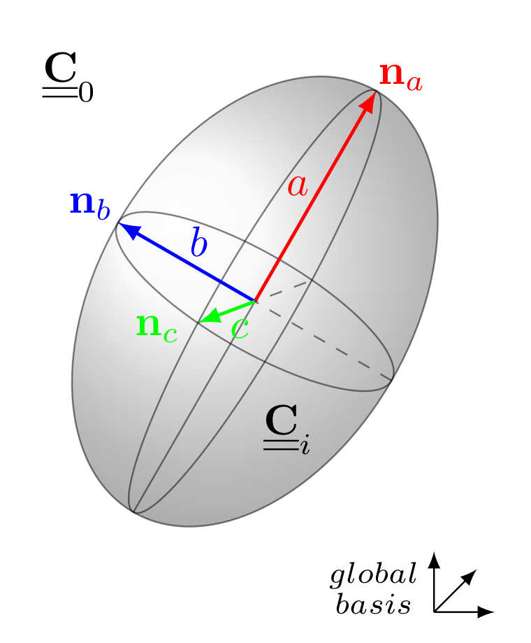
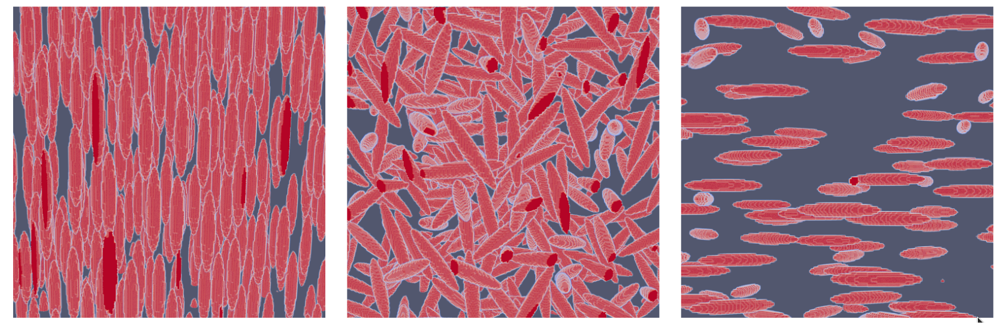
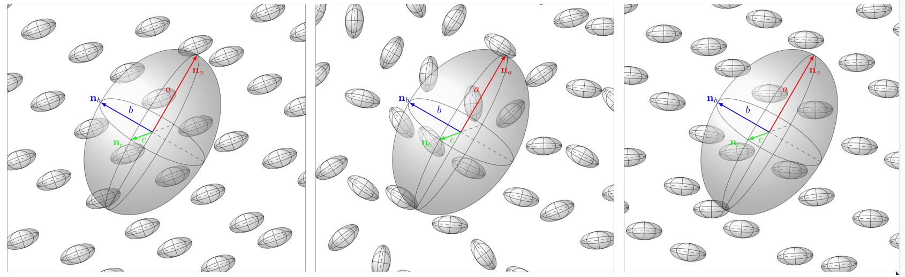

This page describes the `python` modules based on the `TFEL`
libraries.

# The `tfel.math` module

## Bindings related to the `tvector` class

Three classes standing for vectors are available: `TVector1D`, `TVector2D` and `TVector3D`.
These `class` can be initialized/modified as follows:

~~~~{.py}
import tfel.math as tm
n1=tm.TVector3D([1.,0.,0.])
n2=tm.TVector3D()
n2[0]=1.
n3_=np.array([1.,0.,0.])
n3=tm.TVector3D(n3_)
~~~~

## Bindings related to the `stensor` class

Three classes standing for symmetric tensors are available: `Stensor1D`, `Stensor2D` and `Stensor3D`.
These `class` can be initialized/modified as follows:

~~~~{.py}
import tfel.math as tm
s1=tm.Stensor3D([1.,0.,0.,0.,0.,0.])
s2=tm.Stensor2D([1.,0.,0.,0.])
sig=tm.Stensor3D()
sig[2]=1.e9
epsilon=np.zeros((6,))
epsilon[0]=0.001
eps=tm.Stensor3D(epsilon)
~~~~

The standard mathematical operations are defined:

- addition of two symmetric tensors.
- subtraction of two symmetric tensors.
- multiplication by scalar.
- in-place addition by a symmetric tensor.
- in-place subtraction by a symmetric tensor.
- in-place multiplication by scalar.
- in-place division by scalar.

The following functions are available:

- `sigmaeq`: computes the von Mises norm of a symmetric tensor.
- `tresca`: computes the Tresca norm of a symmetric tensor.

## Bindings related to the `st2tost2` class

Three classes standing for fourth-order tensors with minor symmetries
are available:
`ST2toST21D`, `ST2toST22D`, `ST2toST23D`.
These `class` can be initialized/modified as follows:

~~~~{.py}
import tfel.math as tm
s1=tm.ST2toST22D([[1.,0.,0.,0.],[0.,1.,0.,0.],[0.,0.,1.,0.],[0.,0.,0.,1.]])
C=tm.ST2toST23D()
C[2,2]=1.e9
A=np.zeros((6,6))
A[0,1]=0.001
A_=tm.ST2toST23D(A)
~~~~

## Walpole Basis

The Walpole basis associated to a transverse isotropic symmetry can be used.
See the C++ documentation [here](tfel-math.html#higher-order-objects-defined-as-derivatives).
Here is an example in `Python`:

~~~~{.py}
from tfel.math import WalpoleBasis, ST2toST23D, TVector3D
import numpy as np

n=TVector3D([1.,0.,0.])
E1=WalpoleBasis.E1(n)
E2=WalpoleBasis.E2(n)
E3=WalpoleBasis.E3(n)
E4=WalpoleBasis.E4(n)
F=WalpoleBasis.F(n)
G=WalpoleBasis.G(n)

tens=E1+E2+E3+E4+F+G
comp=WalpoleBasis.components(n,tens)
~~~~

`n` is the direction of transverse isotropy, and the vectors of the basis
are the `E1,...,G`.
`comp` returns a `list` of 6 components of `tens` in the Walpole basis.

# The `tfel.material` module

## Bindings related to the \(\pi\)-plane

The following functions are available:

- `buildFromPiPlane`: returns a tuple containing the three eigenvalues
  of the stress corresponding to the given point in the \(\pi\)-plane.
- `projectOnPiPlane`: projects a stress state, defined its three
  eigenvalues or by a symmetric tensor, on the \(\pi\)-plane.

## Bindings related to the Hosford equivalent stress

The `computeHosfordStress` function, which compute the Hosford
equivalent stress, is available.

## Bindings related to the Barlat equivalent stress

The following functions are available:

- `makeBarlatLinearTransformation1D`: builds a \(1D\) linear
  transformation of the stress tensor.
- `makeBarlatLinearTransformation2D`: builds a \(2D\) linear
  transformation of the stress tensor.
- `makeBarlatLinearTransformation3D`: builds a \(3D\) linear
  transformation of the stress tensor.
- `computeBarlatStress`: computes the Barlat equivalent Barlat stress.

## Bindings related to the `IsotropicModuli`

The three following `class` are available: `KGModuli`, `YoungNuModuli`
and `LambdaMuModuli`.
They can be constructed as: 

~~~~{.py}
import tfel.material as tmat
K=1e9
G=0.2e9
kg=tmat.KGModuli(K,G)
kg2=tmat.KGModuli(kg)
~~~~

their attributes are accessible and their methods permit to convert them:

~~~~{.py}
kg=tmat.KGModuli(3e6,2e6)
print(kg.kappa,kg.mu)

Enu=tmat.YoungNuModuli(1e6,0.2)
print(Enu.young,Enu.nu)

lg=tmat.LambdaMuModuli(0.5e6,1e6)
print(lg.lamb,lg.mu)

Enu2=kg.ToYoungNu()
print(Enu2.young,Enu2.nu)
~~~~
 
Note that Lamé coefficient is `lamb` in `Python` and `lambda` in `C++`.

## The `tfel.material.homogenization` module

The `tfel.material.homogenization` module mirrors the functionalities defined
in the namespace `tfel::material::homogenization::elasticity`. Hence,
the reader may be interested by the [details](tfel-material-homogenization.html)
of the documentation of this namespace.
The `Python` modules can be imported as follows:

~~~~{.py}
import tfel.material.homogenization as hm
import tfel.material as tmat
import tfel.math as tm
~~~~

{width=35%}

### Hill tensors

The Hill tensors are available:

~~~~{.py}
young=1e9
nu=0.2
P0=hm.computeSphereHillTensor(young,nu)

e=10.
n=tm.TVector3D([0.,0.,1.])
P1=hm.computeAxisymmetricalHillTensor(young,nu,n,e)

n_a=tm.TVector3D([0.,0.,1.])
n_b=tm.TVector3D([0.,1.,0.])
a=10.
b=1.
c=3.
P2=hm.computeHillTensor(young,nu,n_a,a,n_b,b,c)
~~~~

Note that the above functions have slightly different names from the `C++` version:
`computeHillPolarisationTensor` becomes `computeHillTensor`.
Moreover, as in `C++`, it is possible to pass isotropic moduli
objects instead of `young` and `nu`:

~~~~{.py}
IM0=tmat.YoungNuModuli(young,nu)
P0 = hm.computeSphereHillTensor(IM0)
P0_axi = hm.computeAxisymmetricalHillTensor(IM0,n_a,e)
P0_ellipsoid = hm.computeHillTensor(IM0,n_a,a,n_b,b,c)
~~~~

The computation in the anisotropic reference medium is given by:

~~~~{.py}
C0=tm.ST2toST23D(1e9*np.eye(6))
C0[0,2]=0.1e9
C0[2,0]=0.1e9

max_it=14 #optional

P=hm.computeAnisotropicHillTensor(C0,n_a,a,n_b,b,c,max_it)
~~~~

Note that the integer `max_it` is related to the number of
iterations in the integration process (see the [documentation](tfel-material-homogenization.html)
of the namespace).

### Localisation tensors

The computation of the strain localisation tensors are given by:

~~~~{.py}
young=1e9
nu=0.2
young_i=100e9
nu_i=0.3

# Spherical inclusion
A_S=hm.computeSphereLocalisationTensor(young,nu,young_i,nu_i)

# Axisymmetric ellipsoidal inclusion (or spheroid)
e=20.
n=tm.TVector3D([0.,0.,1.])
A_AE=hm.computeAxisymmetricalLocalisationTensor(young,nu,young_i,nu_i,n,e)

# General ellipsoidal inclusion
a=10.
b=1.
c=3.
n_a=tm.TVector3D([0.,0.,1.])
n_b=tm.TVector3D([0.,1.,0.])

A_GE=hm.computeLocalisationTensor(young,nu,young_i,nu_i,n_a,a,n_b,b,c)
~~~~

Some isotropic moduli can also be passed for the elasticities, as follows:

~~~~{.py}
IM0=tmat.YoungNuModuli(young,nu)
IMi=tmat.YoungNuModuli(young_i,nu_i)
A0 = hm.computeSphereLocalisationTensor(IM0,IMi)
A0_axi = hm.computeAxisymmetricalLocalisationTensor(IM0,IMi,n_a,e)
A0_ellipsoid = hm.computeLocalisationTensor(IM0,IMi,n_a,a,n_b,b,c)
~~~~

Note that if the elasticity of the inclusion
is not isotropic, an anisotropic elasticity `C_i` can be provided, assuming that this elasticiy
is expressed in the same basis as the one defined by `n_a,n_b` (the local basis of the inclusion):

~~~~{.py}
A_aniso = hm.computeLocalisationTensor(IM0,C_i,n_a,a,n_b,b,c)
~~~~

The case of an anisotropic reference medium is detailed below:

~~~~{.py}
# Anisotropic matrix
max_it=12 #optional
C0_glob=tm.ST2toST23D(1e9*np.eye(6)) # C0_glob is defined in the basis in which the localisation tensor is returned
C0_glob[0,2]=0.1e9
C0_glob[2,0]=0.1e9

Ci_loc=tm.ST2toST23D(1e9*np.eye(6)) # Ci_loc is defined in the basis defined by 'n_a' and 'n_b'

A_AN=hm.computeAnisotropicLocalisationTensor(C0_glob,Ci_loc,n_a,a,n_b,b,c,max_it)
~~~~

Note that in this case, the elasticity of the inclusion
is always passed as a `ST2toST2` object `C_i_loc`. Moreover, if this elasticity is not isotropic,
`C_i_loc` is expressed in the same basis as the one defined by `n_a,n_b`
(the local basis of the inclusion, see the [documentation](tfel-material-homogenization.html)
of the namespace).

### Two-phase composites

The following schemes are available for biphasic media with
2 isotropic phases:
 
 - Mori-Tanaka scheme
 - dilute scheme
 - Ponte Castaneda and Willis scheme

Here are some examples of computation for the spherical inclusions:
 
~~~~{.py}
young=1e9
nu=0.2
young_i=100e9
nu_i=0.3
f=0.2
IM=tmat.YoungNuModuli(young,nu)
IMi=tmat.YoungNuModuli(young_i,nu_i)

# Spherical inclusions
EnuDS=hm.computeSphereDiluteScheme(young,nu,f,young_i,nu_i)
EnuMT=hm.computeSphereMoriTanakaScheme(young,nu,f,young_i,nu_i)
KGDS_IM=hm.computeSphereDiluteScheme(IM,f,IMi)
KGMT_IM=hm.computeSphereMoriTanakaScheme(IM,f,IMi)
print(EnuDS.young,EnuDS.nu,KGDS_IM.kappa,KGDS_IM.mu)
print(EnuMT.young,EnuMT.nu,KGMT_IM.kappa,KGMT_IM.mu)
~~~~

And we can also consider distribution of ellipsoidal inclusions,
with three kind of distributions of orientations.

{width=100%}

Hence, here are the examples to compute the homogenized properties:

~~~~{.py .numberLines}
# Ellipsoidal inclusions
a=10.
b=1.
c=3.
n_a=tm.TVector3D([0.,0.,1.])
n_b=tm.TVector3D([0.,1.,0.])

## Isotropic distribution of orientations
KG_I_DS=hm.computeIsotropicDiluteScheme(IM,f,IMi,a,b,c)
KG_I_MT=hm.computeIsotropicMoriTanakaScheme(IM,f,IMi,a,b,c)

D=hm.Distribution(n_a,a,n_b,b,c)
C_I_PCW=hm.computeIsotropicPCWScheme(IM,f,IMi,a,b,c,D)

print(KG_I_DS.kappa,KG_I_DS.mu)
print(KG_I_MT.kappa,KG_I_MT.mu)
print(C_I_PCW)

## Ellipsoids which turn around their axis 'a'
C_TI_DS=hm.computeTransverseIsotropicDiluteScheme(IM,f,IMi,n_a,a,b,c)
C_TI_MT=hm.computeTransverseIsotropicMoriTanakaScheme(IM,f,IMi,n_a,a,b,c)
C_TI_PCW=hm.computeTransverseIsotropicPCWScheme(IM,f,IMi,n_a,a,b,c,D)
print(C_TI_DS)
print(C_TI_MT)
print(C_TI_PCW)

## Oriented ellipsoids
C_O_DS=hm.computeOrientedDiluteScheme(IM,f,IMi,n_a,a,n_b,b,c)
C_O_MT=hm.computeOrientedMoriTanakaScheme(IM,f,IMi,n_a,a,n_b,b,c)
C_O_PCW=hm.computeOrientedPCWScheme(IM,f,IMi,n_a,a,n_b,b,c,D)
print(C_O_DS)
print(C_O_MT)
print(C_O_PCW)
~~~~

{width=100%}

In Ponte-Castaneda and Willis scheme (PCW), there is a difference between
the ellipsoid which defines the distribution of the inclusions, and the
ellipsoid which defines the shape of the inclusions (in the image above, we represent
the distribution `D` of inclusions by a big ellipsoid, with colored axes).
A bigger axis for `D` means that along this axis, the distribution of inclusions
is more diluted. A short axis means that, on the contrary, the distribution is denser
along this axis. The object `D` is defined above at line 12.

### Second-moments of the strains (Hashin-Shtrikman two-phase composite)

The second-moments of the strains for a Hahsin-Shtrikman type composite
can be computed as follows:

~~~~{.py .numberLines}
eeq2r=computeMeanSquaredEquivalentStrain(KG0,f,KGi,Em2,Eeq2)
print("average of eeq2 on matrix:",eeq2r[0],"average of eeq2 on inclusion:",eeq2r[1])
em2r=computeMeanSquaredHydrostaticStrain(KG0,f,KGi,Em2,Eeq2)
print("average of em2 on matrix:",em2r[0],"average of em2 on inclusion:",em2r[1])
~~~~

### Homogenization bounds

The available bounds are:

 - Voigt bound
 - Reuss bound
 - Hashin-Shtrikman bounds
 
Here are some examples of computation:

~~~~{.py}
f0=0.2
f1=0.5
f2=0.3
C0=tm.ST2toST23D(np.eye(6))
C1=tm.ST2toST23D(2*np.eye(6))
C2=tm.ST2toST23D(5*np.eye(6))

C0_2d=tm.ST2toST22D(np.eye(4))
C1_2d=tm.ST2toST22D(2*np.eye(4))
C2_2d=tm.ST2toST22D(5*np.eye(4))

# Voigt and Reuss bounds
CV_3D=hm.computeVoigtStiffness3D([f0,f1,f2],[C0,C1,C2])
CV_2D=hm.computeVoigtStiffness2D([f0,f1,f2],[C0_2d,C1_2d,C2_2d])
CR_3D=hm.computeReussStiffness3D([f0,f1,f2],[C0,C1,C2])
CR_2D=hm.computeReussStiffness2D([f0,f1,f2],[C0_2d,C1_2d,C2_2d])

print(CR_3D,CV_3D)
print(CR_2D,CV_2D)

# Hashin-Shtrikman bounds
K0=1/3
G0=1/2
K1=2/3
G1=1
K2=5/3
G2=5/2
KG_HS_3D=hm.computeIsotropicHashinShtrikmanBounds3D([f0,f1,f2],[K0,K1,K2],[G0,G1,G2])
KG_HS_2D=hm.computeIsotropicHashinShtrikmanBounds2D([f0,f1,f2],[K0,K1,K2],[G0,G1,G2])

K_LB_3D=KG_HS_3D[0][0]
G_LB_3D=KG_HS_3D[0][1]
K_UB_3D=KG_HS_3D[1][0]
G_UB_3D=KG_HS_3D[1][1]

print(K_LB_3D,G_LB_3D)
print(K_UB_3D,G_UB_3D)

K_LB_2D=KG_HS_2D[0][0]
G_LB_2D=KG_HS_2D[0][1]
K_UB_2D=KG_HS_2D[1][0]
G_UB_2D=KG_HS_2D[1][1]

print(K_LB_2D,G_LB_2D)
print(K_UB_2D,G_UB_2D)
~~~~

Note that Voigt and Reuss bounds work on `ST2toST2` objects, whereas
Hashin-Shtrikman bounds work on bulk and shear moduli.
The number of phases is arbitrary.

### Polyphasic microstructures

The two types of microstructures defined in TFEL are available:

 - `ParticulateMicrostructure`
 - `Polycrystal`

A `ParticulateMicrostructure` object represents
a very general matrix-inclusion microstructure.
A `Polycrystal` is a microstructure composed of
grains, in which there is no matrix phase.
For more details, see [here](tfel-material-homogenization.html#polyphasic-microstructures).

#### `Inclusion` and `InclusionDistribution`

Some particular objects are defined to construct a `ParticulateMicrostructure` (here in 3d):

 - `Ellipsoid` (child of `Inclusion3D`)
 - `Spheroid` (child of `Ellipsoid` with the last two semi-lengths identical)
 - `Sphere` (child of `Spheroid` with 3 semi-lengths equal to unity)

Let us try:

~~~~{.py}
a=10
b=2
c=3
sphere=hm.Sphere()
spheroid=hm.Spheroid(a,b)  # here, it gives a prolate spheroid
ellipso=hm.Ellipsoid(a,b,c)
print(sphere.semi_lengths) # the default lengths are 1 for a Sphere
print(spheroid.semi_lengths) # the two last lengths correspond to b=2
print(ellipso.semi_lengths)
print(spheroid.axis_length(),spheroid.transverse_length()) # these methods are available for a spheroid
~~~~

However, to construct a `ParticulateMicrostructure` object,
we have to instantiate a `InclusionDistribution` object. There are four kinds of such a distribution:

 - `SphereDistribution` (distribution of spheres)
 - `IsotropicDistribution` (isotropic distribution of ellipsoids)
 - `TransverseDistribution` (transverse isotropic distribution of ellipsoids)
 - `OrientedDistribution` (aligned distribution of ellipsoids)
 - `UserDefinedDistributionOfSpheroids` (distribution of spheroids defined with orientation tensors)

 We can instantiate these objects in various ways (see the `C++` documentation for other details):

~~~~{.py}
IMi=tmat.KGModuli(1e9,1e9)
f=0.1
sph_dist=hm.SphereDistribution(sphere,f,IMi)
ellipsoid_dist_iso=hm.IsotropicDistribution(ellipso,f,IMi)
n_a=tm.TVector3D([0.,0.,1.])
n_b=tm.TVector3D([0.,1.,0.])
ellipsoid_dist_O=hm.OrientedDistribution(ellipso,f,IMi,n_a,n_b)
~~~~

Note that the `OrientedDistribution` can be instantiated with a `ST2toST2` object,
here `Ci` (and it is also possible for a `SphereDistribution`):

~~~~{.py}
Ci=tm.ST2toST23D(1e9*np.eye(6)) # arbitrary definition of Ci
Ci[0,1]=1e8
Ci[1,0]=1e8
ellipsoid_dist_O_2=hm.OrientedDistribution(ellipso,f,Ci,n_a,n_b)
~~~~

This can be useful for considering anisotropic inclusions. However, the basis in which
`Ci` is defined is the local basis for the `OrientedDistribution`, that is, the
basis defined by `n_a` and `n_b` passed as arguments. For a `SphereDistribution`,
it is the global basis.

The `TransverseDistribution` is a special case
which requires to precise which axis of the ellipsoid (or spheroid)
will remain fixed when the two other axes rotate:

~~~~{.py}
index=0 # here, the first axis (for example, a=10 defined above) is oriented along n_a
# and the two other axes of the ellipsoid are uniformly distributed in the transverse plane
ellipsoid_dist_TI=hm.TransverseIsotropicDistribution(ellipso,f,IMi,n_a,index)
~~~~

The index can be 0,1 or 2. For a spheroid, giving `2` for the `index`
is the same as giving `1`, because these 2 axes have the same length.

Another type of distribution can be defined: the `UserDefinedDistributionOfSpheroids`.
This is a distribution of spheroids defined with two orientation tensors,
that incorporate microstructural information about the orientations
of the spheroids (see in the [C++ documentation](tfel-material-homogenization.html#polyphasic-microstructures)
for the definition of orientation tensors).
This kind of distribution can be constructed with `Spheroid` objects only.
This is done as follows:

~~~~{.py}
spheroid=hm.Spheroid(10,1)
KGi=tmat.KGModuli(300,200)
A2=tm.Stensor3D([1.,1.,1.,0.,0.,0.]) # arbitrary definition of A2
tenseur=np.zeros((6,6))
tenseur[0,0]=0.1
A4=tm.ST2toST23D(np.eye(6)+tenseur) # arbitrary definition of A4
distrib=hm.UserDefinedDistributionOfSpheroids(spheroid,f,KGi,A2,A4)
~~~~

Above, the tensor `A2` is the second-order orientation tensor, and
`A4` is the fourth-order orientation tensor.

The inclusion distributions have an attribute `inclusion`:

~~~~{.py}
elli=ell_dist.inclusion
print(elli.semi_lengths)
~~~~

Note that here, the `inclusion` object is in fact an `Inclusion3D` object,
with the semi-lengths defined at the definition of the isotropic distribution
of ellipsoids.

All the inclusion distributions have also three methods. The first
just states if the distribution was instantiated with isotropic
elastic moduli or with a `ST2toST2` object. Here,
it was instantiated with a `KGModuli`, so that it is considered isotropic.
Hence,

~~~~{.py}
print(ell_dist.isIsotropic())
~~~~

returns `True`.

The second method of the distribution allows to compute
the mean strain localisation (or concentration) tensor in the inclusions
when they are embedded in a matrix:

~~~~{.py}
Ai=ell_dist.computeMeanLocalisator(IM0)
print(Ai)
~~~~

Note that in the latter case, passing `C0`, a `ST2toST2` object
as an argument of the method will return an error, because
it will be considered that the matrix is not isotropic,
so that computing a average localisator of a distribution
of ellipsoids in an anisotropic matrix is impossible (too complicated).
However, it can be done for other kinds of distributions, like
sphere distributions or distributions of oriented inclusions:

~~~~{.py}
A1=sph_dist.computeMeanLocalisator(C0,10)
A2=ellipsoid_dist_O.computeMeanLocalisator(C0,10)
print(A1,A2)
~~~~

Here, the integer `10` is the number of subdivisions in the integration
process in the computation of the Hill tensor relative to the inclusions.
It is `12` by default.

The last method of the inclusion distributions is `computeDerivativesOfMeanLocalisator`
which gives the derivative of the function `computeMeanLocalisator`
w.r.t. the moduli of the phases (see the [C++ documentation](tfel-material-homogenization.html#description-of-the-components-of-a-microstructure) for details). Let us try:

~~~~{.py}
spheroid_dist_iso=hm.IsotropicDistribution(spheroid,f,IMi)
dA_dk0 = spheroid_dist_iso.computeDerivativesOfMeanLocalisator(IM0,[1.,0.,0.,0.])
dA_dmu0 = spheroid_dist_iso.computeDerivativesOfMeanLocalisator(IM0,[0.,1.,0.,0.])
dA_dki = spheroid_dist_iso.computeDerivativesOfMeanLocalisator(IM0,[0.,0.,1.,0.])
dA_dmui = spheroid_dist_iso.computeDerivativesOfMeanLocalisator(IM0,[0.,0.,0.,1.])
print("dA_dk0: ",dA_dk0)
print("dA_dmu0: ",dA_dmu0)
print("dA_dki: ",dA_dki)
print("dA_dmui: ",dA_dmui)
~~~~

#### Construction of a `ParticulateMicrostructure`

{width=50%}

The `ParticulateMicrostructure` object is  defined and can be instantiated
in various ways:

~~~~{.py}
IM0=tmat.KGModuli(1e7,1e7)
micro_1=hm.ParticulateMicrostructure(IM0) # instantiation with an IsotropicModuli

C0=tm.ST2toST23D(1e7*np.eye(6))
micro_2=hm.ParticulateMicrostructure(C0) # instantiation with a ST2toST23D
~~~~

where `C0` and `IM0` correspond to the elasticity
of the matrix phase.
The `ParticulateMicrostructure` has no public attribute. However,
it has some methods that return the value of the
private attributes:

~~~~{.py}
print(micro_1.getNumberOfPhases()) # there is only one phase: the matrix phase
print(micro_1.getMatrixFraction()) # the volume fraction of the matrix is 1
print(micro_1.getMatrixElasticity()) # the elasticity of the matrix is a ST2toST23D
print(micro_1.isIsotropicMatrix()) # micro_1 is isotropic because instantiated with an IsotropicModuli
~~~~

Note that last line returns `True` if `micro_1` was instantiated with
objects like `KGModuli`, `YoungNuModuli`, `LambdaMuModuli`, and `False`
when instantiated with a `ST2toST2` (like `micro_2` above).

We can add a distribution of inclusions to the `ParticulateMicrostructure` (once such a distribution is instantiated):

~~~~{.py}
micro_1.addInclusionPhase(sph_dist) 
print(micro_1.getNumberOfPhases()) # there is now 2 phases
print(micro_1.getMatrixFraction()) # the sphere distribution that was added had a volume fraction
# of 0.1 so that the volume fraction of the matrix is now 0.9

micro_1.addInclusionPhase(ellipsoid_dist_iso)
print(micro_1.getNumberOfPhases()) # there is now 3 phases
print(micro_1.getMatrixFraction()) # the volume fraction of the matrix is now 0.8
~~~~

or remove them:

~~~~{.py}
micro_1.removeInclusionPhase(0) # the sphere distribution was removed
print(micro_1.getNumberOfPhases()) # there is again 2 phases
print(micro_1.getMatrixFraction()) # the fraction of the matrix is 0.9
~~~~

At the end, only one `InclusionDistribution` object
remains in the microstructure. We can get this distribution by doing:

~~~~{.py}
ell_dist=micro_1.getInclusionPhase(0) # we get the isotropic distribution of ellipsoids
print(ell_dist.fraction)
print(ell_dist.getElasticityOfPhase())
~~~~

The last method of the `ParticulateMicrostructure` object allows to change
the elasticity of the matrix phase:

~~~~{.py}
micro_1.changeElasticityOfMatrixPhase(C0)
print(micro_1.getMatrixElasticity())
print(micro_1.isIsotropicMatrix()) # returns False
~~~~

Here we see that the matrix is no more isotropic
because it was replaced via a `ST2toST2` object.

#### `Grain` object

The `Grain` object must be instantiated to construct the `Polycrystal`. This grain has 5 attributes: `inclusion`
(which can be a `Sphere`, a `Spheroid` or an `Ellipsoid`),
a `fraction` (the volume fraction), a `stiffness` (the stiffness of the `Grain`), and two vectors, `n_a` and `n_b` which define
the orientation of the grain (the axes of the related `inclusion`). The `Grain` can be instantiated
as follows:

~~~~{.py}
grain1=Grain(ellipso,frac,IMi,n_a,n_b)
grain2=Grain(spheroid,frac,IMi,n_a,n_b)
~~~~

The `Grain` has also methods: `getElasticityOfPhase` (get the elasticity of the grain),
`changeElasticityOfPhase`, `isIsotropic`, `computeMeanLocalisator` and
`computeDerivativesOfMeanLocalisator` (see the [C++ documentation](tfel-material-homogenization.html#description-of-the-components-of-a-microstructure) for details).

#### Construction of a `Polycrystal`

We can instantiate a `Polycrystal` as follows:

~~~~{.py}
poly=Polycrystal()
~~~~

We can add some grains to our polycrystal:

~~~~{.py}
poly.addGrain(grain1)
poly.addGrain(grain2)
~~~~

and we can remove grains:

~~~~{.py}
poly.removeGrain(0)
~~~~

The other methods available for a `Polycrystal` are:

 - `changeElasticityOfGrain`
 - `changeFractionOfGrain`
 - `getNumberOfGrains`
 - `getTotalFraction`
 - `getGrain`

Note that we cannot add
a grain when its volume fraction is such that
the polycrystal would have a volume fraction superior
to 1. Similarly, we cannot change the fraction of a grain
if the new fraction is such that the polycrystal
would have a fraction superior to 1.

#### Computation of homogenization schemes

The following homogenization schemes are available for
`ParticulateMicrostructure` objects:

 - `computeDiluteScheme` (Dilute scheme)
 - `computeMoriTanakaScheme` (Mori-Tanaka scheme)
 - `computeAsymmetricSelfConsistentScheme` (Asymmetric Self-consistent scheme)

These functions take a `ParticulateMicrostructure` as an argument.
For a `Polycrystal`, the available homogenization scheme
is:

 - `computeSelfConsistentScheme` (Self-consistent scheme)

This function takes a `Polycrystal`
as an argument.

All these functions return a `HomogenizationScheme` object.
This object is a structure with the following attributes:

 - `homogenized_stiffness`
 - `effective_polarisation`
 - `mean_strain_localisation_tensors`
 - `derivative_of_homogenized_stiffness_wrt_kr`
 - `derivative_of_homogenized_stiffness_wrt_mur`

 
Let us consider the previous `ParticulateMicrostructure` object `micro_1`.
We already have seen that computing some average localisators
in an anisotropic matrix
was not possible for non-oriented anisotropic inclusions like ellipsoids.
Hence, we here recover the isotropic matrix by doing

~~~~{.py}
micro_1.changeElasticityOfMatrixPhase(IM0)
print(micro_1.isIsotropicMatrix())
~~~~

Afterwards,

~~~~{.py}
hmDS=hm.computeDiluteScheme(micro_1)
hmMT=hm.computeMoriTanakaScheme(micro_1)
hmSC=hm.computeAsymmetricSelfConsistentScheme(micro_1,1e-6,True)
print("DS: ",hmDS.homogenized_stiffness)
print("MT: ",hmMT.homogenized_stiffness)
print("SC: ",hmSC.homogenized_stiffness)
~~~~

We note that `computeAsymmetricSelfConsistentScheme` not only takes
the microstructure as an argument, but also takes one real (`1e-6`) as
a parameter, which pilots the precision of the result. Indeed, at each iteration
of the self-consistent iterative algorithm, the function computes the relative
difference between the new and the old homogenized stiffness. This relative
difference must be smaller than the tolerance given as a parameter.
Moreover, the `bool` parameter (`True`) precises if
the computation considers an isotropic matrix when computing the Hill tensors
relative to the inclusions, at each iteration of the algorithm. Indeed,
the homogenized stiffness may be non isotropic, so that the user can
make the choice of isotropizing this homogenized stiffness at each iteration.
Otherwise, he can put `False`, so that a numerical integration (resulting
in a slower computation) will be performed to compute the Hill tensors.
Moreover, an integer parameter can be added after the boolean, that indicates
the number of subdivisions in the numerical integration. This value is `12` by
default:

~~~~{.py}
micro_2.addInclusionPhase(ellipsoid_dist_O)
hmASC_iso=hm.computeAsymmetricSelfConsistentScheme(micro_2,1e-6,True)
hmASC_aniso=hm.computeAsymmetricSelfConsistentScheme(micro_2,1e-2,False,10)
print("ASC iso: ",hmASC_iso.homogenized_stiffness)
print("ASC aniso: ",hmASC_aniso.homogenized_stiffness)
~~~~

For the `Polycrystal`, we can do

~~~~{.py}
Cini=C0
hmSC_iso=hm.computeSelfConsistentScheme(poly,1e-6,Cini,True)
print("SC iso: ",hmSC_iso.homogenized_stiffness)
hmSC_aniso=hm.computeSelfConsistentScheme(poly,1e-2,Cini,False,10)
print("SC aniso: ",hmSC_aniso.homogenized_stiffness)
~~~~

Here, there is an additional argument `Cini`, compared to `computeAsymmetricSelfConsistentScheme`,
which is the initialization of the homogenized stiffness,
in the Self-Consistent algorithm. 

For the oter schemes, the isotropic character of the matrix
when computing the strain localisators will depend
on what returns `micro_1.isIsotropicMatrix()`. Hence, it is important
to initialized the matrix or the microstructure with the appropriate
elastic moduli. If isotropic, it will works in all case, whereas
if not isotropic, it will fail depending on the distributions that are present
in the microstructure.
Moreover, if anisotropic, another parameter can be passed to specify the
number of subdivisions in the numerical integration (this value is `12`
by default):

~~~~{.py}
micro_1.changeElasticityOfMatrixPhase(C0)
micro_1.removeInclusionPhase(0)
micro_1.addInclusionPhase(ellipsoid_dist_O)
hmDS_aniso=hm.computeDiluteScheme(micro_1,10)
hmMT_aniso=hm.computeMoriTanakaScheme(micro_1,10)
~~~~

#### Strain localisation tensors on each phase

We can also recover the strain localisation tensors:

~~~~{.py}
A_i_DS=hmDS.mean_strain_localisation_tensors
print("A_0_DS: ",A_i_DS[0],"A_1_DS: ",A_i_DS[1])
~~~~

#### Prescribing a polarisation on each phase

We can also add a polarization on each phase:

~~~~{.py}
micro_1.changeElasticityOfMatrixPhase(IM0)
pola=[tm.Stensor3D(6*[0.]),tm.Stensor3D([1.e8,1e8,1e8,0.,0.,0.])]
hmDS_pola=hm.computeDiluteScheme(micro_1,polarisations=pola)
~~~~

(note that here we must precise the name of the optional argument).
And we can recover the effective polarization:

~~~~{.py}
P_eff_DS=hmDS_pola.effective_polarisation
print("P_eff_DS: ",P_eff_DS)
~~~~

#### Second-moments of the strains

The second-moments of the strains are classically obtained
with the derivatives of the homogenized stiffness w.r.t. the
elastic moduli. These derivatives are provided by the
`HomogenizationScheme`, in the case the phases are locally isotropic
(and only in 3D). This can be done as follows:

~~~~{.py}
micro_1.removeInclusionPhase(0)
micro_1.addInclusionPhase(spheroid_dist_iso) # this distribution of spheroids is compatible with the derivation
h_DS = hm.computeDiluteScheme(micro_1,polarisations=[],with_Chom_derivatives=True)
dCDS_dkr = h_DS.derivative_of_homogenized_stiffness_wrt_kr
dCDS_dmur = h_DS.derivative_of_homogenized_stiffness_wrt_mur
print("dCDS_dk0: ",dCDS_dkr[0])
print("dCDS_dk1: ",dCDS_dkr[1])
print("dCDS_dmu0: ",dCDS_dmur[0])
print("dCDS_dmu1: ",dCDS_dmur[1])
~~~~

Here, the `boolean` `with_Chom_derivatives` is set equal to `True`
to compute the derivatives of the homogenized stiffness
If it is `False`, the attribute `.derivative_of_homogenized_stiffness_wrt_kr`
is an empty list. If it is computed, this attribute is a list
which contains as many tensors as the number of phases in the
`ParticulateMicrostructure`. The tensor number `i` corresponds to the
derivative of the homogenized stiffness w.r.t. the bulk modulus
`ki` relative to phase `i`.

For the `Polycrystal`, we can for example use `computeSelfConsistentScheme`
like that:

~~~~{.py}
h_SC = hm.computeSelfConsistentScheme(poly,1e-6,Cini,isotropic=True,polarisations=[],with_Chom_derivatives=True)
dCSC_dkr = h_SC.derivative_of_homogenized_stiffness_wrt_kr
dCSC_dmur = h_SC.derivative_of_homogenized_stiffness_wrt_mur
~~~~

Note that these derivatives are available only when distributions of spheroids
are considered (see the analytical computation [here](tfel-material-homogenization.html#second-moments-of-the-strains)).

<!-- Local IspellDict: english -->
