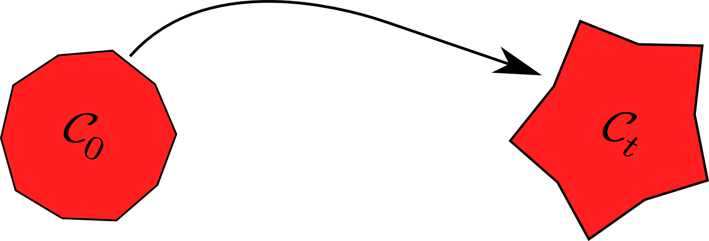

% Nonlinear mechanical behaviours of materials
% Thomas Helfer
% 2017

\newcommand{\tenseur}[1]{\underline{#1}}
\newcommand{\tenseurq}[1]{\underset{=}{\mathbf{#1}}}
<!-- the previous works better than the standard solution: -->
<!-- \newcommand{\tenseurq}[1]{\underline{\underline{{\mathbf{#1}}}}} -->
\newcommand{\tns}[1]{{\underset{\tilde{}}{\mathbf{#1}}}}
\newcommand{\transpose}[1]{{#1^{\mathop{T}}}}

\newcommand{\paren}[1]{\left(#1\right)}
\newcommand{\trace}[1]{\mathrm{tr}\left(#1\right)}
\newcommand{\tsigma}{\underline{\sigma}}

\newcommand{\Frac}[2]{{{\displaystyle \frac{\displaystyle #1}{\displaystyle #2}}}}
\newcommand{\deriv}[2]{{\displaystyle \frac{\displaystyle \partial #1}{\displaystyle \partial #2}}}
\newcommand{\sderiv}[2]{{\displaystyle \frac{\displaystyle \partial^{2} #1}{\displaystyle \partial #2^{2}}}}
\newcommand{\dtot}{{{\mathrm{d}}}}
\newcommand{\derivtot}[2]{{\displaystyle \frac{\displaystyle \dtot #1}{\displaystyle \dtot #2}}}
\newcommand{\grad}[1]{{\displaystyle \overset{\longrightarrow}{\nabla} #1}}
\newcommand{\Grad}[1]{\mathop{\mathrm{Grad}\,#1}}
\newcommand{\diver}[1]{{\displaystyle \vec{\nabla} . #1}}
\newcommand{\divergence}{\mathop{\mathrm{div}}}
\newcommand{\Divergence}{\mathop{\mathrm{Div}}}

\newcommand{\bts}[1]{\left.#1\right|_{t}}
\newcommand{\mts}[1]{\left.#1\right|_{t+\theta\,\Delta\,t}}
\newcommand{\ets}[1]{\left.#1\right|_{t+\Delta\,t}}

\newcommand{\epsilonto}{\epsilon^{\mathrm{to}}}
\newcommand{\tepsilonto}{\underline{\epsilon}^{\mathrm{to}}}
\newcommand{\tdepsilonto}{\underline{\dot{\epsilon}}^{\mathrm{tox}}}
\newcommand{\tepsilonel}{\underline{\epsilon}^{\mathrm{el}}}
\newcommand{\tdepsilonel}{\underline{\dot{\epsilon}}^{\mathrm{el}}}
\newcommand{\tepsilonth}{\underline{\epsilon}^{\mathrm{th}}}
\newcommand{\epsilonvis}{\epsilon^{\mathrm{vis}}}
\newcommand{\tepsilonvis}{\underline{\epsilon}^{\mathrm{vis}}}
\newcommand{\depsilonvis}{\dot{\epsilon}^{\mathrm{vis}}}
\newcommand{\tdepsilonvis}{\underline{\dot{\epsilon}}^{\mathrm{vis}}}
\newcommand{\tepsilonp}{\underline{\epsilon}^{\mathrm{p}}}
\newcommand{\tdepsilonp}{\underline{\dot{\epsilon}}^{\mathrm{p}}}

\newcommand{\energieinterne}{e}
\newcommand{\energielibre}{\Psi}
\newcommand{\energielibreel}{{\Psi}^{el}}
\newcommand{\energielibreine}{{\Psi}^{inél}}
\newcommand{\energielibreduale}{\Psi^{\star}}
\newcommand{\potentieldissip}{\Phi}
\newcommand{\potentieldissipdual}{\Phi^{\star}}

\newcommand{\discret}[1]{\mathbb{#1}}
\newcommand{\residuEF}{\discret{\vec{R}}}
\newcommand{\forceintEF}{\discret{\vec{F}}_{i}}
\newcommand{\forceextEF}{\discret{\vec{F}}_{e}}
\newcommand{\forceintElem}{\discret{\vec{F}}_{i}^{e}}
\newcommand{\champEF}{\discret{\vec{v}}^{h}}

# Preliminary mathematical results

## Tensors

Second order tensors can be represented by matrices:
\[
  \tns{F}=
  \begin{pmatrix}
    F_{11} & F_{12} & F_{13} \\
    F_{21} & F_{22} & F_{23} \\
    F_{31} & F_{32} & F_{33} \\
  \end{pmatrix}
  \]

In `TFEL/MFront`, a tensor is stored as an array of values, as follows
in \(3D\):
\[
  \tenseur{s}=
  \begin{pmatrix}
    s_{\,11}\quad
    s_{\,22}\quad
    s_{\,33}\quad
    s_{\,12}\quad
    s_{\,21}\quad
    s_{\,13}\quad
    s_{\,31}\quad
    s_{\,23}\quad
    s_{\,32}
  \end{pmatrix}^{T}
\]

The trace of a tensor is defined by:

\[
 \trace{\tns{F}}=\sum_{i=0}^{3}F_{ii}
\]

The products of two tensors is defined by:

\[
  \paren{\tns{F}\,.\,\tns{G}}_{ij}=\sum_{k=0}^{3}F_{ik}\,G_{kj}\neq\paren{\tns{G}\,.\,\tns{F}}_{ij}
  \]

The contracted product of two tensors defines a scalar product:

\[
\tns{F}\,\colon\,\tns{\pi}=\trace{\tns{F}\,.\,\tns{\pi}}=\sum_{i=0}^{3}\sum_{j=0}^{3}F_{ij}\,\pi_{ji}=F_{ij}\,\pi_{ji}
\]

## Symmetric tensors

A symmetric tensor is stored as an array of values (vector notation),
as follows in \(3D\):

\[
\tenseur{s}=
\begin{pmatrix}
  s_{\,11}\quad
  s_{\,22}\quad
  s_{\,33}\quad
  \sqrt{2}\,s_{\,12}\quad
  \sqrt{2}\,s_{\,13}\quad
  \sqrt{2}\,s_{\,23}
\end{pmatrix}^{T}
\]

The contracted product of two symmetric tensors is the scalar product
  of their vector forms (hence the \(\sqrt{2}\)).

### Diagonalisation of a symmetric tensor

Symmetric tensors are diagonalisable:
\[
\tenseur{s}=\sum_{i=0}^{3}\lambda_{i}\,\tenseur{n}_{i}
\]

- \(\lambda_{i}\) are the eigenvalues of the tensor.
- The eigentensors \(\tenseur{n}_{i}\) are orthogonals.

### Isotropic functions of symmetric tensors

This decomposition allows the definition of isotropic functions of
tensors (logarithm, exponential, square root, ..):

\[
\tepsilonto_{\mathrm{log}}=\sum_{i=0}^{3}f\paren{\lambda_{i}}\,\tenseur{n}_{i}
\]

# Kinematics

## Deformation of a body

{width=75%}

- at a given time \(t\), a structure is characterised by its
  {\em configuration} \(\mathcal{C}_{t}\);
- the initial configuration \(\mathcal{C}_{0}\) is often taken
  as the reference configuration
- the motion is described by a family of mappings \(\phi_{t}\),
  the {\bf deformation}, which associates a point \(\vec{X}\) in
  \(\mathcal{C}_{0}\) to its position \(\vec{x}\) in
  \(\mathcal{C}_{t}\)~:
  \[
  \vec{x}=\phi_{t}\paren{\vec{X}}=\vec{X}+\vec{u}_{t}\paren{\vec{X}}
  \]
- \(\vec{u}_{t}\) is the {\bf displacement field}

### Deformation gradient

- Locally, the material is mechanically loaded if the
  deformation of the current point differs from the deformation of
  its neighbours
- The \nom{Taylor} expansion of the deformation leads to:
  \[
  \phi\paren{\vec{X}+\dtot\,\vec{X}}-\phi\paren{\vec{X}}=\deriv{\phi}{\vec{X}}\,.\dtot\,\vec{X}+\underbrace{\vec{X}\,.\,\Frac{\partial^{2}\,\phi}{\partial\,\vec{X}^{2}}\,.\dtot\,\vec{X}+\ldots}_{\text{Higher order terms}}
  \]
- The deformation gradient \(\tns{F}\) is a tensor defined by~:
  \[
  \tns{F}=\deriv{\phi}{\vec{X}}=\tns{I}+\deriv{\vec{u}}{\vec{X}}
  \]
- Volume change:
  \[
  J=\det\paren{\deriv{\vec{x}}{\vec{X}}}=\det{\tns{F}}
  \]
  
Higher order theories will not be considered in this course in this
paper.

### Polar decomposition of $\tns{F}$

"){width=75%}

- Unicity and existence of a polar decomposition of \(\tns{F}\):
  \(
  \quad\quad\tns{F}=\tns{R}\,.\tenseur{U}=\tenseur{V}\,.\tns{R}
  \)
- \(\tns{R}\) is a rotation
- \(\tenseur{V}\) and \(\tenseur{U}\) are {\bf symmetric tensors}
- \(\tenseur{V}\) is the eulerian stretch tensor:
    - \(\bts{\tenseur{V}}\) and \(\ets{\tenseur{V}}\) are
    expressed in two different configuration:
  - \(\Delta\,\tenseur{V}=\ets{\tenseur{V}}-\bts{\tenseur{V}}\)
    is {\bf not} well defined
  - \(\tenseur{U}\) is the lagrangian stretch tensor:
    - expressed in the reference configuration
  - \(\Delta\,\tenseur{U}=\ets{\tenseur{U}}-\bts{\tenseur{U}}\)
    is {\bf well defined}
  - Volume change:
  \[
  J=\det\,\tns{F}=\det\,\tenseur{U}
  \]

### Pure dilatation

- Pure dilatations correspond to diagonal deformation gradients~:
  \[
  \tns{F}=\tenseur{U}=
  \begin{pmatrix}
    F_{11} & 0 & 0 \\
    0 & F_{22} & 0 \\
    0 & 0 & F_{33} \\
  \end{pmatrix}
  \]
- Example of thermal expansion.

### Rate of deformation

- velocity of a point:
  \[
  \vec{v}=\derivtot{\vec{x}}{t}
  \]
- gradient velocity of a point:
  \[
  \tns{L}=\deriv{\vec{\dot{x}}}{\vec{x}}=\deriv{\vec{\dot{x}}}{\vec{X}}\,.\,\deriv{\vec{X}}{\vec{x}}=\paren{\derivtot{}{t}\deriv{\vec{x}}{\vec{X}}}\,.\,\deriv{\vec{X}}{\vec{x}}=\tns{\derivtot{F}{t}}\,.\,\tns{F}^{-1}
  \]
- rate of deformation:
  \[
  \tenseur{D}=\Frac{1}{2}\left(\tns{L}+\transpose{\tns{L}}\right)
  \]
- rate of :
  \[
  \dot{J} = \trace{\tenseur{D}}
  \]
- rotation rate:
  \[
  \tns{\omega}=\Frac{1}{2}\left(\tns{L}-\transpose{\tns{L}}\right)
  \]

### Rate of deformation in pure dilatations

- for pure dilatations, we have:
  \[
  \tenseur{D}=
  \begin{pmatrix}
    \frac{\dot{F}_{11}}{F_{11}} & 0 & 0 \\
    0 & \frac{\dot{F}_{22}}{F_{22}} & 0 \\
    0 & 0 & \frac{\dot{F}_{33}}{F_{33}} \\
  \end{pmatrix}=
  \begin{pmatrix}
    \frac{\dot{l}_{1}}{l_{1}\paren{t}} & 0 & 0 \\
    0 & \frac{\dot{l}_{2}}{l_{2}\paren{t}} & 0 \\
    0 & 0 & \frac{\dot{l}_{3}}{l_{3}\paren{t}} \\
  \end{pmatrix}
  \]
- \(\displaystyle\int_{0}^{t}D_{11}\,\dtot\,t=\int_{l_{0}}^{l\paren{t}}\Frac{\dtot\,l}{l}=\log\paren{\Frac{l\paren{t}}{l_{0}}}\)
- \(\displaystyle\log\paren{\Frac{l\paren{t}}{l_{0}}}\) is
  sometimes calls the true strain, altough the meaning of this is
  dubious, as discussed later
- The expression
  \(\displaystyle\int_{l_{0}}^{l\paren{t}}\Frac{\dtot\,l}{l}\) is
  sometimes used to justify an incremental framework of the
  mechanics of deformable body at finite strain (updated lagrangian
  formulations, hypoelasticity): it's a common pitfall of the
  \(80's\) which is still present in major finite element solvers.

# Mechanical equilibrium

## Cauchy stress

"){width=75%}

- The stress state of a body at a given point is characterised
  by a second order tensor called the Cauchy stress:
  \(\quad\quad\quad\tsigma=
  \begin{pmatrix}
    \sigma_{11} & \sigma_{12} & \sigma_{13} \\
    \sigma_{21} & \sigma_{22} & \sigma_{23} \\
    \sigma_{31} & \sigma_{32} & \sigma_{33}
  \end{pmatrix}
  \)
- The Cauchy stress satisfies:\\
  \(
  \quad\quad\quad\dtot\vec{T} = \tsigma\,.\,\dtot\vec{s}
  \)
    - \(\dtot\vec{s}\): oriented unit surface
  - \(\dtot\vec{T}\): traction acting on \(\dtot\vec{s}\)
  - \(\dtot\vec{s}\) is defined of the current configuration
- Example of a pressure \(p\) applied to the boundary of a body,
  \(\vec{n}\) being the outer normal to the boundary:
  \[
  \tsigma\,.\,\dtot\vec{n}=-p
  \]

\paragraph{Mechanical equilibrium}

- Linear momentum conservation:
  \[
  \divergence\tsigma+\vec{f}=\rho\,\vec{a}\equiv
  \left\{
    \begin{aligned}
      \deriv{\sigma_{11}}{x_{1}}+
      \deriv{\sigma_{21}}{x_{2}}+
      \deriv{\sigma_{31}}{x_{3}}+f_{1}=\rho\,a_{1}\\
      \deriv{\sigma_{12}}{x_{1}}+
      \deriv{\sigma_{22}}{x_{2}}+
      \deriv{\sigma_{32}}{x_{3}}+f_{2}=\rho\,a_{2} \\
      \deriv{\sigma_{13}}{x_{1}}+
      \deriv{\sigma_{23}}{x_{2}}+
      \deriv{\sigma_{33}}{x_{3}}+f_{3}=\rho\,a_{3} \\
    \end{aligned}
  \right.
  \]
  with \(\vec{a}\) acceleration, \(\rho\) density, \(\vec{f}\) body forces (gravity)
- Equilibrium is expressed in the unknown {\bf deformed} configuration:
    - geometrical {\bf non linearity} of continuum mechanics
  - Angular momentum conservation: without body momentum, the
  Cauchy stress is {\bf symmetric}
  \[
  \tsigma=\transpose{\tsigma}
  \]

## Infinitesimal perturbation theory

- {\bf no rotation}:
  \[
  \tns{R}\approx\tns{I}
  \]
- {\bf small strain (first order perturbation)}:
  \[
  \tenseur{U}\approx\tenseur{I}+\tepsilonto
  \]
- \(\tepsilonto\) is the {\bf linearised strain tensor}:
  \[
  \epsilonto_{ji}=\Frac{1}{2}\paren{\deriv{u_{i}}{X_{j}}+\deriv{u_{j}}{X_{i}}}
  \quad\text{or}\quad
  \tepsilonto=\Frac{1}{2}\paren{\Grad{\vec{u}}+\transpose{\Grad{\vec{u}}}}
  \]
- change of volume~:
  \[
  J=\det\tns{F}\approx{}=\det\tenseur{U}=1+\trace{\tepsilonto}
  \]
- \(\Omega_{t}\) can be replaced by \(\Omega_{0}\):
    - no more geometrical non linearity
  - Equilibrium~:
  \[
  \Divergence\tsigma+\vec{f}=\rho_{0}\,\vec{a} \quad\text{and}\quad
  \tsigma=\transpose{\tsigma}
  \]

# Energy, strain measures, stress measures

## Mechanical power

- Power of body forces:
  \[
  \begin{aligned}
    \int_{\Omega}\vec{f}\,.\,\vec{v}\,\dtot\,v
    &=-\int_{\partial\,\Omega}\left(\tsigma\,.\,\vec{n}\right)\,.\,\vec{v}\,\dtot\,s+\int_{\Omega}\tsigma\,\colon\,\tns{L}\,\dtot\,v\\
    &=-\int_{\partial\,\Omega}\left(\tsigma\,.\,\vec{n}\right)\,.\,\vec{v}\,\dtot\,s+\int_{\Omega}\tsigma\,\colon\,\tns{D}\,\dtot\,v\quad\text{(symmetry of \(\tsigma\))}\\
  \end{aligned}
  \]
- Conservation of energy:
  \[
  \underbrace{\int_{\Omega}\tsigma\,\colon\,\tns{D}\,\dtot\,v}_{\text{inner forces power}} = \underbrace{\int_{\Omega}\vec{f}\,.\,\vec{v}\,\dtot\,v + \int_{\partial\,\Omega}\vec{t}\,.\,\vec{v}\,\dtot\,s}_{\text{external forces power}}
  \]

## Strain measures

- A strain measure must satisfy the following hypotheses:
    - tends to \(\tepsilonto\) when the infinitesimal strain
    theory's assumptions are satisfied;
  - is objective (filters finite body rotation)
  - is symmetric
  - many isotropic functions of \(\tenseur{U}\) satisfy those
  requirements:
    - Green-Lagrange strain:
    \[
    \tepsilonto_{GL}=\Frac{1}{2}\paren{\tenseur{U}^{2}-\tns{I}}= \Frac{1}{2}\paren{\tns{F}^{T}\,.\,\tns{F}-\tns{I}}
    \]
  - Hencky strain:
    \[\tepsilonto_{\mathrm{log}}=\log\tenseur{U}=\displaystyle\sum_{i=0}^{3}\log\lambda_{i}\,\tenseur{n}_{i}\]
    where \(\lambda_{i}\) are the eigenvalues of \(\tenseur{U}\) and
    \(\tenseur{n}_{i}\) are its eigentensors
  - functions of \(\tns{V}\) will not be considered {\bf here}
- \(\tepsilonto\) is {\bf not} a strain measure, \(\tns{F}\) is {\bf not} a strain measure
- \(\tns{D}\) is {\bf not} the time derivative of a strain measure

## Energetic conjugates (stress measures)

- Mechanical work:
  \[
  \int_{\Omega}\tsigma\,\colon\,\tenseur{D}\,\dtot\,v=
  \int_{\Omega_{0}}\tsigma\,\colon\,\tenseur{D}\,J\,\dtot\,V_{0}
  \]
- For each strain measure \(\tepsilonto_{\star}\), one may
  define its dual stress \(\tns{T}_{\star}\):
  \[
  J\,\tsigma\,\colon\,\tenseur{D}=\tenseur{\tau}\,\colon\,\tenseur{D}=\tepsilonto_{\star}\,\colon\,\tns{T}_{\star}
  \]
- The tensor \(\tenseur{\tau}=J\,\tsigma\) is called the
  Kirchhoff stress.
- The dual of the Green-Lagrange strain is the second
  Piola-Kirchhoff stress \(\tenseur{S}\):
  \[
  \tenseur{S}=\tns{F}^{-1}\,.\,\tenseur{\tau}\,.\,\tns{F}^{-T} \quad\Leftrightarrow\quad\tau = \tns{F}\,.\,\tenseur{S}\,.\,\tns{F}^{T}
  \]
- There is no strain measure which is the dual of \(\tenseur{\tau}\), nor \(\tsigma\)

## Choice of a stress/strain couple

- All strain measures are {\bf equivalent}: there is no
  theoretical reason to prefer one strain measure over
  another.
- However, there are {\bf pratical} reasons to do so.

### The Green-Lagrange strain

- The Green-Lagrange strain and its dual are:
    - easy to compute (no computational penalty);
  - there is no straight-forward relation between the
    Green-Lagrange strain and the change of volume
        - for small strain however:
      \[
      J \approx 1+\trace{\tepsilonto_{\mathrm{GL}}}
      \]
      \begin{center}

* The Green-Lagrange strain framework is indeed well suited for
extending behaviours identified in the infinitesimal perturbation
theory to finite rotation*

### The logarithmic strain framework

- There is a straight-forward relation between the
  Hencky strain strain and the change of volume~:
  \[
  J = \exp\paren{\trace{\tepsilonto_{\mathrm{log}}}}
  \]
- For pure dilatations:
    - \(\tepsilonto_{\mathrm{log}}=\displaystyle\int_{0}^{t}\tenseur{D}\,\dtot\,t\)
  - \(\tenseur{T}_{\mathrm{log}}\) is equal to the Kirchhoff
    stress \(\tenseur{\tau}\), which is egal to the Cauchy stress
    \(\tsigma\) for isochoric deformation
  - However, the Hencky strain and its dual are costly to compute
  (see Miehe et al., 2005);

** The logarithmic strain framework is indeed well suited for
 plasticity and/or viscoplasticity **

# Elasticity

- The mechanical work during the deformation process is
  (time integral of the mechanical power):
  \[
  w\paren{0,t}=\int_{0}^{t}J\,\tsigma\,\colon\,\tenseur{D}\,\dtot\,t
  =\int_{0}^{t}\tenseur{T}_{\star}\,\colon\,\tepsilonto_{\star}\,\dtot\,t
  =\int_{\left.\tepsilonto_{\star}\right|0}^{\left.\tepsilonto_{\star}\right|t}\tenseur{T}_{\star}\,\colon\,\dtot\,\tepsilonto_{\star}
  \]
- Elasticity assumes that the previous integral is
  path-independent, i.e. the mechanical work only depends on the
  current state of deformation and not the history of the
  deformation process
- The dual stress \(\tenseur{T}_{\star}\) then satisfies ~:
  \[
  \tenseur{T}_{\star} = \deriv{w}{\tepsilonto_{\star}}
  \]

## Linear Elasticity

- Linear elasticity assumes a linear relationship between
  \(\tepsilonto_{\star}\) and \(\tenseur{T}_{\star}\)~:
  \[
  \tenseur{T}_{\star} = \tenseurq{D}\,\colon\,\tepsilonto_{\star}\quad\Leftrightarrow\quad w=\Frac{1}{2}\tepsilonto_{\star}\,\colon\,\tenseurq{D}\,\colon\,\tepsilonto_{\star}
  \]
- The fourth order tensor \(\tenseurq{D}\) satisfies~:
  \[
  \tenseurq{D}=\Frac{\partial^{2}w}{\partial\tepsilonto_{\star}\partial\tepsilonto_{\star}}
  \]
- \(\tenseurq{D}\) have the following properties~:
    - \(\tenseurq{D}\) has minor symmetries (\(\tenseur{T}_{\star}\) and \(\tepsilonto_{\star}\)
    are symmetric)~:
    \[
    D_{ijkl}= D_{jikl}\quad\text{and}\quad D_{ijkl}= D_{ijlk}
    \]
  - \(\tenseurq{D}\) has major symmetries (Schwarz theorem)~:
    \[
    D_{ijkl}=D_{klij}
    \]
  

<!-- - matrix notations for \(\tenseurq{D}\): -->
<!--   \[ -->
<!--   \tenseurq{D}= -->
<!--   \begin{pmatrix} -->
<!--     D_{1111} & D_{1122} &  D_{1133} &  \sqrt{2}\,D_{1112}  & \sqrt{2}\,D_{1113} & \sqrt{2}\,D_{1123}  \\ -->
<!--     &D_{2222} & D_{2233} & \sqrt{2}\,D_{2212}  &  \sqrt{2}\,D_{2213}  & \sqrt{2}\,D_{2223} \\ -->
<!--     &        & D_{3333} & \sqrt{2}\,D_{3312}  &  \sqrt{2}\,D_{3313}  & \sqrt{2}\,D_{3323} \\ -->
<!--     &        &         & 2\,D_{1212}  &   2\,D_{1213} & 2\,D_{1223} \\ -->
<!--     &        &         &          &   2\,D_{1313} & 2\,D_{1323} \\ -->
<!--     &        &         &          &           & 2\,D_{2323} \\ -->
<!--   \end{pmatrix} -->
<!--   \] -->
<!-- - \(21\) independent coefficients in general -->

## Isotropic elasticity

- For an isotropic material, only two independant material properties remains:
  \[
  \tenseur{T}_{\star}
  = \lambda\,\paren{\trace{\tepsilonto_{\star}}}\,\tenseur{I}+2\,\mu\,\tepsilonto_{\star}
  \]
- \(\lambda\) and \(\mu\) are called the Lamé coefficients
- \(\mu\) is also called the shear modulus
- In the infinitesimal perturbation hypothesis, this is the Hooke law.
- In the Green-Lagrange strain framework, this is the Saint-Venant Kirchhoff law.
- In the logarithmic strain framework, this is the Hencky-Biot law.

### Bulk modulus

- Separate change of volume from deviatoric part~:
  \[
  \begin{aligned}
    \tenseur{T}_{\star}&= \lambda\,\paren{\trace{\tepsilonto_{\star}}}\,\tenseur{I}+2\,\mu\,\tepsilonto_{\star} \\
    &= \paren{\lambda+\Frac{2\,\mu}{3}}\,\underbrace{\paren{\trace{\tepsilonto_{\star}}}\,\tenseur{I}}_{\text{volume change}}+2\,\mu\,\underbrace{\paren{\tepsilonto_{\star}-\Frac{\trace{\tepsilonto_{\star}}}{3}\,\tenseur{I}}}_{\text{deviator}} \\
    &= K\,\paren{\trace{\tepsilonto_{\star}}}\,\tenseur{I}+2\,\mu\,\paren{\tepsilonto_{\star}-\Frac{\trace{\tepsilonto_{\star}}}{3}\,\tenseur{I}} \\
  \end{aligned}
  \]
- \(K=\lambda+\Frac{2\,\mu}{3}\) is called the bulk modulus

### Young modulus and Poisson coefficient

- consider an uniaxial tensile state along \(11\)~:
  \[
  \begin{aligned}
    \tepsilonto_{\star}& =
    \begin{pmatrix}
      \epsilonto_{\star\,11} &
      \epsilonto_{\star\,22} &
      \epsilonto_{\star\,33} &
      0 & 0 & 0
    \end{pmatrix}^{T}\\
    \tenseur{T}_{\star}&=
    \begin{pmatrix}
      T_{\star\,11} &
      0 & 0 & 0 & 0 & 0
    \end{pmatrix}^{T}\\
  \end{aligned}
  \]
- The Young modulus \(E\) is defined by:
  \[
  T_{\star\,11} = E\,\epsilonto_{\star\,11}
  \]
- The Poisson ratio \(\nu\) is defined by:
  \[
  \epsilonto_{\star\,22} = -\nu\,\epsilonto_{\star\,11}
  \]
- \(\lambda=\Frac{E\,\nu}{\paren{1+\nu}\,\paren{1-2\,\nu}}\quad\mu=\Frac{E}{2\,\paren{1+\nu}}\quad K=\Frac{E}{3\,\paren{1-2\,\nu}}\)

## Orthotropy

- An orthotropic material introduces a preferential material
  frame:
  \[
  \tenseurq{D}=
  \begin{pmatrix}
    D_{1111} & D_{1122} &  D_{1133} & 0  & 0 & 0  \\
    D_{1122} & D_{2222} & D_{2233} & 0 & 0 & 0 \\
    D_{1133} & D_{2233} & D_{3333} & 0 & 0 & 0 \\
    0 & 0 & 0  & D_{1212} & 0 & 0 \\
    0 & 0 & 0  & 0       & D_{1313} & 0 \\
    0 & 0 & 0  & 0       & 0       & D_{2323} \\
  \end{pmatrix}
  \]
- \(9\) independent coefficients

## Thermo-elasticty

### Thermal strain

- The total strain is splitted into an elastic part and a
  thermal part:
  \[
  \tepsilonto_{\star}=
  \tepsilonel_{\star}+
  \tepsilonth_{\star}
  \]
- The elastic part \(\tepsilonel_{\star}\) defines the stresses
  \(\tenseur{T}_{\star}\) through the Hooke law:
  \[
  \tenseur{T}_{\star}=\tenseurq{D}\,\colon\,\tepsilonel_{\star}
  \]

#### Isotropic thermal expansion

- The thermal expansion is given by:
  \[
  \Frac{\Delta\,l}{l_{T^{\alpha}}}=\Frac{l_{T}-l_{T^{\alpha}}}{l_{T^{\alpha}}}=\alpha\paren{T}\,\paren{T-T^{\alpha}}
  \]
- If the reference temperature \(T^{\alpha}\) for the thermal
  expansion is different than the reference temperature \(T^{i}\) of the
  geometry:
  \[
  \Frac{\Delta\,l}{l_{T^{i}}} = \Frac{1}{1+\alpha\paren{T^{i}}\,\paren{T^{i}-T^{\alpha}}}\,\left[\alpha\paren{T}\,\paren{T-T^{\alpha}}-\alpha\paren{T^{i}}\,\paren{T^{i}-T^{\alpha}}\right]
  \]

# Isotropic damage

# Visco-plasticity

## A first approach to viscoplastic behaviour

- The total strain is splitted into an elastic part and a
  viscoplastic part:
  \[
  \tepsilonto_{\star}=
  \tepsilonel_{\star}+
  \tepsilonvis_{\star}
  \]
- The plastic flow is generally isochoric\footnote{This is an
    approximation for all strain measures execpt the logarithmic
    strain}:
  \[
  \trace{\tepsilonvis_{\star}}=0
  \]
- Without internal state, the mechanical dissipation associated
  with plasticity is:
  \[
  \tenseur{T}_{\star}\,\colon\,\tdepsilonto_{\star}=
  \underbrace{\tenseur{T}_{\star}\,\colon\,\tdepsilonel_{\star}}_{\text{stored reversibly}}+
  \underbrace{\tenseur{T}_{\star}\,\colon\,\tdepsilonvis_{\star}}_{\text{dissipated}}
  \]
- The expression dissipated power can be rewritten using the deviator of the stress \(\tenseur{s}_{\star}\):
  \[
  \tenseur{T}_{\star}\,\colon\,\tdepsilonvis_{\star}=
  \tenseur{s}_{\star}\,\colon\,\tdepsilonvis_{\star}
  \quad\text{with}\quad\tenseur{s}_{\star}=\tenseur{T}_{\star}-\Frac{1}{3}\,\trace{\tenseur{T}_{\star}}\,\tenseur{I}
  \]
- The dissipation is maximal if the \(\tdepsilonvis_{\star}\) is
  colinear with \(\tenseur{s}_{\star}\).

## The Von Mises stress

- The material is now assumed {\bf isotropic}
- A convenient isotropic norm for deviatoric stress tensor is
  the Von Mises norm:
  \[
  T^{eq}_{\star}=\sqrt{\Frac{3}{2}\tenseur{s}_{\star}\,\colon\,\tenseur{s}_{\star}}
  \]
- The \(\Frac{3}{2}\) factor is here so that in uniaxial tensile tests:
  \[
  T^{eq}_{\star}=\left|T_{xx}\right|
  \]
- The Von Mises norm is one the three invariants of the stress
  (the other ones are the pressure and the determinant)
- In term of eigen values:
  \[
  T^{eq}_{\star}=\sqrt{\Frac{1}{2}\left[\paren{T_{1}-T_{2}}^{2}+\paren{T_{1}-T_{3}}^{2}+\paren{T_{2}-T_{3}}^{2}\right]}
  \]

## The normal tensor

- The equation:
  \[
  T^{eq}_{\star}=\text{Cste}
  \]
  defines a sphere in the deviatoric space
- The normal to this surface is~:
  \[
  \tenseur{n}_{\star}=\deriv{T^{eq}_{\star}}{\tenseur{T}_{\star}}=\Frac{3\,\tenseur{s}_{\star}}{2\,T^{eq}_{\star}}
  \]
- \(\tenseur{n}_{\star}\colon\tenseur{n}_{\star}=\Frac{3}{2}\)
- The normal is colinear to \(\tenseur{s}_{\star}\), thus an
  isochoric viscoplastic flow of the form~:
  \[
  \tdepsilonvis_{\star}=f\paren{\tenseur{T}_{\star}}\tenseur{n}_{\star}
  \]
  would maximise the mechanical dissipation.
- In uniaxial tensile tests:
  \[
  \tenseur{n}_{\star}=
  \begin{pmatrix}
    1 &
    -\frac{1}{2} &
    -\frac{1}{2} &
    0 &
    0 &
    0
  \end{pmatrix}^{T}
  \]

## The Norton behaviour

- The viscoplastic flow is:
  \(
  \tdepsilonvis_{\star}=f\paren{\tenseur{T}_{\star}}\tenseur{n}_{\star}
  \)
- The material being isotropic, \(f\) must be a function of the
  invariants of the stresses: the pressure, the Von Mises stress,
  the determinant.
- Experimentally, viscoplastic behaviour is found to be pressure
  insensitive.
- The effect of the third invariant is neglected in general.
- Thus, a simple viscoplastic model for an isotropic
  incompressible material is:
  \[
  \tdepsilonvis_{\star}=f\paren{T^{eq}_{\star}}\tenseur{n}_{\star}
  \]
- Restrictions:
    - \(f\) must be positive for the dissipation to be positive
  - \(f\paren{\tenseur{0}}\) must be null
  - The Norton behaviour correspond to a power function:
  \[
  \tdepsilonvis_{\star}=A\,\paren{T^{eq}_{\star}}^{n}\tenseur{n}_{\star}=\dot{\varepsilon}^{0}\paren{\Frac{T^{eq}_{\star}}{T^{0}}}^{n}\tenseur{n}_{\star}
  \]

## Equivalent viscoplastic strain

- A convenient choice for the viscoplastic strain rate norm is:
  \[
  \dot{p}=f\paren{T^{eq}_{\star}}=\sqrt{\Frac{2}{3}\,\tdepsilonvis_{\star}\,\colon\,\tdepsilonvis_{\star}}
  \]
- In uniaxial tensile tests:
  \[
  \dot{p} = \left|\paren{\depsilonvis_{\star}}_{xx}\right|
  \]
- The equivalent viscoplastic strain is defined by:
  \[
  p=\int_{0}^{t}\dot{p}\,\dtot\,t
  \]
- This quantity is a convenient measure of the viscoplastic
  history of the material and is widely used as a damage criterium.

## Dissipation potential

- The Norton behaviour can be expressed as:
  \[
  \tdepsilonvis_{\star}=\deriv{\potentieldissipdual}{\tenseur{T}_{\star}}
  \quad\text{with}\quad
  \potentieldissipdual\paren{T^{eq}_{\star}}=\Frac{T^{0}\dot{\varepsilon}^{0}}{n+1}\paren{\Frac{T^{eq}_{\star}}{T^{0}}}^{n+1}
  \]
- \(\potentieldissipdual\) is called the dissipation potential
- Other expressions of the dissipation potential defines used the
  define other viscoplastic behaviours.
- The resulting viscoplastic behaviours will lead to a positive
  dissipation if \(\potentieldissipdual\) is {\bf convex} and {\bf
    minimal} at zero.
- The introduction of dissipation potentials is the departure of
  a theorical developments which can ease the formulation of
  mechanical behaviours:
    - thermodynamical consistent behaviours
  - numerically efficient behaviours
  
# Thermodynamics

## First principle

# The Finite Element Method

## Principle of virtual power

- Let \(\partial_{u}\Omega\) the boundary part where
  displacements are prescribed
- \(\partial_{t}\Omega=\partial\Omega\setminus\partial_{u}\Omega\)
  is the boundary part where tractions are prescribed
- Let \(\vec{v}^{\star}\) be a vector field compatible with
  prescribed displacement and
  \(\delta\,\vec{v}^{\star}=\vec{v}^{\star}-\vec{v}\), then:
  \[
  \underbrace{\int_{\Omega}\tsigma\,\colon\,\delta\,\tns{D}^{\star}\,\dtot\,v}_{\text{virtual inner forces power}} = \underbrace{\int_{\Omega}\vec{f}\,.\,\delta\,\vec{v}^{\star}\,\dtot\,v + \int_{\partial\,\Omega_{t}}\vec{t}\,.\,\delta\,\vec{v}^{\star}\,\dtot\,s}_{\text{virtual external forces power}}
  \]
- this is the principle of virtual power which is the basis of
  the Finite Element Method (FEM)

## Finite element method

- The principle of virtual power is used to find the best
  approximation of the solution on a finite space.
- Finite elements are a widely used way of defining such a
  finite space by discretizing the real geometry by subdomains
  called finite elements:
    - Given values at specified points of the finite element (the
    nodes), the function value is approximated by interpolation
    functions.
  
### Resolution

- Mechanical equilibrium: find\(\Delta\discret{\vec{u}}\) such as:
  \[
  \small
  \residuEF\paren{\Delta\discret{\vec{u}}}=\discret{\vec{O}}\quad\text{
    avec
  }\quad\residuEF\paren{\Delta\discret{\vec{u}}}=\forceintEF\paren{\Delta\discret{\vec{u}}}-\forceextEF
  \]
- element contribution to inner forces:
  \[
  \small
  \begin{aligned}
    \forceintElem&=\int_{V^{e}}\tsigma_{t+\Delta
      t}\paren{\Delta\,\tepsilonto,\Delta\, t}\colon\tenseur{B}\;\dtot V \\
    &=  \sum_{i=1}^{N^{G}} \paren{\tsigma_{t+\Delta\,t}\paren{\Delta\tepsilonto\paren{\vec{\eta}_{i}},\Delta\, t}\colon\tenseurq{B}\paren{\vec{\eta}_{i}}}w_{i}
  \end{aligned}
  \]
  where \(\tenseur{B}\) gives the relationship between \(\Delta\,\tepsilonto\) and \(\Delta\discret{\vec{u}}\)

  \[
  \forceintElem = \sum_{i=1}^{N^{G}} \paren{\tsigma_{t+\Delta\,t}\paren{\Delta\tepsilonto\paren{\vec{\eta}_{i}},\Delta\, t}\colon\tenseurq{B}\paren{\vec{\eta}_{i}}}w_{i}
  \]

### Resolution using the \nom{Newton-Raphson} algorithm

<!-- %   \[ -->
<!-- %   \Delta\discret{\vec{u}}^{n+1}=\Delta\discret{\vec{u}}^{n}-\paren{\left.\deriv{\residuEF}{\Delta\discret{\vec{u}}}\right|_{\Delta\discret{\vec{u}}^{n}}}^{-1}.\residuEF\paren{\Delta\discret{\vec{u}}^{n}}= \Delta\discret{\vec{u}}^{n}-\tenseurq{\mathbb{K}}^{-1}.\residuEF\paren{\Delta\discret{\vec{u}}^{n}}} -->
<!-- % \] -->

<!-- % \[ -->
<!-- % \Delta\discret{\vec{u}}^{n+1}=\Delta\discret{\vec{u}}^{n}-\tenseurq{\mathbb{K}}^{-1}.\residuEF\paren{\Delta\discret{\vec{u}}^{n}} -->
<!-- % \] -->
<!-- - element contribution to the stiffness: -->
<!--   \[ -->
<!--   \small -->
<!--   \tenseurq{\mathbb{K}}^{e}=\displaystyle\sum_{i=1}^{N^{G}} -->
<!--   \mbox{}^{t}\tenseurq{B}\paren{\vec{\eta}_{i}}\colon\deriv{\Delta\tsigma}{\Delta\tepsilonto}\paren{\vec{\eta}_{i}}\colon\tenseurq{B}\paren{\vec{\eta}_{i}}w_{i} -->
<!--   \] -->
<!--   \(\scriptsize\deriv{\Delta\tsigma}{\Delta\tepsilonto}\) is the -->
<!--   {\bf consistent tangent operator} -->

## Mechanical behaviours

<!-- \paragraph{Main functions of the mechanical behaviour} -->

<!-- \[ -->
<!-- \paren{ -->
<!--   \bts{\tepsilonto_{\star}} \,, -->
<!--   \bts{\vec{Y}} \,, -->
<!--   \Delta\,\tepsilonto_{\star} \,, -->
<!--   \Delta\,t -->
<!-- } -->
<!-- \underbrace{\Longrightarrow}_{behaviour} -->
<!-- \paren{ -->
<!--   \ets{\tenseur{T}_{\star}} \,, -->
<!--   \ets{\vec{Y}} \,, -->
<!--   \deriv{\Delta\,\tepsilonto_{\star}}{\Delta\,\tepsilonto_{\star}} -->
<!-- } -->
<!-- \] -->
<!-- - Given a strain increment \(\Delta\,\tepsilonto_{\star}\) over -->
<!--   a time step \(\Delta\,t\), the mechanical behaviour must compute: -->
<!--     - The value of the stress \(\ets{\tenseur{T}_{\star}}\) at the -->
<!--     end of the time step. -->
<!--   - The value of internal state variables, noted -->
<!--     \(\ets{\vec{Y}}\) at the end of the time step. -->
<!--   - The consistent tangent operator: -->
<!--     \( -->
<!--     \deriv{\Delta\,\tenseur{T}_{\star}}{\Delta\,\tepsilonto_{\star}} -->
<!--     \) -->
<!--   - For specific cases, the mechanical behaviour shall also provide: -->
<!--     - a prediction operator -->
<!--   - the elastic operator (Abaqus-Explicit, Europlexus) -->
<!--   - estimation of the stored and dissipated energies (Abaqus-Explicit) -->
  

<!-- \paragraph{Other functions of the mechanical behaviour} -->

<!-- - Provide a estimation of the next time step for time step automatic adaptation -->
<!-- - Check bounds: -->
<!--     - Physical bounds -->
<!--   - Standard bounds -->
<!--   - Clear error messages -->
<!-- - Parameters -->
<!--     - It is all about AQ! -->
<!--   - Parametric studies, identification, etc… -->
<!--   -	Generate mtest files on integration failures -->
<!-- -	Generated example of usage: -->
<!--     - Generation of MODELISER/MATERIAU instructions (Cast3M) -->
<!--   - Input file for Abaqus -->
<!--   - Provide information for dynamic resolution of inputs (MTest/Aster/Europlexus): -->
<!--     - Numbers Types (scalar, tensors, symmetric tensors) -->
<!--   - Entry names /Glossary names… -->
  

<!-- \paragraph{Mechanical behaviour integration} -->

<!-- - The evolution of the state variables are usually expressed by -->
<!--   a ordinary differential equation: -->
<!--   \[ -->
<!--   \vec{\dot{Y}}=G\paren{\vec{Y},\tdepsilonto_{\star}} -->
<!--   \] -->
<!-- - Example of the Norton behaviour: -->
<!--   \[ -->
<!--   \left\{ -->
<!--     \begin{aligned} -->
<!--       \tenseur{T}_{\star}&=\tenseurq{D}\,\colon\,\tepsilonel \\ -->
<!--       \tdepsilonel+\tdepsilonvis &= \tdepsilonto_{\star} \\       -->
<!--       \tdepsilonvis &= \dot{\varepsilon}^{0}\paren{\Frac{T^{eq}_{\star}}{T^{0}}}^{n}\tenseur{n}_{\star} \\ -->
<!--     \end{aligned} -->
<!--   \right. -->
<!--   \] -->

<!-- \paragraph{Explicit schemes} -->

<!-- - This ode may be solved using one of the many Runge-Kutta algorithms: -->
<!--     - This is not recommended as one can't derive the consistent -->
<!--     tangent operator. -->
<!--   - There are intrisic pitfalls with those algorithms when the -->
<!--     behaviour depends on external state variables, such as the -->
<!--     temperature. -->
<!--   - Plasticity and damage are not treated exactly. -->
<!--   - Poor numerical performances. -->
  

<!-- \paragraph{Implicit schemes} -->

<!-- - The previous ordinary differential equations can be rewritten -->
<!--   as a system of non linear equations: -->
<!--   \[ -->
<!--   F\paren{\Delta\,\vec{Y}}= -->
<!--   \Delta\,\vec{Y}-\Delta\,t\,G\paren{\mts{\vec{Y}},\Delta\,\tepsilonto_{\star}}=\vec{0} -->
<!--   \] -->
<!--   with -->
<!--   \(\mts{\vec{Y}}=\bts{\vec{Y}}+\theta\,\Delta\,\vec{Y}\) -->
<!-- - \(\theta\) is a numerical parameter: -->
<!--     - \(\theta\in\left[0:1\right]\) -->
<!--   - \(\theta=\frac{1}{2}\) leads to a second order method: -->
  

<!-- \paragraph{Example} -->

<!-- - The Norton behaviour integrated by an implicit schemes leads -->
<!--   to: -->
<!--   \[ -->
<!--   \begin{aligned} -->
<!--     \mts{\tenseur{T}_{\star}}&=\tenseurq{D}\,\colon\,\mts{\tepsilonel}\\ -->
<!--     \Delta\,\tepsilonel+\Delta\,\tepsilonvis - \Delta\,\tepsilonto_{\star} &= \tenseur{0}\\       -->
<!--     \Delta\,\tepsilonvis -\Delta\,t\,\dot{\varepsilon}^{0}\,\paren{\Frac{\mts{T^{eq}_{\star}}}{T^{0}}}^{n}\,\mts{\tenseur{n}_{\star}}&=\tenseur{0} \\ -->
<!--   \end{aligned} -->
<!--   \] -->

<!-- \paragraph{Resolution of the implicit scheme} -->

<!-- - The previous equation is generally solved using a -->
<!--   variant of the Newton-Raphson algorithm: -->
<!--   \[ -->
<!--   \Delta\,\vec{Y}^{(n+1)}=\Delta\,\vec{Y}^{(n)}-J^{-1}\paren{\Delta\,\vec{Y}^{(n)}}\,F\paren{\Delta\,\vec{Y}^{(n)}} -->
<!--   \] -->
<!-- - \(J=\derivtot{F}{\Delta\,\vec{Y}}\) is the jacobian of the system: -->
<!--     - Computing \(J\) is the difficult part ! -->
<!--   - One can use a finite-difference approximation or Broyden algorithm: -->
<!--         - Poorer performances (although better than explicit schemes) -->
      

<!-- \paragraph{Block decomposition} -->

<!-- - The implicit system can be decomposed by blocks: -->
<!--   \[ -->
<!--   F = -->
<!--   \begin{pmatrix} -->
<!--     f_{y_{1}} \\ -->
<!--     \vdots  \\ -->
<!--     f_{y_{N}} \\ -->
<!--   \end{pmatrix} -->
<!--   \] -->
<!-- - The jacobian system can be also be decomposed by blocks: -->
<!--   \[ -->
<!--   J = \deriv{F}{Y} = -->
<!--   \begin{pmatrix} -->
<!--     \deriv{f_{y_{1}}}{y_{1}} & \ldots & \ldots & \ldots & \ldots \\ -->
<!--     \vdots & \vdots & \vdots & \vdots & \vdots \\ -->
<!--     \vdots & \vdots & \deriv{f_{y_{i}}}{y_{j}} & \vdots & \vdots \\ -->
<!--     \vdots & \vdots & \vdots & \vdots & \vdots \\ -->
<!--     \ldots & \ldots & \ldots & \ldots & \deriv{f_{y_{N}}}{y_{N}} \\n -->
<!--   \end{pmatrix} -->
<!--   \] -->

<!-- Local IspellDict: english -->
