% A spanish introduction to `MFront` and `Salome-MECA`
% Jordi Alberich Domingo (alberichjordi@gmail.com)
% 2017

\newcommand{\tenseur}[1]{\underline{#1}}
\newcommand{\tenseurq}[1]{\underline{\mathbf{#1}}}
\newcommand{\tns}[1]{\underset{\tilde{}}{\mathbf{#1}}}
\newcommand{\transpose}[1]{#1^{\mathop{T}}}

\newcommand{\tsigma}{\underline{\sigma}}
\newcommand{\sigmaeq}{\sigma_{\mathrm{eq}}}

\newcommand{\epsilonth}{\epsilon^{\mathrm{th}}}

\newcommand{\tepsilonto}{\underline{\epsilon}^{\mathrm{to}}}
\newcommand{\tepsilonel}{\underline{\epsilon}^{\mathrm{el}}}
\newcommand{\tepsilonth}{\underline{\epsilon}^{\mathrm{th}}}

\newcommand{\tepsilonvis}{\underline{\epsilon}^{\mathrm{vis}}}
\newcommand{\tdepsilonvis}{\underline{\dot{\epsilon}}^{\mathrm{vis}}}

\newcommand{\tepsilonp}{\underline{\epsilon}^{\mathrm{p}}}
\newcommand{\tdepsilonp}{\underline{\dot{\epsilon}}^{\mathrm{p}}}

\newcommand{\talpha}{\underline{\alpha}}
\newcommand{\tdalpha}{\underline{\dot{\alpha}}}
\newcommand{\txi}{\underline{\xi}}
\newcommand{\tdxi}{\underline{\dot{\xi}}}

\newcommand{\tDq}{\underline{\mathbf{D}}}
\newcommand{\trace}[1]{\mathrm{tr}\paren{#1}}
\newcommand{\Frac}[2]{{\displaystyle \frac{\displaystyle #1}{\displaystyle #2}}}
\newcommand{\deriv}[2]{{\displaystyle \frac{\displaystyle \partial #1}{\displaystyle \partial #2}}}
\newcommand{\dtot}{{\mathrm{d}}}
\newcommand{\paren}[1]{\left(#1\right)}
\newcommand{\nom}[1]{\textsc{#1}}
\newcommand{\bts}[1]{\left.#1\right|_{t}}
\newcommand{\mts}[1]{\left.#1\right|_{t+\theta\,\Delta\,t}}
\newcommand{\ets}[1]{\left.#1\right|_{t+\Delta\,t}}

Introducción
============

`MFront` es un generador de código dedicado al conocimiento del material.
A partir de un archivo que contiene la información física y numérica,
mfront genera uno o más archivos C++ utilizables en distintos programas.

El conocimiento del material viene cubierto por tres partes:

-   **Propiedades del material** (por ejemplo, el módulo de Young, la
    conductividad térmica, etc.)
-   **Modelos puntuales simples**, como el inflamiento del material
    utilizado en los códigos de rendimiento de combustible.
-   **Comportamientos mecánicos**. Los resultados numéricos de los
    comportamientos mecánicos generados reciben una atención particular.

Para ofrecer una solución adaptada a diferentes situaciones, este
generador de código es compatible con varios programas de análisis. Hay
diferentes interfaces disponibles para adaptar el código generado al
software de destino.

Se proporcionan varias interfaces para los solucionadores de elementos
finitos:

- `Cast3M`
- `Code Aster`
- `Europlexus`
- `Abaqus Standard`
- `Abaqus Explicit`
- `Zebulon`

Y para los solucionadores de transformada rápida de Fourier `TMFFT` y
`AMITEX_FFTP` desarrollados internamente en CEA.

Para las propiedades de los materiales, también se proporcionan varias
interfaces y cubren los siguientes lenguajes: `C`, `C++`, `Python`,
`Fortran`, etc.

Cómo funciona: un primer ejemplo
--------------------------------

Para poder hacernos a la idea de cómo funciona MFront, empezaremos con
un ejemplo práctico de la implementación de la ley de comportamiento de
Norton.

### La ley de comportamiento de Norton

Teniendo en cuenta que el objetivo de esta guía es el funcionamiento de
MFront y no el propio entendimiento del comportamiento de los materiales
o de las leyes como la que se describe en este punto, no se entrará en
más detalle que el necesario en lo que no se refiera al propio programa.

Así que, a modo de resumen, la ley de Norton es una ley de
comportamiento viscoplástica, es decir, una ley que estipula que el
comportamiento de deformación permanente de un material depende de la
intensidad y la velocidad de carga.

Esta ley viene definida por:

\[
\left\{
\begin{array}
\tepsilonto\tepsilonto  &= \tepsilonel + \tepsilonvis \\
\tsigma      &= \tenseurq{D} :\ \tepsilonel \\
\tepsilonvis &= \dot{p} \\
\dot{p} &= A\sigma_{\text{eq}}^{m} \\
\end{array}
\right.
\]

Donde $\tenseurq{D}$ viene calculado a partir del modulo de Young
\(E\) y del coeficiente de Poisson \(\nu\).

Sin entrar en detalle sobre la función de cada variable, para integrar
esta ley en un cálculo de estructura, se debe discretizar en el tiempo
definiendo una sucesión de instantes de calculo
${\{ t_{i}\}}_{1 \leq i \leq I}$ y reemplazando las derivadas respecto
el tiempo por los incrementos en el intervalo $t = t_{i} - t_{i - 1}$:

\[
\left\{
  \begin{aligned}
    \Delta\,\tepsilonel - \Delta\,\tepsilonto   + \Delta\,p\,\tenseur{n} = 0 \\
    \Delta\,p  - \Delta\,t\, A\,\sigmaeq^{m} = 0
  \end{aligned}
\right.
\]

Donde se obtiene un sistema de 7 ecuaciones: 6 ecuaciones relativas a la
descomposición aditiva de la deformación de los tensores (en 3D), y una
ecuación relativa al flujo visco-plastico. Las 7 incógnitas son las 6
componentes de $\tepsilonel$ y $p$.

La resolución implícita del sistema se hace por un método de Newton.

### Implantación de la Ley de Norton en MFront

A continuación, en la Ilustración 1, se muestra un ejemplo de la
implantación del resultado obtenido de la resolución implícita del punto
anterior a un archivo MFront, donde tan solo se necesita escribir el
siguiente código con un editor de texto sin formato y guardar-lo con
extensión `..mfront`.

{width="3.3756944444444446in"
height="4.293577209098863in"}

Un fichero `mfront` empieza normalmente por una parte descriptiva
indicando el algoritmo utilizado para la resolución, el nombre del
comportamiento (en este caso Norton), y a continuación la lista de
materiales utilizados, la definición de las variables internas y
finalmente la descripción de las ecuaciones del sistema a resolver.

- `@Parser`:  indica el método de integración que se utilizará.
- `@Behaviour`:  da el nombre del comportamiento.
- `@Algorithm NewtonRaphson_NumericalJacobian`: informa del algoritmo
  utilizado.
- `@RequireStiffnessTensor`: solicita el cálculo de la matriz de
  elasticidad. Esto generalmente indica que algunas propiedades de
  material extra serán introducidas y manejadas por la interfaz antes
  de la integración del comportamiento.
- `@MaterialProperty`:  define las propiedades del material de la ley.
- `@StateVariable`:  declara la variable interna p.
- `@ComputeStress`: introduce un bloque de código destinado a calcular
  el tensor simétrico de tensión.
- `@Integrator`: define las ecuaciones a resolver.
- `@TangentOperator`: introduce un bloque de código utilizado para
  definir el operador tangente. Este código se llama una vez que se
  han actualizado las variables de integración, las tensiones y las
  variables de estado auxiliares.

### Compilación de Norton.mfront

Una vez creado el archivo con la extensión `.mfront` se puede al fin
compilar accediendo a su ubicación a través del `Terminal` y con la
siguiente línea de comandos:

~~~~{.bash}
$ mfront --obuild --interface=aster Norton.mfront
~~~~

Definiendo en el parámetro `--interface` el código que se desea
utilizar, correspondiendo la interface `aster` a `Code_Aster`.

Esto genera dos directorios: `include` y `src` con varios archivos en
cada uno, particularmente, en el directorio `src` se generan las
librerías dinámicas: **src/libAsterBehaviour.so**

### La utilidad `MTest`

La utilidad `MTest` incluida en el paquete TFEL/MFront permite efectuar
simulaciones para calcular la respuesta a las tensiones o deformaciones.

Para ello debemos crear un archivo con extensión `.mtest` como el que
se muestra a continuación en la Ilustración 2:

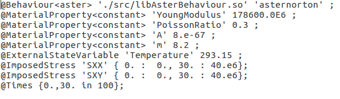{width="5.245203412073491in"
height="1.541616360454943in"}

- `@Behaviour`: declara el comportamiento utilizado para la prueba. Se
  indica la interfaz utilizada por el comportamiento.
- `@MaterialProperty`: define una propiedad de material. En este caso
  *<constant>*, y a continuación se le define su valor.
- `@ExternalStateVariable`: permite al usuario especificar la
  evolución de las variables de estado externas, en este caso la
  temperatura.
- `@ImposedStress`: permite al usuario imponer la evolución de un
  componente de las tensiones.
- `@Times`: permite al usuario especificar una lista de tiempos
  utilizados para los cálculos.

Con el archivo `Norton.mtest` ya preparado, se puede ejecutar la
simulación a través del `Terminal` con la siguiente línea de comandos:

~~~~{.bash}
$ mtest Norton.mtest
~~~~

Esto generará un archivo `Norton.res` con el resultado numérico de la
simulación el cual se puede representar gráficamente con, por ejemplo,
`gnuplot`, dando un resultado como el de la Ilustración 3:

{width="5.709722222222222in"
height="4.265633202099737in"}

Archivos .mfront
================

Tal y como se ha visto, la creación de los archivos de entrada en
formato `.mfront` consisten en la edición de un archivo de texto sin
formato en el que se debe definir cada parte del código con una serie de
instrucciones señalizadas con `@`.

A lo largo de este apartado se describirán las instrucciones y
parámetros de este archivo según su función. Todas las instrucciones
disponibles se pueden ver en el Anexo 4: .

Estructura del archivo .mfront
------------------------------

Un archivo de entrada `.mfront` representa un único conocimiento de
material, es decir, una propiedad material, una ley de comportamiento, o
un modelo.

Este archivo de entrada se presenta como una lista de palabras clave, o
instrucciones, empezando con el símbolo `@`. Algunas partes del archivo
están directamente escritas en C++, pues `MFront` se basa en este
lenguaje, aunque intenta reducir al mínimo su uso para hacerlo más
accesible a las personas con menos capacidad de desarrollo informático.

**Orden de las instrucciones:** No se impone un orden en las
instrucciones, aunque se debe destacar que MFront analiza el archivo
secuencialmente, por lo que no permitirá el uso de una variable antes de
ser declarada. Por ejemplo, será imposible especificar el rango de
validez de la temperatura de una propiedad del material antes de
declarar que dicha propiedad depende de la temperatura.

**Comentarios:** MFront acepta los dos tipos de comentarios de C++, es
decir, los que empiezan por **/\*** y terminan por **\*/** pudiendo
estos ocupar varias líneas, y los que empiezan por **//** extendiéndose
estos tan solo hasta el final de la línea actual.

Uso de las instrucciones
------------------------

El conocimiento de materiales soportado por MFront está clasificado en
tres categorías:

-   Las propiedades de los materiales.

-   Los modelos.

-   Las leyes de comportamiento mecánico.

Para tratar estos conocimientos, hay disponibles diferentes
analizadores:

- `DefaultParser`, `DefaultCZMParser`, `DefaultFiniteStrainParser`:
  Estos analizadores son los más genéricos ya que no hacen ninguna
  restricción sobre el comportamiento o el método de integración que
  se puede utilizar.
- `Implicit`: Este analizador proporciona un integrador genérico
  basado en un esquema implícito. La deformación elástica no se define
  automáticamente com una variable de estado.
- `ImplicitII`: Este analizador proporciona un integrador genérico
  basado en un método `theta`. A diferencia de `Implicit`, la
  deformación elástica no se define automáticamente como una variable
  de estado.
- `ImplicitFiniteStrain`: Este analizador proporciona un integrador
  genérico basado en un método `theta`.
- `IsotropicMisesCreep`: Este analizador se usa para los
  comportamientos de flujo estándar de la forma $\dot{p} = f(s)$ donde
  `p` es la deformación equivalente y `s` la tensión equivalente.
- `IsotropicPlasticMisesFlow`: Este analizador se usa para los
  comportamientos de plásticos estándar con superficie de rendimiento
  de la forma $f\left( s,p \right) = 0$.
- `IsotropicStrainHardeningMisesCreep`: Este analizador se usa para
  los comportamientos de flujo de endurecimiento por deformación
  estándar de la forma $\dot{p} = f(s,p)$.
- `MultipleIsotropicMisesFlows`: Este analizador se usa para definir
  comportamientos combinando varios flujos isotrópicos. Los tipos de
  flujos soportados son '`Creep`'*(*$\dot{p} = f(s)$*)*,
  '*StrainHardeningCreep' (*$\dot{p} = f(s,p)$*)* y *'Plasticity'
  (*$f\left( s,p \right) = 0$*).*
- `RungeKutta`: Este analizador proporciona un integrador genérico
  basado en uno de los muchos algoritmos Runge-Kutta.
- `MaterialLaw`: Este analizador se usa para definir las propiedades
  del material.
- `Model`: Este analizador se usa para definir modelos de materiales
  simples.

La instrucción `@Parser` define el analizador con el que se trabajará,
el cual tiene su propio conjunto de instrucciones admitidas, es decir,
cada analizador admite ciertas instrucciones.

~~~~{.cpp}
@Parser MaterialLaw;
~~~~

Todas las instrucciones disponibles en MFront están clasificadas según
los analizadores que las pueden usar en el “Anexo 1 – Instrucciones
Disponibles”.

A continuación, se describen algunas de las instrucciones más comunes.

### Instrucciones informativas

En este punto se describirán cuatro instrucciones opcionales cuyo
objetivo es tan solo informativo.

`@Author` se usa para dar el nombre de quien ha escrito el archivo
mfront.

~~~~{.cpp}
@Author Jordi Alberich;
~~~~

`@Description` describe la propiedad del material, el comportamiento o
el modelo que se implementa en el archivo.

~~~~{.cpp}
@Description{

Aquí se suelen describir las referencias del artículo o informe técnico
del que se extrae la propiedad del material, el comportamiento o el
modelo.

El nombre de los autores.

Las modificaciones hechas.

}
~~~~

`@Date` permite al usuario especificar cuándo se escribió el archivo
mfront.

~~~~{.cpp}
@Date 2016-11-23;
~~~~

`@Material` permite al usuario especificar qué material es tratado por
el archivo actual.

~~~~{.cpp}
@Material UO2;
~~~~

### Importación de una definición e inclusión de otros archivos mfront

Para minimizar errores, con la instrucción `@MaterialLaw` MFront permite
importar la definición de una ley material definida en un archivo mfront
y compila, como parte de la biblioteca actual, una función utilizando la
interfaz mfront.

Los archivos a importar se buscarán en este orden:

- A partir del directorio actual.
- A partir de los directorios especificados en la línea de comandos
  con `--search-path` o `--include`.
- A partir de los directorios especificados a través de la variable de
  entorno `MFRONT_INCLUDE_PATH`.

Como ejemplo, si se ha definido en un archivo:

~~~~{.cpp}
@Parser MaterialLaw;
@Law ThermalExCoef;
@Material AE1307Inventado;
@Author Jordi Alberich;

//… … …
~~~~

Este se podrá usar en otro con la instrucción `@MaterialLaw`:

~~~~{.cpp}
@MaterialLaw "AE1307Inventado_ThermalExCoef.mfront";

@InitiLocalVariables {
  a = AE1307Inventado_ThermalExCoef(T+theta\*dT);
}
~~~~

Por otra parte, la instrucción `@Import` permite la inclusión de uno o
varios archivos mfront externos.

Esta instrucción interrumpe el tratamiento del archivo actual e inicia
el tratamiento secuencial de cada archivo a importar.

El orden de las rutas de búsqueda del archivo a importar será el mismo
que en el caso de `@MaterialLaw`.

~~~~{.cpp}
@Import "SlidingSystemsCC.mfront";
~~~~

### Instrucciones de compilación de librerías

Hay tres instrucciones relacionadas con la compilación de fuentes. Las
instrucciones `@Include` y `@Link` tienen una importancia particular
debido a que permiten utilizar características definidas en librerías
`C++` externas.

`@Library` permite al usuario especificar el nombre de la librería
generada.

~~~~{.cpp}
@Library LibreriaJordi;
~~~~

`@Includes` presenta un bloque donde el usuario puede definir algunas
instrucciones del preprocesador C++, normalmente instrucciones del tipo
*\#include*.

~~~~{.cpp}
@Includes{
#include<fstream>
#include<TFEL/Material/Lame.hxx>
}
~~~~

`@Link` se usa para vincular librerías generadas con librerías
externas.

~~~~{.cpp}
//link explicito con libm.so
@Link "-lm";
~~~~

### Gestión de límites

Hay variables de estado que pueden tener límites inherentes, como por
ejemplo, una temperatura no puede ser negativa, o una porosidad superior
a 1.

Para gestionar estos límites, se ofrecen estas instrucciones:

`@Bounds` que permite al usuario definir el dominio de validez.

Si la variable se encuentra fuera de sus límites, la mayoría de las
interfaces permiten al usuario elegir una de las siguientes políticas:

- `None`, que significa que no hace nada.
- `Warning`, que muestra un mensaje, pero los cálculos no se detienen.
- `Strict`, que se detienen los cálculos con un mensaje de error.

~~~~{.cpp}
// El intervalo puede contener el infinito, representado por el carácter '\*'.
@Bounds T in \[293.15:873.15\];
~~~~

`@PhysicalBounds` permite al usuario definir el dominio físico de una
variable. En los esquemas implícitos, si se establecen límites físicos
en una variable, esta variable se limita a satisfacerlos durante las
iteraciones internas.

Si se encuentra que una variable está fuera de sus límites físicos, los
cálculos se detienen. Las pruebas se realizan en diferentes etapas de
integración dependiendo de la naturaleza de la variable.

~~~~{.cpp}
// La temperatura (en Kelvin) no puede ser negativa.
@PhysicalBounds T in \[0:\*\[;
~~~~

### Definición de parámetros

Para la definición de parámetros para las propiedades y leyes de
comportamiento, se han definido las siguientes instrucciones:

`@Parameter` declara un nuevo parámetro o una lista de nuevos
parámetros. Opcionalmente, el valor predeterminado de los parámetros
declarados también se puede dar siguiendo varias sintaxis de asignación
estándar de C++.

El valor predeterminado de un parámetro también se puede asignar después
de su declaración utilizando la orden setDefaultValue.

~~~~{.cpp}
@Parameter R0 = 500;
@Parameter Q1{10000},b1{0.00001};
@Parameter Q2(0),b2(0);
@Parameter fc;
fc.setDefaultValue(1.e-2);
~~~~

Para el analizador `Model` unas instrucciones específicas,
`@GlobalParameter` para definir los parámetros del modelo que se
podrán usar en otros modelos, y `@LocalParameter` para definir
parámetros especializados del modelo actual.

~~~~{.cpp}
@GlobalParameter real a;
a.setDefaultValue(1.23);
@LocalParameter real b;
b.setDefaultValue(1.23);
~~~~

### La instrucción `@Function`

La instrucción `@Function` se usa en el analizador `MaterialLaw` y
permite definir en código C++ la propiedad del material.

La salida predeterminada se denomina `res`, aunque se puede cambiar con
la instrucción `@Output`.

Aunque la mayoría de interfaces usan el `double` para las operaciones
con punto flotante, esto puede no ser siempre necesario. Se ha
introducido un `typedef` especial llamado `real` recomendado para
definir las variables locales.

~~~~{.cpp}
@Function{
  const real C0 = 575.57;
  const real C1 = -21094.;
  Cp = C0+C1/T;
}
~~~~

Propiedades del material
------------------------

Las propiedades del material son uno de los elementos esenciales para el
conocimiento del material. Una propiedad del material es una función de
un conjunto de variables de estado termodinámico del material.

A continuación, se describirán los diferentes tipos de variables al
escribir las propiedades del material a usar con el analizador
`MaterialLaw`.

### Variables de entrada

Las variables de entrada de las propiedades del material se definen con
la instrucción `@Input`.

Se recomienda asociar a una variable de entrada un glosario o nombre de
entrada con la orden setGlossaryName.

~~~~{.cpp}
@Input T,p;
T.setGlossaryName("Temperature");
p.setGlossaryName("Porosity");
~~~~

### Variables de salida

Tal como ya se ha descrito en el punto “La instrucción `@Function`,
la instrucción `@Output` permite cambiar el nombre de la variable de
salida que por defecto es `res`.

~~~~{.cpp}
@Output b;
~~~~

### Variables estáticas

La instrucción `@StaticVariable` permite al usuario definir un valor
constante. A diferencia de los parámetros definidos con `@Parameter`,
los valores de las variables estáticas no se pueden cambiar después
de la compilación.

Al definir este tipo de variable, se deberá indicar el tipo de constante
y su valor.

~~~~{.cpp}
@StaticVariable real A = 1.234e56;
~~~~

### Parámetros

La instrucción `@Parameter` ya se ha descrito en el punto “Definición
de parámetros”.

### Constantes

La instrucción `@Constant` permite al usuario definir un valor
constante. Esta instrucción es sinónima de la instrucción
`@StaticVariable` para una variable real.

~~~~{.cpp}
@Constant A 1.234e56;
~~~~

Modelos puntuales simples
-------------------------

Generalmente, se pueden distinguir dos tipos de modelos:

- Los modelos que requieren de una solución global sobre el conjunto
  del dominio considerado. Estos modelos generalmente tratan la
  distribución (térmica o química) y el equilibrio mecánico.
- Los modelos “point” que describen la evolución local del material
  de acuerdo con su estado termodinámico local. Este tipo de modelo
  incluye los modelos de producción de gas de fisión, concentración
  isotópica, la corrosión, etc.

MFront no procesa los modelos que requieren de una solución global, tan
solo puede tratar los modelos tipo “point”.

Para tratar estos modelos, MFront ofrece el analizador *Model.*

### Instrucción `@Model`

Este analizador no ofrece muchas instrucciones, y la mayoría de ellas ya
se han descrito en los puntos anteriores. Una de las únicas
instrucciones que se puede encontrar de más es la instrucción `@Model`
que tan solo permite al usuario definir el nombre del modelo.

~~~~{.cpp}
@Model SolidSwelling;
~~~~

Comportamientos mecánicos
-------------------------

Para el debido conocimiento del material, otro factor a tener en cuenta,
sino quizás el más importante, es su comportamiento mecánico.

Los analizadores disponibles para definir los comportamientos mecánicos
son:

- `DefaultParser`
- `DefaultCZMParser`
- `DefaultFiniteStrainParser`
- `IsotropicMisesCreep`
- `IsotropicPlasticMisesFlow`
- `IsotropicStrainHardeningMisesCreep`
- `MultipleIsotropicMisesFlows`
- `RungeKutta`
- `Implicit`
- `ImplicitII`
- `ImplicitFiniteStrain`

Como se puede prever, el estudio de los comportamientos mecánicos podría
llegar a ser muy extenso, y teniendo en cuenta que lo que se busca
aprender en este trabajo es el uso de MFront, tan solo se describirán
algunas de las instrucciones y funciones (no vistas en los puntos
anteriores) sin entrar en demasiado detalle como qué métodos o
analizadores usar y porqué.

### Instrucciones particulares

`@Algorithm` se usa para seleccionar el algoritmo numérico. Esta
instrucción está disponible en los analizadores Implícitos y
Runge-Kutta.

Los algoritmos disponibles para los analizadores Implícitos son:

- `NewtonRaphson`
- `NewtonRaphson_NumericalJacobian`
- `PowellDogLeg_NewtonRaphson`
- `PowellDogLeg_NewtonRaphson_NumericalJacobian`
- `Broyden`
- `Broyden2`
- `PowellDogLeg_Broyden`
- `LevenbergMarquardt`
- `LevenbergMarquardt_NumericalJacobian`

Y los algoritmos disponibles para el analizador `Runge-Kutta`
son: `Euler`, `rk2`, `rk4`, `rk42`, `rk54` y `rkCastem`.

~~~~{.cpp}
//Ejemplo en dsl Implicito
@Algorithm NewtonRaphson;
~~~~

~~~~{.cpp}
//Ejemplo en dsl Runge-Kutta
@Algorithm rk54;
~~~~

`@ModellingHypotheses` permite especificar las hipótesis de modelado.
Las hipótesis válidas serán las siguientes:

- `AxisymmetricalGeneralisedPlaneStrain`
- `Axisymmetrical`
- `PlaneStress`
- `PlaneStrain`
- `GeneralisedPlaneStrain`
- `Tridimensional`

`@OrthotropicBehaviour` declara que el material es ortótropo, es
decir, que tiene dos o tres ejes ortogonales entre sí, de doble
simetría rotacional, de forma que sus propiedades mecánicas son, en
general, diferentes en las direcciones de cada uno de esos ejes.

~~~~{.cpp}
@OrthotropicBehaviour;
~~~~

`@IsotropicElasticBehaviour` declara que el comportamiento elástico es
isotrópico incluso si el material ha sido declarado ortótropo. Esta
declaración afecta al comportamiento `@RequireStiffnessTensor`.

~~~~{.cpp}
@IsotropicElasticBehaviour;
~~~~

`@RequireStiffnessTensor` requiere que el código calcule la rigidez
del tensor. Esto generalmente significa que se introducirán algunas
propiedades de material extra y serán usadas por la interfaz antes de la
integración del comportamiento.

~~~~{.cpp}
@RequireStiffnessTensor true;
~~~~

`@RequireThermalExpansionCoefficientTensor` requiere que el código
calcule el tensor del coeficiente de expansión térmica.

~~~~{.cpp}
@RequireThermalExpansionCoefficientTensor true;
~~~~

`@MaterialProperty` permite al usuario una varias propiedades del
material. Se le debe especificar el tipo de propiedad del material y una
lista de los nombres de las propiedades. Se recomienda asociar a una
propiedad del material un glosario o nombre con las ordenes
setGlossaryName o setEntryName.

~~~~{.cpp}
@MaterialProperty stress young;
young.setGlossaryName("YoungModulus");
~~~~

`@Sources` permite al usuario definir un bloque de código que se
integrará a las fuentes generadas de un comportamiento. Esto permite al
usuario implementar sus propias clases o funciones. Estas declaraciones
de tales clases o funciones pueden realizarse en un bloque de código
introducido por la instrucción `@Includes`.

~~~~{.cpp}
@Includes{
void f(void); //declaración de la función f
}
~~~~

~~~~{.cpp}
@Sources{
void f(void){
  std::cout << "Ejemplo de una función" << std::endl;
}
}
~~~~

`@TangentOperator` introduce un bloque de código utilizado para
definir el operador tangente. Este código se llama una vez que se han
actualizado las variables de integración, las tensiones y las variables
de estado auxiliares.

El tipo de operador tangente solicitado está dado por la variable smt
(Stiffness matrix type), cuyos posibles valores serán `ELASTIC`,
`SECANT`, `TANGENTOPERATOR` y `CONSISTENTTANGENTOPERATOR`.

~~~~{.cpp}
@TangentOperator{
  if((smt==ELASTIC)||(smt==SECANTOPERATOR)){
    Dt = 0;
  } else if (smt==CONSISTENTTANGENTOPERATOR){
    Dt = De * Je;
  } else {
    return false;
  }
}
~~~~

`@UpdateAuxiliaryStateVariables` introduce un bloque de código
destinado a actualizar las variables de estado auxiliares después de la
integración.

En los lenguajes específicos de dominio implícito, el código declarado
por `@UpdateAuxiliaryStateVariables` se llama una vez que se han
actualizado las variables de integración (incluidas las variables de
estado) y las tensiones. Las variables de estado externas no se
actualizan.

En los lenguajes específicos de Runge-Kutta, el código declarado por
`@UpdateAuxiliaryStateVariables` se llama después de cada paso de tiempo
exitoso. Hay que tener en cuenta que la mayoría de algoritmos de
Runge-Kutta realiza subescalas internas, en este caso, el código
declarado por `@UpdateAuxiliaryStateVariables` puede ser llamado varias
veces durante la integración del comportamiento. Una variable adicional
llamada dt_, que es menor que el incremento de paso de tiempo total
`dt` si se realizan subpasos, da el incremento de tiempo actual.

~~~~{.cpp}
//Ejemplo dsl Implícito
@UpdateAuxiliaryStateVariables{
  const real q_ = q–(1 – theta)*dq;
  const real Q = Q0+(Qm–Q0)*(1–exp (-2*Mu*q_));
  R+=b*(Q-R)*dp;
}
~~~~

~~~~{.cpp}
//Ejemplo dsl Runge-Kutta
@UpdateAuxiliaryStateVariables{
 sigeq = sqrt(sig|sig};
}
~~~~

`@MaximumNumberOfIterations` le permite al usuario definir el número
máximo de iteraciones.

~~~~{.cpp}
@MaximumNumberOfIteration 200;
~~~~

`@Theta` se usa para definir el valor predeterminado del parámetro
$\theta$ usado por los esquemas implícitos. Si no se usa esta
instrucción, los lenguajes de dominio implícito le asignan su propio
valor predeterminado (0.5 o 1).

El valor de $\theta$ debe estar entre el rango ( \]0:1\] ).

El valor de $\theta$ se puede cambiar durante la ejecución modificando
el parámetro `theta`.

~~~~{.cpp}
@Theta 0.5;
~~~~

`@Epsilon` permite al usuario definir el valor del criterio de
convergencia.

Este valor se puede cambiar durante la ejecución modificando el
parámetro `epsilon`.

~~~~{.cpp}
@Epsilon 1.e-12;
~~~~

`@ComputeStress` introduce un bloque de código destinado a calcular el
tensor simétrico de tensión. Esta instrucción interpreta el código para
generar dos métodos:

-   El primero se utiliza antes del paso de integración, utilizando
    valores actualizados para las variables de estado y las variables de
    estado externas.
-   El segundo es un candidato para el cálculo del estrés al final de
    la integración. Este candidato se utiliza si el usuario no
    proporciona una forma adecuada de calcular el estrés al final del
    paso de tiempo utilizando la instrucción `@ComputeFinalStress`.

Si el usuario proporciona una forma de calcular el estrés al final del
paso con la instrucción `@ComputeFinalStress`, se considerará que el uso
de `@ComputeStress` no tiene sentido y aconseja al usuario calcular de
forma explícita el esfuerzo como parte del paso de integración.

~~~~{.cpp}
@ComputeStress{
sig = (1-d)*(lambda*trace(eel)*Stensor::Id()+2*mu*eel);
}
~~~~

Linea de comandos
=================

En este apartado se describirá como usar MFront en línea de comandos una
vez ya elaborado el archivo `.mfront`.

La forma genérica de uso de MFront es la siguiente:

~~~~{.bash}
$ mfront [opciones] [archivos]
~~~~

Opciones disponibles
--------------------

Las opciones disponibles para usar en línea de comandos con MFront son
las siguientes:

- `--analyser`: permite al usuario especificar el analizador a utilizar.
- `--build`: genera el `MakeFile` y construye las librerías.
- `--clean`: genera el `MakeFile` y limpia las librerías.
- `--debug`: establece el modo de depuración (elimina las
  referencias al archivo inicial)
- `--help`: muestra las opciones disponibles. También se puede usar `–h`.
- `--help-command` y `–help-keyword` muestran la ayuda asociada a la
  instrucción dada según el analizador indicado como se puede ver en la Ilustración 4.

{width="5.895138888888889in" height="2.3375in"}

- `--help-commands-list` y `–help-keywords-list` muestran una lista de
  las instrucciones disponibles según el analizador dado tal como se
  muestra en la Ilustración 5

{width="5.495203412073491in"
height="3.6963517060367455in"}

- `--include`: y **--search-path** añaden una nueva ruta al principio
  de las rutas de búsqueda. También se puede usar como **–I**.
- `--interface`: especifica la interfaz a usar.
- `--list-parsers`: muestra una lista de los analizadores disponibles
  añadiendo también una pequeña descripción de ellos como la descrita en
  el punto “Uso de las instrucciones”.
- `--make`: genera el archivo `Makefile.mfront`.
- `-nodeps` evita la inclusión de reglas de dependencia en el archivo
  generado `Makefile.mfront`. Esta opción fue introducida para evitar
  algunos problemas en `Windows`.
- `--nomelt`: evita fusionar directorios de librerías.
- `--obuild`, `--omake` genera el archivo `Makefile` con compilaciones
  optimizadas y crea las librerías. También se puede usar como `–b` o
  `–m`.
- `--otarget`: permite compilar solo las librerías de manera optimizada.
- `--silent-build`: activa o desactiva esta opción para desplegar las
  líneas de compilación utilizadas.
- `--target`: permite compilar solo las librerías. También se puede usar
  como `–t`.
- `--verbose`: establece el nivel de verbosidad pudiendo ser:
    - `quiet` establece el nivel mínimo.
    - `level1`, `level2` y `level3` establece los niveles crecientes.
    - `debug` y full son generalmente para desarrollo.
- `--version`: muestra la versión instalada. También se puede usar
  como `–v`.
- `--warning`: imprime los avisos. También se puede usar como `–W`.
- `--win32`: permite la compilación de las librerías dinámicas para un
  sistema `Windows`.

MTest
=====

`MTest` es una herramienta de simulación del comportamiento mecánico
de un punto material.

Con esta herramienta, el usuario puede simular varios ensayos mecánicos
simples, por ejemplo:

-   La mayoría de ensayos “multi-céntricos”.
-   Pruebas de tensión/compresión.
-   Ensayos de corte.
-   Ensayos de flujo.
-   Ensayos de relajación.
-   Prueba “SATOH”.
-   Ensayos de presión interna en un tubo.

Los resultados obtenidos se pueden comparar con las soluciones
analíticas o soluciones de referencia. En la salida, se crean dos
archivos:

-   Un archivo de texto que contiene la evolución de todas las
    variables internas.
-   Un archivo XML que contiene el resultado de las
    diversas comparaciones.

Opciones de MTest
-----------------

La forma genérica de uso de `MTest` es la siguiente:

~~~~{.bash}
$ mtest [opciones] [archivos]
~~~~

Siendo las siguientes opciones disponibles:

- `--backtrace`: pila del proceso de impresión al obtener las señales
  `SIGSEGV` (error de segmentación) o `SIGFPE` (excepción
  matemática). También se puede usar `–bt`.
- `--floating-point-exceptions`: controla las excepciones de punto
  flotante a través de las señales SIGFPE. También se puede usar como
  `–fpe`.
- `--help`: muestra las opciones disponibles. También se puede usar
  como `–h`.
- `--help-command` y `--help-keyword`: muestran la ayuda asociada a la
  instrucción dada.
- `--help-commands-list` y `--help-keywords-list`: muestran una lista
  de las instrucciones disponibles tal y como se puede ver en la
  Ilustración 6.
- `--residual-file-output`: control de salida residual ('No' por
  defecto).
- `--result-file-output`: control de la salida del resultado ('Si' por
  defecto).
- `--verbose`: establece el nivel de verbosidad pudiendo ser:
    - `quiet` establece el nivel mínimo.
    - `level1`, `level2` y `level3` establece los niveles crecientes.
    - `debug` y full son generalmente para desarrollo.
- `--version`: muestra la versión instalada. También se puede usar como
  `–v`.
- `--xml-output`: salida xml de control ('No' por defecto).

{width="4.975250437445319in" height="9.10625in"}

Estructura del archivo `.mtest`
-------------------------------

Los archivos `.mtest` toman la misma estructura que los archivos
`.mfront`. Se presentan como una lista de instrucciones que empiezan por
el símbolo `@`. Algunas de estas instrucciones pueden tener opciones
asociadas dadas entre los símbolos `<` y `>`.

**Comentarios:** `MTest` también acepta los dos tipos de comentarios de
C++, es decir, los que empiezan por `/*` y terminan por `*/`
pudiendo estos ocupar varias líneas, y los que empiezan por `//`
extendiéndose estos tan solo hasta el final de la línea actual.

**Lectura de un número real:** En varios lugares del archivo de entrada
se requiere un número real. Si se proporciona una cadena, el contenido
de esta cadena se interpreta como una fórmula matemática y es posible
utilizar variables definidas anteriormente, siempre que sean constantes
en el tiempo.

**Descripción de una evolución temporal:** La evolución en el tiempo de
determinadas variables son datos esenciales para ser proporcionados por
el usuario. Estos acontecimientos pueden ser reportados de dos maneras:

- Por una descripción discreta. Una constante evolución viene dada por
  un único valor real. Desarrollos complejos pueden ser devueltos como
  matrices asociativas que asocian el valor de tiempo de la evolución.
  Entre estos tiempos, la evolución es lineal. Más allá del tiempo
  extremo, el cambio es constante.
- Por una función explícita de tiempo, dado como una cadena
  de caracteres. Es posible reutilizar las evoluciones declaradas
  anteriormente o utilizar el tiempo, que corresponde a la variable
  `t`, de forma explícita.

Instrucciones
-------------

A continuación, se detallarán algunas de las instrucciones más
significativas de `MTest`.

`@Author`: se utiliza para dar el nombre de la persona que escribió el
archivo `.mtest`.

~~~~{.cpp}
@Author Jordi Alberich;
~~~~

`@Behaviour`: declara el comportamiento utilizado para la
prueba. Esta instrucción debe ir seguida de una opción que especifique
la interfaz utilizada por el comportamiento. Están disponibles las
interfaces castem*,* cyrano y aster.

Se esperan dos cadenas, la biblioteca en la que se implementa el
comporamiento, y el nombre de la función.

~~~~{.cpp}
@Behaviour<castem> 'libMFrontCastemBehaviours.so' 'umatnorton';
~~~~

`@CastemAccelerationPeriod` especifica el número de iteraciones entre
dos llamadas al algoritmo de aceleración.

~~~~{.cpp}
@CastemAccelerationPeriod 3;
~~~~

`@Date` permite al usuario especificar cuándo se escribió el archivo
*.mtest*.

~~~~{.cpp}
@Date 2016-11-28;
~~~~

`@Description` permite dar una descripción del test implementado en el
archivo.

~~~~{.cpp}
@Description{
"Descripción del test a realizar"
}
~~~~

`@Evolution` especifica una función del tiempo.

Esta instrucción puede tener una opción, que es la forma en que se
definirá la evolución. Se aceptan dos valores: evolution y function. Si
no se especifica ninguna opción, se elige la opción de evolution.

A continuación se define, en forma de cadena, el nombre de la evolución.

Si se ha seleccionado la opción de evolution, el usuario puede
especificar una evolución constante simplemente dando su valor. De lo
contrario, las evoluciones complejas se pueden construir utilizando una
matriz asociativa donde la clave es el tiempo y el valor de la
evolución. Entre dos tiempos, los valores serán interpolados
linealmente. Antes del primer tiempo declarado dado, se utiliza el valor
correspondiente a esta primera vez. Después de la última vez dada, se
utiliza el valor correspondiente a esta última vez.

Si se ha seleccionado la opción de function, se espera una cadena que se
interpretará como una función del tiempo. El tiempo está representado
por la variable `t`.

~~~~{.cpp}
//Evolución constante
@Evolution 'Pressure' 1.e5;
//Evolución lineal
@Evolution 'Pressure' {0:0.,1.:1.e5};
//Función
@Real P0 2.e5
@Real P1 4.e5
@Evolution<function> 'Pressure' 'P0+(P1-P0)\*t\*\*2';
~~~~

`@ExternalStateVariable` permite al usuario especificar la evolución
de las variables de estado externas, incluida la temperatura que
generalmente se define por defecto en las interfaces de comportamiento.

Esta instrucción puede tener una opción asociada, que es la forma en que
se definirá la evolución. Al igual que en la instrucción `@Evolution`,
se aceptan dos valores, evolution y function.

~~~~{.cpp}
//Evolución constante
@ExternalStateVariable 'Temperature' 293.15;
//Evolución lineal
@ExternalStateVariable 'Temperature' {0:293.15,1.:800};
//Función
@Real T0 293.15
@Real T1 400.15
@ExternalStateVariable<function>'Temperature''T0+(T1-T0)\*t\*\*2';
~~~~

`@ImposedStrain` permite al usuario imponer la evolución de un
componente de las tensiones.

Esta instrucción puede tener asociada una opción que corresponde a la
forma en que se definirá la evolución, pudiendo ser evolution o function
(evolution por defecto). A continuación, se especificará el nombre del
componente de las tensiones.

Son válidos los siguientes nombres de componentes según la hipótesis de
modelado:

- `AxisymmetricalGeneralisedPlaneStrain`: ERR EZZ ETT.
- `Axisymmetrical`: ERR EZZ ETT ERZ.
- `PlaneStress`: EXX EYY EZZ EXY.
- `PlaneStrain`: EXX EYY EXY.
- `GeneralisedPlaneStrain`: EXX EYY EZZ EXY.
- `Tridimensional`: EXX EYY EZZ EXY EXZ EYZ.

~~~~{.cpp}
//Evolución constante
@ImposedStrain<evolution> 'EXX' 1e-3;
//Evolución lineal
@ImposedStrain<evolution> 'EXX' {0.:0.,1:1e-3};
//Función
@ImposedStrain<function> 'EXX' 'e0\*sin(t/900.)';
~~~~

`@ImposedStress` permite al usuario imponer la evolución de un
componente de estrés.

El funcionamiento de esta instrucción es igual al de la anterior
(`@ImposedStrain`), siendo válidos los siguientes nombres según la
hipótesis de modelado:

- `AxisymmetricalGeneralisedPlaneStrain`: SRR SZZ STT.
- `Axisymmetrical`: SRR SZZ STT SRZ.
- `PlaneStress`: SXX SYY SXY.
- `PlaneStrain`: SXX SYY SZZ SXY.
- `GeneralisedPlaneStrain`: SXX SYY SZZ SXY.
- `Tridimensional`: SXX SYY SZZ SXY SXZ SYZ.

~~~~{.cpp}
//Evolución constante
@ImposedStress 'SXX' 50.e6;
//Evolución lineal
@ImposedStress<evolution> 'SXX' {0.:0.,1:50e6};
//Función
@ImposedStress<function> 'SXX' 's0\*sin(t/900.)';
~~~~

`@InternalStateVariable` define el valor inicial de una variable de
estado.

Si esta variable de estado interna es escalar, se espera un valor real.
En cambio, si esta variable de estado interna es un tensor simétrico, se
espera una matriz de valores reales del tamaño apropiado. Un tensor
simétrico tiene 3 componentes en 1D, 4 componentes en 2D y 6 componentes
en 3D. Los componentes fuera de las diagonales se declararán con un
factor $\sqrt{2}$.

~~~~{.cpp}
@InternalStateVariable 'ElasticStrain' {'EELRR0' , 'EELZZ0' , 'EELZZ0',0.};
~~~~

`@MaterialProperty` define una propiedad de material. Sólo pueden
  usarse las propiedades mecánicas definidas por el comportamiento
  para la hipótesis de modelado considerada con la excepción de las
  expansiones térmicas:

- La expansión térmica isotrópica se define a través de la
  propiedad `ThermalExpansion`.
- La expansión térmica ortotrópica se define a través de las
  propiedades del material `ThermalExpansion1`, `ThermalExpansion2`
  y `ThermalExpansion3`.

A esta instrucción se le asocia como opción el tipo de propiedad
material, pudiendo ser:

- `constant`: se deberá indicar su valor.
- `castem`: se deberá indicar el nombre de la biblioteca y el nombre
  de la función que implementa la propiedad material.
- `function`: se deberá definir la función.

~~~~{.cpp}
//constant
@MaterialProperty<constant> 'YoungModulus' 150.e9;
//castem
@MaterialProperty<castem> 'YoungModulus' 'libIncone1600MaterialProperties.so' 'Incone1600_YoungModulus';
~~~~

`@Parameter` especifica el valor de un parámetro real del comportamiento.

~~~~{.cpp}
@Parameter 'epsilon' 1.e-8;
~~~~

`@IntegerParameter` especifica el valor de un parámetro entero del
comportamiento.

~~~~{.cpp}
@IntegerParameter 'iter' 12;
~~~~

`@UnsignedIntegerParameter` especifica el valor de un parámetro entero
positivo del comportamiento.

~~~~{.cpp}
@UnsignedIntegerParameter 'iterMax' 12;
~~~~

`@MaximumNumberOfIterations` permite al usuario especificar el número
máximo de iteraciones del algoritmo global para alcanzar el equilibrio.

Si el número de iteraciones alcanza el valor máximo autorizado, el paso
de tiempo se divide por dos. El número máximo de sub-pasos se puede
especificar usando la instrucción `@MaximumNumberOfSubSteps`.

~~~~{.cpp}
@MaximumNumberOfIterations 10;
~~~~

`@MaximumNumberOfSubSteps` permite al usuario especificar el número
máximo de sub-pasos permitidos.

Cuando el algoritmo global no alcanza el equilibrio, el paso de tiempo
puede dividirse por dos. El número máximo de veces que el paso de tiempo
se reduce se da por el número máximo de sub-pasos.

~~~~{.cpp}
@MaximumNumberOsSubSteps 10;
~~~~

`@ModellingHypotesis` permite al usuario elegir la hipótesis de
modelado a utilizar. Se admiten los siguientes valores dados como una
cadena:

- `AxisymmetricalGeneralisedPlaneStrain` (1D).
- `Axisymmetrical` (2D).
- `PlaneStress` (2D).
- `PlaneStrain` (2D).
- `GeneralisedPlaneStrain` (2D).
- `Tridimensional` (3D).

La hipótesis de modelado cambia el nombre de los componentes de los
tensores simétricos y sus números como se ha visto en `@ImposedStrain` y
`@ImposedStress`.

`@OutputFile` especifica el nombre del archivo de salida. De forma
predeterminada, el nombre del archivo de salida es igual al nombre de
entrada con la extensión *'.res'*.

~~~~{.cpp}
@OutputFile 'results.txt';
~~~~

`@OutputFilePrecision` especifica el número de dígitos utilizados para
imprimir los resultados en el archivo de salida.

~~~~{.cpp}
@OutputFilePrecision 15;
~~~~

`@PredictionPolicy` le permite al usuario definir cómo se obtendrá la
estimación inicial de la solución, pudiendo ser:

- `Noprediction`
- `LinearPrediction`
- `ElasticPrediction`
- `ElasticPredictionFromMaterialProperties`
- `SecantPrediction`
- `TangentPrediction`

~~~~{.cpp}
@PredictionPolicy 'ElasticPrediction';
~~~~

`@Real` permite al usuario definir una constante.

~~~~{.cpp}
@Real 'SXX0' 20.6;
~~~~

`@RotationMatrix` permite al usuario especificar una matriz de
rotación, de manera que las direcciones principales del material sean
diferentes de las utilizadas para la resolución y las condiciones de
contorno.

~~~~{.cpp}
@RotationMatrix {{0,1,0},
                 {1,0,0},
                 {0,0,1}};
~~~~

`@StiffnessMatrixType` permite al usuario especificar el tipo de
matriz de rigidez que debe ser dada por el comportamiento mecánico y que
será utilizado por el algoritmo de resolución. Son válidos los
siguientes valores:

- `Elastic`
- `SecantOperator`
- `TangentOperator`
- `ConsistentTangentOperator`

~~~~{.cpp}
@StiffnessMatrixType 'Elastic';
~~~~

`@Strain` permite al usuario especificar el valor inicial de las
tensiones.

Se debe especificar una matriz, donde el tamaño de este array debe ser
igual al número de componentes de los tensores simétricos para la
hipótesis de modelado considerada.

Los valores deben seguir las convenciones TFEL. En 3D, las tensiones
están almacenadas en el siguiente orden:

$$\left( \text{varepsilon}_{\text{xx}},\varepsilon_{\text{yy}},\varepsilon_{\text{zz}},{\sqrt{2}\varepsilon}_{\text{xy}},{\sqrt{2}\varepsilon}_{\text{xz}},{\sqrt{2}\varepsilon}_{\text{yz}} \right)$$

~~~~{.cpp}
@Strain { 0.000239466253465591,
         -7.18398760396772e-05,
         -7.18398760396772e-05,
         0., 0., 0.};
~~~~
		 
`@Stress` permite al usuario especificar el valor inicial del estrés.

Se debe especificar una matriz, donde el tamaño de este array debe ser
igual al número de componentes de los tensores simétricos para la
hipótesis de modelado considerada.

~~~~{.cpp}
@Stress {'YoungModulus\*EXX0',
         '-PoissonRatio\*YoungModulus\*EXX0',
         '-PoissonRatio\*YoungModulus\*EXX0',
         0., 0., 0.};
~~~~
		 
`@StressEpsilon`. El algoritmo global utiliza dos criterios para
comprobar si se ha encontrado un equilibrio satisfactorio: uno sobre las
tensiones y el otro sobre el estrés.

Este criterio sobre el estrés comprueba que el residuo del Algoritmo de
Newton es bajo. Por defecto este valor es 1.e-3.

La instrucción `@StressEpsilon` permite al usuario especificar el criterio
de valor utilizado para el criterio de estrés.

~~~~{.cpp}
@StressEpsilon 1.e2;
~~~~

`@Test` permite al usuario añadir una prueba a los resultados. Se
admiten dos tipos de pruebas:

- `function`: se permiten dos sintaxis. En la primera, se esperan tres
  argumentos: el nombre de la variable probada, una función del tiempo
  y un valor de criterio utilizado para la comparación. En la segunda
  sintaxis, se esperan dos argumentos: un mapa que asocia el nombre de
  una variable probada a una función de tiempo y un valor de criterio
  utilizado para la comparación. Las funciones pueden depender
  explícitamente del tiempo a través de la variable `t`.

~~~~{.cpp}
@Test<function> 'EXY' '0.' 1.e-12;
@Test<function>{ 'EXX': 'SXX/YoungModulus',
                 'EYY': '-PoissonRatio\*SXX/YoungModulus',
                 'EZZ': '-PoissonRatio\*SXX/YoungModulus',
                 'EXY': '0.','EXZ:'0.','EYZ':'0.'}1.e-12;
~~~~
				 
- `file`: los valores esperados se leen en columnas de un archivo
  de texto. Se dará el nombre del archivo de texto y se permitirán
  dos sintaxis. En la primera, se esperan tres argumentos: el nombre
  de la variable probada, el número de columna y un criterio utilizado
  para la comparación. En la segunda sintaxis, se esperan dos
  argumentos: un mapa que asocia el nombre de la variable probada a un
  número de columna y un criterio utilizado para la comparación. En
  cada caso, los valores dados por la línea 'n+1' corresponden a los
  valores esperados después del periodo 'n'.

~~~~{.cpp}
@Test<file> 'reference.txt' 'EXY' 1 1.e-12;
~~~~

`@Times` permite al usuario especificar una lista de tiempos
utilizados para los cálculos.

Esto se especificará con una matriz que describe los intervalos de
tiempo. De forma predeterminada, se utiliza un paso de tiempo para pasar
de un momento dado al siguiente. El comando 'in' permite al usuario
dividir un intervalo en un número dado de intervalos más pequeños.

~~~~{.cpp}
@Times {0., 3600.}; /* 1 paso de tiempo de 3600. Segundos */
@Times {0., 3600. in 10}; /*10 pasos de tiempo de 360 segundos */
~~~~

Salome-Meca
===========

Salome-Meca, la unión de Salome y Code-Aster
--------------------------------------------

Para empezar, se debería definir qué es la plataforma `SALOME`, la
cual es una plataforma genérica de Pre-procesamiento y
Post-procesamiento para simulaciones numéricas desarrollada por EDF
(Électricité de France). Es un programa de código abierto (licencia
LGPL) el cual se basa en una arquitectura abierta y flexible hecha de
herramientas propias e integrando otras herramientas del mundo del
software de código abierto, así como otras herramientas comerciales con
licencias de código cerrado.

{width="3.1253991688538934in" height="3.1253991688538934in"}

Por otra parte, **CODE-ASTER** es una aplicación de elementos finitos,
desarrollado también por EDF. Creado principalmente para el área de
cálculos mecánicos, cubre un gran número de aplicaciones como pueden ser
análisis térmicos y mecánicos tanto lineales como no lineales, fatiga,
análisis de fracturas, etc.

Code-Aster ofrece una versión modificada de Salome a la cual le incluye
distintas herramientas para poder trabajar con este solver FEM, llamada
`SALOME-MECA`. Además del propio solver, Salome-Meca incluye también
herramientas para trabajar con Code-Aster como `Eficas` con el que
podemos escribir los casos FEM mediante una interfaz gráfica la cual da
acceso a todos los comandos posibles y evalúa los pasos necesarios para
cumplir con cada comando. Con `ASTK` se puede manejar y configurar
las simulaciones a realizar.

Así, las principales características de Salome-Meca son:

**Módulo de geometría (`Geometry`)**: donde se puede crear la geometría
del problema a analizar, o incluso se puede importar de otros programas.

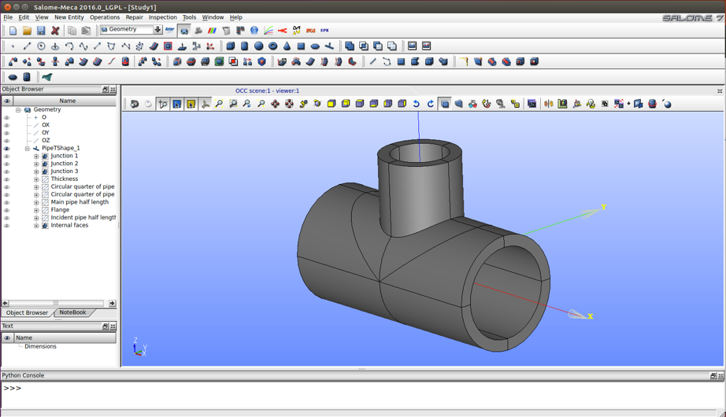{width="4.171349518810149in" height="2.401955380577428in"}

**Módulo de mallado (`Mesh`)**: es usado para generar mallas 1D, 2D o 3D
para los análisis numéricos. Para ello cuenta con varios algoritmos de
mallado propios.

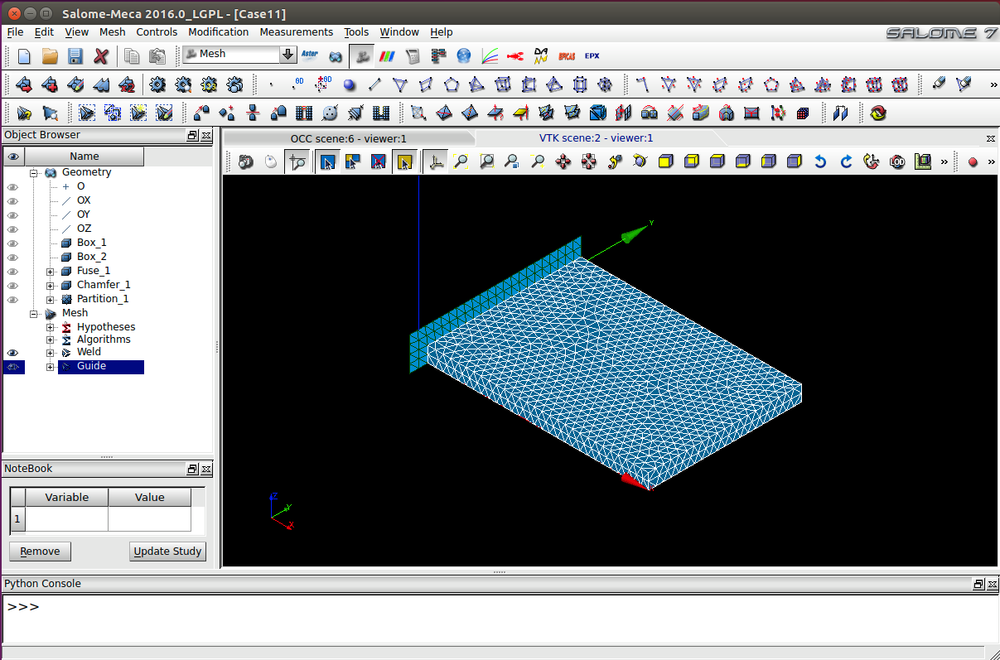{width="4.1909776902887135in" height="2.7639162292213473in"}

**Módulo de Code-Aster (`Aster`)**: como se ha descrito anteriormente,
Aster és un módulo destinado al área de cálculos mecánicos que incluye
las herramientas Eficas y Astk.

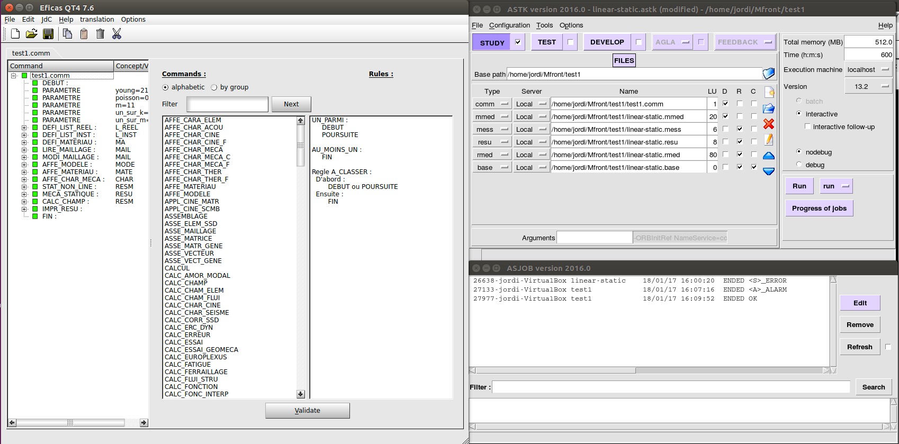{width="5.89375in" height="2.9145833333333333in"}

**Módulo de post-procesamiento (`ParaViS`):** éste módulo se usa para
analizar los resultados de la simulación incluyendo el software para
post-procesamiento ParaView, el cual tiene un sin fin de herramientas
utilizando técnicas cualitativas y cuantitativas de utilidad para poder
usar en el post-procesamiento de nuestros análisis numéricos.

{width="4.244300087489064in" height="2.7045100612423445in"}

Inclusión de librerías MFront a Salome-Meca
===========================================

Al realizar un estudio con Salome-Meca, puede resultar interesante, o de
utilidad, añadir algún tipo de comportamiento del material, algo que
como se ha visto en los puntos anteriores se puede definir con `MFront`.

Entonces, a lo largo de este punto se describirá, mediante un ejemplo,
como se puede añadir dicho comportamiento empezando con la generación de
éste y sus librerías, seguido de la creación del estudio en Salome-Meca
y acabando con la inclusión de este comportamiento en el módulo Aster.

## Generación de la librería con `MFront`

Para ver un ejemplo de cómo introducir una librería de comportamiento
material en un estudio en Salome-Meca, se procederá con la ley de
comportamiento viscoplástico de Lemaitre, cuyo modelo escrito de forma
implícita en `MFront` será el que se muestra en la Ilustración 12 que
puede ser escrito con un editor de texto genérico, y luego se guardará
el archivo con la extensión '*.mfront'*:

{width="4.199152449693789in" height="4.774054024496938in"}

La compilación del archivo se ejecutará a través del Terminal, donde con
el comando `--interface" se le indica el lenguaje destino con el que se
quiere usar la librería.

~~~~{.bash}
$ mfront --obuild --interface=aster Lemaitre.mfront
~~~~

Una vez compilado el archivo, si no hay ningún error en él, `MFront`
genera dos nuevos directorios en el directorio actual para almacenar los
archivos generados como se puede ver en la Ilustración 13

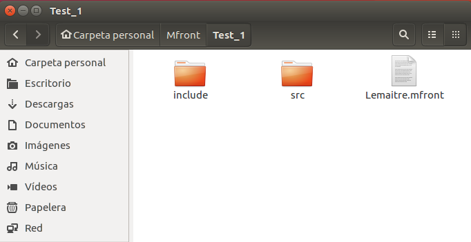{width="3.940816929133858in" height="2.030005468066492in"}

La librería generada necesaria para su uso en Salome-Meca, se encuentra
dentro del directorio `src` y se llama *`libAsterBehaviour.so`*.

## Generación de un modelo de estudio geométrico con Salome Meca

Antes de incluir la librería generada en el punto anterior, se debe
generar el modelo que se quiere estudiar en Salome-Meca.

Para ello, se debe ejecutar desde el terminal Salome-Meca desde el
directorio donde está instalado (generalmente en
*/root/salome_meca/appli_V2016/*):

:/root/salome_meca/appli_V2016 \$ ./salome

Una vez se haya cargado Salome-Meca, su pantalla inicial será como la
que se muestra en la Ilustración 14, donde se puede ver que en la parte
superior se encuentran las herramientas básicas de cualquier programa
(*'nuevo documento', 'abrir documento', 'guardar',* etc.), y a la
izquierda de estas herramientas, se encuentran los distintos módulos
disponibles de Salome-Meca, seleccionables desde el menú desplegable, o
directamente desde los botones a la derecha de este.

Estas herramientas son: `Aster, `JobManager, `Geometry, `Parametric,
`Mesh, `Homard, `ParaVis, `ADAO, `MED, `Eficas, `YACS, `Europlexus`.

Y finalmente, al pie del programa, se puede encontrar una consola Python
para poder trabajar en lenguaje Python.

{width="5.8909722222222225in" height="3.722916666666667in"}

Para empezar a crear un modelo de estudio útil para el ejemplo actual,
se deberá seleccionar el módulo `Geometry` donde aparecerá un dialogo
donde preguntará si se desea crear un nuevo proyecto, o abrir uno ya
existente.

Una vez activado el módulo Geometry, en la barra de menús principal, se
clicará sobre el menú New Entity Primitives Box, y emergerá una ventana
de dialogo en la que se deberá seleccionar el segundo algoritmo del
apartado Box y se dejará el resto tal y como aparece en la Ilustración
15 y para finalizar se clicará el botón de Apply and Close.

{width="2.6280325896762906in" height="2.1923326771653544in"}

Esto generará un cubo de las dimensiones especificadas, teniendo el
aspecto de la Ilustración 16.

{width="5.8909722222222225in" height="4.326388888888889in"}

El siguiente paso consiste en crear grupos que serán útiles para el
análisis de elementos finitos. Para ello se debe seleccionar la opción
New Entity Group Create Group.

Se deberá seleccionar la tercera opción en Shape Type para poder
seleccionar una cara entera del cubo. En el campo `Name` se le pondrá el
nombre que se le quiera dar al grupo, en este caso `Fix`. En el campo
Main Shape, si la geometría creada ya estaba seleccionada, aparecerá en
el campo automáticamente, sino, tan solo es necesario clicar sobre el
botón de la flecha y seleccionar la geometría sobre la que se quieren
crear los grupos. A continuación, se rotará el cubo hasta que sea
visible la cara inferior de este para poder seleccionarla, y se clicará
sobre el botón Add para que se pueda añadir la selección como aparece en
la Ilustración 17, se clicará sobre el botón inferior Apply, y se
repetirá este proceso cambiando el campo Name a `Press`, y seleccionando
la cara superior del cubo. Finalmente, ya se puede clicar sobre Apply
and Close.

{width="2.6280325896762906in" height="3.489505686789151in"}

Esto habrá creado los dos grupos sobre la geometría generada y el
navegador de objetos deberá tener el siguiente aspecto de la
Ilustración 18.

{width="1.8385258092738408in" height="1.3839654418197724in"}

Y con ello quedará concluida la creación del objeto de estudio sobre el
módulo de geometría.

## Mallado del modelo

El siguiente paso ahora, es crear un mallado del objeto creado en el
punto anterior para que se pueda hacer el estudio correspondiente, para
ello se debe seleccionar el módulo `Mesh` de Salome-Meca.

Una vez cargado el módulo, se creará el mallado desde el menú principal
Mesh Create Mesh lo cual mostrará la ventana de la Ilustración 19 donde
se seleccionará la geometría creada en el punto anterior `Box_1`, y se
seleccionará en el campo Algorithm el algoritmo Netgen 1D-2D-3D, y en el
campo Hypothesis se deberá clicar sobre el botón con forma de tuerca a
la derecha de este campo, y se seleccionará la opción NETGEN 3D
Parameters con lo que emergerá otra ventana con una serie de parámetros
que se dejarán en su valor predeterminado. Finalmente, se podrá clicar
sobre el botón de Apply and Close.

{width="3.3780325896762906in" height="2.543380358705162in"}

Esto añadirá los campos `Hypotheses`, ``Algorithms` y `Mesh_1` al
navegador de objetos.

{width="1.8725371828521435in" height="1.8670034995625546in"}

Ahora, haciendo clic derecho sobre el campo `Mesh_1` que aparece
seleccionado en la Ilustración 20, se deberá clicar sobre la opción
Compute con el dibujo de una tuerca, que también se puede clicar sobre
el botón con este mismo dibujo que aparece debajo del menú principal
desplegable de los módulos de seleccionables.

Con esto, aparecerá una ventana como la de la Ilustración 21 con los
resultados de la computación del mallado.

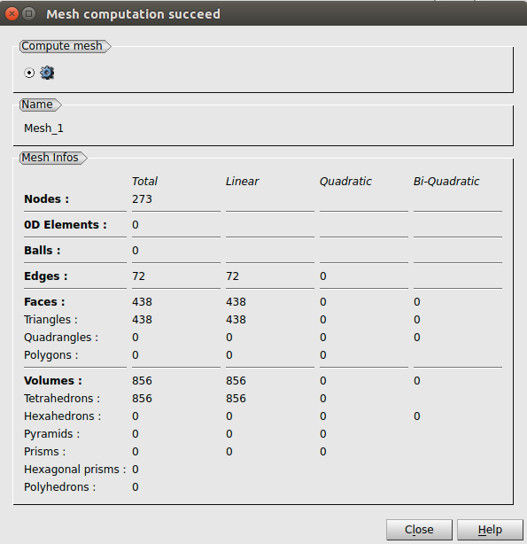{width="3.2322801837270343in" height="3.33536854768154in"}

Quedando el objeto creado en el módulo de geometría mallado como
aparece en la Ilustración 22.

{width="5.8909722222222225in" height="3.5541666666666667in"}

## Cálculo mecánico con el módulo Aster

Habiendo creado el modelo geométrico y habiéndole dado grupos
geométricos, y luego, habiendo creado un mallado 3D del modelo
geométrico que será usado para el análisis de elementos finitos, ahora
le toca el turno del módulo Aster de Salome-Meca.

Para ello, se debe seleccionar dicho módulo clicando sobre `Aster` en
el menú desplegable.

Asegurándose de que `Mesh_1` sigue seleccionado, se deberá acceder
desde la barra de menús principal a la opción Aster Wizards Linear
elastic, esto abrirá el cuadro de dialogo de la Ilustración 23 done pide
la definición del modelo.

{width="3.0030325896762906in" height="2.322865266841645in"}

En el siguiente paso (Ilustración 24), pide seleccionar el mallado sobre
el que se desea hacer el estudio.

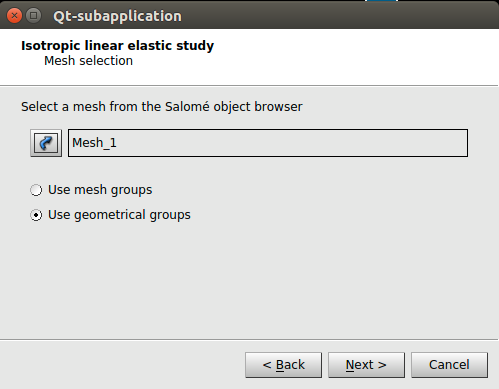{width="3.0030325896762906in" height="2.337892607174103in"}

En el siguiente cuadro de dialogo (Ilustración 25), se deben indicar el
valor de las propiedades del material.

{width="3.026200787401575in" height="2.3496423884514437in"}

En los dos siguientes pasos (Ilustración 26), se pueden añadir
condiciones de contorno al estudio.

{width="2.8896784776902886in" height="2.230425415573053in"}
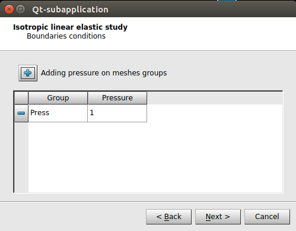{width="2.861943350831146in" height="2.2184481627296586in"}

Y finalmente, en el último paso, se le debe indicar el nombre del
archivo de comandos `.comm`

{width="2.8780325896762906in" height="2.2405774278215222in"}

Habiendo creado el estudio, aparecerán los nuevos campos (Ilustración
28) en el navegador de objetos.

{width="1.9404166666666667in" height="2.3741972878390203in"}

Y finalmente, se puede ejecutar el estudio haciendo clic derecho sobre
el estudio seleccionado en la ilustración anterior (`linear-static`), y
haciendo clic sobre la opción `Run`. Esto entregará (después de pasar
unos instantes de computación) un mensaje de información, el cual
indicará si todo ha salido bien, o de lo contrario mostrará un mensaje
de error. Además, este mensaje indica que, si todo ha salido bien, se
podrán ver los resultados de la simulación en el módulo ParaViS.

1.  Visualización de resultados en el módulo ParaViS

Si la ejecución del estudio anterior ha concluido sin errores, se pueden
observar sus resultados en el módulo `ParaViS`, y para ello se deberá
activar dicho módulo desde el menú desplegable.

Si al activar el módulo ParaViS, en el lado izquierdo del programa sigue
viéndose tan solo el navegador de objetos, será necesario añadir dos
vistas adicionales desde el menú principal View Windows `Pipeline
Browser` y `Display`.

Sobre la nueva ventana que se añadirá al lado izquierdo del programa
llamada `Pipeline Browser`, se podrá hacer clic derecho y luego clic
sobre la opción Open para añadir el archivo de resultados
`linear-static.rmed` generado por el módulo Aster como aparece en la
Ilustración 29.

{width="1.7530325896762904in" height="1.9244192913385827in"}

Una vez añadido el archivo de resultados, haciendo clic sobre el icono
situado a su izquierda con forma de ojo, se podrán ver los resultados
seleccionándolos desde el campo `Coloring` de la ventana `Display` como
se muestra en la Ilustración 30.

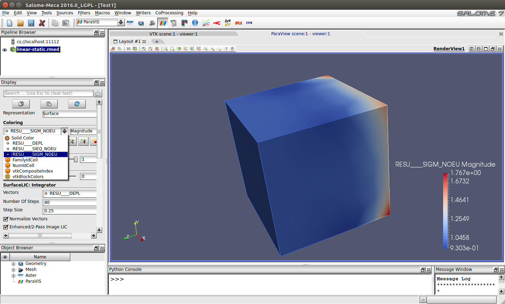{width="5.25303258967629in" height="3.1733333333333333in"}

## Modificación del archivo .comm para incluir la librería

Para poder incluir la librería generada con `MFront`, se debe modificar el
archivo de comandos `.comm` creado en el apartado '

Cálculo mecánico con el módulo Aster'.

Para ello, hay dos opciones disponibles. La primera es modificar
directamente el archivo con un editor de texto. Y la segunda y más
recomendable, consiste en modificarlo mediante el programa **EFICAS
Aster** el cual brinda la posibilidad de editar el archivo de comandos
sin dar opción a errores de edición.

El primer paso para la inclusión de librerías `MFront`, es asegurarse que
la versión con la que se está trabajando de Aster sea compatible con
`MFront`, es decir, si la versión instalada de Aster en Salome-Meca es
superior a la 13.2 no habrá ningún problema, pero en cambio, en la
versión de Salome-Meca instalada para este trabajo, la versión de Aster
13.2 estaba en fase de test, y por defecto trabajaba con una versión
anterior no compatible con `MFront`.

Para poder trabajar con la versión 13.2, con el módulo `Aster`
activado, se deberá hacer clic derecho sobre el estudio *linear-static*
en el navegador de objetos y hacer clic sobre la opción Edit, con lo que
aparecerá la ventana de la Ilustración 31 donde se deberá seleccionar la
versión 13.2 en el campo Aster Version.

{width="4.25303258967629in" height="2.84002624671916in"}

Ahora, clicando sobre el estudio *linear-static* del navegador,
aparecerán dos campos relativos a este. Donde desplegando el campo
`Data` aparecerá el archivo de comandos referente al estudio configurado
en el punto '

Cálculo mecánico con el módulo Aster'. Haciendo clic derecho sobre este
archivo se deberá hacer clic sobre la opción Run Eficas que, mostrará el
siguiente mensaje (Ilustración 32), donde se deberá seleccionar la
versión 13.2 de Aster.

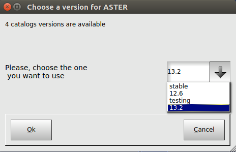{width="3.0030325896762906in" height="1.9349890638670166in"}

Una vez ya se ha seleccionado la opción, se ejecutará el programa
`Eficas` y tendrá el aspecto de la Ilustración 33, donde se puede ver
en el apartado izquierdo, los comandos incluidos en el archivo actual,
cada uno de ellos desplegable para mostrar sus parámetros adicionales,
en el apartado central se muestran las instrucciones o parámetros
disponibles, y finalmente en el derecho las reglas de uso de la
instrucción o parámetro seleccionado.

En la parte superior del bloque derecho aparecen tres pestañas. La
primera (Add Keyword) es la que indica las instrucciones o parámetros
disponibles según el comando seleccionado en la columna izquierda. La
función de la segunda pestaña (Concept's Name) es la de asignar un
nombre al comando seleccionado. Y finalmente, la función de la última
pestaña (New Command) es para añadir nuevos comandos.

{width="5.8909722222222225in" height="3.5840277777777776in"}

Además, haciendo clic derecho sobre la columna izquierda (donde aparecen
los comandos) se pueden añadir parámetros o comentarios. Así que se
puede empezar añadiendo los parámetros necesarios en el comportamiento
preparado con `MFront` que se quiera añadir al estudio como se puede ver
en la Ilustración 34.

{width="5.9006944444444445in" height="1.2770833333333333in"}

El siguiente comando DEFI_MATERIAU que consiste en la definición de los
parámetros describiendo el comportamiento de un material, ahora tiene
definidos el parámetro E (coeficiente de Young) y NU (Poisson) que ya se
habían definido al crear el estudio lineal elástico con Aster.

En este comando se deberán añadir los parámetros asociados al
comportamiento añadido con `MFront`, para ello se deberá añadir la
instrucción llamada MFRONT de la columna central cuando está
seleccionado el comando `DEFI_MATERIAU`. Añadida la instrucción,
aparecerá en la columna central un solo parámetro disponible
(`LISTE_COEF`) el cual se deberá añadir también.

A continuación, se pueden añadir los valores de forma manual, añadiendo
los valores a la lista (si no se hubieran definido previamente los
parámetros Young, poisson, m, etc…), o se podrán añadir los valores
directamente de los parámetros haciendo clic sobre el botón Parameters.
Esto mostrará una lista de los parámetros definidos anteriormente y se
podrán seleccionar los que interese y se deberá hacer clic sobre
Validate una vez ya estén seleccionados.

{width="5.8909722222222225in" height="2.0493055555555557in"}

Mientras se está editando un comando, las figuras (cuadrados, rombos y
círculos) situados a la izquierda de cada parámetro o instrucción
aparecen en amarillo y en rojo para indicar que aún no está completa o
es errónea la edición del comando como se puede observar en la
Ilustración 35. Cuando la edición esté completa y sea correcta, estos
elementos aparecerán de color verde. Hay que recordar, que al final de
la edición de un nuevo comando, Eficas requiere la asignación de un
nombre del comando, en el caso de `DEFI_MATERIAU` viene predefinido
como `MA`.

Ahora, el siguiente punto consiste en añadir al fichero de comandos la
librería creada con `MFront`.

Para ello, se añadirá un comando de computación no lineal que pueden
ser `STAT_NON_LINE`, `DYNA_NON_LINE` o `SIMU_POINT_MAT`. Seleccionando
uno de estos comandos, se le deberá añadir la instrucción COMPORTEMENT
en la que se deberá indicar que se trata de un comportamiento definido
por MFRONT en el campo RELATION. Esto añadirá dos campos adicionales.

En el primero, `LIBRARIE` se le deberá indicar la ruta completa de la
librería que se desea añadir al estudio como se muestra en la
Ilustración 36.

Y en el segundo campo, `NOM_ROUTINE`, permite especificar el modelo de
comportamiento elegido, lo cual es útil si se han compilado varias
leyes juntas. Este nombre se construye con la concatenación de
`aster` con el nombre definido en la instrucción `@Behaviour` del
archivo `MFront`.

{width="5.9006944444444445in" height="2.88125in"}

El último paso será añadir los cálculos que se deseen realizar en el
comando `CALC_CHAMP` indicándole en el campo RESULTAT que se harán sobre
el comportamiento añadido anterior (`RESM`) e indicándole dichos
análisis en el campo `b_non_lin`. Y finalmente se deberán añadir estos
análisis a la impresión de resultados en el comando `IMPR_RESU`
incluyéndolos en el campo b_extrac como se muestra en la Ilustración 37.

{width="4.25303258967629in" height="2.7829658792650918in"}

Con esto (guardando el archivo editado `.comm`), se puede dar por
concluida la edición básica del archivo de comandos para la inclusión de
la librería del comportamiento editado con `MFront`, quedando para el
usuario la edición del resto de comandos o parámetros del archivo según
los intereses de este. (El archivo .comm resultante de este ejemplo está
incluido en el “Anexo 5: Archivo de comandos Test_1.”)

Una vez editado el archivo de comandos, tan solo queda volver al módulo
Aster y ejecutar el análisis.

Si el resultado de la ejecución es satisfactorio (Ilustración 38) tan
solo queda ver los resultados en el módulo ParaVis (Ilustración 39)

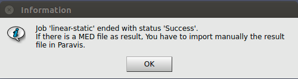{width="3.6280325896762906in" height="0.963568460192476in"}

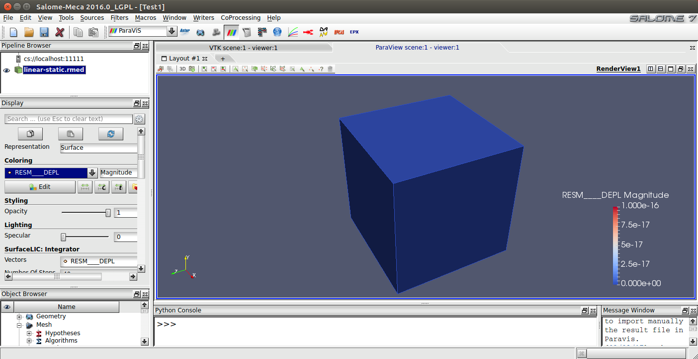{width="5.858018372703412in" height="3.0225798337707785in"}

Si la ejecución del análisis reporta un mensaje de error (Ilustración
41), se puede consultar el error cometido en el archivo guardado en el
directorio (donde se han guardado el resto de los archivos del estudio)
con la extensión `.resu` (Ilustración 41)

{width="3.6280325896762906in" height="0.9555774278215223in"}

{width="4.457160979877515in" height="2.8567377515310586in"}

Bibliografia
============

\[1\] Página oficial de TFEL / MFRONT:
[*http://tfel.sourceforge.net*](http://tfel.sourceforge.net)

\[2\] Página oficial de Salome:
[*http://www.salome-platform.org*](http://www.salome-platform.org)

\[3\] Página oficial de Code-Aster:
[*http://www.code-aster.org*](http://www.code-aster.org)

\[4\] Página oficial de CEA Cadarache:
[*http://www-cadarache.cea.fr*](http://www-cadarache.cea.fr)

\[5\] Información de EDF en Wikipedia
[*https://es.wikipedia.org/wiki/Électricité_de_France*](https://es.wikipedia.org/wiki/Électricité_de_France)

\[6\] Sección de documentos de MFront:
[*http://tfel.sourceforge.net/documentations.html*](http://tfel.sourceforge.net/documentations.html)

\[7\] Comportamientos mecánicos:
[*http://tfel.sourceforge.net/documents/mfront/behaviours.pdf*](http://tfel.sourceforge.net/documents/mfront/behaviours.pdf)

\[8\] Definición de material ortótropo:
[*https://es.wikipedia.org/wiki/Material_ortótropo*](https://es.wikipedia.org/wiki/Material_ortótropo)

\[9\] Mtest:
[*http://tfel.sourceforge.net/documents/mtest/mtest.pdf*](http://tfel.sourceforge.net/documents/mtest/mtest.pdf)

\[10\] Introducción a Salome y Salome-Meca:
[*http://calculixforwin.blogspot.com.es/2015/12/salome-platform-and-salome-meca.html*](http://calculixforwin.blogspot.com.es/2015/12/salome-platform-and-salome-meca.html)

\[11\] Introducción a Code-Aster:
[*http://ingenierialibreyabierta.blogspot.com.es/2016/03/analisis-numerico-estructural-fem-de_26.html\#more*](http://ingenierialibreyabierta.blogspot.com.es/2016/03/analisis-numerico-estructural-fem-de_26.html#more)

\[12\] Modelo de la ley de Lemaitre:
[*http://code-aster.org/doc/v12/en/man_r/r5/r5.03.08.pdf*](http://code-aster.org/doc/v12/en/man_r/r5/r5.03.08.pdf)

\[13\] Incluir un comportamiento en Code-Aster:
[*http://tfel.sourceforge.net/documents/tp/tp.pdf*](http://tfel.sourceforge.net/documents/tp/tp.pdf)

\[14\] Manual ASTK:
[*http://www.code-aster.org/doc/v12/en/man_u/u1/u1.04.00.pdf*](http://www.code-aster.org/doc/v12/en/man_u/u1/u1.04.00.pdf)

\[15\] Ejemplos de uso de Salome-Meca:
[*http://engineering.moonish.biz/fea.using-open-source-software/*](http://engineering.moonish.biz/fea.using-open-source-software/)

\[16\] Guia de uso de Mfront con Code-Aster:
[*http://www.code-aster.org/V2/doc/default/en/man_u/u2/u2.10.02.pdf*](http://www.code-aster.org/V2/doc/default/en/man_u/u2/u2.10.02.pdf)

\[17\] Manual de Code-Aster:
[*https://framabook.org/docs/Code_Aster/beginning_with_Code_Aster_JPAubry_20131206.pdf*](https://framabook.org/docs/Code_Aster/beginning_with_Code_Aster_JPAubry_20131206.pdf)

\[18\] Foro de TFEL/MFront:
https://sourceforge.net/p/tfel/discussion/installation/thread/49ea414b/

\[19\] Foro de Code-Aster: http://code-aster.org/forum2/

Anexo 1: Instalación de los prerequisitos {#anexo-1-instalación-de-los-prerequisitos .ListParagraph}
=========================================

El primero a tener en cuenta, es que, para utilizar los programas
necesarios de este documento, se necesitará trabajar en un entorno
Linux, por lo que, en el caso personal, se ha instalado un sistema
Ubuntu desde una máquina virtual en un equipo Mac.

En este punto, y los siguientes, para evitar problemas de accesos a
determinados archivos o carpetas, se trabajará como `root` desde el
Terminal del sistema:

~~~~{.bash}
$ sudo –i
~~~~

Para el correcto funcionamiento de los programas que se mencionan en
este documento, es necesaria la instalación de los siguientes paquetes
antes de instalar los programas en cuestión:

- `gcc`
- `nedit`
- `cmake`
- `geany`
- `python`
- `gvim`
- `python-dev`
- `ddd`
- `python-numpy`
- `xmgrace`
- `python-qt4`
- `grace`
- `tk`
- `gnuplot`
- `bison`
- `flex`
- `liblapack-dev`
- `libblas-dev`
- `zlib1g-dev`

Cada uno de estos paquetes se instalará usando el siguiente comando
desde el terminal (trabajando como `root`):

~~~~{.bash}
$ apt install [nombre_paquete]
~~~~

Anexo 2: Instalación de TFEL/MFRONT {#anexo-2-instalación-de-tfelmfront .ListParagraph}
=================================================================================================================================

Para la instalación del paquete de TFEL/MFRONT hay que tener en cuenta
que TFEL ya forma parte de las versiones superiores a la 12.03 de
Code-Aster y a las superiores a la 2015.1 de Salome-Meca, por lo que si
ya se dispone de alguno de estos productos no será necesaria su
instalación.

Se podrá descargar la última versión lanzada del producto desde la
página dedicada a la descarga de archivos de TFEL
([*https://sourceforge.net/projects/tfel/files/)*](https://sourceforge.net/projects/tfel/files/)),
donde a fecha de realización de este trabajo, la última versión
disponible era la **tfel-2.0.4**.

Una vez ya se haya descargado el archivo tfel-2.0.4.tar.bz2, se accederá
al directorio de descargas:

\$ cd /home/*\[nombre_usuario\]*/Descargas

Y se descomprimirá el archivo descargado:

\$ tar xvf tfel-2.0.4.tar.bz2

Antes de proceder a la instalación del paquete descargado, hay que
asegurarse que la versión de `cmake` sea superior a la 2.8:

\$ cmake --version

Si se cumple, ya se puede proceder a la instalación:

\$ cmake \[opciones\]

\$ make

\$ make install

Donde las opciones serán según las preferencias del usuario, por
ejemplo, una instalación recomendada sería:

\$ cmake –DCMAKE_BUILD_TYPE=Release –Dlocal-castem-header=ON
–Denable-fortran=ON –Denable-aster=ON –DCMAKE_INSTALL_PREFIX=
/root/tfel

Finalmente, para asegurarse que la instalación se ha realizado
correctamente, tan solo queda probarlo:

{width="5.792791994750656in"
height="0.8016907261592301in"}

Anexo 3: Instalación de Salome-Meca {#anexo-3-instalación-de-salome-meca .ListParagraph}
========================================================================================

Para la instalación de Salome-Meca se podrá efectuar la descarga del
archivo desde la página oficial de Code-Aster
([*www.code-aster.org)*](http://www.code-aster.org)) donde en el menú
principal se deberá acceder a la sección de descargas (`Download` o
*Téléchargement*).

La sección de descargar dispone de un menú a la izquierda desde donde se
podrá acceder a la sección *Salome-Meca* y donde ya se podrá descargar
las distintas versiones lanzadas de Salome-Meca. La última al día de la
elaboración de este documento, `Salome-Meca 2016`.

Entonces, una vez ya descargado el paquete deseado, se accede a la
carpeta de descargas y se deberá descomprimir el binario descargado:

\$ tar xvf SALOME-MECA-2016-LGPL-1.tgz

Y cuando se haya descomprimido, se puede ejecutar el instalador:

\$ ./SMECA_V2016_LGPL.run

Cuando se haya instalado se podrá acceder donde se haya instalado (por
defecto /root/salome_meca), y desde ese directorio, para ejecutar-lo:

\$ cd appli_V2016

\$ ./salome

Anexo 4: Instrucciones disponibles en MFront {#anexo-4-instrucciones-disponibles-en-mfront .ListParagraph}
==========================================================================================================

A continuación, se detallan el conjunto de instrucciones disponibles en
MFront marcando en qué analizadores se pueden usar cada una de ellas.

  -------------------------------------------------------------------------------------------------------------------------------------------------------------------------------------------------------------------------------------------------------------------------------------------------------------------------------------------------------------------------------------------------------
  `INSTRUCCIONES`                                   > `DefaultParser`   > `DefaultCZMParser`   > `DefaultFiniteStrainParser`   > `Implicit`   > `ImplicitFiniteStrain`   > `ImplicitII`   > `IsotropicMisesCreep`   > `IsotropicPlasticMisesFlow`   > `IsotropicStrainHardeningMisesCreep`   > `MaterialLaw`   > `Model`   > `MultipleIsotropicMisesFlows`   > `RungeKutta`
                                                                                                                                       >
                                                                                                                                       > `Implicit`
  --------------------------------------------------- --------------------- ------------------------ --------------------------------- ---------------- ---------------------------- ------------------ --------------------------- --------------------------------- ------------------------------------------ ------------------- ------------- ----------------------------------- ------------------
  `@Algorithm`                                                                                                                           ✔                ✔                            ✔                                                                                                                                                                                                 ✔

  `@Author`                                             ✔                     ✔                        ✔                                 ✔                ✔                            ✔                  ✔                           ✔                                 ✔                                          ✔                   ✔             ✔                                   ✔

  `@AuxiliaryStateVar`                                  ✔                     ✔                        ✔                                 ✔                ✔                            ✔                  ✔                           ✔                                 ✔                                                                            ✔                                   ✔

  `@AuxiliaryStateVariable`                             ✔                     ✔                        ✔                                 ✔                ✔                            ✔                  ✔                           ✔                                 ✔                                                                            ✔

  `@Behaviour`                                          ✔                     ✔                        ✔                                 ✔                ✔                            ✔                  ✔                           ✔                                 ✔                                                                            ✔                                   ✔

  `@Bounds`                                             ✔                     ✔                        ✔                                 ✔                ✔                            ✔                  ✔                           ✔                                 ✔                                          ✔                   ✔             ✔                                   ✔

  `@Coef`                                               ✔                     ✔                        ✔                                 ✔                ✔                            ✔                  ✔                           ✔                                 ✔                                                                            ✔                                   ✔

  `@CompareToNumericalJacobian`                                                                                                          ✔                ✔                            ✔

  `@ComputedVar`                                                                                                                         ✔                ✔                            ✔                                                                                                                                                                                                 ✔

  `@ComputeFinalStress`                                                                                                                  ✔                ✔                            ✔

  `@ComputeStress`                                                                                                                       ✔                ✔                            ✔                                                                                                                                                                                                 ✔

  `@ComputeThermalExpansion`                            ✔                     ✔                        ✔                                 ✔                ✔                            ✔                  ✔                           ✔                                 ✔                                                                            ✔                                   ✔

  `@Constant`                                                                                                                                                                                                                                                                                                      ✔

  `@ConstantMaterialProperty`                                                                                                                                                                                                                                                                                                          ✔

  `@Date`                                               ✔                     ✔                        ✔                                 ✔                ✔                            ✔                  ✔                           ✔                                 ✔                                          ✔                   ✔             ✔                                   ✔

  `@Derivative`                                                                                                                                                                                                                                                                                                                                                                          ✔

  `@Description`                                        ✔                     ✔                        ✔                                 ✔                ✔                            ✔                  ✔                           ✔                                 ✔                                          ✔                   ✔             ✔                                   ✔

  `@Domain`                                                                                                                                                                                                                                                                                                                            ✔

  `@Domains`                                                                                                                                                                                                                                                                                                                           ✔

  `@DSL`                                                ✔                     ✔                        ✔                                 ✔                ✔                            ✔                  ✔                           ✔                                 ✔                                                                            ✔                                   ✔

  `@Epsilon`                                                                                                                             ✔                ✔                            ✔                  ✔                           ✔                                 ✔                                                                            ✔                                   ✔

  `@ExternalStateVar`                                   ✔                     ✔                        ✔                                 ✔                ✔                            ✔                  ✔                           ✔                                 ✔                                                                            ✔                                   ✔

  `@ExternalStateVariable`                              ✔                     ✔                        ✔                                 ✔                ✔                            ✔                  ✔                           ✔                                 ✔                                                                            ✔                                   ✔

  `@FlowRule`                                                                                                                                                                                             ✔                           ✔                                 ✔                                                                            ✔

  `@Function`                                                                                                                                                                                                                                                                                                      ✔                   ✔

  `@GlobalParameter`                                                                                                                                                                                                                                                                                                                   ✔

  `@Import`                                             ✔                     ✔                        ✔                                 ✔                ✔                            ✔                  ✔                           ✔                                 ✔                                          ✔                   ✔             ✔                                   ✔

  `@Includes`                                           ✔                     ✔                        ✔                                 ✔                ✔                            ✔                  ✔                           ✔                                 ✔                                          ✔                   ✔             ✔                                   ✔

  `@InitializeJacobian`                                                                                                                  ✔                ✔                            ✔

  `@InitializeJacobianInvert`                                                                                                            ✔                ✔                            ✔

  `@InitializeLocalVariables`                           ✔                     ✔                        ✔                                 ✔                ✔                            ✔                  ✔                           ✔                                 ✔                                                                            ✔                                   ✔

  `@InitJacobian`                                                                                                                        ✔                ✔                            ✔

  `@InitJacobianInvert`                                                                                                                  ✔                ✔                            ✔

  `@InitLocalVariables`                                 ✔                     ✔                        ✔                                 ✔                ✔                            ✔                  ✔                           ✔                                 ✔                                                                            ✔                                   ✔

  `@InitLocalVars`                                      ✔                     ✔                        ✔                                 ✔                ✔                            ✔                  ✔                           ✔                                 ✔                                                                            ✔                                   ✔

  `@Input`                                                                                                                                                                                                                                                                                                         ✔                   ✔

  `@IntegerConstant`                                    ✔                     ✔                        ✔                                 ✔                ✔                            ✔                  ✔                           ✔                                 ✔                                                                            ✔                                   ✔

  `@IntegrationVariable`                                                                                                                 ✔                ✔                            ✔

  `@Integrator`                                         ✔                     ✔                        ✔                                 ✔                ✔                            ✔                  ✔                           ✔                                 ✔                                                                            ✔                                   ✔

  `@Interface`                                          ✔                     ✔                        ✔                                 ✔                ✔                            ✔                  ✔                           ✔                                 ✔                                          ✔                                 ✔                                   ✔

  `@IsotropicBehaviour`                                 ✔                     ✔                        ✔                                 ✔                ✔                            ✔                  ✔                           ✔                                 ✔                                                                            ✔                                   ✔

  `@IsotropicElasticBehaviour`                          ✔                     ✔                        ✔                                 ✔                ✔                            ✔                  ✔                           ✔                                 ✔                                                                            ✔                                   ✔

  `@IsTangentOperatorSymmetric`                         ✔                     ✔                        ✔                                 ✔                ✔                            ✔                                                                                                                                                                                                 ✔

  `@IterMax`                                                                                                                             ✔                ✔                            ✔                  ✔                           ✔                                 ✔                                                                            ✔

  `@JacobianComparisonCriterion`                                                                                                         ✔                ✔                            ✔

  `@JacobianComparisonCriterium`                                                                                                         ✔                ✔                            ✔

  `@Law`                                                                                                                                                                                                                                                                                                           ✔

  `@Library`                                            ✔                     ✔                        ✔                                 ✔                ✔                            ✔                  ✔                           ✔                                 ✔                                          ✔                                 ✔                                   ✔

  `@Link`                                               ✔                     ✔                        ✔                                 ✔                ✔                            ✔                  ✔                           ✔                                 ✔                                          ✔                                 ✔                                   ✔

  `@LocalParameter`                                                                                                                                                                                                                                                                                                                    ✔

  `@LocalVar`                                           ✔                     ✔                        ✔                                 ✔                ✔                            ✔                  ✔                           ✔                                 ✔                                                                            ✔                                   ✔

  `@LocalVariable`                                      ✔                     ✔                        ✔                                 ✔                ✔                            ✔                  ✔                           ✔                                 ✔                                                                            ✔                                   ✔

  `@Material`                                           ✔                     ✔                        ✔                                 ✔                ✔                            ✔                  ✔                           ✔                                 ✔                                          ✔                   ✔             ✔                                   ✔

  `@MaterialLaw`                                        ✔                     ✔                        ✔                                 ✔                ✔                            ✔                  ✔                           ✔                                 ✔                                          ✔                   ✔             ✔                                   ✔

  `@MaterialProperty`                                   ✔                     ✔                        ✔                                 ✔                ✔                            ✔                  ✔                           ✔                                 ✔                                                                            ✔                                   ✔

  `@MaximumIncrementValuePerIteration`                                                                                                   ✔                ✔                            ✔

  `@MaximumNumberOfIterations`                                                                                                           ✔                ✔                            ✔

  `@Members`                                            ✔                     ✔                        ✔                                 ✔                ✔                            ✔                  ✔                           ✔                                 ✔                                                                            ✔                                   ✔

  `@Mfront`                                             ✔                     ✔                        ✔                                 ✔                ✔                            ✔                  ✔                           ✔                                 ✔                                          ✔                                 ✔                                   ✔

  `@MinimalTimeStep`                                                                                                                                                                                                                                                                                                                                                                     ✔

  `@Model`                                                                                                                                                                                                                                                                                                                             ✔

  `@ModellingHypotheses`                                ✔                     ✔                        ✔                                 ✔                ✔                            ✔                  ✔                           ✔                                 ✔                                                                            ✔                                   ✔

  `@OrthotropicBehaviour`                               ✔                     ✔                        ✔                                 ✔                ✔                            ✔                  ✔                           ✔                                 ✔                                                                            ✔                                   ✔

  `@Output`                                                                                                                                                                                                                                                                                                        ✔                   ✔

  `@Parameter`                                          ✔                     ✔                        ✔                                 ✔                ✔                            ✔                  ✔                           ✔                                 ✔                                          ✔                                 ✔                                   ✔

  `@Parser`                                             ✔                     ✔                        ✔                                 ✔                ✔                            ✔                  ✔                           ✔                                 ✔                                          ✔                   ✔             ✔                                   ✔

  `@PerturbationValueForNumericalJacobianComputation`                                                                                    ✔                ✔                            ✔

  `@PhysicalBounds`                                     ✔                     ✔                        ✔                                 ✔                ✔                            ✔                  ✔                           ✔                                 ✔                                          ✔                   ✔             ✔                                   ✔

  `@PredictionOperator`                                 ✔                     ✔                        ✔                                 ✔                ✔                            ✔                  ✔                           ✔                                 ✔                                                                            ✔                                   ✔

  `@Predictor`                                                                                                                           ✔                ✔                            ✔

  `@Private`                                            ✔                     ✔                        ✔                                 ✔                ✔                            ✔                  ✔                           ✔                                 ✔                                                                            ✔                                   ✔

  `@Profiling`                                          ✔                     ✔                        ✔                                 ✔                ✔                            ✔                  ✔                           ✔                                 ✔                                                                            ✔                                   ✔

  `@ProvidesSymmetricTangentOperator`                   ✔                     ✔                        ✔

  `@ProvidesTangentOperator`                            ✔                     ✔                        ✔

  `@RequireStiffnessOperator`                           ✔                     ✔                        ✔                                 ✔                ✔                            ✔                  ✔                           ✔                                 ✔                                                                            ✔                                   ✔

  `@RequireStiffnessTensor`                             ✔                     ✔                        ✔                                 ✔                ✔                            ✔                  ✔                           ✔                                 ✔                                                                            ✔                                   ✔

  `@RequireThermalExpansionCoefficientTensor`           ✔                     ✔                        ✔                                 ✔                ✔                            ✔                  ✔                           ✔                                 ✔                                                                            ✔                                   ✔

  `@Sources`                                            ✔                     ✔                        ✔                                 ✔                ✔                            ✔                  ✔                           ✔                                 ✔                                                                            ✔                                   ✔

  `@StateVar`                                           ✔                     ✔                        ✔                                 ✔                ✔                            ✔                  ✔                           ✔                                 ✔                                                                            ✔                                   ✔

  `@StateVariable`                                      ✔                     ✔                        ✔                                 ✔                ✔                            ✔                  ✔                           ✔                                 ✔                                                                            ✔                                   ✔

  `@StaticVar`                                          ✔                     ✔                        ✔                                 ✔                ✔                            ✔                  ✔                           ✔                                 ✔                                          ✔                   ✔             ✔                                   ✔

  `@StaticVariable`                                     ✔                     ✔                        ✔                                 ✔                ✔                            ✔                  ✔                           ✔                                 ✔                                          ✔                   ✔             ✔                                   ✔

  `@TangentOperator`                                    ✔                     ✔                        ✔                                 ✔                ✔                            ✔                                                                                                                                                                                                 ✔

  `@Theta`                                                                                                                               ✔                ✔                            ✔                  ✔                           ✔                                 ✔                                                                            ✔

  `@UpdateAuxiliaryStateVariables`                      ✔                     ✔                        ✔                                 ✔                ✔                            ✔                  ✔                           ✔                                 ✔                                                                            ✔                                   ✔

  `@UpdateAuxiliaryStateVars`                           ✔                     ✔                        ✔                                 ✔                ✔                            ✔                  ✔                           ✔                                 ✔                                                                            ✔                                   ✔

  `@UsableInPurelyImplicitResolution`                                                                                                    ✔                ✔                            ✔                  ✔                           ✔                                                                                                              ✔                                   ✔

  `@UseQt`                                              ✔                     ✔                        ✔                                 ✔                ✔                            ✔                  ✔                           ✔                                 ✔                                                                            ✔                                   ✔
  -------------------------------------------------------------------------------------------------------------------------------------------------------------------------------------------------------------------------------------------------------------------------------------------------------------------------------------------------------------------------------------------------------

Anexo 5: Archivo de comandos Test_1.comm {#anexo-5-archivo-de-comandos-test_1.comm .ListParagraph}
==================================================================================================

En este anexo se incluye el archivo resultante del apartado
“Modificación del archivo .comm para incluir la librería” donde se
modifica un archivo .comm ya generado con la ayuda del programa
`EFICAS Aster` para poder incluir en él una librería ya generada con
`MFront`.

En él se puede ver que los comandos importantes donde hay que fijarse
para la inclusión de una librería en el estudio son:

`DEFI_MATERIAU`: donde se le deberá indicar que trabajará con unos
materiales definidos por MFRONT.

`STAT_NON_LINE` (o cualquier otro comando de computación): donde se le
deberá indicar la ruta completa de donde se encuentra la librería en
cuestión.

~~~~{.python}
DEBUT();
young = 210000;
poisson = 0.3;
m = 11;
un_sur_k = 0.00032840723;
un_sur_m = 0.178571429;
L_REEL=DEFI_LIST_REEL(DEBUT=0.0,
INTERVALLE=(_F(JUSQU_A=0.02,
PAS=0.002,),
_F(JUSQU_A=0.06,
PAS=0.004,),
_F(JUSQU_A=0.24,
PAS=0.01,),),);
L_INST=DEFI_LIST_INST(DEFI_LIST=_F(METHODE='MANUEL',
LIST_INST=L_REEL,),);
MA=**DEFI_MATERIAU**(ELAS=_F(E=2.1e+11,
NU=0.3,),
**MFRONT=_F(LISTE_COEF=(young,poisson,m,un_sur_k,un_sur_m,),)**,);
MAIL=LIRE_MAILLAGE(FORMAT='MED',);
MAIL=MODI_MAILLAGE(reuse =MAIL,
MAILLAGE=MAIL,
ORIE_PEAU_3D=_F(GROUP_MA='Press',),);
MODE=AFFE_MODELE(MAILLAGE=MAIL,
AFFE=_F(TOUT='OUI',
PHENOMENE='MECANIQUE',
MODELISATION='3D',),);
MATE=AFFE_MATERIAU(MAILLAGE=MAIL,
AFFE=_F(TOUT='OUI',
MATER=MA,),);
CHAR=AFFE_CHAR_MECA(MODELE=MODE,
DDL_IMPO=_F(GROUP_MA='Fix',
DX=0.0,
DY=0.0,
DZ=0.0,),
PRES_REP=_F(GROUP_MA='Press',
PRES=1.0,),);
RESM=**STAT_NON_LINE**(MODELE=MODE,
CHAM_MATER=MATE,
EXCIT=_F(CHARGE=CHAR,),
**COMPORTEMENT=_F(RELATION='MFRONT',
LIBRAIRIE='/home/jordi/Mfront/Test_1/src/libAsterBehaviour.so',**
**NOM_ROUTINE='asterlemaitre',),**
INCREMENT=_F(LIST_INST=L_INST,),
NEWTON=_F(REAC_INCR=1,
REAC_ITER=1,),);
RESU=MECA_STATIQUE(MODELE=MODE,
CHAM_MATER=MATE,
EXCIT=_F(CHARGE=CHAR,),);
RESM=CALC_CHAMP(reuse =RESM,
RESULTAT=RESM,
PRECISION=1e-06,
CONTRAINTE=('SIGM_ELNO','SIGM_NOEU',),
CRITERES=('SIEQ_ELNO','SIEQ_NOEU',),);
IMPR_RESU(FORMAT='MED',
UNITE=80,
RESU=_F(RESULTAT=RESM,
NOM_CHAM=('SIGM_NOEU','SIEQ_NOEU','DEPL','SIGM_ELNO','SIEQ_ELNO',),),);
FIN();
~~~~
